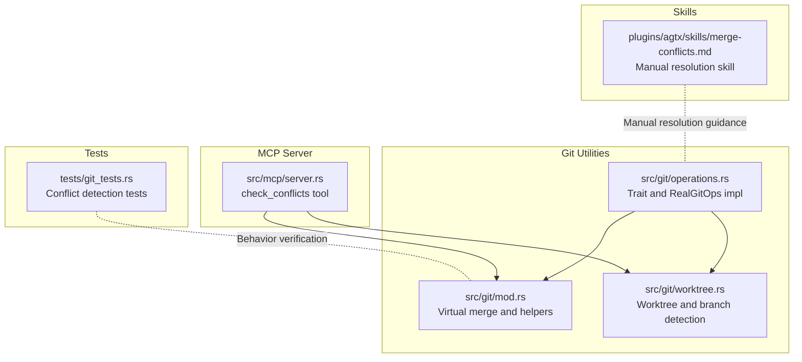
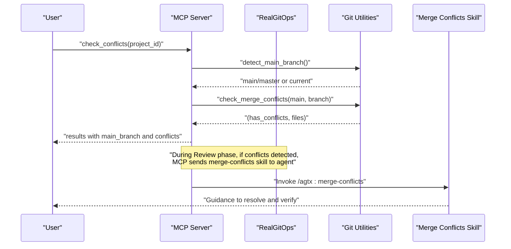
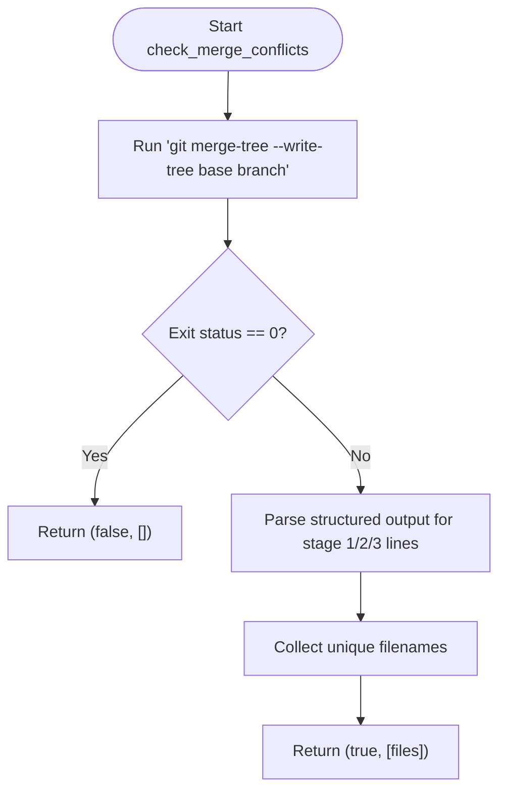
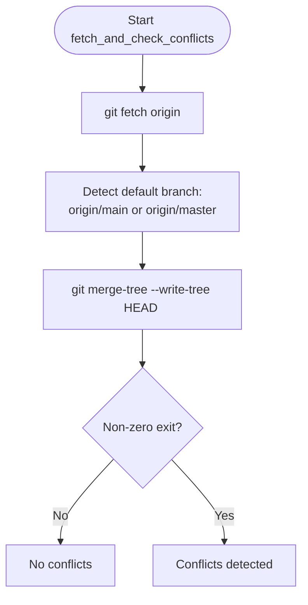
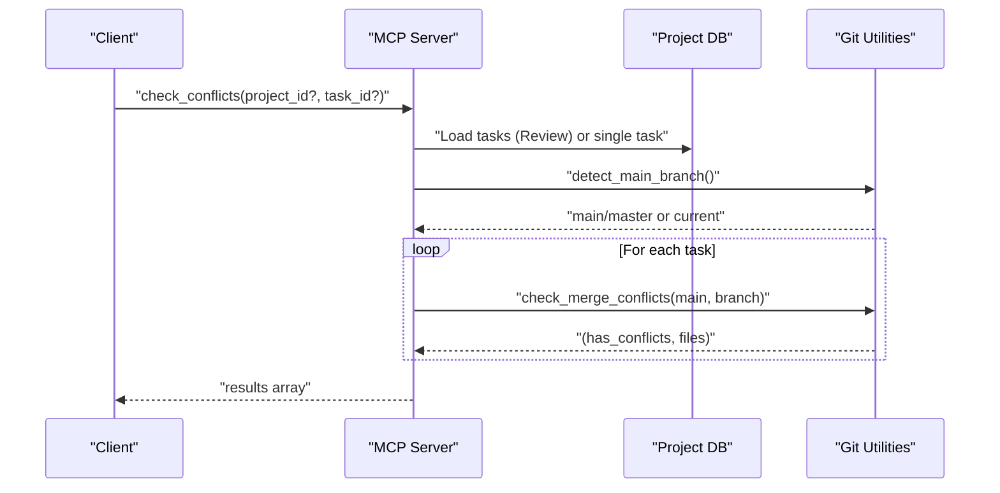
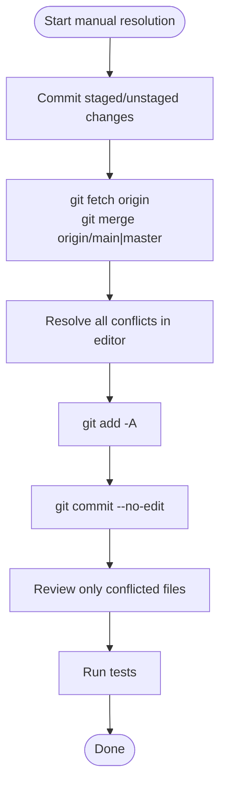
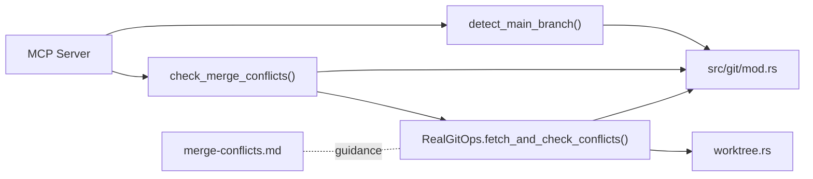

# Conflict Resolution

<cite>
**Referenced Files in This Document**
- [merge-conflicts.md](file://plugins/agtx/skills/merge-conflicts.md)
- [mod.rs](file://src/git/mod.rs)
- [operations.rs](file://src/git/operations.rs)
- [worktree.rs](file://src/git/worktree.rs)
- [server.rs](file://src/mcp/server.rs)
- [README.md](file://README.md)
- [git_tests.rs](file://tests/git_tests.rs)
</cite>

## Table of Contents
1. [Introduction](#introduction)
2. [Project Structure](#project-structure)
3. [Core Components](#core-components)
4. [Architecture Overview](#architecture-overview)
5. [Detailed Component Analysis](#detailed-component-analysis)
6. [Dependency Analysis](#dependency-analysis)
7. [Performance Considerations](#performance-considerations)
8. [Troubleshooting Guide](#troubleshooting-guide)
9. [Conclusion](#conclusion)

## Introduction
This document explains how AGTX detects and resolves Git merge conflicts using a non-destructive virtual merge technique. It covers the conflict detection workflow, default branch identification, and the practical steps for resolving conflicts. It also provides strategies for manual and automated conflict handling, rollback procedures, prevention techniques, and troubleshooting guidance for persistent conflicts.

## Project Structure
The conflict resolution capability spans several modules:
- Git utilities for detecting default branches, performing virtual merges, and managing worktrees
- MCP server tools for conflict checks and task orchestration
- Built-in skill for manual conflict resolution
- Tests validating conflict detection behavior

**Diagram sources**
- [mod.rs:89-128](file://src/git/mod.rs#L89-L128)
- [operations.rs:57-60](file://src/git/operations.rs#L57-L60)
- [worktree.rs:241-273](file://src/git/worktree.rs#L241-L273)
- [server.rs:760-832](file://src/mcp/server.rs#L760-L832)
- [merge-conflicts.md:1-53](file://plugins/agtx/skills/merge-conflicts.md#L1-L53)
- [git_tests.rs:470-570](file://tests/git_tests.rs#L470-L570)

**Section sources**
- [mod.rs:1-142](file://src/git/mod.rs#L1-L142)
- [operations.rs:1-276](file://src/git/operations.rs#L1-L276)
- [worktree.rs:1-345](file://src/git/worktree.rs#L1-L345)
- [server.rs:760-832](file://src/mcp/server.rs#L760-L832)
- [merge-conflicts.md:1-53](file://plugins/agtx/skills/merge-conflicts.md#L1-L53)
- [git_tests.rs:470-570](file://tests/git_tests.rs#L470-L570)

## Core Components
- Virtual merge detection: Uses git merge-tree --write-tree to predict conflicts without touching the working tree.
- Default branch detection: Identifies main or master on the remote, falling back to the current branch if needed.
- Conflict review tool: MCP tool that checks all Review tasks’ feature branches against the default branch.
- Manual resolution skill: Step-by-step guidance for resolving conflicts and verifying changes.
- Worktree management: Creates isolated workspaces per task to reduce concurrent editing conflicts.

Key capabilities:
- Non-destructive conflict checks via merge-tree
- Automatic default branch detection
- MCP-based conflict review and remediation
- Manual resolution steps with verification guidance

**Section sources**
- [mod.rs:89-128](file://src/git/mod.rs#L89-L128)
- [operations.rs:211-243](file://src/git/operations.rs#L211-L243)
- [worktree.rs:241-273](file://src/git/worktree.rs#L241-L273)
- [server.rs:760-832](file://src/mcp/server.rs#L760-L832)
- [merge-conflicts.md:1-53](file://plugins/agtx/skills/merge-conflicts.md#L1-L53)

## Architecture Overview
The conflict resolution pipeline integrates Git operations, MCP tools, and a manual skill.

**Diagram sources**
- [server.rs:760-832](file://src/mcp/server.rs#L760-L832)
- [mod.rs:89-128](file://src/git/mod.rs#L89-L128)
- [worktree.rs:241-273](file://src/git/worktree.rs#L241-L273)
- [merge-conflicts.md:1-53](file://plugins/agtx/skills/merge-conflicts.md#L1-L53)

## Detailed Component Analysis

### Virtual Merge Checking with git merge-tree
AGTX performs a non-destructive conflict check using git merge-tree --write-tree. This command:
- Compares two trees (base and branch) without updating the working tree
- Exits with a non-zero status when conflicts are detected
- Outputs structured lines indicating conflicting files and stages

Implementation highlights:
- Executes merge-tree with base and branch arguments
- Parses structured output to collect unique conflicting filenames
- Returns a tuple indicating whether conflicts exist and which files are affected

**Diagram sources**
- [mod.rs:89-128](file://src/git/mod.rs#L89-L128)

**Section sources**
- [mod.rs:89-128](file://src/git/mod.rs#L89-L128)
- [git_tests.rs:470-570](file://tests/git_tests.rs#L470-L570)

### Default Branch Detection and Fetch-and-Check Workflow
AGTX determines the default branch by:
- Attempting origin/main; if present, uses origin/main
- Otherwise attempting origin/master; if present, uses origin/master
- Falling back to the current branch if neither remote ref exists

It then performs a fetch-and-check:
- Fetches from origin
- Runs merge-tree HEAD vs origin/main or origin/master
- Reports whether conflicts exist

**Diagram sources**
- [operations.rs:211-243](file://src/git/operations.rs#L211-L243)
- [worktree.rs:241-273](file://src/git/worktree.rs#L241-L273)

**Section sources**
- [operations.rs:211-243](file://src/git/operations.rs#L211-L243)
- [worktree.rs:241-273](file://src/git/worktree.rs#L241-L273)

### Conflict Detection Tool in MCP Server
The MCP server’s check_conflicts tool:
- Resolves the project path
- Detects the default branch
- Iterates Review tasks and checks each feature branch against the default branch
- Returns a list of tasks with conflict status and affected files

**Diagram sources**
- [server.rs:760-832](file://src/mcp/server.rs#L760-L832)
- [mod.rs:89-128](file://src/git/mod.rs#L89-L128)

**Section sources**
- [server.rs:760-832](file://src/mcp/server.rs#L760-L832)
- [mod.rs:89-128](file://src/git/mod.rs#L89-L128)

### Manual Conflict Resolution Skill
The merge-conflicts skill provides a step-by-step process:
- Commit current changes to avoid losing work
- Fetch and merge the default branch into the feature branch
- Resolve all conflicts, noting conflicted files
- Stage and commit the merged result
- Review only the previously conflicted files to verify correctness
- Run tests to ensure no regressions

**Diagram sources**
- [merge-conflicts.md:10-44](file://plugins/agtx/skills/merge-conflicts.md#L10-L44)

**Section sources**
- [merge-conflicts.md:1-53](file://plugins/agtx/skills/merge-conflicts.md#L1-L53)

### Worktree-Based Prevention and Isolation
AGTX isolates each task in its own worktree:
- Creates a new branch per task from the detected default branch
- Copies agent configuration directories and optional project files into the worktree
- Removes worktrees on completion or failure, minimizing cross-task interference

Benefits:
- Reduces simultaneous edits on the same files
- Encourages smaller, focused changes per task
- Simplifies cleanup and rollback

**Section sources**
- [worktree.rs:8-65](file://src/git/worktree.rs#L8-L65)
- [worktree.rs:129-223](file://src/git/worktree.rs#L129-L223)

## Dependency Analysis
- MCP server depends on Git utilities for branch detection and conflict checks
- RealGitOps implements GitOperations and encapsulates Git command execution
- The merge-conflicts skill is a user-facing guide that complements automated checks
- Tests validate the behavior of virtual merge detection and default branch detection

**Diagram sources**
- [server.rs:760-832](file://src/mcp/server.rs#L760-L832)
- [mod.rs:89-128](file://src/git/mod.rs#L89-L128)
- [operations.rs:211-243](file://src/git/operations.rs#L211-L243)
- [worktree.rs:241-273](file://src/git/worktree.rs#L241-L273)
- [merge-conflicts.md:1-53](file://plugins/agtx/skills/merge-conflicts.md#L1-L53)

**Section sources**
- [server.rs:760-832](file://src/mcp/server.rs#L760-L832)
- [mod.rs:89-128](file://src/git/mod.rs#L89-L128)
- [operations.rs:211-243](file://src/git/operations.rs#L211-L243)
- [worktree.rs:241-273](file://src/git/worktree.rs#L241-L273)
- [merge-conflicts.md:1-53](file://plugins/agtx/skills/merge-conflicts.md#L1-L53)

## Performance Considerations
- Virtual merge checks are fast and non-destructive, avoiding unnecessary working tree writes
- Using origin/main or origin/master reduces ambiguity and speeds up conflict detection
- Worktrees isolate tasks, reducing contention and improving throughput across parallel agents

## Troubleshooting Guide

### Persistent Conflicts Between Feature Branch and Default Branch
- Confirm default branch detection:
  - Check whether origin/main or origin/master exists remotely
  - If neither exists, the system falls back to the current branch
- Run a virtual merge to identify conflicting files:
  - Use the MCP tool to check conflicts for Review tasks
  - Alternatively, call the underlying check_merge_conflicts function
- Resolve conflicts manually:
  - Follow the merge-conflicts skill steps
  - Focus on previously conflicted files during verification
- If conflicts persist:
  - Re-run the virtual merge to confirm remaining conflicts
  - Consider rebasing the feature branch onto the default branch before merging
  - Ensure tests pass after resolution

**Section sources**
- [server.rs:760-832](file://src/mcp/server.rs#L760-L832)
- [mod.rs:89-128](file://src/git/mod.rs#L89-L128)
- [merge-conflicts.md:1-53](file://plugins/agtx/skills/merge-conflicts.md#L1-L53)

### Recovering From a Failed Merge
- Abort the in-progress merge if necessary:
  - Reset the repository state to before the failed merge attempt
- Re-fetch and re-check:
  - Fetch from origin and re-run the virtual merge check
- Re-apply changes:
  - Re-apply staged or committed changes from the worktree
- Retry resolution:
  - Use the merge-conflicts skill to resolve and verify again

**Section sources**
- [merge-conflicts.md:1-53](file://plugins/agtx/skills/merge-conflicts.md#L1-L53)

### Preventing Conflicts With Multiple Agents
- Coordinate base branch usage:
  - Ensure all agents create worktrees from the same default branch (main or master)
- Keep feature branches small and focused:
  - Reduce overlap in file changes across tasks
- Use worktrees:
  - Each task runs in isolation, minimizing simultaneous edits
- Regularly rebase feature branches:
  - Rebase onto the default branch to incorporate upstream changes early

**Section sources**
- [worktree.rs:8-65](file://src/git/worktree.rs#L8-L65)
- [README.md:164-164](file://README.md#L164-L164)

## Conclusion
AGTX provides a robust, non-destructive mechanism for detecting and resolving Git merge conflicts. By combining virtual merge checks, intelligent default branch detection, MCP-based automation, and a clear manual resolution skill, it supports both automated and hands-on workflows. Worktrees further reduce concurrency-related conflicts by isolating each task. Adopting these practices helps teams coordinate multiple agents effectively and maintain a smooth development cadence.