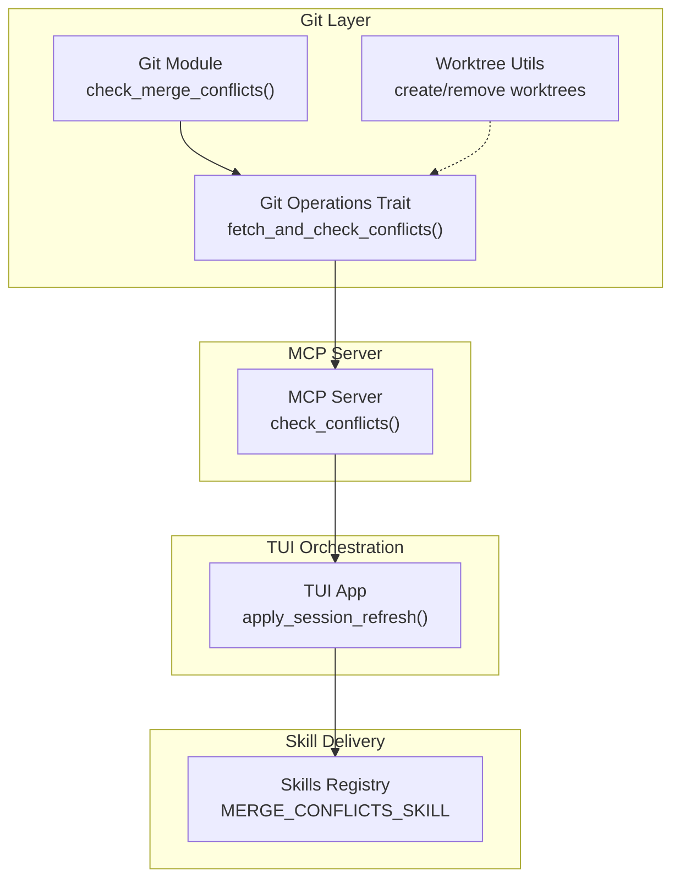
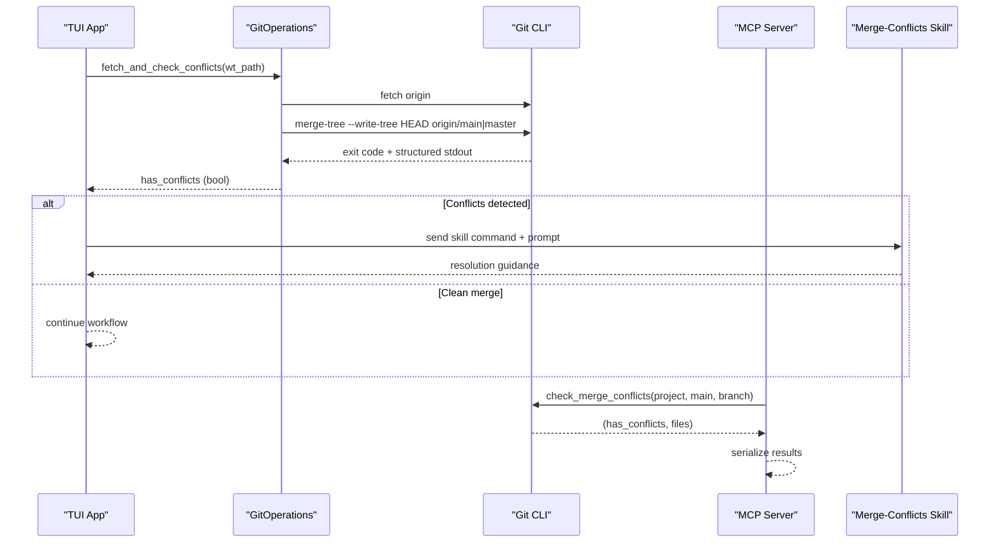
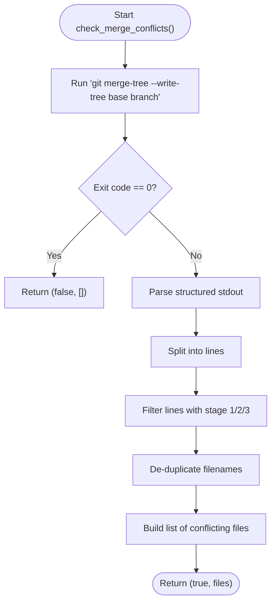
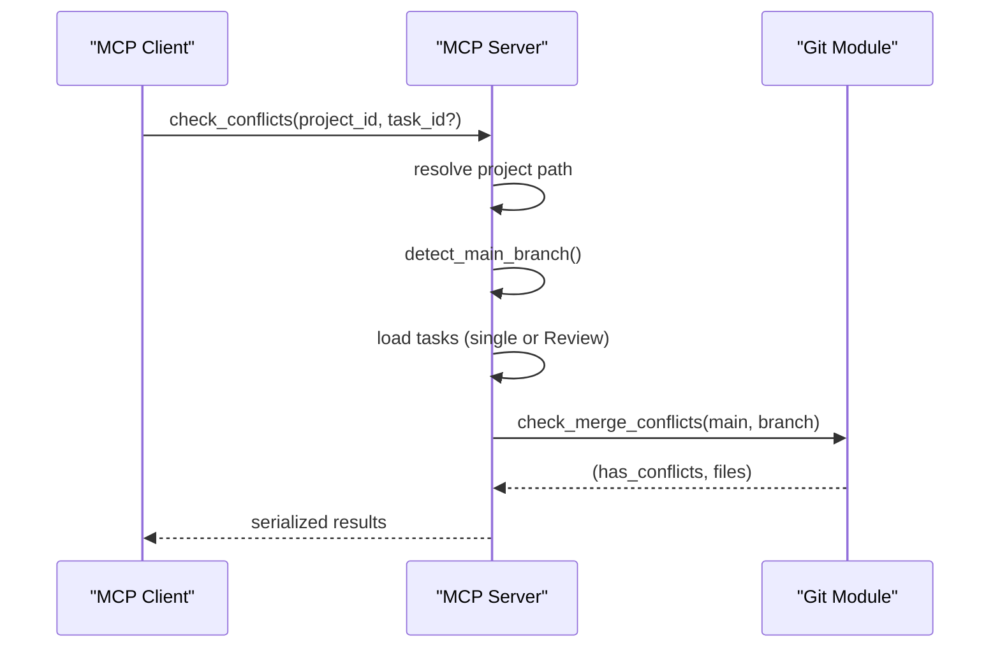
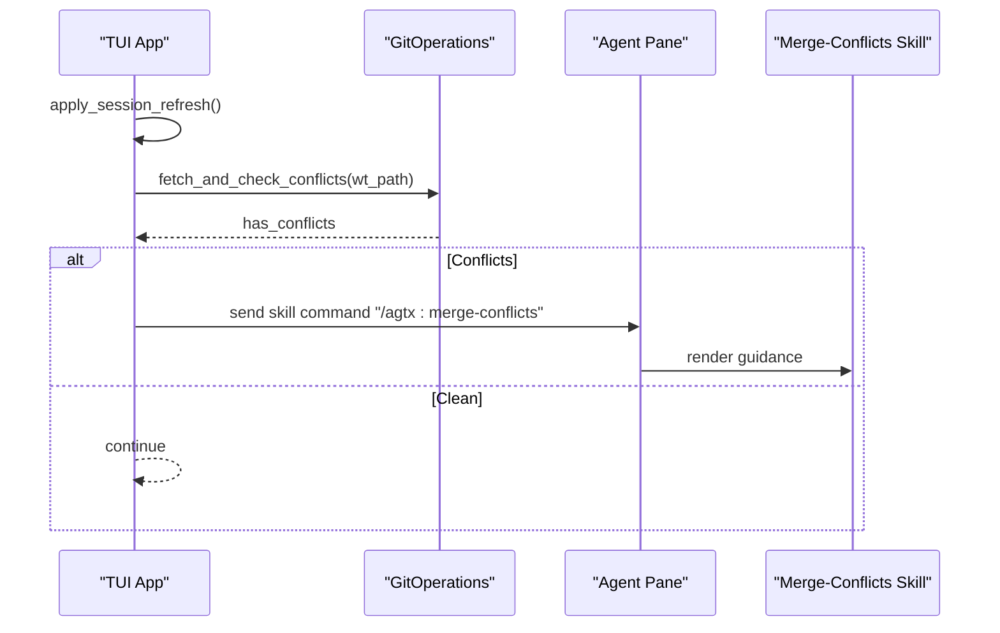
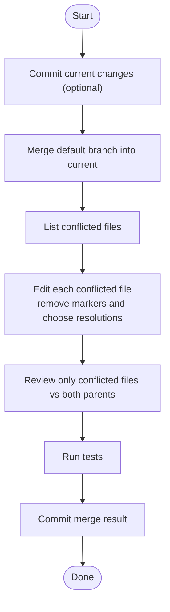
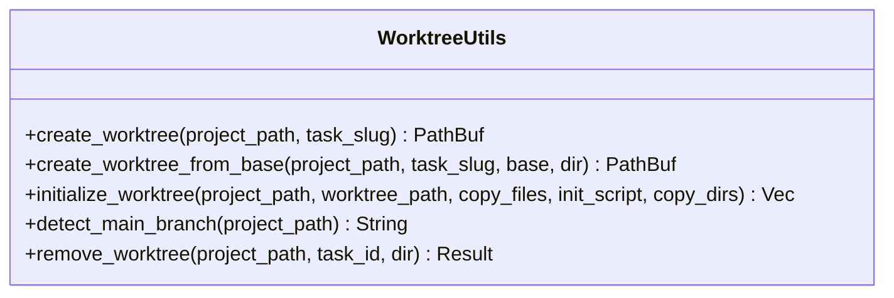
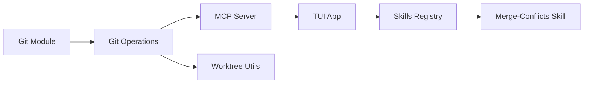

# Conflict Resolution

<cite>
**Referenced Files in This Document**
- [merge-conflicts.md](file://plugins/agtx/skills/merge-conflicts.md)
- [mod.rs](file://src/git/mod.rs)
- [operations.rs](file://src/git/operations.rs)
- [worktree.rs](file://src/git/worktree.rs)
- [server.rs](file://src/mcp/server.rs)
- [app.rs](file://src/tui/app.rs)
- [skills.rs](file://src/skills.rs)
- [git_tests.rs](file://tests/git_tests.rs)
</cite>

## Table of Contents
1. [Introduction](#introduction)
2. [Project Structure](#project-structure)
3. [Core Components](#core-components)
4. [Architecture Overview](#architecture-overview)
5. [Detailed Component Analysis](#detailed-component-analysis)
6. [Dependency Analysis](#dependency-analysis)
7. [Performance Considerations](#performance-considerations)
8. [Troubleshooting Guide](#troubleshooting-guide)
9. [Conclusion](#conclusion)

## Introduction
This document describes the non-destructive merge conflict detection and resolution system used by the application. It explains how Git 2.38+ enables conflict checks without touching the working directory, how the system parses structured output to identify conflicting files, and how the merge-conflicts skill is integrated into the automation pipeline. It also covers the manual resolution workflow, automated strategies, and operational guidance for large repositories.

## Project Structure
The conflict resolution capability spans several modules:
- Git utilities for non-destructive checks and worktree management
- MCP server tools for conflict scanning across tasks
- TUI orchestration that triggers conflict checks and skill delivery
- Built-in merge-conflicts skill content for guided resolution
- Tests validating conflict detection behavior

**Diagram sources**
- [mod.rs:92-128](file://src/git/mod.rs#L92-L128)
- [operations.rs:57-60](file://src/git/operations.rs#L57-L60)
- [worktree.rs:8-65](file://src/git/worktree.rs#L8-L65)
- [server.rs:757-832](file://src/mcp/server.rs#L757-L832)
- [app.rs:6577-6636](file://src/tui/app.rs#L6577-L6636)
- [skills.rs](file://src/skills.rs#L10)

**Section sources**
- [mod.rs:1-142](file://src/git/mod.rs#L1-L142)
- [operations.rs:1-276](file://src/git/operations.rs#L1-L276)
- [worktree.rs:1-345](file://src/git/worktree.rs#L1-L345)
- [server.rs:750-949](file://src/mcp/server.rs#L750-L949)
- [app.rs:6514-6800](file://src/tui/app.rs#L6514-L6800)
- [skills.rs:1-29](file://src/skills.rs#L1-L29)

## Core Components
- Non-destructive conflict detection using Git merge-tree --write-tree
- Structured output parsing to enumerate conflicting files
- MCP tool to batch-check conflicts across tasks
- TUI-triggered automation that delivers the merge-conflicts skill
- Built-in skill content guiding manual resolution steps

Key capabilities:
- Uses git merge-tree --write-tree to simulate a merge and return conflicting files without modifying the working tree
- Parses machine-readable lines indicating stages 1/2/3 (base/ours/theirs) to extract filenames
- Integrates with MCP and TUI to automate conflict detection and skill delivery
- Provides a robust manual resolution procedure via the merge-conflicts skill

**Section sources**
- [mod.rs:89-128](file://src/git/mod.rs#L89-L128)
- [operations.rs:57-60](file://src/git/operations.rs#L57-L60)
- [server.rs:757-832](file://src/mcp/server.rs#L757-L832)
- [app.rs:6577-6636](file://src/tui/app.rs#L6577-L6636)
- [merge-conflicts.md:1-53](file://plugins/agtx/skills/merge-conflicts.md#L1-L53)

## Architecture Overview
The system performs a non-destructive virtual merge and surfaces actionable results to the user or orchestrator.

**Diagram sources**
- [operations.rs:211-243](file://src/git/operations.rs#L211-L243)
- [mod.rs:92-128](file://src/git/mod.rs#L92-L128)
- [server.rs:757-832](file://src/mcp/server.rs#L757-L832)
- [app.rs:6577-6636](file://src/tui/app.rs#L6577-L6636)
- [merge-conflicts.md:1-53](file://plugins/agtx/skills/merge-conflicts.md#L1-L53)

## Detailed Component Analysis

### Non-Destructive Conflict Detection
- Uses git merge-tree --write-tree to compute a merge without writing to disk
- Interprets non-zero exit as conflicts and parses structured output lines
- Extracts filenames from lines containing stage indicators (1/2/3) and trims duplicates

**Diagram sources**
- [mod.rs:92-128](file://src/git/mod.rs#L92-L128)

**Section sources**
- [mod.rs:89-128](file://src/git/mod.rs#L89-L128)
- [git_tests.rs:508-562](file://tests/git_tests.rs#L508-L562)

### MCP Tool Integration
- The MCP server exposes a check_conflicts tool that enumerates tasks and runs non-destructive checks
- It detects the main branch (main or master) and queries each task’s branch
- Results include has_conflicts and the list of conflicting files per task

**Diagram sources**
- [server.rs:757-832](file://src/mcp/server.rs#L757-L832)
- [mod.rs:92-128](file://src/git/mod.rs#L92-L128)

**Section sources**
- [server.rs:757-832](file://src/mcp/server.rs#L757-L832)

### TUI Automation and Skill Delivery
- The TUI periodically refreshes session status and triggers conflict checks for Review tasks under specific conditions
- When conflicts are detected, it sends the merge-conflicts skill command to the agent’s tmux pane along with a contextual prompt
- A guard prevents repeated checks for the same task during a session

**Diagram sources**
- [app.rs:6577-6636](file://src/tui/app.rs#L6577-L6636)
- [operations.rs:211-243](file://src/git/operations.rs#L211-L243)
- [merge-conflicts.md:1-53](file://plugins/agtx/skills/merge-conflicts.md#L1-L53)

**Section sources**
- [app.rs:6577-6636](file://src/tui/app.rs#L6577-L6636)
- [merge-conflicts.md:1-53](file://plugins/agtx/skills/merge-conflicts.md#L1-L53)

### Manual Resolution Procedure
The merge-conflicts skill defines a step-by-step manual workflow:
- Commit current changes (if any)
- Merge the default branch into the current branch
- Resolve all conflicts, noting affected files
- Review only the conflicted files against both parents
- Run tests and commit the merge

**Diagram sources**
- [merge-conflicts.md:10-52](file://plugins/agtx/skills/merge-conflicts.md#L10-L52)

**Section sources**
- [merge-conflicts.md:1-53](file://plugins/agtx/skills/merge-conflicts.md#L1-L53)

### Worktree Management
- Worktrees are used to isolate task workspaces and avoid interfering with the main working directory
- The system creates, initializes, and removes worktrees as needed
- Main branch detection supports both main and master

**Diagram sources**
- [worktree.rs:8-65](file://src/git/worktree.rs#L8-L65)
- [worktree.rs:129-223](file://src/git/worktree.rs#L129-L223)
- [worktree.rs:242-273](file://src/git/worktree.rs#L242-L273)

**Section sources**
- [worktree.rs:1-345](file://src/git/worktree.rs#L1-L345)

## Dependency Analysis
- Git module depends on Git CLI for merge-tree and branch detection
- Git operations trait abstracts real Git commands for testing and mocking
- MCP server depends on Git module for conflict checks
- TUI depends on Git operations and skills registry to orchestrate conflict handling
- Built-in skills are compiled into the binary and resolved per agent

**Diagram sources**
- [mod.rs:1-142](file://src/git/mod.rs#L1-L142)
- [operations.rs:1-276](file://src/git/operations.rs#L1-L276)
- [server.rs:757-832](file://src/mcp/server.rs#L757-L832)
- [app.rs:6577-6636](file://src/tui/app.rs#L6577-L6636)
- [skills.rs](file://src/skills.rs#L10)

**Section sources**
- [mod.rs:1-142](file://src/git/mod.rs#L1-L142)
- [operations.rs:1-276](file://src/git/operations.rs#L1-L276)
- [server.rs:757-832](file://src/mcp/server.rs#L757-L832)
- [app.rs:6577-6636](file://src/tui/app.rs#L6577-L6636)
- [skills.rs:1-29](file://src/skills.rs#L1-L29)

## Performance Considerations
- Non-destructive checks: merge-tree avoids writing to disk, minimizing I/O overhead
- Structured output parsing: linear scan of lines with stage indicators scales with the number of conflicting entries
- Worktree isolation: reduces interference and allows parallel task processing
- Batch checks via MCP: consolidate conflict checks across tasks to reduce repeated Git invocations
- Guard against redundant checks: TUI maintains a per-session set of checked tasks to avoid repeated automation

Recommendations:
- Prefer main/master detection and consistent remote naming to minimize extra checks
- For very large repos, consider limiting concurrent worktrees and batching MCP requests
- Cache parsed results per session and invalidate on significant content changes

[No sources needed since this section provides general guidance]

## Troubleshooting Guide
Common issues and remedies:
- Git version compatibility: ensure Git 2.38+ for merge-tree support
- Non-existent branches: merge-tree fails on missing refs; verify branch names and remote availability
- Conflicts not detected: confirm that the default branch is correctly detected (main or master)
- Permission errors: ensure the user has permission to run Git commands and access worktrees
- TUI automation not triggering: verify that Review tasks meet the Ready or Idle thresholds and that the tmux session exists

Validation references:
- Unit tests demonstrate conflict detection for conflicting and clean scenarios
- Error handling paths return meaningful diagnostics for failing Git operations

**Section sources**
- [git_tests.rs:508-562](file://tests/git_tests.rs#L508-L562)
- [operations.rs:211-243](file://src/git/operations.rs#L211-L243)
- [mod.rs:92-128](file://src/git/mod.rs#L92-L128)

## Conclusion
The system leverages Git 2.38+ merge-tree to perform non-destructive conflict checks, parses structured output to enumerate conflicting files, and integrates with MCP and TUI to automate resolution workflows. The merge-conflicts skill provides a clear manual procedure, while guards and worktree isolation improve reliability and performance. Together, these components deliver a robust, scalable solution for managing merge conflicts in collaborative development environments.