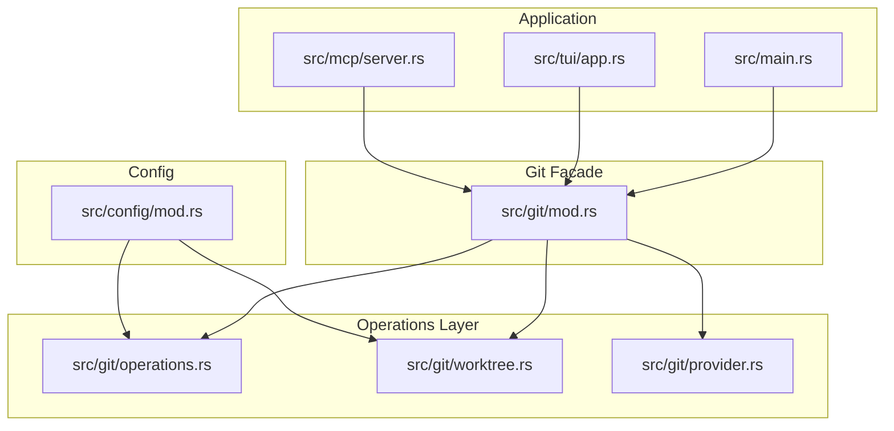
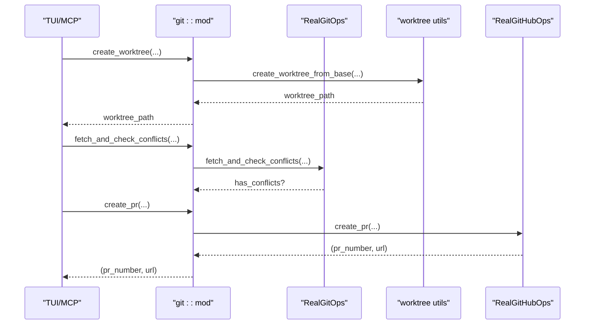
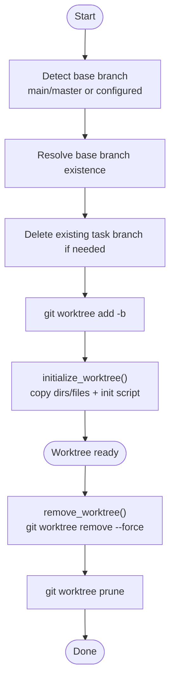
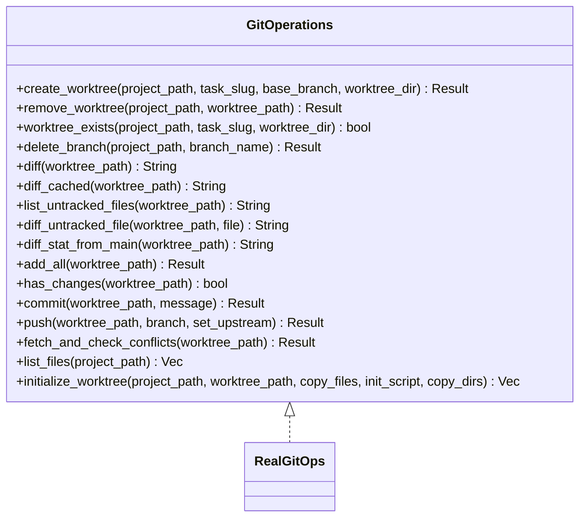
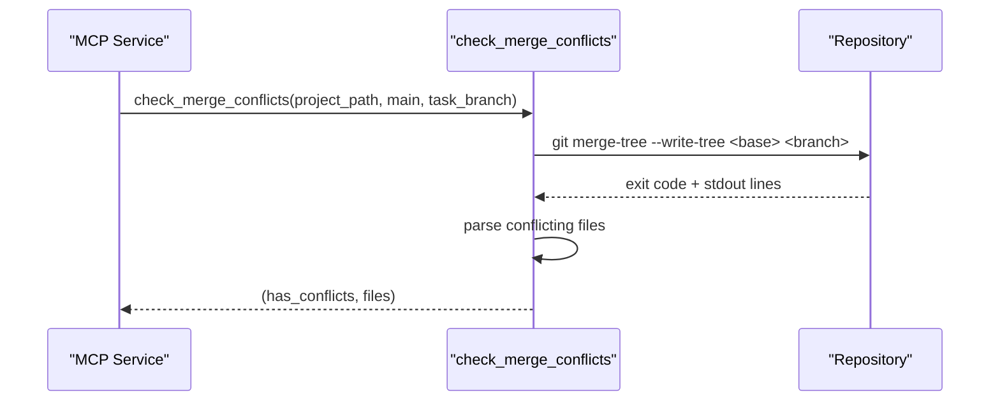
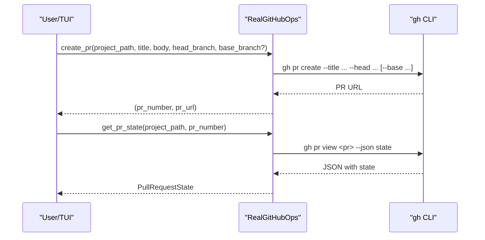
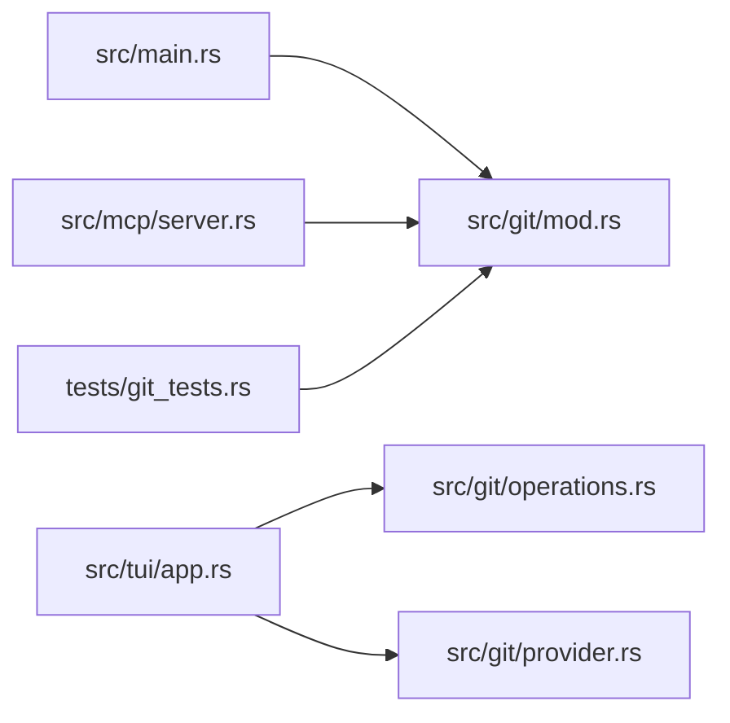

# Git Integration

<cite>
**Referenced Files in This Document**
- [src/git/mod.rs](file://src/git/mod.rs)
- [src/git/operations.rs](file://src/git/operations.rs)
- [src/git/provider.rs](file://src/git/provider.rs)
- [src/git/worktree.rs](file://src/git/worktree.rs)
- [src/config/mod.rs](file://src/config/mod.rs)
- [src/main.rs](file://src/main.rs)
- [src/tui/app.rs](file://src/tui/app.rs)
- [src/mcp/server.rs](file://src/mcp/server.rs)
- [plugins/agtx/skills/merge-conflicts.md](file://plugins/agtx/skills/merge-conflicts.md)
- [tests/git_tests.rs](file://tests/git_tests.rs)
</cite>

## Table of Contents
1. [Introduction](#introduction)
2. [Project Structure](#project-structure)
3. [Core Components](#core-components)
4. [Architecture Overview](#architecture-overview)
5. [Detailed Component Analysis](#detailed-component-analysis)
6. [Dependency Analysis](#dependency-analysis)
7. [Performance Considerations](#performance-considerations)
8. [Troubleshooting Guide](#troubleshooting-guide)
9. [Security Considerations](#security-considerations)
10. [Best Practices](#best-practices)
11. [Conclusion](#conclusion)

## Introduction
This document explains the Git integration in the project, focusing on worktree management, version control workflows, and the Git provider abstraction. It covers how the system creates isolated worktrees per task, maintains task isolation, detects and resolves merge conflicts without destructive operations, and integrates with standard Git workflows. It also documents the Git operations abstraction layer, the pull request provider interface, and practical guidance for performance, troubleshooting, and security.

## Project Structure
The Git integration spans several modules:
- A public facade that re-exports worktree and provider APIs
- An operations trait and real implementation for Git commands
- A provider trait and a concrete GitHub implementation
- Worktree utilities for creation, initialization, and cleanup
- Configuration for worktree behavior and project-specific overrides
- TUI and MCP usage of these APIs for task lifecycle and conflict checks

**Diagram sources**
- [src/git/mod.rs:1-142](file://src/git/mod.rs#L1-L142)
- [src/git/operations.rs:1-276](file://src/git/operations.rs#L1-L276)
- [src/git/worktree.rs:1-345](file://src/git/worktree.rs#L1-L345)
- [src/git/provider.rs:1-110](file://src/git/provider.rs#L1-L110)
- [src/config/mod.rs:160-198](file://src/config/mod.rs#L160-L198)
- [src/main.rs:16-96](file://src/main.rs#L16-L96)
- [src/tui/app.rs:23-28](file://src/tui/app.rs#L23-L28)
- [src/mcp/server.rs:788-832](file://src/mcp/server.rs#L788-L832)

**Section sources**
- [src/git/mod.rs:1-142](file://src/git/mod.rs#L1-L142)
- [src/config/mod.rs:160-198](file://src/config/mod.rs#L160-L198)
- [src/main.rs:16-96](file://src/main.rs#L16-L96)
- [src/tui/app.rs:23-28](file://src/tui/app.rs#L23-L28)
- [src/mcp/server.rs:788-832](file://src/mcp/server.rs#L788-L832)

## Core Components
- Git operations abstraction: A trait defines worktree management, diffs, staging, committing, pushing, conflict checks, and file listing. A real implementation executes Git commands and exposes a non-destructive virtual merge check.
- Worktree management: Utilities to create, initialize, and remove worktrees; detect main branch; and copy agent configuration and project files into worktrees.
- Provider abstraction: A trait for pull/merge request operations with a concrete GitHub implementation using the gh CLI.
- Configuration: Global and project-level settings controlling worktree behavior, base branch, and copy-back/cleanup scripts.

**Section sources**
- [src/git/operations.rs:9-75](file://src/git/operations.rs#L9-L75)
- [src/git/operations.rs:77-276](file://src/git/operations.rs#L77-L276)
- [src/git/worktree.rs:8-65](file://src/git/worktree.rs#L8-L65)
- [src/git/worktree.rs:129-223](file://src/git/worktree.rs#L129-L223)
- [src/git/worktree.rs:241-273](file://src/git/worktree.rs#L241-L273)
- [src/git/provider.rs:21-38](file://src/git/provider.rs#L21-L38)
- [src/git/provider.rs:40-110](file://src/git/provider.rs#L40-L110)
- [src/config/mod.rs:160-198](file://src/config/mod.rs#L160-L198)
- [src/config/mod.rs:199-228](file://src/config/mod.rs#L199-L228)

## Architecture Overview
The Git integration is layered:
- Application code (TUI and MCP) depends on traits for Git and provider operations.
- The facade re-exports worktree and provider APIs for convenient access.
- The real implementations execute Git commands and the gh CLI under the hood.
- Configuration drives worktree creation and initialization behavior.

**Diagram sources**
- [src/tui/app.rs:23-28](file://src/tui/app.rs#L23-L28)
- [src/git/mod.rs:5-7](file://src/git/mod.rs#L5-L7)
- [src/git/operations.rs:77-276](file://src/git/operations.rs#L77-L276)
- [src/git/worktree.rs:14-65](file://src/git/worktree.rs#L14-L65)
- [src/git/provider.rs:40-110](file://src/git/provider.rs#L40-L110)

## Detailed Component Analysis

### Worktree Architecture and Management
- Automatic worktree creation: Creates a worktree per task from a base branch (auto-detected main/master or configured).
- Branch management: Creates a feature branch named task/<slug> for each task; cleans up existing partial worktrees and branches.
- Initialization: Copies agent configuration directories and optional project files/dirs into the worktree; runs an init script if provided.
- Cleanup: Removes worktrees and prunes worktree metadata; supports force removal and pruning.

**Diagram sources**
- [src/git/worktree.rs:8-65](file://src/git/worktree.rs#L8-L65)
- [src/git/worktree.rs:129-223](file://src/git/worktree.rs#L129-L223)
- [src/git/worktree.rs:275-297](file://src/git/worktree.rs#L275-L297)

**Section sources**
- [src/git/worktree.rs:8-65](file://src/git/worktree.rs#L8-L65)
- [src/git/worktree.rs:129-223](file://src/git/worktree.rs#L129-L223)
- [src/git/worktree.rs:241-273](file://src/git/worktree.rs#L241-L273)
- [src/git/worktree.rs:275-297](file://src/git/worktree.rs#L275-L297)

### Git Operations Abstraction and Virtual Merge
- Trait defines operations for worktrees, diffs, staging, committing, pushing, and conflict checks.
- Real implementation executes Git commands and uses non-destructive virtual merge via merge-tree to detect conflicts without modifying the working tree.
- The facade exposes convenience functions for repository checks, branch detection, and diff generation.

**Diagram sources**
- [src/git/operations.rs:9-75](file://src/git/operations.rs#L9-L75)
- [src/git/operations.rs:77-276](file://src/git/operations.rs#L77-L276)

**Section sources**
- [src/git/operations.rs:9-75](file://src/git/operations.rs#L9-L75)
- [src/git/operations.rs:77-276](file://src/git/operations.rs#L77-L276)
- [src/git/mod.rs:89-128](file://src/git/mod.rs#L89-L128)

### Merge Conflict Detection and Resolution
- Non-destructive virtual merge: Uses merge-tree to detect conflicts without touching the working tree.
- Skill-based resolution: Provides a skill that guides manual resolution steps, emphasizing safe commit-before-merge and careful verification of conflicted files.
- Automated checks: MCP service can batch-check conflicts across tasks.

**Diagram sources**
- [src/mcp/server.rs:788-832](file://src/mcp/server.rs#L788-L832)
- [src/git/mod.rs:89-128](file://src/git/mod.rs#L89-L128)

**Section sources**
- [src/git/mod.rs:89-128](file://src/git/mod.rs#L89-L128)
- [src/mcp/server.rs:788-832](file://src/mcp/server.rs#L788-L832)
- [plugins/agtx/skills/merge-conflicts.md:1-53](file://plugins/agtx/skills/merge-conflicts.md#L1-L53)

### Branch Operations and Pull Request Integration
- Base branch detection: Auto-detects main or master; falls back to current branch if neither exists.
- Worktree creation from specific branches: Supports specifying a base branch for isolation.
- Pull request integration: Provider trait abstracts PR operations; GitHub implementation uses the gh CLI to create and query PR state.

**Diagram sources**
- [src/git/provider.rs:40-110](file://src/git/provider.rs#L40-L110)

**Section sources**
- [src/git/worktree.rs:241-273](file://src/git/worktree.rs#L241-L273)
- [src/git/worktree.rs:14-65](file://src/git/worktree.rs#L14-L65)
- [src/git/provider.rs:21-38](file://src/git/provider.rs#L21-L38)
- [src/git/provider.rs:40-110](file://src/git/provider.rs#L40-L110)

### Configuration and Project Overrides
- Global worktree settings: Enable/disable worktrees, auto cleanup, base branch, and worktree directory.
- Project overrides: Per-project base branch, GitHub URL, worktree directory, copy files, init/cleanup scripts, and workflow plugin.
- Merging: Project settings override global defaults.

**Section sources**
- [src/config/mod.rs:160-198](file://src/config/mod.rs#L160-L198)
- [src/config/mod.rs:199-228](file://src/config/mod.rs#L199-L228)
- [src/config/mod.rs:355-408](file://src/config/mod.rs#L355-L408)

## Dependency Analysis
- Application entry points depend on the Git facade for repository checks and mode selection.
- TUI and MCP modules depend on Git operations and provider traits for task lifecycle and PR workflows.
- Tests exercise pure functions and integration scenarios for worktrees and conflict detection.

**Diagram sources**
- [src/main.rs:16-96](file://src/main.rs#L16-L96)
- [src/tui/app.rs:23-28](file://src/tui/app.rs#L23-L28)
- [src/mcp/server.rs:788-832](file://src/mcp/server.rs#L788-L832)
- [tests/git_tests.rs:1-200](file://tests/git_tests.rs#L1-L200)

**Section sources**
- [src/main.rs:16-96](file://src/main.rs#L16-L96)
- [src/tui/app.rs:23-28](file://src/tui/app.rs#L23-L28)
- [src/mcp/server.rs:788-832](file://src/mcp/server.rs#L788-L832)
- [tests/git_tests.rs:1-200](file://tests/git_tests.rs#L1-L200)

## Performance Considerations
- Prefer non-destructive virtual merges for conflict checks to avoid repeated worktree resets.
- Use worktrees to isolate tasks and avoid expensive repository-wide operations in the main branch.
- Limit unnecessary file copying by configuring minimal copy_files and copy_dirs lists.
- For large repositories, leverage Git’s internal caching and avoid frequent fetches by batching operations where possible.

## Troubleshooting Guide
Common issues and remedies:
- Worktree creation failures: Verify base branch exists or allow auto-detection; ensure the project has an initial commit; check permissions on the worktree directory.
- Conflicts not detected: Ensure the repository is clean and up-to-date; confirm merge-tree availability; validate that the base and feature branches are correct.
- PR creation failures: Confirm gh CLI is installed and authenticated; verify repository permissions; check PR base/head branch names.
- Cleanup problems: Use force removal and prune; ensure no lingering processes hold locks on worktree paths.

**Section sources**
- [src/git/worktree.rs:275-297](file://src/git/worktree.rs#L275-L297)
- [src/git/operations.rs:211-243](file://src/git/operations.rs#L211-L243)
- [src/git/provider.rs:66-108](file://src/git/provider.rs#L66-L108)

## Security Considerations
- Credential management: The GitHub provider relies on the gh CLI; ensure secure credential storage and short-lived tokens where applicable.
- Script execution: Worktree init/cleanup scripts run with elevated privileges; restrict copy_files and copy_dirs to trusted content.
- Repository access: Restrict write access to worktree directories; avoid exposing sensitive files via copy-back mechanisms.
- Automation safety: Use non-destructive conflict checks and staged commits before merging to prevent accidental destructive changes.

## Best Practices
- Use worktrees for task isolation to maintain a clean main branch and avoid cross-task contamination.
- Configure base branch detection to align with your team’s default branch naming.
- Automate conflict checks before merging; integrate with PR workflows to surface conflicts early.
- Keep init scripts minimal and deterministic; prefer declarative configuration over dynamic content.
- Regularly prune worktrees to reclaim disk space and reduce repository clutter.

## Conclusion
The Git integration provides a robust, testable abstraction over Git operations and provider interactions. Worktrees ensure strong task isolation, non-destructive conflict checks improve safety, and the provider abstraction enables extensibility to other Git hosting services. Combined with configuration-driven behavior and practical troubleshooting guidance, this system supports scalable, secure, and efficient version-controlled workflows.