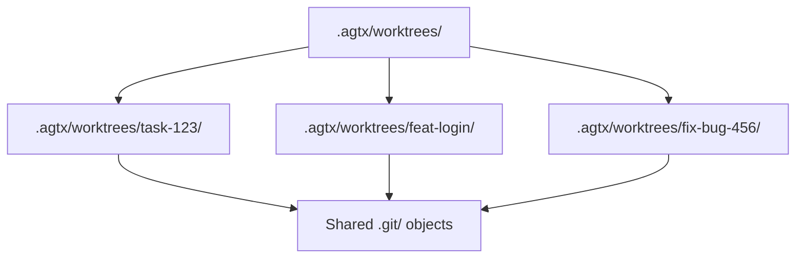
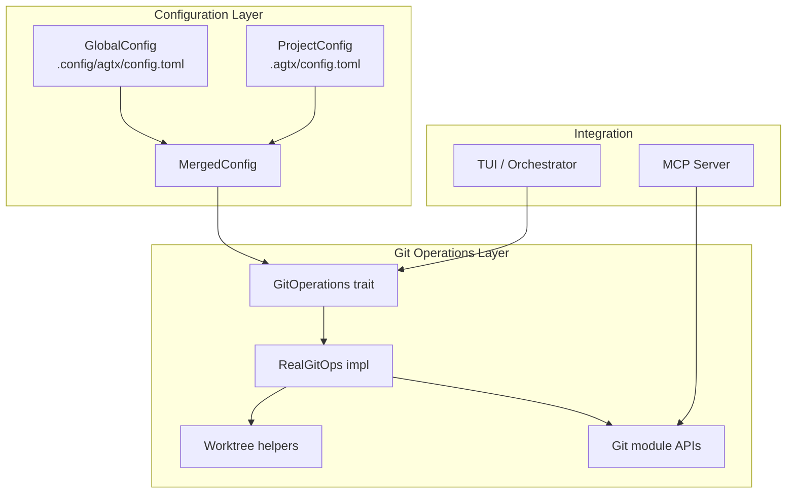
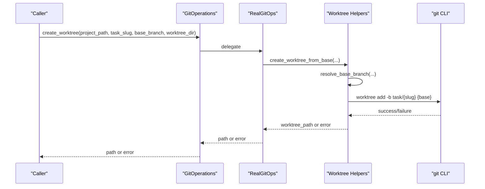
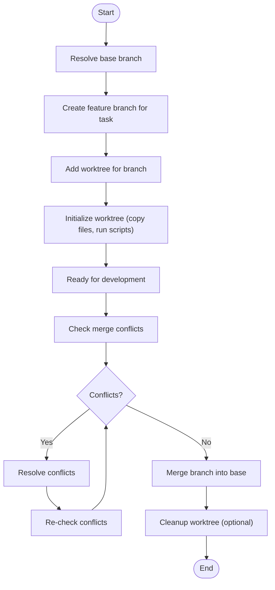
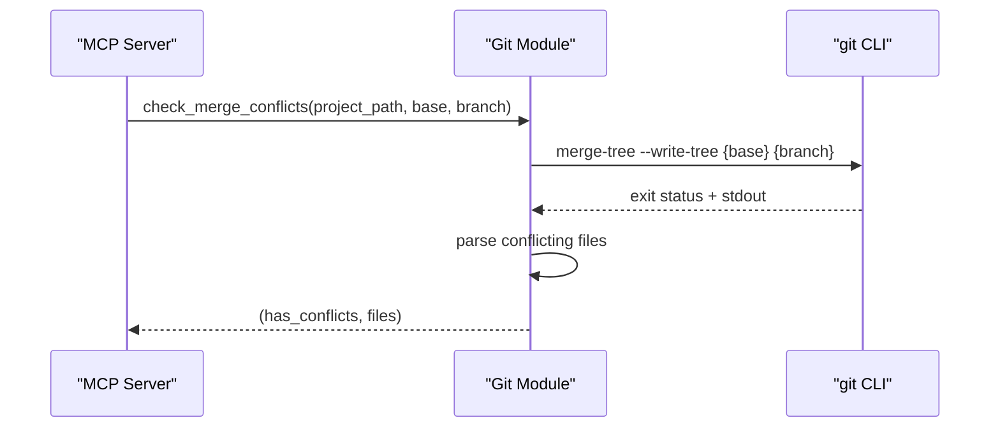
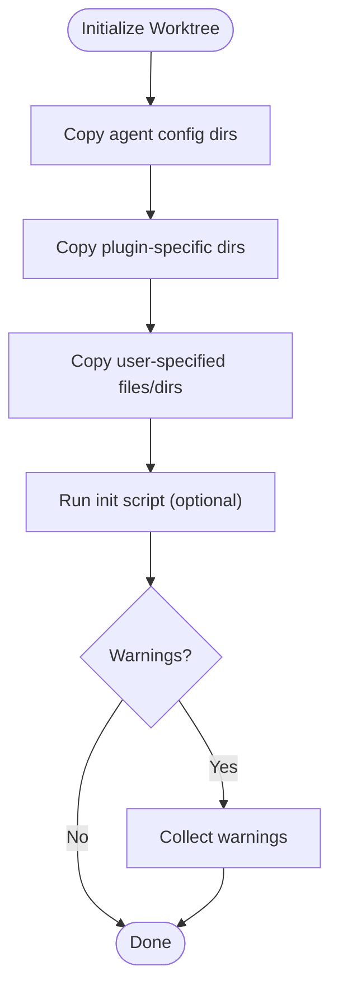
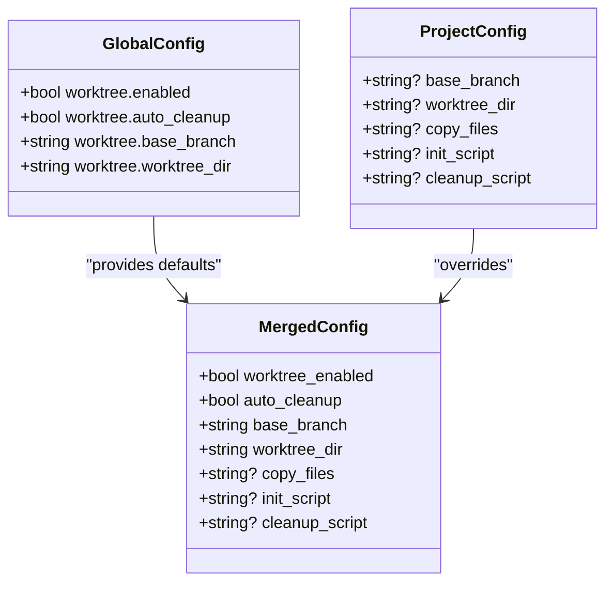
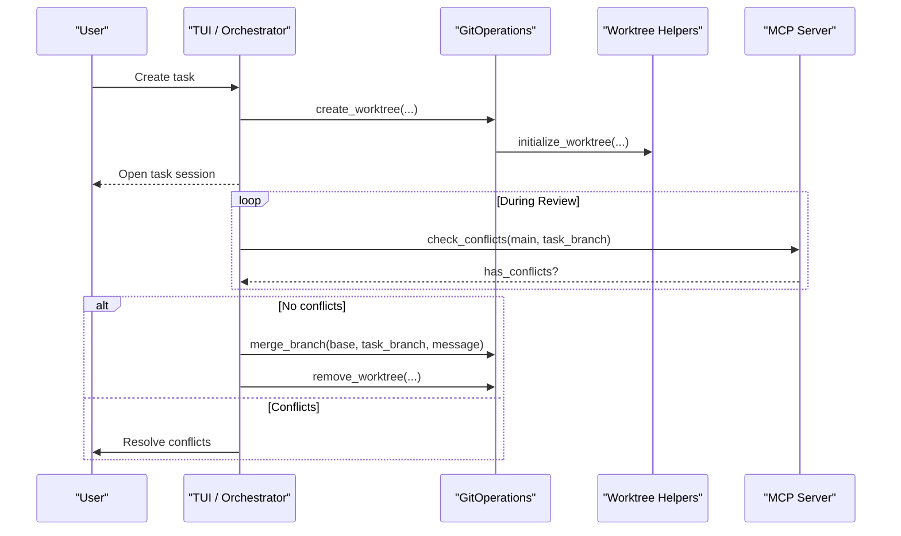
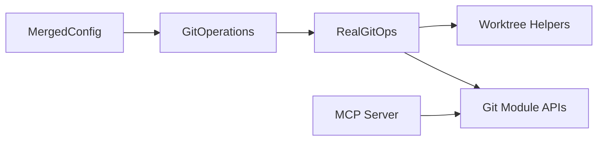

# Git Integration

<cite>
**Referenced Files in This Document**
- [README.md](file://README.md)
- [src/git/mod.rs](file://src/git/mod.rs)
- [src/git/worktree.rs](file://src/git/worktree.rs)
- [src/git/operations.rs](file://src/git/operations.rs)
- [src/config/mod.rs](file://src/config/mod.rs)
- [src/mcp/server.rs](file://src/mcp/server.rs)
- [tests/git_tests.rs](file://tests/git_tests.rs)
- [plugins/gsd/plugin.toml](file://plugins/gsd/plugin.toml)
- [plugins/agtx/plugin.toml](file://plugins/agtx/plugin.toml)
</cite>

## Table of Contents
1. [Introduction](#introduction)
2. [Project Structure](#project-structure)
3. [Core Components](#core-components)
4. [Architecture Overview](#architecture-overview)
5. [Detailed Component Analysis](#detailed-component-analysis)
6. [Dependency Analysis](#dependency-analysis)
7. [Performance Considerations](#performance-considerations)
8. [Troubleshooting Guide](#troubleshooting-guide)
9. [Conclusion](#conclusion)

## Introduction
This document explains how AGTX integrates with Git to manage version control through isolated workspaces called worktrees. Each task is assigned its own worktree, ensuring parallel development without conflicts, and enabling safe experimentation and collaboration. AGTX automates worktree creation, initialization, and cleanup, and provides robust mechanisms to detect and resolve merge conflicts before merging changes back to the base branch.

## Project Structure
AGTX organizes worktrees under a configurable directory within each project. The default location is a hidden folder under the project root, and each task gets its own subdirectory named after a URL-safe slug. Worktrees are independent Git working trees that share the repository’s object database but maintain separate working directories.

**Diagram sources**
- [src/git/worktree.rs:5-6](file://src/git/worktree.rs#L5-L6)
- [src/git/worktree.rs:21-23](file://src/git/worktree.rs#L21-L23)

**Section sources**
- [README.md:92](file://README.md#L92)
- [src/git/worktree.rs:5-6](file://src/git/worktree.rs#L5-L6)

## Core Components
- Worktree management: creation, existence checks, and removal with force support.
- Branch operations: detecting the base branch, creating feature branches, and merging back.
- Conflict detection: non-destructive virtual merge to identify conflicts.
- Initialization pipeline: copying agent configuration directories, project-specific files, and running optional scripts.
- Configuration: global and project-level settings controlling base branch, worktree directory, and initialization behavior.

**Section sources**
- [src/git/worktree.rs:8-65](file://src/git/worktree.rs#L8-L65)
- [src/git/mod.rs:89-128](file://src/git/mod.rs#L89-L128)
- [src/git/operations.rs:11-75](file://src/git/operations.rs#L11-L75)
- [src/config/mod.rs:160-197](file://src/config/mod.rs#L160-L197)

## Architecture Overview
AGTX coordinates Git operations across three layers:
- Configuration layer: resolves effective settings from global and project scopes.
- Git operations layer: exposes traits and implementations for worktree and branch operations.
- MCP/TUI integration: orchestrates conflict checks and transitions based on Git state.

**Diagram sources**
- [src/config/mod.rs:355-388](file://src/config/mod.rs#L355-L388)
- [src/git/operations.rs:11-75](file://src/git/operations.rs#L11-L75)
- [src/git/worktree.rs:8-65](file://src/git/worktree.rs#L8-L65)
- [src/git/mod.rs:89-128](file://src/git/mod.rs#L89-L128)
- [src/mcp/server.rs:794-827](file://src/mcp/server.rs#L794-L827)

## Detailed Component Analysis

### Worktree Management
- Creation: Creates a new branch per task and adds a worktree pointing to that branch. If a worktree already exists, it is reused.
- Base branch resolution: Detects main or master, falling back to the current branch if neither exists.
- Removal: Removes a worktree with force to handle uncommitted changes; includes pruning to clean up stale references.
- Existence checks: Validates whether a worktree directory exists for a given task.

**Diagram sources**
- [src/git/operations.rs:80-91](file://src/git/operations.rs#L80-L91)
- [src/git/worktree.rs:14-65](file://src/git/worktree.rs#L14-L65)
- [src/git/worktree.rs:67-84](file://src/git/worktree.rs#L67-L84)

**Section sources**
- [src/git/worktree.rs:8-65](file://src/git/worktree.rs#L8-L65)
- [src/git/worktree.rs:275-297](file://src/git/worktree.rs#L275-L297)
- [src/git/worktree.rs:309-317](file://src/git/worktree.rs#L309-L317)

### Branch Operations and Merge Preparation
- Base branch selection: Auto-detects main or master, or uses a configured branch.
- Feature branch naming: Each task branch follows a consistent pattern derived from the task slug.
- Merge preparation: Provides utilities to check for conflicts before merging and to merge branches with a descriptive message.

**Diagram sources**
- [src/git/worktree.rs:40-64](file://src/git/worktree.rs#L40-L64)
- [src/git/mod.rs:89-128](file://src/git/mod.rs#L89-L128)
- [src/git/mod.rs:74-87](file://src/git/mod.rs#L74-L87)

**Section sources**
- [src/git/worktree.rs:241-273](file://src/git/worktree.rs#L241-L273)
- [src/git/mod.rs:89-128](file://src/git/mod.rs#L89-L128)

### Conflict Detection and Resolution
- Non-destructive virtual merge: Uses a Git command to simulate a merge and parse structured output to identify conflicting files.
- Integration: The MCP server performs conflict checks against the default branch and surfaces results to the orchestrator.

**Diagram sources**
- [src/git/mod.rs:89-128](file://src/git/mod.rs#L89-L128)
- [src/mcp/server.rs:794-827](file://src/mcp/server.rs#L794-L827)

**Section sources**
- [src/git/mod.rs:89-128](file://src/git/mod.rs#L89-L128)
- [src/mcp/server.rs:794-827](file://src/mcp/server.rs#L794-L827)

### Worktree Initialization Pipeline
- Always copies agent configuration directories from the project root into each worktree.
- Copies plugin-specific directories and user-specified files/directories.
- Runs an optional initialization script inside the worktree and collects warnings without failing the operation.
- Supports nested paths and preserves directory structure.

**Diagram sources**
- [src/git/worktree.rs:129-223](file://src/git/worktree.rs#L129-L223)

**Section sources**
- [src/git/worktree.rs:86-94](file://src/git/worktree.rs#L86-L94)
- [src/git/worktree.rs:129-223](file://src/git/worktree.rs#L129-L223)

### Configuration Options
- Global defaults: Enable/disable worktrees, auto-cleanup, base branch, and worktree directory.
- Project overrides: Per-project base branch, worktree directory, files to copy, and init/cleanup scripts.
- Plugin integration: Plugins can declare additional directories and files to copy into worktrees.

**Diagram sources**
- [src/config/mod.rs:160-197](file://src/config/mod.rs#L160-L197)
- [src/config/mod.rs:200-228](file://src/config/mod.rs#L200-L228)
- [src/config/mod.rs:355-388](file://src/config/mod.rs#L355-L388)

**Section sources**
- [src/config/mod.rs:160-197](file://src/config/mod.rs#L160-L197)
- [src/config/mod.rs:200-228](file://src/config/mod.rs#L200-L228)
- [README.md:261-303](file://README.md#L261-L303)

### Practical Workflows in AGTX
- Creating a feature branch per task: AGTX creates a worktree from the configured base branch and initializes it with required files and scripts.
- Parallel development: Multiple tasks operate in separate worktrees, minimizing conflicts and enabling simultaneous agent sessions.
- Coordinating multiple agents: Plugins define commands and prompts; AGTX manages phase transitions and artifact handoff between worktrees.
- Merge and cleanup: After conflict-free review, changes are merged back to the base branch; worktrees can be auto-cleaned up afterward.

**Diagram sources**
- [src/git/operations.rs:80-91](file://src/git/operations.rs#L80-L91)
- [src/git/worktree.rs:129-223](file://src/git/worktree.rs#L129-L223)
- [src/mcp/server.rs:794-827](file://src/mcp/server.rs#L794-L827)
- [src/git/mod.rs:74-87](file://src/git/mod.rs#L74-L87)

**Section sources**
- [README.md:164](file://README.md#L164)
- [plugins/gsd/plugin.toml:1-34](file://plugins/gsd/plugin.toml#L1-L34)
- [plugins/agtx/plugin.toml:1-16](file://plugins/agtx/plugin.toml#L1-L16)

## Dependency Analysis
- Configuration drives worktree behavior: base branch and directory are resolved into effective settings before any Git operation.
- Git operations depend on the underlying Git CLI; the trait abstraction allows for test doubles and future replacements.
- MCP integration consumes Git state to inform decisions about task transitions and conflict resolution.

**Diagram sources**
- [src/config/mod.rs:355-388](file://src/config/mod.rs#L355-L388)
- [src/git/operations.rs:77-275](file://src/git/operations.rs#L77-L275)
- [src/git/worktree.rs:1-345](file://src/git/worktree.rs#L1-L345)
- [src/git/mod.rs:14-142](file://src/git/mod.rs#L14-L142)
- [src/mcp/server.rs:794-827](file://src/mcp/server.rs#L794-L827)

**Section sources**
- [src/config/mod.rs:355-388](file://src/config/mod.rs#L355-L388)
- [src/git/operations.rs:77-275](file://src/git/operations.rs#L77-L275)
- [src/git/worktree.rs:1-345](file://src/git/worktree.rs#L1-L345)
- [src/git/mod.rs:14-142](file://src/git/mod.rs#L14-L142)
- [src/mcp/server.rs:794-827](file://src/mcp/server.rs#L794-L827)

## Performance Considerations
- Worktrees reduce overhead by sharing the object database while isolating working trees.
- Non-destructive conflict checks avoid unnecessary merges and wasted cycles.
- Initialization batches file copying and script execution to minimize repeated IO.

## Troubleshooting Guide
- Worktree creation fails: Verify the base branch exists or leave it empty to auto-detect. Ensure the project is a Git repository and has at least one commit.
- Worktree removal fails: The removal process includes force removal and pruning; if it still fails, check for stale references and retry.
- Conflicts not detected: Ensure the Git version supports the conflict detection mechanism and that the base and feature branches are valid.
- Initialization issues: Confirm that the project-level configuration lists correct files and directories to copy and that the init script is executable and exits successfully.
- Cleaning up worktrees: Enable auto-cleanup in configuration to automatically remove worktrees after successful merges or rejections.

**Section sources**
- [tests/git_tests.rs:230-237](file://tests/git_tests.rs#L230-L237)
- [tests/git_tests.rs:240-250](file://tests/git_tests.rs#L240-L250)
- [src/git/worktree.rs:275-297](file://src/git/worktree.rs#L275-L297)
- [src/git/mod.rs:89-128](file://src/git/mod.rs#L89-L128)
- [src/config/mod.rs:160-197](file://src/config/mod.rs#L160-L197)

## Conclusion
AGTX leverages Git worktrees to provide isolated, conflict-resistant development environments for each task. Through configurable base branches, robust initialization, and non-destructive conflict checks, AGTX enables parallel agent workflows and safe merges. The documented configuration options and troubleshooting guidance help maintain a clean repository state and streamline collaborative development.