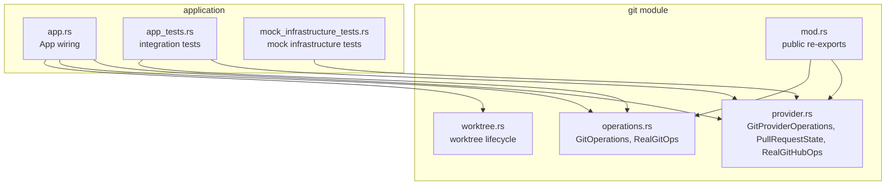
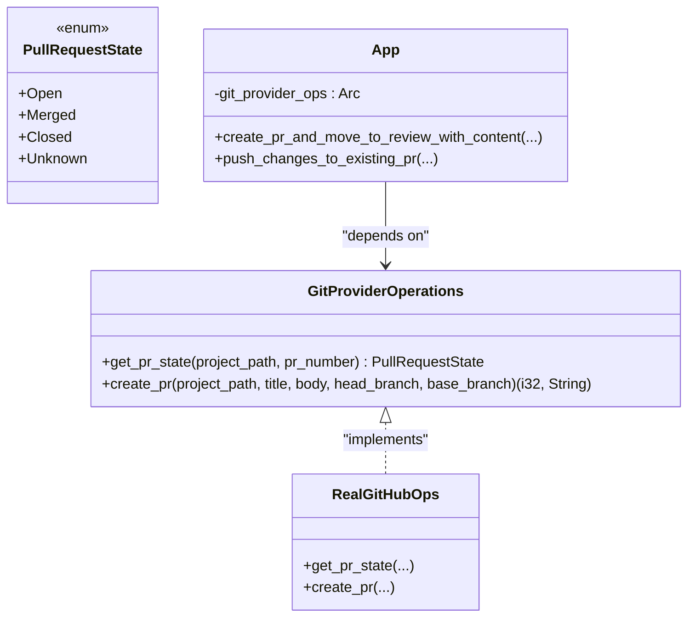
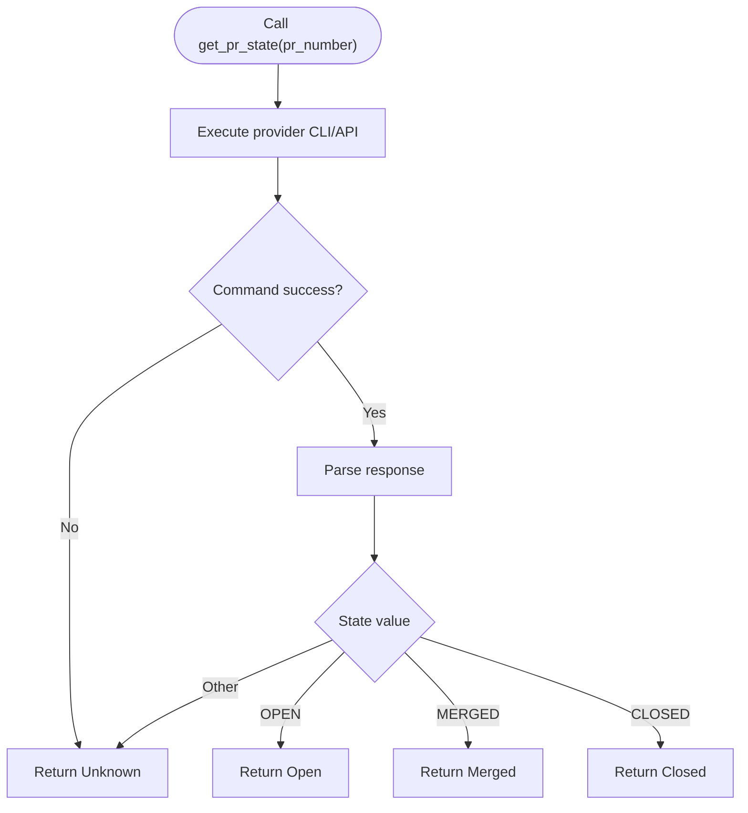
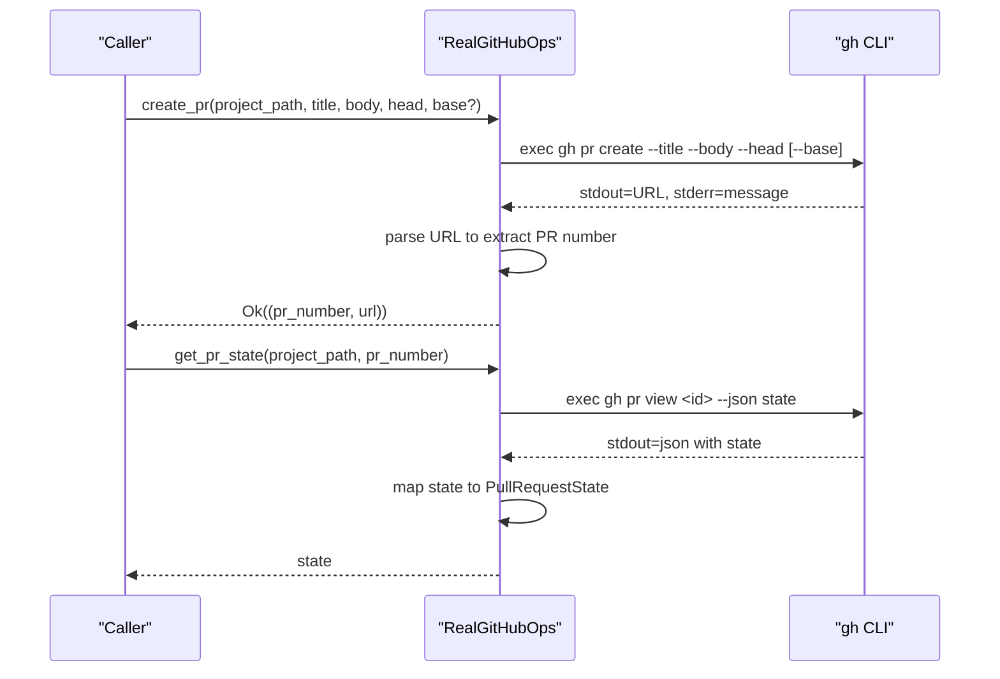
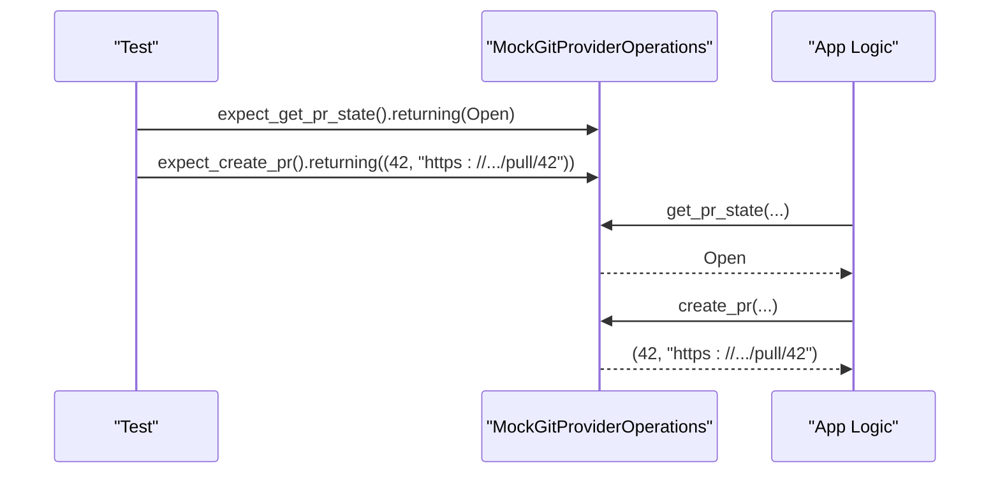
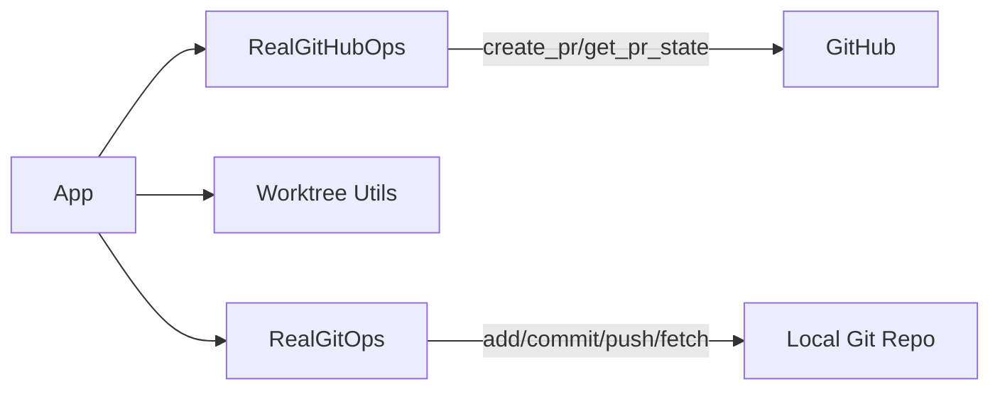
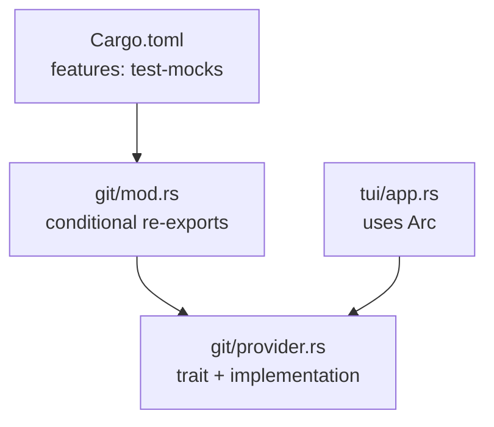
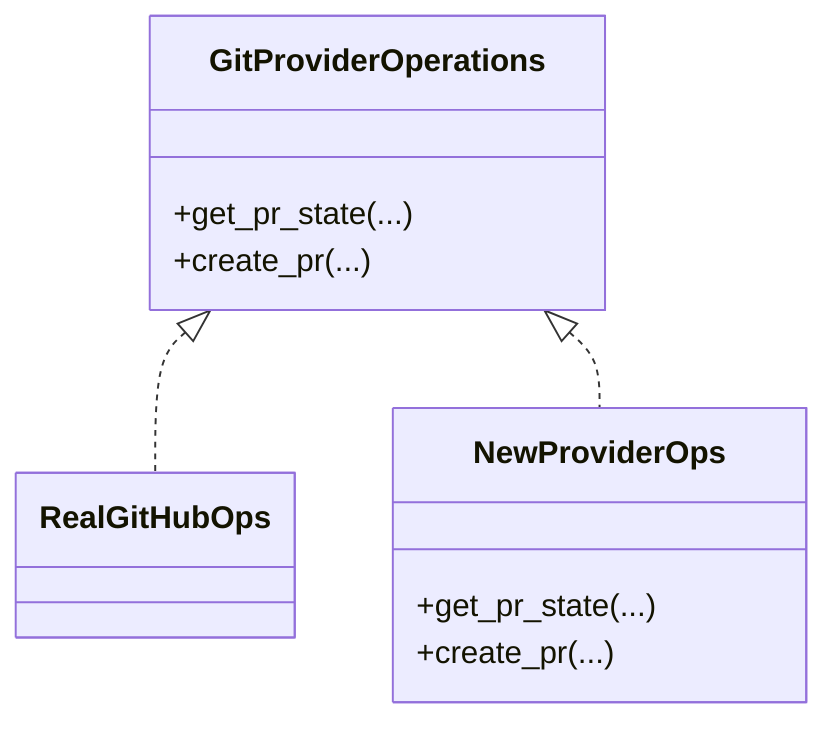

# Git Provider Abstraction

<cite>
**Referenced Files in This Document**
- [provider.rs](file://src/git/provider.rs)
- [operations.rs](file://src/git/operations.rs)
- [mod.rs](file://src/git/mod.rs)
- [worktree.rs](file://src/git/worktree.rs)
- [app.rs](file://src/tui/app.rs)
- [app_tests.rs](file://src/tui/app_tests.rs)
- [mock_infrastructure_tests.rs](file://tests/mock_infrastructure_tests.rs)
- [Cargo.toml](file://Cargo.toml)
</cite>

## Table of Contents
1. [Introduction](#introduction)
2. [Project Structure](#project-structure)
3. [Core Components](#core-components)
4. [Architecture Overview](#architecture-overview)
5. [Detailed Component Analysis](#detailed-component-analysis)
6. [Dependency Analysis](#dependency-analysis)
7. [Performance Considerations](#performance-considerations)
8. [Security Considerations](#security-considerations)
9. [Troubleshooting Guide](#troubleshooting-guide)
10. [Extensibility Guide](#extensibility-guide)
11. [Conclusion](#conclusion)

## Introduction
This document explains the Git provider abstraction layer and external service integration in the project. It focuses on how the system abstracts Git hosting providers (primarily GitHub) behind a trait-based interface, enabling testing with mocks and future extension to other providers. It documents the GitProviderOperations trait, the PullRequestState enum, the RealGitHubOps implementation, the mock infrastructure, and practical guidance for integrating new providers, configuration, and troubleshooting.

## Project Structure
The Git provider abstraction lives under the git module, alongside general Git operations and worktree utilities. The key files are:
- provider.rs: Defines the GitProviderOperations trait, PullRequestState enum, and RealGitHubOps implementation
- operations.rs: Defines the GitOperations trait and RealGitOps implementation for local Git actions
- mod.rs: Re-exports public APIs and conditionally exposes mock types via a feature flag
- worktree.rs: Provides worktree lifecycle and initialization utilities used by higher-level flows
- app.rs: Integrates the provider abstraction into the TUI application, wiring RealGitHubOps into the runtime
- app_tests.rs and mock_infrastructure_tests.rs: Demonstrate mock usage and integration patterns

**Diagram sources**
- [provider.rs:1-110](file://src/git/provider.rs#L1-L110)
- [operations.rs:1-276](file://src/git/operations.rs#L1-L276)
- [mod.rs:1-142](file://src/git/mod.rs#L1-L142)
- [worktree.rs:1-345](file://src/git/worktree.rs#L1-L345)
- [app.rs:1-8000](file://src/tui/app.rs#L1-L8000)
- [app_tests.rs:1-600](file://src/tui/app_tests.rs#L1-L600)
- [mock_infrastructure_tests.rs:1-220](file://tests/mock_infrastructure_tests.rs#L1-L220)

**Section sources**
- [provider.rs:1-110](file://src/git/provider.rs#L1-L110)
- [operations.rs:1-276](file://src/git/operations.rs#L1-L276)
- [mod.rs:1-142](file://src/git/mod.rs#L1-L142)
- [worktree.rs:1-345](file://src/git/worktree.rs#L1-L345)
- [app.rs:1-8000](file://src/tui/app.rs#L1-L8000)
- [app_tests.rs:1-600](file://src/tui/app_tests.rs#L1-L600)
- [mock_infrastructure_tests.rs:1-220](file://tests/mock_infrastructure_tests.rs#L1-L220)

## Core Components
- GitProviderOperations trait: Defines provider-agnostic operations for pull/merge requests (state inspection and creation).
- PullRequestState enum: Encapsulates the lifecycle state of a pull/merge request across providers.
- RealGitHubOps: Concrete implementation using the GitHub CLI (gh) to interact with GitHub.
- GitOperations trait and RealGitOps: Local Git operations (worktree management, commits, pushes, etc.) used in conjunction with provider operations.
- Worktree utilities: Support for creating, initializing, and cleaning up Git worktrees used during task execution.

These components work together so that higher-level application logic can depend on abstractions rather than specific providers, enabling testing and future extensibility.

**Section sources**
- [provider.rs:12-38](file://src/git/provider.rs#L12-L38)
- [provider.rs:40-109](file://src/git/provider.rs#L40-L109)
- [operations.rs:9-75](file://src/git/operations.rs#L9-L75)
- [operations.rs:77-276](file://src/git/operations.rs#L77-L276)
- [worktree.rs:1-345](file://src/git/worktree.rs#L1-L345)

## Architecture Overview
The application wires provider operations through an Arc<dyn GitProviderOperations>, allowing runtime selection between real implementations and mocks. The TUI application constructs RealGitHubOps and injects it into the runtime. Tests can swap in MockGitProviderOperations to isolate logic.

**Diagram sources**
- [provider.rs:21-38](file://src/git/provider.rs#L21-L38)
- [provider.rs:12-19](file://src/git/provider.rs#L12-L19)
- [provider.rs:40-109](file://src/git/provider.rs#L40-L109)
- [app.rs:500-850](file://src/tui/app.rs#L500-L850)

**Section sources**
- [provider.rs:21-38](file://src/git/provider.rs#L21-L38)
- [provider.rs:12-19](file://src/git/provider.rs#L12-L19)
- [provider.rs:40-109](file://src/git/provider.rs#L40-L109)
- [app.rs:500-850](file://src/tui/app.rs#L500-L850)

## Detailed Component Analysis

### GitProviderOperations Trait and PullRequestState Enum
- Purpose: Provide a stable contract for provider-agnostic pull/merge request operations.
- Methods:
  - get_pr_state: Queries the provider for the current state of a pull/merge request.
  - create_pr: Creates a pull/merge request against a head branch, optionally targeting a base branch for stacked PRs.
- PullRequestState: Normalized state enumeration to abstract provider differences.

**Diagram sources**
- [provider.rs:43-64](file://src/git/provider.rs#L43-L64)

**Section sources**
- [provider.rs:21-38](file://src/git/provider.rs#L21-L38)
- [provider.rs:12-19](file://src/git/provider.rs#L12-L19)

### RealGitHubOps Implementation
- Authentication: Relies on the GitHub CLI (gh) being installed and configured locally. The implementation executes gh commands with appropriate flags.
- API interactions: Uses gh pr view to query PR state and gh pr create to create PRs. It parses JSON output and extracts PR URLs and numbers.
- Error handling: Propagates failures from gh commands as errors; returns Unknown for non-success command outcomes.

**Diagram sources**
- [provider.rs:66-109](file://src/git/provider.rs#L66-L109)

**Section sources**
- [provider.rs:43-109](file://src/git/provider.rs#L43-L109)

### Mock Provider System for Testing
- Feature flag: test-mocks enables mockall-generated mocks for traits.
- Usage: Tests construct MockGitProviderOperations and configure expectations for get_pr_state and create_pr.
- Thread safety: Mocks can be wrapped in Arc<dyn GitProviderOperations> for shared use across threads.
- Examples: Integration tests demonstrate configuring mocks to return specific states and values, and asserting behavior in workflows like PR creation and pushing changes.

**Diagram sources**
- [mock_infrastructure_tests.rs:19-41](file://tests/mock_infrastructure_tests.rs#L19-L41)
- [app_tests.rs:255-282](file://src/tui/app_tests.rs#L255-L282)

**Section sources**
- [mod.rs:9-12](file://src/git/mod.rs#L9-L12)
- [mock_infrastructure_tests.rs:19-41](file://tests/mock_infrastructure_tests.rs#L19-L41)
- [app_tests.rs:255-282](file://src/tui/app_tests.rs#L255-L282)

### Integration in the Application
- Runtime wiring: The TUI application constructs RealGitHubOps and stores it as Arc<dyn GitProviderOperations>.
- Workflows: Higher-level functions use the provider operations to create PRs after preparing worktrees and commits, and to push updates to existing PRs.

**Diagram sources**
- [app.rs:7500-7550](file://src/tui/app.rs#L7500-L7550)
- [worktree.rs:1-345](file://src/git/worktree.rs#L1-L345)
- [operations.rs:77-276](file://src/git/operations.rs#L77-L276)

**Section sources**
- [app.rs:7500-7550](file://src/tui/app.rs#L7500-L7550)
- [worktree.rs:1-345](file://src/git/worktree.rs#L1-L345)
- [operations.rs:77-276](file://src/git/operations.rs#L77-L276)

## Dependency Analysis
- Feature flag test-mocks depends on mockall.
- The git module re-exports provider and operation traits and conditionally exposes mocks.
- The application depends on the provider abstraction via a trait object, enabling runtime substitution.

**Diagram sources**
- [Cargo.toml:39-41](file://Cargo.toml#L39-L41)
- [mod.rs:9-12](file://src/git/mod.rs#L9-L12)
- [provider.rs:21-38](file://src/git/provider.rs#L21-L38)
- [app.rs:500-850](file://src/tui/app.rs#L500-L850)

**Section sources**
- [Cargo.toml:39-41](file://Cargo.toml#L39-L41)
- [mod.rs:9-12](file://src/git/mod.rs#L9-L12)
- [provider.rs:21-38](file://src/git/provider.rs#L21-L38)
- [app.rs:500-850](file://src/tui/app.rs#L500-L850)

## Performance Considerations
- External process overhead: Both RealGitHubOps and RealGitOps rely on spawning external commands. Batch operations and minimizing redundant calls can help reduce latency.
- Parsing costs: RealGitHubOps parses CLI output; ensure parsing logic remains efficient and handles edge cases.
- Concurrency: Mocks can be safely shared via Arc<dyn ...>, but avoid excessive contention in tests by configuring expectations judiciously.

## Security Considerations
- Credential exposure: RealGitHubOps relies on the gh CLI being properly authenticated. Ensure credentials are managed securely by the CLI and not exposed in logs or error messages.
- Input sanitization: When constructing CLI arguments, avoid shell injection by passing arguments as separate array elements rather than concatenating strings.
- Error handling: Log minimal information in errors to prevent accidental credential disclosure in stack traces.

## Troubleshooting Guide
Common issues and resolutions:
- gh CLI not found or not authenticated:
  - Symptom: get_pr_state returns Unknown; create_pr fails with stderr from gh.
  - Resolution: Install and authenticate the GitHub CLI locally; verify with manual gh commands.
- PR creation failures:
  - Symptom: create_pr returns an error containing gh stderr.
  - Resolution: Inspect stderr for permission or branch protection errors; adjust permissions or branch configuration.
- Conflicting states:
  - Symptom: Unexpected Unknown state.
  - Resolution: Verify the PR exists and is accessible; check network connectivity and CLI configuration.
- Mock tests failing:
  - Symptom: Test expectations not met.
  - Resolution: Confirm feature flag test-mocks is enabled; ensure expectations match argument patterns and return values.

**Section sources**
- [provider.rs:43-64](file://src/git/provider.rs#L43-L64)
- [provider.rs:93-96](file://src/git/provider.rs#L93-L96)
- [mock_infrastructure_tests.rs:19-41](file://tests/mock_infrastructure_tests.rs#L19-L41)

## Extensibility Guide

### Adding a New Git Provider
To integrate a new provider (e.g., GitLab):
1. Define a new struct implementing GitProviderOperations (or add methods to an existing struct).
2. Implement get_pr_state and create_pr using the provider's API or CLI.
3. Add a constructor for the new provider and wire it into the application where RealGitHubOps is constructed.
4. Write tests using MockGitProviderOperations to validate behavior.

**Diagram sources**
- [provider.rs:21-38](file://src/git/provider.rs#L21-L38)
- [provider.rs:40-109](file://src/git/provider.rs#L40-L109)

### Configuration Requirements
- GitHub provider:
  - Requires the GitHub CLI (gh) installed and authenticated.
  - Typical installation and setup steps are provider-specific; ensure the CLI is available on PATH.
- General:
  - For testing with mocks, enable the test-mocks feature flag.

**Section sources**
- [provider.rs:43-109](file://src/git/provider.rs#L43-L109)
- [Cargo.toml:39-41](file://Cargo.toml#L39-L41)

### Example Workflows
- Creating a PR:
  - Prepare worktree and commits using RealGitOps.
  - Call create_pr on the provider abstraction to create the PR.
  - Store returned PR number and URL for later operations.
- Pushing updates to an existing PR:
  - Use RealGitOps to add, commit, and push changes.
  - Optionally query PR state via get_pr_state to inform UI or logic.

**Section sources**
- [operations.rs:77-276](file://src/git/operations.rs#L77-L276)
- [provider.rs:66-109](file://src/git/provider.rs#L66-L109)
- [app_tests.rs:255-282](file://src/tui/app_tests.rs#L255-L282)

## Conclusion
The Git provider abstraction cleanly separates external provider concerns from application logic through a trait-based design. RealGitHubOps provides a concrete implementation leveraging the GitHub CLI, while mocks enable robust testing. This architecture supports future extensions to other providers and maintains testability and maintainability.