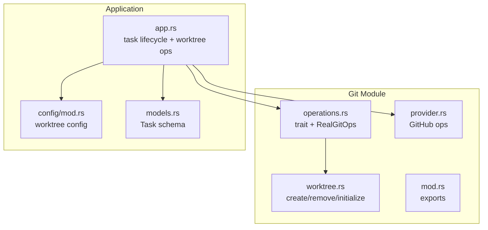
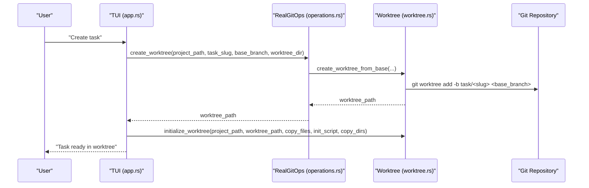
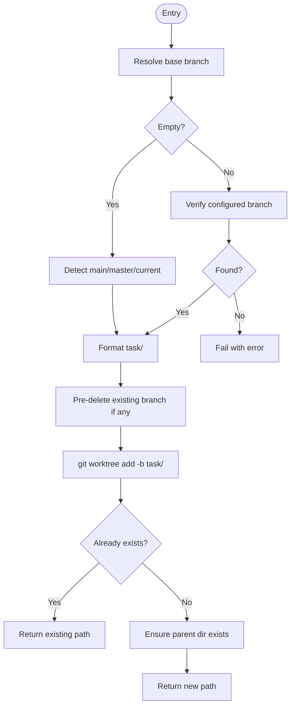
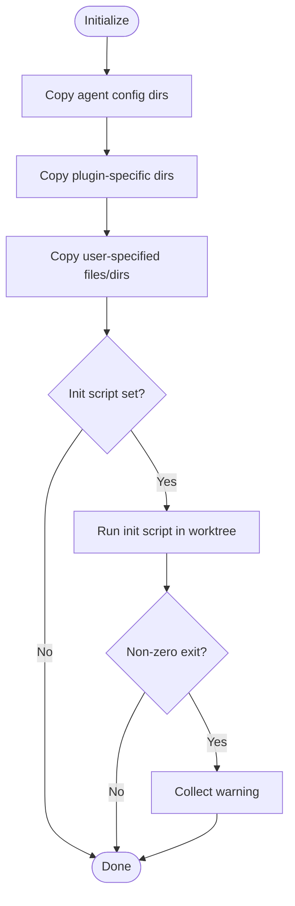
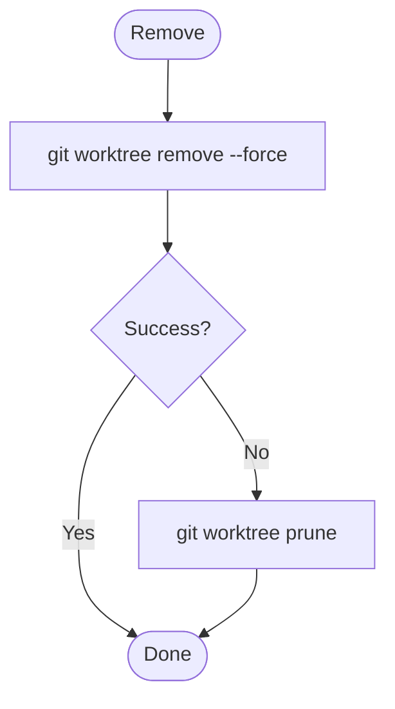
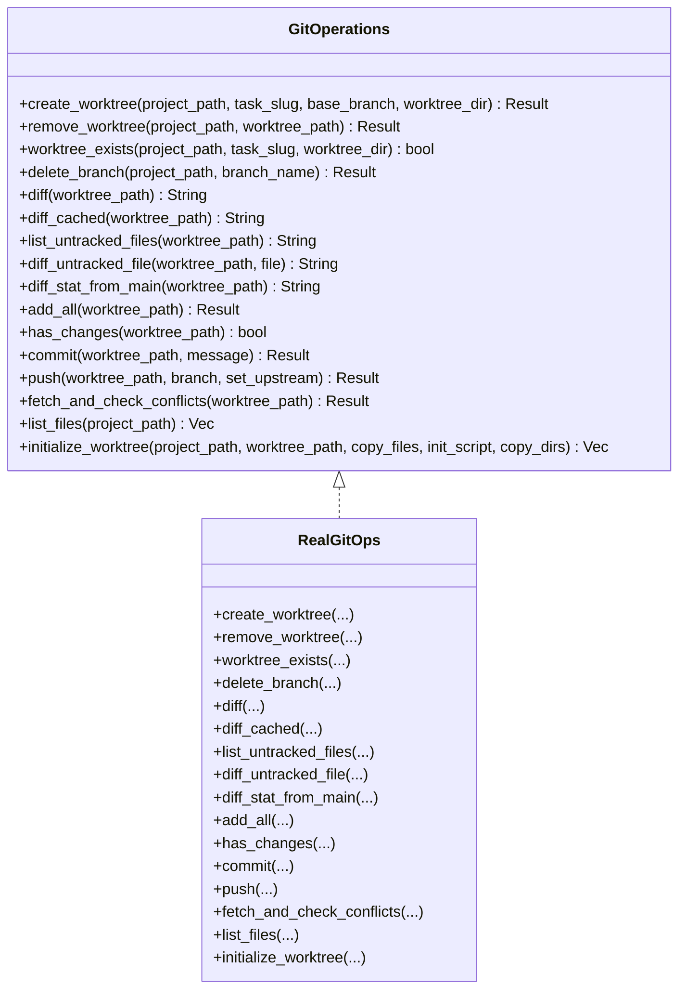
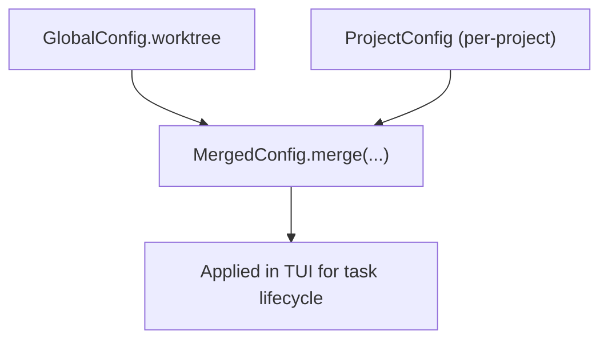
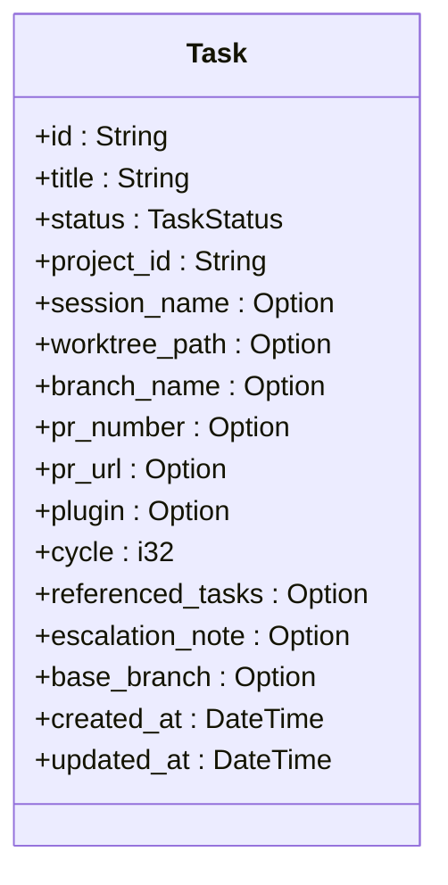
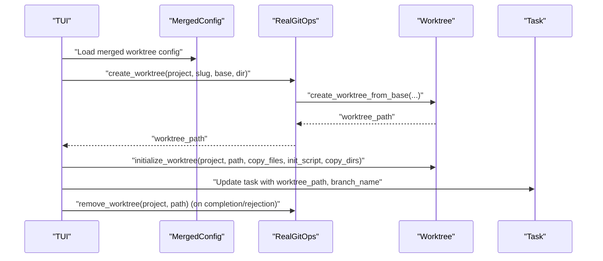
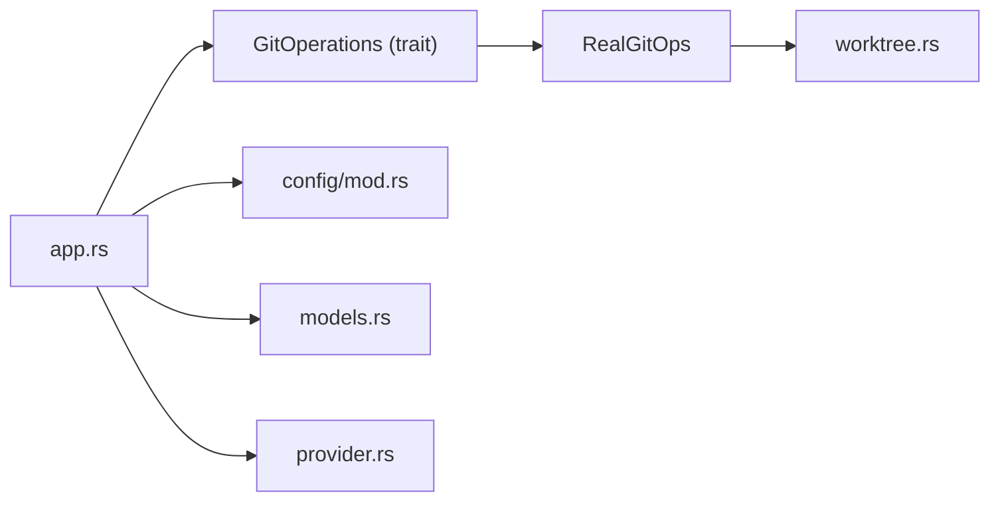

# Worktree Management

<cite>
**Referenced Files in This Document**
- [worktree.rs](file://src/git/worktree.rs)
- [operations.rs](file://src/git/operations.rs)
- [mod.rs](file://src/git/mod.rs)
- [provider.rs](file://src/git/provider.rs)
- [app.rs](file://src/tui/app.rs)
- [models.rs](file://src/db/models.rs)
- [config/mod.rs](file://src/config/mod.rs)
- [README.md](file://README.md)
- [git_tests.rs](file://tests/git_tests.rs)
</cite>

## Table of Contents
1. [Introduction](#introduction)
2. [Project Structure](#project-structure)
3. [Core Components](#core-components)
4. [Architecture Overview](#architecture-overview)
5. [Detailed Component Analysis](#detailed-component-analysis)
6. [Dependency Analysis](#dependency-analysis)
7. [Performance Considerations](#performance-considerations)
8. [Troubleshooting Guide](#troubleshooting-guide)
9. [Conclusion](#conclusion)

## Introduction
This document explains how agtx uses Git worktrees to isolate task-specific development environments. It covers automatic worktree creation, naming conventions, initialization, lifecycle management, cleanup, and integration with the broader task management workflow. It also compares worktree-based parallel development to traditional branch switching and outlines best practices for managing multiple active tasks.

## Project Structure
Worktree management is implemented in the git module and orchestrated by the TUI application. The key files are:
- Worktree core: src/git/worktree.rs
- Git operations abstraction: src/git/operations.rs
- Git module exports: src/git/mod.rs
- Provider operations (GitHub): src/git/provider.rs
- Application orchestration: src/tui/app.rs
- Task model and persistence: src/db/models.rs
- Configuration: src/config/mod.rs
- Documentation and architecture: README.md
- Tests: tests/git_tests.rs

**Diagram sources**
- [worktree.rs:1-345](file://src/git/worktree.rs#L1-L345)
- [operations.rs:1-276](file://src/git/operations.rs#L1-L276)
- [mod.rs:1-142](file://src/git/mod.rs#L1-L142)
- [provider.rs:1-110](file://src/git/provider.rs#L1-L110)
- [app.rs:1-200](file://src/tui/app.rs#L1-L200)
- [config/mod.rs:1-595](file://src/config/mod.rs#L1-L595)
- [models.rs:1-200](file://src/db/models.rs#L1-L200)

**Section sources**
- [worktree.rs:1-345](file://src/git/worktree.rs#L1-L345)
- [operations.rs:1-276](file://src/git/operations.rs#L1-L276)
- [mod.rs:1-142](file://src/git/mod.rs#L1-L142)
- [provider.rs:1-110](file://src/git/provider.rs#L1-L110)
- [app.rs:1-200](file://src/tui/app.rs#L1-L200)
- [config/mod.rs:160-198](file://src/config/mod.rs#L160-L198)
- [models.rs:58-133](file://src/db/models.rs#L58-L133)
- [README.md:506-547](file://README.md#L506-L547)

## Core Components
- Worktree creation and management:
  - Automatic detection of base branch (main/master fallback)
  - Naming convention: task/<slug>
  - Idempotent creation with cleanup of partial attempts
  - Removal with force and pruning fallback
- Initialization:
  - Copies agent configuration directories into each worktree
  - Supports copying user-specified files/directories
  - Optional init script execution inside the worktree
- Git operations abstraction:
  - Trait-based design enabling mocking and testing
  - Real implementation wraps worktree and standard git commands
- Configuration:
  - Global and project-level worktree settings
  - Base branch, worktree directory, copy files, init/cleanup scripts
- Lifecycle integration:
  - TUI coordinates worktree creation, initialization, and cleanup
  - Task model stores worktree path, branch name, and related metadata

**Section sources**
- [worktree.rs:8-65](file://src/git/worktree.rs#L8-L65)
- [worktree.rs:125-223](file://src/git/worktree.rs#L125-L223)
- [worktree.rs:275-317](file://src/git/worktree.rs#L275-L317)
- [operations.rs:9-75](file://src/git/operations.rs#L9-L75)
- [operations.rs:77-276](file://src/git/operations.rs#L77-L276)
- [config/mod.rs:160-228](file://src/config/mod.rs#L160-L228)
- [models.rs:58-133](file://src/db/models.rs#L58-L133)

## Architecture Overview
Agtx isolates each task in its own worktree directory under a configurable base branch. The TUI requests worktree creation, initializes the environment, and coordinates agent sessions. Cleanup occurs on task completion or rejection.

**Diagram sources**
- [app.rs:7063-7070](file://src/tui/app.rs#L7063-L7070)
- [operations.rs:80-91](file://src/git/operations.rs#L80-L91)
- [worktree.rs:14-65](file://src/git/worktree.rs#L14-L65)
- [worktree.rs:125-223](file://src/git/worktree.rs#L125-L223)

## Detailed Component Analysis

### Worktree Creation and Naming
- Base branch resolution:
  - If empty, detects main or master; falls back to current branch
  - If configured, verifies existence; fails early if missing
- Worktree path:
  - Relative to project root under a configurable directory
  - Default directory constant is exported for reuse
- Branch naming:
  - New branch created as task/<slug>
  - Pre-deletes any existing branch with the same name to handle failed attempts
- Idempotency:
  - If worktree already exists and is valid, returns the path without re-creating
  - Cleans partial directories before creation

**Diagram sources**
- [worktree.rs:67-84](file://src/git/worktree.rs#L67-L84)
- [worktree.rs:14-65](file://src/git/worktree.rs#L14-L65)
- [worktree.rs:25-38](file://src/git/worktree.rs#L25-L38)

**Section sources**
- [worktree.rs:67-84](file://src/git/worktree.rs#L67-L84)
- [worktree.rs:14-65](file://src/git/worktree.rs#L14-L65)
- [worktree.rs:25-38](file://src/git/worktree.rs#L25-L38)

### Worktree Initialization
Initialization copies essential assets into the worktree and optionally runs an init script:
- Agent configuration directories are always copied
- Plugin-specific directories can be included
- User-specified files/directories are copied (with warnings for missing entries)
- An optional init script runs inside the worktree; non-zero exit codes produce warnings

**Diagram sources**
- [worktree.rs:125-223](file://src/git/worktree.rs#L125-L223)

**Section sources**
- [worktree.rs:86-94](file://src/git/worktree.rs#L86-L94)
- [worktree.rs:125-223](file://src/git/worktree.rs#L125-L223)

### Worktree Removal and Cleanup
- Removal uses git worktree remove with force to handle uncommitted changes
- On failure, a prune operation is attempted to clean up stale references
- The TUI supports running a cleanup script inside the worktree before removal

**Diagram sources**
- [worktree.rs:275-297](file://src/git/worktree.rs#L275-L297)
- [app.rs:6921-6942](file://src/tui/app.rs#L6921-L6942)

**Section sources**
- [worktree.rs:275-297](file://src/git/worktree.rs#L275-L297)
- [app.rs:6921-6942](file://src/tui/app.rs#L6921-L6942)

### Git Operations Abstraction
- A trait defines the contract for worktree and git operations
- A real implementation wraps worktree.rs functions and standard git commands
- This enables testing with mocks and consistent integration across the app

**Diagram sources**
- [operations.rs:9-75](file://src/git/operations.rs#L9-L75)
- [operations.rs:77-276](file://src/git/operations.rs#L77-L276)

**Section sources**
- [operations.rs:9-75](file://src/git/operations.rs#L9-L75)
- [operations.rs:77-276](file://src/git/operations.rs#L77-L276)

### Configuration and Defaults
- Global worktree settings:
  - Enabled flag, auto cleanup, base branch, worktree directory
- Project-level overrides:
  - Base branch, worktree directory, copy files, init script, cleanup script
- Merged configuration:
  - Project-level values override global defaults

**Diagram sources**
- [config/mod.rs:160-198](file://src/config/mod.rs#L160-L198)
- [config/mod.rs:276-303](file://src/config/mod.rs#L276-L303)
- [config/mod.rs:355-388](file://src/config/mod.rs#L355-L388)

**Section sources**
- [config/mod.rs:160-198](file://src/config/mod.rs#L160-L198)
- [config/mod.rs:276-303](file://src/config/mod.rs#L276-L303)
- [config/mod.rs:355-388](file://src/config/mod.rs#L355-L388)

### Task Model and Worktree Metadata
- Tasks track worktree path, branch name, and related fields
- Session names are derived from task metadata and project identifiers

**Diagram sources**
- [models.rs:58-133](file://src/db/models.rs#L58-L133)

**Section sources**
- [models.rs:58-133](file://src/db/models.rs#L58-L133)

### Integration with Task Lifecycle
- Creation:
  - TUI resolves merged configuration and calls RealGitOps.create_worktree
  - Worktree path and branch name are stored on the task
- Initialization:
  - TUI invokes initialize_worktree with copy_files, init_script, and copy_dirs
- Cleanup:
  - On completion or rejection, TUI removes the worktree and optionally runs cleanup_script
- Conflict checks:
  - TUI uses git merge-tree to detect conflicts without modifying working trees

**Diagram sources**
- [app.rs:7063-7070](file://src/tui/app.rs#L7063-L7070)
- [operations.rs:80-91](file://src/git/operations.rs#L80-L91)
- [worktree.rs:125-223](file://src/git/worktree.rs#L125-L223)
- [worktree.rs:275-297](file://src/git/worktree.rs#L275-L297)
- [config/mod.rs:355-388](file://src/config/mod.rs#L355-L388)

**Section sources**
- [app.rs:7063-7070](file://src/tui/app.rs#L7063-L7070)
- [operations.rs:80-91](file://src/git/operations.rs#L80-L91)
- [worktree.rs:125-223](file://src/git/worktree.rs#L125-L223)
- [worktree.rs:275-297](file://src/git/worktree.rs#L275-L297)
- [config/mod.rs:355-388](file://src/config/mod.rs#L355-L388)

## Dependency Analysis
- Coupling:
  - TUI depends on GitOperations trait and RealGitOps implementation
  - RealGitOps depends on worktree.rs for core worktree operations
  - Configuration influences worktree creation and initialization
- Cohesion:
  - worktree.rs encapsulates Git worktree operations
  - operations.rs encapsulates the abstraction and real implementation
  - app.rs orchestrates lifecycle events and calls into the git layer
- External dependencies:
  - Git CLI for worktree operations
  - Optional GitHub CLI for PR operations

**Diagram sources**
- [operations.rs:9-75](file://src/git/operations.rs#L9-L75)
- [operations.rs:77-276](file://src/git/operations.rs#L77-L276)
- [worktree.rs:1-345](file://src/git/worktree.rs#L1-L345)
- [app.rs:1-200](file://src/tui/app.rs#L1-L200)
- [config/mod.rs:1-595](file://src/config/mod.rs#L1-L595)
- [models.rs:1-200](file://src/db/models.rs#L1-L200)
- [provider.rs:1-110](file://src/git/provider.rs#L1-L110)

**Section sources**
- [operations.rs:9-75](file://src/git/operations.rs#L9-L75)
- [operations.rs:77-276](file://src/git/operations.rs#L77-L276)
- [worktree.rs:1-345](file://src/git/worktree.rs#L1-L345)
- [app.rs:1-200](file://src/tui/app.rs#L1-L200)
- [config/mod.rs:1-595](file://src/config/mod.rs#L1-L595)
- [models.rs:1-200](file://src/db/models.rs#L1-L200)
- [provider.rs:1-110](file://src/git/provider.rs#L1-L110)

## Performance Considerations
- Parallel development:
  - Each task runs in its own worktree, avoiding interference and enabling truly parallel agent sessions
- Reduced context switching:
  - Worktrees eliminate the need to constantly switch branches and restore state
- Non-destructive conflict checks:
  - Using git merge-tree avoids costly rebase or checkout operations during conflict detection
- Cleanup automation:
  - Auto cleanup reduces disk usage and prevents clutter from stale worktrees

[No sources needed since this section provides general guidance]

## Troubleshooting Guide
- Worktree creation fails:
  - Verify base branch exists or leave empty to auto-detect
  - Ensure the worktree directory is writable
- Partial worktree remains:
  - The system cleans partial directories before creation; manual cleanup may be needed if interrupted
- Removal fails:
  - Force removal handles uncommitted changes; prune can clean stale references afterward
- Initialization issues:
  - Missing copy_files entries produce warnings; verify paths exist in the project root
  - Init script failures are reported with exit status and stderr
- Cleanup script:
  - Optional cleanup script runs before removal; non-zero exits are logged as warnings

**Section sources**
- [worktree.rs:67-84](file://src/git/worktree.rs#L67-L84)
- [worktree.rs:275-297](file://src/git/worktree.rs#L275-L297)
- [worktree.rs:125-223](file://src/git/worktree.rs#L125-L223)
- [app.rs:6921-6942](file://src/tui/app.rs#L6921-L6942)
- [git_tests.rs:137-154](file://tests/git_tests.rs#L137-L154)
- [git_tests.rs:272-297](file://tests/git_tests.rs#L272-L297)
- [git_tests.rs:318-401](file://tests/git_tests.rs#L318-L401)

## Conclusion
Agtx’s worktree management provides robust isolation for parallel task execution. By combining automatic creation, deterministic naming, initialization, and cleanup, it enables developers to run multiple agents simultaneously without polluting the main working directory. Configuration flexibility and non-destructive conflict checks further enhance reliability and developer productivity.

[No sources needed since this section summarizes without analyzing specific files]