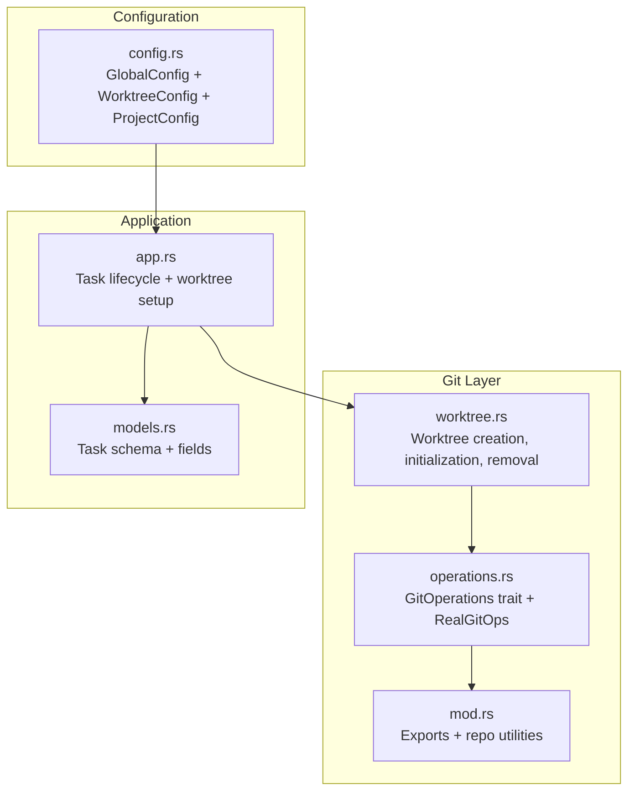
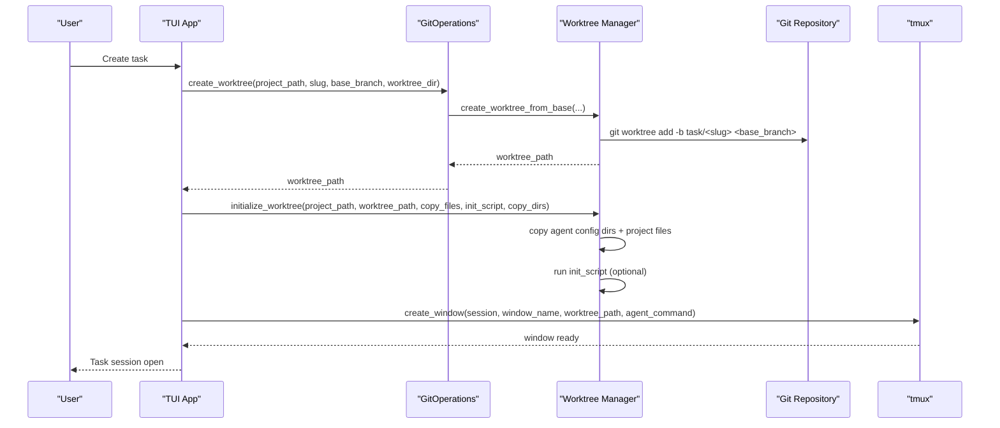
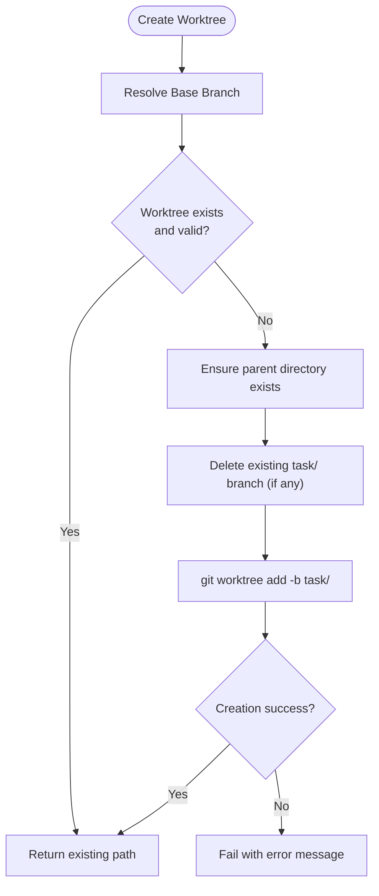
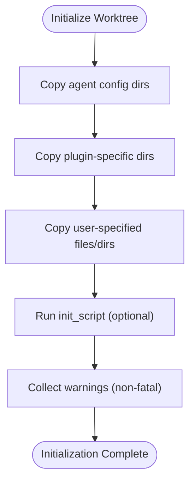
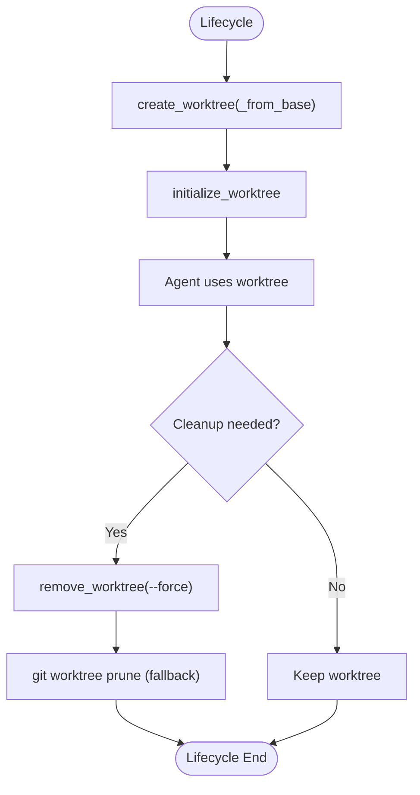
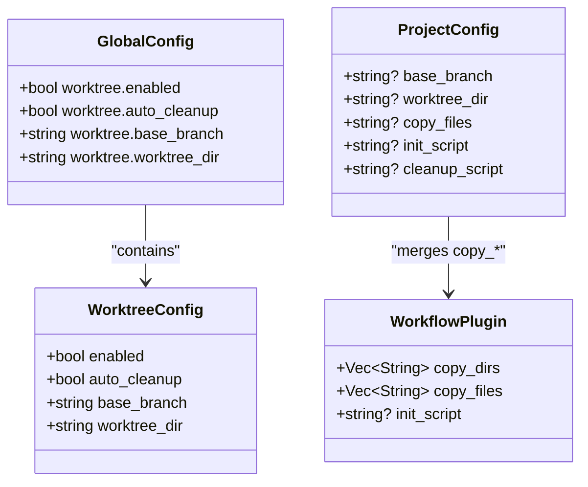
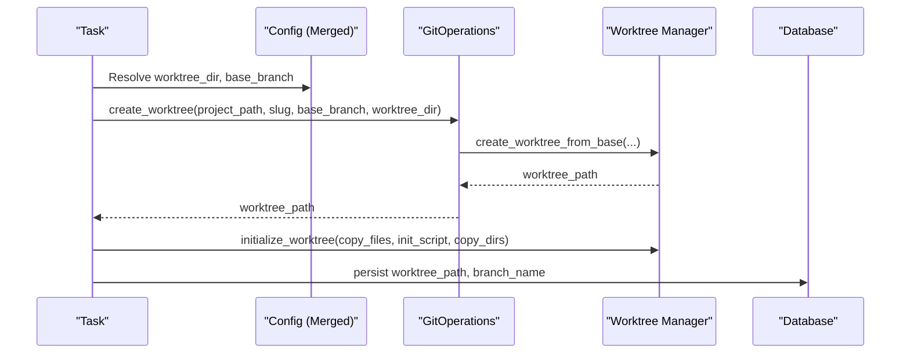
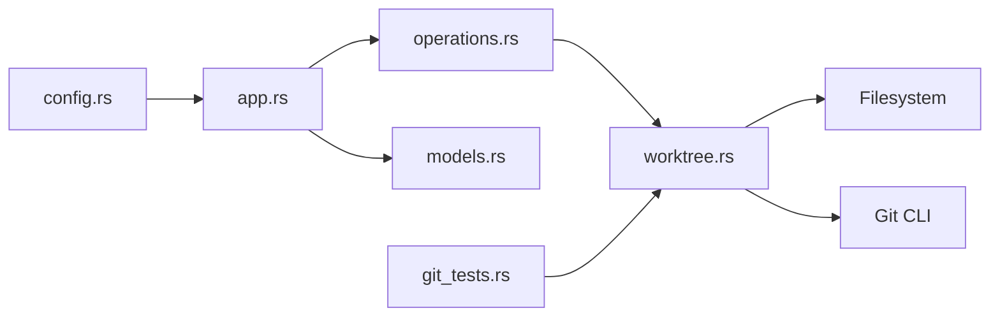

# Worktree Management

<cite>
**Referenced Files in This Document**
- [worktree.rs](file://src/git/worktree.rs)
- [mod.rs](file://src/git/mod.rs)
- [operations.rs](file://src/git/operations.rs)
- [config.rs](file://src/config/mod.rs)
- [README.md](file://README.md)
- [app.rs](file://src/tui/app.rs)
- [models.rs](file://src/db/models.rs)
- [git_tests.rs](file://tests/git_tests.rs)
</cite>

## Table of Contents
1. [Introduction](#introduction)
2. [Project Structure](#project-structure)
3. [Core Components](#core-components)
4. [Architecture Overview](#architecture-overview)
5. [Detailed Component Analysis](#detailed-component-analysis)
6. [Dependency Analysis](#dependency-analysis)
7. [Performance Considerations](#performance-considerations)
8. [Troubleshooting Guide](#troubleshooting-guide)
9. [Conclusion](#conclusion)

## Introduction
This document explains how AGTX creates and manages isolated Git worktrees for each task to prevent conflicts between parallel agent activities. It covers worktree naming using task slugs, directory organization under `.agtx/worktrees/`, initialization with proper Git configuration, lifecycle management (creation, cleanup, removal), customization options, and integration with the overall AGTX workflow.

## Project Structure
The worktree management system is implemented primarily in the Git module and integrated with configuration, TUI, and database layers:

- Git worktree creation and management: `src/git/worktree.rs`
- Git operations abstraction and implementation: `src/git/operations.rs`
- Git module exports and utilities: `src/git/mod.rs`
- Configuration for worktree behavior: `src/config/mod.rs`
- TUI integration and task lifecycle: `src/tui/app.rs`
- Database model for task metadata: `src/db/models.rs`
- Tests validating worktree behavior: `tests/git_tests.rs`
- Project documentation and usage: `README.md`

**Diagram sources**
- [worktree.rs:1-345](file://src/git/worktree.rs#L1-L345)
- [operations.rs:1-276](file://src/git/operations.rs#L1-L276)
- [mod.rs:1-142](file://src/git/mod.rs#L1-L142)
- [config.rs:160-228](file://src/config/mod.rs#L160-L228)
- [app.rs:6953-6988](file://src/tui/app.rs#L6953-L6988)
- [models.rs:58-133](file://src/db/models.rs#L58-L133)

**Section sources**
- [worktree.rs:1-345](file://src/git/worktree.rs#L1-L345)
- [operations.rs:1-276](file://src/git/operations.rs#L1-L276)
- [mod.rs:1-142](file://src/git/mod.rs#L1-L142)
- [config.rs:160-228](file://src/config/mod.rs#L160-L228)
- [app.rs:6953-6988](file://src/tui/app.rs#L6953-L6988)
- [models.rs:58-133](file://src/db/models.rs#L58-L133)

## Core Components
- Worktree creation and management:
  - Creates worktrees from a base branch (auto-detected main/master or configured)
  - Names worktrees using task slugs under `.agtx/worktrees/<slug>`
  - Initializes worktrees by copying agent configuration directories and optional files/scripts
- Git operations abstraction:
  - Provides a trait for worktree operations and a real implementation using Git commands
- Configuration:
  - Global and project-level worktree settings including base branch, directory, and automation flags
- TUI integration:
  - Orchestrates worktree creation during task setup and integrates with tmux sessions
- Database:
  - Stores task metadata including worktree path and branch name

**Section sources**
- [worktree.rs:8-65](file://src/git/worktree.rs#L8-L65)
- [operations.rs:9-75](file://src/git/operations.rs#L9-L75)
- [config.rs:160-197](file://src/config/mod.rs#L160-L197)
- [app.rs:6953-6988](file://src/tui/app.rs#L6953-L6988)
- [models.rs:58-133](file://src/db/models.rs#L58-L133)

## Architecture Overview
AGTX isolates parallel agent activities by creating a dedicated Git worktree per task. The worktree is initialized with agent configuration directories and optional project files, then opened in a tmux window for agent interaction. Cleanup occurs automatically based on configuration and task lifecycle events.

**Diagram sources**
- [worktree.rs:14-65](file://src/git/worktree.rs#L14-L65)
- [operations.rs:80-91](file://src/git/operations.rs#L80-L91)
- [app.rs:6953-6988](file://src/tui/app.rs#L6953-L6988)

## Detailed Component Analysis

### Worktree Creation and Naming
- Default directory: `.agtx/worktrees/`
- Naming convention: `<project_root>/.agtx/worktrees/<task_slug>`
- Base branch detection:
  - Auto-detects `main`, then `master`, then current branch
  - Can be overridden via configuration
- Branch creation:
  - New branch name pattern: `task/<slug>`
  - Previous branch deletion attempted to handle failed attempts
- Idempotency:
  - If a worktree already exists and is valid, it is reused

**Diagram sources**
- [worktree.rs:9-65](file://src/git/worktree.rs#L9-L65)

**Section sources**
- [worktree.rs:9-65](file://src/git/worktree.rs#L9-L65)

### Worktree Initialization
- Copies agent configuration directories (e.g., `.claude`, `.gemini`, `.codex`, `.github/agents`, `.config/opencode`)
- Supports plugin-specific directories via `copy_dirs`
- Supports user-specified files/directories via `copy_files` (comma-separated)
- Runs an optional `init_script` inside the worktree
- Collects warnings for non-fatal issues (e.g., missing files, script failures)

**Diagram sources**
- [worktree.rs:129-223](file://src/git/worktree.rs#L129-L223)

**Section sources**
- [worktree.rs:129-223](file://src/git/worktree.rs#L129-L223)

### Worktree Lifecycle Management
- Creation: `create_worktree()` or `create_worktree_from_base()`
- Existence check: `worktree_exists()` and `worktree_exists_with_dir()`
- Removal: `remove_worktree()` with force removal and pruning fallback
- Path resolution: `worktree_path()` and `worktree_path_with_dir()`

**Diagram sources**
- [worktree.rs:275-297](file://src/git/worktree.rs#L275-L297)
- [worktree.rs:299-317](file://src/git/worktree.rs#L299-L317)

**Section sources**
- [worktree.rs:275-317](file://src/git/worktree.rs#L275-L317)

### Configuration and Customization
- Global worktree settings:
  - `enabled`: toggle worktree usage
  - `auto_cleanup`: automatic cleanup after merge/reject
  - `base_branch`: default base branch (empty = auto-detect)
  - `worktree_dir`: directory relative to project root (default: `.agtx/worktrees`)
- Project-level overrides:
  - `base_branch`, `worktree_dir`, `copy_files`, `init_script`, `cleanup_script`
- Plugin-level integration:
  - `copy_dirs`: directories to copy from project root to worktrees
  - `copy_files`: files to copy from project root to worktrees (merged with project-level)
  - `init_script`: command to run inside worktree after creation

**Diagram sources**
- [config.rs:160-228](file://src/config/mod.rs#L160-L228)
- [config.rs:410-451](file://src/config/mod.rs#L410-L451)

**Section sources**
- [config.rs:160-228](file://src/config/mod.rs#L160-L228)
- [config.rs:410-451](file://src/config/mod.rs#L410-L451)

### Integration with AGTX Workflow
- Task creation:
  - Generates a unique slug from task ID and title
  - Creates worktree using configured base branch and directory
  - Initializes worktree with merged plugin and project settings
  - Opens tmux window for agent interaction
- Task metadata:
  - Stores worktree path and branch name on the task record
- Cleanup:
  - Automatic cleanup governed by configuration flags
  - Manual cleanup via removal APIs

**Diagram sources**
- [app.rs:6953-6988](file://src/tui/app.rs#L6953-L6988)
- [models.rs:58-133](file://src/db/models.rs#L58-L133)

**Section sources**
- [app.rs:6953-6988](file://src/tui/app.rs#L6953-L6988)
- [models.rs:58-133](file://src/db/models.rs#L58-L133)

### Practical Examples
- Creating a worktree from the base branch:
  - Use `create_worktree(project_path, task_slug)` to auto-detect base branch and create worktree
- Creating a worktree from a specific base branch:
  - Use `create_worktree_from_base(project_path, task_slug, base_branch, worktree_dir)`
- Checking worktree existence:
  - Use `worktree_exists(project_path, task_id)` or `worktree_exists_with_dir(...)` for custom directory
- Cleaning up completed worktrees:
  - Use `remove_worktree(project_path, task_id, worktree_dir)` with force removal
- Initializing worktrees with custom files and scripts:
  - Use `initialize_worktree(project_path, worktree_path, copy_files, init_script, copy_dirs)`

**Section sources**
- [worktree.rs:9-65](file://src/git/worktree.rs#L9-L65)
- [worktree.rs:129-223](file://src/git/worktree.rs#L129-L223)
- [worktree.rs:275-317](file://src/git/worktree.rs#L275-L317)
- [git_tests.rs:137-154](file://tests/git_tests.rs#L137-L154)
- [git_tests.rs:287-312](file://tests/git_tests.rs#L287-L312)

## Dependency Analysis
- Worktree manager depends on:
  - Git CLI for worktree operations
  - Filesystem for directory creation and copying
  - Configuration for base branch and directory resolution
- TUI depends on:
  - Git operations abstraction for worktree lifecycle
  - Database for task persistence
  - Configuration for worktree settings
- Tests validate:
  - Worktree creation idempotency
  - Initialization with copy_files and init_script
  - Removal with uncommitted changes

**Diagram sources**
- [config.rs:160-228](file://src/config/mod.rs#L160-L228)
- [app.rs:6953-6988](file://src/tui/app.rs#L6953-L6988)
- [operations.rs:1-276](file://src/git/operations.rs#L1-L276)
- [worktree.rs:1-345](file://src/git/worktree.rs#L1-L345)
- [models.rs:58-133](file://src/db/models.rs#L58-L133)
- [git_tests.rs:137-154](file://tests/git_tests.rs#L137-L154)

**Section sources**
- [config.rs:160-228](file://src/config/mod.rs#L160-L228)
- [app.rs:6953-6988](file://src/tui/app.rs#L6953-L6988)
- [operations.rs:1-276](file://src/git/operations.rs#L1-L276)
- [worktree.rs:1-345](file://src/git/worktree.rs#L1-L345)
- [models.rs:58-133](file://src/db/models.rs#L58-L133)
- [git_tests.rs:137-154](file://tests/git_tests.rs#L137-L154)

## Performance Considerations
- Worktree creation overhead:
  - Initial checkout and branch creation incur IO costs; reuse existing worktrees when possible
- File copying:
  - Large projects may benefit from selective `copy_files` and avoiding unnecessary directories
- Cleanup:
  - Frequent cleanup reduces disk usage; configure `auto_cleanup` appropriately
- Parallelism:
  - Multiple worktrees enable parallel agent execution; monitor resource usage (CPU, memory, disk)

## Troubleshooting Guide
- Permission problems:
  - Ensure the user has read/write permissions for the project root and `.agtx/worktrees/` directory
  - Verify Git and tmux are installed and accessible
- Disk space issues:
  - Worktrees consume disk space; remove unused worktrees or adjust cleanup policies
  - Use `git worktree prune` to remove stale entries if removal fails
- Cleanup failures:
  - If `remove_worktree` fails, the system attempts `git worktree prune`; manual intervention may be required
  - Check for uncommitted changes; force removal is supported
- Base branch verification:
  - If a configured base branch is not found, creation fails; verify branch names or leave empty to auto-detect
- Initialization warnings:
  - Missing files or failing init scripts produce warnings; address warnings to ensure consistent worktree state

**Section sources**
- [worktree.rs:67-84](file://src/git/worktree.rs#L67-L84)
- [worktree.rs:275-297](file://src/git/worktree.rs#L275-L297)
- [worktree.rs:129-223](file://src/git/worktree.rs#L129-L223)
- [git_tests.rs:287-312](file://tests/git_tests.rs#L287-L312)

## Conclusion
AGTX’s worktree management provides robust isolation for parallel agent activities by creating task-specific Git worktrees with configurable base branches and directories. The system supports flexible initialization, lifecycle management, and integration with the TUI and database layers. Proper configuration and cleanup practices help maintain performance and reliability across concurrent tasks.