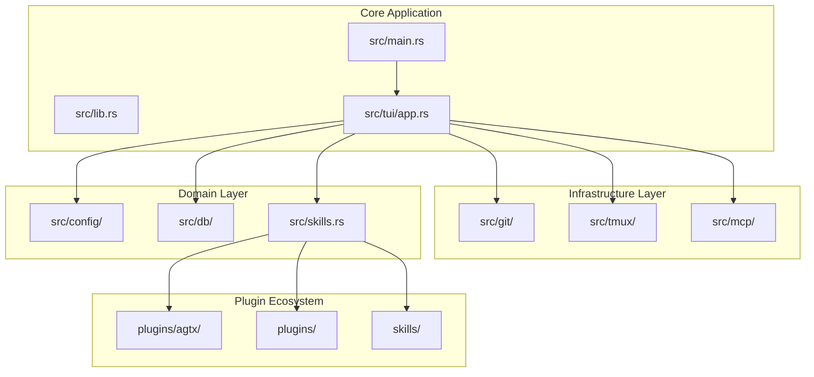
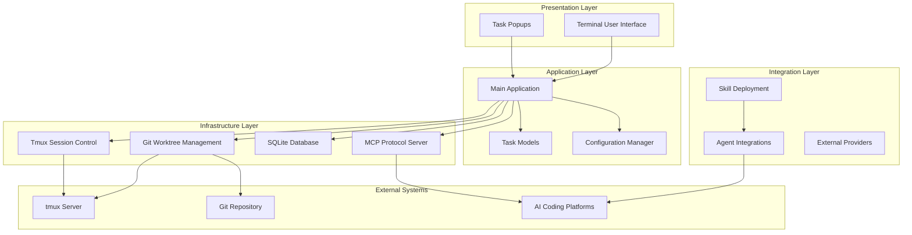
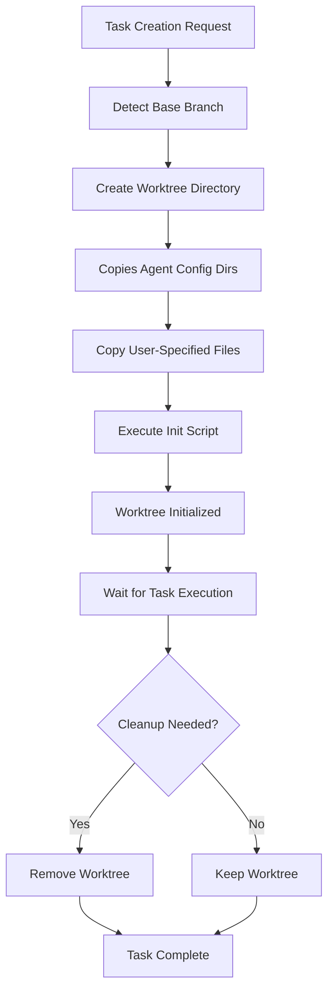
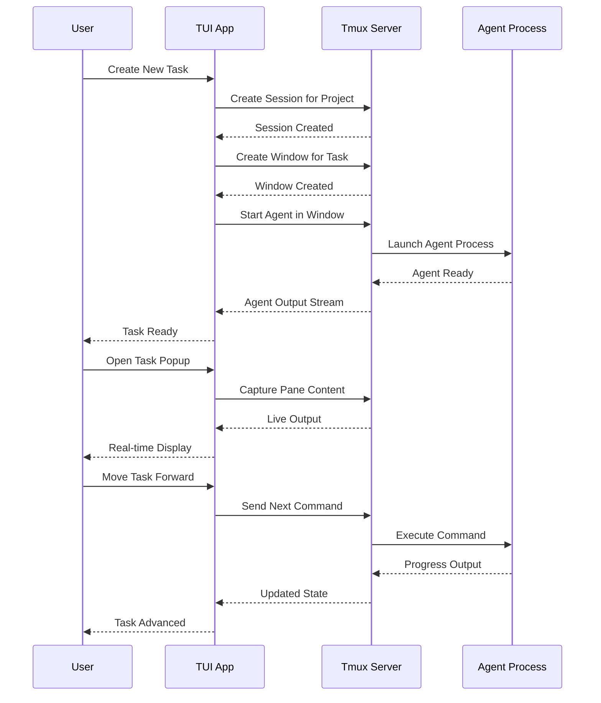
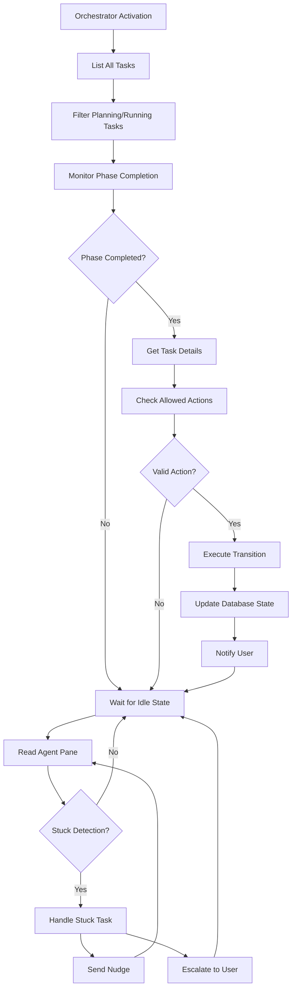
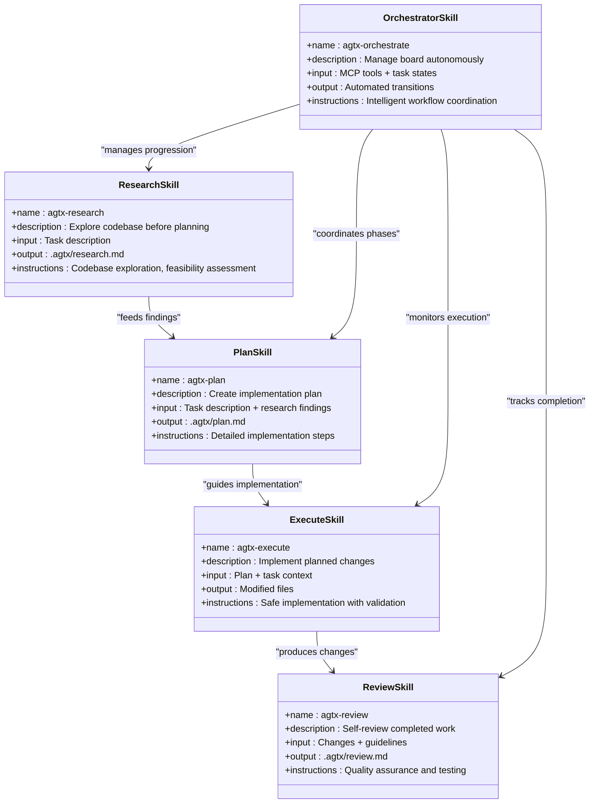
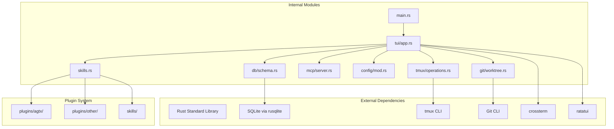

# Introduction

<cite>
**Referenced Files in This Document**
- [README.md](file://README.md)
- [AGENTS.md](file://AGENTS.md)
- [CLAUDE.md](file://CLAUDE.md)
- [src/main.rs](file://src/main.rs)
- [src/lib.rs](file://src/lib.rs)
- [src/tui/app.rs](file://src/tui/app.rs)
- [src/git/worktree.rs](file://src/git/worktree.rs)
- [src/tmux/operations.rs](file://src/tmux/operations.rs)
- [src/mcp/server.rs](file://src/mcp/server.rs)
- [plugins/agtx/plugin.toml](file://plugins/agtx/plugin.toml)
- [plugins/agtx/skills/orchestrate.md](file://plugins/agtx/skills/orchestrate.md)
- [plugins/agtx/skills/plan.md](file://plugins/agtx/skills/plan.md)
- [plugins/agtx/skills/research.md](file://plugins/agtx/skills/research.md)
- [plugins/agtx/skills/review.md](file://plugins/agtx/skills/review.md)
</cite>

## Table of Contents
1. [Introduction](#introduction)
2. [Project Structure](#project-structure)
3. [Core Components](#core-components)
4. [Architecture Overview](#architecture-overview)
5. [Detailed Component Analysis](#detailed-component-analysis)
6. [Dependency Analysis](#dependency-analysis)
7. [Performance Considerations](#performance-considerations)
8. [Troubleshooting Guide](#troubleshooting-guide)
9. [Conclusion](#conclusion)

## Introduction

Agtx is an AI agent orchestration platform designed specifically for terminal-native development workflows. It transforms the fragmented experience of managing multiple AI coding agents into a cohesive, parallelized kanban board that runs entirely within your terminal.

At its core, agtx provides a terminal-native kanban board where multiple coding agents work simultaneously—each in its own isolated git worktree, each in its own tmux window, and each guided by a spec-driven workflow managed by an orchestrator agent. This approach eliminates context switching, reduces cognitive load, and accelerates the AI-assisted development lifecycle from ideation to merge-ready code.

The platform's primary value proposition lies in its ability to orchestrate parallel agent collaboration. Instead of running one agent per task, agtx enables different AI agents to specialize by workflow phase: Gemini for research, Claude for implementation, and Codex for review. Each agent operates autonomously while maintaining context awareness and seamless handoffs, dramatically increasing throughput and reducing bottlenecks in complex development workflows.

Modern AI development workflows benefit tremendously from agtx's approach. Traditional AI coding tools provide one agent, one task, one terminal session. Agtx elevates this to a multi-agent, multi-phase workflow where tasks flow through research, planning, implementation, and review phases with automatic agent switching and context preservation. This mirrors real-world development practices where different specialists (researchers, implementers, reviewers) collaborate on complex features.

The implementation leverages Rust for performance and reliability, tmux for session isolation and persistence, and Git worktree management for safe, parallel experimentation. This combination creates a robust foundation for AI agent orchestration that scales from individual developers to distributed teams working on complex codebases.

## Project Structure

Agtx follows a modular architecture organized around distinct functional domains:

**Diagram sources**
- [src/main.rs:1-228](file://src/main.rs#L1-L228)
- [src/lib.rs:1-24](file://src/lib.rs#L1-L24)
- [src/tui/app.rs:1-200](file://src/tui/app.rs#L1-L200)

The project structure reflects a clean separation of concerns:

- **CLI Entry Point**: `src/main.rs` handles command-line parsing, feature flags, and application initialization
- **Core Library**: `src/lib.rs` defines shared types and application modes
- **Terminal User Interface**: `src/tui/app.rs` implements the kanban board interface with real-time task management
- **Infrastructure Services**: Separate modules for Git worktree management, tmux session control, and MCP protocol server
- **Plugin System**: Extensible workflow plugins with built-in skills for research, planning, execution, and review
- **Agent Integration**: Support for Claude Code, Codex, Gemini CLI, Cursor, and other AI coding platforms

**Section sources**
- [src/main.rs:1-228](file://src/main.rs#L1-L228)
- [src/lib.rs:1-24](file://src/lib.rs#L1-L24)
- [src/tui/app.rs:1-200](file://src/tui/app.rs#L1-L200)

## Core Components

### Terminal-Native Kanban Board

The heart of agtx is its terminal-native kanban board that visualizes and manages the entire AI development lifecycle. The board displays tasks across five columns: Backlog, Planning, Running, Review, and Done, mirroring the classic Kanban methodology adapted for AI-assisted development.

Each task represents a discrete unit of work that flows through the workflow phases. The board provides intuitive keyboard navigation (h/l for columns, j/k for tasks) and comprehensive task management capabilities including creation, editing, movement, and deletion. The interface adapts dynamically based on the current input mode and selected column, providing context-appropriate shortcuts and actions.

**Section sources**
- [README.md:105-164](file://README.md#L105-L164)
- [src/tui/app.rs:45-199](file://src/tui/app.rs#L45-L199)

### Parallel Agent Collaboration

Agtx orchestrates multiple AI coding agents working in parallel through a sophisticated session management system. Each task receives its own dedicated resources:

- **Git Worktree**: Isolated working directory for safe experimentation without affecting the main branch
- **Tmux Window**: Persistent terminal session with full conversation history and agent context
- **Agent Session**: Specialized AI agent configured for the specific workflow phase

This parallelization enables different agents to work simultaneously on complementary aspects of a feature. For example, while one agent researches codebase architecture, another implements planned changes, and a third reviews progress. The system automatically coordinates handoffs and maintains context across phase transitions.

**Section sources**
- [README.md:49-54](file://README.md#L49-L54)
- [CLAUDE.md:96-110](file://CLAUDE.md#L96-L110)

### Spec-Driven Workflow Plugins

The plugin system provides extensible workflow customization through TOML configuration files. Each plugin defines:

- **Commands**: Phase-specific commands sent to agents (auto-translated per agent type)
- **Prompts**: Task content templates with dynamic placeholders
- **Artifacts**: File patterns indicating phase completion
- **Copy-back**: Files transferred from worktree to project root upon completion

Built-in plugins include the default agtx workflow, GSD (Get Shit Done), Spec-Kit, OpenSpec, BMAD Method, Superpowers, and others. Each plugin encapsulates proven development methodologies while maintaining consistent integration points with the core orchestration system.

**Section sources**
- [README.md:329-504](file://README.md#L329-L504)
- [plugins/agtx/plugin.toml:1-16](file://plugins/agtx/plugin.toml#L1-L16)

### MCP Server Integration

The Model Context Protocol (MCP) server enables agtx to integrate with AI agents as a service. Two operational modes exist:

- **Global Mode**: Serves all projects via a centralized index database
- **Project-Scoped Mode**: Bound to a specific project for orchestrator agent coordination

The MCP server exposes tools for task management, project indexing, conflict checking, and real-time communication with orchestrator agents. This integration allows agents to programmatically interact with the board, enabling autonomous task progression and intelligent workflow orchestration.

**Section sources**
- [README.md:573-603](file://README.md#L573-L603)
- [src/mcp/server.rs:16-24](file://src/mcp/server.rs#L16-L24)

## Architecture Overview

Agtx implements a layered architecture that separates concerns while maintaining tight integration between components:

**Diagram sources**
- [src/tui/app.rs:1-200](file://src/tui/app.rs#L1-200)
- [src/git/worktree.rs:1-345](file://src/git/worktree.rs#L1-L345)
- [src/tmux/operations.rs:1-249](file://src/tmux/operations.rs#L1-L249)
- [src/mcp/server.rs:1-200](file://src/mcp/server.rs#L1-L200)

The architecture emphasizes:

- **Separation of Concerns**: Clear boundaries between presentation, application, infrastructure, and integration layers
- **Persistence**: Centralized SQLite database for state management across all projects
- **Isolation**: Git worktrees and tmux sessions provide strong isolation between tasks
- **Extensibility**: Plugin system and MCP server enable easy integration with new agents and workflows

**Section sources**
- [CLAUDE.md:21-92](file://CLAUDE.md#L21-L92)
- [AGENTS.md:16-31](file://AGENTS.md#L16-L31)

## Detailed Component Analysis

### Git Worktree Management

The worktree subsystem provides isolated development environments for each task, enabling parallel experimentation without risk to the main branch:

**Diagram sources**
- [src/git/worktree.rs:8-65](file://src/git/worktree.rs#L8-L65)
- [src/git/worktree.rs:129-223](file://src/git/worktree.rs#L129-L223)

Key features include automatic base branch detection (main/master fallback), recursive directory copying, script execution with environment variables, and robust cleanup procedures. The system preserves agent configuration directories and supports custom file copying for project-specific requirements.

**Section sources**
- [src/git/worktree.rs:1-345](file://src/git/worktree.rs#L1-L345)

### Tmux Session Orchestration

Tmux integration provides persistent, isolated terminal sessions for each task:

**Diagram sources**
- [src/tmux/operations.rs:64-110](file://src/tmux/operations.rs#L64-L110)
- [src/tmux/operations.rs:128-146](file://src/tmux/operations.rs#L128-L146)

The system maintains separate tmux servers for user sessions and agent sessions, ensuring isolation and preventing interference between developer workflows and automated processes. Windows persist across task lifecycle changes, enabling seamless resumption of work.

**Section sources**
- [src/tmux/operations.rs:1-249](file://src/tmux/operations.rs#L1-L249)

### Orchestrator Agent Implementation

The orchestrator agent represents an experimental autonomous agent that manages the kanban board:

**Diagram sources**
- [plugins/agtx/skills/orchestrate.md:30-100](file://plugins/agtx/skills/orchestrate.md#L30-L100)
- [plugins/agtx/skills/orchestrate.md:91-200](file://plugins/agtx/skills/orchestrate.md#L91-L200)

The orchestrator uses MCP tools to programmatically manage tasks, automatically advancing phases as completion criteria are met. It includes sophisticated stuck task detection, automatic prompt answering, and escalation mechanisms for complex decisions requiring human intervention.

**Section sources**
- [plugins/agtx/skills/orchestrate.md:1-200](file://plugins/agtx/skills/orchestrate.md#L1-L200)

### Workflow Phase Skills

Each workflow phase has dedicated skills that guide agent behavior:

**Diagram sources**
- [plugins/agtx/skills/research.md:1-45](file://plugins/agtx/skills/research.md#L1-L45)
- [plugins/agtx/skills/plan.md:1-43](file://plugins/agtx/skills/plan.md#L1-L43)
- [plugins/agtx/skills/review.md:1-36](file://plugins/agtx/skills/review.md#L1-L36)
- [plugins/agtx/skills/orchestrate.md:1-200](file://plugins/agtx/skills/orchestrate.md#L1-L200)

Each skill defines clear input requirements, execution instructions, and output formats. The research skill focuses on exploration and analysis, the plan skill creates detailed implementation strategies, the execute skill handles implementation with safety checks, and the review skill ensures quality and readiness for merging.

**Section sources**
- [plugins/agtx/skills/research.md:1-45](file://plugins/agtx/skills/research.md#L1-L45)
- [plugins/agtx/skills/plan.md:1-43](file://plugins/agtx/skills/plan.md#L1-L43)
- [plugins/agtx/skills/review.md:1-36](file://plugins/agtx/skills/review.md#L1-L36)

## Dependency Analysis

Agtx exhibits a well-structured dependency graph that promotes maintainability and testability:

**Diagram sources**
- [src/main.rs:1-228](file://src/main.rs#L1-L228)
- [src/tui/app.rs:1-200](file://src/tui/app.rs#L1-L200)
- [src/git/worktree.rs:1-345](file://src/git/worktree.rs#L1-L345)
- [src/tmux/operations.rs:1-249](file://src/tmux/operations.rs#L1-L249)
- [src/mcp/server.rs:1-200](file://src/mcp/server.rs#L1-L200)

The dependency analysis reveals:

- **Low Coupling**: Modules depend primarily on interfaces rather than concrete implementations
- **High Cohesion**: Each module has a focused responsibility within the overall system
- **Testable Design**: Mockable traits enable comprehensive unit testing
- **External Integration**: Minimal external dependencies reduce maintenance overhead

**Section sources**
- [CLAUDE.md:310-344](file://CLAUDE.md#L310-L344)
- [AGENTS.md:35-43](file://AGENTS.md#L35-L43)

## Performance Considerations

Agtx is designed with performance and scalability in mind:

- **Background Operations**: Long-running tasks (PR generation, phase status polling) execute in background threads to maintain UI responsiveness
- **Efficient State Management**: SQLite provides fast local storage with minimal network overhead
- **Resource Isolation**: Git worktrees and tmux sessions prevent resource contention between tasks
- **Lazy Loading**: Plugin configurations are loaded on-demand to minimize startup time
- **Memory Management**: Proper cleanup of temporary files and session resources prevents memory leaks

The system employs several optimization strategies:

- **Caching**: Phase status polling results cached with 2-second TTL to reduce tmux overhead
- **Asynchronous Processing**: MCP server operations handled asynchronously to prevent blocking
- **Efficient File Operations**: Recursive directory copying optimized for large codebases
- **Connection Pooling**: Database connections managed efficiently to handle concurrent operations

## Troubleshooting Guide

Common issues and their solutions:

### tmux Integration Problems

**Issue**: Tmux sessions not responding or agents not launching
- Verify tmux server is running: `tmux -L agtx list-sessions`
- Check permissions for tmux socket
- Restart tmux server if corrupted: `tmux -L agtx kill-server`

**Issue**: Agent sessions not persisting across restarts
- Ensure tmux server name consistency (`agtx`)
- Check that project sessions are properly named after project directories
- Verify tmux configuration allows detached sessions

### Git Worktree Issues

**Issue**: Worktree creation failing or corrupted
- Check base branch existence: `git rev-parse --verify main`
- Verify sufficient disk space for worktree creation
- Clean up orphaned worktrees: `git worktree prune`

**Issue**: File copying failures during worktree initialization
- Verify source files exist in project root
- Check file permissions and ownership
- Ensure adequate disk space in worktree directory

### MCP Server Problems

**Issue**: Agents cannot connect to MCP server
- Verify MCP server is running: `agtx mcp-serve`
- Check agent configuration for correct server registration
- Ensure JSON-RPC communication is not blocked by firewall

**Issue**: Global vs project-scoped mode confusion
- Use global mode for sweep/brainstorm skills across projects
- Use project-scoped mode for orchestrator agent coordination
- Verify project ID resolution for global operations

**Section sources**
- [README.md:549-572](file://README.md#L549-L572)
- [CLAUDE.md:318-322](file://CLAUDE.md#L318-L322)

## Conclusion

Agtx represents a significant advancement in AI agent orchestration for terminal-based development environments. By combining a terminal-native kanban board with sophisticated parallel agent management, it addresses the fundamental challenges of AI-assisted development: context switching, workflow coordination, and collaborative task management.

The platform's strength lies in its pragmatic approach to AI development workflows. Rather than trying to replace human judgment, it augments it by providing structured frameworks for research, planning, implementation, and review. The parallel execution model enables teams to leverage multiple AI agents simultaneously, dramatically accelerating development throughput while maintaining quality standards.

The technical implementation demonstrates best practices in systems design: clean separation of concerns, robust abstraction layers, comprehensive testing strategies, and thoughtful integration with existing developer tools. The use of Rust ensures performance and reliability, while the plugin architecture enables continuous evolution and adaptation to emerging AI development paradigms.

For organizations adopting AI-assisted development, agtx provides a solid foundation for scaling AI collaboration beyond individual developer experiments to team-wide workflows. Its integration with popular AI coding platforms (Claude Code, Codex, Gemini CLI, Cursor) ensures broad compatibility while maintaining the flexibility to adapt to future developments in AI agent technology.

The platform's position in the AI development ecosystem is complementary to existing tools. While individual AI coding agents excel at specific tasks, agtx provides the orchestration and workflow management necessary for complex, multi-phase development projects. This makes it particularly valuable for teams working on substantial codebases where coordination and context management become critical factors in development success.