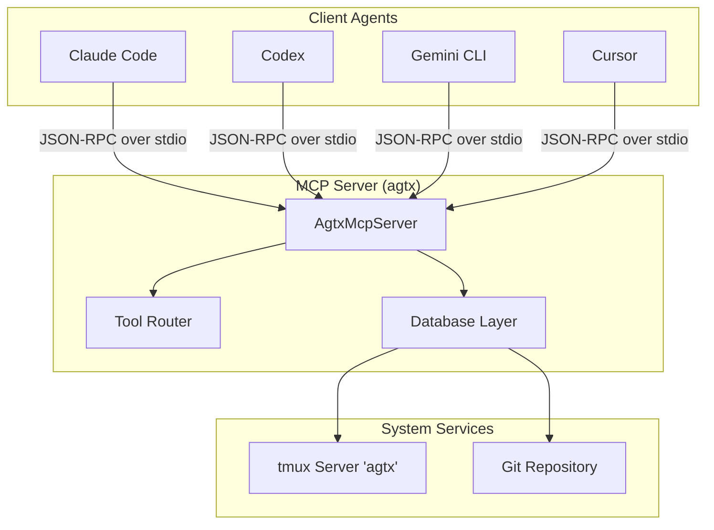
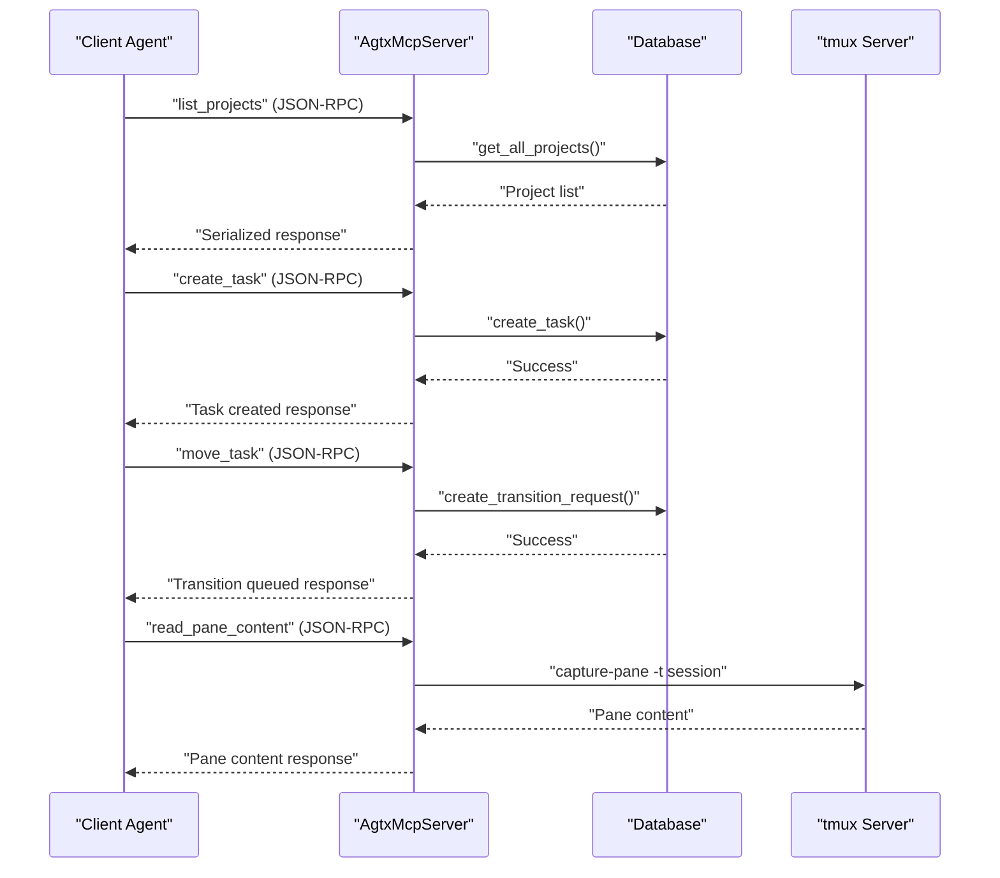
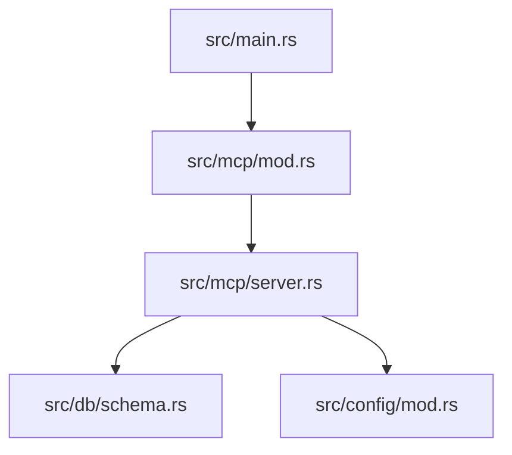

# MCP Client Development

<cite>
**Referenced Files in This Document**
- [README.md](file://README.md)
- [src/mcp/server.rs](file://src/mcp/server.rs)
- [src/mcp/mod.rs](file://src/mcp/mod.rs)
- [src/main.rs](file://src/main.rs)
- [Cargo.toml](file://Cargo.toml)
- [src/db/schema.rs](file://src/db/schema.rs)
- [src/db/models.rs](file://src/db/models.rs)
- [src/config/mod.rs](file://src/config/mod.rs)
- [src/skills.rs](file://src/skills.rs)
- [.mcp.json](file://.mcp.json)
- [tests/mcp_tests.rs](file://tests/mcp_tests.rs)
- [CLAUDE.md](file://CLAUDE.md)
</cite>

## Table of Contents
1. [Introduction](#introduction)
2. [Project Structure](#project-structure)
3. [Core Components](#core-components)
4. [Architecture Overview](#architecture-overview)
5. [Detailed Component Analysis](#detailed-component-analysis)
6. [Dependency Analysis](#dependency-analysis)
7. [Performance Considerations](#performance-considerations)
8. [Troubleshooting Guide](#troubleshooting-guide)
9. [Conclusion](#conclusion)
10. [Appendices](#appendices)

## Introduction
This document provides comprehensive guidance for developing clients that communicate with the agtx Model Context Protocol (MCP) server. It explains the MCP protocol specification as implemented by agtx, outlines client library development guidelines, and documents integration patterns for task management, project exploration, and workflow automation. The document covers authentication mechanisms, connection management, error handling strategies, and the JSON-RPC client implementation including request formatting, response parsing, and timeout handling. Practical examples and best practices for security, debugging, and logging are included.

## Project Structure
The agtx project exposes an MCP server that integrates with terminal-based agent sessions and a Kanban board. The MCP server is implemented in Rust and uses the rmcp library for JSON-RPC over stdio transport. The server provides tools for listing projects, managing tasks, queuing transitions, checking merge conflicts, and interacting with agent panes.

**Diagram sources**
- [src/mcp/server.rs:1245-1263](file://src/mcp/server.rs#L1245-L1263)
- [src/main.rs:30-46](file://src/main.rs#L30-L46)

**Section sources**
- [README.md:573-646](file://README.md#L573-L646)
- [src/mcp/server.rs:1218-1243](file://src/mcp/server.rs#L1218-L1243)
- [src/main.rs:30-46](file://src/main.rs#L30-L46)

## Core Components
- MCP Server Implementation: The AgtxMcpServer struct implements the MCP server using rmcp macros and handlers. It exposes tools for project and task management, transition queuing, conflict checking, notifications, and agent pane interaction.
- Tool Router: The tool_router macro generates tool definitions with parameter and response schemas, enabling automatic JSON-RPC method dispatch.
- Database Layer: The Database wrapper manages SQLite connections for project and global indexes, providing CRUD operations for tasks, transition requests, and notifications.
- Configuration: Global and project configurations are merged to determine defaults for agents, worktrees, and plugins.
- Skills and Plugins: Built-in skills and plugin configurations enable agent-specific command transformations and workflow phases.

**Section sources**
- [src/mcp/server.rs:395-400](file://src/mcp/server.rs#L395-L400)
- [src/mcp/server.rs:521-1216](file://src/mcp/server.rs#L521-L1216)
- [src/db/schema.rs:8-656](file://src/db/schema.rs#L8-L656)
- [src/config/mod.rs:337-408](file://src/config/mod.rs#L337-L408)
- [src/skills.rs:14-29](file://src/skills.rs#L14-L29)

## Architecture Overview
The MCP server operates over stdio using rmcp's stdio transport. Clients register the server locally and invoke tools via JSON-RPC. The server validates parameters, queries the database, and interacts with tmux to manage agent sessions.

**Diagram sources**
- [src/mcp/server.rs:521-1216](file://src/mcp/server.rs#L521-L1216)
- [src/db/schema.rs:212-240](file://src/db/schema.rs#L212-L240)
- [src/db/schema.rs:480-497](file://src/db/schema.rs#L480-L497)

**Section sources**
- [src/mcp/server.rs:1218-1243](file://src/mcp/server.rs#L1218-L1243)
- [src/db/schema.rs:8-656](file://src/db/schema.rs#L8-L656)

## Detailed Component Analysis

### MCP Protocol Specification
- Transport: stdio using rmcp transport::io::stdio.
- Capabilities: Tools-enabled server capability.
- Server Info: Instructions differ between Global and Project-scoped modes; in Global mode, clients must call list_projects first and pass project_id to CRUD tools.
- Tool Definitions: Generated via #[tool] and #[tool_router] macros with parameter and response structs annotated with schemars::JsonSchema.

Key server behaviors:
- Global mode requires project_id for CRUD tools; Project-scoped mode ignores project_id.
- Allowed actions are computed per task based on status and plugin rules.
- Conflict checks use non-destructive git merge-tree checks.
- Notifications are stored and consumed atomically.

**Section sources**
- [src/mcp/server.rs:1218-1243](file://src/mcp/server.rs#L1218-L1243)
- [src/mcp/server.rs:16-24](file://src/mcp/server.rs#L16-L24)
- [src/mcp/server.rs:474-518](file://src/mcp/server.rs#L474-L518)
- [src/mcp/server.rs:757-832](file://src/mcp/server.rs#L757-L832)
- [src/mcp/server.rs:834-858](file://src/mcp/server.rs#L834-L858)
- [src/mcp/server.rs:860-910](file://src/mcp/server.rs#L860-L910)
- [src/mcp/server.rs:912-974](file://src/mcp/server.rs#L912-L974)

### Authentication Mechanisms
- Registration: Clients register the MCP server locally using agent-specific commands (e.g., claude mcp add-json --scope local).
- Scope: Local registration is used for the orchestrator and skills; cleanup occurs on exit.
- Security: The server does not implement explicit authentication; trust boundaries rely on local process isolation and agent configuration.

**Section sources**
- [README.md:194-256](file://README.md#L194-L256)
- [CLAUDE.md:205-211](file://CLAUDE.md#L205-L211)

### Connection Management
- Launch Modes:
  - Global: agtx mcp-serve (requires project_id for CRUD tools).
  - Project-scoped: agtx mcp-serve <path> (fixed project path).
- Validation: The serve function validates database availability for the chosen mode before starting the server.
- Transport: stdio transport is used for all JSON-RPC communications.

**Section sources**
- [src/main.rs:30-46](file://src/main.rs#L30-L46)
- [src/mcp/server.rs:1245-1263](file://src/mcp/server.rs#L1245-L1263)

### Error Handling Strategies
- Parameter Validation: Tools validate inputs (e.g., valid actions, existing referenced tasks, Backlog-only updates/deletes).
- Database Errors: Errors from database operations are propagated as formatted strings.
- Transition Requests: Pending requests are tracked with timestamps and can be cleaned up after a retention period.
- Notification Consumption: Notifications are atomically consumed to prevent duplicates.

**Section sources**
- [src/mcp/server.rs:655-721](file://src/mcp/server.rs#L655-L721)
- [src/mcp/server.rs:1111-1178](file://src/mcp/server.rs#L1111-L1178)
- [src/mcp/server.rs:1183-1215](file://src/mcp/server.rs#L1183-L1215)
- [src/db/schema.rs:478-554](file://src/db/schema.rs#L478-L554)
- [src/db/schema.rs:596-654](file://src/db/schema.rs#L596-L654)

### JSON-RPC Client Implementation
- Request Formatting: Clients send JSON-RPC 2.0 requests over stdio with method names matching tool definitions and properly structured params.
- Response Parsing: Responses are serialized JSON containing tool-specific result objects.
- Timeout Handling: The rmcp stdio transport does not enforce timeouts; clients should implement application-level timeouts around tool invocations.

Implementation guidance:
- Use the rmcp stdio transport for Rust clients.
- Validate tool parameters using the generated JsonSchema metadata.
- Parse responses into strongly-typed structs defined in the server module.

**Section sources**
- [src/mcp/server.rs:521-1216](file://src/mcp/server.rs#L521-L1216)
- [Cargo.toml:37](file://Cargo.toml#L37)

### Common Client Patterns
- Task Management:
  - List tasks, filter by status, and retrieve task details including allowed_actions.
  - Create single or batch tasks with dependency wiring.
  - Update or delete backlog tasks.
  - Queue transitions and poll status.
- Project Exploration:
  - List projects and resolve project_id for Global mode operations.
- Workflow Automation:
  - Use allowed_actions to drive automated transitions.
  - Monitor notifications and read pane content to diagnose stuck agents.
  - Send messages to agent panes to nudge progress.

**Section sources**
- [src/mcp/server.rs:521-1216](file://src/mcp/server.rs#L521-L1216)
- [src/db/models.rs:58-133](file://src/db/models.rs#L58-L133)

### Practical Examples and Best Practices
- Example: Register MCP server locally and call list_projects.
- Example: Create tasks in batch with index-based dependencies.
- Example: Check merge conflicts and handle results.
- Example: Consume notifications and read pane content for diagnostics.
- Best Practices:
  - Always call list_projects first in Global mode.
  - Validate project_id presence for CRUD tools in Global mode.
  - Use allowed_actions to gate transitions.
  - Implement retry/backoff for transient errors.
  - Log request/response payloads for debugging.

**Section sources**
- [README.md:194-256](file://README.md#L194-L256)
- [src/mcp/server.rs:521-1216](file://src/mcp/server.rs#L521-L1216)

### Security Considerations
- Local Trust Boundaries: The server runs in-process with the agent; rely on OS-level process isolation.
- Data Validation: Validate all inputs and sanitize any user-provided strings before database insertion.
- Secure Communication: Since transport is stdio, ensure proper file descriptor handling and avoid exposing sensitive data in logs.
- Authentication: No explicit authentication; restrict access to trusted agents and environments.

**Section sources**
- [src/mcp/server.rs:1218-1243](file://src/mcp/server.rs#L1218-L1243)
- [README.md:573-646](file://README.md#L573-L646)

## Dependency Analysis
The MCP server depends on rmcp for JSON-RPC handling, serde for serialization, and SQLite via rusqlite for persistence. The main entry point routes to the MCP serve function based on CLI arguments.

**Diagram sources**
- [src/main.rs:30-46](file://src/main.rs#L30-L46)
- [src/mcp/mod.rs:1-4](file://src/mcp/mod.rs#L1-L4)
- [src/mcp/server.rs:1-14](file://src/mcp/server.rs#L1-L14)

**Section sources**
- [Cargo.toml:12-37](file://Cargo.toml#L12-L37)
- [src/main.rs:30-46](file://src/main.rs#L30-L46)
- [src/mcp/mod.rs:1-4](file://src/mcp/mod.rs#L1-L4)

## Performance Considerations
- Database Transactions: Batch operations (e.g., create_tasks_batch) use transactions to ensure atomicity and reduce overhead.
- Indexes: Database schema includes indexes on frequently queried columns (status, project_id).
- Cleanup: Old transition requests are cleaned up periodically to prevent table bloat.
- Asynchronous Runtime: The project uses Tokio; clients can leverage async I/O for concurrent tool invocations.

**Section sources**
- [src/db/schema.rs:242-274](file://src/db/schema.rs#L242-L274)
- [src/db/schema.rs:117-118](file://src/db/schema.rs#L117-L118)
- [src/db/schema.rs:545-554](file://src/db/schema.rs#L545-L554)
- [Cargo.toml:18](file://Cargo.toml#L18)

## Troubleshooting Guide
Common issues and resolutions:
- Project not found: Ensure the project has been opened in agtx at least once so it appears in list_projects.
- Global mode missing project_id: Always call list_projects first and pass the resolved project_id to CRUD tools.
- Task not found: Verify task_id correctness and project context.
- Transition not processed: Use get_transition_status to check completion or error details.
- Pane content errors: Confirm tmux session exists and is accessible.
- Database errors: Check permissions and path validity for project/global databases.

Debugging tips:
- Enable verbose logging in client applications.
- Inspect serialized request/response payloads.
- Use get_notifications to verify event delivery.
- Validate allowed_actions before attempting transitions.

**Section sources**
- [README.md:258-260](file://README.md#L258-L260)
- [src/mcp/server.rs:726-755](file://src/mcp/server.rs#L726-L755)
- [src/mcp/server.rs:860-910](file://src/mcp/server.rs#L860-L910)
- [src/db/schema.rs:596-654](file://src/db/schema.rs#L596-L654)

## Conclusion
The agtx MCP server provides a robust foundation for integrating agents with a terminal-based Kanban board. Clients should adhere to the documented modes and tool contracts, implement proper error handling, and follow security best practices. The provided patterns and examples enable efficient task management, project exploration, and workflow automation across diverse agent ecosystems.

## Appendices

### MCP Tools Reference
- list_projects: List all indexed projects.
- list_tasks: List tasks with optional status filter.
- get_task: Retrieve task details including allowed_actions.
- create_task: Create a single backlog task.
- create_tasks_batch: Create multiple tasks with index-based dependencies.
- update_task: Update backlog task fields.
- delete_task: Delete a backlog task.
- move_task: Queue a task state transition.
- get_transition_status: Check transition request status.
- check_conflicts: Non-destructive merge conflict check.
- get_notifications: Fetch and consume pending notifications.
- read_pane_content: Read last N lines from agent pane.
- send_to_task: Send message to agent pane.

**Section sources**
- [README.md:586-602](file://README.md#L586-L602)
- [src/mcp/server.rs:521-1216](file://src/mcp/server.rs#L521-L1216)

### Configuration and Registration
- Local registration: Use agent-specific commands to add the MCP server locally.
- Configuration files: Global and project config determine defaults for agents, worktrees, and plugins.
- Plugin loading: Built-in and external plugins are supported with agent-specific command transformations.

**Section sources**
- [README.md:194-256](file://README.md#L194-L256)
- [src/config/mod.rs:337-408](file://src/config/mod.rs#L337-L408)
- [src/skills.rs:35-45](file://src/skills.rs#L35-L45)