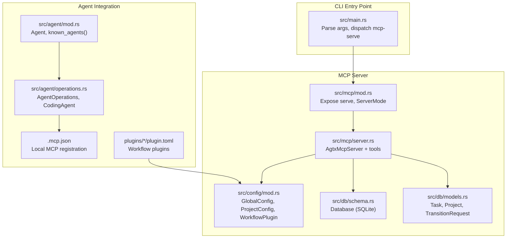
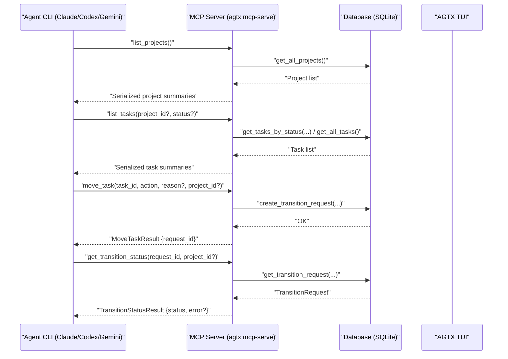
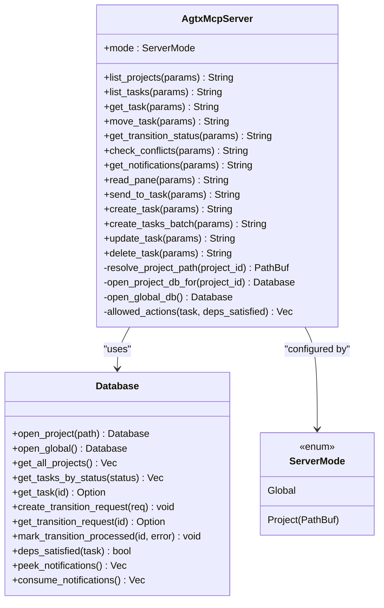
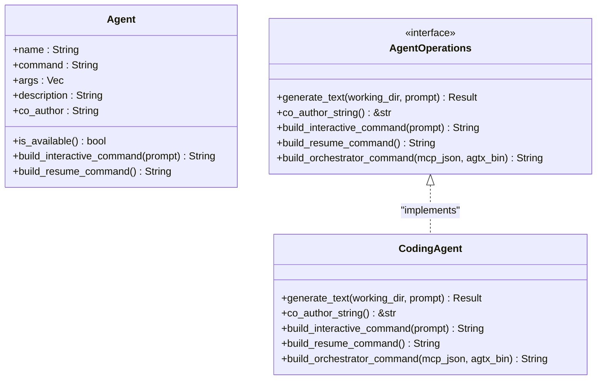
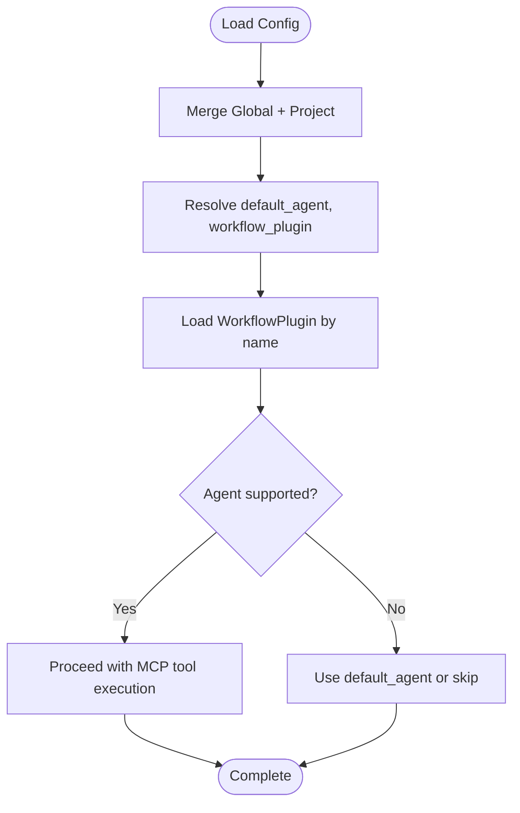
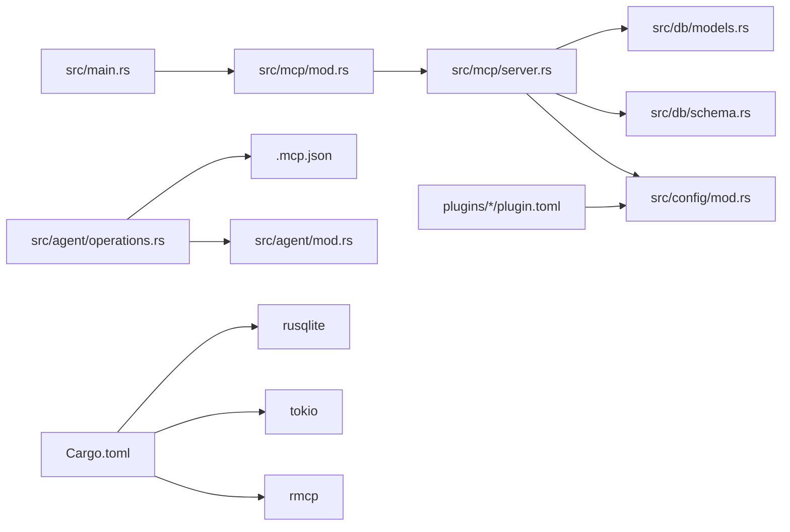

# MCP Integration with Agents

<cite>
**Referenced Files in This Document**
- [src/mcp/mod.rs](file://src/mcp/mod.rs)
- [src/mcp/server.rs](file://src/mcp/server.rs)
- [src/main.rs](file://src/main.rs)
- [.mcp.json](file://.mcp.json)
- [src/agent/mod.rs](file://src/agent/mod.rs)
- [src/agent/operations.rs](file://src/agent/operations.rs)
- [src/db/models.rs](file://src/db/models.rs)
- [src/db/schema.rs](file://src/db/schema.rs)
- [src/config/mod.rs](file://src/config/mod.rs)
- [src/lib.rs](file://src/lib.rs)
- [Cargo.toml](file://Cargo.toml)
- [AGENTS.md](file://AGENTS.md)
- [tests/mcp_tests.rs](file://tests/mcp_tests.rs)
- [plugins/agtx/plugin.toml](file://plugins/agtx/plugin.toml)
- [plugins/agent-skills/plugin.toml](file://plugins/agent-skills/plugin.toml)
</cite>

## Table of Contents
1. [Introduction](#introduction)
2. [Project Structure](#project-structure)
3. [Core Components](#core-components)
4. [Architecture Overview](#architecture-overview)
5. [Detailed Component Analysis](#detailed-component-analysis)
6. [Dependency Analysis](#dependency-analysis)
7. [Performance Considerations](#performance-considerations)
8. [Troubleshooting Guide](#troubleshooting-guide)
9. [Conclusion](#conclusion)
10. [Appendices](#appendices)

## Introduction
This document explains how AGTX integrates with AI agents through the Model Context Protocol (MCP) to enable autonomous task management. It covers how agents can query project state, create and modify tasks, coordinate with the AGTX system, and how the orchestrator agent role is facilitated by MCP. It also documents agent configuration patterns, authentication and security considerations, practical agent-to-MCP communication examples, best practices for robust integration, and troubleshooting guidance.

## Project Structure
The MCP integration centers around a dedicated MCP server module that exposes task and project operations as tools over stdio. Agents (Claude Code, Codex, Gemini CLI, and others) can register this server locally and invoke tools to manage AGTX tasks autonomously.

**Diagram sources**
- [src/main.rs:30-46](file://src/main.rs#L30-L46)
- [src/mcp/mod.rs:1-5](file://src/mcp/mod.rs#L1-L5)
- [src/mcp/server.rs:395-519](file://src/mcp/server.rs#L395-L519)
- [src/config/mod.rs:337-408](file://src/config/mod.rs#L337-L408)
- [src/db/schema.rs:9-67](file://src/db/schema.rs#L9-L67)
- [src/db/models.rs:58-184](file://src/db/models.rs#L58-L184)
- [src/agent/mod.rs:80-130](file://src/agent/mod.rs#L80-L130)
- [src/agent/operations.rs:110-163](file://src/agent/operations.rs#L110-L163)
- [.mcp.json:1-8](file://.mcp.json#L1-L8)
- [plugins/agtx/plugin.toml:1-16](file://plugins/agtx/plugin.toml#L1-L16)

**Section sources**
- [src/main.rs:30-46](file://src/main.rs#L30-L46)
- [src/mcp/mod.rs:1-5](file://src/mcp/mod.rs#L1-L5)
- [src/mcp/server.rs:395-519](file://src/mcp/server.rs#L395-L519)
- [src/config/mod.rs:337-408](file://src/config/mod.rs#L337-L408)
- [src/db/schema.rs:9-67](file://src/db/schema.rs#L9-L67)
- [src/db/models.rs:58-184](file://src/db/models.rs#L58-L184)
- [src/agent/mod.rs:80-130](file://src/agent/mod.rs#L80-L130)
- [src/agent/operations.rs:110-163](file://src/agent/operations.rs#L110-L163)
- [.mcp.json:1-8](file://.mcp.json#L1-L8)
- [plugins/agtx/plugin.toml:1-16](file://plugins/agtx/plugin.toml#L1-L16)

## Core Components
- MCP Server entrypoint and modes:
  - Global mode serves all projects via the global index database.
  - Project mode binds to a specific project path and ignores project_id parameters.
- Tool suite:
  - Project discovery: list_projects
  - Task lifecycle: list_tasks, get_task, move_task, get_transition_status
  - Conflict checks: check_conflicts
  - Notifications: get_notifications
  - Pane interaction: read_pane, send_to_task
  - Task creation: create_task, create_tasks_batch
  - Task mutation: update_task, delete_task
- Agent integration:
  - Agent detection and command construction for Claude, Codex, Gemini CLI, and others.
  - Orchestrator support via agent-specific MCP registration commands.
- Configuration:
  - Global and project-level configuration, including workflow plugins and per-phase agent overrides.
- Database:
  - Project and global databases with task, transition request, and notification tables.

**Section sources**
- [src/mcp/server.rs:16-24](file://src/mcp/server.rs#L16-L24)
- [src/mcp/server.rs:521-755](file://src/mcp/server.rs#L521-L755)
- [src/agent/mod.rs:80-130](file://src/agent/mod.rs#L80-L130)
- [src/agent/operations.rs:92-107](file://src/agent/operations.rs#L92-L107)
- [src/config/mod.rs:337-408](file://src/config/mod.rs#L337-L408)
- [src/db/schema.rs:97-208](file://src/db/schema.rs#L97-L208)

## Architecture Overview
The MCP server runs as a stdio-based JSON-RPC service. Agents register it locally and invoke tools to manage tasks. The server validates parameters, resolves project contexts, and persists state changes via the database. The orchestrator agent can embed MCP registration into its launch command to expose AGTX tools to supported agents.

**Diagram sources**
- [src/mcp/server.rs:521-755](file://src/mcp/server.rs#L521-L755)
- [src/db/schema.rs:478-554](file://src/db/schema.rs#L478-L554)

**Section sources**
- [src/mcp/server.rs:521-755](file://src/mcp/server.rs#L521-L755)
- [src/db/schema.rs:478-554](file://src/db/schema.rs#L478-L554)

## Detailed Component Analysis

### MCP Server Implementation
- ServerMode:
  - Project(path): fixed project binding; project_id is ignored.
  - Global: multi-project serving; requires project_id for CRUD tools.
- Parameter and response types:
  - Strongly typed parameter structs with JSON Schema metadata for agent tool discovery.
  - Rich response models for tasks, transitions, conflicts, notifications, and panes.
- Allowed actions:
  - Determined by task status and plugin rules; dependency gates block forward transitions from Backlog until dependencies are Review/Done.
- Project resolution:
  - In Global mode, project_id is resolved via the global index database; errors propagate clearly to agents.
- Configuration defaults:
  - Default agent and plugin derived from merged GlobalConfig and ProjectConfig.

**Diagram sources**
- [src/mcp/server.rs:395-519](file://src/mcp/server.rs#L395-L519)
- [src/mcp/server.rs:521-755](file://src/mcp/server.rs#L521-L755)
- [src/db/schema.rs:97-208](file://src/db/schema.rs#L97-L208)

**Section sources**
- [src/mcp/server.rs:16-24](file://src/mcp/server.rs#L16-L24)
- [src/mcp/server.rs:409-444](file://src/mcp/server.rs#L409-L444)
- [src/mcp/server.rs:473-518](file://src/mcp/server.rs#L473-L518)
- [src/db/schema.rs:97-208](file://src/db/schema.rs#L97-L208)

### Agent Integration Patterns
- Agent detection:
  - Known agents include Claude Code, Codex, Copilot, Gemini CLI, OpenCode, and Cursor.
  - Availability checked via system PATH detection.
- Command construction:
  - Interactive and resume commands tailored per agent.
  - Orchestrator builds a composite command that registers AGTX MCP with the agent, then launches the agent.
- Supported agents:
  - Claude: special handling for MCP registration and cleanup.
  - Others: default interactive launch.

**Diagram sources**
- [src/agent/mod.rs:10-77](file://src/agent/mod.rs#L10-L77)
- [src/agent/operations.rs:16-108](file://src/agent/operations.rs#L16-L108)

**Section sources**
- [src/agent/mod.rs:80-130](file://src/agent/mod.rs#L80-L130)
- [src/agent/operations.rs:92-107](file://src/agent/operations.rs#L92-L107)

### Configuration and Plugins
- GlobalConfig and ProjectConfig:
  - Default agent, per-phase agent overrides, worktree settings, theme, and workflow plugin selection.
- WorkflowPlugin:
  - Defines supported agents, artifacts, commands, prompts, copy-back rules, and cyclic transitions.
  - Plugins are loaded from project-local or global locations.

**Diagram sources**
- [src/config/mod.rs:337-408](file://src/config/mod.rs#L337-L408)
- [src/config/mod.rs:512-572](file://src/config/mod.rs#L512-L572)
- [plugins/agtx/plugin.toml:1-16](file://plugins/agtx/plugin.toml#L1-L16)
- [plugins/agent-skills/plugin.toml:1-19](file://plugins/agent-skills/plugin.toml#L1-L19)

**Section sources**
- [src/config/mod.rs:337-408](file://src/config/mod.rs#L337-L408)
- [src/config/mod.rs:512-572](file://src/config/mod.rs#L512-L572)
- [plugins/agtx/plugin.toml:1-16](file://plugins/agtx/plugin.toml#L1-L16)
- [plugins/agent-skills/plugin.toml:1-19](file://plugins/agent-skills/plugin.toml#L1-L19)

### Practical Agent-to-MCP Communication Examples
- Listing projects:
  - Agent invokes list_projects to discover all indexed projects and their IDs.
- Listing tasks:
  - Agent calls list_tasks with optional status filter and project_id in Global mode.
- Getting task details:
  - Agent queries get_task to inspect status, dependencies, and allowed_actions.
- Moving tasks:
  - Agent calls move_task with action and optional reason; then polls get_transition_status to observe completion.
- Conflict checks:
  - Agent runs check_conflicts to detect merge conflicts for Review tasks or a specific task.
- Notifications:
  - Agent retrieves get_notifications to pull orchestrator events.
- Pane interaction:
  - Agent uses read_pane to tail logs and send_to_task to inject commands into a task’s agent pane.
- Creating tasks:
  - Agent creates single or batch tasks with optional dependencies and base branches.
- Updating/deleting tasks:
  - Agent updates backlog tasks and deletes them when appropriate.

These flows are implemented by the MCP tools and validated by tests.

**Section sources**
- [src/mcp/server.rs:521-755](file://src/mcp/server.rs#L521-L755)
- [tests/mcp_tests.rs:17-356](file://tests/mcp_tests.rs#L17-L356)

### Orchestrator Agent Role and MCP Facilitation
- The orchestrator agent can embed MCP registration into its launch command:
  - For Claude, the orchestrator command removes stale registration, adds the local AGTX MCP, runs the agent, then removes the registration.
  - For other agents, the default is interactive launch without MCP registration.
- This enables agents to programmatically drive AGTX workflows end-to-end, including task creation, movement, and coordination with the TUI.

**Section sources**
- [src/agent/operations.rs:92-107](file://src/agent/operations.rs#L92-L107)
- [AGENTS.md:35-42](file://AGENTS.md#L35-L42)

## Dependency Analysis
- External dependencies:
  - rmcp provides the MCP server framework and stdio transport.
  - tokio powers async execution.
  - rusqlite provides SQLite persistence.
- Internal dependencies:
  - MCP server depends on config, db, and git modules.
  - Agent integration depends on agent and config modules.
  - CLI entry point routes to MCP server based on arguments.

**Diagram sources**
- [src/main.rs:30-46](file://src/main.rs#L30-L46)
- [src/mcp/mod.rs:1-5](file://src/mcp/mod.rs#L1-5)
- [src/mcp/server.rs:395-519](file://src/mcp/server.rs#L395-L519)
- [src/config/mod.rs:337-408](file://src/config/mod.rs#L337-L408)
- [src/db/schema.rs:9-67](file://src/db/schema.rs#L9-L67)
- [src/db/models.rs:58-184](file://src/db/models.rs#L58-L184)
- [src/agent/mod.rs:80-130](file://src/agent/mod.rs#L80-L130)
- [src/agent/operations.rs:110-163](file://src/agent/operations.rs#L110-L163)
- [.mcp.json:1-8](file://.mcp.json#L1-L8)
- [plugins/agtx/plugin.toml:1-16](file://plugins/agtx/plugin.toml#L1-L16)
- [Cargo.toml:36-37](file://Cargo.toml#L36-L37)

**Section sources**
- [Cargo.toml:36-37](file://Cargo.toml#L36-L37)
- [src/main.rs:30-46](file://src/main.rs#L30-L46)
- [src/mcp/server.rs:395-519](file://src/mcp/server.rs#L395-L519)
- [src/config/mod.rs:337-408](file://src/config/mod.rs#L337-L408)
- [src/db/schema.rs:9-67](file://src/db/schema.rs#L9-L67)
- [src/db/models.rs:58-184](file://src/db/models.rs#L58-L184)
- [src/agent/mod.rs:80-130](file://src/agent/mod.rs#L80-L130)
- [src/agent/operations.rs:110-163](file://src/agent/operations.rs#L110-L163)
- [.mcp.json:1-8](file://.mcp.json#L1-L8)
- [plugins/agtx/plugin.toml:1-16](file://plugins/agtx/plugin.toml#L1-L16)

## Performance Considerations
- Database operations:
  - Use indexes on status and project_id for efficient filtering.
  - Batch operations (e.g., create_tasks_batch) wrap inserts in transactions to reduce overhead.
- Transition request queuing:
  - Pending requests are polled and atomically claimed to avoid contention.
  - Cleanup removes stale entries older than one hour to prevent accumulation.
- Serialization:
  - Responses are serialized to pretty-printed JSON for readability; consider compact serialization for high-throughput scenarios.
- Concurrency:
  - The MCP server uses a single-threaded stdio transport; for heavy loads, consider process-level parallelism or a TCP transport variant.

[No sources needed since this section provides general guidance]

## Troubleshooting Guide
- Permission and registration issues:
  - For Claude, orchestrator registration removes stale entries before adding; ensure the agent supports MCP registration and local scope.
- Global vs project mode:
  - In Global mode, always pass project_id; in Project mode, project_id is ignored and the fixed project path is used.
- Invalid actions:
  - move_task validates actions; ensure the action is one of the supported values.
- Dependency gates:
  - Forward transitions from Backlog are blocked until referenced_tasks are Review/Done; check get_task for blocking_tasks.
- Transition status polling:
  - After move_task, poll get_transition_status until completion; errors are surfaced in the status response.
- Database connectivity:
  - Ensure the global index database and project databases are accessible; verify paths and permissions.
- Testing MCP flows:
  - Use the provided tests to validate CRUD, transition requests, and notifications.

**Section sources**
- [src/mcp/server.rs:655-721](file://src/mcp/server.rs#L655-L721)
- [src/mcp/server.rs:723-755](file://src/mcp/server.rs#L723-L755)
- [src/db/schema.rs:511-554](file://src/db/schema.rs#L511-L554)
- [tests/mcp_tests.rs:17-472](file://tests/mcp_tests.rs#L17-L472)

## Conclusion
AGTX’s MCP integration provides a robust, agent-friendly interface for autonomous task management. Agents can query state, create and mutate tasks, coordinate with the AGTX system, and leverage the orchestrator pattern to automate end-to-end workflows. With clear configuration, strong typing, and resilient database-backed state, the integration scales from individual projects to multi-project environments while maintaining safety and consistency.

[No sources needed since this section summarizes without analyzing specific files]

## Appendices

### Agent Configuration Patterns
- Default agent selection:
  - GlobalConfig.default_agent sets the baseline; per-phase overrides are available.
- Project-level customization:
  - ProjectConfig can override default_agent, base_branch, workflow_plugin, and worktree settings.
- Workflow plugins:
  - Define supported agents, commands, prompts, and copy-back rules; loaded from project-local or global locations.

**Section sources**
- [src/config/mod.rs:337-408](file://src/config/mod.rs#L337-L408)
- [src/config/mod.rs:512-572](file://src/config/mod.rs#L512-L572)

### Authentication and Security Considerations
- Local stdio transport:
  - MCP runs over stdio; ensure the agent process is trusted and launched from a secure environment.
- Local scope registration:
  - Registration uses local scope; avoid exposing AGTX tools to untrusted scopes.
- Permissions:
  - Ensure the user has write access to the AGTX config and data directories.

**Section sources**
- [.mcp.json:1-8](file://.mcp.json#L1-L8)
- [src/agent/operations.rs:92-107](file://src/agent/operations.rs#L92-L107)

### Best Practices for Agent Integration
- Error handling:
  - Always validate parameters and handle missing project_id in Global mode.
  - Use get_transition_status to confirm asynchronous operations.
- Retry mechanisms:
  - Poll get_transition_status with exponential backoff; surface errors to the agent.
- State consistency:
  - Respect dependency gates; do not advance tasks from Backlog prematurely.
  - Use batch operations for multi-task creation to maintain atomicity.
- Debugging:
  - Use read_pane to inspect agent pane content and send_to_task to inject diagnostics.
  - Leverage get_notifications to pull orchestrator events.

**Section sources**
- [src/mcp/server.rs:473-518](file://src/mcp/server.rs#L473-L518)
- [src/mcp/server.rs:723-755](file://src/mcp/server.rs#L723-L755)
- [src/db/schema.rs:596-654](file://src/db/schema.rs#L596-L654)