# MCP Protocol Fundamentals

<cite>
**Referenced Files in This Document**
- [server.rs](file://src/mcp/server.rs)
- [mod.rs](file://src/mcp/mod.rs)
- [main.rs](file://src/main.rs)
- [.mcp.json](file://.mcp.json)
- [README.md](file://README.md)
- [CLAUDE.md](file://CLAUDE.md)
- [Cargo.lock](file://Cargo.lock)
- [models.rs](file://src/db/models.rs)
- [schema.rs](file://src/db/schema.rs)
- [config.rs](file://src/config/mod.rs)
- [mcp_tests.rs](file://tests/mcp_tests.rs)
</cite>

## Table of Contents
1. [Introduction](#introduction)
2. [Project Structure](#project-structure)
3. [Core Components](#core-components)
4. [Architecture Overview](#architecture-overview)
5. [Detailed Component Analysis](#detailed-component-analysis)
6. [Dependency Analysis](#dependency-analysis)
7. [Performance Considerations](#performance-considerations)
8. [Troubleshooting Guide](#troubleshooting-guide)
9. [Conclusion](#conclusion)
10. [Appendices](#appendices)

## Introduction
This document explains the Model Context Protocol (MCP) fundamentals as implemented by AGTX. It focuses on AGTX's MCP server that exposes a Kanban-style task management system as JSON-RPC tools over stdio. The server supports two operational modes:
- Global MCP server: serves all projects indexed in the global database and requires a project_id parameter for CRUD operations.
- Project-scoped MCP server: binds to a single project path and ignores project_id in tool calls.

The MCP server integrates tightly with AGTX's task lifecycle, Git operations, tmux sessions, and SQLite-backed persistence. It enables external automation and agent integration by exposing tools for listing tasks, moving tasks between phases, conflict checking, notification retrieval, and pane inspection.

## Project Structure
AGTX organizes MCP-related code under src/mcp with a minimal public surface:
- src/mcp/mod.rs exports the MCP server entry points.
- src/mcp/server.rs implements the MCP server, tool router, and transport setup.
- The CLI entry point in src/main.rs routes "mcp-serve" to the MCP server and validates project paths.
- A configuration file .mcp.json registers the MCP server as a stdio service.
- The MCP server relies on AGTX's database layer (src/db), configuration layer (src/config), and task models (src/db/models.rs).

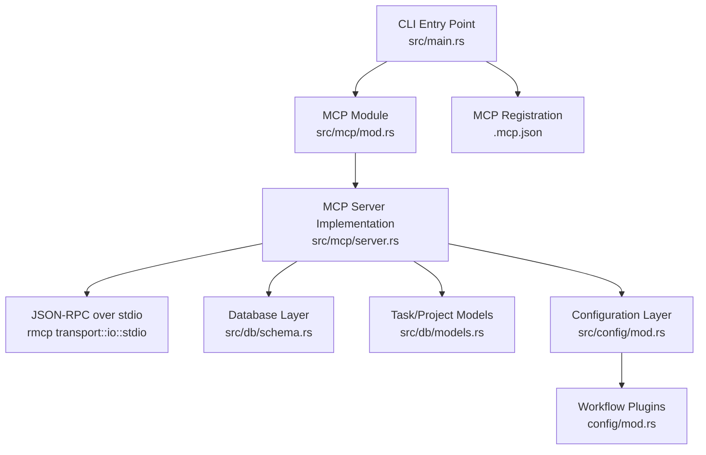

**Diagram sources**
- [main.rs:30-46](file://src/main.rs#L30-L46)
- [mod.rs:1-5](file://src/mcp/mod.rs#L1-L5)
- [server.rs:1245-1263](file://src/mcp/server.rs#L1245-L1263)
- [schema.rs:12-67](file://src/db/schema.rs#L12-L67)
- [models.rs:58-79](file://src/db/models.rs#L58-L79)
- [config.rs:410-595](file://src/config/mod.rs#L410-L595)
- [.mcp.json:1-7](file://.mcp.json#L1-L7)

**Section sources**
- [main.rs:30-46](file://src/main.rs#L30-L46)
- [mod.rs:1-5](file://src/mcp/mod.rs#L1-L5)
- [.mcp.json:1-7](file://.mcp.json#L1-L7)

## Core Components
- ServerMode enum: Determines whether the MCP server operates in global mode (requires project_id) or project-scoped mode (fixed path).
- AgtxMcpServer: Implements the MCP server, tool router, and project resolution helpers.
- Tool router: Declares MCP tools for listing projects/tasks, task transitions, conflict checks, notifications, pane reads, and task CRUD.
- Transport: Uses rmcp's stdio transport for JSON-RPC over stdin/stdout.
- Database integration: Opens project/global databases, resolves project paths, and persists transitions and notifications.
- Configuration integration: Resolves default agent and plugin from merged global/project configuration.

Key responsibilities:
- Capability negotiation: Reports ServerInfo with tool capabilities.
- Transport setup: Initializes stdio transport and waits for requests.
- Project resolution: Validates and resolves project paths depending on mode.
- Serialization: Returns JSON responses for all tools.

**Section sources**
- [server.rs:16-24](file://src/mcp/server.rs#L16-L24)
- [server.rs:395-471](file://src/mcp/server.rs#L395-L471)
- [server.rs:1218-1243](file://src/mcp/server.rs#L1218-L1243)
- [server.rs:1245-1263](file://src/mcp/server.rs#L1245-L1263)

## Architecture Overview
The MCP server architecture follows a layered design:
- Transport layer: JSON-RPC over stdio via rmcp.
- Server layer: AgtxMcpServer implements ServerHandler and tool_router.
- Domain layer: Tools operate on tasks, transitions, and notifications.
- Persistence layer: SQLite-backed databases for projects and tasks.
- Configuration layer: Global and project configurations for defaults.

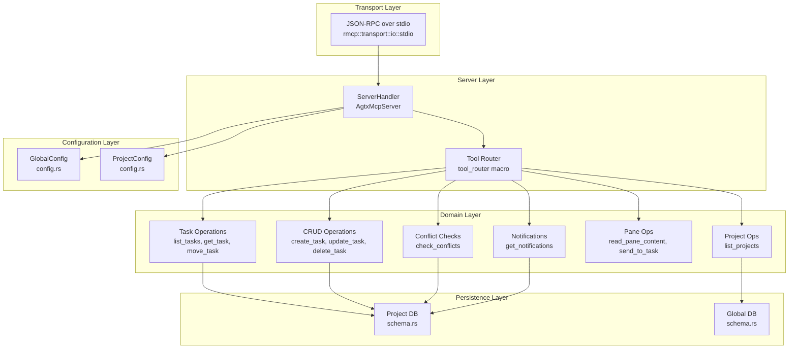

**Diagram sources**
- [server.rs:4-10](file://src/mcp/server.rs#L4-L10)
- [server.rs:521-1216](file://src/mcp/server.rs#L521-L1216)
- [schema.rs:12-67](file://src/db/schema.rs#L12-L67)
- [config.rs:230-303](file://src/config/mod.rs#L230-L303)

## Detailed Component Analysis

### ServerMode and Project Resolution
ServerMode determines how project_id is handled:
- Global: Requires project_id; resolves path via global DB lookup.
- Project: Ignores project_id; uses the fixed path provided at startup.

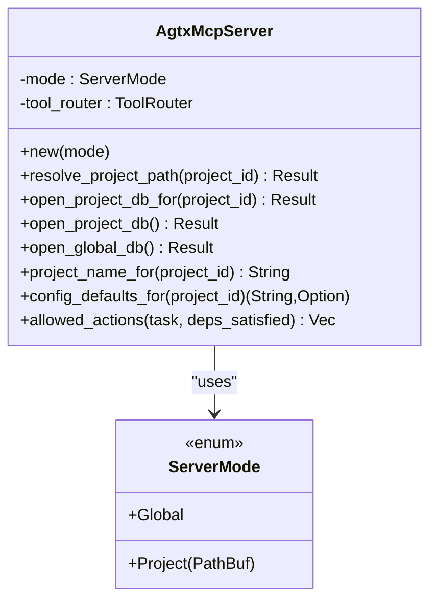

**Diagram sources**
- [server.rs:16-24](file://src/mcp/server.rs#L16-L24)
- [server.rs:395-471](file://src/mcp/server.rs#L395-L471)

**Section sources**
- [server.rs:16-24](file://src/mcp/server.rs#L16-L24)
- [server.rs:409-444](file://src/mcp/server.rs#L409-L444)

### MCP Server Initialization and Transport Setup
The serve function selects ServerMode based on CLI arguments, validates database accessibility, constructs AgtxMcpServer, and starts the stdio transport.

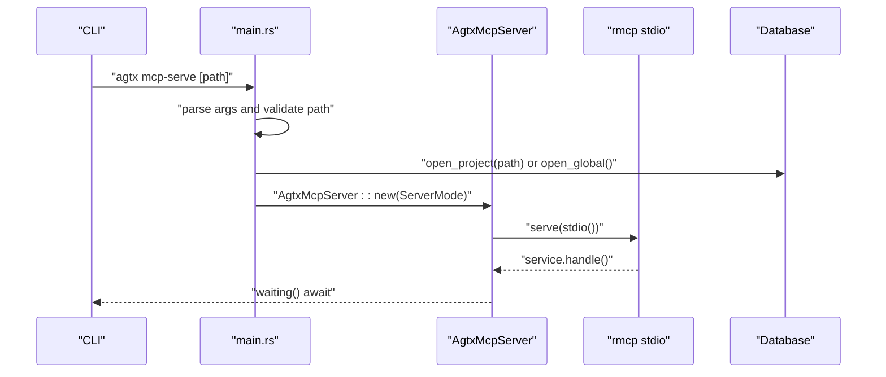

**Diagram sources**
- [main.rs:30-46](file://src/main.rs#L30-L46)
- [server.rs:1245-1263](file://src/mcp/server.rs#L1245-L1263)

**Section sources**
- [main.rs:30-46](file://src/main.rs#L30-L46)
- [server.rs:1245-1263](file://src/mcp/server.rs#L1245-L1263)

### Capability Negotiation and Server Info
The ServerHandler implementation reports ServerInfo with instructions tailored to the mode and enables tools capability.

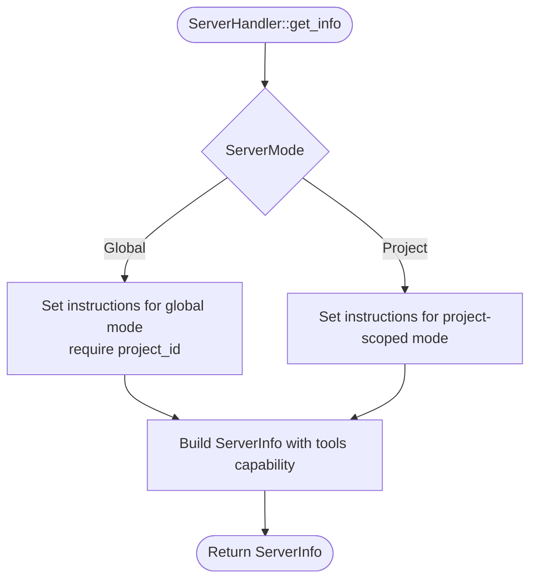

**Diagram sources**
- [server.rs:1218-1243](file://src/mcp/server.rs#L1218-L1243)

**Section sources**
- [server.rs:1218-1243](file://src/mcp/server.rs#L1218-L1243)

### Tool Routing Patterns
Tools are declared with #[tool] and mapped via #[tool_router]. The router delegates to methods on AgtxMcpServer. Parameters are validated using schemars-generated JSON schemas.

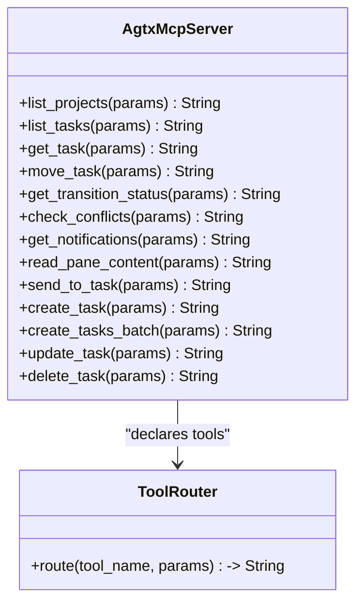

**Diagram sources**
- [server.rs:521-1216](file://src/mcp/server.rs#L521-L1216)

**Section sources**
- [server.rs:521-1216](file://src/mcp/server.rs#L521-L1216)

### Task Transition Workflow
External orchestrators can queue transitions via move_task. The MCP server validates actions, checks dependency gates, and writes a TransitionRequest. The TUI processes the queue and updates state.

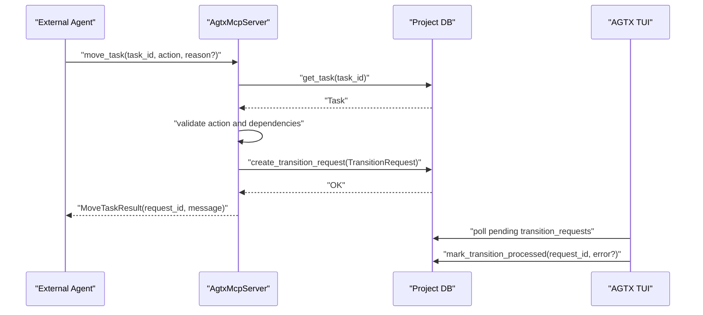

**Diagram sources**
- [server.rs:655-721](file://src/mcp/server.rs#L655-L721)
- [models.rs:159-184](file://src/db/models.rs#L159-L184)

**Section sources**
- [server.rs:655-721](file://src/mcp/server.rs#L655-L721)
- [models.rs:159-184](file://src/db/models.rs#L159-L184)

### Conflict Checking Algorithm
The check_conflicts tool inspects task branches against the main branch for merge conflicts using Git operations.

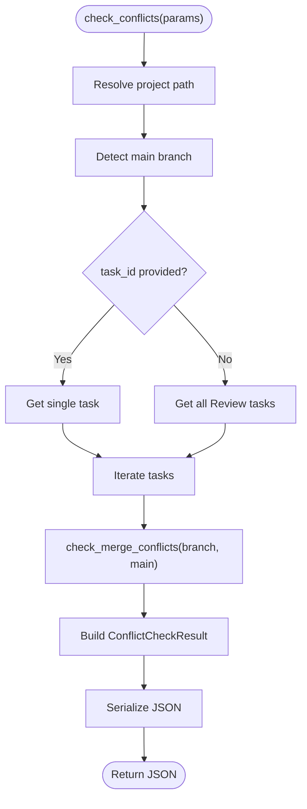

**Diagram sources**
- [server.rs:757-832](file://src/mcp/server.rs#L757-L832)

**Section sources**
- [server.rs:757-832](file://src/mcp/server.rs#L757-L832)

### Notification Retrieval Pattern
The get_notifications tool consumes and returns pending notifications, removing them from the queue.

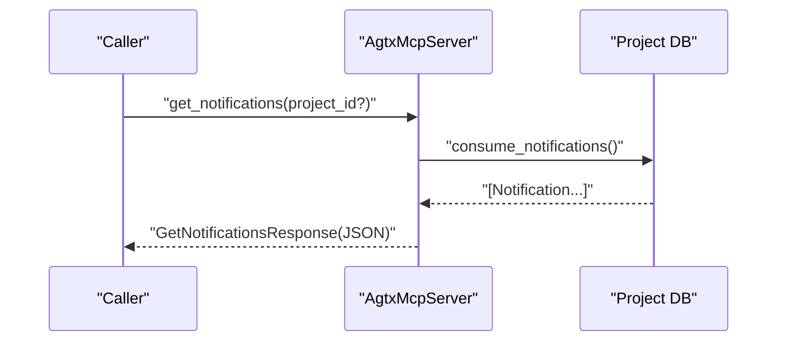

**Diagram sources**
- [server.rs:834-858](file://src/mcp/server.rs#L834-L858)

**Section sources**
- [server.rs:834-858](file://src/mcp/server.rs#L834-L858)

### tmux Integration for Pane Inspection and Messaging
The read_pane_content and send_to_task tools interact with tmux sessions associated with tasks.

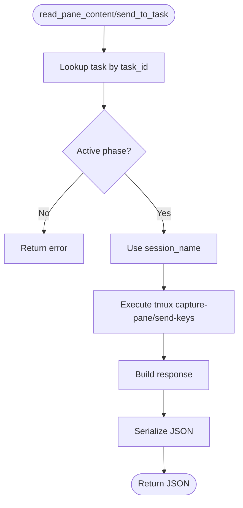

**Diagram sources**
- [server.rs:860-974](file://src/mcp/server.rs#L860-L974)

**Section sources**
- [server.rs:860-974](file://src/mcp/server.rs#L860-L974)

### MCP Protocol Compliance and Serialization
- Transport: Uses rmcp::transport::io::stdio for JSON-RPC over stdio.
- Schema generation: Parameters and responses derive schemars::JsonSchema for tool metadata.
- Serialization: Tools return pretty-printed JSON strings; errors are formatted strings.
- Capability negotiation: ServerInfo declares tool capability.

**Section sources**
- [server.rs:4-10](file://src/mcp/server.rs#L4-L10)
- [server.rs:28-244](file://src/mcp/server.rs#L28-L244)
- [server.rs:1218-1243](file://src/mcp/server.rs#L1218-L1243)

### Relationship to AGTX Task Management
MCP complements AGTX's TUI and task lifecycle:
- The TUI monitors transition_requests and applies side effects (worktree creation, agent spawning).
- Notifications bridge TUI state to the orchestrator when idle.
- MCP enables external agents to orchestrate tasks without manual intervention.

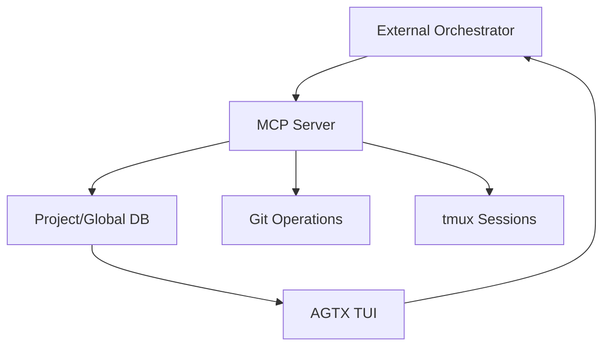

**Diagram sources**
- [CLAUDE.md:205-213](file://CLAUDE.md#L205-L213)
- [README.md:623-636](file://README.md#L623-L636)

**Section sources**
- [CLAUDE.md:205-213](file://CLAUDE.md#L205-L213)
- [README.md:623-636](file://README.md#L623-L636)

## Dependency Analysis
- External dependencies: rmcp (0.16.0) provides the MCP framework, stdio transport, and tool macros.
- Internal dependencies: MCP server depends on database schema, task models, and configuration layers.
- Coupling: Tools depend on Database for persistence; project resolution depends on global DB in global mode.

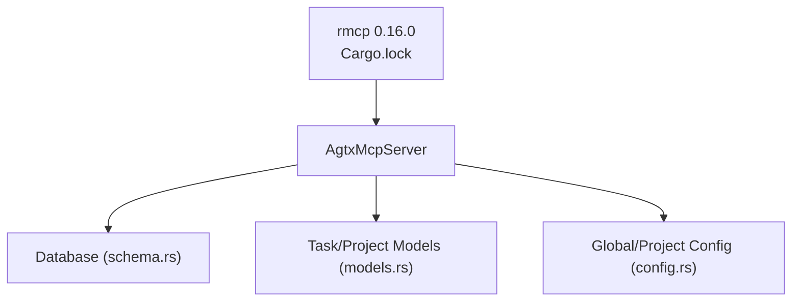

**Diagram sources**
- [Cargo.lock:1385-1405](file://Cargo.lock#L1385-L1405)
- [server.rs:13-14](file://src/mcp/server.rs#L13-L14)

**Section sources**
- [Cargo.lock:1385-1405](file://Cargo.lock#L1385-L1405)
- [server.rs:13-14](file://src/mcp/server.rs#L13-L14)

## Performance Considerations
- Database access: Each tool call opens the appropriate database (project or global). Consider connection pooling if scaling to many concurrent clients.
- JSON serialization: Pretty-printed JSON improves readability but increases payload size; consider compact serialization for high-throughput scenarios.
- Git operations: Conflict checks spawn Git commands; cache results or limit frequency for large Review sets.
- tmux operations: Pane reads and send-keys are synchronous; batch operations may benefit from rate limiting.

## Troubleshooting Guide
Common issues and resolutions:
- Invalid project_id in global mode: Ensure project_id is provided and resolves to an existing project.
- Task not found: Verify task_id exists in the target project.
- Dependency gates: Forward transitions from Backlog require referenced_tasks to be in Review/Done.
- Transition status: Use get_transition_status to check pending/completed/error states.
- Notifications: Use get_notifications to drain and consume pending events.

**Section sources**
- [server.rs:413-429](file://src/mcp/server.rs#L413-L429)
- [server.rs:593-653](file://src/mcp/server.rs#L593-L653)
- [server.rs:686-698](file://src/mcp/server.rs#L686-L698)
- [server.rs:726-755](file://src/mcp/server.rs#L726-L755)
- [server.rs:837-858](file://src/mcp/server.rs#L837-L858)

## Conclusion
AGTX’s MCP implementation provides a robust, protocol-compliant interface for external automation and agent integration. By supporting both global and project-scoped modes, it accommodates diverse usage patterns—from orchestrator binding to ad-hoc scripting. The server’s tight integration with AGTX’s task lifecycle, Git, and tmux enables seamless orchestration of AI-assisted development workflows.

## Appendices

### MCP Server Modes Summary
- Global mode: Requires project_id; all CRUD tools need project_id.
- Project-scoped mode: Fixed path; project_id is ignored.

**Section sources**
- [CLAUDE.md:215-226](file://CLAUDE.md#L215-L226)
- [server.rs:1245-1263](file://src/mcp/server.rs#L1245-L1263)

### MCP Registration
The MCP service is registered as a stdio service named "agtx".

**Section sources**
- [.mcp.json:1-7](file://.mcp.json#L1-L7)

### Test Coverage Highlights
- TransitionRequest lifecycle: creation, pending retrieval, processing, cleanup.
- Task CRUD operations: creation, batch creation, updates, deletions.
- Project management: upsert and retrieval in global DB.
- Notifications: peek/consume semantics and ordering.

**Section sources**
- [mcp_tests.rs:5-150](file://tests/mcp_tests.rs#L5-L150)
- [mcp_tests.rs:152-356](file://tests/mcp_tests.rs#L152-L356)
- [mcp_tests.rs:357-472](file://tests/mcp_tests.rs#L357-L472)