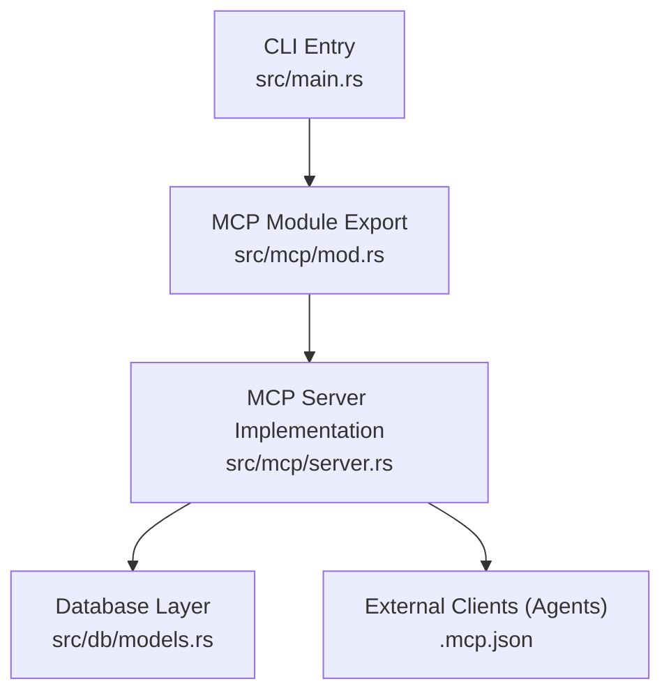
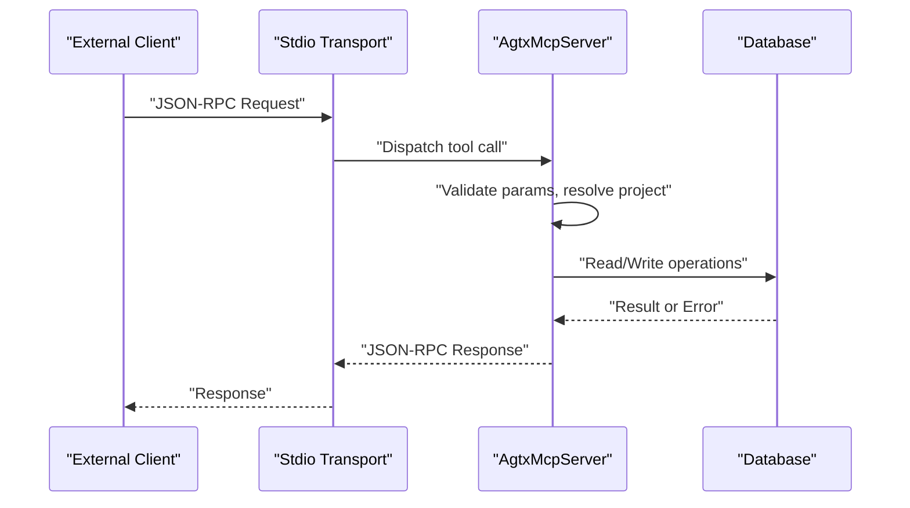
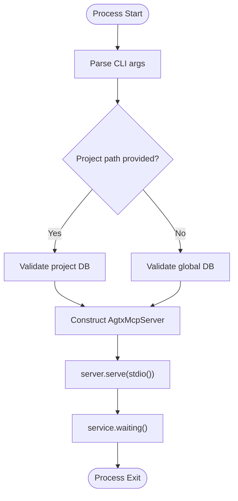
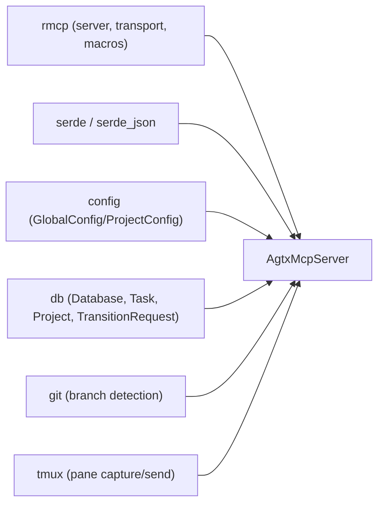

# MCP Server Implementation

<cite>
**Referenced Files in This Document**
- [server.rs](file://src/mcp/server.rs)
- [mod.rs](file://src/mcp/mod.rs)
- [main.rs](file://src/main.rs)
- [Cargo.toml](file://Cargo.toml)
- [models.rs](file://src/db/models.rs)
- [README.md](file://README.md)
- [mcp_tests.rs](file://tests/mcp_tests.rs)
- [.mcp.json](file://.mcp.json)
</cite>

## Table of Contents
1. [Introduction](#introduction)
2. [Project Structure](#project-structure)
3. [Core Components](#core-components)
4. [Architecture Overview](#architecture-overview)
5. [Detailed Component Analysis](#detailed-component-analysis)
6. [Dependency Analysis](#dependency-analysis)
7. [Performance Considerations](#performance-considerations)
8. [Troubleshooting Guide](#troubleshooting-guide)
9. [Conclusion](#conclusion)
10. [Appendices](#appendices)

## Introduction
This document explains the MCP server implementation that powers the agtx terminal-based kanban board. It focuses on the core server architecture, JSON-RPC over stdio communication, the ServerMode enum for global versus project-scoped operation, the serve function and process lifecycle, JSON-RPC message handling and error patterns, the tool registration system, and client interaction. Practical examples, debugging techniques, performance considerations, and guidance for extending the server are included.

## Project Structure
The MCP server lives under src/mcp and is exposed via the public API in src/mcp/mod.rs. The main entrypoint parses CLI arguments and routes to the MCP server when requested. The server integrates with the internal database and task lifecycle.

**Diagram sources**
- [main.rs:30-46](file://src/main.rs#L30-L46)
- [mod.rs:1-5](file://src/mcp/mod.rs#L1-L5)
- [server.rs:1245-1263](file://src/mcp/server.rs#L1245-L1263)
- [models.rs:1-245](file://src/db/models.rs#L1-L245)
- [.mcp.json:1-7](file://.mcp.json#L1-L7)

**Section sources**
- [main.rs:30-46](file://src/main.rs#L30-L46)
- [mod.rs:1-5](file://src/mcp/mod.rs#L1-L5)
- [server.rs:1245-1263](file://src/mcp/server.rs#L1245-L1263)
- [.mcp.json:1-7](file://.mcp.json#L1-L7)

## Core Components
- ServerMode enum: Defines whether the server operates in project-scoped mode (bound to a single project path) or global mode (operating across all indexed projects).
- AgtxMcpServer: The server implementation that registers tools, resolves project contexts, and performs database operations.
- Tool router: Declares MCP tools with typed parameters and responses.
- serve function: Initializes the server in the chosen mode, binds to stdio transport, and runs the service loop.

Key responsibilities:
- Mode-aware project resolution and database access
- Typed parameter parsing and validation
- JSON serialization of responses
- Error propagation as strings for MCP clients
- Tool capability advertisement

**Section sources**
- [server.rs:16-24](file://src/mcp/server.rs#L16-L24)
- [server.rs:395-471](file://src/mcp/server.rs#L395-L471)
- [server.rs:521-1215](file://src/mcp/server.rs#L521-L1215)
- [server.rs:1245-1263](file://src/mcp/server.rs#L1245-L1263)

## Architecture Overview
The MCP server uses rmcp’s server-side macros and stdio transport to expose tools over JSON-RPC. Clients register the server locally and call tools by name. The server validates parameters, accesses the database, and returns JSON-formatted results.

**Diagram sources**
- [server.rs:1245-1263](file://src/mcp/server.rs#L1245-L1263)
- [server.rs:521-1215](file://src/mcp/server.rs#L521-L1215)
- [models.rs:159-184](file://src/db/models.rs#L159-L184)

## Detailed Component Analysis

### ServerMode Enum and Operation Modes
- Project(path): Operates within a single project directory. The path is fixed at startup; project_id parameters are ignored for tools that accept them.
- Global: Operates across all projects indexed in the global database. Tools requiring a project context require a project_id parameter.

Use cases:
- Project-scoped mode: Ideal for orchestrator agents bound to a single repository.
- Global mode: Ideal for skills that need cross-project visibility (e.g., sweep/brainstorm) and can accept a project_id.

Limitations:
- In Global mode, tools that operate on tasks require a project_id parameter; otherwise, they return an error indicating the requirement.
- Project-scoped mode simplifies permissions and isolation but restricts cross-project operations.

**Section sources**
- [server.rs:16-24](file://src/mcp/server.rs#L16-L24)
- [server.rs:413-429](file://src/mcp/server.rs#L413-L429)
- [server.rs:1220-1242](file://src/mcp/server.rs#L1220-L1242)

### serve Function and Process Lifecycle
- Validates database accessibility for the chosen mode (project or global).
- Constructs AgtxMcpServer with the selected ServerMode.
- Starts the rmcp service over stdio and waits indefinitely.

Lifecycle:
- Startup: Mode detection, database validation, server construction.
- Runtime: Service loop handles requests until process termination.
- Shutdown: No explicit shutdown hook; process exit stops the service.

**Diagram sources**
- [main.rs:30-46](file://src/main.rs#L30-L46)
- [server.rs:1245-1263](file://src/mcp/server.rs#L1245-L1263)

**Section sources**
- [main.rs:30-46](file://src/main.rs#L30-L46)
- [server.rs:1245-1263](file://src/mcp/server.rs#L1245-L1263)

### JSON-RPC Over Stdio Communication
- Transport: rmcp transport::io::stdio is used to communicate over stdin/stdout.
- Tool registration: The #[tool] and #[tool_handler] macros register tools and capability metadata.
- Request/Response: Requests are dispatched to tool functions; responses are serialized JSON strings. Errors are returned as formatted strings.

Patterns:
- Parameters are parsed from JSON into strongly-typed structs annotated with schemars::JsonSchema.
- Responses are serialized using serde_json::to_string_pretty with fallback error messages.
- get_info advertises tool capabilities and instructions, including mode-specific guidance.

**Section sources**
- [server.rs:4-11](file://src/mcp/server.rs#L4-L11)
- [server.rs:521-1215](file://src/mcp/server.rs#L521-L1215)
- [server.rs:1218-1242](file://src/mcp/server.rs#L1218-L1242)

### Tool Registration System and External Client Interaction
- Tool registration: #[tool_router] macro generates a router for tool functions. Each #[tool(...)] function becomes a callable tool.
- Capability advertisement: get_info returns ServerInfo with enabled tools and instructions tailored to the mode.
- Client registration: The project includes a .mcp.json that registers agtx as an stdio MCP server. Agents can add this registration locally or globally.

Client workflow:
- Register the server with the agent’s MCP subsystem.
- Call tools by name with JSON parameters.
- Receive JSON responses or errors.

**Section sources**
- [server.rs:521-1215](file://src/mcp/server.rs#L521-L1215)
- [server.rs:1218-1242](file://src/mcp/server.rs#L1218-L1242)
- [.mcp.json:1-7](file://.mcp.json#L1-7)

### Tool Functions and Parameter Handling
Core tools include:
- list_projects, list_tasks, get_task
- create_task, create_tasks_batch, update_task, delete_task
- move_task, get_transition_status
- check_conflicts, get_notifications
- read_pane_content, send_to_task

Parameter handling:
- Strongly typed structs annotated with schemars::JsonSchema for schema generation and validation.
- Optional fields and required fields clearly marked; project_id is required in Global mode.
- Validation includes status parsing, action validation, dependency checks, and batch limits.

Responses:
- Structured response types serialized to JSON.
- Errors returned as formatted strings when validation fails or DB operations error.

Allowed actions:
- Determined dynamically based on task status and plugin rules, with dependency satisfaction gating.

**Section sources**
- [server.rs:28-242](file://src/mcp/server.rs#L28-L242)
- [server.rs:521-1215](file://src/mcp/server.rs#L521-L1215)
- [server.rs:474-518](file://src/mcp/server.rs#L474-L518)

### Database Integration and Data Models
- TaskStatus enum defines lifecycle states and conversion helpers.
- Task, Project, TransitionRequest, Notification models encapsulate persistence and runtime semantics.
- AgtxMcpServer methods resolve project paths, open databases, compute allowed actions, and serialize results.

Concurrency and safety:
- Tests demonstrate atomicity and correctness under concurrent consumers for notifications and transition claims.

**Section sources**
- [models.rs:5-56](file://src/db/models.rs#L5-L56)
- [models.rs:58-133](file://src/db/models.rs#L58-L133)
- [models.rs:135-184](file://src/db/models.rs#L135-L184)
- [server.rs:413-444](file://src/mcp/server.rs#L413-L444)
- [mcp_tests.rs:391-471](file://tests/mcp_tests.rs#L391-L471)

## Dependency Analysis
- rmcp: Provides server handler, tool router, stdio transport, and JSON-RPC scaffolding.
- serde/serde_json: Serialization of tool parameters and responses.
- Internal modules: config, db, git, tmux integrate with the server for configuration defaults, database access, and tmux pane operations.

**Diagram sources**
- [server.rs:4-11](file://src/mcp/server.rs#L4-L11)
- [server.rs:13-14](file://src/mcp/server.rs#L13-L14)

**Section sources**
- [Cargo.toml:36-37](file://Cargo.toml#L36-L37)
- [server.rs:4-11](file://src/mcp/server.rs#L4-L11)

## Performance Considerations
- Concurrency:
  - The MCP server is single-threaded by default; rmcp’s stdio transport is synchronous. For high concurrency, consider running multiple server instances or using a multiplexer.
  - Database operations are serialized; ensure tools minimize long-running operations.
- Memory:
  - Responses are serialized to JSON strings; avoid building excessively large payloads. Prefer pagination or filtering where applicable.
- I/O:
  - tmux pane capture and git operations can be expensive; cache where appropriate and limit scope (e.g., read last N lines).
- Atomic operations:
  - Tests demonstrate atomic consumption of notifications and claiming of transition requests, ensuring correctness under contention.

[No sources needed since this section provides general guidance]

## Troubleshooting Guide
Common issues and remedies:
- Invalid project path in project-scoped mode:
  - Ensure the directory is a git repository and the project DB can be opened.
- Missing project_id in global mode:
  - Call list_projects first to obtain project IDs; pass project_id to tools that require it.
- Tool parameter validation errors:
  - Verify status values, action names, and dependency IDs conform to documented constraints.
- Database errors:
  - Check that the global or project database is accessible and not locked by another process.
- tmux integration:
  - Confirm the dedicated tmux server “agtx” is running and sessions/windows are accessible.

Debugging techniques:
- Enable verbose logging in the agent’s MCP subsystem to inspect request/response payloads.
- Use get_info to verify advertised capabilities and instructions.
- Test tools individually with minimal parameters to isolate failures.

**Section sources**
- [server.rs:1220-1242](file://src/mcp/server.rs#L1220-L1242)
- [server.rs:521-1215](file://src/mcp/server.rs#L521-L1215)
- [mcp_tests.rs:391-471](file://tests/mcp_tests.rs#L391-L471)

## Conclusion
The MCP server implementation provides a robust, typed interface for external agents to interact with the agtx kanban board. ServerMode cleanly separates project-scoped and global operations, the serve function initializes the server over stdio, and the tool router exposes a comprehensive set of operations with strong parameter validation and JSON serialization. The design balances simplicity with extensibility, enabling skills like sweep/brainstorm and orchestrator automation while maintaining clear operational boundaries.

[No sources needed since this section summarizes without analyzing specific files]

## Appendices

### Practical Examples

- Server startup and configuration
  - Project-scoped mode: agtx mcp-serve /path/to/project
  - Global mode: agtx mcp-serve
  - Registration: agents add the stdio server via their MCP subsystem

- Typical tool usage
  - list_projects → get project_id
  - list_tasks → filter by status
  - get_task → inspect allowed_actions and dependencies
  - create_task / create_tasks_batch → create backlog tasks
  - move_task → queue transitions
  - get_transition_status → poll completion
  - check_conflicts → detect merge conflicts
  - get_notifications → pull orchestrator events
  - read_pane_content → diagnose stuck agents
  - send_to_task → nudge agents

- Debugging
  - Use agent MCP logs to observe JSON-RPC traffic.
  - Validate parameters with get_info instructions.
  - Test individual tools with minimal inputs.

**Section sources**
- [README.md:573-603](file://README.md#L573-L603)
- [.mcp.json:1-7](file://.mcp.json#L1-L7)

### Extending the Server with Custom Tools
- Add a new tool function annotated with #[tool(...)] and typed parameters.
- Ensure the function returns a JSON-serializable response or an error string.
- If the tool requires a project context, accept project_id and resolve via resolve_project_path.
- Update get_info instructions to reflect the new tool’s purpose and parameters.

Backward compatibility:
- Keep parameter names and types stable.
- Add optional fields with sensible defaults.
- Avoid changing tool names or removing tools without deprecation.

**Section sources**
- [server.rs:521-1215](file://src/mcp/server.rs#L521-L1215)
- [server.rs:1218-1242](file://src/mcp/server.rs#L1218-L1242)