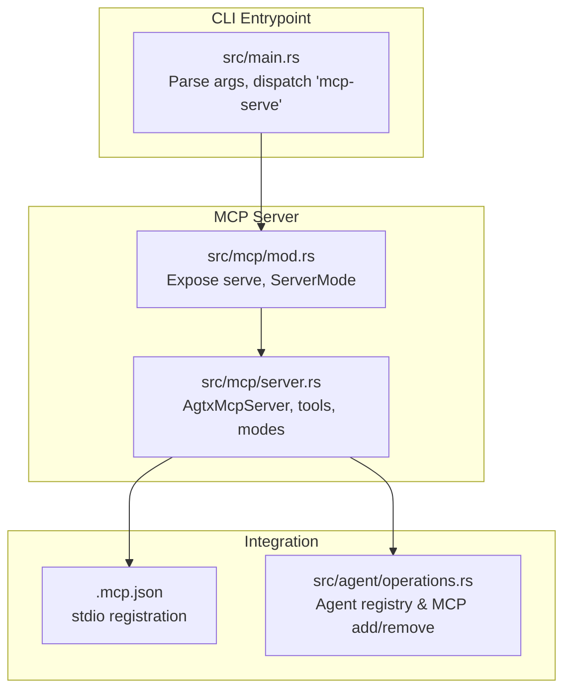
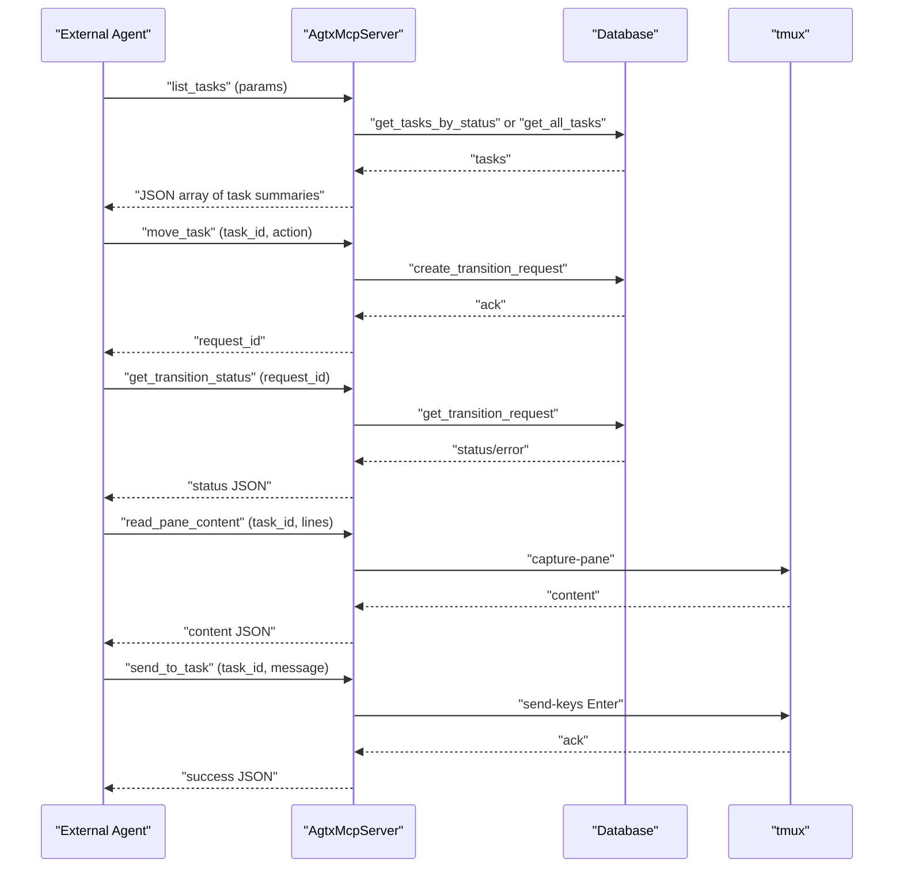
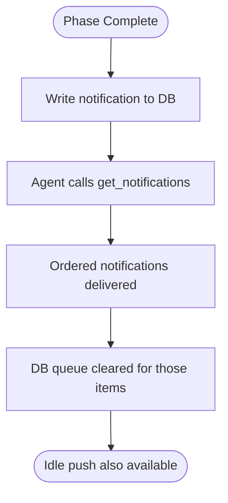
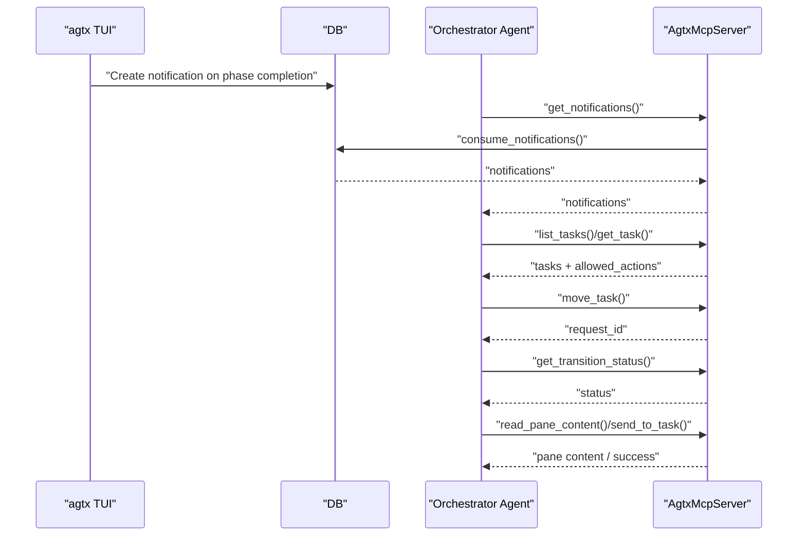
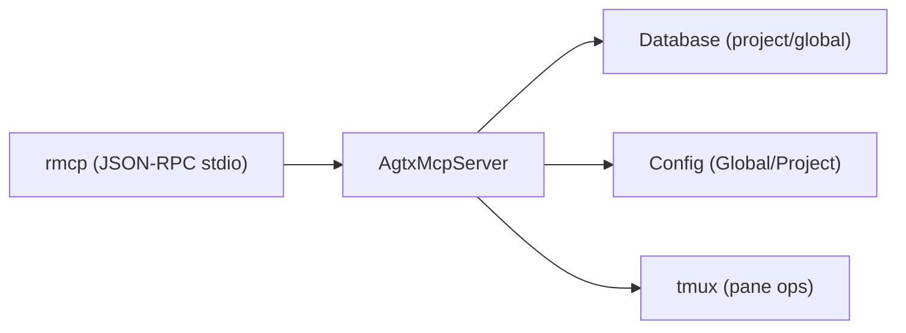

# MCP Server

<cite>
**Referenced Files in This Document**
- [server.rs](file://src/mcp/server.rs)
- [mod.rs](file://src/mcp/mod.rs)
- [main.rs](file://src/main.rs)
- [schema.rs](file://src/db/schema.rs)
- [.mcp.json](file://\.mcp.json)
- [README.md](file://README.md)
- [CLAUDE.md](file://CLAUDE.md)
- [mcp_tests.rs](file://tests/mcp_tests.rs)
- [operations.rs](file://src/agent/operations.rs)
</cite>

## Table of Contents
1. [Introduction](#introduction)
2. [Project Structure](#project-structure)
3. [Core Components](#core-components)
4. [Architecture Overview](#architecture-overview)
5. [Detailed Component Analysis](#detailed-component-analysis)
6. [Dependency Analysis](#dependency-analysis)
7. [Performance Considerations](#performance-considerations)
8. [Troubleshooting Guide](#troubleshooting-guide)
9. [Conclusion](#conclusion)
10. [Appendices](#appendices)

## Introduction
This document explains the MCP (Model Context Protocol) server implementation that powers external orchestration and integration with agtx. It covers JSON-RPC over stdio, tool registration, and notification systems. It documents the two operational modes (global vs project-scoped), all available tools with parameters and return values, orchestrator agent integration, push-when-idle notifications, practical client examples, error handling, debugging, security considerations, and integration guidance for AI coding platforms.

## Project Structure
The MCP server is implemented as a thin wrapper around the agtx task board, exposing a curated set of tools over JSON-RPC via stdio. The server integrates with the TUI’s database and tmux sessions to enable external agents to manage tasks programmatically.

**Diagram sources**
- [main.rs:30-46](file://src/main.rs#L30-L46)
- [mod.rs:1-5](file://src/mcp/mod.rs#L1-L5)
- [server.rs:1245-1263](file://src/mcp/server.rs#L1245-L1263)
- [.mcp.json:1-8](file://\.mcp.json#L1-L8)
- [operations.rs:92-107](file://src/agent/operations.rs#L92-L107)

**Section sources**
- [main.rs:30-46](file://src/main.rs#L30-L46)
- [mod.rs:1-5](file://src/mcp/mod.rs#L1-L5)
- [.mcp.json:1-8](file://\.mcp.json#L1-L8)
- [operations.rs:92-107](file://src/agent/operations.rs#L92-L107)

## Core Components
- ServerMode: Two modes determine how tools resolve project context.
  - Global: All CRUD tools require a project_id parameter; list_projects is called first to discover IDs.
  - Project: Fixed project path; project_id is ignored.
- AgtxMcpServer: Implements tool handlers and MCP ServerHandler.
- Tool router: Declares tools with descriptions and parameter schemas.
- Transport: JSON-RPC over stdio via rmcp.

Key responsibilities:
- Resolve project path and open appropriate DB (global vs project).
- Validate parameters and enforce status-dependent rules.
- Enforce dependency gating for Backlog forward transitions.
- Expose tmux pane read/send for diagnostics and nudging.
- Provide notifications for orchestrator push-when-idle.

**Section sources**
- [server.rs:16-24](file://src/mcp/server.rs#L16-L24)
- [server.rs:395-471](file://src/mcp/server.rs#L395-L471)
- [server.rs:1218-1242](file://src/mcp/server.rs#L1218-L1242)

## Architecture Overview
The MCP server sits between external agents and the TUI. It validates requests, enforces workflow rules, and coordinates with tmux and the database.

**Diagram sources**
- [server.rs:548-588](file://src/mcp/server.rs#L548-L588)
- [server.rs:658-721](file://src/mcp/server.rs#L658-L721)
- [server.rs:729-755](file://src/mcp/server.rs#L729-L755)
- [server.rs:863-910](file://src/mcp/server.rs#L863-L910)
- [server.rs:915-974](file://src/mcp/server.rs#L915-L974)

## Detailed Component Analysis

### Operational Modes
- Global mode:
  - Requires project_id for all CRUD tools.
  - Use list_projects to discover project IDs.
  - Validates global DB availability.
- Project-scoped mode:
  - Fixed project path at startup.
  - project_id is ignored.
  - Validates project DB availability.

Resolution and defaults:
- resolve_project_path: returns fixed path or resolves from global DB.
- open_project_db_for/open_project_db/open_global_db: open appropriate DB.
- config_defaults_for: merges global and project configs for defaults.

**Section sources**
- [server.rs:409-444](file://src/mcp/server.rs#L409-L444)
- [server.rs:1245-1263](file://src/mcp/server.rs#L1245-L1263)
- [CLAUDE.md:215-226](file://CLAUDE.md#L215-L226)

### Tool Catalog and Semantics

- list_projects
  - Params: none
  - Returns: array of project summaries (id, name, path)
  - Use case: discover project IDs in global mode
  - Notes: opens global DB

- list_tasks
  - Params: status (optional), project_id (required in global mode)
  - Returns: array of task summaries (id, title, status, agent, branch/pr, plugin, deps_satisfied)
  - Use case: enumerate tasks, optionally filter by status

- get_task
  - Params: task_id, project_id (required in global mode)
  - Returns: task detail (including allowed_actions computed from plugin rules and dependency satisfaction)
  - Use case: inspect task state and valid actions

- create_task
  - Params: title, description (optional), plugin (optional), referenced_tasks (comma-separated IDs), base_branch (optional), project_id (required in global mode)
  - Returns: created task id and initial status
  - Use case: add a single backlog task
  - Validation: referenced_tasks existence checked

- create_tasks_batch
  - Params: tasks[], each with title/description/plugin/base_branch, depends_on (indices into tasks array), project_id (required in global mode)
  - Returns: created tasks with indices and ids
  - Use case: add multiple tasks with inter-task dependencies
  - Validation: no forward references, duplicates disallowed, max 50 tasks

- update_task
  - Params: task_id, plus optional fields (title, description, plugin, referenced_tasks, base_branch)
  - Returns: updated fields list
  - Use case: edit backlog task metadata
  - Validation: only backlog tasks can be updated; referenced_tasks existence checked

- delete_task
  - Params: task_id, project_id (required in global mode)
  - Returns: deletion confirmation
  - Use case: remove backlog tasks
  - Validation: only backlog tasks can be deleted

- move_task
  - Params: task_id, action (research, move_forward, move_to_planning, move_to_running, move_to_review, move_to_done, resume, escalate_to_user), reason (optional), project_id (required in global mode)
  - Returns: request_id and message
  - Use case: queue a phase transition
  - Validation: action must be valid; Backlog forward transitions gated by dependency satisfaction; task existence verified

- get_transition_status
  - Params: request_id, project_id (required in global mode)
  - Returns: status (pending/completed/error) and optional error message
  - Use case: poll for completion of queued transitions

- check_conflicts
  - Params: task_id (optional), project_id (required in global mode)
  - Returns: main_branch and results per task (has_conflicts, conflicting_files, optional error)
  - Use case: non-destructive conflict detection for Review tasks or a specific task

- get_notifications
  - Params: project_id (required in global mode)
  - Returns: notifications consumed from queue (message, created_at)
  - Use case: pull orchestrator push-when-idle events

- read_pane_content
  - Params: task_id, lines (default 50), project_id (required in global mode)
  - Returns: task_id, session_name, content, lines_requested
  - Use case: diagnose stuck agents by reading recent pane output

- send_to_task
  - Params: task_id, message, project_id (required in global mode)
  - Returns: success flag and message
  - Use case: nudge agents, answer prompts, or provide guidance
  - Validation: only active phases (Planning/Running) allowed

- Additional batch helpers
  - Allowed actions computation: derived from plugin rules and dependency satisfaction.

Notes:
- In global mode, all CRUD tools require project_id; call list_projects first.
- In project-scoped mode, project_id is ignored.

**Section sources**
- [server.rs:524-543](file://src/mcp/server.rs#L524-L543)
- [server.rs:548-588](file://src/mcp/server.rs#L548-L588)
- [server.rs:593-653](file://src/mcp/server.rs#L593-L653)
- [server.rs:979-1018](file://src/mcp/server.rs#L979-L1018)
- [server.rs:1023-1106](file://src/mcp/server.rs#L1023-L1106)
- [server.rs:1111-1178](file://src/mcp/server.rs#L1111-L1178)
- [server.rs:1183-1215](file://src/mcp/server.rs#L1183-L1215)
- [server.rs:658-721](file://src/mcp/server.rs#L658-L721)
- [server.rs:729-755](file://src/mcp/server.rs#L729-L755)
- [server.rs:760-832](file://src/mcp/server.rs#L760-L832)
- [server.rs:837-858](file://src/mcp/server.rs#L837-L858)
- [server.rs:863-910](file://src/mcp/server.rs#L863-L910)
- [server.rs:915-974](file://src/mcp/server.rs#L915-L974)
- [server.rs:474-518](file://src/mcp/server.rs#L474-L518)
- [CLAUDE.md:213-226](file://CLAUDE.md#L213-L226)

### Notification System (Push-When-Idle)
- Mechanism:
  - TUI writes notifications to the project DB when orchestrator completes a phase.
  - External agents call get_notifications to consume them.
  - Notifications are atomic fetch-and-delete via RETURNING to preserve ordering.
- Behavior:
  - get_notifications consumes and returns ordered notifications.
  - peek_notifications exists for inspection without consumption.
- Orchestrator integration:
  - Notifications are also pushed to the orchestrator’s tmux pane when idle, enabling reactive orchestration.

**Diagram sources**
- [schema.rs:598-654](file://src/db/schema.rs#L598-L654)
- [server.rs:837-858](file://src/mcp/server.rs#L837-L858)
- [README.md:638-646](file://README.md#L638-L646)

**Section sources**
- [schema.rs:598-654](file://src/db/schema.rs#L598-L654)
- [server.rs:837-858](file://src/mcp/server.rs#L837-L858)
- [README.md:638-646](file://README.md#L638-L646)

### Orchestrator Agent Integration
- Registration:
  - Agents register the MCP server locally via platform-specific commands (e.g., claude mcp add-json).
  - Cleanup occurs on exit to avoid stale registrations.
- Workflow:
  - Agent receives push-when-idle notifications when orchestrator is idle.
  - Agent calls list_tasks/get_task to compute allowed_actions, then move_task to advance.
  - For stuck tasks, agent reads pane content and optionally sends messages or escalates.

**Diagram sources**
- [operations.rs:92-107](file://src/agent/operations.rs#L92-L107)
- [server.rs:837-858](file://src/mcp/server.rs#L837-L858)
- [server.rs:548-653](file://src/mcp/server.rs#L548-L653)
- [server.rs:658-755](file://src/mcp/server.rs#L658-L755)
- [server.rs:863-974](file://src/mcp/server.rs#L863-L974)

**Section sources**
- [operations.rs:92-107](file://src/agent/operations.rs#L92-L107)
- [README.md:638-646](file://README.md#L638-L646)
- [CLAUDE.md:205-213](file://CLAUDE.md#L205-L213)

### Practical Examples

- Listing tasks in a project:
  - Global mode: call list_projects first to get project_id, then list_tasks with project_id.
  - Project-scoped mode: call list_tasks without project_id.

- Creating tasks:
  - Single task: create_task with title and optional metadata.
  - Batch with dependencies: create_tasks_batch with depends_on indices.

- Advancing a task:
  - get_task to see allowed_actions, then move_task with a valid action.

- Diagnosing stuck tasks:
  - read_pane_content to inspect recent output.
  - send_to_task to nudge or answer prompts.
  - escalate_to_user action to flag for human intervention.

- Checking conflicts:
  - check_conflicts for Review tasks or a specific task.

- Consuming notifications:
  - get_notifications to pull orchestrator events.

**Section sources**
- [server.rs:524-543](file://src/mcp/server.rs#L524-L543)
- [server.rs:548-588](file://src/mcp/server.rs#L548-L588)
- [server.rs:979-1018](file://src/mcp/server.rs#L979-L1018)
- [server.rs:1023-1106](file://src/mcp/server.rs#L1023-L1106)
- [server.rs:658-721](file://src/mcp/server.rs#L658-L721)
- [server.rs:863-974](file://src/mcp/server.rs#L863-L974)
- [server.rs:760-832](file://src/mcp/server.rs#L760-L832)
- [server.rs:837-858](file://src/mcp/server.rs#L837-L858)

### Error Handling Strategies
- Parameter validation:
  - Missing project_id in global mode returns explicit errors.
  - Invalid status/action values return descriptive errors.
- Existence checks:
  - Task existence and referenced_tasks presence validated before mutation.
- Dependency gating:
  - Forward transitions from Backlog are blocked until dependencies are satisfied.
- Database errors:
  - All DB operations return descriptive errors; serialization errors are handled gracefully.
- Transition lifecycle:
  - get_transition_status distinguishes pending, completed, and error states.

**Section sources**
- [server.rs:413-429](file://src/mcp/server.rs#L413-L429)
- [server.rs:551-555](file://src/mcp/server.rs#L551-L555)
- [server.rs:679-698](file://src/mcp/server.rs#L679-L698)
- [server.rs:729-755](file://src/mcp/server.rs#L729-L755)
- [server.rs:990-997](file://src/mcp/server.rs#L990-L997)
- [server.rs:1146-1153](file://src/mcp/server.rs#L1146-L1153)

### Debugging Techniques
- Enable verbose logging via platform-specific debug flags (e.g., agent logs).
- Use read_pane_content to inspect agent output and identify stalls.
- Use get_notifications to confirm orchestrator activity and timing.
- Validate allowed_actions via get_task to ensure plugin rules are respected.
- Test batch creation with depends_on indices to verify dependency resolution.

**Section sources**
- [server.rs:863-910](file://src/mcp/server.rs#L863-L910)
- [server.rs:837-858](file://src/mcp/server.rs#L837-L858)
- [server.rs:593-653](file://src/mcp/server.rs#L593-L653)
- [server.rs:1023-1106](file://src/mcp/server.rs#L1023-L1106)

### Security Considerations
- Transport: JSON-RPC over stdio with no network exposure.
- Authentication: No built-in authentication; rely on local process boundaries and controlled agent registration.
- Permissions: MCP server runs with the privileges of the invoking user/process.
- Recommendations:
  - Restrict agent registration to trusted sessions.
  - Avoid exposing the MCP server to untrusted environments.
  - Monitor notifications and transition requests for unexpected activity.

**Section sources**
- [server.rs:1245-1263](file://src/mcp/server.rs#L1245-L1263)
- [operations.rs:92-107](file://src/agent/operations.rs#L92-L107)

### Integration Guidance for AI Coding Platforms
- Registration:
  - Use platform-specific MCP registration commands to bind to the stdio server.
  - Clean up registrations on exit to prevent stale entries.
- Supported agents:
  - Claude Code, Codex, Gemini CLI, OpenCode, Cursor Agent, GitHub Copilot CLI.
- Orchestration:
  - Use list_tasks/get_task to discover and validate allowed_actions.
  - Use move_task to advance tasks and get_transition_status to poll.
  - Use read_pane_content/send_to_task for diagnostics and nudging.
  - Use get_notifications for push-when-idle automation.

**Section sources**
- [operations.rs:92-107](file://src/agent/operations.rs#L92-L107)
- [README.md:66-66](file://README.md#L66-L66)
- [CLAUDE.md:205-213](file://CLAUDE.md#L205-L213)

## Dependency Analysis
- External crates:
  - rmcp: JSON-RPC over stdio, tool routing, schemas.
  - tokio: async runtime for MCP service.
- Internal dependencies:
  - Database: project/global DB access, notifications, transition requests.
  - Config: merged global and project defaults.
  - tmux: pane capture/send for diagnostics and nudging.

**Diagram sources**
- [server.rs:4-11](file://src/mcp/server.rs#L4-L11)
- [server.rs:13-14](file://src/mcp/server.rs#L13-L14)

**Section sources**
- [server.rs:4-11](file://src/mcp/server.rs#L4-L11)
- [server.rs:13-14](file://src/mcp/server.rs#L13-L14)

## Performance Considerations
- Tool responses are serialized JSON; keep payloads minimal.
- Batch operations (create_tasks_batch) provide atomicity and reduce round trips.
- Conflict checks and pane reads are lightweight; avoid excessive polling.
- Transition requests are persisted and cleaned up periodically to prevent accumulation.

[No sources needed since this section provides general guidance]

## Troubleshooting Guide
Common issues and resolutions:
- Missing project_id in global mode:
  - Call list_projects first, then pass project_id to all CRUD tools.
- Invalid action or status:
  - Use get_task to check allowed_actions; ensure dependencies are satisfied for Backlog forward transitions.
- Task not found:
  - Verify task_id and project_id; ensure correct mode (global vs project-scoped).
- Pane read failures:
  - Confirm task has an active session; adjust lines parameter.
- Transition stuck:
  - Poll get_transition_status; escalate_to_user if needed; read pane content and send_to_task to nudge.

**Section sources**
- [server.rs:413-429](file://src/mcp/server.rs#L413-L429)
- [server.rs:551-555](file://src/mcp/server.rs#L551-L555)
- [server.rs:679-698](file://src/mcp/server.rs#L679-L698)
- [server.rs:863-910](file://src/mcp/server.rs#L863-L910)
- [server.rs:729-755](file://src/mcp/server.rs#L729-L755)

## Conclusion
The agtx MCP server provides a robust, spec-driven integration surface for external orchestration and AI coding platforms. With two operational modes, a comprehensive tool catalog, strict validation, and a push-when-idle notification system, it enables reliable automation while preserving safety and transparency. Proper use of list_projects, allowed_actions, and diagnostics ensures smooth integration across diverse AI agents.

[No sources needed since this section summarizes without analyzing specific files]

## Appendices

### MCP Server Modes Reference
- Global mode: all CRUD tools require project_id; call list_projects first.
- Project-scoped mode: fixed project path; project_id ignored.

**Section sources**
- [CLAUDE.md:215-226](file://CLAUDE.md#L215-L226)
- [server.rs:1245-1263](file://src/mcp/server.rs#L1245-L1263)

### Tool Parameter and Return Types Summary
- list_projects: no params; returns array of project summaries.
- list_tasks: status (optional), project_id (required in global); returns array of task summaries.
- get_task: task_id, project_id; returns task detail with allowed_actions.
- create_task: title, description, plugin, referenced_tasks, base_branch, project_id; returns created id/status.
- create_tasks_batch: tasks[] with depends_on; returns created tasks.
- update_task: task_id + optional fields; returns updated fields list.
- delete_task: task_id; returns confirmation.
- move_task: task_id, action, reason (optional), project_id; returns request_id.
- get_transition_status: request_id, project_id; returns status/error.
- check_conflicts: task_id (optional), project_id; returns main_branch and per-task results.
- get_notifications: project_id; returns notifications.
- read_pane_content: task_id, lines (optional), project_id; returns content.
- send_to_task: task_id, message, project_id; returns success.

**Section sources**
- [server.rs:524-543](file://src/mcp/server.rs#L524-L543)
- [server.rs:548-588](file://src/mcp/server.rs#L548-L588)
- [server.rs:593-653](file://src/mcp/server.rs#L593-L653)
- [server.rs:979-1018](file://src/mcp/server.rs#L979-L1018)
- [server.rs:1023-1106](file://src/mcp/server.rs#L1023-L1106)
- [server.rs:1111-1178](file://src/mcp/server.rs#L1111-L1178)
- [server.rs:1183-1215](file://src/mcp/server.rs#L1183-L1215)
- [server.rs:658-721](file://src/mcp/server.rs#L658-L721)
- [server.rs:729-755](file://src/mcp/server.rs#L729-L755)
- [server.rs:760-832](file://src/mcp/server.rs#L760-L832)
- [server.rs:837-858](file://src/mcp/server.rs#L837-L858)
- [server.rs:863-910](file://src/mcp/server.rs#L863-L910)
- [server.rs:915-974](file://src/mcp/server.rs#L915-L974)

### Tests Coverage Highlights
- Transition requests lifecycle and cleanup.
- Batch creation with dependency resolution and rollback.
- Notifications peek/consume ordering.
- Project upsert/update.

**Section sources**
- [mcp_tests.rs:5-150](file://tests/mcp_tests.rs#L5-L150)
- [mcp_tests.rs:194-231](file://tests/mcp_tests.rs#L194-L231)
- [mcp_tests.rs:391-436](file://tests/mcp_tests.rs#L391-L436)
- [mcp_tests.rs:440-471](file://tests/mcp_tests.rs#L440-L471)