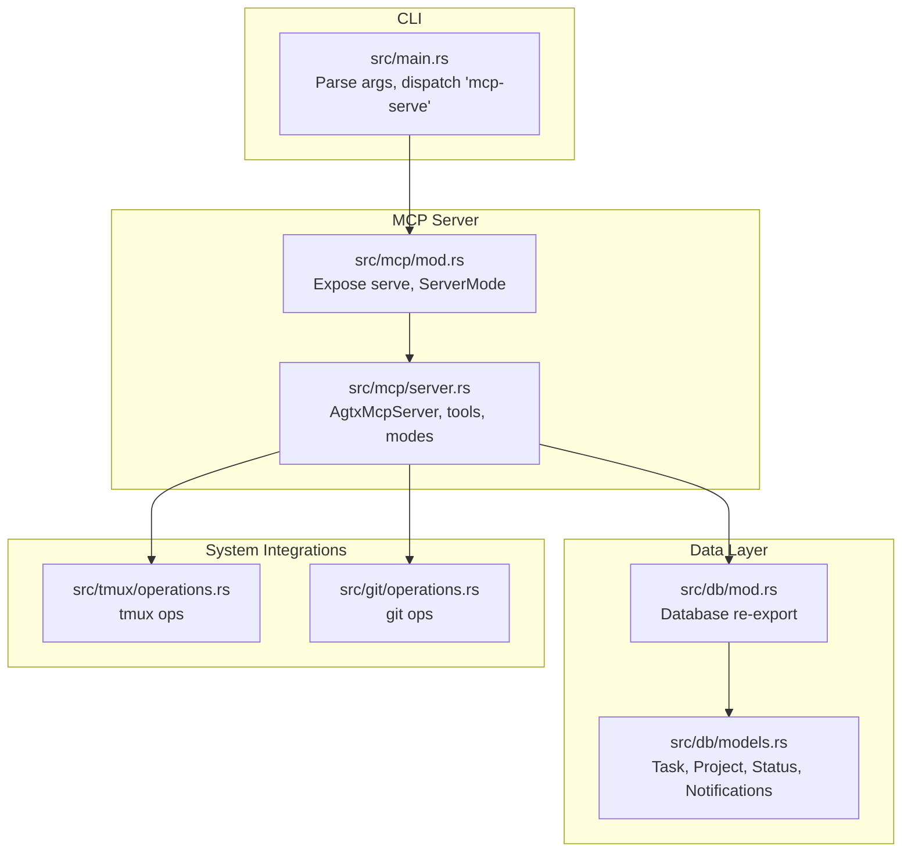
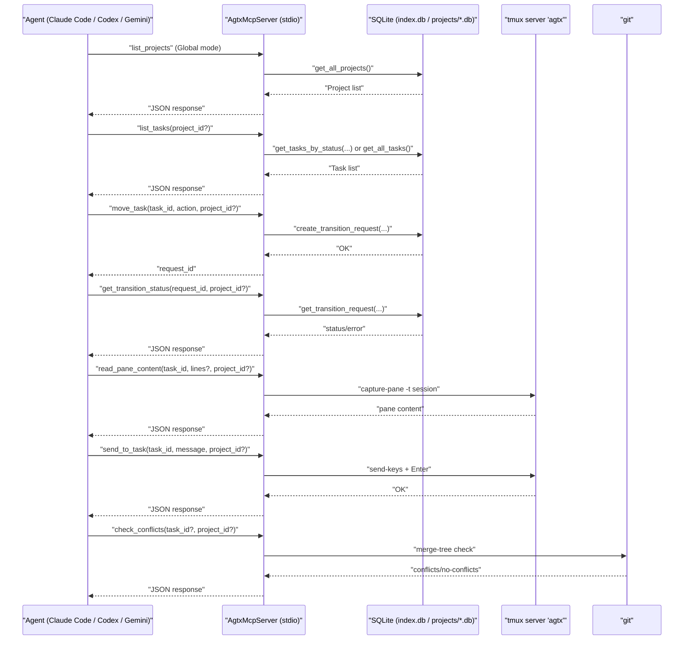
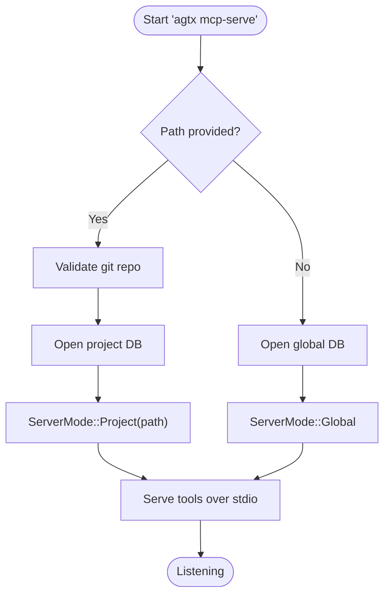
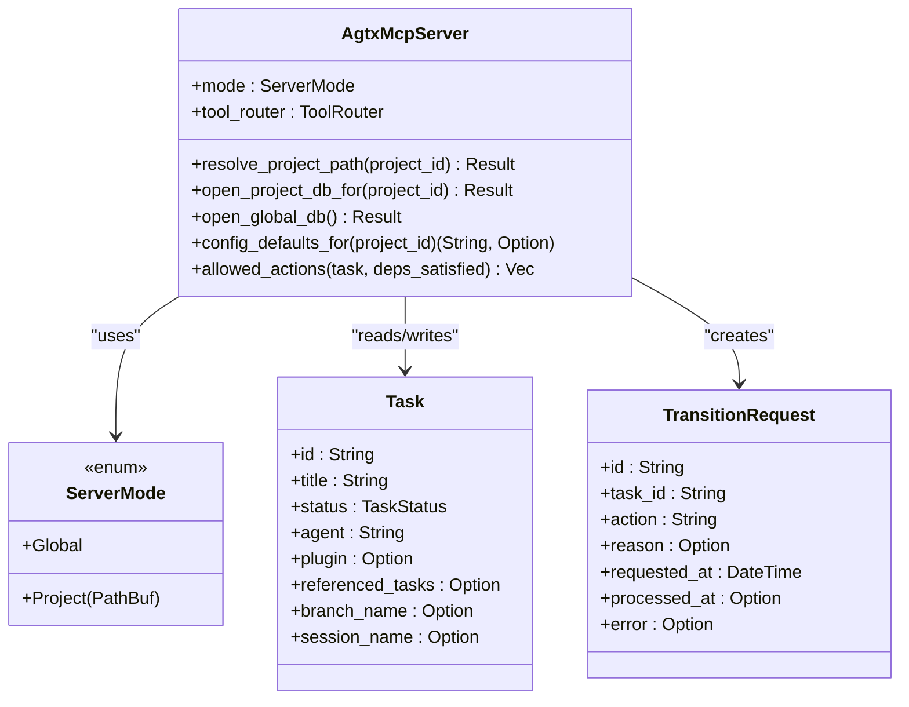
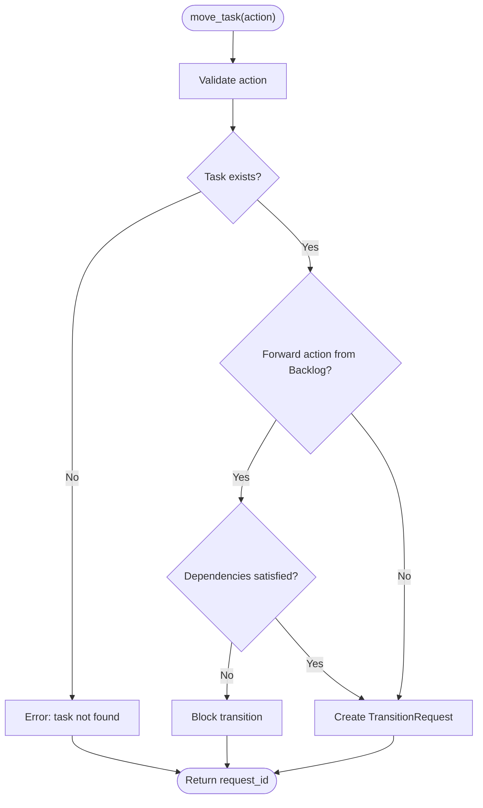
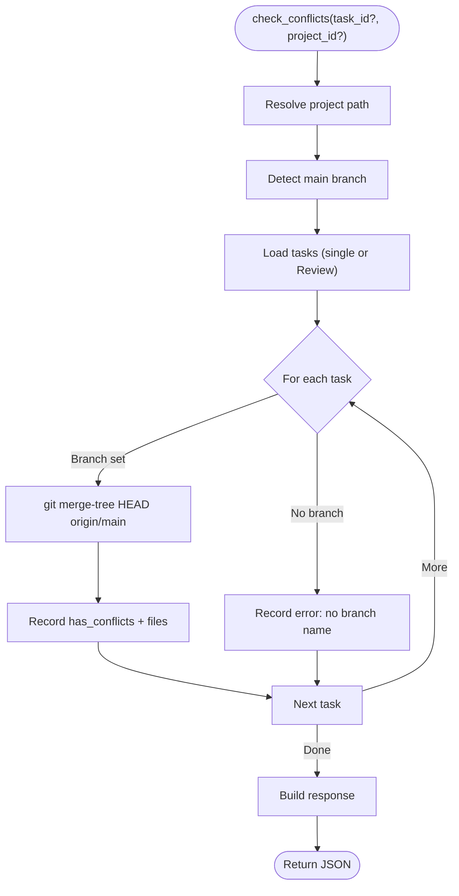
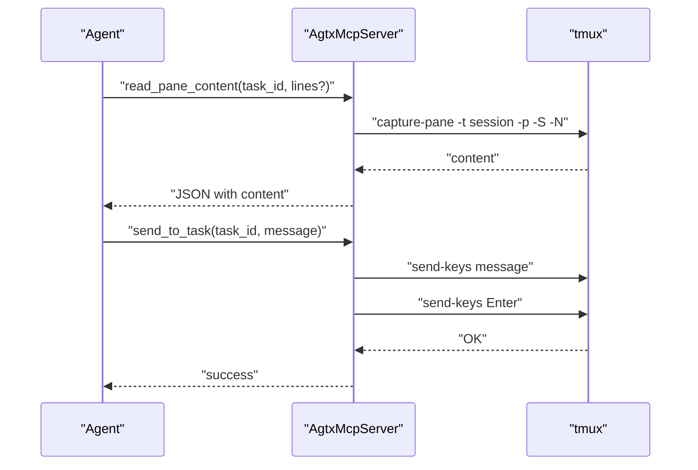
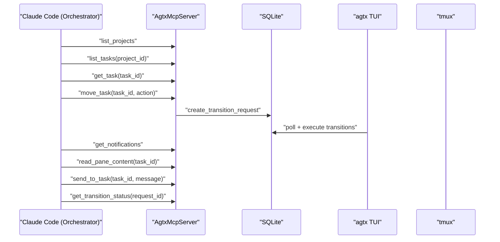
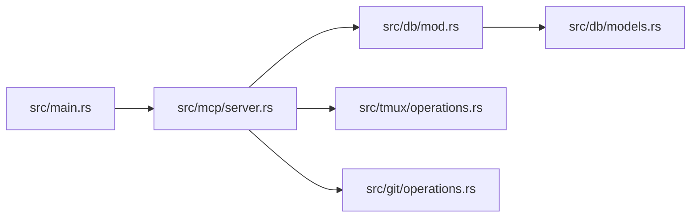

# MCP Server

<cite>
**Referenced Files in This Document**
- [README.md](file://README.md)
- [CLAUDE.md](file://CLAUDE.md)
- [AGENTS.md](file://AGENTS.md)
- [.mcp.json](file://.mcp.json)
- [src/main.rs](file://src/main.rs)
- [src/mcp/mod.rs](file://src/mcp/mod.rs)
- [src/mcp/server.rs](file://src/mcp/server.rs)
- [src/db/models.rs](file://src/db/models.rs)
- [src/db/mod.rs](file://src/db/mod.rs)
- [src/config/mod.rs](file://src/config/mod.rs)
- [src/tmux/operations.rs](file://src/tmux/operations.rs)
- [src/git/operations.rs](file://src/git/operations.rs)
- [tests/mcp_tests.rs](file://tests/mcp_tests.rs)
</cite>

## Table of Contents
1. [Introduction](#introduction)
2. [Project Structure](#project-structure)
3. [Core Components](#core-components)
4. [Architecture Overview](#architecture-overview)
5. [Detailed Component Analysis](#detailed-component-analysis)
6. [Dependency Analysis](#dependency-analysis)
7. [Performance Considerations](#performance-considerations)
8. [Troubleshooting Guide](#troubleshooting-guide)
9. [Conclusion](#conclusion)
10. [Appendices](#appendices)

## Introduction
This document explains the MCP (Model Context Protocol) server implemented by AGTX for JSON-RPC over stdio, enabling external tools and agents to integrate with the terminal-based kanban board. It covers MCP fundamentals, AGTX’s implementation, operational modes (global vs project-scoped), all available tools, integration examples with Claude Code, Codex, and Gemini CLI, configuration and security considerations, orchestrator agent integration, troubleshooting, and best practices.

## Project Structure
The MCP server is implemented as a thin JSON-RPC layer over stdio, backed by AGTX’s database and system integrations:
- CLI entry routes to the MCP server when invoked with the “mcp-serve” command.
- The MCP server exposes tools for listing projects, listing/managing tasks, queuing transitions, checking conflicts, and interacting with agent sessions via tmux.
- Database models and operations underpin task/project state and persistence.
- Configuration and plugin systems influence agent selection and workflow behavior.

**Diagram sources**
- [src/main.rs:30-46](file://src/main.rs#L30-L46)
- [src/mcp/mod.rs:1-5](file://src/mcp/mod.rs#L1-L5)
- [src/mcp/server.rs:1245-1264](file://src/mcp/server.rs#L1245-L1264)
- [src/db/mod.rs:1-6](file://src/db/mod.rs#L1-L6)
- [src/db/models.rs:58-184](file://src/db/models.rs#L58-L184)
- [src/tmux/operations.rs:61-248](file://src/tmux/operations.rs#L61-L248)
- [src/git/operations.rs:77-275](file://src/git/operations.rs#L77-L275)

**Section sources**
- [src/main.rs:30-46](file://src/main.rs#L30-L46)
- [src/mcp/mod.rs:1-5](file://src/mcp/mod.rs#L1-L5)
- [src/mcp/server.rs:1245-1264](file://src/mcp/server.rs#L1245-L1264)
- [src/db/mod.rs:1-6](file://src/db/mod.rs#L1-L6)
- [src/db/models.rs:58-184](file://src/db/models.rs#L58-L184)
- [src/tmux/operations.rs:61-248](file://src/tmux/operations.rs#L61-L248)
- [src/git/operations.rs:77-275](file://src/git/operations.rs#L77-L275)

## Core Components
- ServerMode: Two modes—Project-scoped (fixed path) and Global (requires project_id).
- AgtxMcpServer: Implements MCP tools and routes them via a tool router.
- Tools: list_projects, list_tasks, get_task, create_task, create_tasks_batch, update_task, delete_task, move_task, get_transition_status, check_conflicts, get_notifications, read_pane_content, send_to_task.
- Database integration: Tasks, Projects, TransitionRequests, Notifications.
- System integrations: tmux for agent sessions, git for worktrees and conflict checks.

**Section sources**
- [src/mcp/server.rs:16-24](file://src/mcp/server.rs#L16-L24)
- [src/mcp/server.rs:395-471](file://src/mcp/server.rs#L395-L471)
- [src/db/models.rs:58-184](file://src/db/models.rs#L58-L184)
- [src/tmux/operations.rs:61-248](file://src/tmux/operations.rs#L61-L248)
- [src/git/operations.rs:77-275](file://src/git/operations.rs#L77-L275)

## Architecture Overview
The MCP server runs as a JSON-RPC service over stdio. Agents register the server and call tools to manage tasks and agent sessions.

**Diagram sources**
- [src/mcp/server.rs:521-1216](file://src/mcp/server.rs#L521-L1216)
- [src/db/models.rs:58-184](file://src/db/models.rs#L58-L184)
- [src/tmux/operations.rs:166-182](file://src/tmux/operations.rs#L166-L182)
- [src/git/operations.rs:211-243](file://src/git/operations.rs#L211-L243)

## Detailed Component Analysis

### MCP Server Modes
- Global mode: Requires project_id for all CRUD tools; resolves project path via the global DB.
- Project-scoped mode: Bound to a single project path at startup; ignores project_id.

**Diagram sources**
- [src/main.rs:30-46](file://src/main.rs#L30-L46)
- [src/mcp/server.rs:1245-1264](file://src/mcp/server.rs#L1245-L1264)

**Section sources**
- [src/main.rs:30-46](file://src/main.rs#L30-L46)
- [src/mcp/server.rs:16-24](file://src/mcp/server.rs#L16-L24)
- [src/mcp/server.rs:409-429](file://src/mcp/server.rs#L409-L429)
- [src/mcp/server.rs:1245-1264](file://src/mcp/server.rs#L1245-L1264)

### Tool Catalog and Behavior
- list_projects: Lists all projects in the global index.
- list_tasks: Lists tasks optionally filtered by status; in Global mode requires project_id.
- get_task: Returns task details and allowed_actions computed from plugin rules and dependency satisfaction.
- create_task: Creates a backlog task; validates referenced_tasks existence.
- create_tasks_batch: Batch-create tasks with index-based dependencies; enforces no forward references and deduplicate indices.
- update_task: Updates backlog task fields; validates referenced_tasks and status guard.
- delete_task: Deletes a backlog task.
- move_task: Queues a transition request; validates action and dependency gates for forward transitions.
- get_transition_status: Checks completion or error of a transition request.
- check_conflicts: Non-destructive conflict check against default branch for one task or all Review tasks.
- get_notifications: Consumes and returns orchestrator notifications.
- read_pane_content: Reads recent lines from a task’s tmux pane.
- send_to_task: Sends a message to a task’s agent pane (Planning/Running only).

**Diagram sources**
- [src/mcp/server.rs:395-519](file://src/mcp/server.rs#L395-L519)
- [src/mcp/server.rs:16-24](file://src/mcp/server.rs#L16-L24)
- [src/db/models.rs:58-184](file://src/db/models.rs#L58-L184)

**Section sources**
- [src/mcp/server.rs:521-1216](file://src/mcp/server.rs#L521-L1216)
- [src/db/models.rs:58-184](file://src/db/models.rs#L58-L184)

### Tool: move_task and Allowed Actions
The orchestrator relies on allowed_actions to gate transitions. The server computes allowed actions based on task status and plugin rules, and blocks forward transitions when dependencies are unsatisfied.

**Diagram sources**
- [src/mcp/server.rs:655-721](file://src/mcp/server.rs#L655-L721)
- [src/mcp/server.rs:473-518](file://src/mcp/server.rs#L473-L518)

**Section sources**
- [src/mcp/server.rs:655-721](file://src/mcp/server.rs#L655-L721)
- [src/mcp/server.rs:473-518](file://src/mcp/server.rs#L473-L518)

### Tool: check_conflicts
Checks merge conflicts against the default branch using a non-destructive virtual merge.

**Diagram sources**
- [src/mcp/server.rs:757-832](file://src/mcp/server.rs#L757-L832)
- [src/git/operations.rs:211-243](file://src/git/operations.rs#L211-L243)

**Section sources**
- [src/mcp/server.rs:757-832](file://src/mcp/server.rs#L757-L832)
- [src/git/operations.rs:211-243](file://src/git/operations.rs#L211-L243)

### Tool: read_pane_content and send_to_task
- read_pane_content: Captures pane content from tmux for diagnostics.
- send_to_task: Sends keys to a tmux pane (Planning/Running only).

**Diagram sources**
- [src/mcp/server.rs:860-974](file://src/mcp/server.rs#L860-L974)
- [src/tmux/operations.rs:166-136](file://src/tmux/operations.rs#L166-L136)

**Section sources**
- [src/mcp/server.rs:860-974](file://src/mcp/server.rs#L860-L974)
- [src/tmux/operations.rs:166-136](file://src/tmux/operations.rs#L166-L136)

### Orchestrator Agent Integration
The orchestrator uses MCP to:
- Discover projects and tasks.
- Query allowed_actions and queue transitions.
- Monitor progress via notifications and pane content.
- Nudge stuck agents or escalate to human attention.

**Diagram sources**
- [README.md:623-646](file://README.md#L623-L646)
- [CLAUDE.md:191-214](file://CLAUDE.md#L191-L214)
- [src/mcp/server.rs:521-1216](file://src/mcp/server.rs#L521-L1216)

**Section sources**
- [README.md:623-646](file://README.md#L623-L646)
- [CLAUDE.md:191-214](file://CLAUDE.md#L191-L214)
- [src/mcp/server.rs:521-1216](file://src/mcp/server.rs#L521-L1216)

## Dependency Analysis
- CLI to MCP: The CLI parses arguments and invokes the MCP server with optional project path.
- MCP to DB: Tools read/write tasks, projects, transition requests, and notifications.
- MCP to tmux: Pane capture and key injection for agent interaction.
- MCP to git: Conflict checks and worktree operations are indirectly used via plugin workflows.

**Diagram sources**
- [src/main.rs:30-46](file://src/main.rs#L30-L46)
- [src/mcp/server.rs:1245-1264](file://src/mcp/server.rs#L1245-L1264)
- [src/db/mod.rs:1-6](file://src/db/mod.rs#L1-L6)
- [src/db/models.rs:58-184](file://src/db/models.rs#L58-L184)
- [src/tmux/operations.rs:61-248](file://src/tmux/operations.rs#L61-L248)
- [src/git/operations.rs:77-275](file://src/git/operations.rs#L77-L275)

**Section sources**
- [src/main.rs:30-46](file://src/main.rs#L30-L46)
- [src/mcp/server.rs:1245-1264](file://src/mcp/server.rs#L1245-L1264)
- [src/db/mod.rs:1-6](file://src/db/mod.rs#L1-L6)
- [src/db/models.rs:58-184](file://src/db/models.rs#L58-L184)
- [src/tmux/operations.rs:61-248](file://src/tmux/operations.rs#L61-L248)
- [src/git/operations.rs:77-275](file://src/git/operations.rs#L77-L275)

## Performance Considerations
- JSON serialization overhead: Responses are serialized to pretty JSON; consider compact mode for high-frequency calls.
- Database queries: Batch operations (e.g., create_tasks_batch) use atomic transactions to reduce overhead and ensure consistency.
- tmux operations: Pane capture and key injection are synchronous; batch frequent calls to minimize latency.
- Conflict checks: Virtual merges are efficient; avoid repeated checks by caching results per task.

[No sources needed since this section provides general guidance]

## Troubleshooting Guide
Common issues and resolutions:
- MCP connectivity
  - Ensure the server is started in the correct mode and path.
  - Verify the agent’s MCP registration points to the correct command and args.
- Permission problems
  - Confirm the user has permissions to start tmux sessions and git operations.
  - Check that the tmux server “agtx” is accessible.
- Debugging MCP communication
  - Use verbose logging in the agent’s MCP client.
  - Inspect the MCP server logs and error messages returned by tools.
  - Validate project_id resolution in Global mode by calling list_projects first.
- Task state and transitions
  - Use get_task to check allowed_actions and blocking dependencies.
  - Use get_transition_status to verify completion or errors.
- Pane diagnostics
  - Use read_pane_content to inspect agent output for stuck tasks.
  - Use send_to_task to inject guidance or answers to prompts.

**Section sources**
- [README.md:573-603](file://README.md#L573-L603)
- [CLAUDE.md:215-227](file://CLAUDE.md#L215-L227)
- [src/mcp/server.rs:521-1216](file://src/mcp/server.rs#L521-L1216)

## Conclusion
AGTX’s MCP server provides a robust, agent-friendly interface to manage a terminal-based kanban board. With two operational modes, a comprehensive toolset, and tight integration with tmux and git, it enables seamless automation and orchestration. The orchestrator agent leverages MCP to drive tasks forward, while external agents can integrate via standard MCP clients.

[No sources needed since this section summarizes without analyzing specific files]

## Appendices

### MCP Server Modes and Tool Requirements
- Global mode: All CRUD tools require project_id; call list_projects first.
- Project-scoped mode: project_id is ignored; path is fixed at startup.

**Section sources**
- [README.md:577-584](file://README.md#L577-L584)
- [CLAUDE.md:215-227](file://CLAUDE.md#L215-L227)
- [src/mcp/server.rs:409-429](file://src/mcp/server.rs#L409-L429)

### MCP Tool Reference
- list_projects: List all projects indexed by agtx.
- list_tasks: List tasks, optionally filtered by status.
- get_task: Get task details and allowed_actions.
- create_task: Create a backlog task.
- create_tasks_batch: Batch-create tasks with index-based dependencies.
- update_task: Modify a backlog task’s fields.
- delete_task: Delete a backlog task.
- move_task: Queue a phase transition.
- get_transition_status: Check transition completion or error.
- check_conflicts: Non-destructive merge conflict check.
- get_notifications: Consume orchestrator notifications.
- read_pane_content: Read recent pane lines.
- send_to_task: Send a message to a task’s agent pane.

**Section sources**
- [README.md:586-602](file://README.md#L586-L602)
- [CLAUDE.md:213-213](file://CLAUDE.md#L213-L213)
- [src/mcp/server.rs:521-1216](file://src/mcp/server.rs#L521-L1216)

### Agent Integration Examples
- Claude Code: Register the MCP server with the orchestrator and use sweep/brainstorm skills.
- Codex: Use the shared .mcp.json to register the server; integrate via marketplace.
- Gemini CLI: Add the MCP server and include the sweep skill in context.

**Section sources**
- [README.md:188-257](file://README.md#L188-L257)
- [.mcp.json:1-8](file://.mcp.json#L1-L8)

### Configuration and Security
- Configuration: Global and project-level settings influence agent defaults and workflow behavior.
- Security: MCP runs over stdio; ensure the environment restricts access to the process and that tmux sessions are isolated.

**Section sources**
- [README.md:261-328](file://README.md#L261-L328)
- [src/config/mod.rs:230-303](file://src/config/mod.rs#L230-L303)

### Best Practices
- Use Global mode for broad tool access; use project-scoped mode for orchestrator binding.
- Always validate project_id in Global mode via list_projects.
- Use allowed_actions to gate transitions and prevent invalid state changes.
- Employ read_pane_content and send_to_task for diagnostics and nudges.
- Keep tasks in Backlog until dependencies are satisfied; rely on plugin rules for gating.

**Section sources**
- [src/mcp/server.rs:473-518](file://src/mcp/server.rs#L473-L518)
- [src/mcp/server.rs:860-974](file://src/mcp/server.rs#L860-L974)