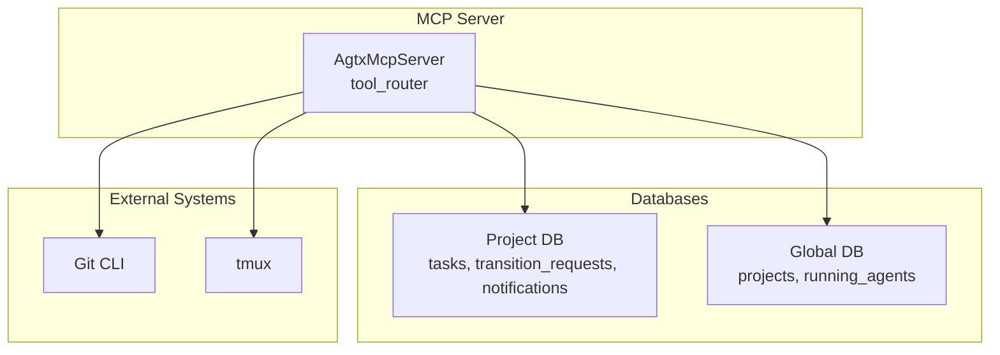
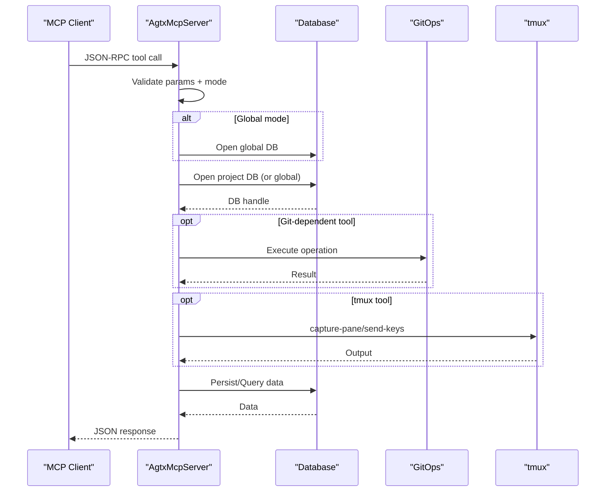
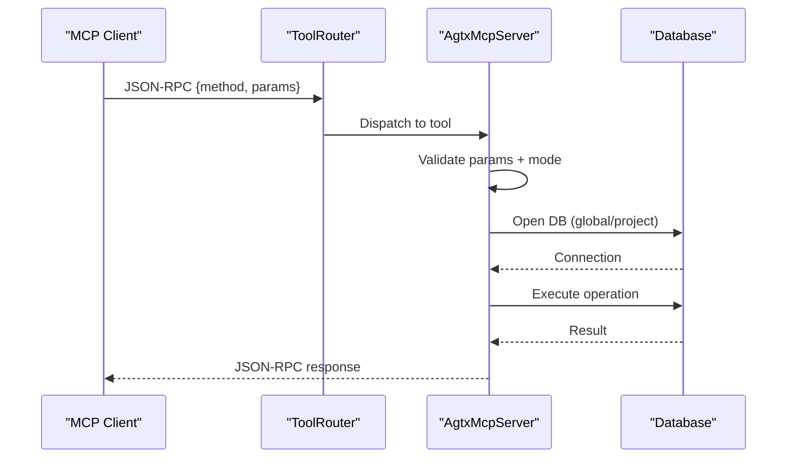
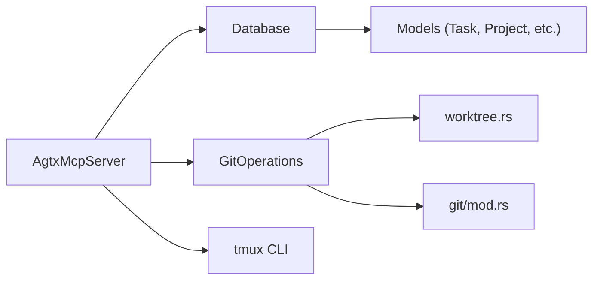

# MCP Tools Reference

<cite>
**Referenced Files in This Document**
- [README.md](file://README.md)
- [src/main.rs](file://src/main.rs)
- [src/mcp/mod.rs](file://src/mcp/mod.rs)
- [src/mcp/server.rs](file://src/mcp/server.rs)
- [src/db/models.rs](file://src/db/models.rs)
- [src/db/schema.rs](file://src/db/schema.rs)
- [src/git/mod.rs](file://src/git/mod.rs)
- [src/git/operations.rs](file://src/git/operations.rs)
- [src/git/worktree.rs](file://src/git/worktree.rs)
- [tests/mcp_tests.rs](file://tests/mcp_tests.rs)
</cite>

## Table of Contents
1. [Introduction](#introduction)
2. [Project Structure](#project-structure)
3. [Core Components](#core-components)
4. [Architecture Overview](#architecture-overview)
5. [Detailed Component Analysis](#detailed-component-analysis)
6. [Dependency Analysis](#dependency-analysis)
7. [Performance Considerations](#performance-considerations)
8. [Troubleshooting Guide](#troubleshooting-guide)
9. [Conclusion](#conclusion)
10. [Appendices](#appendices)

## Introduction
This document provides comprehensive API documentation for the MCP server tools exposed by the agtx project. It covers the JSON-RPC method signatures, parameter specifications, return schemas, error conditions, execution flows, database interactions, and state management for the following tools:
- list_projects
- list_tasks
- create_task
- move_task
- get_task
- check_conflicts
- read_pane_content

It also documents the tool registration process, how to add new tools, security considerations, rate limiting, performance implications, and troubleshooting guidance.

## Project Structure
The MCP server is implemented as part of the agtx TUI and orchestrator. The server exposes tools over stdio using the Model Context Protocol (MCP) and interacts with:
- SQLite databases (project and global indexes)
- Git operations for worktree management and conflict detection
- tmux sessions for agent pane access

**Diagram sources**
- [src/mcp/server.rs:521-1216](file://src/mcp/server.rs#L521-L1216)
- [src/db/schema.rs:9-656](file://src/db/schema.rs#L9-L656)
- [src/git/mod.rs:89-128](file://src/git/mod.rs#L89-L128)
- [src/git/operations.rs:11-75](file://src/git/operations.rs#L11-L75)

**Section sources**
- [README.md:573-603](file://README.md#L573-L603)
- [src/main.rs:30-46](file://src/main.rs#L30-L46)
- [src/mcp/mod.rs:1-5](file://src/mcp/mod.rs#L1-L5)

## Core Components
- AgtxMcpServer: Implements the MCP server, defines tool parameters and responses, and routes tool invocations to handlers.
- Database: Provides SQLite-backed persistence for tasks, transition requests, notifications, and project metadata.
- Git operations: Encapsulates worktree creation/removal, branch operations, and non-destructive conflict checks.
- tmux integration: Reads pane content and sends keystrokes to agent panes.

Key responsibilities:
- Parameter validation and error handling
- Database transactions and migrations
- Git operations for worktree and branch management
- tmux pane capture and send-keys operations

**Section sources**
- [src/mcp/server.rs:395-519](file://src/mcp/server.rs#L395-L519)
- [src/db/schema.rs:9-180](file://src/db/schema.rs#L9-L180)
- [src/git/operations.rs:11-75](file://src/git/operations.rs#L11-L75)

## Architecture Overview
The MCP server operates in two modes:
- Global mode: Serves all projects; requires project_id for tools that operate on tasks.
- Project-scoped mode: Bound to a single project at startup.

Tools are registered via the #[tool_router] macro and invoked over JSON-RPC. Responses are serialized to pretty-printed JSON.

**Diagram sources**
- [src/mcp/server.rs:521-1216](file://src/mcp/server.rs#L521-L1216)
- [src/db/schema.rs:9-656](file://src/db/schema.rs#L9-L656)
- [src/git/operations.rs:11-75](file://src/git/operations.rs#L11-L75)

## Detailed Component Analysis

### Tool: list_projects
- JSON-RPC method: list_projects
- Description: Lists all projects indexed by agtx.
- Parameters:
  - None (ListProjectsParams is empty)
- Validation:
  - No parameters to validate
- Behavior:
  - Opens global DB and retrieves all projects
  - Serializes to pretty-printed JSON
- Return value schema:
  - Array of ProjectSummary objects with fields: id, name, path
- Error conditions:
  - Failed to open global database
  - Failed to list projects
- Execution flow:
  - Open global DB
  - Query projects
  - Map to ProjectSummary
  - Serialize to JSON

**Section sources**
- [src/mcp/server.rs:28-29](file://src/mcp/server.rs#L28-L29)
- [src/mcp/server.rs:246-251](file://src/mcp/server.rs#L246-L251)
- [src/mcp/server.rs:524-543](file://src/mcp/server.rs#L524-L543)
- [src/db/schema.rs:402-476](file://src/db/schema.rs#L402-L476)

### Tool: list_tasks
- JSON-RPC method: list_tasks
- Description: Lists tasks for a project, optionally filtered by status.
- Parameters:
  - status: Optional string; valid values: backlog, planning, running, review, done
  - project_id: Optional string; required in global mode
- Validation:
  - Validates status string against TaskStatus enum
  - Ensures project_id is provided in global mode
- Behavior:
  - Opens project DB (global or project-scoped)
  - Filters tasks by status or lists all
  - Computes deps_satisfied for each task
- Return value schema:
  - Array of TaskSummary objects with fields:
    - id, title, description, status, agent, branch_name, pr_url, plugin, referenced_tasks, base_branch, deps_satisfied
- Error conditions:
  - Invalid status value
  - Failed to open DB
  - Failed to list tasks
  - Missing project_id in global mode
- Execution flow:
  - Resolve project path (global vs project)
  - Open project DB
  - Query tasks (filtered or all)
  - Compute dependency satisfaction
  - Serialize to JSON

**Section sources**
- [src/mcp/server.rs:31-41](file://src/mcp/server.rs#L31-L41)
- [src/mcp/server.rs:548-588](file://src/mcp/server.rs#L548-L588)
- [src/db/models.rs:5-56](file://src/db/models.rs#L5-L56)
- [src/db/schema.rs:361-385](file://src/db/schema.rs#L361-L385)

### Tool: create_task
- JSON-RPC method: create_task
- Description: Creates a new task in Backlog status.
- Parameters:
  - title: Required string
  - description: Optional string
  - plugin: Optional string (workflow plugin name)
  - referenced_tasks: Optional comma-separated task IDs
  - base_branch: Optional string (defaults to project’s main branch)
  - project_id: Optional string; required in global mode
- Validation:
  - referenced_tasks IDs must exist
  - project_id required in global mode
- Behavior:
  - Creates Task with default Backlog status
  - Applies defaults from config (agent, plugin)
  - Inserts into tasks table
- Return value schema:
  - CreateTaskResponse with fields: id, title, status
- Error conditions:
  - Referenced task not found
  - Failed to open DB
  - Failed to create task
  - Missing project_id in global mode
- Execution flow:
  - Resolve project path
  - Open project DB
  - Validate referenced_tasks
  - Create Task with defaults
  - Insert into DB
  - Serialize response

**Section sources**
- [src/mcp/server.rs:138-164](file://src/mcp/server.rs#L138-L164)
- [src/mcp/server.rs:979-1018](file://src/mcp/server.rs#L979-L1018)
- [src/db/models.rs:58-133](file://src/db/models.rs#L58-L133)
- [src/db/schema.rs:212-240](file://src/db/schema.rs#L212-L240)

### Tool: move_task
- JSON-RPC method: move_task
- Description: Queues a task state transition. Use get_transition_status to check completion.
- Parameters:
  - task_id: Required UUID string
  - action: Required string; allowed values:
    - research (start research for backlog task)
    - move_forward
    - move_to_planning
    - move_to_running
    - move_to_review
    - move_to_done
    - resume
    - escalate_to_user (with optional reason)
  - reason: Optional string (used with escalate_to_user)
  - project_id: Optional string; required in global mode
- Validation:
  - action must be one of allowed values
  - task must exist
  - dependency gates enforced for forward transitions from Backlog
  - project_id required in global mode
- Behavior:
  - Creates TransitionRequest with action and reason
  - Enqueues for processing by TUI
- Return value schema:
  - MoveTaskResult with fields: request_id, message
- Error conditions:
  - Invalid action
  - Task not found
  - Dependencies not satisfied for forward transitions
  - Failed to open DB
  - Failed to create transition request
  - Missing project_id in global mode
- Execution flow:
  - Validate action
  - Open project DB
  - Verify task exists
  - Check dependency gates for Backlog forward actions
  - Create TransitionRequest
  - Serialize response

**Section sources**
- [src/mcp/server.rs:55-73](file://src/mcp/server.rs#L55-L73)
- [src/mcp/server.rs:658-721](file://src/mcp/server.rs#L658-L721)
- [src/db/models.rs:159-184](file://src/db/models.rs#L159-L184)
- [src/db/schema.rs:480-497](file://src/db/schema.rs#L480-L497)

### Tool: get_task
- JSON-RPC method: get_task
- Description: Gets full details of a specific task, including allowed_actions.
- Parameters:
  - task_id: Required UUID string
  - project_id: Optional string; required in global mode
- Validation:
  - project_id required in global mode
- Behavior:
  - Retrieves task and computes dependency satisfaction
  - Determines allowed_actions based on status and plugin rules
  - Builds blocking_tasks list for dependencies not in Review/Done
- Return value schema:
  - TaskDetail with fields:
    - id, title, description, status, agent, project_id, session_name, worktree_path, branch_name, pr_number, pr_url, plugin, cycle, referenced_tasks, base_branch, escalation_note, created_at, updated_at, deps_satisfied, blocking_tasks[], allowed_actions[]
- Error conditions:
  - Task not found
  - Failed to open DB
  - Failed to get task
  - Missing project_id in global mode
- Execution flow:
  - Open project DB
  - Retrieve task
  - Compute deps_satisfied and blocking_tasks
  - Determine allowed_actions
  - Serialize response

**Section sources**
- [src/mcp/server.rs:43-53](file://src/mcp/server.rs#L43-L53)
- [src/mcp/server.rs:593-653](file://src/mcp/server.rs#L593-L653)
- [src/db/schema.rs:353-359](file://src/db/schema.rs#L353-L359)

### Tool: check_conflicts
- JSON-RPC method: check_conflicts
- Description: Checks if task branches have merge conflicts with the main branch (non-destructive).
- Parameters:
  - task_id: Optional UUID string; if omitted, checks all Review tasks
  - project_id: Optional string; required in global mode
- Validation:
  - project_id required in global mode
- Behavior:
  - Detects main branch (main/master or current)
  - For each task: runs non-destructive merge-tree check
  - Collects conflicting files and error details
- Return value schema:
  - CheckConflictsResponse with fields:
    - main_branch: string
    - results: array of ConflictCheckResult with fields:
      - task_id, title, branch_name, has_conflicts, conflicting_files[], error
- Error conditions:
  - Failed to detect main branch
  - Task not found
  - Failed to open DB
  - Git operation errors
  - Missing project_id in global mode
- Execution flow:
  - Resolve project path
  - Detect main branch
  - Select tasks (single or Review)
  - For each task: fetch branch, run merge-tree, parse conflicts
  - Serialize response

**Section sources**
- [src/mcp/server.rs:87-97](file://src/mcp/server.rs#L87-L97)
- [src/mcp/server.rs:760-832](file://src/mcp/server.rs#L760-L832)
- [src/git/mod.rs:89-128](file://src/git/mod.rs#L89-L128)
- [src/git/worktree.rs:242-273](file://src/git/worktree.rs#L242-L273)

### Tool: read_pane_content
- JSON-RPC method: read_pane_content
- Description: Reads the last N lines of a task’s agent tmux pane.
- Parameters:
  - task_id: Required UUID string
  - lines: Optional integer; default 50
  - project_id: Optional string; required in global mode
- Validation:
  - project_id required in global mode
  - Task must have an active session
- Behavior:
  - Captures tmux pane content for the specified session
- Return value schema:
  - ReadPaneResponse with fields:
    - task_id, session_name, content (text), lines_requested
- Error conditions:
  - Task not found
  - No active session
  - tmux capture-pane fails
  - Missing project_id in global mode
- Execution flow:
  - Open project DB
  - Retrieve task and session_name
  - Invoke tmux capture-pane with -S to get last N lines
  - Serialize response

**Section sources**
- [src/mcp/server.rs:109-121](file://src/mcp/server.rs#L109-L121)
- [src/mcp/server.rs:863-910](file://src/mcp/server.rs#L863-L910)
- [src/db/schema.rs:353-359](file://src/db/schema.rs#L353-L359)

### Tool Registration and Invocation Flow
- Registration: Tools are declared with #[tool(...)] and routed via #[tool_router] on AgtxMcpServer.
- Invocation: Clients send JSON-RPC requests; the server validates parameters, opens appropriate DB connections, performs operations, and returns JSON responses.
- Mode handling: Global vs project-scoped determines whether project_id is required and how project paths are resolved.

**Diagram sources**
- [src/mcp/server.rs:521-1216](file://src/mcp/server.rs#L521-L1216)

**Section sources**
- [src/mcp/server.rs:521-521](file://src/mcp/server.rs#L521-L521)
- [src/mcp/server.rs:1218-1243](file://src/mcp/server.rs#L1218-L1243)

### Adding New Tools
- Steps:
  - Define a parameter struct annotated with #[derive(Deserialize, schemars::JsonSchema)].
  - Add a method to AgtxMcpServer with #[tool(description = "...")] and #[allow(clippy::too_many_arguments)] if needed.
  - Implement logic to validate parameters, open DB connections, perform operations, and serialize responses.
  - Register the tool via #[tool_router] on the impl block.
- Best practices:
  - Use Option<T> for optional parameters.
  - Validate enums and allowed values early.
  - Use ServerMode helpers to resolve project paths and open DBs.
  - Return consistent JSON schemas and error messages.

**Section sources**
- [src/mcp/server.rs:28-200](file://src/mcp/server.rs#L28-L200)
- [src/mcp/server.rs:521-1216](file://src/mcp/server.rs#L521-L1216)

## Dependency Analysis
- Internal dependencies:
  - AgtxMcpServer depends on Database, TaskStatus, TransitionRequest, and config defaults.
  - Git operations encapsulated behind traits for testability.
- External dependencies:
  - SQLite via rusqlite
  - Git CLI for worktree and merge-tree operations
  - tmux CLI for pane capture and send-keys
- Coupling:
  - Tools are cohesive around their domain (tasks, transitions, conflicts, panes).
  - Minimal cross-tool coupling; each tool focuses on a single responsibility.

**Diagram sources**
- [src/mcp/server.rs:395-519](file://src/mcp/server.rs#L395-L519)
- [src/db/schema.rs:9-180](file://src/db/schema.rs#L9-L180)
- [src/git/operations.rs:11-75](file://src/git/operations.rs#L11-L75)
- [src/git/worktree.rs:1-345](file://src/git/worktree.rs#L1-L345)

**Section sources**
- [src/mcp/server.rs:395-519](file://src/mcp/server.rs#L395-L519)
- [src/db/models.rs:58-184](file://src/db/models.rs#L58-L184)

## Performance Considerations
- Database:
  - Indexes on tasks(status) and tasks(project_id) improve filtering and listing performance.
  - Batch operations (create_tasks_batch) use transactions to reduce overhead.
- Git operations:
  - Non-destructive merge-tree checks avoid modifying working trees.
  - Worktree operations are lightweight; pruning and cleanup handled by git.
- tmux:
  - capture-pane with -S is efficient for reading recent lines.
- Concurrency:
  - Transition requests are stored with timestamps and can be claimed atomically.
  - Cleanup removes old processed requests to prevent DB bloat.

[No sources needed since this section provides general guidance]

## Troubleshooting Guide
Common issues and resolutions:
- Missing project_id in global mode:
  - Always call list_projects first to obtain project_id, then pass it to tools that operate on tasks.
- Task not found:
  - Verify task_id format and existence in the project DB.
- Invalid status or action:
  - Ensure status is one of backlog, planning, running, review, done.
  - Ensure action is one of allowed values for move_task.
- Dependencies not satisfied:
  - Forward transitions from Backlog require referenced_tasks to be in Review/Done.
  - Use get_task to inspect blocking_tasks.
- Git errors during conflict checks:
  - Ensure main/master branch detection succeeds.
  - Confirm task has a branch_name set.
- tmux errors:
  - Verify tmux server “agtx” is running and session_name exists.
- Database errors:
  - Check permissions and that DB files exist under config directory.

**Section sources**
- [src/mcp/server.rs:413-429](file://src/mcp/server.rs#L413-L429)
- [src/mcp/server.rs:686-698](file://src/mcp/server.rs#L686-L698)
- [src/git/mod.rs:89-128](file://src/git/mod.rs#L89-L128)

## Conclusion
The MCP server provides a robust, SQLite-backed interface for managing tasks, transitions, conflicts, and agent panes. Its design emphasizes explicit validation, clear error reporting, and separation of concerns across databases, Git, and tmux. Following the documented patterns enables reliable integration with agents and clients.

[No sources needed since this section summarizes without analyzing specific files]

## Appendices

### Practical Invocation Patterns
- Global mode workflow:
  - list_projects
  - list_tasks with project_id
  - get_task with project_id
  - move_task with project_id and action
  - get_transition_status with project_id
  - check_conflicts with project_id
  - read_pane_content with project_id
- Project-scoped mode:
  - Same tools without project_id

**Section sources**
- [README.md:573-603](file://README.md#L573-L603)
- [src/main.rs:30-46](file://src/main.rs#L30-L46)

### Security Considerations
- Parameter validation prevents invalid inputs and unauthorized actions.
- Global mode enforces project_id requirement to avoid cross-project access.
- Git operations are read-only for conflict checks; destructive operations are not exposed via MCP.
- tmux operations are scoped to the “agtx” server and session names.

**Section sources**
- [src/mcp/server.rs:658-721](file://src/mcp/server.rs#L658-L721)
- [src/git/mod.rs:89-128](file://src/git/mod.rs#L89-L128)

### Rate Limiting and Concurrency
- Transition requests are queued and processed asynchronously by the TUI.
- Atomic claim and cleanup mechanisms prevent duplicate processing and stale entries.
- No explicit rate limiting in MCP tools; rely on client-side throttling and TUI processing cadence.

**Section sources**
- [src/db/schema.rs:511-554](file://src/db/schema.rs#L511-L554)

### Testing References
- Unit tests validate model behavior, DB operations, and MCP tool semantics.
- Mockable GitOperations and Notification handling support isolated testing.

**Section sources**
- [tests/mcp_tests.rs:1-472](file://tests/mcp_tests.rs#L1-L472)
- [src/git/operations.rs:11-75](file://src/git/operations.rs#L11-L75)