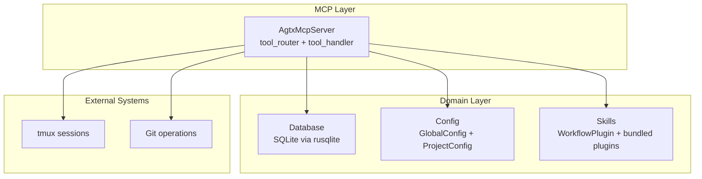
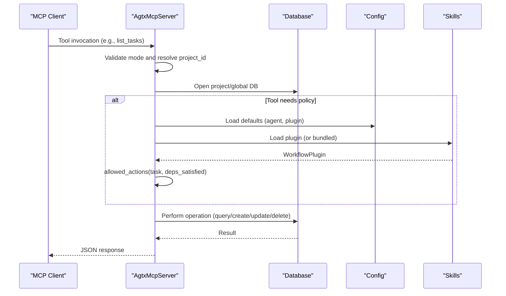
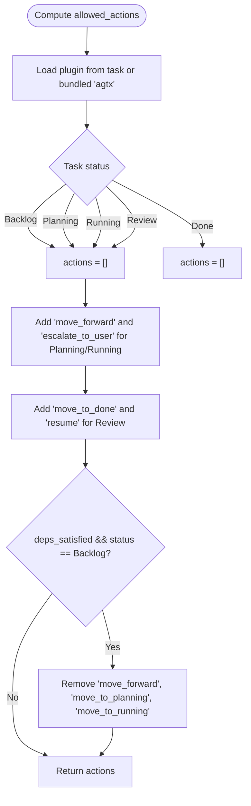
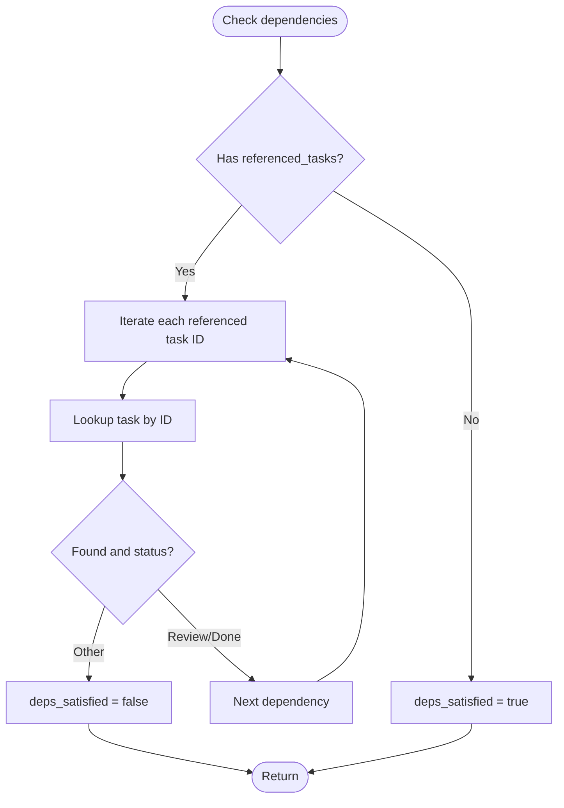
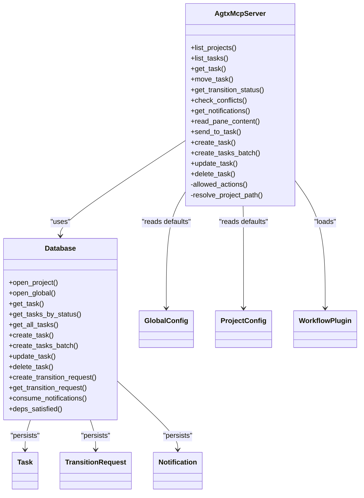

# MCP Tools and Endpoints

<cite>
**Referenced Files in This Document**
- [server.rs](file://src/mcp/server.rs)
- [models.rs](file://src/db/models.rs)
- [schema.rs](file://src/db/schema.rs)
- [mod.rs](file://src/config/mod.rs)
- [mod.rs](file://src/skills.rs)
- [plugin.toml](file://plugins/agtx/plugin.toml)
</cite>

## Table of Contents
1. [Introduction](#introduction)
2. [Project Structure](#project-structure)
3. [Core Components](#core-components)
4. [Architecture Overview](#architecture-overview)
5. [Detailed Component Analysis](#detailed-component-analysis)
6. [Dependency Analysis](#dependency-analysis)
7. [Performance Considerations](#performance-considerations)
8. [Troubleshooting Guide](#troubleshooting-guide)
9. [Conclusion](#conclusion)

## Introduction
This document describes the MCP tools and endpoints exposed by AGTX for task management and project operations. It covers the complete tool catalog, parameter specifications, response schemas, validation rules, and integration workflows. It also explains allowed_actions computation, dependency validation, and provides troubleshooting guidance for common issues.

## Project Structure
AGTX exposes an MCP server that implements a set of tools for managing tasks and projects. The server operates in two modes:
- Global mode: Serves all projects indexed in the global database; requires project_id for most tools.
- Project mode: Bound to a single project path; project_id is not required.

**Diagram sources**
- [server.rs:395-519](file://src/mcp/server.rs#L395-L519)
- [schema.rs:1-656](file://src/db/schema.rs#L1-L656)
- [mod.rs:410-595](file://src/config/mod.rs#L410-L595)
- [mod.rs:14-29](file://src/skills.rs#L14-L29)

**Section sources**
- [server.rs:16-24](file://src/mcp/server.rs#L16-L24)
- [server.rs:1245-1264](file://src/mcp/server.rs#L1245-L1264)

## Core Components
- AgtxMcpServer: Implements the MCP tool router and handler. Provides all task/project tools and manages server mode.
- Database: Centralized SQLite-backed persistence for tasks, projects, transition requests, and notifications.
- Models: Strongly typed data structures for tasks, statuses, transition requests, and notifications.
- Config: Global and project-level configuration including default agents, workflow plugins, and worktree settings.
- Skills: Workflow plugin definitions and bundled plugins used to compute allowed_actions.

Key responsibilities:
- Parameter parsing and validation
- Project resolution (global vs project mode)
- Persistence operations (tasks, transitions, notifications)
- Allowed actions computation based on task status and plugin rules
- Integration with tmux and Git for runtime operations

**Section sources**
- [server.rs:395-519](file://src/mcp/server.rs#L395-L519)
- [models.rs:5-133](file://src/db/models.rs#L5-L133)
- [schema.rs:1-656](file://src/db/schema.rs#L1-L656)
- [mod.rs:410-595](file://src/config/mod.rs#L410-L595)
- [mod.rs:14-29](file://src/skills.rs#L14-L29)

## Architecture Overview
The MCP server exposes tools that operate against a project-scoped or global database. Tools delegate to the Database for persistence and to Config/Skills for policy and allowed_actions computation. Some tools integrate with tmux and Git for live agent interaction and conflict detection.

**Diagram sources**
- [server.rs:401-471](file://src/mcp/server.rs#L401-L471)
- [schema.rs:210-401](file://src/db/schema.rs#L210-L401)
- [mod.rs:410-595](file://src/config/mod.rs#L410-L595)
- [mod.rs:24-29](file://src/skills.rs#L24-L29)

## Detailed Component Analysis

### Tool Catalog and Specifications

#### list_projects
- Description: List all projects indexed by AGTX.
- Mode: Global only.
- Parameters: None.
- Response: Array of ProjectSummary objects.
- Validation: None required.
- Notes: Use this first to discover project_id for subsequent tools in global mode.

Response schema (ProjectSummary):
- id: string
- name: string
- path: string

**Section sources**
- [server.rs:523-543](file://src/mcp/server.rs#L523-L543)
- [server.rs:246-251](file://src/mcp/server.rs#L246-L251)

#### list_tasks
- Description: List tasks for a project, optionally filtered by status.
- Mode: Global or Project.
- Parameters:
  - status: string (optional) — backlog, planning, running, review, done
  - project_id: string (required in Global mode)
- Validation:
  - status must be one of the allowed values; invalid value returns an error.
- Response: Array of TaskSummary objects.
- Notes: In Global mode, pass project_id obtained from list_projects.

Response schema (TaskSummary):
- id: string
- title: string
- description: string?
- status: string
- agent: string
- branch_name: string?
- pr_url: string?
- plugin: string?
- referenced_tasks: string?
- base_branch: string?
- deps_satisfied: boolean

**Section sources**
- [server.rs:545-588](file://src/mcp/server.rs#L545-L588)
- [server.rs:31-41](file://src/mcp/server.rs#L31-L41)
- [server.rs:253-266](file://src/mcp/server.rs#L253-L266)
- [models.rs:36-45](file://src/db/models.rs#L36-L45)

#### get_task
- Description: Get full details of a specific task, including allowed_actions and blocking tasks.
- Mode: Global or Project.
- Parameters:
  - task_id: string (UUID)
  - project_id: string (required in Global mode)
- Validation: task_id must exist; invalid task_id returns an error.
- Response: TaskDetail object.

Response schema (TaskDetail):
- id: string
- title: string
- description: string?
- status: string
- agent: string
- project_id: string
- session_name: string?
- worktree_path: string?
- branch_name: string?
- pr_number: integer?
- pr_url: string?
- plugin: string?
- cycle: integer
- referenced_tasks: string?
- base_branch: string?
- escalation_note: string?
- created_at: string (RFC3339)
- updated_at: string (RFC3339)
- deps_satisfied: boolean
- blocking_tasks: array of BlockingTask
- allowed_actions: array of string

Nested schema (BlockingTask):
- id: string
- title: string
- status: string

Allowed actions computation:
- Depends on task status and plugin rules.
- Backlog: no orchestrator-managed actions.
- Planning/Running: move_forward, escalate_to_user.
- Review: move_to_done, resume.
- Forward transitions from Backlog are blocked until dependencies are satisfied.

**Section sources**
- [server.rs:590-653](file://src/mcp/server.rs#L590-L653)
- [server.rs:473-518](file://src/mcp/server.rs#L473-L518)
- [server.rs:268-294](file://src/mcp/server.rs#L268-L294)
- [server.rs:296-301](file://src/mcp/server.rs#L296-L301)
- [models.rs:5-56](file://src/db/models.rs#L5-L56)

#### move_task
- Description: Queue a task state transition. Use get_transition_status to check completion.
- Mode: Global or Project.
- Parameters:
  - task_id: string (UUID)
  - action: string — research, move_forward, move_to_planning, move_to_running, move_to_review, move_to_done, resume, escalate_to_user
  - reason: string? (used with escalate_to_user)
  - project_id: string (required in Global mode)
- Validation:
  - action must be one of the allowed values.
  - task must exist.
  - Forward transitions from Backlog are blocked if dependencies are not satisfied.
- Response: MoveTaskResult.

Response schema (MoveTaskResult):
- request_id: string
- message: string

Notes:
- The server writes a TransitionRequest to the database; the TUI processes it asynchronously.
- Use get_transition_status to poll for completion.

**Section sources**
- [server.rs:655-721](file://src/mcp/server.rs#L655-L721)
- [server.rs:55-73](file://src/mcp/server.rs#L55-L73)
- [server.rs:304-307](file://src/mcp/server.rs#L304-L307)
- [schema.rs:478-554](file://src/db/schema.rs#L478-L554)

#### get_transition_status
- Description: Check the status of a queued transition request.
- Mode: Global or Project.
- Parameters:
  - request_id: string
  - project_id: string (required in Global mode)
- Response: TransitionStatusResult.

Response schema (TransitionStatusResult):
- request_id: string
- status: string — pending, completed, error
- error: string? (present when status is error)

**Section sources**
- [server.rs:723-755](file://src/mcp/server.rs#L723-L755)
- [server.rs:75-85](file://src/mcp/server.rs#L75-L85)
- [server.rs:310-314](file://src/mcp/server.rs#L310-L314)

#### check_conflicts
- Description: Check if task branches have merge conflicts with the main branch. Optionally limit to a single task or check all Review tasks.
- Mode: Global or Project.
- Parameters:
  - task_id: string? (optional)
  - project_id: string (required in Global mode)
- Response: CheckConflictsResponse.

Response schema (CheckConflictsResponse):
- main_branch: string
- results: array of ConflictCheckResult

Nested schema (ConflictCheckResult):
- task_id: string
- title: string
- branch_name: string?
- has_conflicts: boolean
- conflicting_files: array of string
- error: string? (present on failure to check)

Notes:
- Uses a read-only Git check; no files are modified.
- If a task has no branch_name, returns an error in the result.

**Section sources**
- [server.rs:757-832](file://src/mcp/server.rs#L757-L832)
- [server.rs:87-97](file://src/mcp/server.rs#L87-L97)
- [server.rs:316-330](file://src/mcp/server.rs#L316-L330)

#### get_notifications
- Description: Fetch and consume pending notifications. Returns new events and removes them from the queue.
- Mode: Global or Project.
- Parameters:
  - project_id: string (required in Global mode)
- Response: GetNotificationsResponse.

Response schema (GetNotificationsResponse):
- notifications: array of NotificationItem

Nested schema (NotificationItem):
- message: string
- created_at: string (RFC3339)

**Section sources**
- [server.rs:834-858](file://src/mcp/server.rs#L834-L858)
- [server.rs:99-106](file://src/mcp/server.rs#L99-L106)
- [server.rs:338-341](file://src/mcp/server.rs#L338-L341)
- [schema.rs:596-654](file://src/db/schema.rs#L596-L654)

#### read_pane_content
- Description: Read the last N lines of a task’s agent tmux pane.
- Mode: Global or Project.
- Parameters:
  - task_id: string (UUID)
  - lines: integer? (default 50)
  - project_id: string (required in Global mode)
- Response: ReadPaneResponse.

Response schema (ReadPaneResponse):
- task_id: string
- session_name: string
- content: string
- lines_requested: integer

**Section sources**
- [server.rs:860-910](file://src/mcp/server.rs#L860-L910)
- [server.rs:108-121](file://src/mcp/server.rs#L108-L121)
- [server.rs:343-349](file://src/mcp/server.rs#L343-L349)

#### send_to_task
- Description: Send a message to a task’s agent pane (followed by Enter). Only works for Planning or Running tasks.
- Mode: Global or Project.
- Parameters:
  - task_id: string (UUID)
  - message: string
  - project_id: string (required in Global mode)
- Response: SendToTaskResponse.

Response schema (SendToTaskResponse):
- task_id: string
- session_name: string
- success: boolean
- message: string

Validation:
- Task must be in Planning or Running status.
- Task must have an active session.

**Section sources**
- [server.rs:912-974](file://src/mcp/server.rs#L912-L974)
- [server.rs:123-136](file://src/mcp/server.rs#L123-L136)
- [server.rs:351-357](file://src/mcp/server.rs#L351-L357)

#### create_task
- Description: Create a new task in Backlog. Use create_tasks_batch for multiple tasks with dependencies.
- Mode: Global or Project.
- Parameters:
  - title: string
  - description: string? (optional)
  - plugin: string? (optional) — workflow plugin name
  - referenced_tasks: string? (optional) — comma-separated task IDs
  - base_branch: string? (optional) — defaults to project main branch
  - project_id: string (required in Global mode)
- Validation:
  - referenced_tasks must reference existing tasks.
  - Defaults are resolved from merged config (project overrides global).
- Response: CreateTaskResponse.

Response schema (CreateTaskResponse):
- id: string
- title: string
- status: string

**Section sources**
- [server.rs:976-1018](file://src/mcp/server.rs#L976-L1018)
- [server.rs:138-164](file://src/mcp/server.rs#L138-L164)
- [server.rs:359-364](file://src/mcp/server.rs#L359-L364)
- [schema.rs:212-240](file://src/db/schema.rs#L212-L240)

#### create_tasks_batch
- Description: Create multiple tasks at once with index-based dependency wiring.
- Mode: Global or Project.
- Parameters:
  - tasks: array of BatchTask
  - project_id: string (required in Global mode)
- Validation:
  - tasks array length ≤ 50.
  - depends_on indices must be less than the current task index (no forward references) and must not repeat.
  - All referenced tasks must exist (resolved after creation).
- Response: CreateTasksBatchResponse.

Response schema (CreateTasksBatchResponse):
- created: array of BatchTaskResponse
- count: integer

Nested schema (BatchTaskResponse):
- index: integer
- id: string
- title: string

**Section sources**
- [server.rs:1020-1106](file://src/mcp/server.rs#L1020-L1106)
- [server.rs:166-199](file://src/mcp/server.rs#L166-L199)
- [server.rs:367-377](file://src/mcp/server.rs#L367-L377)

#### update_task
- Description: Update a Backlog task’s fields. Only provided fields are changed.
- Mode: Global or Project.
- Parameters:
  - task_id: string (UUID)
  - title: string? (optional)
  - description: string? (optional)
  - plugin: string? (optional)
  - referenced_tasks: string? (optional) — comma-separated task IDs
  - base_branch: string? (optional)
  - project_id: string (required in Global mode)
- Validation:
  - Task must be in Backlog status.
  - referenced_tasks must reference existing tasks.
- Response: UpdateTaskResponse.

Response schema (UpdateTaskResponse):
- id: string
- title: string
- updated_fields: array of string

**Section sources**
- [server.rs:1108-1178](file://src/mcp/server.rs#L1108-L1178)
- [server.rs:201-230](file://src/mcp/server.rs#L201-L230)
- [server.rs:379-384](file://src/mcp/server.rs#L379-L384)

#### delete_task
- Description: Delete a Backlog task.
- Mode: Global or Project.
- Parameters:
  - task_id: string (UUID)
  - project_id: string (required in Global mode)
- Validation:
  - Task must be in Backlog status.
- Response: DeleteTaskResponse.

Response schema (DeleteTaskResponse):
- id: string
- title: string
- message: string

**Section sources**
- [server.rs:1180-1215](file://src/mcp/server.rs#L1180-L1215)
- [server.rs:232-242](file://src/mcp/server.rs#L232-L242)
- [server.rs:386-391](file://src/mcp/server.rs#L386-L391)

### Allowed Actions Computation
Allowed actions are computed based on the task’s current status and the active workflow plugin. The server resolves the plugin from either the task’s plugin setting or falls back to the bundled “agtx” plugin. The computation follows:

- Planning/Running: move_forward, escalate_to_user
- Review: move_to_done, resume
- Backlog: no orchestrator-managed actions; however, forward transitions are blocked if dependencies are not satisfied

Dependency validation:
- deps_satisfied checks if all referenced_tasks are in Review or Done.
- If dependencies are unsatisfied, forward transitions from Backlog are removed from allowed_actions.

**Diagram sources**
- [server.rs:473-518](file://src/mcp/server.rs#L473-L518)
- [schema.rs:387-400](file://src/db/schema.rs#L387-L400)

**Section sources**
- [server.rs:473-518](file://src/mcp/server.rs#L473-L518)
- [schema.rs:387-400](file://src/db/schema.rs#L387-L400)

### Dependency Validation Logic
Dependency validation ensures tasks cannot advance prematurely when prerequisites are incomplete. The logic:

- Collects referenced_tasks from the task’s referenced_tasks field.
- For each referenced task, checks if it is in Review or Done.
- If any dependency is not satisfied, the task is considered blocked.

**Diagram sources**
- [schema.rs:387-400](file://src/db/schema.rs#L387-L400)

**Section sources**
- [schema.rs:387-400](file://src/db/schema.rs#L387-L400)

### Practical Usage Examples

- Global mode workflow:
  - Step 1: list_projects to discover project_id
  - Step 2: list_tasks(project_id=...) to enumerate tasks
  - Step 3: get_task(task_id, project_id=...) to inspect allowed_actions and dependencies
  - Step 4: move_task(task_id, action, project_id=...) to queue a transition
  - Step 5: get_transition_status(request_id, project_id=...) to poll completion
  - Step 6: read_pane_content(task_id, project_id=...) to debug stuck agents
  - Step 7: send_to_task(task_id, message, project_id=...) to nudge agents

- Project mode workflow:
  - Skip list_projects; pass project_id=None to resolve_project_path internally.

- Batch creation:
  - Use create_tasks_batch with depends_on indices to wire dependencies; indices must be less than the current task index and unique.

**Section sources**
- [server.rs:1218-1243](file://src/mcp/server.rs#L1218-L1243)
- [server.rs:1020-1106](file://src/mcp/server.rs#L1020-L1106)

## Dependency Analysis
- AgtxMcpServer depends on:
  - Database for persistence
  - Config for defaults and plugin loading
  - Skills for allowed_actions computation
  - External systems for tmux and Git integration
- Database schema supports:
  - Tasks table with status, metadata, and dependencies
  - TransitionRequests queue for async processing
  - Notifications queue for pull-based events
  - Projects table for global indexing

**Diagram sources**
- [server.rs:395-519](file://src/mcp/server.rs#L395-L519)
- [schema.rs:1-656](file://src/db/schema.rs#L1-L656)
- [models.rs:58-231](file://src/db/models.rs#L58-L231)
- [mod.rs:410-595](file://src/config/mod.rs#L410-L595)
- [mod.rs:14-29](file://src/skills.rs#L14-L29)

**Section sources**
- [server.rs:395-519](file://src/mcp/server.rs#L395-L519)
- [schema.rs:1-656](file://src/db/schema.rs#L1-L656)
- [models.rs:58-231](file://src/db/models.rs#L58-L231)
- [mod.rs:410-595](file://src/config/mod.rs#L410-L595)
- [mod.rs:14-29](file://src/skills.rs#L14-L29)

## Performance Considerations
- Database queries:
  - Tasks are indexed by status and project_id; filtering by status leverages indexes.
  - Batch operations (create_tasks_batch) use transactions to minimize overhead.
- JSON serialization:
  - Responses are serialized to pretty-printed JSON; consider client-side streaming if needed.
- External integrations:
  - tmux capture-pane and send-keys are synchronous; long-running panes may increase latency.
  - Git conflict checks are read-only and fast.

[No sources needed since this section provides general guidance]

## Troubleshooting Guide
Common issues and resolutions:

- project_id missing in Global mode:
  - Symptom: Error indicating project_id is required.
  - Fix: Call list_projects first, then pass project_id to all tools.

- Invalid status filter:
  - Symptom: Error mentioning invalid status value.
  - Fix: Use one of backlog, planning, running, review, done.

- Task not found:
  - Symptom: Error indicating task not found.
  - Fix: Verify task_id UUID and project_id.

- Cannot advance task from Backlog:
  - Symptom: Error stating dependencies not satisfied.
  - Fix: Use get_task to see blocking_tasks and ensure referenced tasks reach Review/Done.

- Escalation reason required:
  - Symptom: Error about invalid action.
  - Fix: Provide reason when using escalate_to_user.

- Task not in an active phase for send_to_task:
  - Symptom: Error stating task is not in Planning or Running.
  - Fix: Only send messages to Planning or Running tasks.

- No active session for read/send:
  - Symptom: Error indicating no active session.
  - Fix: Ensure the task has spawned an agent session.

- Conflict check failures:
  - Symptom: Error in ConflictCheckResult.
  - Fix: Ensure the task has a branch_name set.

**Section sources**
- [server.rs:409-429](file://src/mcp/server.rs#L409-L429)
- [server.rs:548-555](file://src/mcp/server.rs#L548-L555)
- [server.rs:658-675](file://src/mcp/server.rs#L658-L675)
- [server.rs:686-698](file://src/mcp/server.rs#L686-L698)
- [server.rs:915-933](file://src/mcp/server.rs#L915-L933)
- [server.rs:863-878](file://src/mcp/server.rs#L863-L878)
- [server.rs:804-822](file://src/mcp/server.rs#L804-L822)

## Conclusion
AGTX’s MCP tools provide a comprehensive interface for managing tasks and projects across multiple agents and workflows. The server enforces strict validation, computes allowed actions based on status and plugin rules, and integrates with tmux and Git for live agent control and conflict detection. Use list_projects first in Global mode, validate dependencies before advancing tasks, and leverage get_transition_status for asynchronous operations.