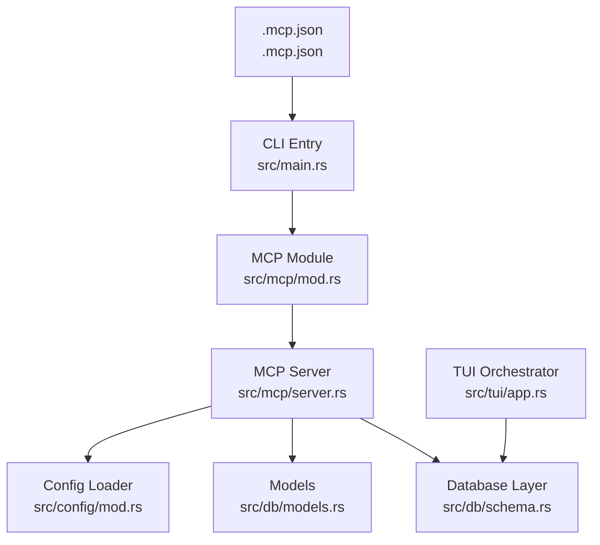
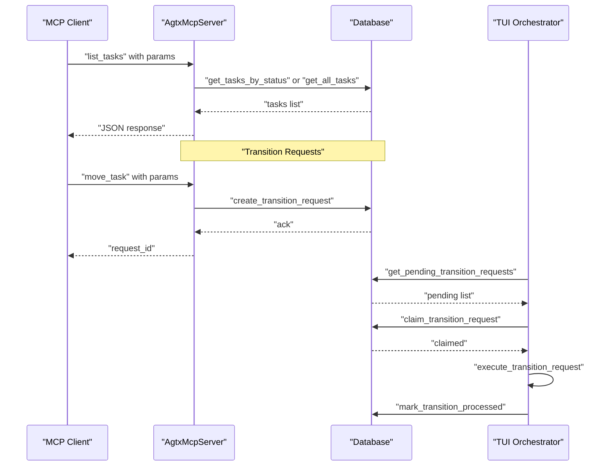
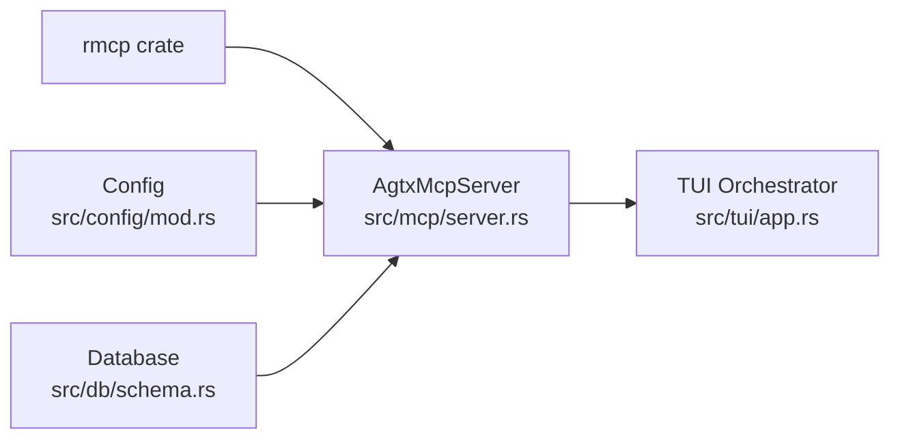

# MCP Troubleshooting and Debugging

<cite>
**Referenced Files in This Document**
- [server.rs](file://src/mcp/server.rs)
- [main.rs](file://src/main.rs)
- [mod.rs](file://src/mcp/mod.rs)
- [.mcp.json](file://.mcp.json)
- [app.rs](file://src/tui/app.rs)
- [models.rs](file://src/db/models.rs)
- [schema.rs](file://src/db/schema.rs)
- [mod.rs](file://src/config/mod.rs)
- [mcp_tests.rs](file://tests/mcp_tests.rs)
</cite>

## Table of Contents
1. [Introduction](#introduction)
2. [Project Structure](#project-structure)
3. [Core Components](#core-components)
4. [Architecture Overview](#architecture-overview)
5. [Detailed Component Analysis](#detailed-component-analysis)
6. [Dependency Analysis](#dependency-analysis)
7. [Performance Considerations](#performance-considerations)
8. [Troubleshooting Guide](#troubleshooting-guide)
9. [Conclusion](#conclusion)

## Introduction
This document provides comprehensive troubleshooting guidance for MCP (Model Context Protocol) server issues in the agtx project. It focuses on diagnosing and resolving common problems including connectivity and transport layer issues, permission and database access problems, protocol compliance and parameter validation failures, response serialization issues, server binding and project resolution failures, and agent integration challenges. It also covers logging strategies, diagnostic commands, monitoring approaches, and performance tuning for high-load scenarios.

## Project Structure
The MCP server is implemented as a modular component within the agtx application. Key elements include:
- MCP server entry and routing logic
- Database-backed task and project management
- Configuration loading for global and project-specific settings
- TUI-driven task transition processing
- Test coverage for MCP-related workflows

**Diagram sources**
- [main.rs:30-46](file://src/main.rs#L30-L46)
- [mod.rs:1-5](file://src/mcp/mod.rs#L1-L5)
- [server.rs:1245-1263](file://src/mcp/server.rs#L1245-L1263)
- [schema.rs:12-67](file://src/db/schema.rs#L12-L67)
- [models.rs:58-184](file://src/db/models.rs#L58-L184)
- [mod.rs:230-274](file://src/config/mod.rs#L230-L274)
- [app.rs:5649-5680](file://src/tui/app.rs#L5649-L5680)
- [.mcp.json:1-7](file://.mcp.json#L1-L7)

**Section sources**
- [main.rs:30-46](file://src/main.rs#L30-L46)
- [mod.rs:1-5](file://src/mcp/mod.rs#L1-L5)
- [server.rs:1245-1263](file://src/mcp/server.rs#L1245-L1263)
- [schema.rs:12-67](file://src/db/schema.rs#L12-L67)
- [models.rs:58-184](file://src/db/models.rs#L58-L184)
- [mod.rs:230-274](file://src/config/mod.rs#L230-L274)
- [app.rs:5649-5680](file://src/tui/app.rs#L5649-L5680)
- [.mcp.json:1-7](file://.mcp.json#L1-L7)

## Core Components
- MCP Server Mode: Supports either Project-scoped or Global mode. Project mode binds to a fixed project path; Global mode requires a project_id parameter for all CRUD tools.
- Tool Router: Defines MCP tools for project/task management, conflict checking, notifications, pane reading, and task messaging.
- Database Access: Provides project/global databases, task/project CRUD, transition request queuing, and notification handling.
- Configuration Resolution: Merges global and project configurations to determine defaults for agent and workflow plugin.
- TUI Integration: Processes queued transition requests and executes side effects (worktree creation, agent spawning, etc.).

Key implementation references:
- Server mode and tool router: [server.rs:16-24](file://src/mcp/server.rs#L16-L24), [server.rs:521-1216](file://src/mcp/server.rs#L521-L1216)
- Project resolution and DB opening: [server.rs:409-444](file://src/mcp/server.rs#L409-L444)
- Transition request processing: [app.rs:5649-5680](file://src/tui/app.rs#L5649-L5680)
- Database initialization and migrations: [schema.rs:97-208](file://src/db/schema.rs#L97-L208)
- Models for tasks and transitions: [models.rs:58-184](file://src/db/models.rs#L58-L184)

**Section sources**
- [server.rs:16-24](file://src/mcp/server.rs#L16-L24)
- [server.rs:521-1216](file://src/mcp/server.rs#L521-L1216)
- [server.rs:409-444](file://src/mcp/server.rs#L409-L444)
- [app.rs:5649-5680](file://src/tui/app.rs#L5649-L5680)
- [schema.rs:97-208](file://src/db/schema.rs#L97-L208)
- [models.rs:58-184](file://src/db/models.rs#L58-L184)

## Architecture Overview
The MCP server exposes tools over stdio transport. Clients call tools with validated parameters; the server resolves project context, accesses the appropriate database, performs operations, and returns JSON responses. The TUI periodically processes queued transition requests to apply side effects.

**Diagram sources**
- [server.rs:548-588](file://src/mcp/server.rs#L548-L588)
- [server.rs:658-721](file://src/mcp/server.rs#L658-L721)
- [server.rs:480-532](file://src/mcp/server.rs#L480-L532)
- [app.rs:5649-5680](file://src/tui/app.rs#L5649-L5680)
- [schema.rs:511-543](file://src/db/schema.rs#L511-L543)

**Section sources**
- [server.rs:548-588](file://src/mcp/server.rs#L548-L588)
- [server.rs:658-721](file://src/mcp/server.rs#L658-L721)
- [server.rs:480-532](file://src/mcp/server.rs#L480-L532)
- [app.rs:5649-5680](file://src/tui/app.rs#L5649-L5680)
- [schema.rs:511-543](file://src/db/schema.rs#L511-L543)

## Detailed Component Analysis

### MCP Server Startup and Binding
Common startup issues include invalid project path, missing git repository, and inability to open databases in Project vs Global modes.

- Validation and mode selection:
  - Project mode requires a valid git repository path; Global mode validates access to the global index database.
  - References: [main.rs:30-46](file://src/main.rs#L30-L46), [server.rs:1245-1263](file://src/mcp/server.rs#L1245-L1263)

- Transport binding:
  - The server uses stdio transport and waits for client connections.
  - Reference: [server.rs:1260-1262](file://src/mcp/server.rs#L1260-L1262)

- Configuration registration:
  - The MCP server is registered via .mcp.json with stdio transport and command args.
  - Reference: [.mcp.json:1-7](file://.mcp.json#L1-L7)

**Section sources**
- [main.rs:30-46](file://src/main.rs#L30-L46)
- [server.rs:1245-1263](file://src/mcp/server.rs#L1245-L1263)
- [server.rs:1260-1262](file://src/mcp/server.rs#L1260-L1262)
- [.mcp.json:1-7](file://.mcp.json#L1-L7)

### Project Resolution Failures
In Global mode, tools require a project_id. Resolution failures occur when:
- project_id is missing
- Global database cannot be opened
- Project not found by ID

Resolution logic and error handling:
- [server.rs:413-429](file://src/mcp/server.rs#L413-L429)

**Section sources**
- [server.rs:413-429](file://src/mcp/server.rs#L413-L429)

### Database Access Problems
Database initialization and migrations:
- Project database: [schema.rs:12-38](file://src/db/schema.rs#L12-L38)
- Global database: [schema.rs:50-67](file://src/db/schema.rs#L50-L67)
- Schema migrations and indexes: [schema.rs:97-208](file://src/db/schema.rs#L97-L208)

Task and transition request operations:
- Task CRUD: [schema.rs:212-323](file://src/db/schema.rs#L212-L323)
- Batch task creation: [schema.rs:242-274](file://src/db/schema.rs#L242-L274)
- Transition requests: [schema.rs:480-554](file://src/db/schema.rs#L480-L554)

Models:
- Task and TransitionRequest structures: [models.rs:58-184](file://src/db/models.rs#L58-L184)

**Section sources**
- [schema.rs:12-38](file://src/db/schema.rs#L12-L38)
- [schema.rs:50-67](file://src/db/schema.rs#L50-L67)
- [schema.rs:97-208](file://src/db/schema.rs#L97-L208)
- [schema.rs:212-323](file://src/db/schema.rs#L212-L323)
- [schema.rs:242-274](file://src/db/schema.rs#L242-L274)
- [schema.rs:480-554](file://src/db/schema.rs#L480-L554)
- [models.rs:58-184](file://src/db/models.rs#L58-L184)

### Tool Invocation Errors and Parameter Validation
Validation failures commonly occur in:
- Status filtering for list_tasks
- Allowed actions for move_task
- Dependency satisfaction for Backlog transitions
- Task existence and status checks for updates/deletions
- Batch task dependency indices

References:
- Status validation: [server.rs:551-555](file://src/mcp/server.rs#L551-L555)
- Action validation: [server.rs:659-675](file://src/mcp/server.rs#L659-L675)
- Dependency gating: [server.rs:686-698](file://src/mcp/server.rs#L686-L698)
- Task existence and status checks: [server.rs:677-720](file://src/mcp/server.rs#L677-L720), [server.rs:1117-1129](file://src/mcp/server.rs#L1117-L1129)
- Batch dependency validation: [server.rs:1034-1053](file://src/mcp/server.rs#L1034-L1053)

**Section sources**
- [server.rs:551-555](file://src/mcp/server.rs#L551-L555)
- [server.rs:659-675](file://src/mcp/server.rs#L659-L675)
- [server.rs:686-698](file://src/mcp/server.rs#L686-L698)
- [server.rs:677-720](file://src/mcp/server.rs#L677-L720)
- [server.rs:1117-1129](file://src/mcp/server.rs#L1117-L1129)
- [server.rs:1034-1053](file://src/mcp/server.rs#L1034-L1053)

### Response Serialization Issues
Tools return JSON responses serialized via serde_json. Serialization errors are handled gracefully by returning formatted error strings.

References:
- Serialization in tools: [server.rs:536-542](file://src/mcp/server.rs#L536-L542), [server.rs:645-652](file://src/mcp/server.rs#L645-L652), [server.rs:713-720](file://src/mcp/server.rs#L713-L720), [server.rs:830-832](file://src/mcp/server.rs#L830-L832), [server.rs:905-910](file://src/mcp/server.rs#L905-L910), [server.rs:970-974](file://src/mcp/server.rs#L970-L974), [server.rs:1013-1018](file://src/mcp/server.rs#L1013-L1018), [server.rs:1104-1106](file://src/mcp/server.rs#L1104-L1106), [server.rs:1173-1178](file://src/mcp/server.rs#L1173-L1178), [server.rs:1210-1215](file://src/mcp/server.rs#L1210-L1215)

**Section sources**
- [server.rs:536-542](file://src/mcp/server.rs#L536-L542)
- [server.rs:645-652](file://src/mcp/server.rs#L645-L652)
- [server.rs:713-720](file://src/mcp/server.rs#L713-L720)
- [server.rs:830-832](file://src/mcp/server.rs#L830-L832)
- [server.rs:905-910](file://src/mcp/server.rs#L905-L910)
- [server.rs:970-974](file://src/mcp/server.rs#L970-L974)
- [server.rs:1013-1018](file://src/mcp/server.rs#L1013-L1018)
- [server.rs:1104-1106](file://src/mcp/server.rs#L1104-L1106)
- [server.rs:1173-1178](file://src/mcp/server.rs#L1173-L1178)
- [server.rs:1210-1215](file://src/mcp/server.rs#L1210-L1215)

### Agent Integration and Cross-System Communication
Agent integration involves tmux sessions and external commands. Issues often arise from:
- tmux session capture/send failures
- Missing or inactive task sessions
- Non-active task phases for messaging

References:
- Pane content capture: [server.rs:883-909](file://src/mcp/server.rs#L883-L909)
- Sending messages to task panes: [server.rs:941-974](file://src/mcp/server.rs#L941-L974)
- Task session name generation: [models.rs:119-132](file://src/db/models.rs#L119-L132)

**Section sources**
- [server.rs:883-909](file://src/mcp/server.rs#L883-L909)
- [server.rs:941-974](file://src/mcp/server.rs#L941-L974)
- [models.rs:119-132](file://src/db/models.rs#L119-L132)

## Dependency Analysis
The MCP server depends on:
- rmcp for MCP protocol handling and transport
- Database layer for persistence
- Configuration layer for defaults
- TUI for transition request processing

**Diagram sources**
- [server.rs:4-11](file://src/mcp/server.rs#L4-L11)
- [server.rs:13-14](file://src/mcp/server.rs#L13-L14)
- [schema.rs:12-67](file://src/db/schema.rs#L12-L67)
- [mod.rs:230-274](file://src/config/mod.rs#L230-L274)
- [app.rs:5649-5680](file://src/tui/app.rs#L5649-L5680)

**Section sources**
- [server.rs:4-11](file://src/mcp/server.rs#L4-L11)
- [server.rs:13-14](file://src/mcp/server.rs#L13-L14)
- [schema.rs:12-67](file://src/db/schema.rs#L12-L67)
- [mod.rs:230-274](file://src/config/mod.rs#L230-L274)
- [app.rs:5649-5680](file://src/tui/app.rs#L5649-L5680)

## Performance Considerations
- Database indexing: Ensure indexes exist on frequently queried columns (e.g., tasks status, project_id).
  - Reference: [schema.rs:117-118](file://src/db/schema.rs#L117-L118), [schema.rs](file://src/db/schema.rs#L204)
- Batch operations: Use batch task creation to minimize transaction overhead.
  - Reference: [schema.rs:242-274](file://src/db/schema.rs#L242-L274)
- Transition request cleanup: Periodic cleanup prevents accumulation of processed requests.
  - Reference: [schema.rs:545-554](file://src/db/schema.rs#L545-L554)
- Concurrency: Transition request claiming uses atomic updates to prevent contention.
  - Reference: [schema.rs:535-543](file://src/db/schema.rs#L535-L543)
- Logging: Add structured logs around tool invocations and database operations for profiling.

[No sources needed since this section provides general guidance]

## Troubleshooting Guide

### MCP Connectivity and Transport Issues
Symptoms:
- Server fails to start or immediately exits
- Client reports connection timeout or transport errors

Checklist:
- Confirm MCP registration in .mcp.json uses stdio transport and correct command args.
  - Reference: [.mcp.json:1-7](file://.mcp.json#L1-L7)
- Verify the binary path and args are correct and executable.
- Ensure the server runs in the intended mode (Project vs Global) and the path is a valid git repository when using Project mode.
  - Reference: [main.rs:30-46](file://src/main.rs#L30-L46)
- Validate stdio transport availability and permissions.
  - Reference: [server.rs:1260-1262](file://src/mcp/server.rs#L1260-L1262)

Resolution steps:
- Run the server with verbose logging (add logging statements around startup).
- Test stdio transport by piping echo to the server process.
- Confirm the client is invoking the correct MCP tool and parameters.

**Section sources**
- [.mcp.json:1-7](file://.mcp.json#L1-L7)
- [main.rs:30-46](file://src/main.rs#L30-L46)
- [server.rs:1260-1262](file://src/mcp/server.rs#L1260-L1262)

### Permission and Database Access Problems
Symptoms:
- "Failed to open global database" or "Failed to open project database"
- SQLite errors when creating/updating records

Checklist:
- Verify the config directory exists and is writable.
  - Reference: [schema.rs:22-30](file://src/db/schema.rs#L22-L30), [schema.rs:56-59](file://src/db/schema.rs#L56-L59)
- Ensure the database files can be created/updated.
- Check that the project path hash resolves correctly for Project mode.
  - Reference: [schema.rs:41-48](file://src/db/schema.rs#L41-L48)
- Confirm the global index database contains the project entry in Global mode.
  - Reference: [schema.rs:404-425](file://src/db/schema.rs#L404-L425)

Resolution steps:
- Create the config directory if missing.
- Run with elevated privileges temporarily to test write access.
- Validate project path and git repository presence for Project mode.
  - Reference: [main.rs:36-42](file://src/main.rs#L36-L42)

**Section sources**
- [schema.rs:22-30](file://src/db/schema.rs#L22-L30)
- [schema.rs:56-59](file://src/db/schema.rs#L56-L59)
- [schema.rs:41-48](file://src/db/schema.rs#L41-L48)
- [schema.rs:404-425](file://src/db/schema.rs#L404-L425)
- [main.rs:36-42](file://src/main.rs#L36-L42)

### Protocol Compliance and Parameter Validation Failures
Symptoms:
- Tool returns "Invalid status" or "Invalid action"
- "project_id is required in global mode" errors
- "Task not found" or "Error checking task" responses

Checklist:
- For list_tasks, ensure status is one of backlog, planning, running, review, done.
  - Reference: [server.rs:551-555](file://src/mcp/server.rs#L551-L555)
- For move_task, ensure action is one of the allowed actions.
  - Reference: [server.rs:659-675](file://src/mcp/server.rs#L659-L675)
- In Global mode, always provide project_id and call list_projects first to discover IDs.
  - Reference: [server.rs:417-419](file://src/mcp/server.rs#L417-L419)
- Validate referenced task IDs exist before creating/updating tasks.
  - Reference: [server.rs:990-998](file://src/mcp/server.rs#L990-L998), [server.rs:1146-1153](file://src/mcp/server.rs#L1146-L1153)

Resolution steps:
- Use list_projects to obtain project_id in Global mode.
- Validate parameters against tool schemas before invoking.
- For dependency-gated Backlog transitions, ensure referenced tasks are in Review/Done.
  - Reference: [server.rs:686-698](file://src/mcp/server.rs#L686-L698)

**Section sources**
- [server.rs:551-555](file://src/mcp/server.rs#L551-L555)
- [server.rs:659-675](file://src/mcp/server.rs#L659-L675)
- [server.rs:417-419](file://src/mcp/server.rs#L417-L419)
- [server.rs:990-998](file://src/mcp/server.rs#L990-L998)
- [server.rs:1146-1153](file://src/mcp/server.rs#L1146-L1153)
- [server.rs:686-698](file://src/mcp/server.rs#L686-L698)

### Response Serialization Problems
Symptoms:
- Tool returns "Error serializing" messages
- Malformed JSON responses

Checklist:
- Inspect serialization paths in tools for panic fallbacks.
  - Reference: [server.rs:536-542](file://src/mcp/server.rs#L536-L542), [server.rs:645-652](file://src/mcp/server.rs#L645-L652), [server.rs:713-720](file://src/mcp/server.rs#L713-L720), [server.rs:830-832](file://src/mcp/server.rs#L830-L832), [server.rs:905-910](file://src/mcp/server.rs#L905-L910), [server.rs:970-974](file://src/mcp/server.rs#L970-L974), [server.rs:1013-1018](file://src/mcp/server.rs#L1013-L1018), [server.rs:1104-1106](file://src/mcp/server.rs#L1104-L1106), [server.rs:1173-1178](file://src/mcp/server.rs#L1173-L1178), [server.rs:1210-1215](file://src/mcp/server.rs#L1210-L1215)

Resolution steps:
- Add structured logging around serialization points.
- Validate response data structures before serialization.
- Ensure all optional fields are handled consistently.

**Section sources**
- [server.rs:536-542](file://src/mcp/server.rs#L536-L542)
- [server.rs:645-652](file://src/mcp/server.rs#L645-L652)
- [server.rs:713-720](file://src/mcp/server.rs#L713-L720)
- [server.rs:830-832](file://src/mcp/server.rs#L830-L832)
- [server.rs:905-910](file://src/mcp/server.rs#L905-L910)
- [server.rs:970-974](file://src/mcp/server.rs#L970-L974)
- [server.rs:1013-1018](file://src/mcp/server.rs#L1013-L1018)
- [server.rs:1104-1106](file://src/mcp/server.rs#L1104-L1106)
- [server.rs:1173-1178](file://src/mcp/server.rs#L1173-L1178)
- [server.rs:1210-1215](file://src/mcp/server.rs#L1210-L1215)

### MCP Server Binding and Project Resolution Failures
Symptoms:
- "mcp-serve requires a git project directory" when using Project mode
- "Project not found" or "Failed to look up project" in Global mode

Checklist:
- For Project mode, ensure the path is canonicalized and is a git repository.
  - Reference: [main.rs:36-42](file://src/main.rs#L36-L42)
- For Global mode, verify the project exists in the global index database.
  - Reference: [server.rs:420-427](file://src/mcp/server.rs#L420-L427)

Resolution steps:
- Canonicalize the project path and confirm git repository status.
- Re-index projects or fix the global database entries.

**Section sources**
- [main.rs:36-42](file://src/main.rs#L36-L42)
- [server.rs:420-427](file://src/mcp/server.rs#L420-L427)

### Agent Integration and Cross-System Communication Issues
Symptoms:
- "Task has no active session" when reading pane or sending messages
- "Error reading pane content" or "Error sending message"
- "send_to_task only works for Planning or Running tasks"

Checklist:
- Verify tmux session exists and is attached.
  - Reference: [server.rs:875-878](file://src/mcp/server.rs#L875-L878), [server.rs:927-933](file://src/mcp/server.rs#L927-L933)
- Confirm task phase is Planning or Running before sending messages.
  - Reference: [server.rs:927-933](file://src/mcp/server.rs#L927-L933)
- Ensure tmux socket name matches the server configuration.
  - Reference: [server.rs:883-894](file://src/mcp/server.rs#L883-L894), [server.rs:941-959](file://src/mcp/server.rs#L941-L959)

Resolution steps:
- Start the task session via the TUI or agent workflow.
- Wait for the task to enter Planning or Running phase.
- Check tmux socket and session name consistency.

**Section sources**
- [server.rs:875-878](file://src/mcp/server.rs#L875-L878)
- [server.rs:927-933](file://src/mcp/server.rs#L927-L933)
- [server.rs:883-894](file://src/mcp/server.rs#L883-L894)
- [server.rs:941-959](file://src/mcp/server.rs#L941-L959)

### Logging Strategies, Diagnostic Commands, and Monitoring
Recommended diagnostics:
- Enable structured logging around tool invocations and database operations.
- Capture stdio traffic for MCP protocol inspection.
- Monitor transition request queue growth and cleanup intervals.
  - Reference: [schema.rs:545-554](file://src/db/schema.rs#L545-L554)
- Use test harness patterns to simulate and validate workflows.
  - Reference: [mcp_tests.rs:5-150](file://tests/mcp_tests.rs#L5-L150)

Diagnostic commands:
- Verify MCP registration: cat .mcp.json
- Test stdio transport: echo '{"method":"agtx.list_projects"}' | agtx mcp-serve
- Inspect database files: ls -la ~/.config/agtx/projects/ and ~/.config/agtx/index.db

Monitoring:
- Track pending transition requests and claim/processing rates.
  - Reference: [schema.rs:511-524](file://src/db/schema.rs#L511-L524), [schema.rs:535-543](file://src/db/schema.rs#L535-L543)

**Section sources**
- [mcp_tests.rs:5-150](file://tests/mcp_tests.rs#L5-L150)
- [schema.rs:545-554](file://src/db/schema.rs#L545-L554)
- [schema.rs:511-524](file://src/db/schema.rs#L511-L524)
- [schema.rs:535-543](file://src/db/schema.rs#L535-L543)
- [.mcp.json:1-7](file://.mcp.json#L1-L7)

### Performance Troubleshooting for High-Load Scenarios
- Optimize queries with proper indexes.
  - Reference: [schema.rs:117-118](file://src/db/schema.rs#L117-L118), [schema.rs](file://src/db/schema.rs#L204)
- Use batch operations for bulk task creation.
  - Reference: [schema.rs:242-274](file://src/db/schema.rs#L242-L274)
- Implement periodic cleanup of old transition requests.
  - Reference: [schema.rs:545-554](file://src/db/schema.rs#L545-L554)
- Reduce contention by ensuring atomic claim/processing.
  - Reference: [schema.rs:535-543](file://src/db/schema.rs#L535-L543)

**Section sources**
- [schema.rs:117-118](file://src/db/schema.rs#L117-L118)
- [schema.rs](file://src/db/schema.rs#L204)
- [schema.rs:242-274](file://src/db/schema.rs#L242-L274)
- [schema.rs:545-554](file://src/db/schema.rs#L545-L554)
- [schema.rs:535-543](file://src/db/schema.rs#L535-L543)

## Conclusion
This guide provides a systematic approach to diagnosing and resolving MCP server issues across connectivity, permissions, database access, protocol compliance, serialization, binding, project resolution, and agent integration. By following the outlined steps, validating parameters, leveraging logging and monitoring, and applying performance best practices, most issues can be quickly identified and resolved.