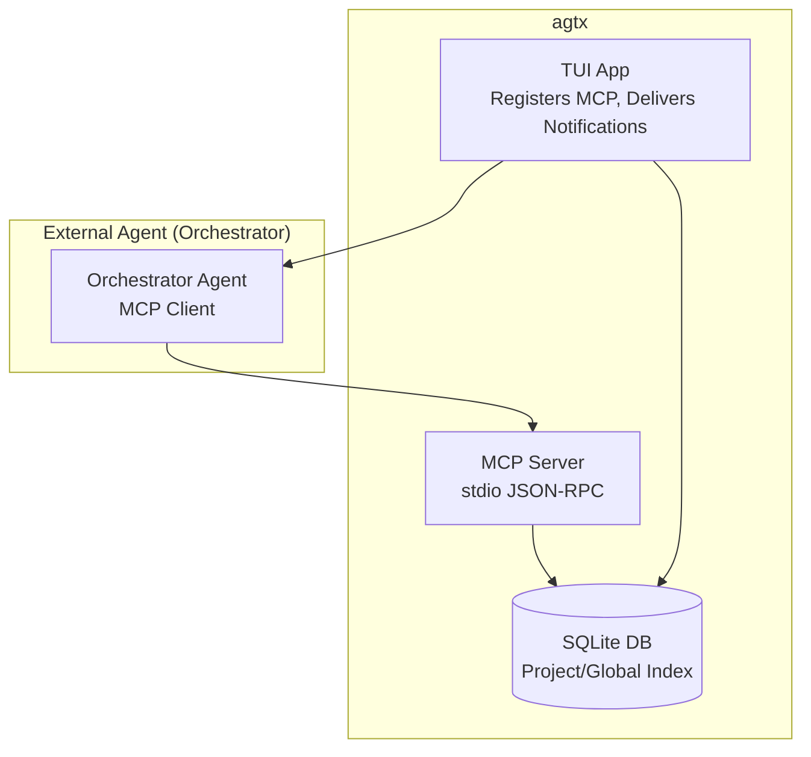
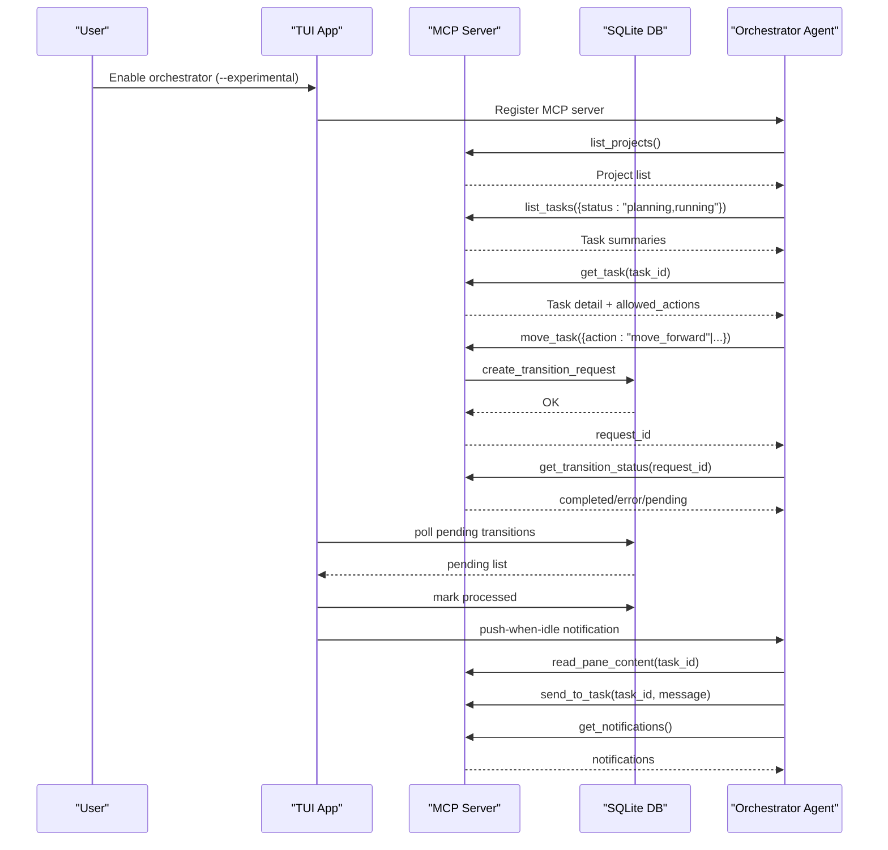
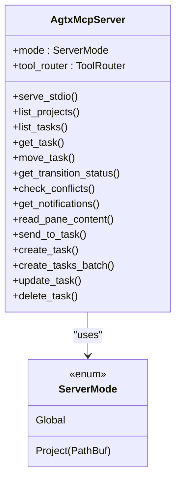
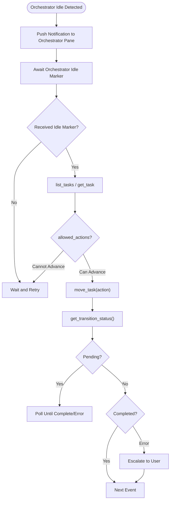
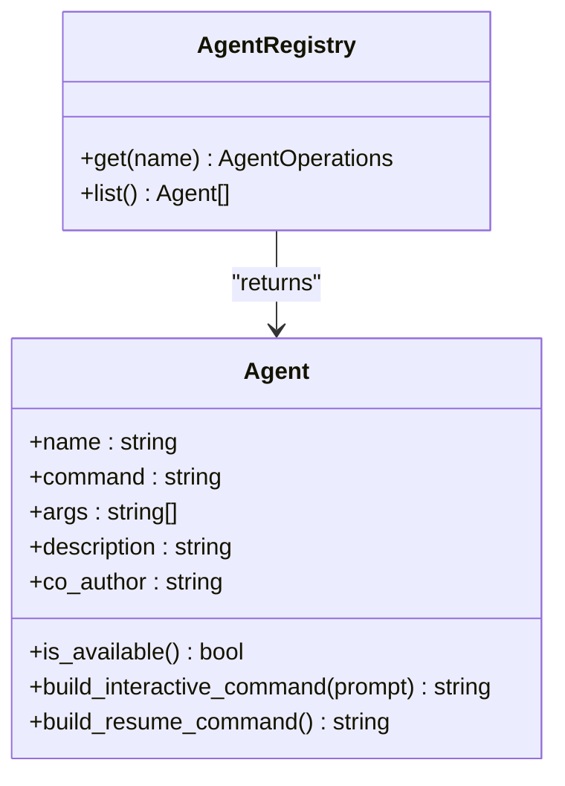
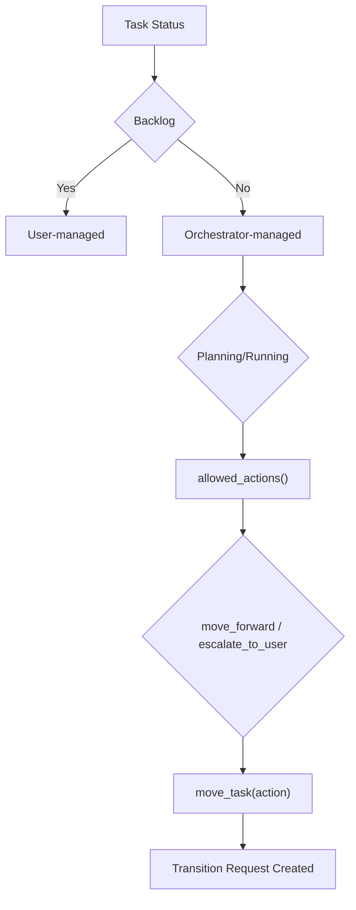
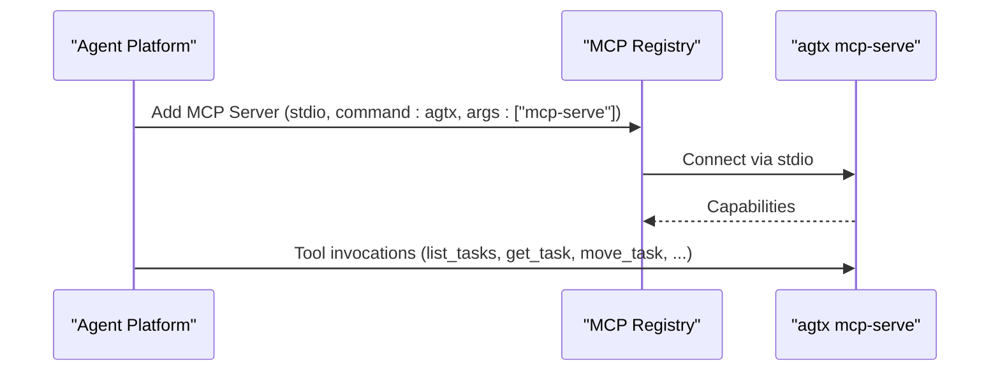
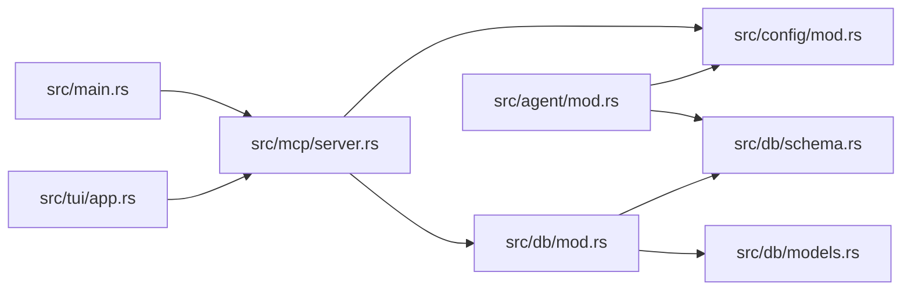

# Orchestrator Integration

<cite>
**Referenced Files in This Document**
- [README.md](file://README.md)
- [.mcp.json](file://.mcp.json)
- [src/main.rs](file://src/main.rs)
- [src/mcp/mod.rs](file://src/mcp/mod.rs)
- [src/mcp/server.rs](file://src/mcp/server.rs)
- [src/db/mod.rs](file://src/db/mod.rs)
- [src/db/schema.rs](file://src/db/schema.rs)
- [src/db/models.rs](file://src/db/models.rs)
- [src/config/mod.rs](file://src/config/mod.rs)
- [src/agent/mod.rs](file://src/agent/mod.rs)
- [src/tui/app.rs](file://src/tui/app.rs)
- [plugins/agtx/plugin.toml](file://plugins/agtx/plugin.toml)
- [plugins/agtx/skills/orchestrate.md](file://plugins/agtx/skills/orchestrate.md)
- [tests/mcp_tests.rs](file://tests/mcp_tests.rs)
</cite>

## Table of Contents
1. [Introduction](#introduction)
2. [Project Structure](#project-structure)
3. [Core Components](#core-components)
4. [Architecture Overview](#architecture-overview)
5. [Detailed Component Analysis](#detailed-component-analysis)
6. [Dependency Analysis](#dependency-analysis)
7. [Performance Considerations](#performance-considerations)
8. [Security and Access Control](#security-and-access-control)
9. [Troubleshooting Guide](#troubleshooting-guide)
10. [Conclusion](#conclusion)
11. [Appendices](#appendices)

## Introduction
This document explains how orchestrator agents integrate with agtx using the Model Context Protocol (MCP) to manage tasks, monitor progress, and coordinate development workflows. It covers the MCP server implementation, orchestrator communication patterns (push-when-idle notifications and task status updates), agent detection and compatibility, practical configuration and invocation examples, and operational guidance for building and troubleshooting custom orchestrator integrations.

## Project Structure
Agtx exposes an MCP server that can operate in two modes:
- Project-scoped mode: Bound to a single project directory (used by orchestrators).
- Global mode: Serves all indexed projects via a central database.

The orchestrator skill defines the agent’s responsibilities, communication cadence, and escalation rules. The TUI coordinates MCP registration, pushes notifications to the orchestrator when idle, and processes queued state transitions.

**Diagram sources**
- [src/mcp/server.rs:1245-1263](file://src/mcp/server.rs#L1245-L1263)
- [src/main.rs:30-61](file://src/main.rs#L30-L61)
- [src/tui/app.rs:6303-6320](file://src/tui/app.rs#L6303-L6320)

**Section sources**
- [README.md:573-646](file://README.md#L573-L646)
- [src/main.rs:30-61](file://src/main.rs#L30-L61)
- [src/mcp/mod.rs:1-5](file://src/mcp/mod.rs#L1-L5)
- [src/mcp/server.rs:1245-1263](file://src/mcp/server.rs#L1245-L1263)

## Core Components
- MCP Server: Implements the tool router and handlers for listing projects/tasks, querying task details, queuing transitions, conflict checks, and orchestrator notifications.
- Database: Provides project-scoped and global databases for tasks, transition requests, and notifications.
- TUI: Manages MCP registration, orchestrator session readiness, idle detection, and push-when-idle notifications.
- Agent Detection: Enumerates supported agents and determines availability for workflow execution.
- Configuration: Merges global and project settings to derive effective agent and plugin behavior.

**Section sources**
- [src/mcp/server.rs:521-755](file://src/mcp/server.rs#L521-L755)
- [src/db/schema.rs:1-200](file://src/db/schema.rs#L1-L200)
- [src/db/models.rs:1-245](file://src/db/models.rs#L1-L245)
- [src/tui/app.rs:6303-6320](file://src/tui/app.rs#L6303-L6320)
- [src/agent/mod.rs:1-171](file://src/agent/mod.rs#L1-L171)
- [src/config/mod.rs:337-408](file://src/config/mod.rs#L337-L408)

## Architecture Overview
The orchestrator agent communicates with agtx over MCP (stdio JSON-RPC). The TUI registers the MCP server with the orchestrator and pushes notifications when the orchestrator pane is idle. The orchestrator queries task state, validates allowed actions, queues transitions, and escalates when needed.

**Diagram sources**
- [src/mcp/server.rs:521-755](file://src/mcp/server.rs#L521-L755)
- [src/db/schema.rs:149-180](file://src/db/schema.rs#L149-L180)
- [src/tui/app.rs:6303-6320](file://src/tui/app.rs#L6303-L6320)
- [plugins/agtx/skills/orchestrate.md:14-42](file://plugins/agtx/skills/orchestrate.md#L14-L42)

## Detailed Component Analysis

### MCP Server and Tool Router
The MCP server exposes a strict set of tools for orchestrator-driven operations:
- Project and task listing with filtering
- Task detail retrieval including allowed_actions
- Queuing transitions with validation and dependency checks
- Conflict detection against the default branch
- Orchestrator notifications and pane inspection
- Task pane read/write operations

**Diagram sources**
- [src/mcp/server.rs:16-24](file://src/mcp/server.rs#L16-L24)
- [src/mcp/server.rs:521-755](file://src/mcp/server.rs#L521-L755)

**Section sources**
- [src/mcp/server.rs:521-755](file://src/mcp/server.rs#L521-L755)
- [src/mcp/server.rs:1245-1263](file://src/mcp/server.rs#L1245-L1263)

### Orchestrator Communication Patterns
- Push-when-idle notifications: The TUI detects orchestrator idle time and pushes a single aggregated message containing one or more completed-phase events. The orchestrator must output a specific idle marker to receive further notifications.
- Task status updates: The orchestrator queries transition status to determine completion or errors and retries or escalates accordingly.
- Pane inspection and nudging: When a task becomes idle, the orchestrator inspects the pane and either sends input or escalates to the user.

**Diagram sources**
- [plugins/agtx/skills/orchestrate.md:30-90](file://plugins/agtx/skills/orchestrate.md#L30-L90)
- [src/tui/app.rs:6303-6320](file://src/tui/app.rs#L6303-L6320)
- [src/mcp/server.rs:655-755](file://src/mcp/server.rs#L655-L755)

**Section sources**
- [plugins/agtx/skills/orchestrate.md:30-90](file://plugins/agtx/skills/orchestrate.md#L30-L90)
- [src/tui/app.rs:6303-6320](file://src/tui/app.rs#L6303-L6320)

### Agent Detection and Compatibility
Agtx recognizes multiple AI coding agents and exposes their availability. Plugins declare supported agents; the orchestrator can leverage this to choose appropriate agents per phase. The agent registry provides detection and command construction for resuming or launching sessions.

**Diagram sources**
- [src/agent/mod.rs:10-77](file://src/agent/mod.rs#L10-L77)
- [src/agent/mod.rs:124-135](file://src/agent/mod.rs#L124-L135)

**Section sources**
- [src/agent/mod.rs:1-171](file://src/agent/mod.rs#L1-L171)
- [src/config/mod.rs:410-595](file://src/config/mod.rs#L410-L595)
- [README.md:348-368](file://README.md#L348-L368)

### Task Lifecycle and Allowed Actions
Allowed actions are computed based on the current task status and plugin rules. The orchestrator consults allowed_actions before advancing tasks to ensure compliance with workflow gating.

**Diagram sources**
- [src/mcp/server.rs:473-518](file://src/mcp/server.rs#L473-L518)
- [src/db/models.rs:5-56](file://src/db/models.rs#L5-L56)

**Section sources**
- [src/mcp/server.rs:473-518](file://src/mcp/server.rs#L473-L518)
- [src/db/models.rs:5-56](file://src/db/models.rs#L5-L56)

### MCP Registration and Invocation Examples
- Global MCP registration for skills across projects:
  - Command: register an MCP server with stdio transport pointing to the agtx binary and the mcp-serve command.
  - Scope: user or project-specific depending on agent platform.
- Project-scoped MCP for orchestrator:
  - Command: agtx mcp-serve <project-path> binds the server to a single project.

**Diagram sources**
- [.mcp.json:1-8](file://.mcp.json#L1-L8)
- [src/main.rs:30-61](file://src/main.rs#L30-L61)
- [src/mcp/server.rs:1245-1263](file://src/mcp/server.rs#L1245-L1263)

**Section sources**
- [.mcp.json:1-8](file://.mcp.json#L1-L8)
- [src/main.rs:30-61](file://src/main.rs#L30-L61)
- [README.md:573-603](file://README.md#L573-L603)

### Practical Configuration and Workflow Automation
- Enabling the orchestrator:
  - Launch agtx with the experimental flag to enable orchestrator mode.
  - Press the orchestrator toggle key to start the orchestrator agent.
- Orchestrator skill behavior:
  - On startup: list tasks and identify Planning/Running tasks needing advancement.
  - On idle: output a specific idle marker to receive push notifications.
  - On notifications: fetch task details, validate allowed actions, and queue transitions.
  - On stuck tasks: read pane content, decide action, and either nudge or escalate.
- Plugin configuration:
  - Choose a workflow plugin that defines commands, prompts, and artifacts per phase.
  - Optionally restrict supported agents per plugin.

**Section sources**
- [README.md:604-646](file://README.md#L604-L646)
- [plugins/agtx/skills/orchestrate.md:57-90](file://plugins/agtx/skills/orchestrate.md#L57-L90)
- [plugins/agtx/plugin.toml:1-16](file://plugins/agtx/plugin.toml#L1-L16)
- [src/config/mod.rs:410-595](file://src/config/mod.rs#L410-L595)

## Dependency Analysis
The orchestrator integration spans several modules with clear boundaries:
- CLI entry point routes to MCP server mode.
- MCP server depends on configuration and database abstractions.
- TUI depends on MCP server and orchestrator session state to deliver notifications.
- Agent registry provides platform compatibility for agent commands.

**Diagram sources**
- [src/main.rs:30-61](file://src/main.rs#L30-L61)
- [src/mcp/server.rs:1-15](file://src/mcp/server.rs#L1-L15)
- [src/db/mod.rs:1-6](file://src/db/mod.rs#L1-L6)
- [src/db/schema.rs:1-200](file://src/db/schema.rs#L1-L200)
- [src/db/models.rs:1-245](file://src/db/models.rs#L1-L245)
- [src/tui/app.rs:6303-6320](file://src/tui/app.rs#L6303-L6320)
- [src/agent/mod.rs:1-171](file://src/agent/mod.rs#L1-L171)

**Section sources**
- [src/main.rs:30-61](file://src/main.rs#L30-L61)
- [src/mcp/server.rs:1-15](file://src/mcp/server.rs#L1-L15)
- [src/db/schema.rs:1-200](file://src/db/schema.rs#L1-L200)
- [src/db/models.rs:1-245](file://src/db/models.rs#L1-L245)
- [src/tui/app.rs:6303-6320](file://src/tui/app.rs#L6303-L6320)
- [src/agent/mod.rs:1-171](file://src/agent/mod.rs#L1-L171)

## Performance Considerations
- MCP server latency: Tool handlers perform database reads/writes and git operations; batch operations (e.g., batch task creation) reduce overhead.
- Notification delivery cadence: The TUI checks for orchestrator readiness and idle state periodically to avoid unnecessary writes.
- Conflict checks: Non-destructive git merge-tree checks are efficient and safe for frequent polling.
- Transition request cleanup: Old processed requests are pruned to prevent database bloat.

[No sources needed since this section provides general guidance]

## Security and Access Control
- Transport: MCP runs over stdio, minimizing network exposure. Ensure the orchestrator environment restricts access to the stdio channel.
- Permissions: The orchestrator must be granted permission to access the MCP server by the agent platform. Registration examples are provided for Claude Code, Codex, Gemini CLI, and Cursor.
- Project scoping: Project-scoped MCP servers limit access to a single project, reducing blast radius.
- Cleanup: MCP registrations are removed when the orchestrator is stopped to prevent lingering access.

**Section sources**
- [README.md:186-260](file://README.md#L186-L260)
- [src/mcp/server.rs:1245-1263](file://src/mcp/server.rs#L1245-L1263)

## Troubleshooting Guide
Common issues and resolutions:
- MCP server not reachable:
  - Verify the project path is a git repository and launch with the correct mode.
  - Confirm the MCP registration on the agent platform.
- No push notifications:
  - Ensure the orchestrator outputs the idle marker after processing.
  - Confirm the orchestrator pane is ready and the window exists.
- Transition not advancing:
  - Check allowed_actions and dependency satisfaction.
  - Inspect transition status for errors and retry appropriately.
- Stuck tasks:
  - Use pane read to diagnose prompts or errors.
  - Send targeted input or escalate with a concise reason.
- Database errors:
  - Validate project/global DB initialization and permissions.
  - Use test fixtures to validate CRUD and transition flows.

**Section sources**
- [src/main.rs:30-61](file://src/main.rs#L30-L61)
- [src/tui/app.rs:6303-6320](file://src/tui/app.rs#L6303-L6320)
- [src/mcp/server.rs:655-755](file://src/mcp/server.rs#L655-L755)
- [tests/mcp_tests.rs:1-472](file://tests/mcp_tests.rs#L1-L472)

## Conclusion
The orchestrator integration leverages MCP to automate task lifecycle management within agtx. By combining push-when-idle notifications, strict allowed-actions enforcement, and robust agent/platform compatibility, orchestrators can reliably advance tasks from Planning to Review with minimal human intervention. Proper configuration, security hygiene, and monitoring ensure smooth operation across diverse development environments.

[No sources needed since this section summarizes without analyzing specific files]

## Appendices

### MCP Tools Reference
- list_projects: List indexed projects (global mode).
- list_tasks: List tasks with optional status filter.
- get_task: Retrieve task details and allowed_actions.
- move_task: Queue a transition with validation and dependency checks.
- get_transition_status: Check completion or error for a transition request.
- check_conflicts: Non-destructive conflict detection against the default branch.
- get_notifications: Fetch pending orchestrator notifications.
- read_pane_content: Read recent pane lines for diagnostics.
- send_to_task: Send input to a task’s agent pane.
- create_task, create_tasks_batch, update_task, delete_task: Backlog-only operations.

**Section sources**
- [src/mcp/server.rs:521-755](file://src/mcp/server.rs#L521-L755)
- [README.md:586-603](file://README.md#L586-L603)