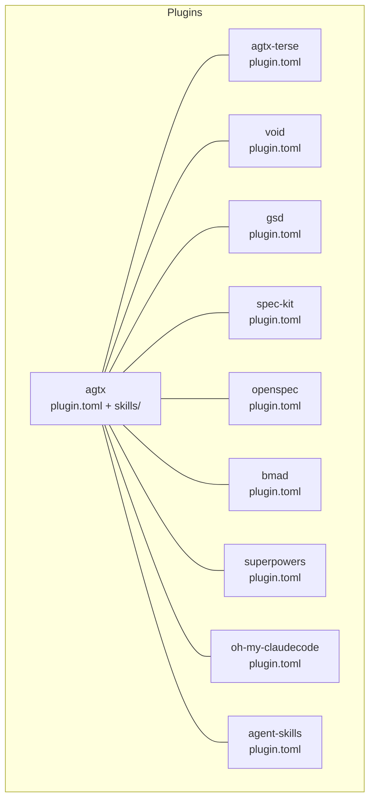
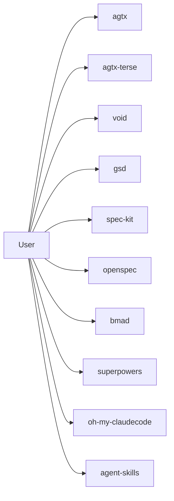
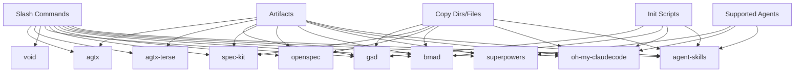

# Built-in Plugins

<cite>
**Referenced Files in This Document**
- [plugins/agtx/plugin.toml](file://plugins/agtx/plugin.toml)
- [plugins/agtx/skills/research.md](file://plugins/agtx/skills/research.md)
- [plugins/agtx/skills/plan.md](file://plugins/agtx/skills/plan.md)
- [plugins/agtx/skills/execute.md](file://plugins/agtx/skills/execute.md)
- [plugins/agtx/skills/review.md](file://plugins/agtx/skills/review.md)
- [plugins/agtx/skills/orchestrate.md](file://plugins/agtx/skills/orchestrate.md)
- [plugins/agtx/skills/merge-conflicts.md](file://plugins/agtx/skills/merge-conflicts.md)
- [plugins/agtx-terse/plugin.toml](file://plugins/agtx-terse/plugin.toml)
- [plugins/void/plugin.toml](file://plugins/void/plugin.toml)
- [plugins/gsd/plugin.toml](file://plugins/gsd/plugin.toml)
- [plugins/spec-kit/plugin.toml](file://plugins/spec-kit/plugin.toml)
- [plugins/openspec/plugin.toml](file://plugins/openspec/plugin.toml)
- [plugins/bmad/plugin.toml](file://plugins/bmad/plugin.toml)
- [plugins/superpowers/plugin.toml](file://plugins/superpowers/plugin.toml)
- [plugins/oh-my-claudecode/plugin.toml](file://plugins/oh-my-claudecode/plugin.toml)
- [plugins/agent-skills/plugin.toml](file://plugins/agent-skills/plugin.toml)
</cite>

## Table of Contents
1. [Introduction](#introduction)
2. [Project Structure](#project-structure)
3. [Core Components](#core-components)
4. [Architecture Overview](#architecture-overview)
5. [Detailed Component Analysis](#detailed-component-analysis)
6. [Dependency Analysis](#dependency-analysis)
7. [Performance Considerations](#performance-considerations)
8. [Troubleshooting Guide](#troubleshooting-guide)
9. [Conclusion](#conclusion)

## Introduction
This document describes the built-in plugins available in the AGTX ecosystem. Each plugin defines a distinct workflow, artifact locations, command bindings, and optional initialization or copying behavior. The plugins covered include:
- agtx (standard workflow)
- agtx-terse (concise workflow)
- void (minimal workflow)
- gsd (goal-structured design)
- spec-kit (specification toolkit)
- openspec (open specification)
- bmad (behavioral model analysis and design)
- superpowers (enhanced capabilities)
- oh-my-claudecode (Claude-specific optimizations)
- agent-skills (skill management)

For each plugin, we explain purpose, configuration options, defaults, typical use cases, and how they transform task execution and artifact generation. We also highlight differences between similar plugins and offer guidance for selecting the right plugin for specific workflows.

## Project Structure
The built-in plugins live under plugins/<plugin-name>/ with a plugin.toml per plugin and, for agtx, a skills/ directory containing phase-specific skill documents. The plugin.toml files define:
- Plugin identity and description
- Artifact paths per phase
- Command bindings per phase
- Optional behaviors such as cyclic mode, clear context on advance, initialization scripts, and copying directories/files

**Diagram sources**
- [plugins/agtx/plugin.toml:1-16](file://plugins/agtx/plugin.toml#L1-L16)
- [plugins/agtx-terse/plugin.toml:1-16](file://plugins/agtx-terse/plugin.toml#L1-L16)
- [plugins/void/plugin.toml:1-4](file://plugins/void/plugin.toml#L1-L4)
- [plugins/gsd/plugin.toml:1-34](file://plugins/gsd/plugin.toml#L1-L34)
- [plugins/spec-kit/plugin.toml:1-21](file://plugins/spec-kit/plugin.toml#L1-L21)
- [plugins/openspec/plugin.toml:1-21](file://plugins/openspec/plugin.toml#L1-L21)
- [plugins/bmad/plugin.toml:1-22](file://plugins/bmad/plugin.toml#L1-L22)
- [plugins/superpowers/plugin.toml:1-16](file://plugins/superpowers/plugin.toml#L1-L16)
- [plugins/oh-my-claudecode/plugin.toml:1-41](file://plugins/oh-my-claudecode/plugin.toml#L1-L41)
- [plugins/agent-skills/plugin.toml:1-19](file://plugins/agent-skills/plugin.toml#L1-L19)

**Section sources**
- [plugins/agtx/plugin.toml:1-16](file://plugins/agtx/plugin.toml#L1-L16)
- [plugins/agtx-terse/plugin.toml:1-16](file://plugins/agtx-terse/plugin.toml#L1-L16)
- [plugins/void/plugin.toml:1-4](file://plugins/void/plugin.toml#L1-L4)
- [plugins/gsd/plugin.toml:1-34](file://plugins/gsd/plugin.toml#L1-L34)
- [plugins/spec-kit/plugin.toml:1-21](file://plugins/spec-kit/plugin.toml#L1-L21)
- [plugins/openspec/plugin.toml:1-21](file://plugins/openspec/plugin.toml#L1-L21)
- [plugins/bmad/plugin.toml:1-22](file://plugins/bmad/plugin.toml#L1-L22)
- [plugins/superpowers/plugin.toml:1-16](file://plugins/superpowers/plugin.toml#L1-L16)
- [plugins/oh-my-claudecode/plugin.toml:1-41](file://plugins/oh-my-claudecode/plugin.toml#L1-L41)
- [plugins/agent-skills/plugin.toml:1-19](file://plugins/agent-skills/plugin.toml#L1-L19)

## Core Components
Each plugin encapsulates a workflow with the following typical components:
- Purpose and description
- Artifacts per phase (research, planning, running, review)
- Commands per phase
- Optional behaviors (cyclic, clear context on advance, init script, copy dirs/files, copy back, supported agents, prompt triggers, auto-dismiss)

Defaults and behaviors are defined in each plugin’s plugin.toml. For agtx-family plugins, the skills directory provides detailed phase instructions and expected outputs.

**Section sources**
- [plugins/agtx/plugin.toml:1-16](file://plugins/agtx/plugin.toml#L1-L16)
- [plugins/agtx-terse/plugin.toml:1-16](file://plugins/agtx-terse/plugin.toml#L1-L16)
- [plugins/void/plugin.toml:1-4](file://plugins/void/plugin.toml#L1-L4)
- [plugins/gsd/plugin.toml:1-34](file://plugins/gsd/plugin.toml#L1-L34)
- [plugins/spec-kit/plugin.toml:1-21](file://plugins/spec-kit/plugin.toml#L1-L21)
- [plugins/openspec/plugin.toml:1-21](file://plugins/openspec/plugin.toml#L1-L21)
- [plugins/bmad/plugin.toml:1-22](file://plugins/bmad/plugin.toml#L1-L22)
- [plugins/superpowers/plugin.toml:1-16](file://plugins/superpowers/plugin.toml#L1-L16)
- [plugins/oh-my-claudecode/plugin.toml:1-41](file://plugins/oh-my-claudecode/plugin.toml#L1-L41)
- [plugins/agent-skills/plugin.toml:1-19](file://plugins/agent-skills/plugin.toml#L1-L19)

## Architecture Overview
The AGTX plugin architecture centers on a consistent phase model: research, planning, running, and review. Plugins define:
- How phases are triggered via slash commands
- Where artifacts are written
- Whether the plugin runs cyclically or advances tasks
- Optional preconditions such as init scripts and copying external directories/files

**Diagram sources**
- [plugins/agtx/plugin.toml:1-16](file://plugins/agtx/plugin.toml#L1-L16)
- [plugins/agtx-terse/plugin.toml:1-16](file://plugins/agtx-terse/plugin.toml#L1-L16)
- [plugins/void/plugin.toml:1-4](file://plugins/void/plugin.toml#L1-L4)
- [plugins/gsd/plugin.toml:1-34](file://plugins/gsd/plugin.toml#L1-L34)
- [plugins/spec-kit/plugin.toml:1-21](file://plugins/spec-kit/plugin.toml#L1-L21)
- [plugins/openspec/plugin.toml:1-21](file://plugins/openspec/plugin.toml#L1-L21)
- [plugins/bmad/plugin.toml:1-22](file://plugins/bmad/plugin.toml#L1-L22)
- [plugins/superpowers/plugin.toml:1-16](file://plugins/superpowers/plugin.toml#L1-L16)
- [plugins/oh-my-claudecode/plugin.toml:1-41](file://plugins/oh-my-claudecode/plugin.toml#L1-L41)
- [plugins/agent-skills/plugin.toml:1-19](file://plugins/agent-skills/plugin.toml#L1-L19)

## Detailed Component Analysis

### agtx (Standard Workflow)
Purpose
- Provides a full four-phase workflow: research, planning, running, review. Designed for guided, artifact-driven development with explicit handoffs between phases.

Key configuration
- Artifacts per phase stored under .agtx/
- Commands bound to /agtx:research, /agtx:plan, /agtx:execute, /agtx:review
- clear_context_on_advance enabled to reset context between phases

Typical use cases
- Full spec-to-ship projects requiring structured phases
- Teams needing explicit documentation and approvals between phases

How it transforms task execution
- Research phase produces .agtx/research.md
- Planning phase produces .agtx/plan.md and waits for approval
- Execution phase writes .agtx/execute.md and stops
- Review phase writes .agtx/review.md and stops

Skill-level details
- Research: read-only exploration; output to .agtx/research.md
- Plan: analyze and produce .agtx/plan.md; pause for approval
- Execute: implement changes; output summary to .agtx/execute.md
- Review: self-review; output to .agtx/review.md
- Orchestrate: advanced coordination of multiple tasks across Planning and Running
- Merge-conflicts: deterministic steps to resolve merge conflicts

Example configuration references
- [plugin.toml:1-16](file://plugins/agtx/plugin.toml#L1-L16)
- [research.md:1-45](file://plugins/agtx/skills/research.md#L1-L45)
- [plan.md:1-43](file://plugins/agtx/skills/plan.md#L1-L43)
- [execute.md:1-39](file://plugins/agtx/skills/execute.md#L1-L39)
- [review.md:1-36](file://plugins/agtx/skills/review.md#L1-L36)
- [orchestrate.md:1-200](file://plugins/agtx/skills/orchestrate.md#L1-L200)
- [merge-conflicts.md:1-53](file://plugins/agtx/skills/merge-conflicts.md#L1-L53)

**Section sources**
- [plugins/agtx/plugin.toml:1-16](file://plugins/agtx/plugin.toml#L1-L16)
- [plugins/agtx/skills/research.md:1-45](file://plugins/agtx/skills/research.md#L1-L45)
- [plugins/agtx/skills/plan.md:1-43](file://plugins/agtx/skills/plan.md#L1-L43)
- [plugins/agtx/skills/execute.md:1-39](file://plugins/agtx/skills/execute.md#L1-L39)
- [plugins/agtx/skills/review.md:1-36](file://plugins/agtx/skills/review.md#L1-L36)
- [plugins/agtx/skills/orchestrate.md:1-200](file://plugins/agtx/skills/orchestrate.md#L1-L200)
- [plugins/agtx/skills/merge-conflicts.md:1-53](file://plugins/agtx/skills/merge-conflicts.md#L1-L53)

### agtx-terse (Concise Workflow)
Purpose
- Token-efficient variant of the standard agtx workflow with compressed output and minimal token usage while preserving the four-phase structure.

Key configuration
- Identical artifact paths to agtx (.agtx/)
- Same commands (/agtx:research, /agtx:plan, /agtx:execute, /agtx:review)
- clear_context_on_advance enabled

Typical use cases
- Environments where token budget is tight but structured phases are still desired
- Rapid iteration with reduced overhead

How it transforms task execution
- Same phase boundaries and artifacts as agtx
- Differences lie in prompt compression and reduced verbosity

Example configuration references
- [plugin.toml:1-16](file://plugins/agtx-terse/plugin.toml#L1-L16)

**Section sources**
- [plugins/agtx-terse/plugin.toml:1-16](file://plugins/agtx-terse/plugin.toml#L1-L16)

### void (Minimal Workflow)
Purpose
- Plain coding agent session without prompting or skills. Intended for direct, unmediated coding sessions.

Key configuration
- cyclic enabled for continuous operation
- No commands or artifacts defined in plugin.toml

Typical use cases
- Quick edits or experiments where no formal phases are needed
- Low-friction experimentation

How it transforms task execution
- No enforced phases or artifacts
- Operates continuously in cyclic mode

Example configuration references
- [plugin.toml:1-4](file://plugins/void/plugin.toml#L1-L4)

**Section sources**
- [plugins/void/plugin.toml:1-4](file://plugins/void/plugin.toml#L1-L4)

### gsd (Goal-Structured Design)
Purpose
- Structured, spec-driven development framework with pre-research, research, planning, running, and review phases. Integrates with a CLI to scaffold and drive phases.

Key configuration
- init_script invokes a CLI to bootstrap a project structure
- copy_files ensures initial planning assets are present
- Artifacts organized under .planning/ with phase-specific files
- Commands for new project, discuss-phase, plan-phase, execute-phase, verify-work
- Supported agents include multiple providers
- auto_dismiss configured for interactive CLI flows

Typical use cases
- Projects requiring disciplined, phase-gated delivery with standardized artifacts
- Teams adopting a CLI-driven methodology

How it transforms task execution
- preresearch copies initial planning files
- research writes contextual artifacts per phase
- planning writes phase plans
- running writes summaries
- review performs UAT artifacts

Example configuration references
- [plugin.toml:1-34](file://plugins/gsd/plugin.toml#L1-L34)

**Section sources**
- [plugins/gsd/plugin.toml:1-34](file://plugins/gsd/plugin.toml#L1-L34)

### spec-kit (Specification Toolkit)
Purpose
- Spec-Driven Development where specifications become executable artifacts. Requires project-level initialization and copies a .specify directory to worktrees.

Key configuration
- copy_dirs includes .specify
- Artifacts for research and planning under specs/*/spec.md and specs/*/plan.md
- Commands for specify, plan, implement, analyze
- Omits phases that fall back to agtx defaults

Typical use cases
- Teams practicing SDD with explicit spec-to-plan-to-implement cycles
- Projects where specifications drive subsequent phases

How it transforms task execution
- Research produces spec.md
- Planning produces plan.md
- Implementation and analysis continue the lifecycle

Example configuration references
- [plugin.toml:1-21](file://plugins/spec-kit/plugin.toml#L1-L21)

**Section sources**
- [plugins/spec-kit/plugin.toml:1-21](file://plugins/spec-kit/plugin.toml#L1-L21)

### openspec (Open Specification)
Purpose
- Lightweight AI-guided specification framework. Requires project-level initialization and copies an openspec directory to worktrees.

Key configuration
- copy_dirs includes openspec
- Artifacts under openspec/changes/*/proposal.md and openspec/changes/*/tasks.md
- Commands for propose, apply, verify
- copy_back ensures artifacts are returned to the project root after planning

Typical use cases
- Lightweight specification and change proposal workflows
- Quick iterations with minimal ceremony

How it transforms task execution
- propose creates a proposal
- apply generates tasks
- verify validates outcomes

Example configuration references
- [plugin.toml:1-21](file://plugins/openspec/plugin.toml#L1-L21)

**Section sources**
- [plugins/openspec/plugin.toml:1-21](file://plugins/openspec/plugin.toml#L1-L21)

### bmad (Behavioral Model Analysis and Design)
Purpose
- AI-driven agile development with structured phases and outputs. Installs a method and manages artifacts under _bmad and _bmad-output.

Key configuration
- init_script installs the method
- copy_dirs includes _bmad and _bmad-output
- Artifacts under _bmad-output for PRD and implementation artifacts
- Commands for creating PRD, dev story, and code review
- copy_back returns outputs after planning and running

Typical use cases
- Agile teams needing PRD and iterative implementation artifacts
- Structured outputs for behavioral modeling

How it transforms task execution
- planning produces PRD.md
- running collects implementation artifacts
- review triggers code review command

Example configuration references
- [plugin.toml:1-22](file://plugins/bmad/plugin.toml#L1-L22)

**Section sources**
- [plugins/bmad/plugin.toml:1-22](file://plugins/bmad/plugin.toml#L1-L22)

### superpowers (Enhanced Capabilities)
Purpose
- Enhanced capabilities including brainstorming, plans, TDD, and subagent-driven development. Targets Claude with a plugin installation step.

Key configuration
- supported_agents includes claude
- init_script installs a Claude plugin
- Artifacts under docs/superpowers/plans/*.md
- Prompts guide brainstorming, plan execution, and review
- copy_back returns docs/superpowers after planning

Typical use cases
- Teams wanting integrated brainstorming and plan-driven execution
- TDD and subagent workflows

How it transforms task execution
- planning produces plan artifacts under docs/superpowers/plans
- prompts direct execution and review steps

Example configuration references
- [plugin.toml:1-16](file://plugins/superpowers/plugin.toml#L1-L16)

**Section sources**
- [plugins/superpowers/plugin.toml:1-16](file://plugins/superpowers/plugin.toml#L1-L16)

### oh-my-claudecode (Claude-Specific Optimizations)
Purpose
- Multi-agent orchestration with 37 skills and 22 specialized agents. Creates and manages .omc for plans, specs, state, and handoffs.

Key configuration
- supported_agents includes claude
- init_script initializes .omc directories
- copy_dirs includes .omc
- Artifacts under .omc/specs, .omc/plans, and .omc/prd.json
- Commands for deep-interview, ralplan, autopilot
- copy_back returns .omc artifacts after research and planning

Typical use cases
- Complex, multi-agent Claude workflows
- Autonomous pipelines spanning expansion, planning, execution, QA, and validation

How it transforms task execution
- research produces deep-interview specs
- planning produces ralplan-based plans
- running produces prd.json for autopilot

Example configuration references
- [plugin.toml:1-41](file://plugins/oh-my-claudecode/plugin.toml#L1-L41)

**Section sources**
- [plugins/oh-my-claudecode/plugin.toml:1-41](file://plugins/oh-my-claudecode/plugin.toml#L1-L41)

### agent-skills (Skill Management)
Purpose
- Production-grade engineering skills covering the full spec-to-ship lifecycle. Supports multiple agents with a plugin installation step.

Key configuration
- init_script conditionally installs a marketplace plugin for Claude; other agents require manual setup
- Commands for spec, plan, build, and review
- Prompts guide research, planning, implementation, and review

Typical use cases
- Teams needing a comprehensive skill set across the lifecycle
- Multi-agent environments with standardized commands

How it transforms task execution
- research via /spec
- planning via /plan
- running via /build
- review via /review

Example configuration references
- [plugin.toml:1-19](file://plugins/agent-skills/plugin.toml#L1-L19)

**Section sources**
- [plugins/agent-skills/plugin.toml:1-19](file://plugins/agent-skills/plugin.toml#L1-L19)

## Dependency Analysis
Plugins depend on:
- Slash commands to trigger phases
- Artifact paths to signal completion
- Optional init scripts and copying of directories/files
- Agent support lists for Claude-centric plugins

**Diagram sources**
- [plugins/agtx/plugin.toml:1-16](file://plugins/agtx/plugin.toml#L1-L16)
- [plugins/agtx-terse/plugin.toml:1-16](file://plugins/agtx-terse/plugin.toml#L1-L16)
- [plugins/void/plugin.toml:1-4](file://plugins/void/plugin.toml#L1-L4)
- [plugins/gsd/plugin.toml:1-34](file://plugins/gsd/plugin.toml#L1-L34)
- [plugins/spec-kit/plugin.toml:1-21](file://plugins/spec-kit/plugin.toml#L1-L21)
- [plugins/openspec/plugin.toml:1-21](file://plugins/openspec/plugin.toml#L1-L21)
- [plugins/bmad/plugin.toml:1-22](file://plugins/bmad/plugin.toml#L1-L22)
- [plugins/superpowers/plugin.toml:1-16](file://plugins/superpowers/plugin.toml#L1-L16)
- [plugins/oh-my-claudecode/plugin.toml:1-41](file://plugins/oh-my-claudecode/plugin.toml#L1-L41)
- [plugins/agent-skills/plugin.toml:1-19](file://plugins/agent-skills/plugin.toml#L1-L19)

**Section sources**
- [plugins/agtx/plugin.toml:1-16](file://plugins/agtx/plugin.toml#L1-L16)
- [plugins/agtx-terse/plugin.toml:1-16](file://plugins/agtx-terse/plugin.toml#L1-L16)
- [plugins/void/plugin.toml:1-4](file://plugins/void/plugin.toml#L1-L4)
- [plugins/gsd/plugin.toml:1-34](file://plugins/gsd/plugin.toml#L1-L34)
- [plugins/spec-kit/plugin.toml:1-21](file://plugins/spec-kit/plugin.toml#L1-L21)
- [plugins/openspec/plugin.toml:1-21](file://plugins/openspec/plugin.toml#L1-L21)
- [plugins/bmad/plugin.toml:1-22](file://plugins/bmad/plugin.toml#L1-L22)
- [plugins/superpowers/plugin.toml:1-16](file://plugins/superpowers/plugin.toml#L1-L16)
- [plugins/oh-my-claudecode/plugin.toml:1-41](file://plugins/oh-my-claudecode/plugin.toml#L1-L41)
- [plugins/agent-skills/plugin.toml:1-19](file://plugins/agent-skills/plugin.toml#L1-L19)

## Performance Considerations
- Token efficiency: agtx-terse reduces token usage while maintaining phase discipline.
- Cyclic mode: void enables continuous operation for low-latency tasks.
- Minimal overhead: void avoids prompts and skills for pure coding tasks.
- Init scripts: gsd, bmad, and oh-my-claudecode incur startup costs; cache or reuse worktrees to mitigate.
- Copying artifacts: plugins that copy directories (e.g., gsd, spec-kit, openspec, bmad, oh-my-claudecode, agent-skills) may impact I/O; stage worktrees to reduce contention.

[No sources needed since this section provides general guidance]

## Troubleshooting Guide
Common issues and resolutions:
- Merge conflicts: Use the merge-conflicts skill to follow deterministic steps for committing, merging, resolving, reviewing, and testing.
- Stuck agents: The orchestrator skill provides decision rules for handling prompts, menus, domain questions, and persistent errors.
- Phase gating: Ensure artifacts exist before advancing phases; missing artifacts can block progression.
- Agent-specific limitations: Some plugins target Claude; verify supported_agents and install prerequisites.

Example configuration references
- [merge-conflicts.md:1-53](file://plugins/agtx/skills/merge-conflicts.md#L1-L53)
- [orchestrate.md:1-200](file://plugins/agtx/skills/orchestrate.md#L1-L200)

**Section sources**
- [plugins/agtx/skills/merge-conflicts.md:1-53](file://plugins/agtx/skills/merge-conflicts.md#L1-L53)
- [plugins/agtx/skills/orchestrate.md:1-200](file://plugins/agtx/skills/orchestrate.md#L1-L200)

## Conclusion
AGTX offers a rich set of built-in plugins tailored to different workflows and team needs. Choose agtx for a robust, artifact-driven lifecycle; agtx-terse for token-conscious environments; void for minimal friction; gsd for CLI-driven, phase-gated delivery; spec-kit and openspec for specification-first approaches; bmad for agile PRD and implementation artifacts; superpowers for enhanced brainstorming and TDD; oh-my-claudecode for multi-agent orchestration; and agent-skills for comprehensive lifecycle coverage. Align plugin selection with your team’s maturity, agent support, and process preferences.