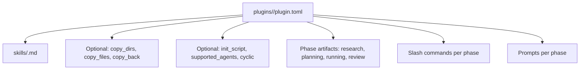
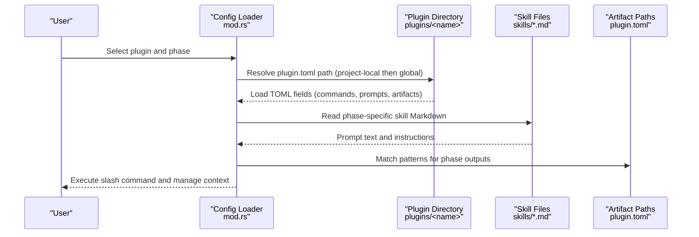
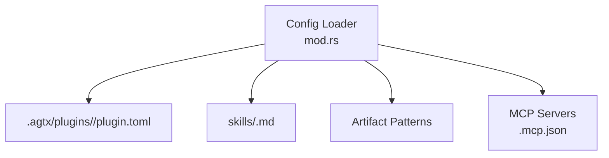

# Custom Plugin Development

<cite>
**Referenced Files in This Document**
- [plugin.toml](file://plugins/agtx/plugin.toml)
- [plugin.toml](file://plugins/agent-skills/plugin.toml)
- [plugin.toml](file://plugins/bmad/plugin.toml)
- [plugin.toml](file://plugins/gsd/plugin.toml)
- [plugin.toml](file://plugins/openspec/plugin.toml)
- [plugin.toml](file://plugins/spec-kit/plugin.toml)
- [plugin.toml](file://plugins/superpowers/plugin.toml)
- [plugin.toml](file://plugins/void/plugin.toml)
- [plan.md](file://plugins/agtx/skills/plan.md)
- [research.md](file://plugins/agtx/skills/research.md)
- [review.md](file://plugins/agtx/skills/review.md)
- [SKILL.md](file://plugins/agtx-terse/skills/agtx-plan/SKILL.md)
- [SKILL.md](file://plugins/agtx-terse/skills/agtx-research/SKILL.md)
- [plugin.json](file://.claude-plugin/plugin.json)
- [plugin.json](file://.codex-plugin/plugin.json)
- [marketplace.json](file://.claude-plugin/marketplace.json)
- [mod.rs](file://src/config/mod.rs)
- [app_tests.rs](file://src/tui/app_tests.rs)
</cite>

## Table of Contents
1. [Introduction](#introduction)
2. [Project Structure](#project-structure)
3. [Core Components](#core-components)
4. [Architecture Overview](#architecture-overview)
5. [Detailed Component Analysis](#detailed-component-analysis)
6. [Dependency Analysis](#dependency-analysis)
7. [Performance Considerations](#performance-considerations)
8. [Troubleshooting Guide](#troubleshooting-guide)
9. [Conclusion](#conclusion)
10. [Appendices](#appendices)

## Introduction
This guide explains how to develop custom plugins for the agtx system. It covers the plugin development lifecycle from planning through testing and deployment, with a focus on building tailored workflows for specific development needs. You will learn the plugin.toml configuration format, directory structure, file organization, and configuration requirements. Practical examples demonstrate how different methodologies (Agile, Waterfall, DevOps, and specialized frameworks) can be modeled as plugins. Advanced topics include conditional execution, dynamic artifact generation, custom phase definitions, testing strategies, debugging techniques, and reusable templates.

## Project Structure
Plugins are organized under the plugins directory, with each plugin containing:
- plugin.toml: The declarative configuration for the plugin.
- skills/: Optional Markdown skill files that define prompts and instructions for each phase.

Example structure:
- plugins/<your-plugin>/plugin.toml
- plugins/<your-plugin>/skills/<phase>.md (optional)

**Section sources**
- [plugin.toml:1-16](file://plugins/agtx/plugin.toml#L1-L16)
- [plugin.toml:1-19](file://plugins/agent-skills/plugin.toml#L1-L19)
- [plugin.toml:1-22](file://plugins/bmad/plugin.toml#L1-L22)
- [plugin.toml:1-34](file://plugins/gsd/plugin.toml#L1-L34)
- [plugin.toml:1-21](file://plugins/openspec/plugin.toml#L1-L21)
- [plugin.toml:1-21](file://plugins/spec-kit/plugin.toml#L1-L21)
- [plugin.toml:1-16](file://plugins/superpowers/plugin.toml#L1-L16)
- [plugin.toml:1-4](file://plugins/void/plugin.toml#L1-L4)

## Core Components
The plugin system centers around a TOML configuration that defines:
- Basic metadata: name, description
- Behavior flags: clear_context_on_advance, cyclic, supported_agents
- Artifacts: phase-specific output file patterns
- Commands: slash commands invoked per phase
- Prompts: optional prompt overrides per phase
- Copy-back mechanisms: post-run artifact synchronization
- Auto-dismiss rules: automated responses to interactive prompts
- Initialization: optional init_script and copy_dirs/copy_files

These fields are parsed and validated by the configuration loader, which also resolves plugin directories and supports agent scoping.

**Section sources**
- [mod.rs:445-594](file://src/config/mod.rs#L445-L594)

## Architecture Overview
The plugin lifecycle integrates configuration parsing, skill loading, command routing, and artifact management. The following diagram maps the runtime flow to actual source files.

**Diagram sources**
- [mod.rs:545-594](file://src/config/mod.rs#L545-L594)
- [plugin.toml:1-16](file://plugins/agtx/plugin.toml#L1-L16)
- [plan.md:1-43](file://plugins/agtx/skills/plan.md#L1-L43)
- [research.md:1-45](file://plugins/agtx/skills/research.md#L1-L45)
- [review.md:1-36](file://plugins/agtx/skills/review.md#L1-L36)

## Detailed Component Analysis

### Plugin Configuration Format
The plugin.toml supports the following fields:

- name: Unique plugin identifier.
- description: Human-readable description.
- clear_context_on_advance: Whether to reset context when advancing phases.
- cyclic: Enables cyclic workflows (looping back to earlier phases).
- supported_agents: Optional list restricting agents.
- init_script: Optional initialization script executed during setup.
- copy_dirs: Directories to copy into worktrees.
- copy_files: Files to copy into worktrees.
- copy_back: Post-run artifact synchronization back to the host.
- artifacts: Maps phases to output file patterns.
- commands: Maps phases to slash commands.
- prompts: Optional prompt overrides per phase.
- prompt_triggers: Optional triggers to inject prompts.
- auto_dismiss: Rules to auto-dismiss interactive prompts.

Field validation and resolution are implemented in the configuration module.

**Section sources**
- [mod.rs:445-594](file://src/config/mod.rs#L445-L594)
- [plugin.toml:1-34](file://plugins/gsd/plugin.toml#L1-L34)
- [plugin.toml:1-22](file://plugins/bmad/plugin.toml#L1-L22)

### Example Plugins by Methodology

- Agile (BMAD)
  - Uses structured phases with planning and implementation artifacts.
  - Demonstrates copy_back and prompt triggers.
  - See [plugin.toml:1-22](file://plugins/bmad/plugin.toml#L1-L22).

- Waterfall (GSDevOps)
  - Supports pre-research and multi-phase artifacts.
  - Demonstrates cyclic workflows and auto_dismiss.
  - See [plugin.toml:1-34](file://plugins/gsd/plugin.toml#L1-L34).

- Spec-Driven (Spec Kit)
  - Artifacts map to specification and plan files.
  - Demonstrates flexible artifact patterns with wildcards.
  - See [plugin.toml:1-21](file://plugins/spec-kit/plugin.toml#L1-L21).

- Lightweight Specification (OpenSpec)
  - Copies a dedicated directory and synchronizes changes back.
  - See [plugin.toml:1-21](file://plugins/openspec/plugin.toml#L1-L21).

- Agent Skills (Addy Osmani)
  - Provides prompts and commands aligned with a production-grade lifecycle.
  - See [plugin.toml:1-19](file://plugins/agent-skills/plugin.toml#L1-L19).

- Plain Coding (Void)
  - Minimal plugin enabling continuous coding without gating.
  - See [plugin.toml:1-4](file://plugins/void/plugin.toml#L1-L4).

- Superpowers
  - Restricts agents, provides tailored prompts, and copies back documentation.
  - See [plugin.toml:1-16](file://plugins/superpowers/plugin.toml#L1-L16).

### Skill Files and Phase Instructions
Each plugin can include skill Markdown files under skills/. These files define:
- Phase-specific instructions
- Input expectations
- Output requirements
- Constraints (e.g., read-only exploration)

Examples:
- Research, Planning, Review skills for the built-in agtx plugin.
- Terse variants for streamlined workflows.

See:
- [plan.md:1-43](file://plugins/agtx/skills/plan.md#L1-L43)
- [research.md:1-45](file://plugins/agtx/skills/research.md#L1-L45)
- [review.md:1-36](file://plugins/agtx/skills/review.md#L1-L36)
- [SKILL.md:1-48](file://plugins/agtx-terse/skills/agtx-plan/SKILL.md#L1-L48)
- [SKILL.md:1-50](file://plugins/agtx-terse/skills/agtx-research/SKILL.md#L1-L50)

### Advanced Features

- Conditional Execution
  - Use supported_agents to restrict which agents can use the plugin.
  - See [mod.rs:539-543](file://src/config/mod.rs#L539-L543).

- Dynamic Artifact Generation
  - Use wildcard patterns in artifacts to match generated files across directories.
  - See [plugin.toml:10-13](file://plugins/gsd/plugin.toml#L10-L13) and [plugin.toml:10-13](file://plugins/spec-kit/plugin.toml#L10-L13).

- Custom Phase Definitions
  - Define additional phases beyond research/planning/running/review using artifacts and commands.
  - See [plugin.toml:15-21](file://plugins/gsd/plugin.toml#L15-L21) for preresearch, research, planning, running, review.

- Auto-Dismiss Interactive Prompts
  - Configure detect/response rules to automate common CLI prompts.
  - See [plugin.toml:31-34](file://plugins/gsd/plugin.toml#L31-L34) and [mod.rs:445-462](file://src/config/mod.rs#L445-L462).

- Copy Back Artifacts
  - Synchronize generated artifacts back to the host after runs.
  - See [plugin.toml:19-22](file://plugins/bmad/plugin.toml#L19-L22), [plugin.toml:19-21](file://plugins/openspec/plugin.toml#L19-L21), [plugin.toml:14-16](file://plugins/superpowers/plugin.toml#L14-L16).

- Cyclic Workflows
  - Enable looping behavior for iterative development.
  - See [plugin.toml](file://plugins/gsd/plugin.toml#L5), [plugin.toml](file://plugins/void/plugin.toml#L3).

### Step-by-Step: Creating a Custom Plugin

1. Create the plugin directory
   - plugins/<your-plugin>/plugin.toml
   - Optional: plugins/<your-plugin>/skills/<phase>.md

2. Define basic metadata
   - name, description

3. Configure behavior flags
   - clear_context_on_advance, cyclic, supported_agents

4. Declare artifacts
   - Map phases to output file patterns (supports wildcards)

5. Define commands
   - Map phases to slash commands

6. Add prompts (optional)
   - Override prompts per phase

7. Configure copy-back (optional)
   - Copy generated artifacts back to the host

8. Add initialization (optional)
   - init_script, copy_dirs, copy_files

9. Validate with tests
   - Use the bundled plugin installation test pattern as a reference

**Section sources**
- [app_tests.rs:2464-2498](file://src/tui/app_tests.rs#L2464-L2498)

### Testing Strategies and Validation Methods

- Unit-style installation test
  - The test simulates installing a bundled plugin and verifies plugin.toml creation and project configuration updates.
  - Reference: [app_tests.rs:2464-2498](file://src/tui/app_tests.rs#L2464-L2498)

- Manual verification steps
  - Confirm plugin loads from project-local then global paths.
  - Validate artifact patterns resolve to expected files.
  - Ensure commands and prompts behave as intended in a controlled environment.

- Debugging techniques
  - Inspect plugin directory resolution and parsing errors.
  - Use minimal plugins (like void) to isolate issues.
  - Temporarily disable copy_back and auto-dismiss rules to simplify debugging.

**Section sources**
- [mod.rs:545-594](file://src/config/mod.rs#L545-L594)
- [plugin.toml:1-4](file://plugins/void/plugin.toml#L1-L4)

### Templates and Boilerplate Patterns

- Minimal plugin (plain coding)
  - Use void as a baseline for a no-gating workflow.
  - See [plugin.toml:1-4](file://plugins/void/plugin.toml#L1-L4).

- Spec-driven plugin
  - Start from spec-kit’s artifact and command structure.
  - See [plugin.toml:1-21](file://plugins/spec-kit/plugin.toml#L1-L21).

- Iterative plugin (Agile/Waterfall)
  - Start from gsd’s multi-phase and auto_dismiss patterns.
  - See [plugin.toml:1-34](file://plugins/gsd/plugin.toml#L1-L34).

- Prompt-driven plugin
  - Start from agent-skills’ prompts and commands.
  - See [plugin.toml:1-19](file://plugins/agent-skills/plugin.toml#L1-L19).

- Terse instruction plugin
  - Use agtx-terse skill templates for concise prompts.
  - See [SKILL.md:1-48](file://plugins/agtx-terse/skills/agtx-plan/SKILL.md#L1-L48) and [SKILL.md:1-50](file://plugins/agtx-terse/skills/agtx-research/SKILL.md#L1-L50).

## Dependency Analysis
The plugin configuration loader depends on:
- TOML parsing for plugin.toml
- Filesystem resolution for project-local and global plugin directories
- Skill Markdown parsing for prompts and instructions
- Optional MCP server configuration for agent integration

**Diagram sources**
- [mod.rs:545-594](file://src/config/mod.rs#L545-L594)
- [.mcp.json](file://.mcp.json)

**Section sources**
- [mod.rs:445-594](file://src/config/mod.rs#L445-L594)

## Performance Considerations
- Keep artifact patterns efficient to avoid scanning large directory trees.
- Limit copy_back to only necessary directories to reduce IO overhead.
- Prefer concise prompts to minimize token usage and latency.
- Use supported_agents to prevent unnecessary agent invocations.

## Troubleshooting Guide
Common issues and resolutions:
- Plugin not found
  - Ensure plugin.toml exists in project-local or global path.
  - See directory resolution logic.
  - Reference: [mod.rs:545-594](file://src/config/mod.rs#L545-L594)

- Artifact pattern mismatches
  - Verify wildcard usage and relative paths.
  - Compare against examples in gsd and spec-kit.
  - References: [plugin.toml:10-13](file://plugins/gsd/plugin.toml#L10-L13), [plugin.toml:10-13](file://plugins/spec-kit/plugin.toml#L10-L13)

- Interactive prompts blocking automation
  - Add auto_dismiss rules to handle common CLI prompts.
  - Reference: [plugin.toml:31-34](file://plugins/gsd/plugin.toml#L31-L34), [mod.rs:445-462](file://src/config/mod.rs#L445-L462)

- Agent compatibility
  - Set supported_agents to restrict usage to compatible agents.
  - Reference: [mod.rs:539-543](file://src/config/mod.rs#L539-L543)

**Section sources**
- [mod.rs:445-594](file://src/config/mod.rs#L445-L594)
- [plugin.toml:31-34](file://plugins/gsd/plugin.toml#L31-L34)

## Conclusion
By following the plugin configuration format and leveraging the provided examples and templates, you can build robust, customizable plugins that align with your development methodology. Use the testing and debugging strategies to validate behavior early, and adopt advanced features like auto-dismiss and dynamic artifacts to enhance automation and reliability.

## Appendices

### Appendix A: Plugin Metadata and Integration
- Plugin manifests for Claude/Codex integrations
  - See [plugin.json:1-25](file://.claude-plugin/plugin.json#L1-L25) and [plugin.json:1-27](file://.codex-plugin/plugin.json#L1-L27)
- Marketplace listing
  - See [marketplace.json:1-15](file://.claude-plugin/marketplace.json#L1-L15)

**Section sources**
- [.claude-plugin/plugin.json:1-25](file://.claude-plugin/plugin.json#L1-L25)
- [.codex-plugin/plugin.json:1-27](file://.codex-plugin/plugin.json#L1-L27)
- [.claude-plugin/marketplace.json:1-15](file://.claude-plugin/marketplace.json#L1-L15)