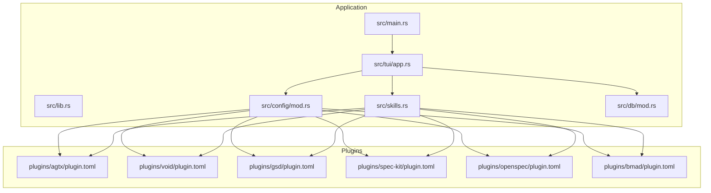
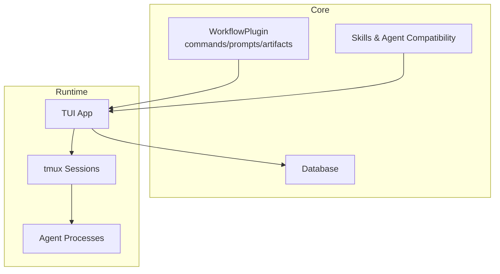
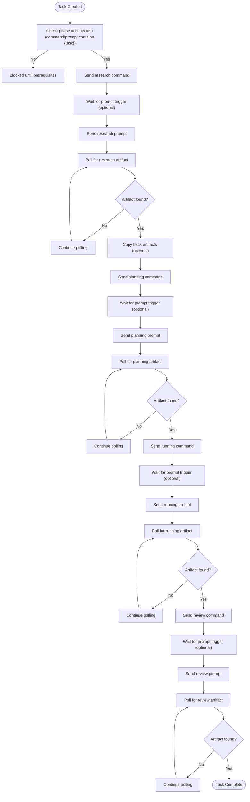
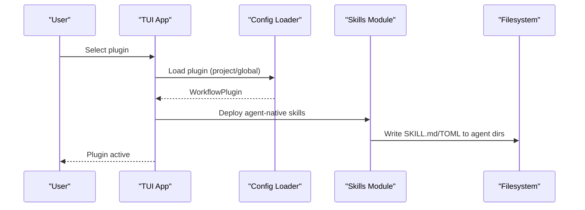
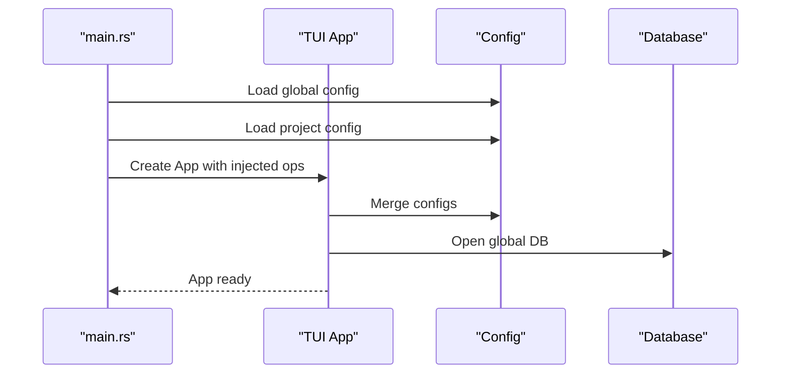
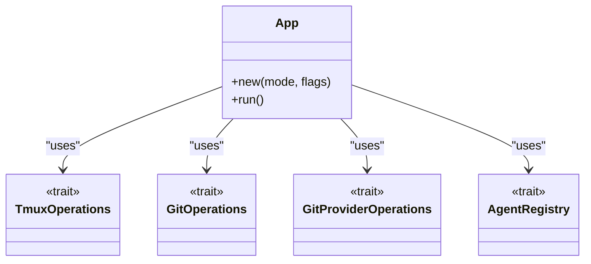
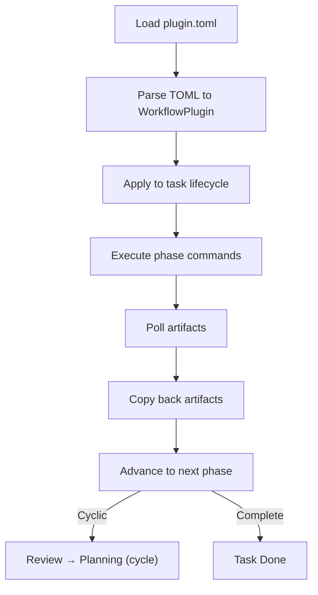
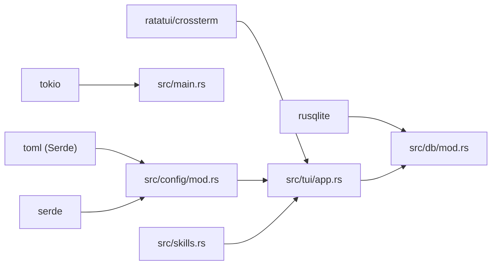

# Plugin Architecture

<cite>
**Referenced Files in This Document**
- [Cargo.toml](file://Cargo.toml)
- [README.md](file://README.md)
- [src/lib.rs](file://src/lib.rs)
- [src/main.rs](file://src/main.rs)
- [src/config/mod.rs](file://src/config/mod.rs)
- [src/skills.rs](file://src/skills.rs)
- [src/tui/app.rs](file://src/tui/app.rs)
- [src/db/mod.rs](file://src/db/mod.rs)
- [plugins/agtx/plugin.toml](file://plugins/agtx/plugin.toml)
- [plugins/void/plugin.toml](file://plugins/void/plugin.toml)
- [plugins/gsd/plugin.toml](file://plugins/gsd/plugin.toml)
- [plugins/spec-kit/plugin.toml](file://plugins/spec-kit/plugin.toml)
- [plugins/openspec/plugin.toml](file://plugins/openspec/plugin.toml)
- [plugins/bmad/plugin.toml](file://plugins/bmad/plugin.toml)
</cite>

## Table of Contents
1. [Introduction](#introduction)
2. [Project Structure](#project-structure)
3. [Core Components](#core-components)
4. [Architecture Overview](#architecture-overview)
5. [Detailed Component Analysis](#detailed-component-analysis)
6. [Dependency Analysis](#dependency-analysis)
7. [Performance Considerations](#performance-considerations)
8. [Troubleshooting Guide](#troubleshooting-guide)
9. [Conclusion](#conclusion)
10. [Appendices](#appendices)

## Introduction
This document explains AGTX’s plugin architecture that powers extensible workflow definition and integration with the main application. Plugins are TOML-based specifications that describe commands, prompts, artifacts, and lifecycle behaviors per phase. They integrate deeply with the TUI, tmux agent sessions, database-backed task state, and agent skill ecosystems. The system supports both bundled plugins (compiled in) and user-installed plugins (project- or globally-scoped). It also provides agent-specific command transformations, skill deployment, and orchestrator-friendly tooling via the MCP server.

## Project Structure
AGTX organizes plugin logic across several modules:
- Core application entrypoint and modes
- Configuration and plugin model
- Skills and agent compatibility helpers
- TUI integration and task lifecycle
- Database and persistence
- Built-in and third-party plugin definitions

**Diagram sources**
- [src/main.rs:1-228](file://src/main.rs#L1-L228)
- [src/lib.rs:1-24](file://src/lib.rs#L1-L24)
- [src/config/mod.rs:410-595](file://src/config/mod.rs#L410-L595)
- [src/skills.rs:141-194](file://src/skills.rs#L141-L194)
- [src/tui/app.rs:744-800](file://src/tui/app.rs#L744-L800)
- [src/db/mod.rs:1-6](file://src/db/mod.rs#L1-L6)
- [plugins/agtx/plugin.toml:1-16](file://plugins/agtx/plugin.toml#L1-L16)
- [plugins/void/plugin.toml:1-4](file://plugins/void/plugin.toml#L1-L4)
- [plugins/gsd/plugin.toml:1-34](file://plugins/gsd/plugin.toml#L1-L34)
- [plugins/spec-kit/plugin.toml:1-21](file://plugins/spec-kit/plugin.toml#L1-L21)
- [plugins/openspec/plugin.toml:1-21](file://plugins/openspec/plugin.toml#L1-L21)
- [plugins/bmad/plugin.toml:1-22](file://plugins/bmad/plugin.toml#L1-L22)

**Section sources**
- [src/main.rs:1-228](file://src/main.rs#L1-L228)
- [src/lib.rs:1-24](file://src/lib.rs#L1-L24)
- [src/config/mod.rs:410-595](file://src/config/mod.rs#L410-L595)
- [src/skills.rs:141-194](file://src/skills.rs#L141-L194)
- [src/tui/app.rs:744-800](file://src/tui/app.rs#L744-L800)
- [src/db/mod.rs:1-6](file://src/db/mod.rs#L1-L6)
- [plugins/agtx/plugin.toml:1-16](file://plugins/agtx/plugin.toml#L1-L16)
- [plugins/void/plugin.toml:1-4](file://plugins/void/plugin.toml#L1-L4)
- [plugins/gsd/plugin.toml:1-34](file://plugins/gsd/plugin.toml#L1-L34)
- [plugins/spec-kit/plugin.toml:1-21](file://plugins/spec-kit/plugin.toml#L1-L21)
- [plugins/openspec/plugin.toml:1-21](file://plugins/openspec/plugin.toml#L1-L21)
- [plugins/bmad/plugin.toml:1-22](file://plugins/bmad/plugin.toml#L1-L22)

## Core Components
- Plugin model: Describes commands, prompts, artifacts, copy-back rules, and agent compatibility.
- Configuration loader: Loads project- or global plugin definitions and merges with defaults.
- Skills and agent compatibility: Embeds built-in skills, transforms commands per agent, and deploys skills to agent-native locations.
- TUI integration: Drives task lifecycle, invokes plugin commands, polls for artifacts, and updates state.
- Database: Persists task state, transitions, and related metadata.
- MCP server: Exposes tools for orchestrator agents and external integrations.

**Section sources**
- [src/config/mod.rs:410-595](file://src/config/mod.rs#L410-L595)
- [src/skills.rs:141-194](file://src/skills.rs#L141-L194)
- [src/tui/app.rs:744-800](file://src/tui/app.rs#L744-L800)
- [src/db/mod.rs:1-6](file://src/db/mod.rs#L1-L6)
- [README.md:329-504](file://README.md#L329-L504)

## Architecture Overview
The plugin architecture centers on a declarative WorkflowPlugin model that defines:
- Commands per phase (sent via tmux)
- Prompts per phase (sent after command execution)
- Artifact detection (polling for file presence)
- Optional pre-research fallback and cyclic transitions
- Agent compatibility and command transformations
- Skill deployment and agent-native discovery

**Diagram sources**
- [src/config/mod.rs:410-595](file://src/config/mod.rs#L410-L595)
- [src/skills.rs:35-115](file://src/skills.rs#L35-L115)
- [src/tui/app.rs:744-800](file://src/tui/app.rs#L744-L800)

## Detailed Component Analysis

### Plugin Model and Lifecycle
- Declarative configuration: Each plugin is a TOML file defining commands, prompts, artifacts, copy-back rules, and optional pre-research and cyclic behaviors.
- Loading order: Project-local plugins override global ones; missing plugins fall back to compiled-in bundles.
- Lifecycle stages: Research → Planning → Running → Review; optional pre-research; optional cycling back to Planning from Review.
- Gatekeeping: A phase can be entered from Backlog only if its command or prompt contains the task template, ensuring proper prerequisite fulfillment.

**Diagram sources**
- [src/config/mod.rs:512-543](file://src/config/mod.rs#L512-L543)
- [README.md:476-490](file://README.md#L476-L490)

**Section sources**
- [src/config/mod.rs:410-595](file://src/config/mod.rs#L410-L595)
- [README.md:476-490](file://README.md#L476-L490)

### Plugin Registration and Discovery
- Compiled-in bundles: The skills module embeds plugin TOML content and exposes a loader for bundled plugins.
- Runtime discovery: The TUI loads the active plugin configuration and merges it with project/global settings.
- Agent-native skills: Built-in skills are deployed to agent-specific directories and can be overridden by plugin-provided skills.

**Diagram sources**
- [src/skills.rs:141-194](file://src/skills.rs#L141-L194)
- [src/config/mod.rs:545-595](file://src/config/mod.rs#L545-L595)
- [src/tui/app.rs:744-800](file://src/tui/app.rs#L744-L800)

**Section sources**
- [src/skills.rs:141-194](file://src/skills.rs#L141-L194)
- [src/config/mod.rs:545-595](file://src/config/mod.rs#L545-L595)
- [src/tui/app.rs:744-800](file://src/tui/app.rs#L744-L800)

### Configuration Parsing and Runtime Initialization
- Configuration layers: Global config, project config, and plugin config are merged to produce runtime behavior.
- Initialization: On startup, the app detects available agents, loads configs, and initializes the TUI with injected operations for tmux, git, and agent registry.

**Diagram sources**
- [src/main.rs:16-96](file://src/main.rs#L16-L96)
- [src/tui/app.rs:749-800](file://src/tui/app.rs#L749-L800)
- [src/config/mod.rs:337-408](file://src/config/mod.rs#L337-L408)

**Section sources**
- [src/main.rs:16-96](file://src/main.rs#L16-L96)
- [src/tui/app.rs:749-800](file://src/tui/app.rs#L749-L800)
- [src/config/mod.rs:337-408](file://src/config/mod.rs#L337-L408)

### Relationship to Core System: Services and Integration Patterns
- Dependency injection: The TUI accepts injectable traits for tmux, git, and agent operations, enabling testability and modularity.
- Database integration: Tasks, transitions, and status caches persist state and drive UI updates.
- Agent compatibility: Command transformations ensure canonical plugin commands map to agent-native invocation formats.

**Diagram sources**
- [src/tui/app.rs:744-800](file://src/tui/app.rs#L744-L800)

**Section sources**
- [src/tui/app.rs:744-800](file://src/tui/app.rs#L744-L800)

### Plugin Lifecycle Management
- Loading: Project-local plugin.toml is preferred; otherwise global plugin.toml is used.
- Configuration parsing: TOML deserializes into WorkflowPlugin with optional fields for agents, artifacts, commands, prompts, triggers, copy-back rules, and auto-dismiss.
- Runtime initialization: The TUI applies plugin behavior to task lifecycle, including pre-research fallback, cyclic transitions, and artifact polling.
- Cleanup: Worktree cleanup scripts and auto-cleanup policies are respected when tasks complete or are removed.

**Diagram sources**
- [src/config/mod.rs:545-595](file://src/config/mod.rs#L545-L595)
- [README.md:476-490](file://README.md#L476-L490)

**Section sources**
- [src/config/mod.rs:545-595](file://src/config/mod.rs#L545-L595)
- [README.md:476-490](file://README.md#L476-L490)

### Plugin Interfaces, Events, and State
- Plugin interface contract: WorkflowPlugin defines commands, prompts, artifacts, triggers, copy-back, and auto-dismiss rules.
- Event handling: The TUI listens for phase completion signals, idle detection, and orchestrator notifications to drive transitions.
- State management: The app maintains caches for phase status, pane content hashes, and orchestrator readiness to coordinate actions.

**Section sources**
- [src/config/mod.rs:410-595](file://src/config/mod.rs#L410-L595)
- [src/tui/app.rs:520-560](file://src/tui/app.rs#L520-L560)

### Examples: TUI, Database, and Agent Interactions
- TUI integration: The TUI renders plugin options, manages wizard flows, and drives transitions based on plugin rules.
- Database: The app persists tasks, statuses, and transition requests; status polling updates UI and orchestrator notifications.
- Agent interactions: Commands are sent via tmux to agent panes; skills are deployed to agent-native discovery paths; prompt triggers and auto-dismiss rules improve reliability.

**Section sources**
- [src/tui/app.rs:744-800](file://src/tui/app.rs#L744-L800)
- [src/db/mod.rs:1-6](file://src/db/mod.rs#L1-L6)
- [src/skills.rs:35-115](file://src/skills.rs#L35-L115)

### Plugin Isolation, Security, and Resource Management
- Isolation: Each task runs in its own tmux session/window and git worktree, minimizing cross-task interference.
- Security: Plugins are declarative TOML files; command transformations prevent arbitrary shell injection. Auto-dismiss rules are constrained to detect-and-send sequences.
- Resource management: Worktree creation, copy-back, and cleanup scripts ensure efficient use of disk and agent resources.

**Section sources**
- [README.md:566-572](file://README.md#L566-L572)
- [src/config/mod.rs:545-595](file://src/config/mod.rs#L545-L595)

## Dependency Analysis
- External dependencies include serialization (Toml, Serde), async runtime (Tokio), terminal UI (Ratatui/Crossterm), and SQLite for persistence.
- Internal dependencies: The TUI depends on config, skills, tmux, git, and db modules; the skills module depends on plugin TOML content; the config module depends on plugin definitions.

**Diagram sources**
- [Cargo.toml:12-38](file://Cargo.toml#L12-L38)
- [src/config/mod.rs:410-595](file://src/config/mod.rs#L410-L595)
- [src/skills.rs:141-194](file://src/skills.rs#L141-L194)
- [src/tui/app.rs:744-800](file://src/tui/app.rs#L744-L800)
- [src/db/mod.rs:1-6](file://src/db/mod.rs#L1-L6)

**Section sources**
- [Cargo.toml:12-38](file://Cargo.toml#L12-L38)
- [src/config/mod.rs:410-595](file://src/config/mod.rs#L410-L595)
- [src/skills.rs:141-194](file://src/skills.rs#L141-L194)
- [src/tui/app.rs:744-800](file://src/tui/app.rs#L744-L800)
- [src/db/mod.rs:1-6](file://src/db/mod.rs#L1-L6)

## Performance Considerations
- Artifact polling: Efficiently poll for file presence rather than continuously capturing pane content.
- Idle detection: Use pane content hashing to minimize expensive comparisons.
- Background refresh: Offload tmux status polling to background threads and communicate via channels.
- Command transformations: Cache agent-native skill directories and transformed commands to reduce repeated filesystem scans.

## Troubleshooting Guide
- Plugin not found: Verify plugin.toml exists in project-local or global path; ensure the plugin name matches the directory name.
- Agent compatibility: Confirm the plugin lists supported agents or leave the list empty to allow all agents.
- Prompt triggers: If a command expects an interactive prompt, configure the trigger to avoid premature prompt sending.
- Auto-dismiss rules: Ensure detect patterns are present in the pane content; verify response keystrokes match the agent’s UI.
- Worktree issues: Check init/cleanup scripts and copy-back rules; ensure paths are correct and accessible.

**Section sources**
- [src/config/mod.rs:545-595](file://src/config/mod.rs#L545-L595)
- [README.md:476-490](file://README.md#L476-L490)

## Conclusion
AGTX’s plugin architecture provides a robust, declarative foundation for building and integrating spec-driven workflows. Through a clear separation of concerns—configuration, skills, TUI, tmux, and database—the system enables flexible customization while maintaining strong isolation and resource management. Developers can author plugins with minimal code, relying on TOML to define commands, prompts, and artifacts, and leverage agent compatibility helpers to ensure broad interoperability.

## Appendices

### Built-in Plugins Reference
- agtx: Default workflow with skills and prompts.
- agtx-terse: Token-efficient variant of the default workflow.
- gsd: Get Shit Done framework with pre-research and auto-dismiss rules.
- spec-kit: GitHub’s Spec-Driven Development with project-level copy directories.
- openspec: Lightweight AI-guided specification with copy-back rules.
- bmad: BMAD Method with structured phases and output directories.
- void: Plain agent session without prompting or skills.
- oh-my-claudecode and agent-skills: Additional community plugins.

**Section sources**
- [plugins/agtx/plugin.toml:1-16](file://plugins/agtx/plugin.toml#L1-L16)
- [plugins/void/plugin.toml:1-4](file://plugins/void/plugin.toml#L1-L4)
- [plugins/gsd/plugin.toml:1-34](file://plugins/gsd/plugin.toml#L1-L34)
- [plugins/spec-kit/plugin.toml:1-21](file://plugins/spec-kit/plugin.toml#L1-L21)
- [plugins/openspec/plugin.toml:1-21](file://plugins/openspec/plugin.toml#L1-L21)
- [plugins/bmad/plugin.toml:1-22](file://plugins/bmad/plugin.toml#L1-L22)
- [README.md:329-367](file://README.md#L329-L367)