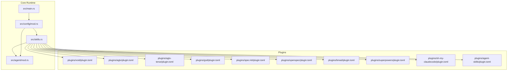
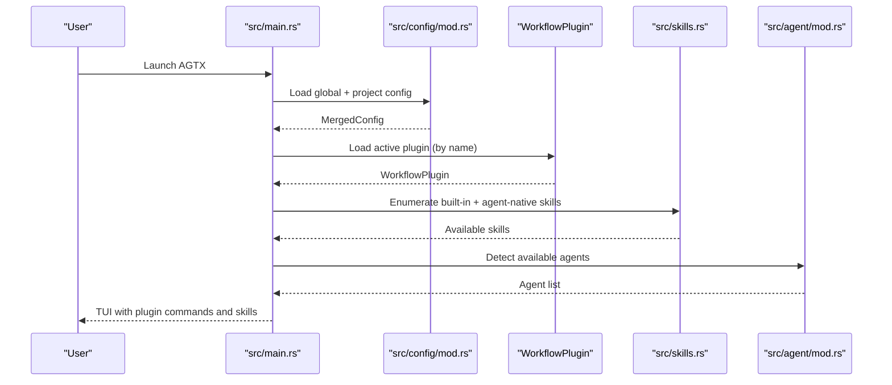
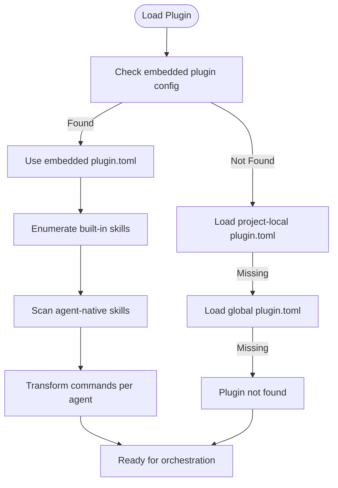
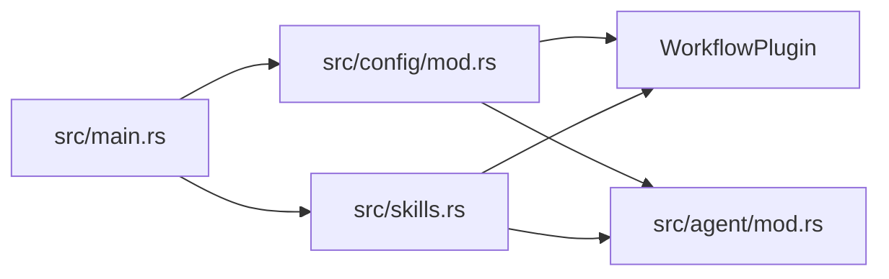

# Plugin System

<cite>
**Referenced Files in This Document**
- [README.md](file://README.md)
- [AGENTS.md](file://AGENTS.md)
- [CLAUDE.md](file://CLAUDE.md)
- [CONTRIBUTING.md](file://CONTRIBUTING.md)
- [install.sh](file://install.sh)
- [plugins/void/plugin.toml](file://plugins/void/plugin.toml)
- [plugins/agtx/plugin.toml](file://plugins/agtx/plugin.toml)
- [plugins/agtx-terse/plugin.toml](file://plugins/agtx-terse/plugin.toml)
- [plugins/gsd/plugin.toml](file://plugins/gsd/plugin.toml)
- [plugins/spec-kit/plugin.toml](file://plugins/spec-kit/plugin.toml)
- [plugins/openspec/plugin.toml](file://plugins/openspec/plugin.toml)
- [plugins/bmad/plugin.toml](file://plugins/bmad/plugin.toml)
- [plugins/superpowers/plugin.toml](file://plugins/superpowers/plugin.toml)
- [plugins/oh-my-claudecode/plugin.toml](file://plugins/oh-my-claudecode/plugin.toml)
- [plugins/agent-skills/plugin.toml](file://plugins/agent-skills/plugin.toml)
- [src/lib.rs](file://src/lib.rs)
- [src/main.rs](file://src/main.rs)
- [src/config/mod.rs](file://src/config/mod.rs)
- [src/agent/mod.rs](file://src/agent/mod.rs)
- [src/skills.rs](file://src/skills.rs)
</cite>

## Table of Contents
1. [Introduction](#introduction)
2. [Project Structure](#project-structure)
3. [Core Components](#core-components)
4. [Architecture Overview](#architecture-overview)
5. [Detailed Component Analysis](#detailed-component-analysis)
6. [Dependency Analysis](#dependency-analysis)
7. [Performance Considerations](#performance-considerations)
8. [Troubleshooting Guide](#troubleshooting-guide)
9. [Conclusion](#conclusion)
10. [Appendices](#appendices)

## Introduction
This document explains AGTX’s plugin system and how it enables extensible, spec-driven workflows. Plugins define custom task phases, commands, prompts, and artifacts, and integrate with the core AGTX runtime to orchestrate agent interactions. Built-in plugins demonstrate different methodologies (e.g., GSD, Spec Kit, OpenSpec, BMAD, Superpowers, oh-my-claudecode, agent-skills) and show how to configure workflows for various development approaches. The guide also covers the plugin configuration format, skill deployment, best practices, testing, distribution, and troubleshooting.

## Project Structure
The plugin system centers around:
- Built-in plugin configurations under plugins/<name>/plugin.toml
- Core runtime configuration and plugin loading in src/config/mod.rs
- Agent integration and skill discovery in src/agent/mod.rs and src/skills.rs
- Application entrypoint and orchestration in src/main.rs

**Diagram sources**
- [src/main.rs:1-228](file://src/main.rs#L1-L228)
- [src/config/mod.rs:410-595](file://src/config/mod.rs#L410-L595)
- [src/skills.rs:141-194](file://src/skills.rs#L141-L194)
- [src/agent/mod.rs:10-171](file://src/agent/mod.rs#L10-L171)
- [plugins/void/plugin.toml:1-4](file://plugins/void/plugin.toml#L1-L4)
- [plugins/agtx/plugin.toml:1-16](file://plugins/agtx/plugin.toml#L1-L16)
- [plugins/agtx-terse/plugin.toml:1-16](file://plugins/agtx-terse/plugin.toml#L1-L16)
- [plugins/gsd/plugin.toml:1-34](file://plugins/gsd/plugin.toml#L1-L34)
- [plugins/spec-kit/plugin.toml:1-21](file://plugins/spec-kit/plugin.toml#L1-L21)
- [plugins/openspec/plugin.toml:1-21](file://plugins/openspec/plugin.toml#L1-L21)
- [plugins/bmad/plugin.toml:1-22](file://plugins/bmad/plugin.toml#L1-L22)
- [plugins/superpowers/plugin.toml:1-16](file://plugins/superpowers/plugin.toml#L1-L16)
- [plugins/oh-my-claudecode/plugin.toml:1-41](file://plugins/oh-my-claudecode/plugin.toml#L1-L41)
- [plugins/agent-skills/plugin.toml:1-19](file://plugins/agent-skills/plugin.toml#L1-L19)

**Section sources**
- [src/main.rs:1-228](file://src/main.rs#L1-L228)
- [src/config/mod.rs:410-595](file://src/config/mod.rs#L410-L595)
- [src/skills.rs:141-194](file://src/skills.rs#L141-L194)
- [src/agent/mod.rs:10-171](file://src/agent/mod.rs#L10-L171)

## Core Components
- WorkflowPlugin: Describes a plugin’s metadata, supported agents, artifact paths, commands, prompts, triggers, copy-back rules, and auto-dismiss behavior. It also exposes helpers to check task gating and agent support.
- Plugin configuration loader: Loads plugin.toml from project-local or global locations, with precedence for project-local.
- Agent integration: Provides agent detection, availability, and command construction tailored to each agent’s CLI.
- Skill deployment: Embeds built-in plugin configurations and default skills, and exposes functions to discover agent-native skills and convert them to commands.

Key responsibilities:
- Merge global and project configuration to determine effective workflow and agent overrides.
- Resolve agent-specific command formats for plugin-provided canonical commands.
- Manage artifact paths and copy-back semantics to keep the project root synchronized with worktree outputs.

**Section sources**
- [src/config/mod.rs:410-595](file://src/config/mod.rs#L410-L595)
- [src/config/mod.rs:337-408](file://src/config/mod.rs#L337-L408)
- [src/agent/mod.rs:10-171](file://src/agent/mod.rs#L10-L171)
- [src/skills.rs:141-194](file://src/skills.rs#L141-L194)
- [src/skills.rs:23-55](file://src/skills.rs#L23-L55)

## Architecture Overview
The plugin system integrates with AGTX through a layered design:
- Configuration layer: Reads and merges global and project settings, selects the active workflow plugin, and applies agent overrides.
- Orchestration layer: Uses plugin-defined commands and prompts to drive tmux panes and agent sessions.
- Skill layer: Deploys built-in skills and scans agent-native skills, converting them to commands for each agent.
- Persistence layer: Manages artifacts and copy-back rules to maintain a coherent project state across phases.

**Diagram sources**
- [src/main.rs:1-228](file://src/main.rs#L1-L228)
- [src/config/mod.rs:337-408](file://src/config/mod.rs#L337-L408)
- [src/config/mod.rs:545-572](file://src/config/mod.rs#L545-L572)
- [src/skills.rs:23-55](file://src/skills.rs#L23-L55)
- [src/skills.rs:213-226](file://src/skills.rs#L213-L226)
- [src/agent/mod.rs:124-130](file://src/agent/mod.rs#L124-L130)

## Detailed Component Analysis

### Built-in Plugins Overview
Each built-in plugin defines a workflow with commands, prompts, artifacts, and optional agent-specific behaviors. Below are the capabilities and typical use cases:

- void
  - Plain agent session without prompting or skills.
  - Use when you want to bypass AGTX orchestration and run the agent directly.
  - [plugins/void/plugin.toml:1-4](file://plugins/void/plugin.toml#L1-L4)

- agtx
  - Full four-phase workflow with Research, Planning, Running, Review.
  - Artifacts stored under .agtx/; commands mapped to internal skills.
  - Use for standard spec-to-ship lifecycle with integrated skills.
  - [plugins/agtx/plugin.toml:1-16](file://plugins/agtx/plugin.toml#L1-L16)

- agtx-terse
  - Token-efficient variant of agtx with compressed output.
  - Use when minimizing token usage is a priority while keeping the same phases.
  - [plugins/agtx-terse/plugin.toml:1-16](file://plugins/agtx-terse/plugin.toml#L1-L16)

- gsd
  - Get Shit Done framework with structured phases and pre-research steps.
  - Copies planning assets; supports multiple agents; includes auto-dismiss rules.
  - Use for disciplined, spec-driven delivery with phase gates.
  - [plugins/gsd/plugin.toml:1-34](file://plugins/gsd/plugin.toml#L1-L34)

- spec-kit
  - Spec-Driven Development by GitHub; specifications become executable artifacts.
  - Copies .specify directory; defines artifact paths for spec and plan.
  - Use when adopting GitHub’s spec-kit toolchain.
  - [plugins/spec-kit/plugin.toml:1-21](file://plugins/spec-kit/plugin.toml#L1-L21)

- openspec
  - Lightweight AI-guided specification framework.
  - Copies openspec directory; defines proposal and task artifacts.
  - Use for quick, iterative specification and change proposals.
  - [plugins/openspec/plugin.toml:1-21](file://plugins/openspec/plugin.toml#L1-L21)

- bmad
  - BMAD Method for AI-driven agile development.
  - Installs via init_script; copies _bmad and _bmad-output directories.
  - Use for structured PRD-to-implementation pipelines.
  - [plugins/bmad/plugin.toml:1-22](file://plugins/bmad/plugin.toml#L1-L22)

- superpowers
  - Superpowers by @obra with brainstorming, plans, TDD, and subagent-driven development.
  - Supports specific agents; copies docs/superpowers artifacts.
  - Use for exploratory design and team-aligned planning.
  - [plugins/superpowers/plugin.toml:1-16](file://plugins/superpowers/plugin.toml#L1-L16)

- oh-my-claudecode
  - Multi-agent orchestration with 37 skills and 22 specialized agents.
  - Initializes .omc directories; manages specs/plans/prd artifacts.
  - Use for complex, autonomous pipelines spanning multiple phases.
  - [plugins/oh-my-claudecode/plugin.toml:1-41](file://plugins/oh-my-claudecode/plugin.toml#L1-L41)

- agent-skills
  - Production-grade engineering skills covering the full lifecycle.
  - Installs via marketplace for supported agents; defines slash commands and prompts.
  - Use for standardized spec-to-ship automation with curated skills.
  - [plugins/agent-skills/plugin.toml:1-19](file://plugins/agent-skills/plugin.toml#L1-L19)

**Section sources**
- [plugins/void/plugin.toml:1-4](file://plugins/void/plugin.toml#L1-L4)
- [plugins/agtx/plugin.toml:1-16](file://plugins/agtx/plugin.toml#L1-L16)
- [plugins/agtx-terse/plugin.toml:1-16](file://plugins/agtx-terse/plugin.toml#L1-L16)
- [plugins/gsd/plugin.toml:1-34](file://plugins/gsd/plugin.toml#L1-L34)
- [plugins/spec-kit/plugin.toml:1-21](file://plugins/spec-kit/plugin.toml#L1-L21)
- [plugins/openspec/plugin.toml:1-21](file://plugins/openspec/plugin.toml#L1-L21)
- [plugins/bmad/plugin.toml:1-22](file://plugins/bmad/plugin.toml#L1-L22)
- [plugins/superpowers/plugin.toml:1-16](file://plugins/superpowers/plugin.toml#L1-L16)
- [plugins/oh-my-claudecode/plugin.toml:1-41](file://plugins/oh-my-claudecode/plugin.toml#L1-L41)
- [plugins/agent-skills/plugin.toml:1-19](file://plugins/agent-skills/plugin.toml#L1-L19)

### Plugin Configuration Format (plugin.toml)
The plugin configuration schema supports the following top-level keys:

- name: Plugin identifier.
- description: Human-readable description.
- init_script: Optional shell command to run in worktrees after setup.
- supported_agents: Optional list of agent names this plugin targets.
- cyclic: Enables Review → Planning transitions for multi-phase workflows.
- clear_context_on_advance: Sends a “clear context” command before phase transitions (e.g., Claude’s /clear).
- copy_dirs: Directories to copy from project root into worktrees.
- copy_files: Files to copy from project root into worktrees.
- copy_back: Map of phase to list of files/dirs to copy back to project root after completion.
- auto_dismiss: List of rules to auto-dismiss interactive prompts in tmux panes.
- artifacts: Artifact path templates per phase (preresearch, research, planning, running, review).
- commands: Slash commands per phase; canonical format is /namespace:command.
- prompts: Prompt text per phase; can include {task}.
- prompt_triggers: Text to wait for before sending prompts in interactive commands.

Helper behaviors:
- phase_accepts_task: Determines whether a phase can accept task context directly (requires {task} in command or prompt).
- supports_agent: Checks agent compatibility against supported_agents.
- load: Loads plugin.toml from project-local or global locations.
- plugin_dir: Resolves plugin directory path for skill discovery.

Practical guidance:
- Use artifacts to define phase completion signals and outputs.
- Use commands to invoke agent-native skills or framework-specific actions.
- Use prompts to provide task context; include {task} when phases depend on backlog entry.
- Use copy_back to persist intermediate results to the project root for downstream tasks.
- Use auto_dismiss to automate repetitive interactive prompts.

**Section sources**
- [src/config/mod.rs:410-595](file://src/config/mod.rs#L410-L595)
- [src/config/mod.rs:512-544](file://src/config/mod.rs#L512-L544)
- [src/config/mod.rs:545-572](file://src/config/mod.rs#L545-L572)

### Skill Deployment System
AGTX embeds built-in plugin configurations and default skills. It also discovers agent-native skills and converts them to commands for each agent:

- Embedded plugins: BUNDLED_PLUGINS enumerates plugin names, descriptions, and embedded plugin.toml content.
- Default skills: BUILTIN_SKILLS lists internal skill directory names and their content.
- Agent-native discovery:
  - Claude/Gemini: Scans namespaced directories for .md or .toml command files.
  - Codex: Scans .codex/skills for SKILL.md.
  - Cursor/OpenCode: Scans flat or namespaced directories for .md files.
- Command transformation:
  - Canonical commands are /namespace:command.
  - Transformed per agent: opencode replaces : with -, codex prefixes $ and replaces :, cursor keeps / and replaces : with -.
- Frontmatter extraction: Strips YAML frontmatter for descriptions and content normalization.

**Diagram sources**
- [src/skills.rs:141-194](file://src/skills.rs#L141-L194)
- [src/skills.rs:23-55](file://src/skills.rs#L23-L55)
- [src/skills.rs:213-226](file://src/skills.rs#L213-L226)
- [src/skills.rs:83-115](file://src/skills.rs#L83-L115)

**Section sources**
- [src/skills.rs:141-194](file://src/skills.rs#L141-L194)
- [src/skills.rs:23-55](file://src/skills.rs#L23-L55)
- [src/skills.rs:213-226](file://src/skills.rs#L213-L226)
- [src/skills.rs:83-115](file://src/skills.rs#L83-L115)

### Practical Examples by Methodology
- GSD (Get Shit Done)
  - Use preresearch command to initialize planning assets.
  - Define research/planning/running/review artifacts to gate transitions.
  - Configure copy_back to bring planning documents into the project root.
  - Reference: [plugins/gsd/plugin.toml:1-34](file://plugins/gsd/plugin.toml#L1-L34)

- Spec Kit
  - Copy .specify directory into worktrees.
  - Define spec and plan artifacts to mark phase completion.
  - Reference: [plugins/spec-kit/plugin.toml:1-21](file://plugins/spec-kit/plugin.toml#L1-L21)

- OpenSpec
  - Copy openspec directory; define proposal and task artifacts.
  - Reference: [plugins/openspec/plugin.toml:1-21](file://plugins/openspec/plugin.toml#L1-L21)

- BMAD
  - Use init_script to install BMAD; copy _bmad and _bmad-output directories.
  - Reference: [plugins/bmad/plugin.toml:1-22](file://plugins/bmad/plugin.toml#L1-L22)

- Superpowers
  - Target specific agents; copy docs/superpowers artifacts.
  - Reference: [plugins/superpowers/plugin.toml:1-16](file://plugins/superpowers/plugin.toml#L1-L16)

- Oh My ClaudeCode
  - Initialize .omc directories; manage specs/plans/prd artifacts.
  - Reference: [plugins/oh-my-claudecode/plugin.toml:1-41](file://plugins/oh-my-claudecode/plugin.toml#L1-L41)

- Agent Skills
  - Install via marketplace for supported agents; define slash commands and prompts.
  - Reference: [plugins/agent-skills/plugin.toml:1-19](file://plugins/agent-skills/plugin.toml#L1-L19)

**Section sources**
- [plugins/gsd/plugin.toml:1-34](file://plugins/gsd/plugin.toml#L1-L34)
- [plugins/spec-kit/plugin.toml:1-21](file://plugins/spec-kit/plugin.toml#L1-L21)
- [plugins/openspec/plugin.toml:1-21](file://plugins/openspec/plugin.toml#L1-L21)
- [plugins/bmad/plugin.toml:1-22](file://plugins/bmad/plugin.toml#L1-L22)
- [plugins/superpowers/plugin.toml:1-16](file://plugins/superpowers/plugin.toml#L1-L16)
- [plugins/oh-my-claudecode/plugin.toml:1-41](file://plugins/oh-my-claudecode/plugin.toml#L1-L41)
- [plugins/agent-skills/plugin.toml:1-19](file://plugins/agent-skills/plugin.toml#L1-L19)

### Best Practices for Plugin Development
- Keep commands canonical (/namespace:command) and agent-convertible.
- Use {task} in commands or prompts to enable backlog entry.
- Define clear artifact paths to gate phase transitions.
- Prefer copy_back to preserve outputs in the project root.
- Use supported_agents to constrain compatibility.
- Include init_script for one-time setup in worktrees.
- Provide prompt_triggers for interactive commands that require user input.
- Use cyclic for multi-pass workflows that loop back to planning after review.

**Section sources**
- [src/config/mod.rs:410-595](file://src/config/mod.rs#L410-L595)

### Testing Strategies
- Unit tests for configuration merging and plugin loading.
- Integration tests for agent command transformation and skill discovery.
- End-to-end tests validating phase gating via artifact files and prompt triggers.
- Compatibility tests across supported agents.

[No sources needed since this section provides general guidance]

### Distribution Methods
- Bundle plugins at compile time (embedded plugin.toml and skills).
- Allow project-local overrides for customization.
- Support global installation for shared plugins.
- Provide marketplace installation instructions for agent-specific plugins.

**Section sources**
- [src/skills.rs:141-194](file://src/skills.rs#L141-L194)
- [plugins/agent-skills/plugin.toml:1-19](file://plugins/agent-skills/plugin.toml#L1-L19)

## Dependency Analysis
The plugin system exhibits clear separation of concerns:
- Configuration layer depends on plugin definitions and project settings.
- Agent layer depends on detected CLI availability and command formats.
- Skill layer depends on plugin commands and agent-native formats.
- Runtime orchestrates transitions based on artifacts and prompts.

**Diagram sources**
- [src/config/mod.rs:410-595](file://src/config/mod.rs#L410-L595)
- [src/skills.rs:141-194](file://src/skills.rs#L141-L194)
- [src/agent/mod.rs:10-171](file://src/agent/mod.rs#L10-L171)
- [src/main.rs:1-228](file://src/main.rs#L1-228)

**Section sources**
- [src/config/mod.rs:410-595](file://src/config/mod.rs#L410-L595)
- [src/skills.rs:141-194](file://src/skills.rs#L141-L194)
- [src/agent/mod.rs:10-171](file://src/agent/mod.rs#L10-L171)
- [src/main.rs:1-228](file://src/main.rs#L1-228)

## Performance Considerations
- Minimize token usage by using concise prompts and terse workflows (e.g., agtx-terse).
- Limit artifact scanning by using precise glob patterns.
- Reduce unnecessary file copies by leveraging copy_files and copy_back selectively.
- Use prompt_triggers to avoid redundant polling and improve responsiveness.

[No sources needed since this section provides general guidance]

## Troubleshooting Guide
Common issues and resolutions:
- Plugin not found
  - Verify plugin name and presence in project-local or global plugin directories.
  - Confirm plugin.toml exists and is valid TOML.
  - References: [src/config/mod.rs:545-572](file://src/config/mod.rs#L545-L572)

- Agent not detected or unavailable
  - Ensure agent CLI is installed and on PATH.
  - Check agent availability and command construction.
  - References: [src/agent/mod.rs:124-130](file://src/agent/mod.rs#L124-L130), [src/agent/mod.rs:31-76](file://src/agent/mod.rs#L31-L76)

- Commands not invoking skills
  - Confirm canonical command format (/namespace:command) and agent-specific transformation.
  - Verify agent-native skill directories and filenames.
  - References: [src/skills.rs:83-115](file://src/skills.rs#L83-L115), [src/skills.rs:259-408](file://src/skills.rs#L259-L408)

- Artifacts not gating phases
  - Ensure artifact paths match the expected patterns and are writable.
  - Validate copy_back rules to confirm artifacts reach the project root.
  - References: [src/config/mod.rs:464-472](file://src/config/mod.rs#L464-L472), [src/config/mod.rs:443-446](file://src/config/mod.rs#L443-L446)

- Interactive prompts stuck
  - Add auto_dismiss rules to detect and respond to interactive prompts.
  - References: [src/config/mod.rs:453-462](file://src/config/mod.rs#L453-L462), [plugins/gsd/plugin.toml:31-34](file://plugins/gsd/plugin.toml#L31-L34)

- Task gating failures
  - Ensure {task} is present in commands or prompts for phases that accept backlog tasks.
  - References: [src/config/mod.rs:512-537](file://src/config/mod.rs#L512-L537)

**Section sources**
- [src/config/mod.rs:545-572](file://src/config/mod.rs#L545-L572)
- [src/agent/mod.rs:124-130](file://src/agent/mod.rs#L124-L130)
- [src/agent/mod.rs:31-76](file://src/agent/mod.rs#L31-L76)
- [src/skills.rs:83-115](file://src/skills.rs#L83-L115)
- [src/skills.rs:259-408](file://src/skills.rs#L259-L408)
- [src/config/mod.rs:464-472](file://src/config/mod.rs#L464-L472)
- [src/config/mod.rs:443-446](file://src/config/mod.rs#L443-L446)
- [src/config/mod.rs:453-462](file://src/config/mod.rs#L453-L462)
- [plugins/gsd/plugin.toml:31-34](file://plugins/gsd/plugin.toml#L31-L34)
- [src/config/mod.rs:512-537](file://src/config/mod.rs#L512-L537)

## Conclusion
AGTX’s plugin system provides a robust, extensible foundation for building spec-driven workflows. By defining commands, prompts, artifacts, and agent-specific behaviors in plugin.toml, teams can tailor AGTX to diverse methodologies and frameworks. The embedded skill deployment and agent-aware command transformation streamline integration, while copy_back and artifact gating ensure predictable, reproducible outcomes across phases.

[No sources needed since this section summarizes without analyzing specific files]

## Appendices

### Appendix A: Agent Compatibility Matrix
- Supported agents per plugin are declared via supported_agents. When absent, plugins assume compatibility with all agents.
- Agent-specific command transformations ensure canonical commands work across agents.

**Section sources**
- [src/config/mod.rs:416-419](file://src/config/mod.rs#L416-L419)
- [src/skills.rs:83-115](file://src/skills.rs#L83-L115)

### Appendix B: Installation and Setup
- Install AGTX and configure agents using the provided scripts and documentation.
- Use marketplace or manual installation for agent-specific plugins (e.g., agent-skills, oh-my-claudecode).

**Section sources**
- [install.sh](file://install.sh)
- [AGENTS.md](file://AGENTS.md)
- [CLAUDE.md](file://CLAUDE.md)
- [CONTRIBUTING.md](file://CONTRIBUTING.md)
- [README.md](file://README.md)