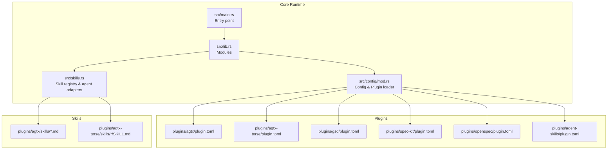
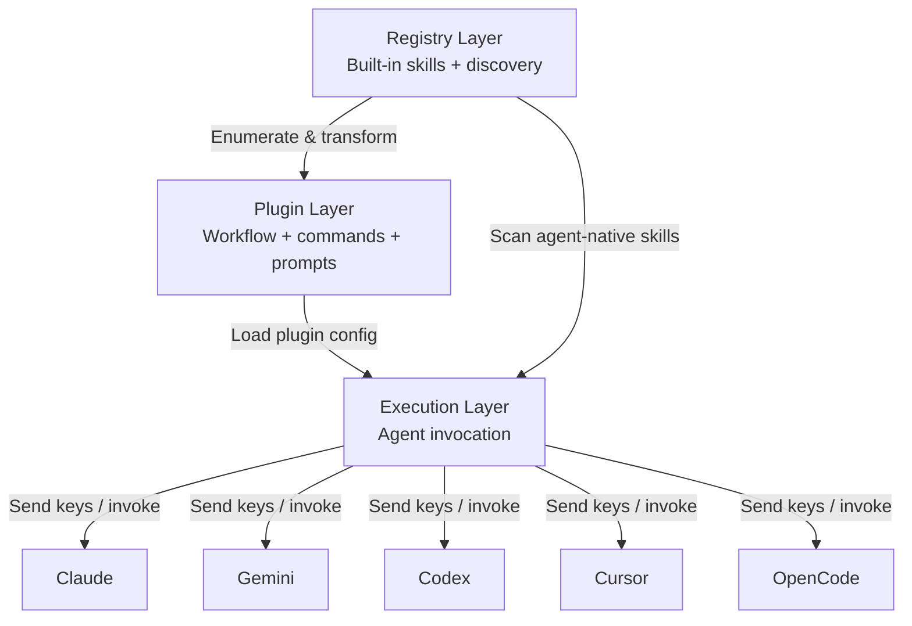
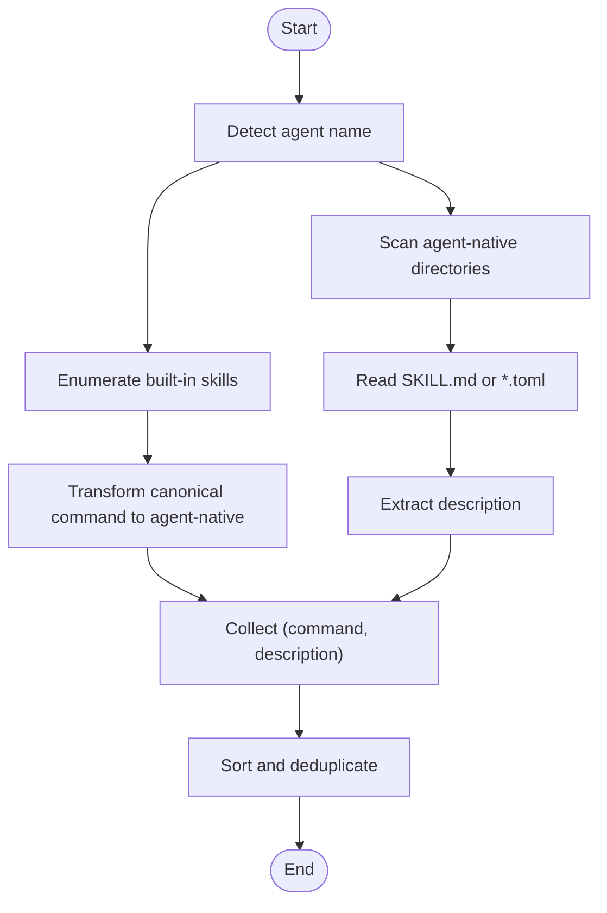
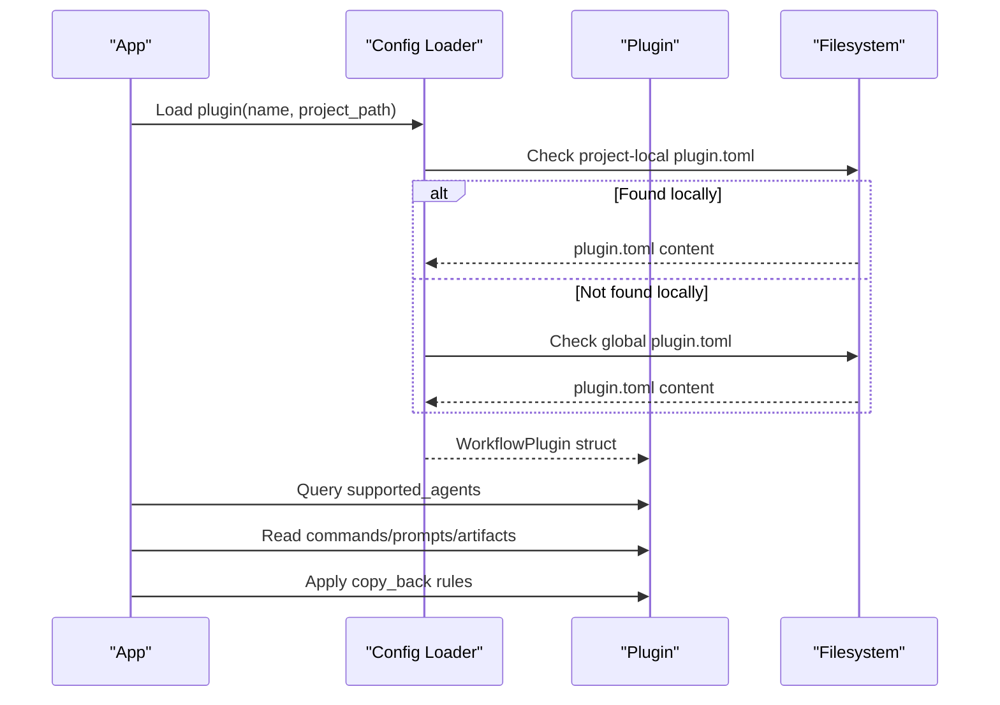
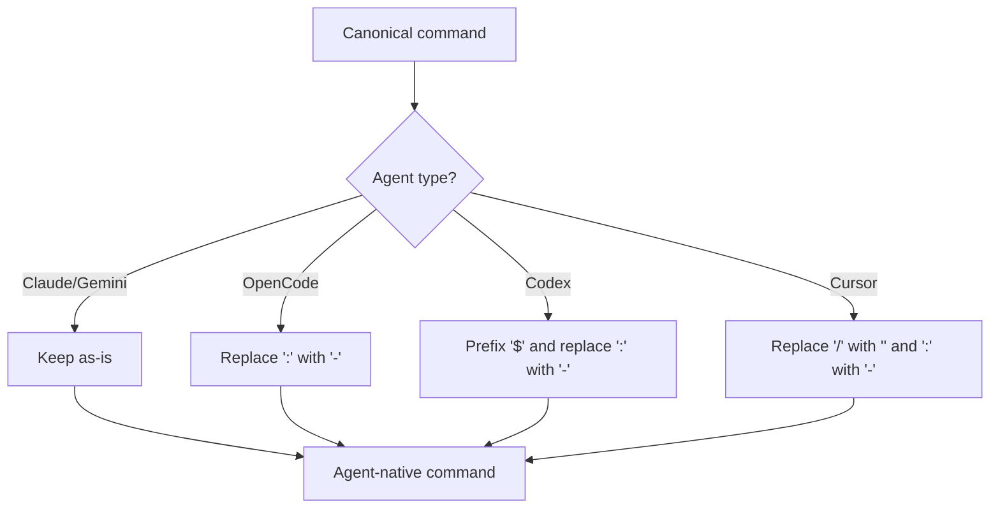
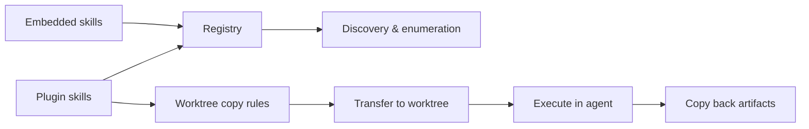
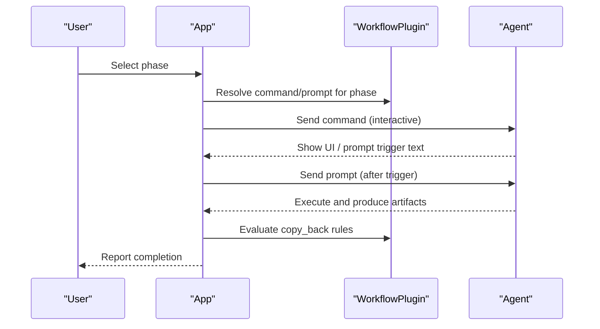
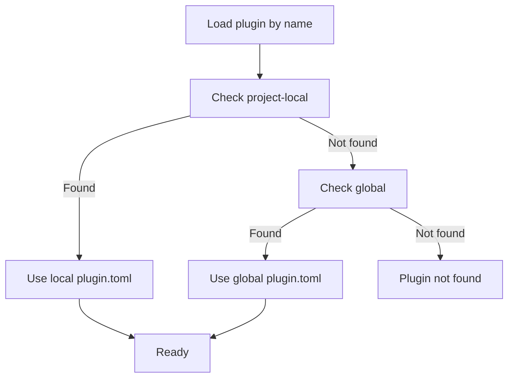
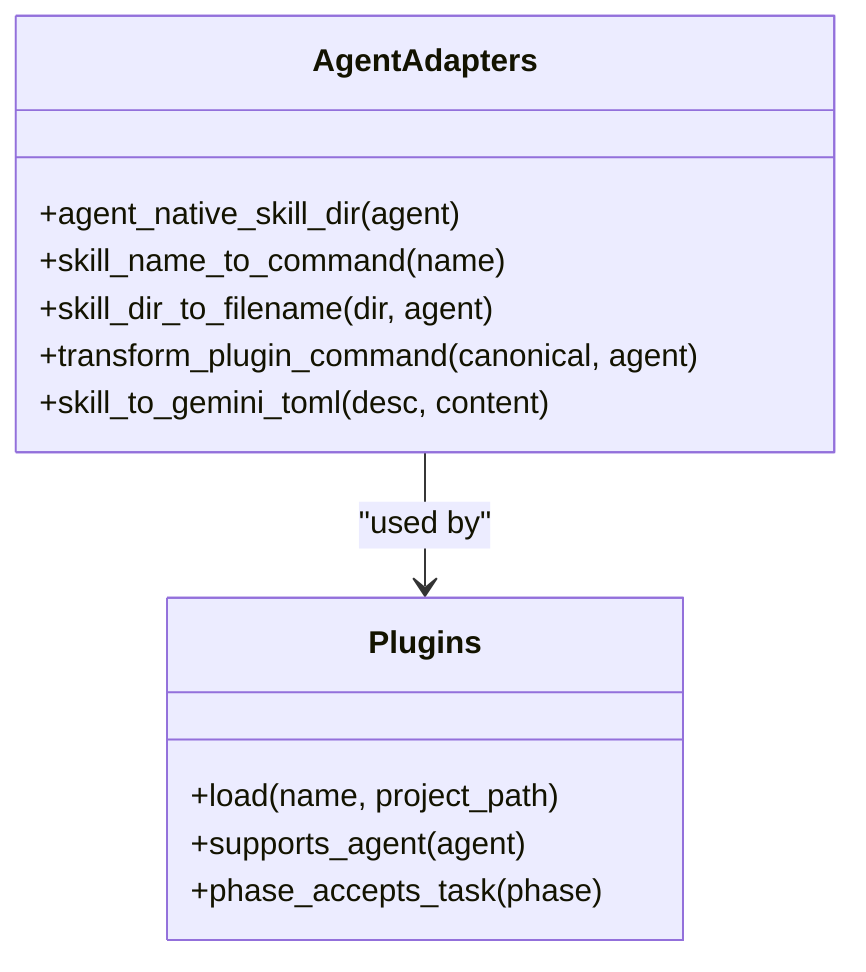
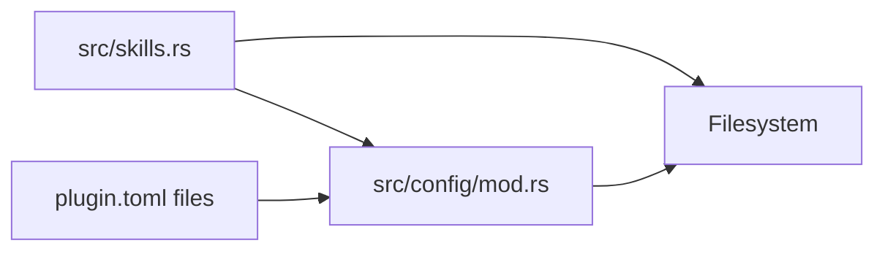

# Skill Deployment System

<cite>
**Referenced Files in This Document**
- [src/skills.rs](file://src/skills.rs)
- [src/lib.rs](file://src/lib.rs)
- [src/main.rs](file://src/main.rs)
- [src/config/mod.rs](file://src/config/mod.rs)
- [plugins/agent-skills/plugin.toml](file://plugins/agent-skills/plugin.toml)
- [plugins/agtx/plugin.toml](file://plugins/agtx/plugin.toml)
- [plugins/agtx-terse/plugin.toml](file://plugins/agtx-terse/plugin.toml)
- [plugins/gsd/plugin.toml](file://plugins/gsd/plugin.toml)
- [plugins/spec-kit/plugin.toml](file://plugins/spec-kit/plugin.toml)
- [plugins/openspec/plugin.toml](file://plugins/openspec/plugin.toml)
- [plugins/agtx/skills/research.md](file://plugins/agtx/skills/research.md)
- [plugins/agtx/skills/plan.md](file://plugins/agtx/skills/plan.md)
- [plugins/agtx/skills/execute.md](file://plugins/agtx/skills/execute.md)
- [plugins/agtx/skills/review.md](file://plugins/agtx/skills/review.md)
- [plugins/agtx-terse/skills/agtx-research/SKILL.md](file://plugins/agtx-terse/skills/agtx-research/SKILL.md)
</cite>

## Table of Contents
1. [Introduction](#introduction)
2. [Project Structure](#project-structure)
3. [Core Components](#core-components)
4. [Architecture Overview](#architecture-overview)
5. [Detailed Component Analysis](#detailed-component-analysis)
6. [Dependency Analysis](#dependency-analysis)
7. [Performance Considerations](#performance-considerations)
8. [Troubleshooting Guide](#troubleshooting-guide)
9. [Conclusion](#conclusion)
10. [Appendices](#appendices)

## Introduction
This document explains how AGTX deploys and manages skills across agent environments. It covers the skill discovery mechanism, packaging and transfer of skills, agent-specific execution environments, and the lifecycle of skills and plugins. It also documents how plugins trigger skill deployment, how skills are tracked, and how cross-agent compatibility is achieved through standardized formats and transformations.

## Project Structure
AGTX organizes skills and plugins in a way that supports cross-platform and cross-agent compatibility:
- Built-in skills are compiled into the binary and exposed via a registry.
- Plugins define workflows, commands, prompts, and artifact locations.
- Agent-native skill directories are scanned to discover additional skills.
- Cross-agent transformations normalize command syntax and file formats.

**Diagram sources**
- [src/main.rs:1-228](file://src/main.rs#L1-L228)
- [src/lib.rs:1-24](file://src/lib.rs#L1-L24)
- [src/config/mod.rs:410-595](file://src/config/mod.rs#L410-L595)
- [src/skills.rs:1-409](file://src/skills.rs#L1-L409)
- [plugins/agtx/plugin.toml:1-16](file://plugins/agtx/plugin.toml#L1-L16)
- [plugins/agtx-terse/plugin.toml:1-16](file://plugins/agtx-terse/plugin.toml#L1-L16)
- [plugins/gsd/plugin.toml:1-34](file://plugins/gsd/plugin.toml#L1-L34)
- [plugins/spec-kit/plugin.toml:1-21](file://plugins/spec-kit/plugin.toml#L1-L21)
- [plugins/openspec/plugin.toml:1-21](file://plugins/openspec/plugin.toml#L1-L21)
- [plugins/agent-skills/plugin.toml:1-19](file://plugins/agent-skills/plugin.toml#L1-L19)
- [plugins/agtx/skills/research.md:1-45](file://plugins/agtx/skills/research.md#L1-L45)
- [plugins/agtx-terse/skills/agtx-research/SKILL.md:1-50](file://plugins/agtx-terse/skills/agtx-research/SKILL.md#L1-L50)

**Section sources**
- [src/main.rs:1-228](file://src/main.rs#L1-L228)
- [src/lib.rs:1-24](file://src/lib.rs#L1-L24)
- [src/config/mod.rs:410-595](file://src/config/mod.rs#L410-L595)
- [src/skills.rs:1-409](file://src/skills.rs#L1-L409)

## Core Components
- Skill registry and agent adapters: Provides built-in skills, enumerates available skills, scans agent-native directories, and converts skill content to agent-specific formats.
- Plugin configuration: Defines commands, prompts, artifacts, and copy-back rules; supports agent filtering and lifecycle scripts.
- Cross-agent transformations: Normalizes command syntax and file formats for Claude, Gemini, Codex, Cursor, and OpenCode.
- Discovery and packaging: Embedded skills for fast startup; filesystem scanning for agent-native skills; TOML-based plugin packaging.

Key responsibilities:
- Compile-time embedding of built-in skills for immediate availability.
- Runtime discovery of agent-native skills and conversion to canonical command forms.
- Transformation of skill content to agent-specific formats (e.g., Gemini TOML).
- Plugin loading from project-local or global locations with precedence.

**Section sources**
- [src/skills.rs:12-226](file://src/skills.rs#L12-L226)
- [src/skills.rs:259-408](file://src/skills.rs#L259-L408)
- [src/skills.rs:128-139](file://src/skills.rs#L128-L139)
- [src/config/mod.rs:410-595](file://src/config/mod.rs#L410-L595)

## Architecture Overview
The skill deployment system integrates three layers:
- Registry Layer: Built-in skills and agent-native discovery.
- Plugin Layer: Workflow definition and artifact management.
- Execution Layer: Agent-specific command invocation and result handling.

**Diagram sources**
- [src/skills.rs:211-226](file://src/skills.rs#L211-L226)
- [src/skills.rs:259-408](file://src/skills.rs#L259-L408)
- [src/config/mod.rs:410-595](file://src/config/mod.rs#L410-L595)

## Detailed Component Analysis

### Skill Discovery and Enumeration
- Built-in skills: Compiled into constants and exposed as (directory_name, content) pairs. The registry enumerates them and converts to agent-native commands.
- Agent-native discovery: Scans agent-specific directories and collects skills from Markdown or TOML files depending on agent type.
- Command normalization: Converts canonical plugin commands to agent-specific formats (e.g., colon-to-hyphen, slash-to-dollar for Codex).

**Diagram sources**
- [src/skills.rs:211-226](file://src/skills.rs#L211-L226)
- [src/skills.rs:259-408](file://src/skills.rs#L259-L408)
- [src/skills.rs:47-115](file://src/skills.rs#L47-L115)

**Section sources**
- [src/skills.rs:12-226](file://src/skills.rs#L12-L226)
- [src/skills.rs:259-408](file://src/skills.rs#L259-L408)
- [src/skills.rs:47-115](file://src/skills.rs#L47-L115)

### Plugin Configuration and Lifecycle
- Plugin loading: Supports project-local and global plugin directories with project-local taking precedence.
- Supported agents: Plugins can restrict support to specific agents.
- Commands and prompts: Define how to invoke skills and what task context to send.
- Artifacts: Define phase completion signals and file paths.
- Copy-back rules: Control what gets returned from worktrees to the project root.
- Lifecycle scripts: Optional initialization and cleanup scripts.

**Diagram sources**
- [src/config/mod.rs:545-595](file://src/config/mod.rs#L545-L595)
- [plugins/gsd/plugin.toml:1-34](file://plugins/gsd/plugin.toml#L1-L34)
- [plugins/spec-kit/plugin.toml:1-21](file://plugins/spec-kit/plugin.toml#L1-L21)
- [plugins/openspec/plugin.toml:1-21](file://plugins/openspec/plugin.toml#L1-L21)

**Section sources**
- [src/config/mod.rs:410-595](file://src/config/mod.rs#L410-L595)
- [plugins/gsd/plugin.toml:1-34](file://plugins/gsd/plugin.toml#L1-L34)
- [plugins/spec-kit/plugin.toml:1-21](file://plugins/spec-kit/plugin.toml#L1-L21)
- [plugins/openspec/plugin.toml:1-21](file://plugins/openspec/plugin.toml#L1-L21)

### Cross-Agent Compatibility
- Command transformations: Normalize canonical commands to agent-specific syntax.
- File format conversions: Convert Markdown skills to Gemini’s TOML format.
- Directory layouts: Respect agent-native directory structures and naming conventions.

**Diagram sources**
- [src/skills.rs:93-115](file://src/skills.rs#L93-L115)

**Section sources**
- [src/skills.rs:93-115](file://src/skills.rs#L93-L115)
- [src/skills.rs:128-139](file://src/skills.rs#L128-L139)

### Skill Packaging and Transfer
- Embedded skills: Built-in skills are embedded at compile time for immediate use.
- Plugin packaging: Plugins are distributed as TOML descriptors with optional skill directories.
- Worktree transfer: Plugins can specify files/directories to copy into worktrees and copy back after phases.

**Diagram sources**
- [src/skills.rs:12-21](file://src/skills.rs#L12-L21)
- [src/skills.rs:259-408](file://src/skills.rs#L259-L408)
- [src/config/mod.rs:428-447](file://src/config/mod.rs#L428-L447)

**Section sources**
- [src/skills.rs:12-21](file://src/skills.rs#L12-L21)
- [src/config/mod.rs:428-447](file://src/config/mod.rs#L428-L447)

### Skill Execution Environments and Parameter Passing
- Command invocation: Plugins define commands per phase; the system sends these as interactive commands to the agent.
- Prompt delivery: Plugins define prompts per phase; the system waits for prompt triggers and then sends the prompt.
- Task context: Plugins can accept task context directly via placeholders in commands or prompts.
- Clear context: Some plugins request a context-clear command before advancing phases.

**Diagram sources**
- [src/config/mod.rs:474-510](file://src/config/mod.rs#L474-L510)
- [plugins/agtx/plugin.toml:11-16](file://plugins/agtx/plugin.toml#L11-L16)
- [plugins/gsd/plugin.toml:15-27](file://plugins/gsd/plugin.toml#L15-L27)

**Section sources**
- [src/config/mod.rs:474-510](file://src/config/mod.rs#L474-L510)
- [plugins/agtx/plugin.toml:11-16](file://plugins/agtx/plugin.toml#L11-L16)
- [plugins/gsd/plugin.toml:15-27](file://plugins/gsd/plugin.toml#L15-L27)

### Skill Registry and Lifecycle Management
- Registry: Maintains built-in skills and exposes enumeration and discovery functions.
- Lifecycle: Installation via plugin installation; updates by replacing plugin directories; removal by deleting plugin directories.
- Versioning and conflicts: Plugins are identified by name; last-writer-wins semantics apply when multiple sources define the same plugin name.

**Diagram sources**
- [src/config/mod.rs:545-595](file://src/config/mod.rs#L545-L595)

**Section sources**
- [src/skills.rs:12-21](file://src/skills.rs#L12-L21)
- [src/config/mod.rs:545-595](file://src/config/mod.rs#L545-L595)

### Examples: Agent-Specific Skill Adaptations
- Claude: Uses namespaced directories with Markdown commands; canonical commands map directly.
- Gemini: Uses namespaced directories with TOML commands; skills are converted to TOML format.
- Codex: Uses dollar-prefixed commands and SKILL.md inside skill directories.
- Cursor: Uses SKILL.md inside skill directories with forward-slash commands.
- OpenCode: Uses flat directories with Markdown files and hyphenated commands.

**Diagram sources**
- [src/skills.rs:31-139](file://src/skills.rs#L31-L139)
- [src/config/mod.rs:512-544](file://src/config/mod.rs#L512-L544)

**Section sources**
- [src/skills.rs:31-139](file://src/skills.rs#L31-L139)
- [plugins/agent-skills/plugin.toml:1-19](file://plugins/agent-skills/plugin.toml#L1-L19)
- [plugins/agtx/plugin.toml:1-16](file://plugins/agtx/plugin.toml#L1-L16)
- [plugins/agtx-terse/plugin.toml:1-16](file://plugins/agtx-terse/plugin.toml#L1-L16)

## Dependency Analysis
- Module coupling: The skills module depends on the config module for plugin loading and on filesystem access for agent-native discovery.
- External dependencies: Plugins are loaded from filesystem paths; agent invocation is handled externally via tmux send-keys.
- Potential circular dependencies: None observed; responsibilities are layered (registry → plugin → execution).

**Diagram sources**
- [src/skills.rs:1-409](file://src/skills.rs#L1-L409)
- [src/config/mod.rs:410-595](file://src/config/mod.rs#L410-L595)

**Section sources**
- [src/skills.rs:1-409](file://src/skills.rs#L1-L409)
- [src/config/mod.rs:410-595](file://src/config/mod.rs#L410-L595)

## Performance Considerations
- Embedded skills eliminate runtime IO for built-ins, reducing cold-start latency.
- Minimal filesystem scanning: Discovery is scoped to agent-native directories and limited to metadata parsing.
- Efficient command transformations: Single-pass string replacements avoid heavy parsing overhead.
- Plugin caching: Loaded plugin structs can be cached per session to avoid repeated filesystem reads.

## Troubleshooting Guide
- Plugin not found: Verify plugin name and directory layout; check project-local vs global precedence.
- Agent command mismatch: Confirm agent-specific command transformation rules; adjust plugin commands accordingly.
- Missing skill content: Ensure SKILL.md or TOML files exist in agent-native directories; verify frontmatter extraction.
- Prompt not delivered: Check prompt triggers and ensure the agent UI reaches the expected state before sending prompts.
- Copy-back failures: Validate plugin copy_back rules and file paths; confirm worktree permissions.

**Section sources**
- [src/config/mod.rs:545-595](file://src/config/mod.rs#L545-L595)
- [src/skills.rs:259-408](file://src/skills.rs#L259-L408)
- [src/skills.rs:196-226](file://src/skills.rs#L196-L226)

## Conclusion
AGTX provides a robust, cross-agent skill deployment system that combines embedded built-in skills with flexible plugin-driven workflows. Through agent adapters, discovery mechanisms, and standardized formats, it ensures consistent skill execution across Claude, Gemini, Codex, Cursor, and OpenCode while preserving agent-specific capabilities and user workflows.

## Appendices

### Appendix A: Built-in Skills Reference
- Research, Plan, Execute, Review, Orchestrate, Merge Conflicts: Provided as embedded Markdown content and enumerated for all agents.

**Section sources**
- [src/skills.rs:5-21](file://src/skills.rs#L5-L21)
- [src/skills.rs:211-226](file://src/skills.rs#L211-L226)

### Appendix B: Plugin Examples
- agtx: Built-in workflow with artifact paths and commands.
- agtx-terse: Token-efficient variant with similar structure.
- gsd: Structured spec-driven development with pre-research and cyclic transitions.
- spec-kit: Specification-driven artifacts and commands.
- openspec: Lightweight proposal and verification workflow.

**Section sources**
- [plugins/agtx/plugin.toml:1-16](file://plugins/agtx/plugin.toml#L1-L16)
- [plugins/agtx-terse/plugin.toml:1-16](file://plugins/agtx-terse/plugin.toml#L1-L16)
- [plugins/gsd/plugin.toml:1-34](file://plugins/gsd/plugin.toml#L1-L34)
- [plugins/spec-kit/plugin.toml:1-21](file://plugins/spec-kit/plugin.toml#L1-L21)
- [plugins/openspec/plugin.toml:1-21](file://plugins/openspec/plugin.toml#L1-L21)