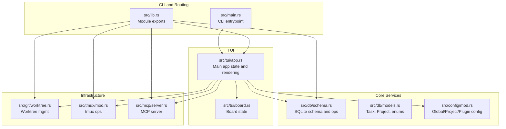
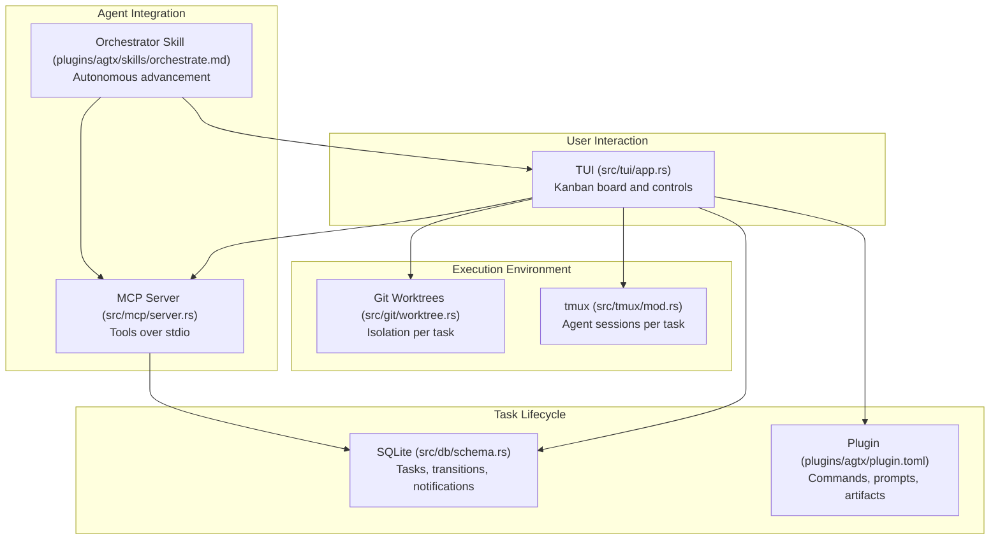
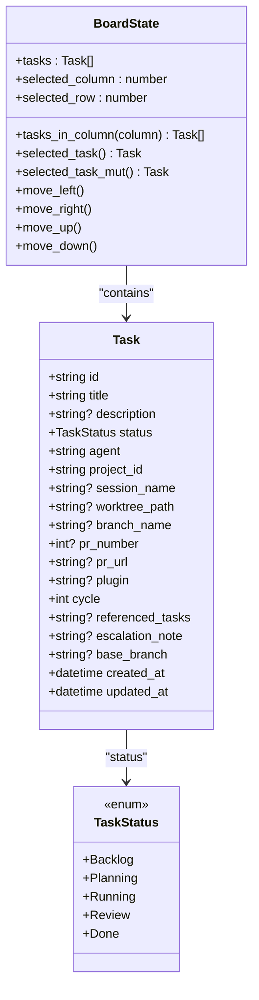
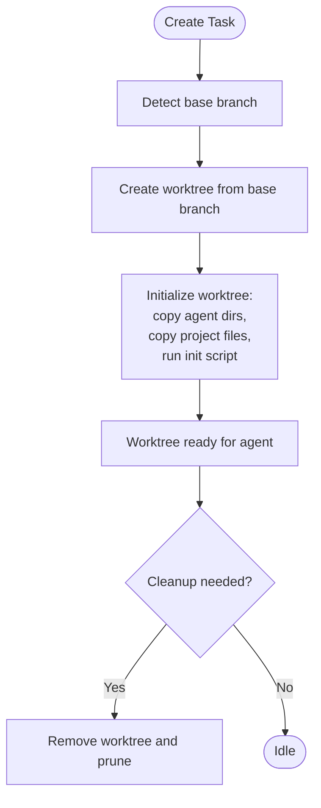
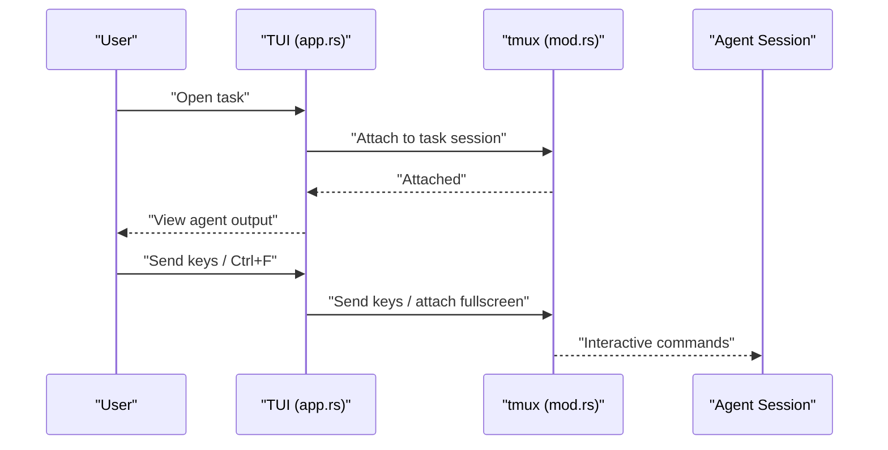
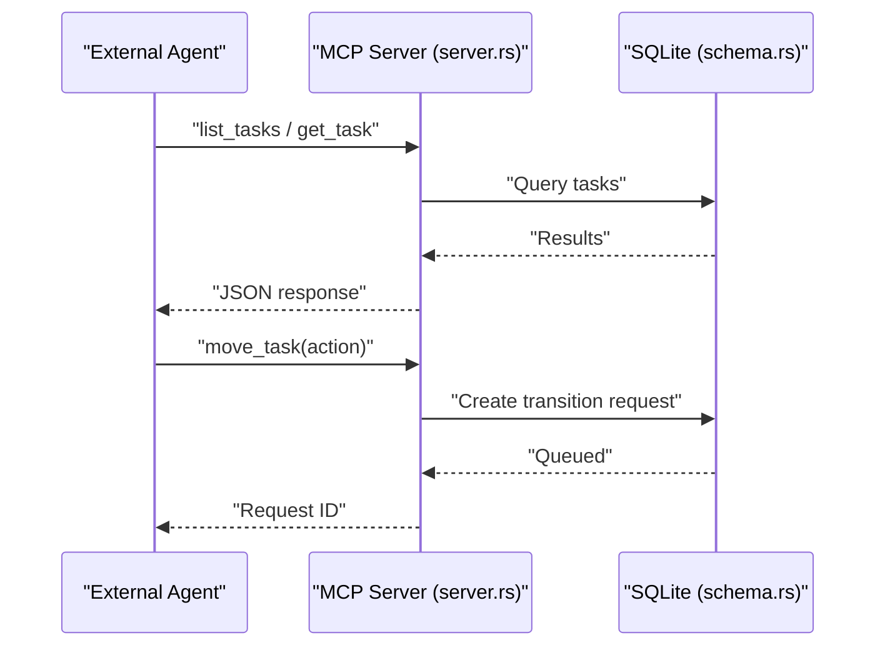
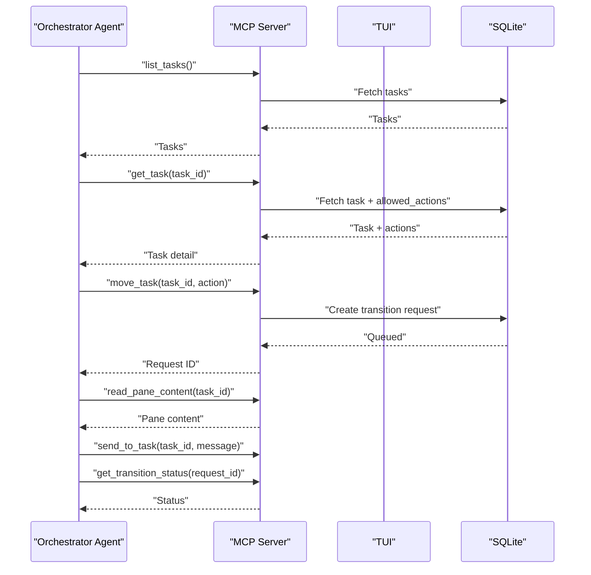
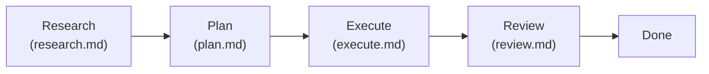
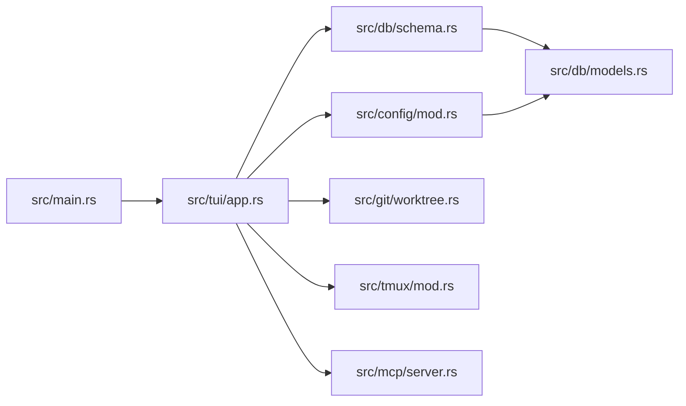

# Project Overview

<cite>
**Referenced Files in This Document**
- [README.md](file://README.md)
- [AGENTS.md](file://AGENTS.md)
- [src/lib.rs](file://src/lib.rs)
- [src/main.rs](file://src/main.rs)
- [src/tui/app.rs](file://src/tui/app.rs)
- [src/tui/board.rs](file://src/tui/board.rs)
- [src/db/schema.rs](file://src/db/schema.rs)
- [src/db/models.rs](file://src/db/models.rs)
- [src/git/worktree.rs](file://src/git/worktree.rs)
- [src/tmux/mod.rs](file://src/tmux/mod.rs)
- [src/mcp/server.rs](file://src/mcp/server.rs)
- [src/config/mod.rs](file://src/config/mod.rs)
- [plugins/agtx/plugin.toml](file://plugins/agtx/plugin.toml)
- [plugins/agtx/skills/orchestrate.md](file://plugins/agtx/skills/orchestrate.md)
- [plugins/agtx/skills/research.md](file://plugins/agtx/skills/research.md)
</cite>

## Table of Contents
1. [Introduction](#introduction)
2. [Project Structure](#project-structure)
3. [Core Components](#core-components)
4. [Architecture Overview](#architecture-overview)
5. [Detailed Component Analysis](#detailed-component-analysis)
6. [Dependency Analysis](#dependency-analysis)
7. [Performance Considerations](#performance-considerations)
8. [Troubleshooting Guide](#troubleshooting-guide)
9. [Conclusion](#conclusion)

## Introduction
AGTX is a terminal-based AI agent orchestration platform designed as a kanban board for managing multiple AI coding agents in parallel. Its core value proposition is eliminating context switching by keeping all phases of a task lifecycle—research, planning, implementation, review—visible and actionable in a single terminal interface. AGTX coordinates multiple agents simultaneously, each operating in isolation via git worktrees and tmux sessions, while a spec-driven workflow plugin governs the task lifecycle. The platform offers both human-in-the-loop control and an experimental orchestrator agent that autonomously advances tasks through phases.

Key benefits:
- Multi-agent collaboration: Each task runs in its own worktree and tmux window, enabling parallel work across agents.
- Automatic session switching and context awareness: Plugins and configuration ensure the correct agent and skill are invoked per phase.
- Spec-driven workflows: Plugins define commands, prompts, artifacts, and gating rules, enabling repeatable, automated task progression.
- Seamless research → implementation → review transformations: The built-in “agtx” plugin and skills streamline transitions and artifact handoff.

Terminology used consistently in this overview:
- Kanban board: The TUI board with Backlog, Planning, Running, Review, and Done columns.
- Worktree: A git worktree per task for isolated development.
- Tmux sessions: Persistent agent sessions per project and per task.
- Agent orchestration: The coordination of agents across phases and the automation of transitions.

**Section sources**
- [README.md:47-67](file://README.md#L47-L67)
- [AGENTS.md:5-8](file://AGENTS.md#L5-L8)

## Project Structure
At a high level, AGTX is organized around a terminal user interface (TUI), a database-backed task lifecycle, Git worktrees for isolation, tmux for persistent agent sessions, and an MCP server for agent interoperability and the orchestrator.

**Diagram sources**
- [src/main.rs:16-96](file://src/main.rs#L16-L96)
- [src/lib.rs:1-24](file://src/lib.rs#L1-L24)
- [src/tui/app.rs:501-708](file://src/tui/app.rs#L501-L708)
- [src/tui/board.rs:1-99](file://src/tui/board.rs#L1-L99)
- [src/db/schema.rs:97-208](file://src/db/schema.rs#L97-L208)
- [src/db/models.rs:58-133](file://src/db/models.rs#L58-L133)
- [src/git/worktree.rs:1-345](file://src/git/worktree.rs#L1-L345)
- [src/tmux/mod.rs:11-189](file://src/tmux/mod.rs#L11-L189)
- [src/mcp/server.rs:394-520](file://src/mcp/server.rs#L394-L520)

**Section sources**
- [AGENTS.md:16-31](file://AGENTS.md#L16-L31)
- [src/lib.rs:1-24](file://src/lib.rs#L1-L24)

## Core Components
- TUI and Board: The TUI renders the kanban board, manages keyboard navigation, and coordinates task lifecycle actions. BoardState encapsulates the current selection and column layout.
- Database: SQLite-backed persistence for tasks, projects, transition requests, and notifications. Provides schema initialization and migrations.
- Git Integration: Worktree management for task isolation, including creation, initialization, and cleanup. Branch detection and worktree directory configuration.
- tmux Coordination: Spawning, attaching, and monitoring agent sessions; capturing pane content; sending keys; and session lifecycle management.
- MCP Server: Exposes the board as tools over stdio for agent interoperability, including listing projects/tasks, moving tasks, conflict checks, and reading pane content.
- Configuration: Global and project-level configuration, including per-phase agent assignments, worktree settings, and plugin selection.
- Plugins: Spec-driven workflow definitions that govern commands, prompts, artifacts, and gating rules per phase.

**Section sources**
- [src/tui/board.rs:1-99](file://src/tui/board.rs#L1-L99)
- [src/db/schema.rs:97-208](file://src/db/schema.rs#L97-L208)
- [src/git/worktree.rs:1-345](file://src/git/worktree.rs#L1-L345)
- [src/tmux/mod.rs:11-189](file://src/tmux/mod.rs#L11-L189)
- [src/mcp/server.rs:394-520](file://src/mcp/server.rs#L394-L520)
- [src/config/mod.rs:337-408](file://src/config/mod.rs#L337-L408)
- [plugins/agtx/plugin.toml:1-16](file://plugins/agtx/plugin.toml#L1-L16)

## Architecture Overview
AGTX orchestrates a multi-agent workflow through a terminal-native kanban board. The TUI coordinates tasks across phases, while Git worktrees and tmux sessions isolate each task’s environment. Plugins define the spec-driven lifecycle, and the MCP server integrates external agents and the orchestrator.

**Diagram sources**
- [src/tui/app.rs:501-708](file://src/tui/app.rs#L501-L708)
- [src/db/schema.rs:97-208](file://src/db/schema.rs#L97-L208)
- [plugins/agtx/plugin.toml:1-16](file://plugins/agtx/plugin.toml#L1-L16)
- [src/git/worktree.rs:1-345](file://src/git/worktree.rs#L1-L345)
- [src/tmux/mod.rs:11-189](file://src/tmux/mod.rs#L11-L189)
- [src/mcp/server.rs:394-520](file://src/mcp/server.rs#L394-L520)
- [plugins/agtx/skills/orchestrate.md:14-42](file://plugins/agtx/skills/orchestrate.md#L14-L42)

## Detailed Component Analysis

### Kanban Board and Task Lifecycle
The TUI maintains a BoardState representing tasks arranged across columns (Backlog → Planning → Running → Review → Done). Users navigate and operate tasks via keyboard shortcuts. The database stores task metadata, status, and transition requests. Plugins define commands and prompts per phase, artifacts for readiness, and gating rules.

**Diagram sources**
- [src/db/models.rs:58-133](file://src/db/models.rs#L58-L133)
- [src/tui/board.rs:1-99](file://src/tui/board.rs#L1-L99)

**Section sources**
- [src/tui/board.rs:11-91](file://src/tui/board.rs#L11-L91)
- [src/db/models.rs:58-133](file://src/db/models.rs#L58-L133)

### Git Worktrees and Isolation
Each task runs in a dedicated git worktree branched from a configurable base branch. Worktree initialization copies agent configuration directories and project-specified files, runs an init script, and cleans up on exit. Branch detection prefers main/master and falls back to the current branch.

**Diagram sources**
- [src/git/worktree.rs:8-65](file://src/git/worktree.rs#L8-L65)
- [src/git/worktree.rs:125-223](file://src/git/worktree.rs#L125-L223)
- [src/git/worktree.rs:241-273](file://src/git/worktree.rs#L241-L273)

**Section sources**
- [src/git/worktree.rs:1-345](file://src/git/worktree.rs#L1-L345)

### tmux Session Management
AGTX runs a dedicated tmux server (“agtx”) with sessions per project and windows per task. Sessions are spawned with agent commands, captured for pane content, and attached for full-screen viewing. Session names encode task, project, and slug for reliable recovery.

**Diagram sources**
- [src/tui/app.rs:501-708](file://src/tui/app.rs#L501-L708)
- [src/tmux/mod.rs:11-189](file://src/tmux/mod.rs#L11-L189)

**Section sources**
- [src/tmux/mod.rs:11-189](file://src/tmux/mod.rs#L11-L189)

### MCP Server and Agent Interoperability
The MCP server exposes tools over stdio for listing projects/tasks, moving tasks, checking conflicts, and reading pane content. It computes allowed actions based on plugin rules and task dependencies, and queues transitions for the TUI to process.

**Diagram sources**
- [src/mcp/server.rs:521-721](file://src/mcp/server.rs#L521-L721)
- [src/db/schema.rs:478-554](file://src/db/schema.rs#L478-L554)

**Section sources**
- [src/mcp/server.rs:394-520](file://src/mcp/server.rs#L394-L520)
- [src/db/schema.rs:478-554](file://src/db/schema.rs#L478-L554)

### Orchestrator Agent (Experimental)
The orchestrator skill coordinates task advancement across Planning and Running phases. It listens for phase-completion notifications, validates allowed actions, and advances tasks to Review. It can read pane content, send messages to stuck agents, and escalate to the user when needed.

**Diagram sources**
- [plugins/agtx/skills/orchestrate.md:14-42](file://plugins/agtx/skills/orchestrate.md#L14-L42)
- [src/mcp/server.rs:521-721](file://src/mcp/server.rs#L521-L721)
- [src/db/schema.rs:478-554](file://src/db/schema.rs#L478-L554)

**Section sources**
- [plugins/agtx/skills/orchestrate.md:1-200](file://plugins/agtx/skills/orchestrate.md#L1-L200)
- [src/mcp/server.rs:521-721](file://src/mcp/server.rs#L521-L721)

### Practical Workflows: Research → Implementation → Review
Common workflows leverage the built-in “agtx” plugin and skills:
- Research: Explore codebase and write findings to a research artifact; task remains in Backlog until ready to plan.
- Plan: Generate a plan artifact; task advances to Planning.
- Execute: Implement changes; produce an execution artifact; task advances to Running.
- Review: Review and finalize; task advances to Review for merging.

**Diagram sources**
- [plugins/agtx/plugin.toml:5-16](file://plugins/agtx/plugin.toml#L5-L16)
- [plugins/agtx/skills/research.md:21-45](file://plugins/agtx/skills/research.md#L21-L45)

**Section sources**
- [plugins/agtx/plugin.toml:1-16](file://plugins/agtx/plugin.toml#L1-L16)
- [plugins/agtx/skills/research.md:1-45](file://plugins/agtx/skills/research.md#L1-L45)

## Dependency Analysis
AGTX composes modular subsystems with clear boundaries:
- CLI routes to TUI, which depends on configuration, database, Git, tmux, and MCP.
- Database schema underpins task state and transition requests.
- Git and tmux provide infrastructure for isolation and persistence.
- MCP bridges external agents and the orchestrator.
- Plugins define workflow semantics and gating rules.

**Diagram sources**
- [src/main.rs:16-96](file://src/main.rs#L16-L96)
- [src/tui/app.rs:501-708](file://src/tui/app.rs#L501-L708)
- [src/db/schema.rs:97-208](file://src/db/schema.rs#L97-L208)
- [src/db/models.rs:58-133](file://src/db/models.rs#L58-L133)
- [src/config/mod.rs:337-408](file://src/config/mod.rs#L337-L408)
- [src/git/worktree.rs:1-345](file://src/git/worktree.rs#L1-L345)
- [src/tmux/mod.rs:11-189](file://src/tmux/mod.rs#L11-L189)
- [src/mcp/server.rs:394-520](file://src/mcp/server.rs#L394-L520)

**Section sources**
- [src/lib.rs:1-24](file://src/lib.rs#L1-L24)
- [src/main.rs:16-96](file://src/main.rs#L16-L96)

## Performance Considerations
- Parallelism: Each task runs in its own worktree and tmux window, enabling true concurrency. Use tmux panes efficiently and avoid unnecessary pane captures.
- Database writes: Batch operations (e.g., batch task creation) reduce transaction overhead.
- Plugin artifact polling: Configure prompt triggers and artifact patterns to minimize polling overhead and false positives.
- Idle detection: Use pane content hashing to detect idle agents and avoid busy-waiting.
- Cleanup: Enable auto-cleanup of worktrees to prevent disk pressure.

[No sources needed since this section provides general guidance]

## Troubleshooting Guide
- tmux server issues: Verify the dedicated “agtx” server is running and sessions are created. Use list and attach helpers to diagnose.
- Worktree problems: Confirm base branch detection and that worktree directories exist. Use cleanup routines to remove stale worktrees.
- MCP connectivity: Ensure the MCP server is registered with the agent and that project IDs are passed correctly in global mode.
- Transition failures: Inspect transition requests and error fields in the database; re-check plugin commands and prompts.
- Orchestrator stuck tasks: Read pane content to identify prompts or errors; send targeted messages or escalate to the user with a concise reason.

**Section sources**
- [src/tmux/mod.rs:51-142](file://src/tmux/mod.rs#L51-L142)
- [src/git/worktree.rs:275-297](file://src/git/worktree.rs#L275-L297)
- [src/mcp/server.rs:722-755](file://src/mcp/server.rs#L722-L755)
- [src/db/schema.rs:511-554](file://src/db/schema.rs#L511-L554)

## Conclusion
AGTX transforms AI coding workflows by centralizing multi-agent collaboration in a terminal kanban board. It eliminates context switching through automatic session switching, persistent context, and spec-driven workflows. Developers can choose full human control or enable the experimental orchestrator to automate task progression. The combination of Git worktrees, tmux sessions, and an MCP server provides a robust foundation for scalable, repeatable agent orchestration.

[No sources needed since this section summarizes without analyzing specific files]