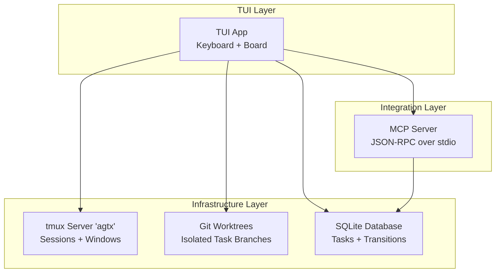
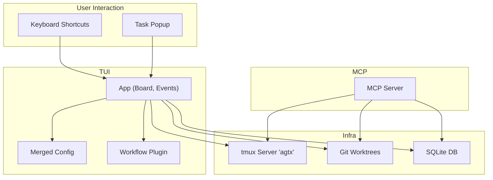
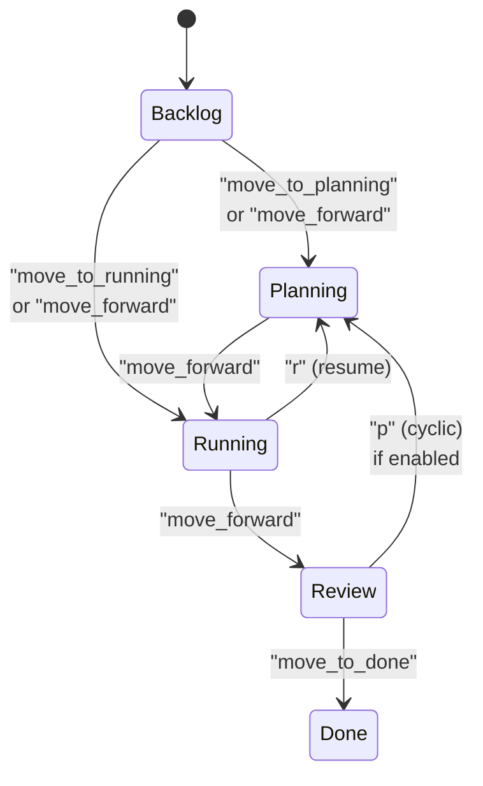
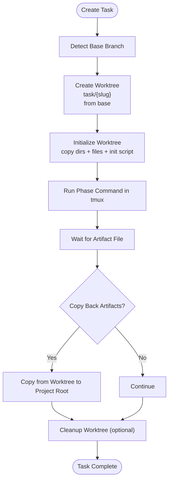
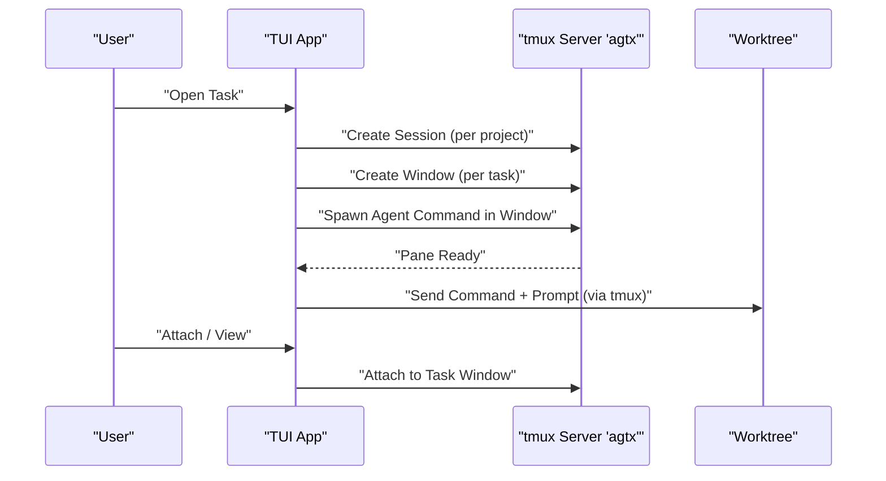
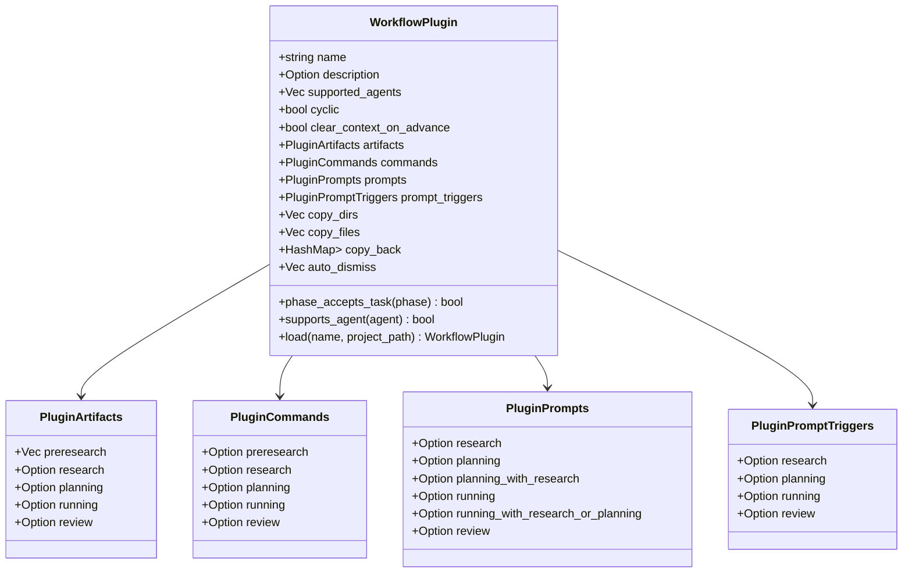
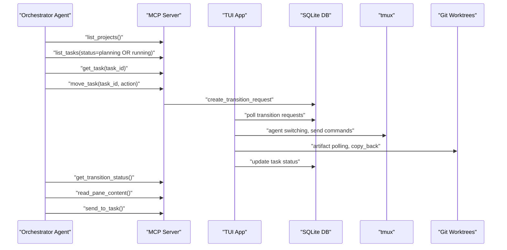
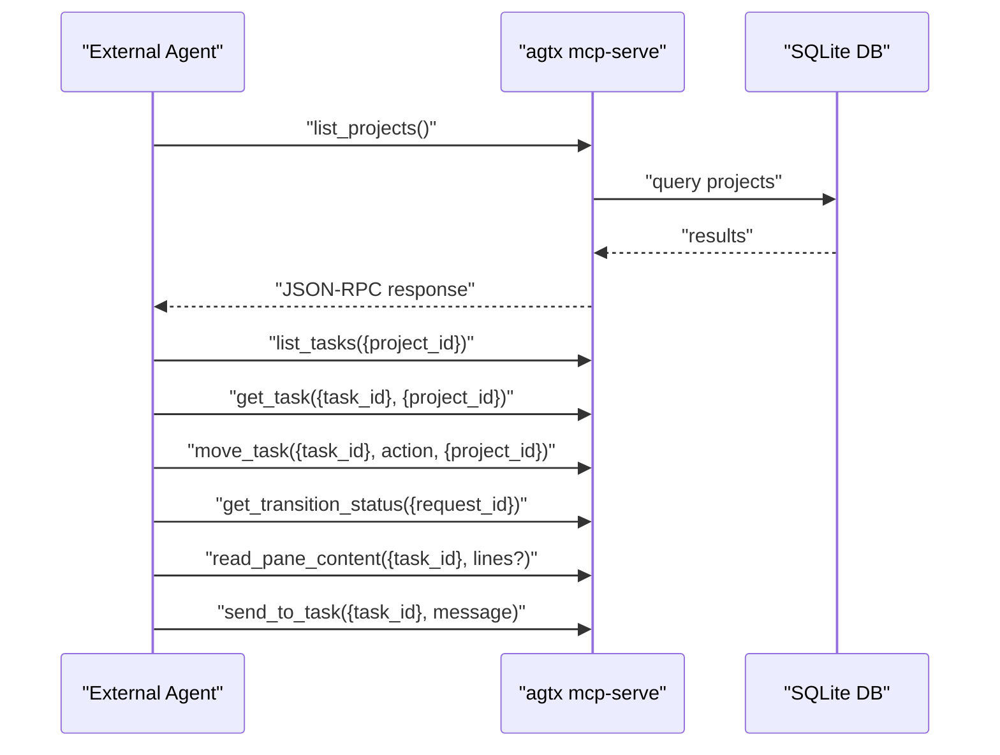
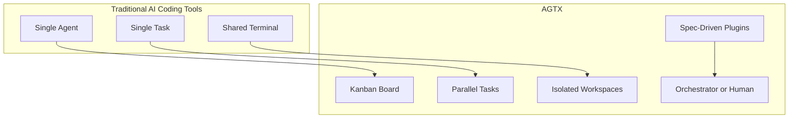
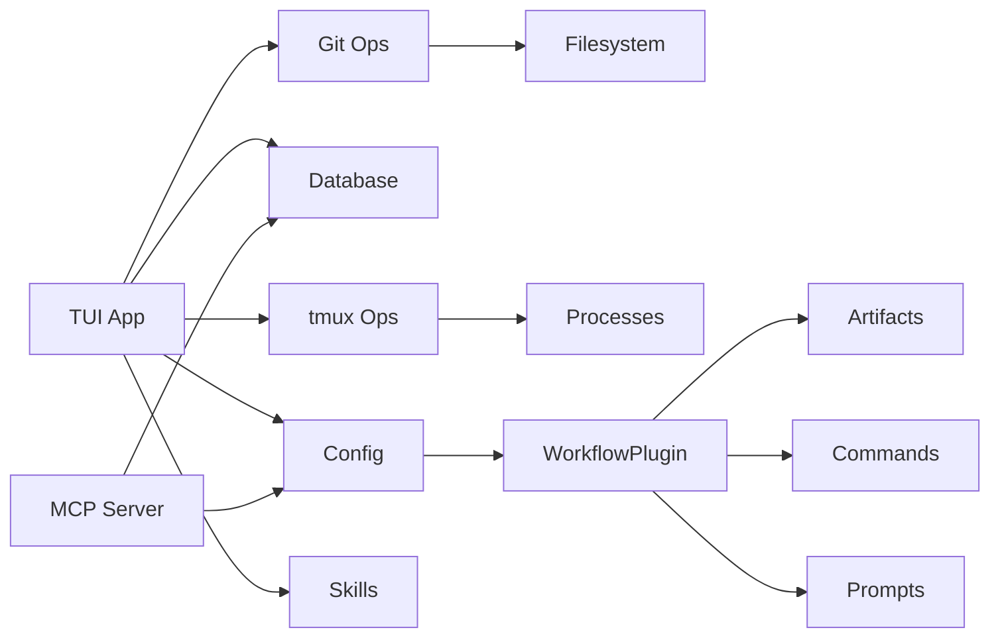

# Core Concepts

<cite>
**Referenced Files in This Document**
- [README.md](file://README.md)
- [AGENTS.md](file://AGENTS.md)
- [src/lib.rs](file://src/lib.rs)
- [src/main.rs](file://src/main.rs)
- [src/tmux/mod.rs](file://src/tmux/mod.rs)
- [src/tmux/operations.rs](file://src/tmux/operations.rs)
- [src/git/worktree.rs](file://src/git/worktree.rs)
- [src/mcp/mod.rs](file://src/mcp/mod.rs)
- [src/mcp/server.rs](file://src/mcp/server.rs)
- [src/config/mod.rs](file://src/config/mod.rs)
- [src/db/models.rs](file://src/db/models.rs)
- [src/tui/app.rs](file://src/tui/app.rs)
- [plugins/agtx/plugin.toml](file://plugins/agtx/plugin.toml)
- [plugins/void/plugin.toml](file://plugins/void/plugin.toml)
</cite>

## Table of Contents
1. [Introduction](#introduction)
2. [Project Structure](#project-structure)
3. [Core Components](#core-components)
4. [Architecture Overview](#architecture-overview)
5. [Detailed Component Analysis](#detailed-component-analysis)
6. [Dependency Analysis](#dependency-analysis)
7. [Performance Considerations](#performance-considerations)
8. [Troubleshooting Guide](#troubleshooting-guide)
9. [Conclusion](#conclusion)
10. [Appendices](#appendices)

## Introduction
This document explains the AGTX core concepts: the five-phase task lifecycle, git worktrees for isolation, tmux session management, the plugin system, agent orchestration, and MCP integration. It also provides a terminology glossary and conceptual diagrams to help you understand how AGTX differs from traditional AI coding tools.

## Project Structure
AGTX is organized around a terminal-native TUI, a kanban board, and persistent agent sessions. The runtime spans three layers:
- TUI and board: user interface, keyboard shortcuts, and task lifecycle control
- Infrastructure: tmux sessions/windows, git worktrees, and database-backed state
- Integration: MCP server exposing the board as tools over JSON-RPC

**Diagram sources**
- [src/tui/app.rs:1-200](file://src/tui/app.rs#L1-L200)
- [src/tmux/mod.rs:11-189](file://src/tmux/mod.rs#L11-L189)
- [src/git/worktree.rs:1-345](file://src/git/worktree.rs#L1-L345)
- [src/db/models.rs:1-200](file://src/db/models.rs#L1-L200)
- [src/mcp/server.rs:1-800](file://src/mcp/server.rs#L1-L800)

**Section sources**
- [src/lib.rs:1-24](file://src/lib.rs#L1-L24)
- [src/main.rs:16-96](file://src/main.rs#L16-L96)
- [AGENTS.md:16-43](file://AGENTS.md#L16-L43)

## Core Components
- Five-phase task lifecycle: Backlog → Planning → Running → Review → Done
- Git worktrees: Isolation per task with per-task branches and optional copy-back of artifacts
- tmux sessions: Dedicated server with per-project sessions and per-task windows
- Plugin system: Spec-driven TOML configuration that defines commands, prompts, artifacts, and gating rules
- Agent orchestration: Human-in-the-loop or AI-driven orchestration via MCP
- MCP integration: JSON-RPC over stdio for external agents to manage tasks

**Section sources**
- [README.md:47-67](file://README.md#L47-L67)
- [src/db/models.rs:5-56](file://src/db/models.rs#L5-L56)
- [src/git/worktree.rs:1-345](file://src/git/worktree.rs#L1-L345)
- [src/tmux/mod.rs:11-189](file://src/tmux/mod.rs#L11-L189)
- [src/config/mod.rs:410-595](file://src/config/mod.rs#L410-L595)
- [src/mcp/server.rs:1-800](file://src/mcp/server.rs#L1-L800)

## Architecture Overview
The AGTX architecture couples a TUI board with tmux and git to deliver isolated, parallel agent sessions. Plugins configure the lifecycle per phase. The MCP server exposes the board as tools for external agents.

**Diagram sources**
- [src/tui/app.rs:1-200](file://src/tui/app.rs#L1-L200)
- [src/config/mod.rs:337-408](file://src/config/mod.rs#L337-L408)
- [src/config/mod.rs:410-595](file://src/config/mod.rs#L410-L595)
- [src/tmux/mod.rs:11-189](file://src/tmux/mod.rs#L11-L189)
- [src/git/worktree.rs:1-345](file://src/git/worktree.rs#L1-L345)
- [src/db/models.rs:1-200](file://src/db/models.rs#L1-L200)
- [src/mcp/server.rs:1-800](file://src/mcp/server.rs#L1-L800)

## Detailed Component Analysis

### Five-Phase Task Lifecycle
AGTX models tasks moving through Backlog, Planning, Running, Review, and Done. Plugins define which phases are gated and how transitions occur.

- Gating: Plugins declare whether a phase can accept tasks directly from Backlog based on presence of `{task}` in commands/prompts.
- Cyclic workflows: When enabled, Review can transition back to Planning with an incremented cycle counter.

**Section sources**
- [src/db/models.rs:5-56](file://src/db/models.rs#L5-L56)
- [src/config/mod.rs:512-538](file://src/config/mod.rs#L512-L538)
- [README.md:476-489](file://README.md#L476-L489)

### Git Worktrees and Task Isolation
Each task gets its own git worktree and branch. Worktrees isolate changes, support per-phase copy-back of artifacts, and allow independent cleanup.

- Base branch detection: Defaults to main/master, falls back to current branch.
- Initialization: Copies agent config dirs, plugin-specific dirs/files, and runs an init script.
- Cleanup: Optional removal of worktrees after merge/reject.

**Diagram sources**
- [src/git/worktree.rs:8-65](file://src/git/worktree.rs#L8-L65)
- [src/git/worktree.rs:125-223](file://src/git/worktree.rs#L125-L223)
- [src/git/worktree.rs:241-273](file://src/git/worktree.rs#L241-L273)

**Section sources**
- [src/git/worktree.rs:1-345](file://src/git/worktree.rs#L1-L345)
- [README.md:261-303](file://README.md#L261-L303)

### tmux Session Management
AGTX runs a dedicated tmux server and organizes sessions and windows per project and task respectively. Each task window runs the agent’s interactive command.

- Server: "agtx" tmux server
- Sessions: One per project
- Windows: One per task within a project session
- Commands: Sent via tmux send-keys; bracketed paste supported for large content

**Diagram sources**
- [src/tmux/mod.rs:11-189](file://src/tmux/mod.rs#L11-L189)
- [src/tmux/operations.rs:1-200](file://src/tmux/operations.rs#L1-L200)
- [src/db/models.rs:119-133](file://src/db/models.rs#L119-L133)

**Section sources**
- [src/tmux/mod.rs:11-189](file://src/tmux/mod.rs#L11-L189)
- [src/tmux/operations.rs:1-200](file://src/tmux/operations.rs#L1-L200)
- [README.md:549-564](file://README.md#L549-L564)

### Plugin System and Spec-Driven Workflows
Plugins define commands, prompts, artifacts, and gating rules. They can be project-local or global and support cyclic workflows and copy-back.

- Built-in plugin example: agtx defines commands and artifacts for each phase.
- Ungated vs gated: A phase is gated if neither its command nor prompt contains "{task}".
- Cyclic: Enables Review → Planning transitions with a phase counter.

**Diagram sources**
- [src/config/mod.rs:410-595](file://src/config/mod.rs#L410-L595)
- [plugins/agtx/plugin.toml:1-16](file://plugins/agtx/plugin.toml#L1-L16)

**Section sources**
- [src/config/mod.rs:410-595](file://src/config/mod.rs#L410-L595)
- [README.md:329-504](file://README.md#L329-L504)
- [plugins/agtx/plugin.toml:1-16](file://plugins/agtx/plugin.toml#L1-L16)
- [plugins/void/plugin.toml:1-4](file://plugins/void/plugin.toml#L1-L4)

### Agent Orchestration Principles
AGTX supports two modes:
- Human-in-the-loop: You triage tasks; AGTX advances them through phases.
- AI-driven orchestration: An orchestrator agent uses MCP to observe, decide, and act on tasks.

- Allowed actions: Derived from plugin rules and dependency satisfaction.
- Idle detection: If a task is idle for a period, the orchestrator can read pane content and escalate to human if needed.

**Diagram sources**
- [src/mcp/server.rs:521-755](file://src/mcp/server.rs#L521-L755)
- [src/db/models.rs:159-184](file://src/db/models.rs#L159-L184)
- [README.md:604-646](file://README.md#L604-L646)

**Section sources**
- [src/mcp/server.rs:473-518](file://src/mcp/server.rs#L473-L518)
- [README.md:604-646](file://README.md#L604-L646)

### MCP Integration and JSON-RPC Communication
AGTX exposes a set of tools over JSON-RPC via stdio. Two modes:
- Global: Serves all projects; tools require project_id
- Project-scoped: Bound to a single project (used by the orchestrator)

- Tools include listing projects/tasks, moving tasks, conflict checks, and pane inspection.
- Notifications: Orchestrator can receive push-style notifications when tasks become idle.

**Diagram sources**
- [src/mcp/mod.rs:1-5](file://src/mcp/mod.rs#L1-L5)
- [src/mcp/server.rs:1-800](file://src/mcp/server.rs#L1-L800)
- [README.md:573-603](file://README.md#L573-L603)

**Section sources**
- [src/mcp/server.rs:16-24](file://src/mcp/server.rs#L16-L24)
- [src/mcp/server.rs:521-755](file://src/mcp/server.rs#L521-L755)
- [README.md:573-603](file://README.md#L573-L603)

### Conceptual Overview
AGTX differs from traditional AI coding tools by:
- Managing multiple tasks concurrently in a kanban board
- Running each task in isolation (worktrees) and in its own tmux window
- Enabling spec-driven workflows via plugins
- Providing human-in-the-loop or AI-driven orchestration

[No sources needed since this diagram shows conceptual workflow, not actual code structure]

## Dependency Analysis
AGTX composes modular subsystems with clear boundaries:
- TUI depends on config, db, git, tmux, and skills
- MCP server depends on db and config
- Git and tmux are infrastructure dependencies
- Plugins are configuration-driven extensions

**Diagram sources**
- [src/tui/app.rs:20-33](file://src/tui/app.rs#L20-L33)
- [src/config/mod.rs:410-595](file://src/config/mod.rs#L410-L595)
- [src/mcp/server.rs:1-800](file://src/mcp/server.rs#L1-L800)

**Section sources**
- [src/lib.rs:1-9](file://src/lib.rs#L1-L9)
- [src/main.rs:1-96](file://src/main.rs#L1-L96)

## Performance Considerations
- tmux pane capture and bracketed paste reduce rendering overhead and improve responsiveness for long outputs.
- Worktree initialization copies only necessary files and runs scripts once per task creation.
- MCP operations batch queries and rely on SQLite for fast lookups.
- Caching and polling intervals (e.g., artifact detection) balance responsiveness with resource usage.

[No sources needed since this section provides general guidance]

## Troubleshooting Guide
Common issues and resolutions:
- tmux server not running: Ensure the "agtx" server is available; AGTX creates sessions/windows under this server.
- Missing agent binaries: Confirm agent availability; AGTX detects installed agents and adapts.
- Worktree creation failures: Verify base branch existence and permissions; AGTX cleans up partial worktrees.
- MCP permission errors: Register the MCP server with the agent using the documented commands.

**Section sources**
- [src/tmux/mod.rs:11-189](file://src/tmux/mod.rs#L11-L189)
- [src/git/worktree.rs:1-345](file://src/git/worktree.rs#L1-L345)
- [README.md:573-603](file://README.md#L573-L603)

## Conclusion
AGTX provides a robust foundation for managing AI coding agents in parallel through isolation (worktrees), persistence (tmux), and spec-driven workflows (plugins). The MCP integration enables both human-in-the-loop and AI-driven orchestration, while the five-phase lifecycle offers predictable progression from ideation to completion.

[No sources needed since this section summarizes without analyzing specific files]

## Appendices

### Terminology Glossary
- worktree: A git worktree is an isolated working directory per task, branching from a base branch and supporting independent changes and cleanup.
- phase gating: A mechanism that determines whether a phase can be entered directly from Backlog based on plugin configuration (presence of "{task}" in command/prompt).
- artifact polling: The process of monitoring for the presence of phase-defined artifact files to mark a phase as complete.
- agent switching: The operation of directing a task’s tmux pane to a different agent command when transitioning phases.
- cyclic workflow: A plugin configuration allowing Review → Planning transitions with an incrementing phase counter for multi-milestone lifecycles.

**Section sources**
- [src/config/mod.rs:512-538](file://src/config/mod.rs#L512-L538)
- [README.md:476-489](file://README.md#L476-L489)
- [src/db/models.rs:5-56](file://src/db/models.rs#L5-L56)