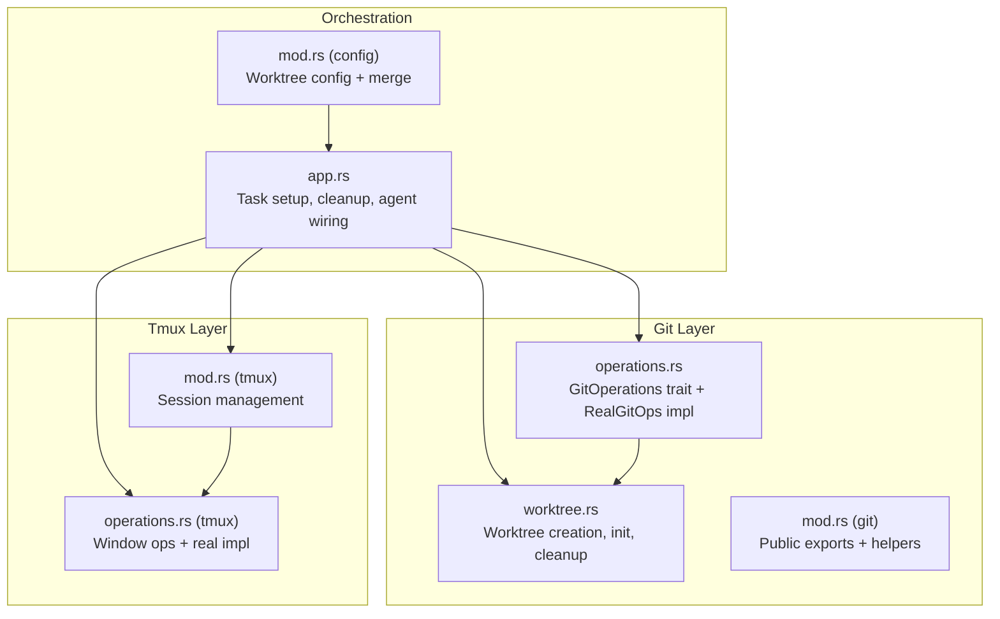
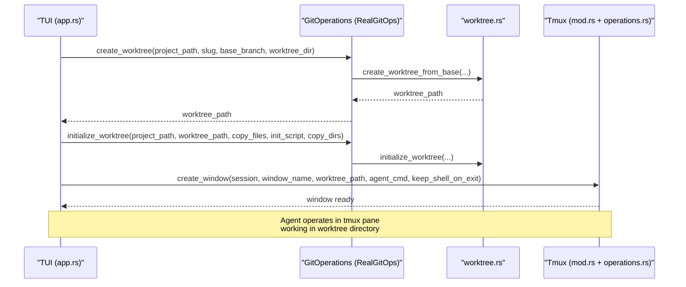
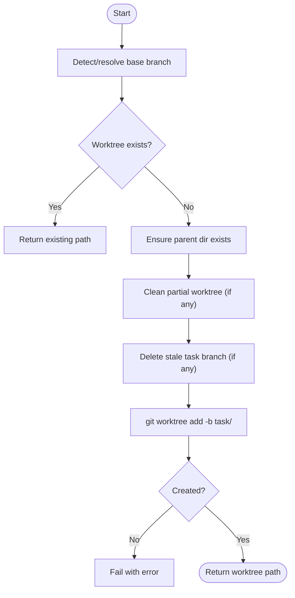
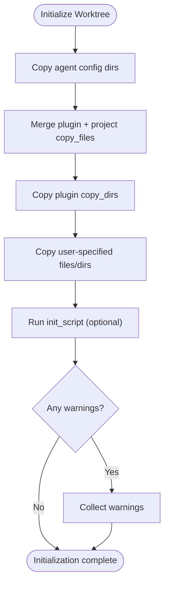
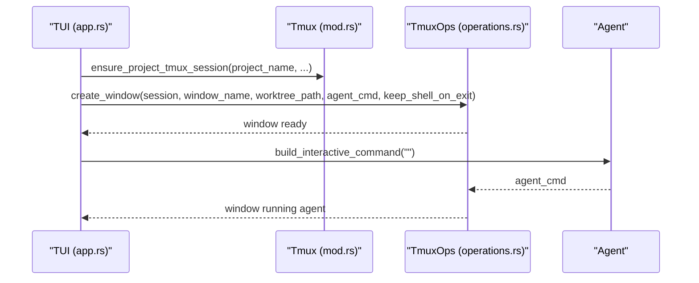
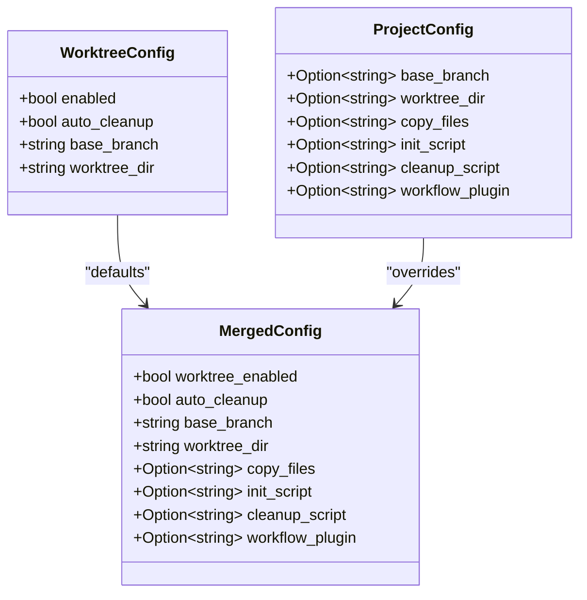
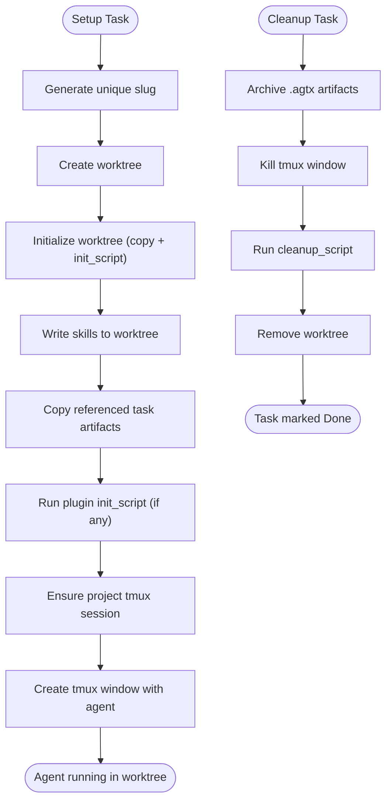
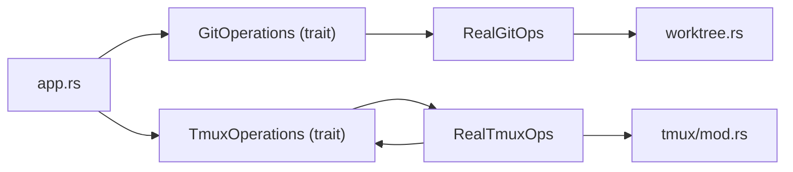

# Git Worktrees Integration

<cite>
**Referenced Files in This Document**
- [worktree.rs](file://src/git/worktree.rs)
- [operations.rs](file://src/git/operations.rs)
- [mod.rs (git)](file://src/git/mod.rs)
- [mod.rs (tmux)](file://src/tmux/mod.rs)
- [operations.rs (tmux)](file://src/tmux/operations.rs)
- [app.rs](file://src/tui/app.rs)
- [mod.rs (config)](file://src/config/mod.rs)
- [git_tests.rs](file://tests/git_tests.rs)
</cite>

## Table of Contents
1. [Introduction](#introduction)
2. [Project Structure](#project-structure)
3. [Core Components](#core-components)
4. [Architecture Overview](#architecture-overview)
5. [Detailed Component Analysis](#detailed-component-analysis)
6. [Dependency Analysis](#dependency-analysis)
7. [Performance Considerations](#performance-considerations)
8. [Troubleshooting Guide](#troubleshooting-guide)
9. [Conclusion](#conclusion)

## Introduction
This document explains how AGTX integrates Git worktrees to isolate agent sessions and prevent cross-task context interference. It covers worktree lifecycle management, configuration options for base branches and directories, file copying behavior, and how worktrees relate to tmux sessions and agent coordination. Practical examples are drawn from the codebase to show creation, initialization, and cleanup flows.

## Project Structure
The worktree integration spans several modules:
- Git worktree operations and helpers
- Git operation traits and real implementation
- Tmux session management for agent coordination
- TUI orchestration that wires worktrees and tmux windows together
- Configuration for worktree behavior and project-level customization

**Diagram sources**
- [worktree.rs:1-345](file://src/git/worktree.rs#L1-L345)
- [operations.rs:1-276](file://src/git/operations.rs#L1-L276)
- [mod.rs (git):1-142](file://src/git/mod.rs#L1-L142)
- [mod.rs (tmux):1-189](file://src/tmux/mod.rs#L1-L189)
- [operations.rs (tmux):1-249](file://src/tmux/operations.rs#L1-L249)
- [app.rs:6900-7200](file://src/tui/app.rs#L6900-L7200)
- [mod.rs (config):160-228](file://src/config/mod.rs#L160-L228)

**Section sources**
- [worktree.rs:1-345](file://src/git/worktree.rs#L1-L345)
- [operations.rs:1-276](file://src/git/operations.rs#L1-L276)
- [mod.rs (git):1-142](file://src/git/mod.rs#L1-L142)
- [mod.rs (tmux):1-189](file://src/tmux/mod.rs#L1-L189)
- [operations.rs (tmux):1-249](file://src/tmux/operations.rs#L1-L249)
- [app.rs:6900-7200](file://src/tui/app.rs#L6900-L7200)
- [mod.rs (config):160-228](file://src/config/mod.rs#L160-L228)

## Core Components
- Worktree creation and management
  - Create a worktree from a base branch, ensuring a fresh task branch and directory layout.
  - Resolve base branch (auto-detect main/master or configured branch).
  - Remove worktrees with force and pruning fallback.
- Worktree initialization
  - Copy agent configuration directories and user-specified files/directories into the worktree.
  - Optionally run an init script inside the worktree.
- Tmux session orchestration
  - Create tmux windows mapped to worktree directories so agents operate in isolated contexts.
  - Manage session lifecycle and pane interactions.
- Configuration
  - Global and project-level controls for worktree behavior, base branch, and copy targets.

**Section sources**
- [worktree.rs:8-65](file://src/git/worktree.rs#L8-L65)
- [worktree.rs:129-223](file://src/git/worktree.rs#L129-L223)
- [worktree.rs:275-317](file://src/git/worktree.rs#L275-L317)
- [operations.rs:11-75](file://src/git/operations.rs#L11-L75)
- [operations.rs:80-275](file://src/git/operations.rs#L80-L275)
- [mod.rs (tmux):14-48](file://src/tmux/mod.rs#L14-L48)
- [operations.rs (tmux):64-110](file://src/tmux/operations.rs#L64-L110)
- [mod.rs (config):160-228](file://src/config/mod.rs#L160-L228)

## Architecture Overview
The TUI orchestrates worktrees and tmux windows together. For each task:
- A worktree is created under a configured directory and branch.
- The worktree is initialized with agent configs and optional files/scripts.
- A tmux window is created targeting the worktree directory, launching the agent command.
- On completion or cancellation, artifacts are archived, the cleanup script runs, and the worktree is removed.

**Diagram sources**
- [app.rs:7041-7200](file://src/tui/app.rs#L7041-L7200)
- [operations.rs:80-91](file://src/git/operations.rs#L80-L91)
- [worktree.rs:14-65](file://src/git/worktree.rs#L14-L65)
- [worktree.rs:129-223](file://src/git/worktree.rs#L129-L223)
- [operations.rs (tmux):64-110](file://src/tmux/operations.rs#L64-L110)

## Detailed Component Analysis

### Worktree Lifecycle
- Creation
  - Detects or verifies the base branch, ensures a unique task branch, and creates the worktree directory.
  - Cleans up any partial worktree and ensures parent directories exist.
- Initialization
  - Copies agent config directories and plugin/project-specified files/directories.
  - Runs an init script inside the worktree and collects warnings for non-fatal failures.
- Removal
  - Removes the worktree with force and falls back to pruning if needed.

**Diagram sources**
- [worktree.rs:14-65](file://src/git/worktree.rs#L14-L65)
- [worktree.rs:67-84](file://src/git/worktree.rs#L67-L84)

**Section sources**
- [worktree.rs:8-65](file://src/git/worktree.rs#L8-L65)
- [worktree.rs:129-223](file://src/git/worktree.rs#L129-L223)
- [worktree.rs:275-297](file://src/git/worktree.rs#L275-L297)

### Worktree Initialization Details
- Agent config directories are always copied from the project root into the worktree.
- Plugin-level and project-level copy directories/files are merged and copied recursively.
- An init script can be executed inside the worktree; non-zero exit codes produce warnings.
- Copy operations handle missing source entries gracefully with warnings.

**Diagram sources**
- [worktree.rs:129-223](file://src/git/worktree.rs#L129-L223)

**Section sources**
- [worktree.rs:86-94](file://src/git/worktree.rs#L86-L94)
- [worktree.rs:129-223](file://src/git/worktree.rs#L129-L223)

### Tmux Integration and Agent Coordination
- Tmux server name is standardized for agent sessions.
- Windows are created targeting the worktree directory so agents operate in isolation.
- The TUI ensures a project-level tmux session exists and manages window lifecycle.
- Agent commands are built depending on whether the agent supports native skill invocation.

**Diagram sources**
- [mod.rs (tmux):14-48](file://src/tmux/mod.rs#L14-L48)
- [operations.rs (tmux):64-110](file://src/tmux/operations.rs#L64-L110)
- [app.rs:7180-7200](file://src/tui/app.rs#L7180-L7200)

**Section sources**
- [mod.rs (tmux):11-12](file://src/tmux/mod.rs#L11-L12)
- [mod.rs (tmux):14-48](file://src/tmux/mod.rs#L14-L48)
- [operations.rs (tmux):64-110](file://src/tmux/operations.rs#L64-L110)
- [app.rs:7180-7200](file://src/tui/app.rs#L7180-L7200)

### Configuration Options
- Global worktree settings
  - Enabled: toggle worktree usage.
  - Auto cleanup: remove worktrees after task completion.
  - Base branch: empty means auto-detect main/master.
  - Worktree directory: relative to project root; defaults to a hidden directory.
- Project-level overrides
  - Base branch, worktree directory, copy files, init script, cleanup script, and workflow plugin settings.
- Merged configuration
  - Project settings override global defaults; otherwise global defaults apply.

**Diagram sources**
- [mod.rs (config):160-178](file://src/config/mod.rs#L160-L178)
- [mod.rs (config):200-228](file://src/config/mod.rs#L200-L228)
- [mod.rs (config):355-408](file://src/config/mod.rs#L355-L408)

**Section sources**
- [mod.rs (config):160-178](file://src/config/mod.rs#L160-L178)
- [mod.rs (config):200-228](file://src/config/mod.rs#L200-L228)
- [mod.rs (config):355-408](file://src/config/mod.rs#L355-L408)

### Orchestration: Task Setup and Cleanup
- Task setup
  - Generates a unique slug, creates a worktree, initializes it, writes skills, copies references, optionally runs plugin init scripts, ensures tmux session, and creates a window with the agent command.
- Cleanup
  - Archives artifacts, kills tmux window, runs cleanup script, removes worktree, and marks task as done.

**Diagram sources**
- [app.rs:6944-6988](file://src/tui/app.rs#L6944-L6988)
- [app.rs:6990-7031](file://src/tui/app.rs#L6990-L7031)
- [app.rs:7041-7200](file://src/tui/app.rs#L7041-L7200)

**Section sources**
- [app.rs:6944-6988](file://src/tui/app.rs#L6944-L6988)
- [app.rs:6990-7031](file://src/tui/app.rs#L6990-L7031)
- [app.rs:7041-7200](file://src/tui/app.rs#L7041-L7200)

## Dependency Analysis
- Git operations are abstracted behind a trait to enable testing and reuse.
- RealGitOps delegates to worktree.rs for actual git commands.
- Tmux operations are similarly abstracted and implemented in operations.rs.
- The TUI composes these layers to coordinate worktrees and tmux windows.

**Diagram sources**
- [operations.rs:11-75](file://src/git/operations.rs#L11-L75)
- [operations.rs:80-275](file://src/git/operations.rs#L80-L275)
- [operations.rs (tmux):8-59](file://src/tmux/operations.rs#L8-L59)
- [operations.rs (tmux):64-249](file://src/tmux/operations.rs#L64-L249)
- [worktree.rs:1-345](file://src/git/worktree.rs#L1-L345)
- [mod.rs (tmux):1-189](file://src/tmux/mod.rs#L1-L189)

**Section sources**
- [operations.rs:11-75](file://src/git/operations.rs#L11-L75)
- [operations.rs (tmux):8-59](file://src/tmux/operations.rs#L8-L59)

## Performance Considerations
- Worktree creation and initialization involve filesystem operations and optional script execution; keep copy_files minimal to reduce overhead.
- Using a dedicated worktree directory avoids cluttering the project root and improves cleanup reliability.
- Running cleanup scripts and pruning worktrees helps maintain a healthy repository state.

## Troubleshooting Guide
- Worktree creation fails
  - Verify the base branch exists or leave it empty to auto-detect main/master.
  - Ensure the worktree directory path is writable and free of stale partial worktrees.
  - Check for permission issues or concurrent processes interfering with git operations.
- Worktree removal fails
  - Uncommitted changes are handled with force; if removal still fails, prune worktrees to clean up metadata.
- Initialization warnings
  - Missing copy_files entries produce warnings; confirm paths exist or adjust configuration.
- Tmux session issues
  - Confirm the tmux server name is consistent and the tmux binary is available.
  - Ensure the tmux window target matches the session and window naming convention.

Concrete references:
- Worktree creation and base branch resolution
  - [worktree.rs:14-65](file://src/git/worktree.rs#L14-L65)
  - [worktree.rs:67-84](file://src/git/worktree.rs#L67-L84)
- Worktree removal and pruning
  - [worktree.rs:275-297](file://src/git/worktree.rs#L275-L297)
- Worktree initialization and warnings
  - [worktree.rs:129-223](file://src/git/worktree.rs#L129-L223)
- Tmux session and window creation
  - [mod.rs (tmux):14-48](file://src/tmux/mod.rs#L14-L48)
  - [operations.rs (tmux):64-110](file://src/tmux/operations.rs#L64-L110)
- Integration tests validating behavior
  - [git_tests.rs:286-312](file://tests/git_tests.rs#L286-L312)

**Section sources**
- [worktree.rs:14-65](file://src/git/worktree.rs#L14-L65)
- [worktree.rs:67-84](file://src/git/worktree.rs#L67-L84)
- [worktree.rs:275-297](file://src/git/worktree.rs#L275-L297)
- [worktree.rs:129-223](file://src/git/worktree.rs#L129-L223)
- [mod.rs (tmux):14-48](file://src/tmux/mod.rs#L14-L48)
- [operations.rs (tmux):64-110](file://src/tmux/operations.rs#L64-L110)
- [git_tests.rs:286-312](file://tests/git_tests.rs#L286-L312)

## Conclusion
AGTX isolates agent sessions by combining Git worktrees and tmux windows. Worktrees provide filesystem-level separation, while tmux windows ensure process-level isolation. Configuration allows flexible control over base branches, worktree directories, and initialization steps. The TUI coordinates these components to deliver a robust, reproducible environment for multi-agent development workflows.