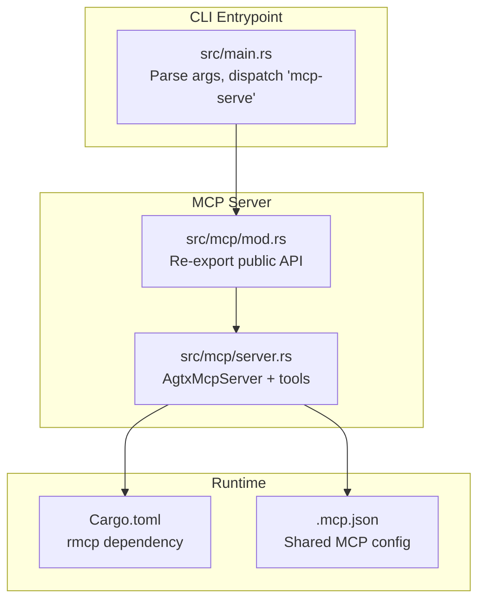
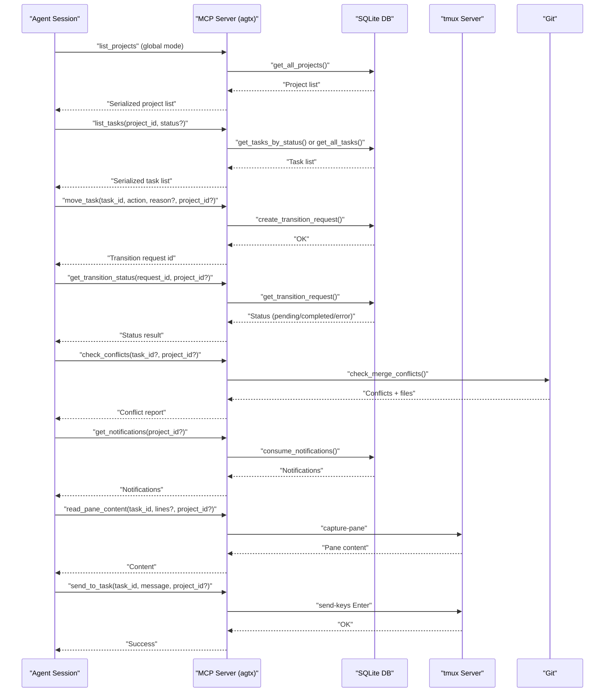
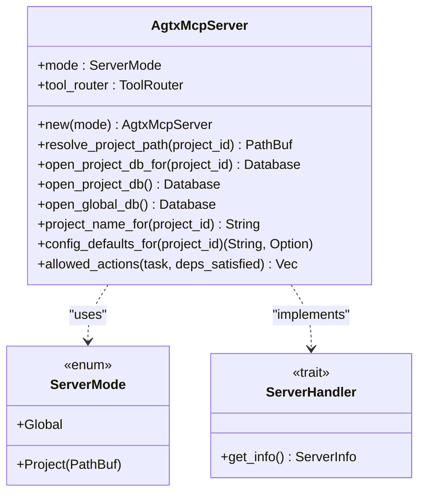
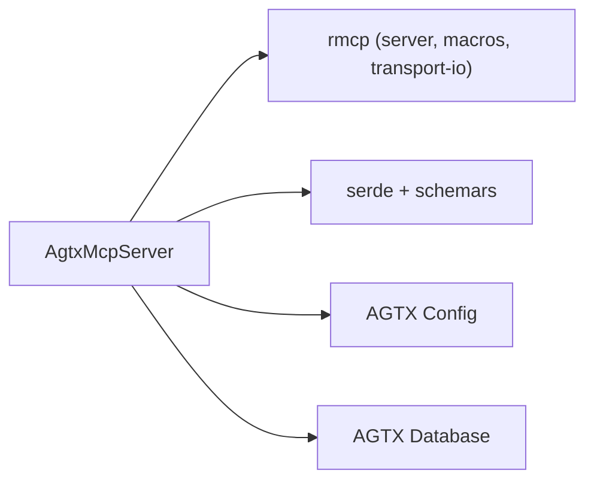

# MCP Integration

<cite>
**Referenced Files in This Document**
- [README.md](file://README.md)
- [CLAUDE.md](file://CLAUDE.md)
- [src/mcp/mod.rs](file://src/mcp/mod.rs)
- [src/mcp/server.rs](file://src/mcp/server.rs)
- [src/main.rs](file://src/main.rs)
- [Cargo.toml](file://Cargo.toml)
- [.mcp.json](file://.mcp.json)
- [tests/mcp_tests.rs](file://tests/mcp_tests.rs)
</cite>

## Table of Contents
1. [Introduction](#introduction)
2. [Project Structure](#project-structure)
3. [Core Components](#core-components)
4. [Architecture Overview](#architecture-overview)
5. [Detailed Component Analysis](#detailed-component-analysis)
6. [Dependency Analysis](#dependency-analysis)
7. [Performance Considerations](#performance-considerations)
8. [Troubleshooting Guide](#troubleshooting-guide)
9. [Conclusion](#conclusion)
10. [Appendices](#appendices)

## Introduction
This document explains how AGTX implements the Model Context Protocol (MCP) server to expose its task board and agent orchestration capabilities to external coding agents. It covers the MCP server modes, JSON-RPC communication patterns, tool exposure, protocol implementation, configuration options, and client usage. It also describes how the MCP server integrates with agent orchestration and workflow management, and provides practical guidance for common issues.

## Project Structure
AGTX’s MCP integration is centered around a small module that implements an MCP server over stdio and exposes a curated set of tools for task lifecycle management and diagnostics. The server is invoked via a dedicated CLI subcommand and can operate in two modes: global (cross-project) and project-scoped (single project).

**Diagram sources**
- [src/main.rs:30-46](file://src/main.rs#L30-L46)
- [src/mcp/mod.rs:1-5](file://src/mcp/mod.rs#L1-L5)
- [src/mcp/server.rs:1245-1264](file://src/mcp/server.rs#L1245-L1264)
- [Cargo.toml:37](file://Cargo.toml#L37)
- [.mcp.json:1-8](file://.mcp.json#L1-L8)

**Section sources**
- [src/main.rs:30-46](file://src/main.rs#L30-L46)
- [src/mcp/mod.rs:1-5](file://src/mcp/mod.rs#L1-L5)
- [src/mcp/server.rs:1245-1264](file://src/mcp/server.rs#L1245-L1264)
- [Cargo.toml:37](file://Cargo.toml#L37)
- [.mcp.json:1-8](file://.mcp.json#L1-L8)

## Core Components
- MCP Server entrypoint and mode selection
  - The CLI parses arguments and routes to the MCP server when the subcommand is detected. It validates whether a project path is provided and ensures it is a git repository before starting the server.
  - The server supports two modes:
    - Global mode: serves all projects indexed in the global database; CRUD tools require a project_id parameter.
    - Project-scoped mode: bound to a single project path; project_id is ignored and resolved at startup.

- MCP Server implementation
  - The server uses the rmcp library to implement the MCP server over stdio. It defines a tool router and a ServerHandler implementation that advertises tool capabilities and server info.
  - The server exposes a comprehensive set of tools for listing projects, listing tasks, retrieving task details, creating/updating/deleting tasks, queuing transitions, checking transition status, conflict detection, notifications, and agent pane diagnostics.

- Configuration and client registration
  - AGTX ships with a shared MCP configuration that registers the server as an stdio-based MCP server. Clients can register this server with their agent session to gain access to the tools.

**Section sources**
- [src/main.rs:30-46](file://src/main.rs#L30-L46)
- [src/mcp/server.rs:16-24](file://src/mcp/server.rs#L16-L24)
- [src/mcp/server.rs:1218-1243](file://src/mcp/server.rs#L1218-L1243)
- [.mcp.json:1-8](file://.mcp.json#L1-L8)

## Architecture Overview
The MCP server operates as a JSON-RPC service over stdio, exposing tools that clients can call to interact with AGTX’s task board and orchestration. The orchestrator agent uses these tools to advance tasks, monitor progress, and diagnose issues.

**Diagram sources**
- [src/mcp/server.rs:521-1216](file://src/mcp/server.rs#L521-L1216)
- [src/mcp/server.rs:1245-1264](file://src/mcp/server.rs#L1245-L1264)

**Section sources**
- [src/mcp/server.rs:521-1216](file://src/mcp/server.rs#L521-L1216)
- [src/mcp/server.rs:1245-1264](file://src/mcp/server.rs#L1245-L1264)

## Detailed Component Analysis

### MCP Server Modes and Tool Exposure
- Server modes
  - Global mode: Requires project_id for all CRUD tools. The server resolves the project path via the global database and enforces parameter requirements.
  - Project-scoped mode: The project path is fixed at startup; project_id is ignored.

- Tool categories
  - Project discovery: list_projects
  - Task listing and details: list_tasks, get_task (includes allowed_actions)
  - Task lifecycle: create_task, create_tasks_batch, update_task, delete_task
  - Transitions: move_task, get_transition_status
  - Diagnostics: check_conflicts, get_notifications, read_pane_content, send_to_task

- Tool parameters and responses
  - Parameters are strongly typed and documented via JSON Schema annotations on parameter structs.
  - Responses are serialized to pretty-printed JSON for readability.

- Allowed actions computation
  - The server computes allowed_actions based on the task’s current status and plugin rules, ensuring transitions adhere to workflow constraints.

- Conflict detection
  - Uses a non-destructive git merge-tree check to detect conflicts against the main branch and reports affected files.

- Notifications
  - Provides pending notifications and consumes them to prevent duplicates.

- Pane diagnostics
  - Reads recent pane content from tmux and sends messages to a task’s agent pane.

**Section sources**
- [src/mcp/server.rs:16-24](file://src/mcp/server.rs#L16-L24)
- [src/mcp/server.rs:28-244](file://src/mcp/server.rs#L28-L244)
- [src/mcp/server.rs:473-518](file://src/mcp/server.rs#L473-L518)
- [src/mcp/server.rs:757-832](file://src/mcp/server.rs#L757-L832)
- [src/mcp/server.rs:834-858](file://src/mcp/server.rs#L834-L858)
- [src/mcp/server.rs:860-974](file://src/mcp/server.rs#L860-L974)
- [src/mcp/server.rs:976-1216](file://src/mcp/server.rs#L976-L1216)

### JSON-RPC Communication Patterns
- Transport
  - The server uses stdio transport via rmcp’s stdio transport abstraction. This is ideal for agent integration because it avoids network overhead and simplifies registration.

- Request/Response
  - Requests are routed to tool handlers based on the tool name. Responses are serialized JSON strings containing the tool’s result.

- Capabilities advertisement
  - The ServerHandler advertises tool capabilities, enabling clients to discover available tools dynamically.

- Error handling
  - The server returns descriptive error messages for invalid parameters, missing resources, and internal failures.

**Section sources**
- [src/mcp/server.rs:1218-1243](file://src/mcp/server.rs#L1218-L1243)
- [src/mcp/server.rs:1245-1264](file://src/mcp/server.rs#L1245-L1264)

### Configuration Options and Client Usage
- Server configuration
  - The MCP server is invoked via the CLI subcommand “mcp-serve”. Passing a project path enables project-scoped mode; omitting the path enables global mode.
  - The server validates that a provided path is a git repository before starting.

- Client registration
  - AGTX provides a shared MCP configuration that registers the server as an stdio-based MCP server. Clients can add this server to their agent session using the agent’s MCP registration mechanism.

- Agent-specific registration examples
  - The README documents how to register the MCP server with Claude Code, Codex, Gemini CLI, and Cursor.

- Project discovery in global mode
  - In global mode, clients must call list_projects first to obtain project IDs and then pass project_id to all CRUD tools.

**Section sources**
- [src/main.rs:30-46](file://src/main.rs#L30-L46)
- [.mcp.json:1-8](file://.mcp.json#L1-L8)
- [README.md:186-260](file://README.md#L186-L260)
- [README.md:573-603](file://README.md#L573-L603)

### Relationship with Agent Orchestration and Workflow Management
- Orchestrator role
  - The orchestrator agent uses MCP tools to monitor tasks, advance phases, and diagnose issues. It relies on push-when-idle notifications and manual polling via get_notifications.

- Tool usage in orchestrator flow
  - The orchestrator calls list_tasks/get_task to determine allowed_actions, then move_task to queue transitions. It checks get_transition_status to ensure completion and escalates tasks when necessary.

- Pane diagnostics and nudging
  - When tasks become idle, the orchestrator reads pane content and sends messages to nudge stuck agents or escalate to the user.

- Cleanup and registration lifecycle
  - MCP registration is scoped per session and cleaned up when the orchestrator exits.

**Section sources**
- [CLAUDE.md:191-213](file://CLAUDE.md#L191-L213)
- [CLAUDE.md:215-227](file://CLAUDE.md#L215-L227)
- [README.md:623-646](file://README.md#L623-L646)

### Class Diagram: AgtxMcpServer and Related Types

**Diagram sources**
- [src/mcp/server.rs:16-24](file://src/mcp/server.rs#L16-L24)
- [src/mcp/server.rs:395-519](file://src/mcp/server.rs#L395-L519)
- [src/mcp/server.rs:1218-1243](file://src/mcp/server.rs#L1218-L1243)

## Dependency Analysis
- External dependencies
  - rmcp provides the MCP server framework, tool routing macros, and stdio transport.
  - serde and schemars enable parameter serialization and JSON Schema generation for tool parameters.

- Internal dependencies
  - The server depends on AGTX’s configuration and database layers to resolve project paths, open project/global databases, and enforce workflow rules.

**Diagram sources**
- [Cargo.toml:37](file://Cargo.toml#L37)
- [src/mcp/server.rs:4-11](file://src/mcp/server.rs#L4-L11)

**Section sources**
- [Cargo.toml:37](file://Cargo.toml#L37)
- [src/mcp/server.rs:4-11](file://src/mcp/server.rs#L4-L11)

## Performance Considerations
- Tool routing and serialization
  - Tools return pretty-printed JSON for readability; consider the trade-off between human-readability and payload size for high-frequency tool calls.

- Conflict detection
  - Conflict checks use non-destructive git operations; keep the number of concurrent checks reasonable to avoid excessive git operations.

- Notifications
  - Notifications are consumed and cleared after retrieval; ensure clients poll efficiently to avoid redundant calls.

- Transition requests
  - Queued transitions are processed asynchronously; clients should poll get_transition_status to avoid busy-waiting.

[No sources needed since this section provides general guidance]

## Troubleshooting Guide
- Connection and registration issues
  - Ensure the MCP server is started with the correct mode: global vs project-scoped. In global mode, always pass project_id to CRUD tools.
  - Verify that the project path provided to project-scoped mode is a valid git repository.

- Permission and environment
  - The server requires tmux and git to be available for pane diagnostics and conflict checks. Confirm tmux server “agtx” is running and accessible.

- Parameter validation
  - Many tools validate parameters and return descriptive errors. For example, move_task rejects invalid actions, and CRUD tools require Backlog status for updates/deletes.

- Transition status
  - If get_transition_status returns pending, wait for the TUI to process the request. If it remains pending for extended periods, check the TUI logs and database entries.

- Notifications
  - If get_notifications returns empty, ensure the orchestrator is running and has sent notifications. Alternatively, rely on push-when-idle notifications.

**Section sources**
- [src/main.rs:36-44](file://src/main.rs#L36-L44)
- [src/mcp/server.rs:655-721](file://src/mcp/server.rs#L655-L721)
- [src/mcp/server.rs:1180-1216](file://src/mcp/server.rs#L1180-L1216)

## Conclusion
AGTX’s MCP server provides a robust, agent-friendly interface to the task board and orchestration pipeline. Its dual-mode operation, comprehensive tool set, and JSON-RPC over stdio make it suitable for both ad-hoc integrations and orchestrated workflows. By following the configuration and usage patterns outlined here, teams can integrate AGTX with their preferred agents and automate task lifecycle management effectively.

[No sources needed since this section summarizes without analyzing specific files]

## Appendices

### MCP Tools Reference
- list_projects: List all projects indexed by AGTX.
- list_tasks: List tasks, optionally filtered by status.
- get_task: Get task details including allowed_actions.
- create_task: Create a single backlog task.
- create_tasks_batch: Batch-create tasks with index-based dependencies.
- update_task: Modify a backlog task (title, description, plugin, referenced_tasks, base_branch).
- delete_task: Delete a backlog task.
- move_task: Queue a phase transition.
- get_transition_status: Check if a queued transition completed or errored.
- check_conflicts: Non-destructive merge conflict check against default branch.
- get_notifications: Fetch pending orchestrator notifications.
- read_pane_content: Read the last N lines of a task’s tmux pane.
- send_to_task: Send a message to a task’s agent pane.

**Section sources**
- [README.md:586-603](file://README.md#L586-L603)
- [src/mcp/server.rs:521-1216](file://src/mcp/server.rs#L521-L1216)

### Test Coverage Highlights
- Transition request lifecycle: creation, pending retrieval, completion marking, and cleanup.
- Task CRUD operations: creation, batch creation with dependency resolution, updates, and deletions.
- Project indexing and retrieval in global mode.
- Notification consumption and ordering guarantees.

**Section sources**
- [tests/mcp_tests.rs:5-151](file://tests/mcp_tests.rs#L5-L151)
- [tests/mcp_tests.rs:152-285](file://tests/mcp_tests.rs#L152-L285)
- [tests/mcp_tests.rs:357-472](file://tests/mcp_tests.rs#L357-L472)