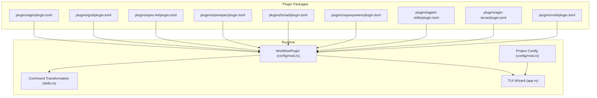
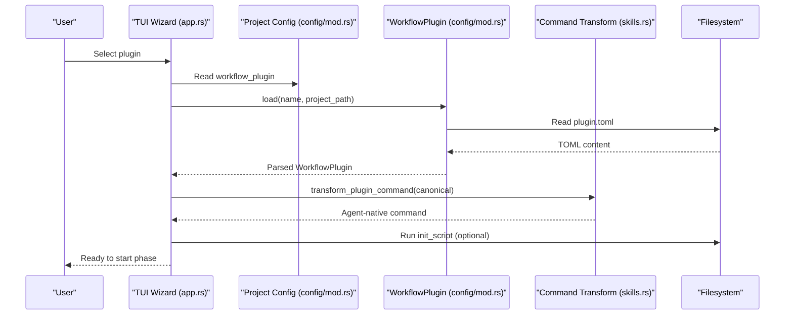
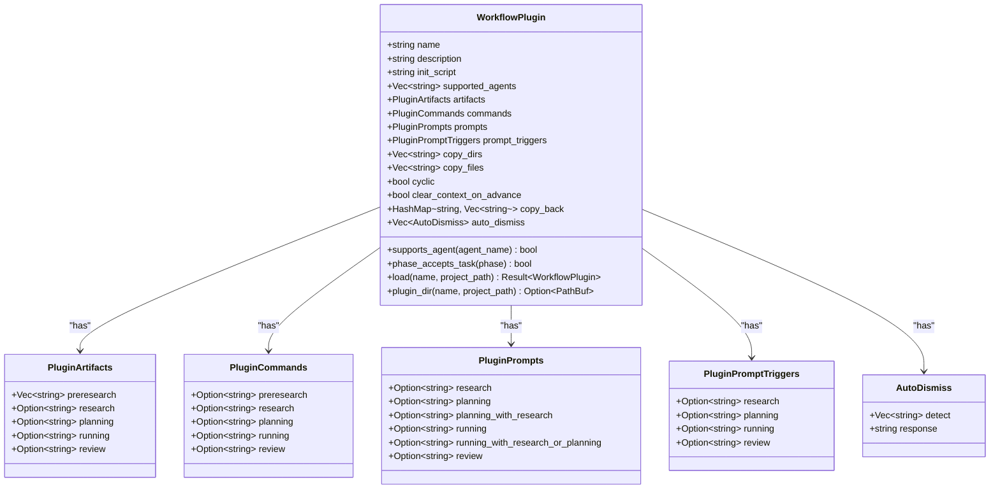
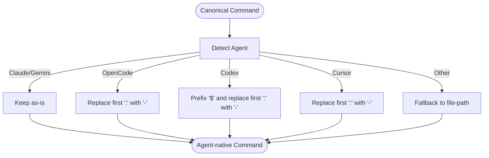
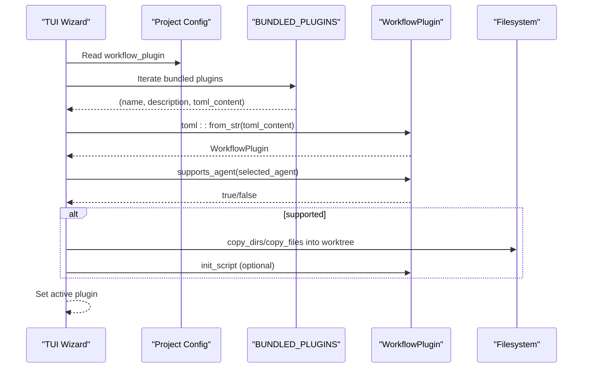
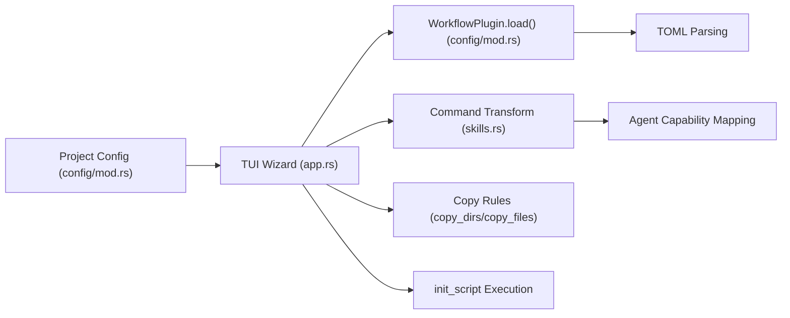

# Plugin System Architecture

<cite>
**Referenced Files in This Document**
- [plugin.toml](file://plugins/agtx/plugin.toml)
- [plugin.toml](file://plugins/agent-skills/plugin.toml)
- [plugin.toml](file://plugins/agtx-terse/plugin.toml)
- [plugin.toml](file://plugins/bmad/plugin.toml)
- [plugin.toml](file://plugins/gsd/plugin.toml)
- [plugin.toml](file://plugins/openspec/plugin.toml)
- [plugin.toml](file://plugins/spec-kit/plugin.toml)
- [plugin.toml](file://plugins/superpowers/plugin.toml)
- [plugin.toml](file://plugins/void/plugin.toml)
- [mod.rs](file://src/config/mod.rs)
- [mod.rs](file://src/skills.rs)
- [app.rs](file://src/tui/app.rs)
- [app_tests.rs](file://src/tui/app_tests.rs)
- [main.rs](file://src/main.rs)
</cite>

## Table of Contents
1. [Introduction](#introduction)
2. [Project Structure](#project-structure)
3. [Core Components](#core-components)
4. [Architecture Overview](#architecture-overview)
5. [Detailed Component Analysis](#detailed-component-analysis)
6. [Dependency Analysis](#dependency-analysis)
7. [Performance Considerations](#performance-considerations)
8. [Troubleshooting Guide](#troubleshooting-guide)
9. [Conclusion](#conclusion)

## Introduction
This document explains AGTX’s plugin system architecture and how it enables spec-driven workflows through TOML configuration. It covers plugin structure, command transformation, artifact tracking, configuration options, and integration with agents and workflow management. Examples are drawn from the actual codebase to show how plugins are defined, discovered, and executed.

## Project Structure
AGTX organizes plugins as discrete TOML-based packages under the plugins/ directory. Each plugin exposes a plugin.toml file that defines:
- Name, description, and optional initialization scripts
- Supported agents
- Artifacts per workflow phase
- Commands and prompts per phase
- Optional copy-back rules and auto-dismiss behavior

Plugins are either bundled at compile time or installed locally/global into ~/.config/agtx/plugins/<name>.

**Diagram sources**
- [plugin.toml:1-16](file://plugins/agtx/plugin.toml#L1-L16)
- [plugin.toml:1-34](file://plugins/gsd/plugin.toml#L1-L34)
- [plugin.toml:1-21](file://plugins/spec-kit/plugin.toml#L1-L21)
- [plugin.toml:1-21](file://plugins/openspec/plugin.toml#L1-L21)
- [plugin.toml:1-22](file://plugins/bmad/plugin.toml#L1-L22)
- [plugin.toml:1-16](file://plugins/superpowers/plugin.toml#L1-L16)
- [plugin.toml:1-19](file://plugins/agent-skills/plugin.toml#L1-L19)
- [plugin.toml:1-16](file://plugins/agtx-terse/plugin.toml#L1-L16)
- [plugin.toml:1-4](file://plugins/void/plugin.toml#L1-L4)
- [mod.rs:410-451](file://src/config/mod.rs#L410-L451)
- [mod.rs:93-115](file://src/skills.rs#L93-L115)
- [app.rs:4410-4442](file://src/tui/app.rs#L4410-L4442)

**Section sources**
- [plugin.toml:1-16](file://plugins/agtx/plugin.toml#L1-L16)
- [plugin.toml:1-34](file://plugins/gsd/plugin.toml#L1-L34)
- [plugin.toml:1-21](file://plugins/spec-kit/plugin.toml#L1-L21)
- [plugin.toml:1-21](file://plugins/openspec/plugin.toml#L1-L21)
- [plugin.toml:1-22](file://plugins/bmad/plugin.toml#L1-L22)
- [plugin.toml:1-16](file://plugins/superpowers/plugin.toml#L1-L16)
- [plugin.toml:1-19](file://plugins/agent-skills/plugin.toml#L1-L19)
- [plugin.toml:1-16](file://plugins/agtx-terse/plugin.toml#L1-L16)
- [plugin.toml:1-4](file://plugins/void/plugin.toml#L1-L4)

## Core Components
- WorkflowPlugin: Describes a plugin’s metadata, supported agents, artifacts, commands, prompts, and operational flags. It also loads plugin.toml from project-local or global locations and validates agent compatibility.
- Command Transformation: Converts canonical plugin commands into agent-specific invocations (e.g., transforming namespace:command into agent-native forms).
- Artifact Tracking: Uses glob patterns to detect phase completion and manage copy-back operations.
- TUI Integration: Presents plugin options, filters by agent support, and orchestrates plugin init scripts and file copying during task setup.

Key responsibilities:
- Parsing plugin.toml and validating structure
- Filtering plugins by agent support
- Resolving plugin directory and loading skill content
- Generating tmux send_keys commands for agent invocation
- Managing pre/post phase copy-back and auto-dismiss behavior

**Section sources**
- [mod.rs:410-451](file://src/config/mod.rs#L410-L451)
- [mod.rs:545-572](file://src/config/mod.rs#L545-L572)
- [mod.rs:574-594](file://src/config/mod.rs#L574-L594)
- [mod.rs:93-115](file://src/skills.rs#L93-L115)
- [mod.rs:141-194](file://src/skills.rs#L141-L194)
- [app.rs:4410-4442](file://src/tui/app.rs#L4410-L4442)

## Architecture Overview
The plugin system centers on a TOML-driven configuration model. At runtime:
- Plugins are loaded from embedded bundles or filesystem locations
- Agents’ capabilities determine which plugins are selectable
- Commands and prompts are transformed to agent-native syntax
- Artifacts are tracked via glob patterns; copy-back rules move outputs back to the project
- Auto-dismiss rules automate interactive prompts in tmux panes

**Diagram sources**
- [app.rs:4410-4442](file://src/tui/app.rs#L4410-L4442)
- [mod.rs:545-572](file://src/config/mod.rs#L545-L572)
- [mod.rs:93-115](file://src/skills.rs#L93-L115)

## Detailed Component Analysis

### Plugin Configuration Model
WorkflowPlugin encapsulates all plugin configuration:
- Metadata: name, description
- Agent gating: supported_agents
- Operational flags: cyclic, clear_context_on_advance
- Artifacts: per-phase artifact patterns
- Commands: per-phase slash commands
- Prompts: per-phase prompt templates
- Prompt triggers: text to await before sending prompts
- Copy rules: copy_dirs, copy_files, copy_back
- Auto-dismiss: detect and response rules

**Diagram sources**
- [mod.rs:410-451](file://src/config/mod.rs#L410-L451)
- [mod.rs:464-462](file://src/config/mod.rs#L464-L462)

**Section sources**
- [mod.rs:410-451](file://src/config/mod.rs#L410-L451)
- [mod.rs:464-510](file://src/config/mod.rs#L464-L510)

### Command Transformation
AGTX transforms canonical plugin commands into agent-native forms:
- Claude/Gemini: keep canonical form
- OpenCode: replace first colon with hyphen
- Codex: prefix with $ and replace first colon with hyphen
- Cursor: similar to OpenCode
Unsupported agents fall back to file-path references

**Diagram sources**
- [mod.rs:93-115](file://src/skills.rs#L93-L115)

**Section sources**
- [mod.rs:93-115](file://src/skills.rs#L93-L115)

### Artifact Tracking and Copy-Back
Plugins define artifact patterns per phase. The system uses these patterns to:
- Detect phase completion
- Copy outputs back to the project root after a phase finishes

Patterns support wildcards and multiple files/directories. Copy-back rules are keyed by phase.

Examples from the codebase:
- agtx and agtx-terse define research, planning, running, and review artifacts under .agtx/
- gsd defines preresearch and research patterns under .planning/phases/*/{phase}-*.md
- openspec and spec-kit define patterns under openspec/ and specs/*/ respectively
- bmad defines planning and running outputs under _bmad-output/

**Section sources**
- [plugin.toml:5-9](file://plugins/agtx/plugin.toml#L5-L9)
- [plugin.toml:5-9](file://plugins/agtx-terse/plugin.toml#L5-L9)
- [plugin.toml:8-13](file://plugins/gsd/plugin.toml#L8-L13)
- [plugin.toml:7-9](file://plugins/openspec/plugin.toml#L7-L9)
- [plugin.toml:10-12](file://plugins/spec-kit/plugin.toml#L10-L12)
- [plugin.toml:6-8](file://plugins/bmad/plugin.toml#L6-L8)

### Plugin Selection and Agent Integration
The TUI wizard initializes plugin options and filters them by agent support. It:
- Loads bundled plugins and checks supported_agents against the selected agent
- Sets the active plugin based on project configuration
- Copies required directories/files into worktrees
- Executes plugin init_script if present

**Diagram sources**
- [app.rs:4410-4442](file://src/tui/app.rs#L4410-L4442)
- [mod.rs:141-194](file://src/skills.rs#L141-L194)
- [mod.rs:545-572](file://src/config/mod.rs#L545-L572)

**Section sources**
- [app.rs:4410-4442](file://src/tui/app.rs#L4410-L4442)
- [mod.rs:141-194](file://src/skills.rs#L141-L194)
- [mod.rs:545-572](file://src/config/mod.rs#L545-L572)

### Built-in Plugins and Customization
Built-in plugins are embedded at compile time and include:
- agtx and agtx-terse: default workflow with skills and prompts
- gsd: Get Shit Done framework with multi-phase artifacts
- spec-kit: GitHub Spec-Driven Development
- openspec: OpenSpec lightweight specification framework
- bmad: BMAD Method structured phases
- superpowers: brainstorming, plans, TDD, subagents
- agent-skills: Addy Osmani’s production-grade skills
- void: plain coding without prompting

Custom plugins can be installed into ~/.config/agtx/plugins/<name>/plugin.toml and referenced by project configuration.

**Section sources**
- [mod.rs:141-194](file://src/skills.rs#L141-L194)
- [plugin.toml:1-34](file://plugins/gsd/plugin.toml#L1-L34)
- [plugin.toml:1-21](file://plugins/spec-kit/plugin.toml#L1-L21)
- [plugin.toml:1-21](file://plugins/openspec/plugin.toml#L1-L21)
- [plugin.toml:1-22](file://plugins/bmad/plugin.toml#L1-L22)
- [plugin.toml:1-16](file://plugins/superpowers/plugin.toml#L1-L16)
- [plugin.toml:1-19](file://plugins/agent-skills/plugin.toml#L1-L19)
- [plugin.toml:1-16](file://plugins/agtx/pluginl#L1-L16)
- [plugin.toml:1-16](file://plugins/agtx-terse/plugin.toml#L1-L16)
- [plugin.toml:1-4](file://plugins/void/plugin.toml#L1-L4)

## Dependency Analysis
The plugin system integrates with configuration, skills, and TUI layers. Dependencies:
- WorkflowPlugin depends on TOML parsing and filesystem access
- Command transformation depends on agent capability mapping
- TUI wizard depends on plugin loading and copy-back rules
- Project configuration determines which plugin is active and influences agent selection

**Diagram sources**
- [mod.rs:545-572](file://src/config/mod.rs#L545-L572)
- [mod.rs:93-115](file://src/skills.rs#L93-L115)
- [app.rs:4410-4442](file://src/tui/app.rs#L4410-L4442)

**Section sources**
- [mod.rs:545-572](file://src/config/mod.rs#L545-L572)
- [mod.rs:93-115](file://src/skills.rs#L93-L115)
- [app.rs:4410-4442](file://src/tui/app.rs#L4410-L4442)

## Performance Considerations
- Plugin loading: Embedded bundled plugins avoid filesystem I/O; project-local/global lookups incur minimal overhead.
- Command transformation: Simple string transformations; negligible cost.
- Artifact detection: Glob expansion can be expensive with broad patterns; prefer specific paths when possible.
- Copy-back: Large directory trees increase I/O; limit copy_back to necessary artifacts.

## Troubleshooting Guide
Common issues and resolutions:
- Plugin not found
  - Ensure plugin.toml exists under ~/.config/agtx/plugins/<name>/ or project .agtx/plugins/<name>/
  - Verify the plugin name matches the workflow_plugin setting in project config
- Agent not supported
  - Check supported_agents in plugin.toml; remove or adjust the list
  - Switch to an agent included in supported_agents
- Command fails in tmux
  - Confirm command transformation for the agent matches the plugin’s canonical command
  - Validate prompt triggers and auto-dismiss rules if interactive prompts block progress
- Artifacts not detected
  - Adjust artifact patterns to match generated outputs
  - Use specific paths instead of broad globs to avoid missing files
- Plugin init_script failure
  - Review stderr output; fix the script or remove unsupported placeholders like {agent}
  - Ensure required tools (e.g., npx) are available in the worktree environment

**Section sources**
- [mod.rs:545-572](file://src/config/mod.rs#L545-L572)
- [mod.rs:93-115](file://src/skills.rs#L93-L115)
- [app.rs:7152-7178](file://src/tui/app.rs#L7152-L7178)

## Conclusion
AGTX’s plugin system provides a flexible, spec-driven workflow engine powered by TOML configuration. Plugins define commands, prompts, artifacts, and operational behaviors, while the runtime transforms commands for agent compatibility and manages artifact lifecycles. By combining embedded plugins with custom installations and robust agent integration, AGTX supports diverse development methodologies from lightweight to structured frameworks.