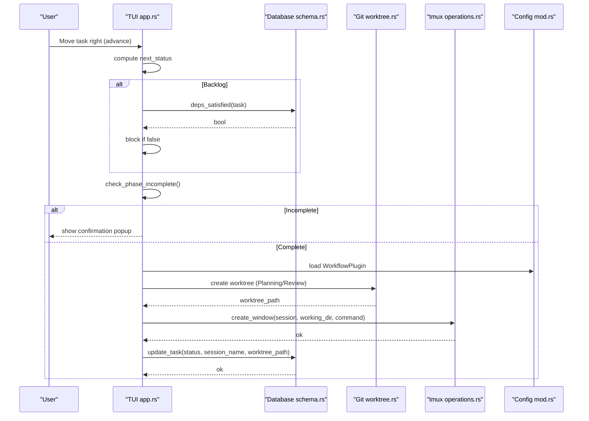
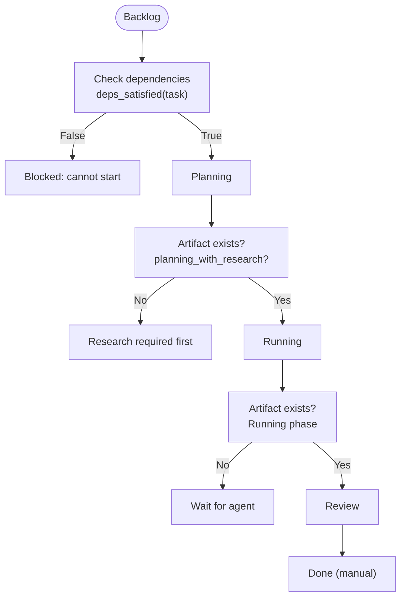
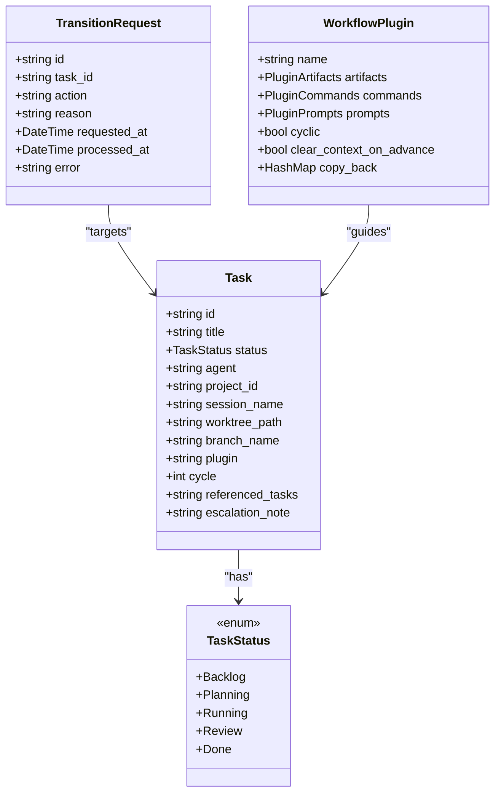

# Task Lifecycle and Phases

<cite>
**Referenced Files in This Document**
- [main.rs](file://src/main.rs)
- [lib.rs](file://src/lib.rs)
- [models.rs](file://src/db/models.rs)
- [schema.rs](file://src/db/schema.rs)
- [app.rs](file://src/tui/app.rs)
- [board.rs](file://src/tui/board.rs)
- [worktree.rs](file://src/git/worktree.rs)
- [operations.rs](file://src/tmux/operations.rs)
- [mod.rs](file://src/config/mod.rs)
- [plugin.toml](file://plugins/agtx/plugin.toml)
- [server.rs](file://src/mcp/server.rs)
- [orchestrate.md](file://plugins/agtx/skills/orchestrate.md)
- [app_tests.rs](file://src/tui/app_tests.rs)
</cite>

## Table of Contents
1. [Introduction](#introduction)
2. [Project Structure](#project-structure)
3. [Core Components](#core-components)
4. [Architecture Overview](#architecture-overview)
5. [Detailed Component Analysis](#detailed-component-analysis)
6. [Dependency Analysis](#dependency-analysis)
7. [Performance Considerations](#performance-considerations)
8. [Troubleshooting Guide](#troubleshooting-guide)
9. [Conclusion](#conclusion)

## Introduction
This document explains the five-phase task lifecycle: Backlog, Planning, Running, Review, and Done. It covers phase transitions, gating mechanisms, the role of artifacts in determining readiness, configuration options for customizing behavior, and integration with Git worktrees and tmux sessions. It also includes practical examples from the codebase, diagrams, and guidance for resolving common issues like stuck tasks.

## Project Structure
The task lifecycle spans several subsystems:
- TUI and board state for user-driven transitions
- Database models and persistence for task state
- Git worktree management for isolated task environments
- tmux integration for agent sessions and pane automation
- Configuration system for agents, worktrees, and workflow plugins
- MCP server for external orchestration and queued transitions

```mermaid
graph TB
subgraph "TUI"
APP["app.rs<br/>Task transitions, gating, UI"]
BOARD["board.rs<br/>Board state and selection"]
end
subgraph "Database"
MODELS["models.rs<br/>TaskStatus, Task, TransitionRequest"]
SCHEMA["schema.rs<br/>deps_satisfied, queries"]
end
subgraph "Git"
WT["worktree.rs<br/>create/remove worktrees"]
end
subgraph "tmux"
OPS["operations.rs<br/>window/session ops"]
end
subgraph "Config"
CFG["mod.rs<br/>GlobalConfig, ProjectConfig,<br/>WorkflowPlugin, MergedConfig"]
PLUG["plugin.toml<br/>artifacts, commands, prompts"]
end
subgraph "MCP"
MCP["server.rs<br/>Queued transitions, gating"]
end
APP --> MODELS
APP --> SCHEMA
APP --> WT
APP --> OPS
APP --> CFG
CFG --> PLUG
MCP --> SCHEMA
MCP --> MODELS
APP --> BOARD
```

**Diagram sources**
- [app.rs:4569-4638](file://src/tui/app.rs#L4569-L4638)
- [board.rs:1-99](file://src/tui/board.rs#L1-L99)
- [models.rs:58-133](file://src/db/models.rs#L58-L133)
- [schema.rs:387-393](file://src/db/schema.rs#L387-L393)
- [worktree.rs:1-345](file://src/git/worktree.rs#L1-L345)
- [operations.rs:1-249](file://src/tmux/operations.rs#L1-L249)
- [mod.rs:337-408](file://src/config/mod.rs#L337-L408)
- [plugin.toml:1-16](file://plugins/agtx/plugin.toml#L1-L16)
- [server.rs:679-708](file://src/mcp/server.rs#L679-L708)

**Section sources**
- [main.rs:16-96](file://src/main.rs#L16-L96)
- [lib.rs:10-24](file://src/lib.rs#L10-L24)

## Core Components
- TaskStatus defines the five phases and supports string conversion and display names.
- Task carries state, identifiers, and metadata (session name, worktree path, branch name, plugin, cycle, referenced tasks, escalation note).
- TransitionRequest enables external orchestration via MCP to queue state changes.
- WorkflowPlugin defines per-phase artifacts, commands, prompts, and configuration like clear_context_on_advance and copy_back.
- MergedConfig merges global and project settings to determine agents, worktree behavior, and workflow plugin selection.

**Section sources**
- [models.rs:5-56](file://src/db/models.rs#L5-L56)
- [models.rs:58-133](file://src/db/models.rs#L58-L133)
- [models.rs:159-184](file://src/db/models.rs#L159-L184)
- [mod.rs:410-451](file://src/config/mod.rs#L410-L451)
- [mod.rs:337-408](file://src/config/mod.rs#L337-L408)

## Architecture Overview
The lifecycle is driven by user actions in the TUI and external orchestration via MCP. Transitions are gated by dependencies and phase artifacts. Worktrees isolate Planning, Running, and Review phases, while tmux manages agent sessions.



**Diagram sources**
- [app.rs:4569-4638](file://src/tui/app.rs#L4569-L4638)
- [schema.rs:387-393](file://src/db/schema.rs#L387-L393)
- [worktree.rs:8-65](file://src/git/worktree.rs#L8-L65)
- [operations.rs:64-110](file://src/tmux/operations.rs#L64-L110)
- [mod.rs:410-451](file://src/config/mod.rs#L410-L451)

## Detailed Component Analysis

### Five-Phase Workflow
- Backlog: Initial state; tasks here are gated by dependencies.
- Planning: Requires either a plugin that accepts tasks directly or prior-phase artifacts.
- Running: Agent executes; readiness determined by phase artifacts and tmux activity.
- Review: Final human approval; transition to Done is manual.
- Done: Terminal state; user merges and cleans up.

Gating and transitions:
- Backlog → Planning blocks if dependencies are not in Review/Done.
- Planning → Running requires Planning artifacts or prior artifacts.
- Running → Review requires Running artifacts.
- Review → Done requires Review artifacts and user action.

**Section sources**
- [models.rs:47-56](file://src/db/models.rs#L47-L56)
- [app.rs:4578-4585](file://src/tui/app.rs#L4578-L4585)
- [schema.rs:387-393](file://src/db/schema.rs#L387-L393)
- [server.rs:686-698](file://src/mcp/server.rs#L686-L698)

### Phase Transitions and Gating Mechanisms
- Backlog to Planning:
  - Enforces dependency gate via deps_satisfied.
  - Uses plugin phase_accepts_task to decide if Research is required first.
- Planning to Running:
  - Determines phase variant based on prior artifacts.
  - Creates worktree and tmux window.
- Running to Review:
  - Checks artifact existence and agent activity.
- Review to Done:
  - Manual transition; user merges and cleans up.



**Diagram sources**
- [app.rs:4681-4700](file://src/tui/app.rs#L4681-L4700)
- [app.rs:8311-8350](file://src/tui/app.rs#L8311-L8350)
- [schema.rs:387-393](file://src/db/schema.rs#L387-L393)

**Section sources**
- [app.rs:4578-4638](file://src/tui/app.rs#L4578-L4638)
- [app.rs:4681-4700](file://src/tui/app.rs#L4681-L4700)
- [app.rs:8311-8350](file://src/tui/app.rs#L8311-L8350)

### Role of Artifacts in Determining Phase Completion
Artifacts are files produced by agents during a phase. The system checks for their presence to determine readiness:
- Zero-padded and non-padded cycle placeholders are supported.
- Wildcards are supported for glob matching.
- Research artifacts and prior-phase artifacts influence variant names.

Examples from the codebase:
- Artifact existence checks for Planning and Running.
- Variant determination based on prior artifacts.
- Copy-back rules for bringing artifacts into the project.

**Section sources**
- [app.rs:8294-8371](file://src/tui/app.rs#L8294-L8371)
- [app.rs:8311-8350](file://src/tui/app.rs#L8311-L8350)
- [mod.rs:444-446](file://src/config/mod.rs#L444-L446)

### Configuration Options for Customizing Phase Behavior
- Global and project configuration:
  - Agents per phase, worktree settings, base branch, copy files/init/cleanup scripts, workflow plugin.
- WorkflowPlugin:
  - Artifacts per phase, commands, prompts, prompt triggers, copy_back, auto_dismiss, cyclic, clear_context_on_advance.
- Example plugin configuration defines artifacts and commands for research, planning, running, and review.

Practical customization:
- Choose a workflow plugin via project config.
- Configure per-phase agents to route tasks to specific agents.
- Control worktree creation, base branch, and cleanup behavior.

**Section sources**
- [mod.rs:6-38](file://src/config/mod.rs#L6-L38)
- [mod.rs:199-228](file://src/config/mod.rs#L199-L228)
- [mod.rs:410-451](file://src/config/mod.rs#L410-L451)
- [plugin.toml:1-16](file://plugins/agtx/plugin.toml#L1-L16)

### Plugin Integration
Plugins define:
- Artifacts templates for each phase.
- Commands to invoke per phase.
- Prompts to send after commands.
- Variants (e.g., planning_with_research) based on prior artifacts.
- Optional copy_back rules to bring artifacts into the project.

The TUI loads the plugin and uses it to:
- Determine phase variants.
- Check artifact existence.
- Route tasks to appropriate agents.

**Section sources**
- [plugin.toml:5-16](file://plugins/agtx/plugin.toml#L5-L16)
- [mod.rs:410-451](file://src/config/mod.rs#L410-L451)
- [app.rs:8311-8350](file://src/tui/app.rs#L8311-L8350)

### Relationships with Git Worktrees and tmux Sessions
- Worktrees:
  - Created per task for Planning, Running, and Review.
  - Initialized with agent config directories, project-specified files, and optional init scripts.
  - Removed according to cleanup policy.
- tmux:
  - Windows are created per task session with working directory set to the worktree.
  - Commands are sent to tmux panes to trigger agent skills and prompts.
  - Pane capture and cursor info support automation and diagnostics.

**Section sources**
- [worktree.rs:8-65](file://src/git/worktree.rs#L8-L65)
- [worktree.rs:125-223](file://src/git/worktree.rs#L125-L223)
- [operations.rs:64-110](file://src/tmux/operations.rs#L64-L110)
- [operations.rs:166-182](file://src/tmux/operations.rs#L166-L182)

### Concrete Examples from the Codebase
- TUI move_right advances tasks through phases with gating and artifact checks.
- MCP server queues transitions and enforces dependency gates for forward actions.
- Orchestrator skill documentation describes the five-phase lifecycle and user actions.

**Section sources**
- [app.rs:4569-4638](file://src/tui/app.rs#L4569-L4638)
- [server.rs:679-708](file://src/mcp/server.rs#L679-L708)
- [orchestrate.md:43-55](file://plugins/agtx/skills/orchestrate.md#L43-L55)

## Dependency Analysis
- TUI depends on:
  - Database for task state and dependency checks.
  - Git worktree for environment isolation.
  - tmux for agent sessions.
  - Config for agents, plugins, and worktree settings.
- MCP server depends on database for queued transitions and dependency enforcement.
- Board state coordinates selection and display of tasks.



**Diagram sources**
- [models.rs:58-133](file://src/db/models.rs#L58-L133)
- [models.rs:159-184](file://src/db/models.rs#L159-L184)
- [mod.rs:410-451](file://src/config/mod.rs#L410-L451)

**Section sources**
- [board.rs:1-99](file://src/tui/board.rs#L1-L99)
- [models.rs:58-133](file://src/db/models.rs#L58-L133)
- [schema.rs:387-393](file://src/db/schema.rs#L387-L393)

## Performance Considerations
- Artifact detection uses filesystem checks and globbing; avoid excessive polling by relying on tmux pane content capture and phase status caching.
- Worktree initialization copies directories; minimize copy_files and copy_dirs to reduce overhead.
- Use cleanup scripts judiciously to avoid long-running operations during teardown.

## Troubleshooting Guide

Common issues and resolutions:
- Stuck tasks in Planning/Running/Review:
  - Cause: Agent still running but no phase artifact detected.
  - Resolution: Confirm the agent has produced the expected artifact; check tmux pane content; ensure plugin commands/prompts are correct; verify artifact templates in the workflow plugin.
- Cannot start task from Backlog:
  - Cause: Unresolved dependencies not in Review/Done.
  - Resolution: Finish dependent tasks; use get_task to inspect blocking_tasks; reattempt move_forward.
- Research required before Planning:
  - Cause: Plugin does not accept tasks directly; prior research artifact missing.
  - Resolution: Start research first; ensure research artifact exists; then move to Planning.
- Phase artifact mismatch:
  - Cause: Wrong cycle number or artifact path template.
  - Resolution: Align artifact templates with zero-padded and non-padded placeholders; confirm copy_back rules if applicable.

Operational tips:
- Use the TUI’s diff view to inspect changes in the worktree.
- Confirm tmux window exists and agent is active before advancing.
- Leverage phase status cache and periodic refresh to avoid stale state.

**Section sources**
- [app.rs:4640-4677](file://src/tui/app.rs#L4640-L4677)
- [app.rs:4681-4700](file://src/tui/app.rs#L4681-L4700)
- [server.rs:686-698](file://src/mcp/server.rs#L686-L698)
- [app_tests.rs:3244-3278](file://src/tui/app_tests.rs#L3244-L3278)

## Conclusion
The task lifecycle integrates TUI-driven transitions, database-backed state, Git worktrees for isolation, tmux for agent sessions, and configurable workflow plugins. Gating ensures logical progression, while artifacts signal readiness. By tuning configuration and understanding plugin behavior, teams can streamline development from Backlog through Done with predictable, observable progress.