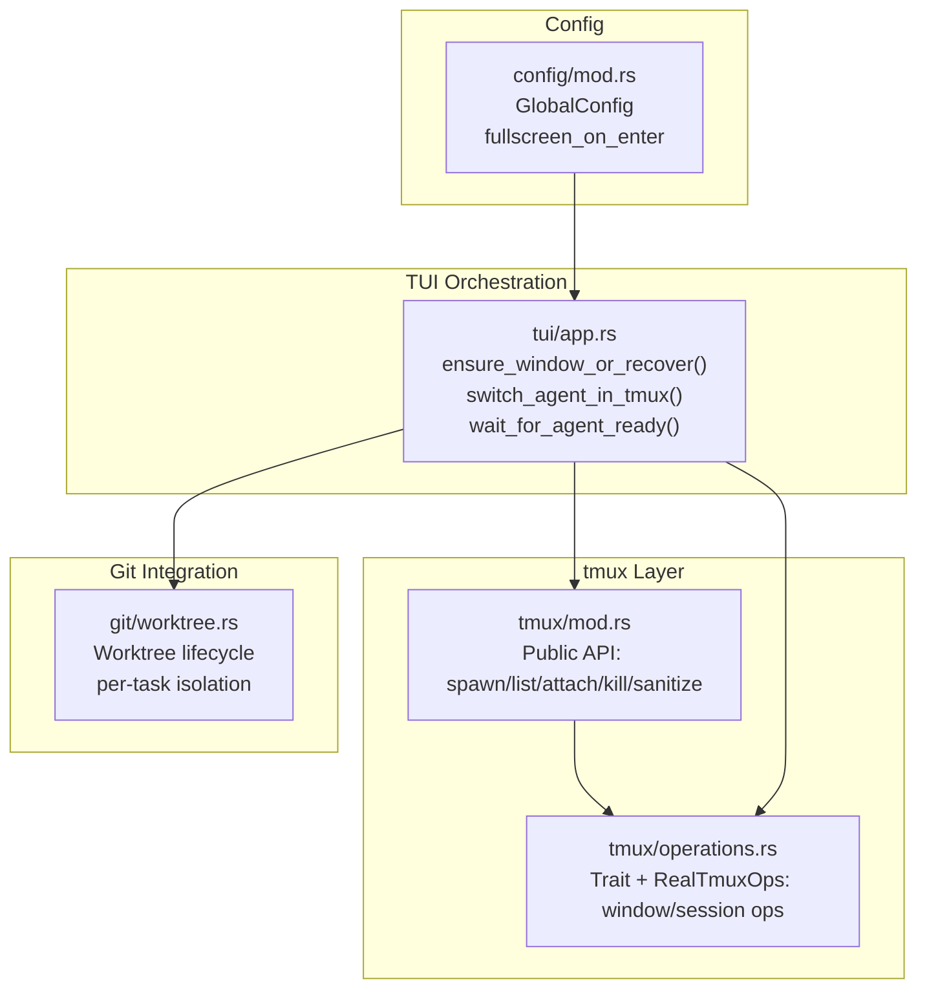
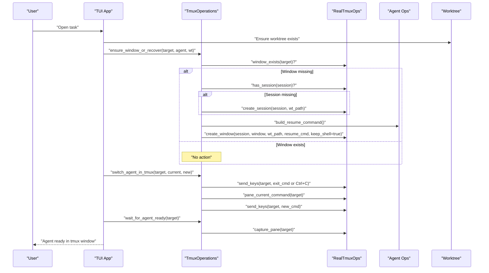
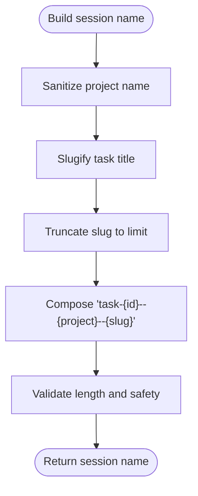
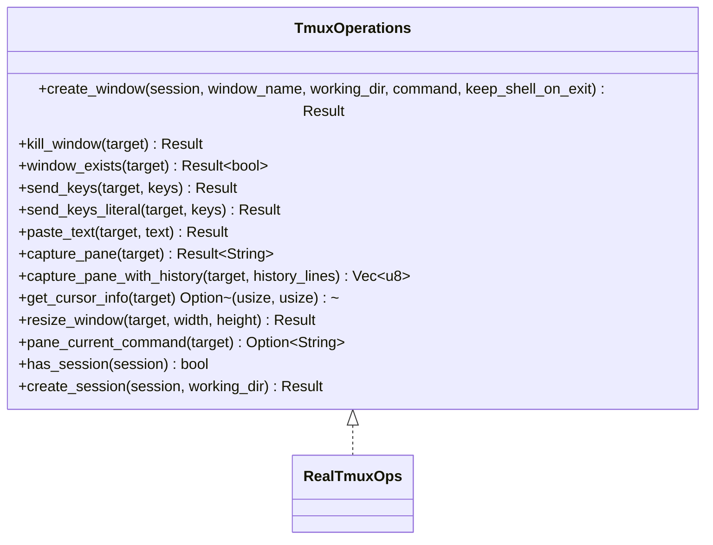
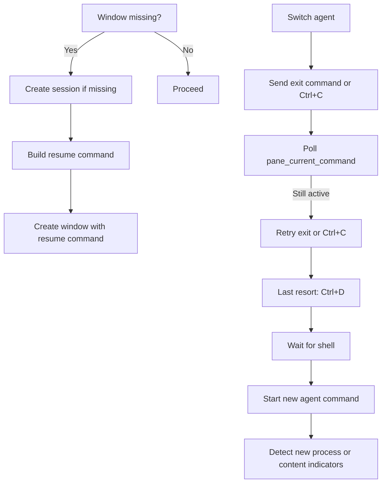
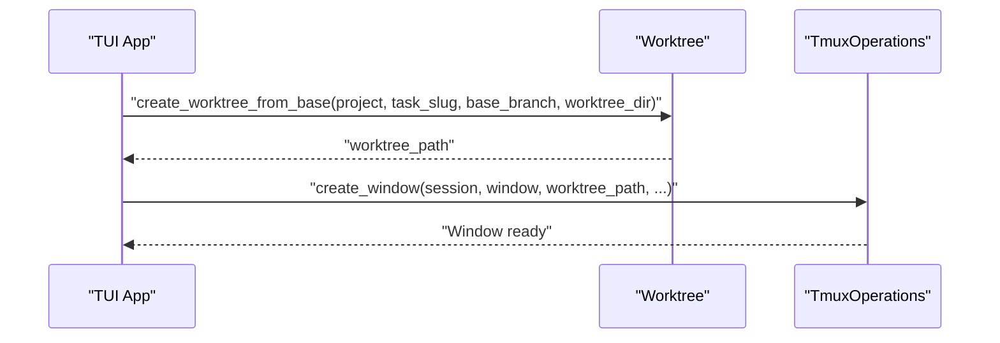
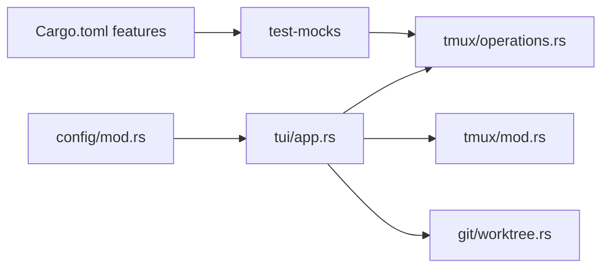

# tmux Session Management

<cite>
**Referenced Files in This Document**
- [mod.rs](file://src/tmux/mod.rs)
- [operations.rs](file://src/tmux/operations.rs)
- [app.rs](file://src/tui/app.rs)
- [worktree.rs](file://src/git/worktree.rs)
- [config/mod.rs](file://src/config/mod.rs)
- [Cargo.toml](file://Cargo.toml)
</cite>

## Table of Contents
1. [Introduction](#introduction)
2. [Project Structure](#project-structure)
3. [Core Components](#core-components)
4. [Architecture Overview](#architecture-overview)
5. [Detailed Component Analysis](#detailed-component-analysis)
6. [Dependency Analysis](#dependency-analysis)
7. [Performance Considerations](#performance-considerations)
8. [Troubleshooting Guide](#troubleshooting-guide)
9. [Conclusion](#conclusion)

## Introduction
This document explains how AGTX manages tmux sessions for agent coordination. It covers the dedicated tmux server architecture, session and window organization, integration with Git worktrees, and practical guidance for configuration and troubleshooting. The goal is to make tmux session management approachable for beginners while providing deep technical insights for advanced users.

## Project Structure
AGTX organizes tmux integration into focused modules:
- Dedicated tmux server for agent sessions
- Low-level tmux operations abstraction
- TUI orchestration that creates, recovers, and controls tmux windows
- Git worktree integration for task isolation
- Configuration for tmux-related UI behavior

**Diagram sources**
- [mod.rs:1-189](file://src/tmux/mod.rs#L1-L189)
- [operations.rs:1-249](file://src/tmux/operations.rs#L1-L249)
- [app.rs:8579-8778](file://src/tui/app.rs#L8579-L8778)
- [worktree.rs:1-345](file://src/git/worktree.rs#L1-L345)
- [config/mod.rs:1-595](file://src/config/mod.rs#L1-L595)

**Section sources**
- [mod.rs:1-189](file://src/tmux/mod.rs#L1-L189)
- [operations.rs:1-249](file://src/tmux/operations.rs#L1-L249)
- [app.rs:8579-8778](file://src/tui/app.rs#L8579-L8778)
- [worktree.rs:1-345](file://src/git/worktree.rs#L1-L345)
- [config/mod.rs:1-595](file://src/config/mod.rs#L1-L595)

## Core Components
- Dedicated tmux server: AGTX uses a named server to isolate agent sessions from the user's default tmux environment.
- Public tmux API: Functions for spawning sessions, listing sessions, attaching, killing, and sanitizing names.
- Window operations abstraction: A trait defines window/session operations, enabling testing and consistent behavior.
- TUI recovery and switching: Robust logic to recover missing windows, gracefully switch agents, and wait for readiness.
- Worktree integration: Tasks run in isolated worktrees, with tmux windows targeting the worktree directory for consistent agent contexts.

**Section sources**
- [mod.rs:11-189](file://src/tmux/mod.rs#L11-L189)
- [operations.rs:8-249](file://src/tmux/operations.rs#L8-L249)
- [app.rs:8579-8778](file://src/tui/app.rs#L8579-L8778)
- [worktree.rs:1-345](file://src/git/worktree.rs#L1-L345)

## Architecture Overview
AGTX coordinates agents through tmux windows within a dedicated server. The TUI orchestrator ensures windows exist, recovers them if lost, and switches agents safely. Worktrees provide task isolation, and configuration influences UI behavior like fullscreen attachment.

**Diagram sources**
- [app.rs:8579-8778](file://src/tui/app.rs#L8579-L8778)
- [operations.rs:62-248](file://src/tmux/operations.rs#L62-L248)
- [worktree.rs:1-345](file://src/git/worktree.rs#L1-L345)

## Detailed Component Analysis

### Dedicated tmux Server and Session Naming
- Server identifier: AGTX uses a fixed server name for agent sessions, keeping them separate from user sessions.
- Session naming: Tasks get deterministic names derived from task IDs, project names, and sanitized slugs. The system sanitizes special characters and enforces length limits.
- Public API: Functions wrap tmux CLI calls to spawn sessions, list sessions, attach, kill, capture panes, and send keys.

**Diagram sources**
- [mod.rs:144-166](file://src/tmux/mod.rs#L144-L166)
- [app.rs:8579-8602](file://src/tui/app.rs#L8579-L8602)

**Section sources**
- [mod.rs:11-189](file://src/tmux/mod.rs#L11-L189)

### Window Operations Abstraction
- Trait design: A trait defines window and session operations, enabling mocking and consistent behavior across environments.
- Real implementation: Executes tmux commands for creating windows, killing windows, existence checks, sending keys, pasting text, capturing panes, resizing, and detecting pane commands.
- Key behaviors:
  - Windows are created with optional commands and working directories.
  - Pane content capture supports history for rich TUI rendering.
  - Cursor info and pane command detection support intelligent agent readiness checks.

**Diagram sources**
- [operations.rs:8-249](file://src/tmux/operations.rs#L8-L249)

**Section sources**
- [operations.rs:8-249](file://src/tmux/operations.rs#L8-L249)

### Recovery and Agent Switching
- Window recovery: If a tmux window disappears (e.g., tmux restart or manual kill), AGTX recreates it using the agent's resume command, ensuring continuity.
- Agent switching: Gracefully terminates the current agent, detects shell prompt, and starts the new agent. It handles agent-specific exit commands and uses pane command detection to avoid false positives.
- Readiness detection: Waits for agents to finish loading by monitoring pane content and process commands, with fallbacks for universal compatibility.

**Diagram sources**
- [app.rs:8579-8778](file://src/tui/app.rs#L8579-L8778)
- [operations.rs:213-247](file://src/tmux/operations.rs#L213-L247)

**Section sources**
- [app.rs:8579-8778](file://src/tui/app.rs#L8579-L8778)
- [operations.rs:62-248](file://src/tmux/operations.rs#L62-L248)

### Integration with Git Worktrees
- Isolation: Each task runs in a dedicated worktree branch and directory, ensuring clean, reproducible environments for agent work.
- Setup: Worktrees are created from a base branch, initialized with agent configuration and optional project files, and cleaned up according to configuration.
- Targeting: Tmux windows are created with the worktree directory as the working directory, aligning agent contexts with task isolation.

**Diagram sources**
- [worktree.rs:14-65](file://src/git/worktree.rs#L14-L65)
- [operations.rs:64-110](file://src/tmux/operations.rs#L64-L110)

**Section sources**
- [worktree.rs:1-345](file://src/git/worktree.rs#L1-L345)
- [operations.rs:62-110](file://src/tmux/operations.rs#L62-L110)

### Configuration Options for tmux Integration
- Fullscreen on enter: A configuration flag controls whether the TUI automatically fullscreen-attaches to tmux sessions when opening task popups.
- Worktree settings: Global and project configurations govern whether worktrees are used, automatic cleanup, base branch selection, and worktree directory location.
- Theme and UI: While not tmux-specific, the theme affects TUI presentation around tmux panes and windows.

**Section sources**
- [config/mod.rs:24-27](file://src/config/mod.rs#L24-L27)
- [config/mod.rs:160-197](file://src/config/mod.rs#L160-L197)

## Dependency Analysis
- tmux public API depends on the tmux CLI and uses a fixed server identifier.
- The TUI orchestrator depends on both the tmux operations trait and worktree utilities.
- Configuration influences UI behavior but does not alter tmux internals.
- Cargo features enable test mocks for tmux operations.

**Diagram sources**
- [Cargo.toml:39-41](file://Cargo.toml#L39-L41)
- [operations.rs:5-6](file://src/tmux/operations.rs#L5-L6)
- [app.rs:8579-8778](file://src/tui/app.rs#L8579-L8778)
- [worktree.rs:1-345](file://src/git/worktree.rs#L1-L345)
- [config/mod.rs:1-595](file://src/config/mod.rs#L1-L595)

**Section sources**
- [Cargo.toml:39-41](file://Cargo.toml#L39-L41)
- [operations.rs:5-6](file://src/tmux/operations.rs#L5-L6)
- [app.rs:8579-8778](file://src/tui/app.rs#L8579-L8778)

## Performance Considerations
- Command overhead: Each tmux operation executes external commands. Batch operations and minimize repeated polling when possible.
- Pane capture: Capturing large histories can be expensive; use targeted line counts for typical UI updates.
- Agent readiness: Waiting loops poll pane content and commands; tune thresholds based on agent startup characteristics.
- Worktree initialization: Copying files and running scripts adds latency; leverage caching and selective copying for frequent tasks.

## Troubleshooting Guide
Common issues and solutions:
- Session conflicts
  - Symptom: Multiple tmux servers or conflicting session names.
  - Solution: Use the dedicated server name consistently; sanitize project names and slugs to avoid invalid characters.
  - Reference: [mod.rs:11-166](file://src/tmux/mod.rs#L11-L166)

- Lost windows after tmux restart
  - Symptom: Agents disappear or cannot be attached.
  - Solution: Use the recovery routine to recreate windows with the agent's resume command; ensure worktree paths exist.
  - Reference: [app.rs:8579-8602](file://src/tui/app.rs#L8579-L8602)

- Agent not responding to exit commands
  - Symptom: Busy agents require forceful termination.
  - Solution: The switching logic retries exit commands, sends Ctrl+C, and falls back to Ctrl+D; confirm agent-specific commands are used.
  - Reference: [app.rs:8616-8735](file://src/tui/app.rs#L8616-L8735)

- Pane content detection false positives
  - Symptom: Readiness checks trigger prematurely.
  - Solution: Use pane command detection alongside content checks; adjust polling intervals and stability thresholds.
  - Reference: [operations.rs:213-229](file://src/tmux/operations.rs#L213-L229)

- Worktree not found or inaccessible
  - Symptom: Tmux windows cannot be created or attached.
  - Solution: Verify worktree creation succeeded and paths are valid; reinitialize if needed.
  - Reference: [worktree.rs:25-65](file://src/git/worktree.rs#L25-L65)

- UI fullscreen behavior
  - Symptom: Unexpected fullscreen attachment behavior.
  - Solution: Adjust the configuration flag controlling fullscreen on enter.
  - Reference: [config/mod.rs:24-27](file://src/config/mod.rs#L24-L27)

**Section sources**
- [mod.rs:11-189](file://src/tmux/mod.rs#L11-L189)
- [app.rs:8579-8778](file://src/tui/app.rs#L8579-L8778)
- [operations.rs:213-248](file://src/tmux/operations.rs#L213-L248)
- [worktree.rs:25-65](file://src/git/worktree.rs#L25-L65)
- [config/mod.rs:24-27](file://src/config/mod.rs#L24-L27)

## Conclusion
AGTX’s tmux integration centers on a dedicated server, robust window recovery, and seamless agent switching. By combining deterministic session naming, worktree isolation, and careful readiness detection, it delivers a reliable environment for multi-agent coordination. Configuration options allow tuning UI behavior, while the abstraction layer ensures maintainability and testability.