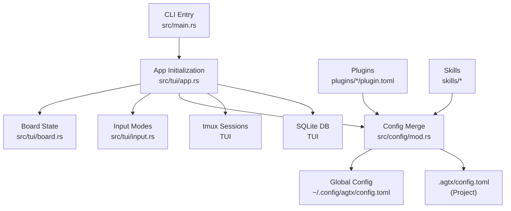
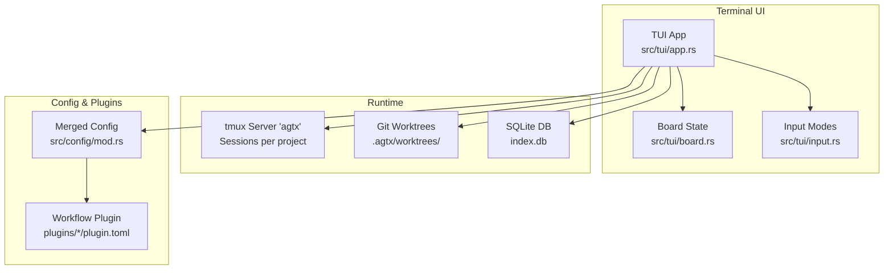
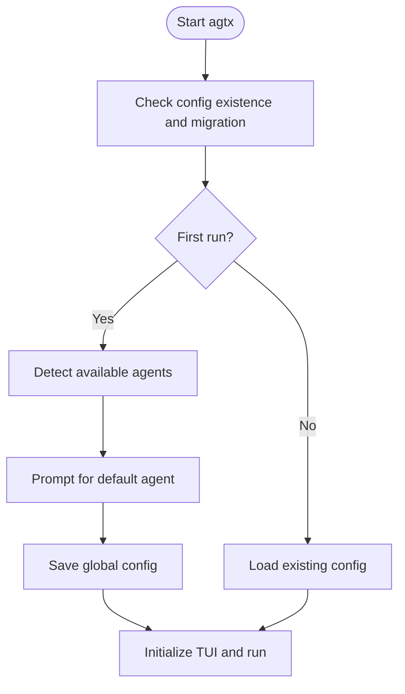
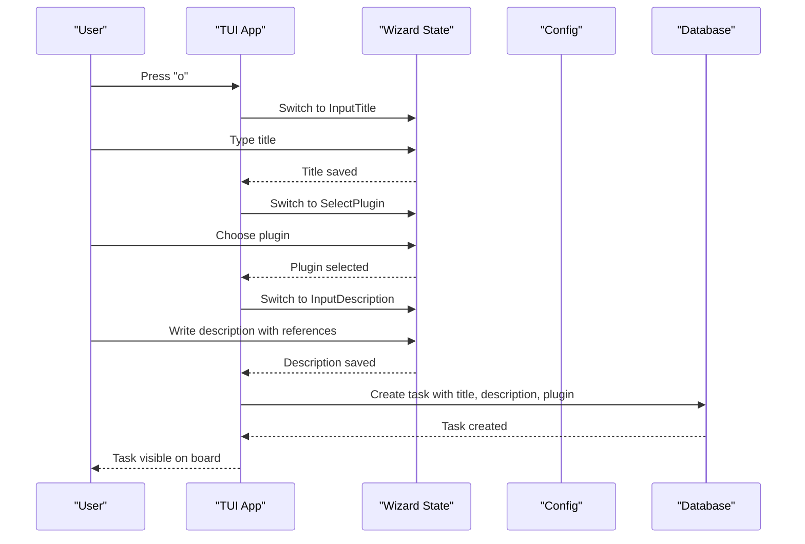
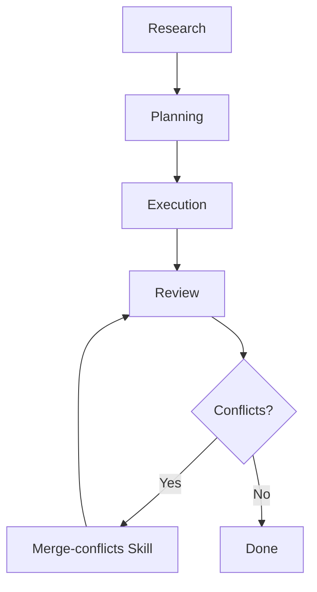
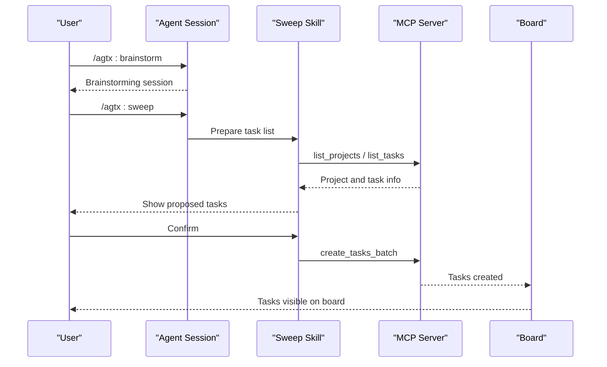
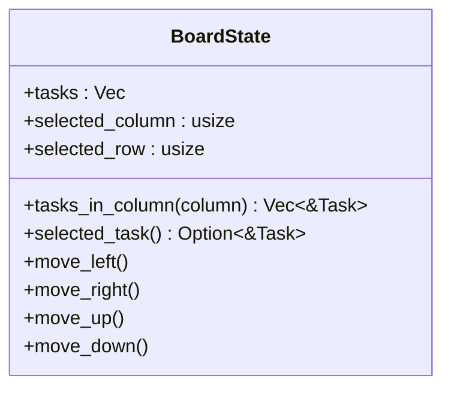
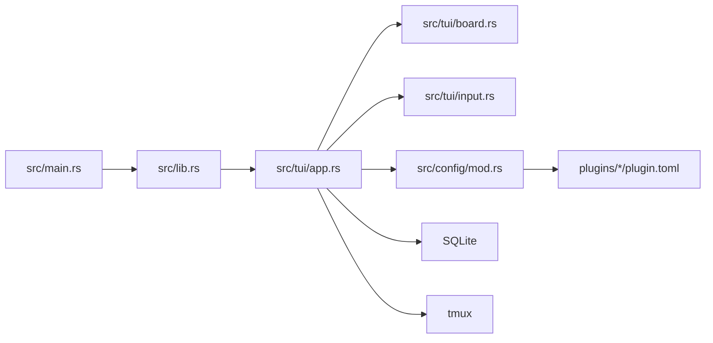

# Getting Started Guide

<cite>
**Referenced Files in This Document**
- [README.md](file://README.md)
- [install.sh](file://install.sh)
- [src/main.rs](file://src/main.rs)
- [src/lib.rs](file://src/lib.rs)
- [src/tui/app.rs](file://src/tui/app.rs)
- [src/tui/board.rs](file://src/tui/board.rs)
- [src/tui/input.rs](file://src/tui/input.rs)
- [src/config/mod.rs](file://src/config/mod.rs)
- [Cargo.toml](file://Cargo.toml)
- [plugins/agtx/plugin.toml](file://plugins/agtx/plugin.toml)
- [plugins/void/plugin.toml](file://plugins/void/plugin.toml)
- [skills/sweep/README.md](file://skills/sweep/README.md)
- [skills/brainstorm/README.md](file://skills/brainstorm/README.md)
- [plugins/agtx-terse/skills/agtx-plan/SKILL.md](file://plugins/agtx-terse/skills/agtx-plan/SKILL.md)
- [plugins/agtx-terse/skills/agtx-execute/SKILL.md](file://plugins/agtx-terse/skills/agtx-execute/SKILL.md)
</cite>

## Table of Contents
1. [Introduction](#introduction)
2. [Project Structure](#project-structure)
3. [Core Components](#core-components)
4. [Architecture Overview](#architecture-overview)
5. [Detailed Component Analysis](#detailed-component-analysis)
6. [Dependency Analysis](#dependency-analysis)
7. [Performance Considerations](#performance-considerations)
8. [Troubleshooting Guide](#troubleshooting-guide)
9. [Conclusion](#conclusion)
10. [Appendices](#appendices)

## Introduction
This guide helps you install AGTX, understand the terminal-based kanban board, and complete your first task lifecycle from creation to review. You will learn keyboard shortcuts, TUI navigation, how to create tasks, move them through phases, manage agent sessions, and use the task creation wizard. Practical examples demonstrate research → implementation → review cycles, and you will discover how to configure agents per phase and choose plugins.

## Project Structure
AGTX is a terminal-native application with a TUI, tmux-backed agent sessions, and a SQLite-backed task database. The main entry point parses CLI flags, determines mode (dashboard or project), and initializes the TUI. Configuration is split between global and project-level TOML files. Plugins define workflow phases and agent commands.

**Diagram sources**
- [src/main.rs:16-96](file://src/main.rs#L16-L96)
- [src/tui/app.rs:749-800](file://src/tui/app.rs#L749-L800)
- [src/tui/board.rs:1-99](file://src/tui/board.rs#L1-L99)
- [src/tui/input.rs:1-19](file://src/tui/input.rs#L1-L19)
- [src/config/mod.rs:337-408](file://src/config/mod.rs#L337-L408)
- [plugins/agtx/plugin.toml:1-16](file://plugins/agtx/plugin.toml#L1-L16)
- [plugins/void/plugin.toml:1-4](file://plugins/void/plugin.toml#L1-L4)

**Section sources**
- [src/main.rs:16-96](file://src/main.rs#L16-L96)
- [src/lib.rs:12-24](file://src/lib.rs#L12-L24)
- [src/tui/app.rs:749-800](file://src/tui/app.rs#L749-L800)
- [src/config/mod.rs:230-303](file://src/config/mod.rs#L230-L303)

## Core Components
- CLI and modes: Determines dashboard vs project mode and orchestrator flag.
- TUI app: Renders the kanban board, handles input, and coordinates tmux sessions and database.
- Board state: Tracks tasks, selection, and column navigation.
- Input modes: Wizard states for creating tasks and selecting plugins.
- Configuration: Global and project-level TOML with per-phase agent overrides and worktree settings.
- Plugins: Define commands, prompts, artifacts, and optional cyclic workflows.
- Skills: Agent-native skill definitions for research, planning, execution, and review.

**Section sources**
- [src/main.rs:16-96](file://src/main.rs#L16-L96)
- [src/tui/app.rs:448-560](file://src/tui/app.rs#L448-L560)
- [src/tui/board.rs:11-92](file://src/tui/board.rs#L11-L92)
- [src/tui/input.rs:2-12](file://src/tui/input.rs#L2-L12)
- [src/config/mod.rs:337-408](file://src/config/mod.rs#L337-L408)
- [plugins/agtx/plugin.toml:1-16](file://plugins/agtx/plugin.toml#L1-L16)
- [plugins/void/plugin.toml:1-4](file://plugins/void/plugin.toml#L1-L4)

## Architecture Overview
AGTX runs a TUI that displays a kanban board with four columns: Backlog, Planning, Running, Review, Done. Each task runs in its own tmux window under a dedicated tmux server. Plugins define commands and prompts per phase; the TUI advances tasks, deploys skills, and monitors agent progress. The orchestrator agent can automate advancement when enabled.

**Diagram sources**
- [src/tui/app.rs:749-800](file://src/tui/app.rs#L749-L800)
- [src/tui/board.rs:1-99](file://src/tui/board.rs#L1-L99)
- [src/config/mod.rs:337-408](file://src/config/mod.rs#L337-L408)
- [plugins/agtx/plugin.toml:1-16](file://plugins/agtx/plugin.toml#L1-L16)

## Detailed Component Analysis

### Installation and First Run
- Install via the provided script or cargo build.
- On first run, the app detects available agents and prompts you to select a default agent if none is configured.
- Global configuration is stored at ~/.config/agtx/config.toml; project-level configuration is at .agtx/config.toml.

**Diagram sources**
- [src/main.rs:63-89](file://src/main.rs#L63-L89)
- [src/main.rs:121-227](file://src/main.rs#L121-L227)
- [src/config/mod.rs:305-335](file://src/config/mod.rs#L305-L335)

**Section sources**
- [install.sh:62-176](file://install.sh#L62-L176)
- [src/main.rs:63-89](file://src/main.rs#L63-L89)
- [src/main.rs:121-227](file://src/main.rs#L121-L227)
- [src/config/mod.rs:230-303](file://src/config/mod.rs#L230-L303)

### Keyboard Shortcuts and TUI Navigation
- Navigate columns: h/l or ←/→
- Navigate tasks: j/k or ↑/↓
- Create task: o
- Research mode: R
- Open task popup: ↩
- Fullscreen attach: Ctrl+f
- Move forward: m
- Resume/Reverse: r
- Next phase (cyclic plugins): p
- Show diff: d
- Delete task: x
- Search tasks: /
- Select plugin: P
- Toggle orchestrator: O
- Toggle sidebar: e
- Quit: q

The footer dynamically adapts to the current column and input mode, showing contextual actions.

**Section sources**
- [README.md:107-129](file://README.md#L107-L129)
- [src/tui/app.rs:59-199](file://src/tui/app.rs#L59-L199)
- [src/tui/app.rs:247-294](file://src/tui/app.rs#L247-L294)

### Task Creation Wizard
- Press o to start creating a task.
- Steps:
  1) Enter a short title.
  2) Select a workflow plugin (auto-skipped if only one option).
  3) Write a detailed description with optional inline references to files, skills, and tasks.
- Agent configuration is set at the project level via config.toml, not per task.

**Diagram sources**
- [README.md:131-141](file://README.md#L131-L141)
- [src/tui/input.rs:2-12](file://src/tui/input.rs#L2-L12)
- [src/tui/app.rs:448-560](file://src/tui/app.rs#L448-L560)

**Section sources**
- [README.md:131-141](file://README.md#L131-L141)
- [src/tui/input.rs:2-12](file://src/tui/input.rs#L2-L12)
- [src/config/mod.rs:355-388](file://src/config/mod.rs#L355-L388)

### Managing Agent Sessions
- Each task runs in its own tmux window under a dedicated tmux server named "agtx".
- Sessions are organized by project; each project has its own tmux session.
- Persistent context: conversation history is preserved across Planning → Running → Review.
- Inline view: press ↩ to open a scrollable tmux view inside the TUI.
- Fullscreen: press Ctrl+f to attach directly to the agent’s tmux window.
- Auto merge-conflict resolution: when a Review task becomes idle, AGTX checks for merge conflicts and invokes the merge-conflicts skill if needed.

**Section sources**
- [README.md:156-165](file://README.md#L156-L165)
- [src/tui/app.rs:448-560](file://src/tui/app.rs#L448-L560)

### Typical Workflows: Research → Implementation → Review
- Research: Press R on a task to initiate research mode; the plugin’s research command is sent to the agent. Artifacts produced by research are stored for later phases.
- Planning: The planning phase reads prior research artifacts and writes a plan to a designated artifact file.
- Execution: The execution phase implements the approved plan and writes a summary.
- Review: The review phase prepares a PR; if conflicts are detected, the merge-conflicts skill is invoked automatically.

**Diagram sources**
- [plugins/agtx/plugin.toml:5-16](file://plugins/agtx/plugin.toml#L5-L16)
- [README.md:160-165](file://README.md#L160-L165)

**Section sources**
- [plugins/agtx/plugin.toml:1-16](file://plugins/agtx/plugin.toml#L1-L16)
- [README.md:160-165](file://README.md#L160-L165)

### Brainstorm and Sweep Skills
- Brainstorm: Explore ideas freely without planning or implementation. Use /agtx:brainstorm to enter brainstorm mode.
- Sweep: Turn conversation outcomes into board tasks. Use /agtx:sweep to propose tasks, confirm, and push to the board.

**Diagram sources**
- [skills/brainstorm/README.md:1-51](file://skills/brainstorm/README.md#L1-L51)
- [skills/sweep/README.md:102-131](file://skills/sweep/README.md#L102-L131)
- [README.md:166-185](file://README.md#L166-L185)

**Section sources**
- [skills/brainstorm/README.md:1-51](file://skills/brainstorm/README.md#L1-L51)
- [skills/sweep/README.md:102-131](file://skills/sweep/README.md#L102-L131)
- [README.md:166-185](file://README.md#L166-L185)

### Kanban Board Interface and Navigation
- Columns: Backlog, Planning, Running, Review, Done.
- Selection: Use j/k to move vertically within a column; use h/l to move between columns.
- Actions: From Backlog, press m to move to Planning; from Planning, press m to move to Running; from Running, press m to move to Review; from Review, press m to move to Done.
- Cyclic plugins: Press p in Review to move back to Planning for another cycle.

**Diagram sources**
- [src/tui/board.rs:4-92](file://src/tui/board.rs#L4-L92)

**Section sources**
- [src/tui/board.rs:11-92](file://src/tui/board.rs#L11-L92)
- [README.md:107-129](file://README.md#L107-L129)

### Task Description Editor and Inline References
- While editing task descriptions, you can reference files, skills, and tasks inline:
  - # or @ to fuzzy-search and insert file paths
  - / to fuzzy-search and insert agent skills/commands (at line start or after space)
  - ! to fuzzy-search and insert task references (at line start or after space)

**Section sources**
- [README.md:143-154](file://README.md#L143-L154)

### Agent Configuration per Phase
- Configure agents globally and per project:
  - Global: ~/.config/agtx/config.toml
  - Project: .agtx/config.toml
- Per-phase overrides:
  - research, planning, running, review
- Default agent fallback applies when no phase-specific override is set.

**Section sources**
- [README.md:308-328](file://README.md#L308-L328)
- [src/config/mod.rs:355-408](file://src/config/mod.rs#L355-L408)

### Plugins and Workflow Selection
- Press P to switch plugins. Built-in plugins include:
  - agtx (default)
  - agtx-terse
  - gsd
  - spec-kit
  - openspec
  - bmad
  - superpowers
  - oh-my-claudecode
  - agent-skills
  - void
- Plugins define commands, prompts, artifacts, and optional cyclic behavior.

**Section sources**
- [README.md:329-347](file://README.md#L329-L347)
- [plugins/agtx/plugin.toml:1-16](file://plugins/agtx/plugin.toml#L1-L16)
- [plugins/void/plugin.toml:1-4](file://plugins/void/plugin.toml#L1-L4)

### Orchestrator Agent (Experimental)
- Press O to toggle the orchestrator agent.
- The orchestrator advances tasks automatically as phases complete, respects allowed_actions, and escalates stuck tasks to you when intervention is needed.
- MCP integration: The orchestrator communicates with the MCP server to read task status and move tasks forward.

**Section sources**
- [README.md:604-646](file://README.md#L604-L646)
- [src/main.rs:21-22](file://src/main.rs#L21-L22)

## Dependency Analysis
AGTX uses a modular architecture with clear separation of concerns:
- CLI entry point initializes modes and flags.
- TUI renders the board, manages input, and coordinates tmux and database.
- Configuration merges global and project settings.
- Plugins encapsulate workflow logic and agent commands.
- Skills provide agent-native capabilities.

**Diagram sources**
- [src/main.rs:16-96](file://src/main.rs#L16-L96)
- [src/lib.rs:12-24](file://src/lib.rs#L12-L24)
- [src/tui/app.rs:749-800](file://src/tui/app.rs#L749-L800)
- [src/config/mod.rs:337-408](file://src/config/mod.rs#L337-L408)

**Section sources**
- [Cargo.toml:12-38](file://Cargo.toml#L12-L38)
- [src/lib.rs:12-24](file://src/lib.rs#L12-L24)

## Performance Considerations
- tmux sessions persist across TUI restarts, minimizing cold starts.
- Worktrees isolate tasks and reduce context switching overhead.
- Plugins can define prompt triggers and artifacts to gate phase transitions efficiently.
- Auto-dismiss rules reduce manual intervention for interactive prompts.

[No sources needed since this section provides general guidance]

## Troubleshooting Guide
- Missing dependencies:
  - Ensure tmux is installed and in PATH.
  - Optional: gh for PR operations.
- First-run agent selection:
  - If no default agent is configured, the app prompts you to select one on first run.
- MCP server registration:
  - For agent integrations, register the MCP server as described in the README.
- Conflict detection:
  - Review tasks that become idle are checked for merge conflicts; if detected, the merge-conflicts skill is invoked automatically.

**Section sources**
- [install.sh:145-171](file://install.sh#L145-L171)
- [src/main.rs:121-227](file://src/main.rs#L121-L227)
- [README.md:573-603](file://README.md#L573-L603)
- [README.md:160-165](file://README.md#L160-L165)

## Conclusion
You are now equipped to install AGTX, navigate the kanban board, create tasks, move them through phases, and coordinate agent sessions. Use the task creation wizard, configure agents per phase, and leverage plugins and skills to streamline your workflow. The orchestrator agent can automate advancement when enabled, and the MCP server integrates AGTX with various agent environments.

[No sources needed since this section summarizes without analyzing specific files]

## Appendices

### Quick Start Commands
- Install: curl -fsSL https://raw.githubusercontent.com/fynnfluegge/agtx/main/install.sh | bash
- Run in a git repository: cd your-project && agtx
- Dashboard mode: agtx -g
- Orchestrator mode: agtx --experimental

**Section sources**
- [README.md:73-89](file://README.md#L73-L89)
- [install.sh:62-176](file://install.sh#L62-L176)

### Essential Commands and Tips
- Keyboard shortcuts: See the Keyboard Shortcuts section for a complete list.
- Task lifecycle: Backlog → Planning → Running → Review → Done.
- Cyclic workflows: Use p in Review to cycle back to Planning for multi-phase workflows.
- Optimal setup:
  - Configure default and per-phase agents in ~/.config/agtx/config.toml or .agtx/config.toml.
  - Choose a suitable plugin (e.g., agtx for default workflow, void for plain sessions).
  - Use sweep to turn conversations into tasks and manage dependencies.

**Section sources**
- [README.md:107-129](file://README.md#L107-L129)
- [README.md:308-328](file://README.md#L308-L328)
- [README.md:329-347](file://README.md#L329-L347)