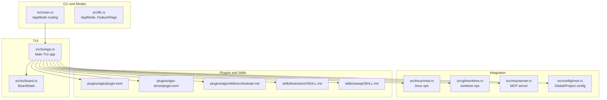
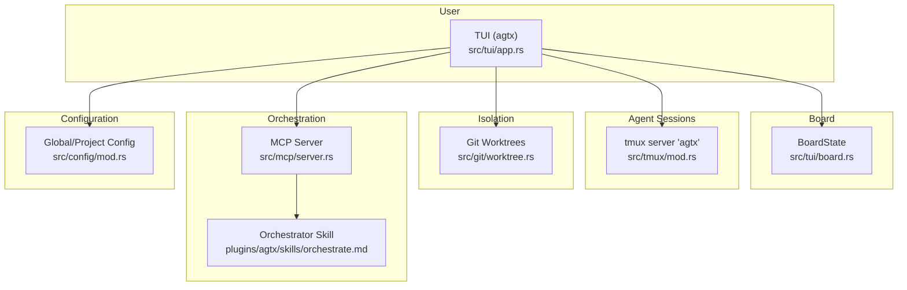
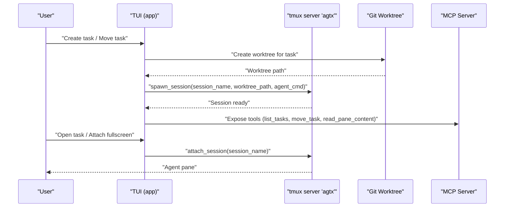
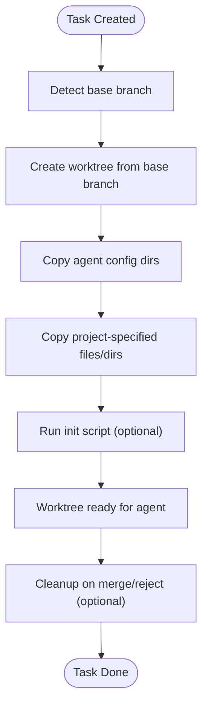
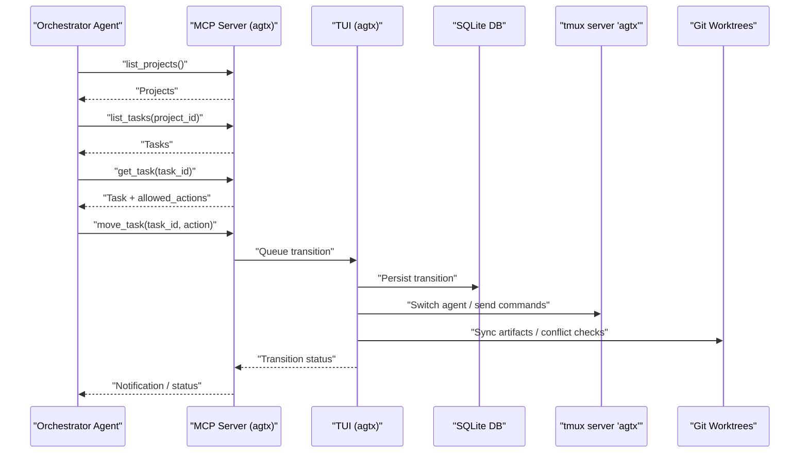
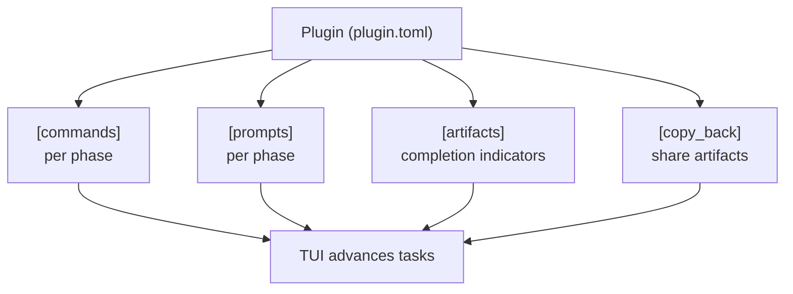
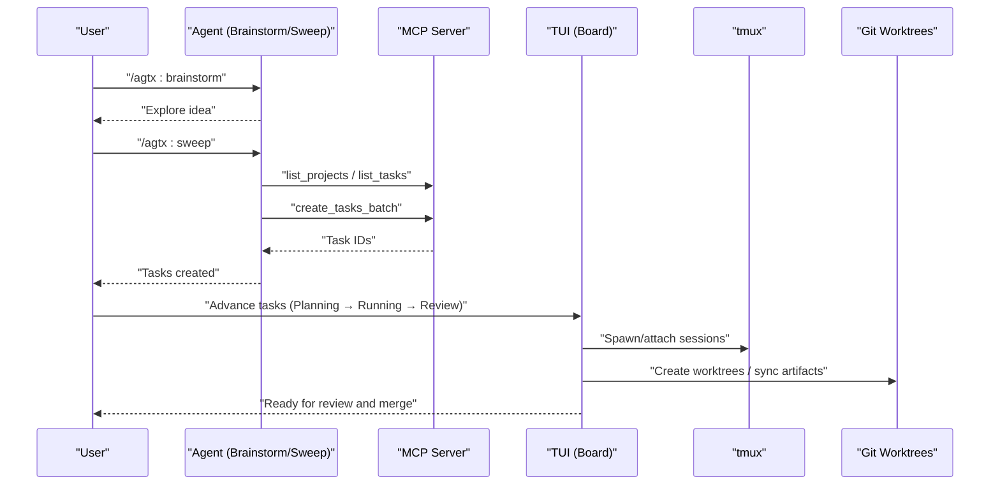
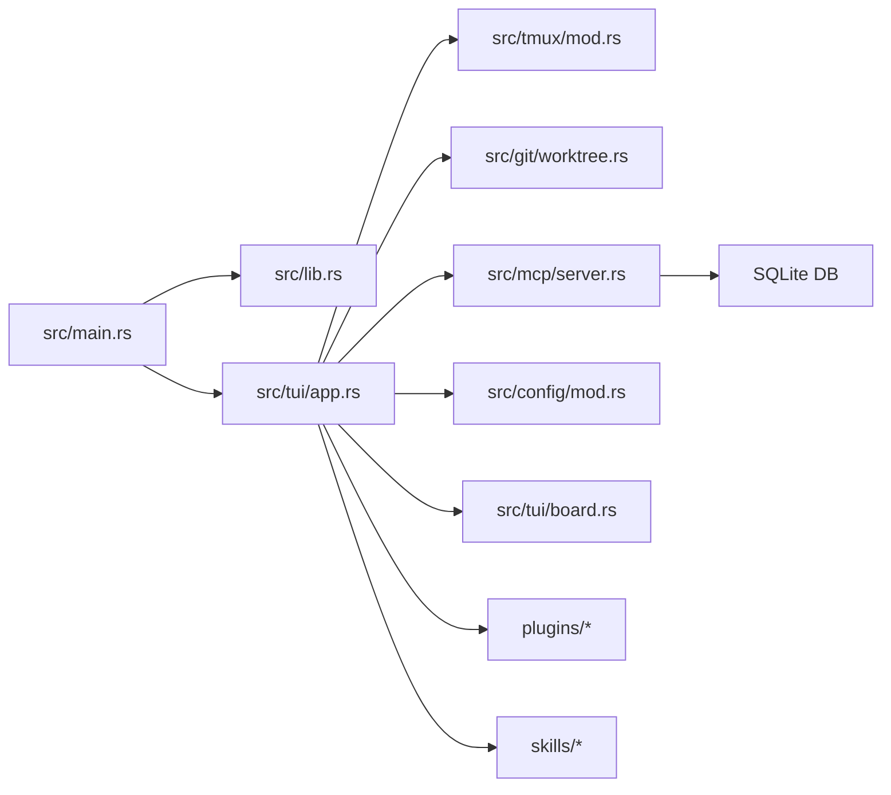

# Introduction

<cite>
**Referenced Files in This Document**
- [README.md](file://README.md)
- [AGENTS.md](file://AGENTS.md)
- [src/lib.rs](file://src/lib.rs)
- [src/main.rs](file://src/main.rs)
- [src/tui/app.rs](file://src/tui/app.rs)
- [src/tui/board.rs](file://src/tui/board.rs)
- [src/git/worktree.rs](file://src/git/worktree.rs)
- [src/tmux/mod.rs](file://src/tmux/mod.rs)
- [src/mcp/server.rs](file://src/mcp/server.rs)
- [src/config/mod.rs](file://src/config/mod.rs)
- [plugins/agtx/plugin.toml](file://plugins/agtx/plugin.toml)
- [plugins/agtx-terse/plugin.toml](file://plugins/agtx-terse/plugin.toml)
- [plugins/agtx/skills/orchestrate.md](file://plugins/agtx/skills/orchestrate.md)
- [skills/brainstorm/SKILL.md](file://skills/brainstorm/SKILL.md)
- [skills/sweep/SKILL.md](file://skills/sweep/SKILL.md)
</cite>

## Table of Contents
1. [Introduction](#introduction)
2. [Project Structure](#project-structure)
3. [Core Components](#core-components)
4. [Architecture Overview](#architecture-overview)
5. [Detailed Component Analysis](#detailed-component-analysis)
6. [Dependency Analysis](#dependency-analysis)
7. [Performance Considerations](#performance-considerations)
8. [Troubleshooting Guide](#troubleshooting-guide)
9. [Conclusion](#conclusion)

## Introduction
AGTX is a terminal-native kanban board for managing multiple AI coding agents in parallel. It eliminates context switching in AI coding workflows by orchestrating tasks across dedicated tmux sessions, each running in its own git worktree. This enables multi-agent collaboration with automatic session switching and context awareness, so you can focus on high-level strategy while agents autonomously plan, implement, and review changes.

Key value propositions:
- Multi-agent collaboration: Different agents can work on the same task in parallel, each in their own isolated worktree and tmux window.
- Automatic session switching: The system routes commands to the correct agent per phase and maintains persistent context across transitions.
- Spec-driven workflows: Plugins define commands, prompts, and artifacts per phase, enabling repeatable, autonomous execution across Planning, Running, and Review.

Common use cases:
- Research → Implementation → Review: Explore ideas in Research, delegate Planning and Running to specialized agents, and land in Review for manual approval and merging.
- Parallel feature development: Multiple tasks run concurrently, with dependencies enforced and PRs produced per task.
- Human-in-the-loop control: Use the “void” plugin to retain full control over task progression without automatic advancement.

Terminology aligned with the codebase:
- Kanban board: The TUI board with columns Backlog, Planning, Running, Review, Done.
- Worktree: A git worktree per task for isolation and persistence.
- tmux sessions: Each task runs in a dedicated tmux window under a shared tmux server.
- Agent orchestration: The process of delegating phases to agents, monitoring completion, and advancing tasks.

**Section sources**
- [README.md:47-67](file://README.md#L47-L67)
- [AGENTS.md:5-8](file://AGENTS.md#L5-L8)

## Project Structure
At a high level, AGTX consists of:
- A TUI (terminal UI) that renders the kanban board and handles user interactions.
- A tmux integration layer that spawns and manages agent sessions.
- A Git integration layer that provisions worktrees per task.
- An MCP server that exposes board tools to agents and the orchestrator.
- A configuration system that defines agents, worktree behavior, and plugin selection.
- A skills subsystem that deploys agent-native skills into each worktree.



**Diagram sources**
- [src/main.rs:16-96](file://src/main.rs#L16-L96)
- [src/lib.rs:12-24](file://src/lib.rs#L12-L24)
- [src/tui/app.rs:766-780](file://src/tui/app.rs#L766-L780)
- [src/tui/board.rs:1-99](file://src/tui/board.rs#L1-L99)
- [src/tmux/mod.rs:11-189](file://src/tmux/mod.rs#L11-L189)
- [src/git/worktree.rs:1-200](file://src/git/worktree.rs#L1-L200)
- [src/mcp/server.rs:16-24](file://src/mcp/server.rs#L16-L24)
- [src/config/mod.rs:5-200](file://src/config/mod.rs#L5-L200)
- [plugins/agtx/plugin.toml:1-16](file://plugins/agtx/plugin.toml#L1-L16)
- [plugins/agtx-terse/plugin.toml:1-16](file://plugins/agtx-terse/plugin.toml#L1-L16)
- [plugins/agtx/skills/orchestrate.md:1-200](file://plugins/agtx/skills/orchestrate.md#L1-L200)
- [skills/brainstorm/SKILL.md:1-51](file://skills/brainstorm/SKILL.md#L1-L51)
- [skills/sweep/SKILL.md:1-153](file://skills/sweep/SKILL.md#L1-L153)

**Section sources**
- [AGENTS.md:16-31](file://AGENTS.md#L16-L31)
- [README.md:506-547](file://README.md#L506-L547)

## Core Components
- TUI and Board: The terminal UI renders the kanban board, manages keyboard and mouse interactions, and drives task transitions. BoardState encapsulates the current selection and column layout.
- tmux Coordination: Spawns agent sessions in a dedicated tmux server, attaches to sessions, captures pane output, and sends keystrokes to agent panes.
- Git Integration: Creates and initializes git worktrees per task, copies agent configs and project files, and supports cleanup and initialization scripts.
- MCP Server: Exposes tools over stdio to agents and the orchestrator, including listing projects/tasks, creating/updating tasks, moving tasks, checking conflicts, and reading pane content.
- Configuration: Defines default agents, per-phase agent overrides, worktree settings, and UI themes. Projects can override global defaults.
- Plugins and Skills: Define commands, prompts, artifacts, and optional interactive behaviors per phase. Built-in plugins include agtx and agtx-terse, with skills for orchestration, brainstorming, sweeping, and merge conflict resolution.

**Section sources**
- [src/tui/app.rs:448-560](file://src/tui/app.rs#L448-L560)
- [src/tui/board.rs:1-99](file://src/tui/board.rs#L1-L99)
- [src/tmux/mod.rs:11-189](file://src/tmux/mod.rs#L11-L189)
- [src/git/worktree.rs:125-200](file://src/git/worktree.rs#L125-L200)
- [src/mcp/server.rs:16-200](file://src/mcp/server.rs#L16-L200)
- [src/config/mod.rs:5-200](file://src/config/mod.rs#L5-L200)
- [plugins/agtx/plugin.toml:1-16](file://plugins/agtx/plugin.toml#L1-L16)
- [plugins/agtx-terse/plugin.toml:1-16](file://plugins/agtx-terse/plugin.toml#L1-L16)

## Architecture Overview
AGTX’s architecture centers on a terminal-based kanban board that coordinates multiple AI agents in parallel. Each task is isolated in a git worktree and runs in a dedicated tmux window. The MCP server exposes board tools to agents and the orchestrator, enabling spec-driven workflows and autonomous task progression.



**Diagram sources**
- [src/tui/app.rs:766-780](file://src/tui/app.rs#L766-L780)
- [src/tui/board.rs:1-99](file://src/tui/board.rs#L1-L99)
- [src/tmux/mod.rs:11-189](file://src/tmux/mod.rs#L11-L189)
- [src/git/worktree.rs:1-200](file://src/git/worktree.rs#L1-L200)
- [src/mcp/server.rs:16-24](file://src/mcp/server.rs#L16-L24)
- [plugins/agtx/skills/orchestrate.md:1-200](file://plugins/agtx/skills/orchestrate.md#L1-L200)

## Detailed Component Analysis

### TUI and Board
The TUI manages the kanban board, user input, and task lifecycle. It builds dynamic footer help text and click regions for keyboard and mouse interactions. BoardState tracks selected column and row, and provides helpers to move selection across columns and rows.

```mermaid
classDiagram
class BoardState {
+Vec<Task> tasks
+usize selected_column
+usize selected_row
+tasks_in_column(column) Vec<&Task>
+selected_task() Option<&Task>
+selected_task_mut() Option<&mut Task>
+move_left() void
+move_right() void
+move_up() void
+move_down() void
}
class App {
+AppState state
+run() Result<void>
}
class AppState {
+AppMode mode
+FeatureFlags flags
+BoardState board
+InputMode input_mode
+Option<Database> db
+MergedConfig config
+Option<PathBuf> project_path
+String project_name
+String tmux_project_name
+Vec<Agent> available_agents
+Arc<dyn TmuxOperations> tmux_ops
+Arc<dyn GitOperations> git_ops
+Arc<dyn GitProviderOperations> git_provider_ops
+Arc<dyn AgentRegistry> agent_registry
+bool sidebar_visible
+bool sidebar_focused
+Vec<ProjectInfo> projects
+Option<ShellPopup> shell_popup
+Option<FileSearchState> file_search
+Option<SkillSearchState> skill_search
+Option<TaskRefSearchState> task_ref_search
+Option<DiffPopup> diff_popup
+Option<PrConfirmPopup> pr_confirm_popup
+Option<DoneConfirmPopup> done_confirm_popup
+Option<MoveConfirmPopup> move_confirm_popup
+Option<DeleteConfirmPopup> delete_confirm_popup
+Option<ReviewConfirmPopup> review_confirm_popup
+Option<PluginSelectPopup> plugin_select_popup
+Option<String> orchestrator_session
+Arc<AtomicBool> orchestrator_ready
+HashMap<String,(PhaseStatus,Instant)> phase_status_cache
+HashMap<String,(u64,Instant)> pane_content_hashes
+HashSet<String> merge_conflict_checked
+HashSet<String> stuck_task_notified
+HashMap<String,Instant> stuck_task_idle_since
+Option<Option<WorkflowPlugin>> cached_plugin
+Option<(String,Instant)> warning_message
+Vec<ClickRegion> click_regions
+bool footer_nav_active
+usize footer_nav_index
+Vec<FooterItem> footer_items
}
App --> BoardState : "owns"
App --> AppState : "owns"
```

**Diagram sources**
- [src/tui/board.rs:1-99](file://src/tui/board.rs#L1-L99)
- [src/tui/app.rs:448-560](file://src/tui/app.rs#L448-L560)

**Section sources**
- [src/tui/app.rs:448-560](file://src/tui/app.rs#L448-L560)
- [src/tui/board.rs:1-99](file://src/tui/board.rs#L1-L99)

### tmux Coordination
AGTX uses a dedicated tmux server to manage agent sessions. It spawns sessions with a working directory pointing to a task’s worktree, captures pane content for idle detection, and sends keystrokes to agent panes. Session names encode task IDs, project names, and slugs for reliable lookup.



**Diagram sources**
- [src/tmux/mod.rs:11-189](file://src/tmux/mod.rs#L11-L189)
- [src/git/worktree.rs:1-200](file://src/git/worktree.rs#L1-L200)
- [src/mcp/server.rs:16-24](file://src/mcp/server.rs#L16-L24)

**Section sources**
- [src/tmux/mod.rs:11-189](file://src/tmux/mod.rs#L11-L189)

### Git Integration and Worktrees
Worktrees isolate each task’s changes and persist across TUI restarts. AGTX detects the base branch, creates a task-specific branch, and initializes the worktree by copying agent configuration directories and project-specified files. Initialization scripts and cleanup scripts can be executed post-creation and pre-removal respectively.



**Diagram sources**
- [src/git/worktree.rs:1-200](file://src/git/worktree.rs#L1-L200)

**Section sources**
- [src/git/worktree.rs:1-200](file://src/git/worktree.rs#L1-L200)

### MCP Server and Agent Orchestration
The MCP server exposes tools over stdio to agents and the orchestrator. Tools include listing projects/tasks, creating/updating tasks, moving tasks, checking conflicts, and reading pane content. The orchestrator skill coordinates task advancement, respects plugin rules, and escalates when human input is required.



**Diagram sources**
- [src/mcp/server.rs:16-200](file://src/mcp/server.rs#L16-L200)
- [plugins/agtx/skills/orchestrate.md:1-200](file://plugins/agtx/skills/orchestrate.md#L1-L200)

**Section sources**
- [src/mcp/server.rs:16-200](file://src/mcp/server.rs#L16-L200)
- [plugins/agtx/skills/orchestrate.md:1-200](file://plugins/agtx/skills/orchestrate.md#L1-L200)

### Spec-Driven Workflows and Plugins
Plugins define commands, prompts, and artifacts per phase. AGTX ships with built-in plugins (agtx, agtx-terse) and supports external frameworks. Plugins can declare pre-research commands, cyclic workflows, artifact polling, and copy-back behavior to share outputs across worktrees.



**Diagram sources**
- [plugins/agtx/plugin.toml:1-16](file://plugins/agtx/plugin.toml#L1-L16)
- [plugins/agtx-terse/plugin.toml:1-16](file://plugins/agtx-terse/plugin.toml#L1-L16)

**Section sources**
- [plugins/agtx/plugin.toml:1-16](file://plugins/agtx/plugin.toml#L1-L16)
- [plugins/agtx-terse/plugin.toml:1-16](file://plugins/agtx-terse/plugin.toml#L1-L16)

### Practical Examples: Research → Implementation → Review
- Brainstorm: Explore ideas without planning or implementing. Use the brainstorm skill to surface trade-offs and uncertainties.
- Sweep: Decompose outcomes into feature-level tasks and push them to the board. The sweep skill guides batch creation and dependency wiring.
- Kanban Board: Move tasks from Backlog to Planning, then to Running, and finally to Review. Each task runs in its own worktree and tmux window.
- Merge Conflicts: When tasks reach Review, AGTX can detect conflicts and route the merge-conflicts skill to resolve them automatically.



**Diagram sources**
- [skills/brainstorm/SKILL.md:1-51](file://skills/brainstorm/SKILL.md#L1-L51)
- [skills/sweep/SKILL.md:1-153](file://skills/sweep/SKILL.md#L1-L153)
- [src/mcp/server.rs:16-200](file://src/mcp/server.rs#L16-L200)
- [src/tmux/mod.rs:11-189](file://src/tmux/mod.rs#L11-L189)
- [src/git/worktree.rs:1-200](file://src/git/worktree.rs#L1-L200)

**Section sources**
- [skills/brainstorm/SKILL.md:1-51](file://skills/brainstorm/SKILL.md#L1-L51)
- [skills/sweep/SKILL.md:1-153](file://skills/sweep/SKILL.md#L1-L153)
- [README.md:166-184](file://README.md#L166-L184)

## Dependency Analysis
AGTX composes several subsystems with clear boundaries:
- CLI entry point routes to TUI or MCP server based on arguments and mode.
- TUI depends on tmux, git, MCP, and configuration modules to manage tasks and sessions.
- MCP server depends on the database and TUI state to queue and execute transitions.
- Plugins and skills define the contract for agent commands and prompts.



**Diagram sources**
- [src/main.rs:16-96](file://src/main.rs#L16-L96)
- [src/lib.rs:12-24](file://src/lib.rs#L12-L24)
- [src/tui/app.rs:766-780](file://src/tui/app.rs#L766-L780)
- [src/tui/board.rs:1-99](file://src/tui/board.rs#L1-L99)
- [src/tmux/mod.rs:11-189](file://src/tmux/mod.rs#L11-L189)
- [src/git/worktree.rs:1-200](file://src/git/worktree.rs#L1-L200)
- [src/mcp/server.rs:16-24](file://src/mcp/server.rs#L16-L24)
- [src/config/mod.rs:5-200](file://src/config/mod.rs#L5-L200)

**Section sources**
- [src/main.rs:16-96](file://src/main.rs#L16-L96)
- [src/lib.rs:12-24](file://src/lib.rs#L12-L24)
- [src/tui/app.rs:766-780](file://src/tui/app.rs#L766-L780)

## Performance Considerations
- Parallelism: Tasks run in separate worktrees and tmux windows, minimizing cross-task interference and enabling true concurrency.
- Persistence: tmux sessions survive TUI restarts, reducing reinitialization overhead when resuming tasks.
- Idle Detection: Periodic pane content hashing helps detect stuck tasks and reduce unnecessary MCP polling.
- Artifact Polling: Plugins can define artifact files to gate phase transitions, avoiding premature advancement.

[No sources needed since this section provides general guidance]

## Troubleshooting Guide
- tmux server issues: Verify the dedicated tmux server is running and sessions are created under the correct server name.
- Worktree initialization: Ensure the base branch is valid and required files/dirs are copied into the worktree.
- MCP connectivity: Confirm the MCP server is registered with the agent and reachable via stdio.
- Merge conflicts: When tasks reach Review, conflicts are checked non-destructively; use the merge-conflicts skill to resolve and recommit.

**Section sources**
- [src/tmux/mod.rs:50-189](file://src/tmux/mod.rs#L50-L189)
- [src/git/worktree.rs:67-200](file://src/git/worktree.rs#L67-L200)
- [src/mcp/server.rs:16-200](file://src/mcp/server.rs#L16-L200)
- [README.md:164-165](file://README.md#L164-L165)

## Conclusion
AGTX transforms AI coding workflows by replacing fragmented, context-switch-heavy sessions with a terminal-based kanban board. It enables multi-agent collaboration, automatic session switching, and spec-driven workflows—so you can focus on strategy while agents plan, implement, and review. The combination of tmux sessions, git worktrees, and the MCP server provides a robust foundation for autonomous agent orchestration, while plugins and skills tailor the process to your preferred methodology.

[No sources needed since this section summarizes without analyzing specific files]