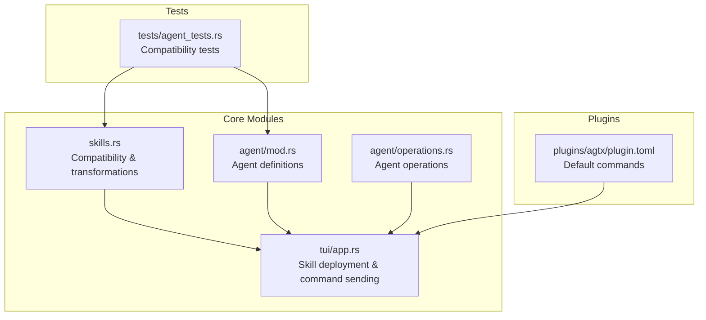
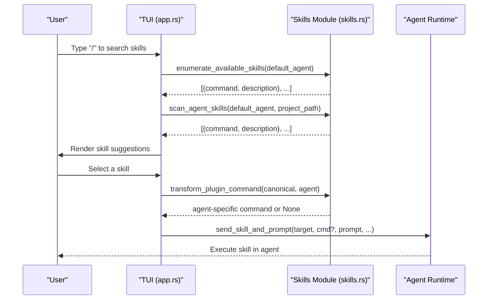
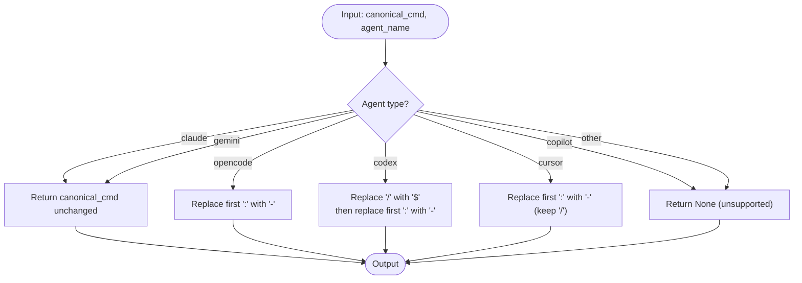
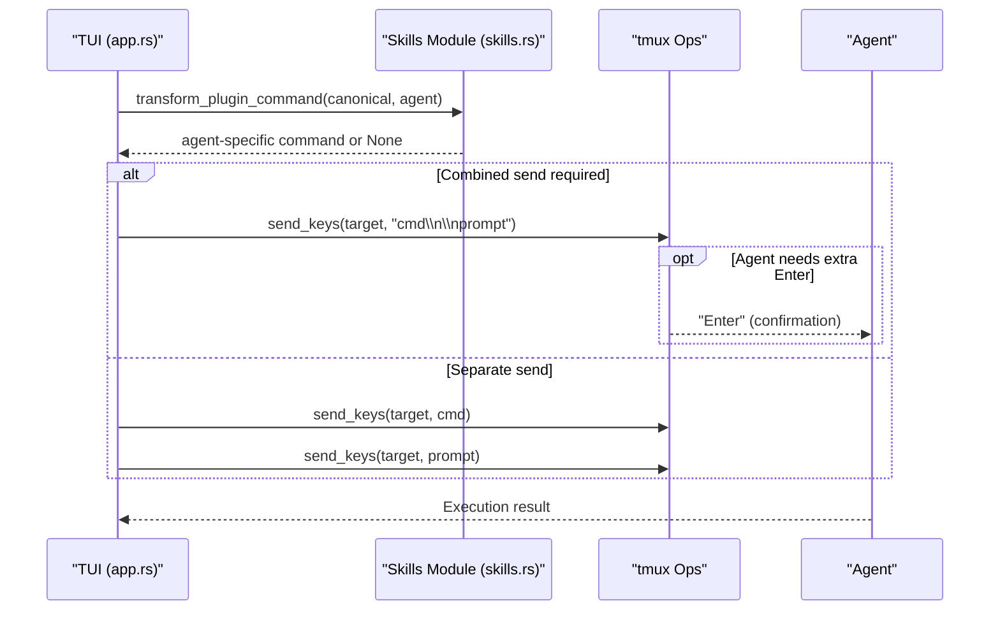
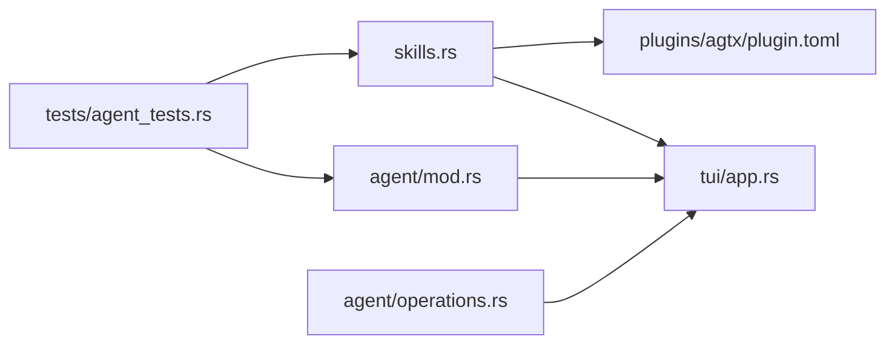

# Agent Compatibility and Command Transformation

<cite>
**Referenced Files in This Document**
- [src/skills.rs](file://src/skills.rs)
- [src/tui/app.rs](file://src/tui/app.rs)
- [src/agent/mod.rs](file://src/agent/mod.rs)
- [src/agent/operations.rs](file://src/agent/operations.rs)
- [plugins/agtx/plugin.toml](file://plugins/agtx/plugin.toml)
- [tests/agent_tests.rs](file://tests/agent_tests.rs)
- [CLAUDE.md](file://CLAUDE.md)
- [AGENTS.md](file://AGENTS.md)
</cite>

## Table of Contents
1. [Introduction](#introduction)
2. [Project Structure](#project-structure)
3. [Core Components](#core-components)
4. [Architecture Overview](#architecture-overview)
5. [Detailed Component Analysis](#detailed-component-analysis)
6. [Dependency Analysis](#dependency-analysis)
7. [Performance Considerations](#performance-considerations)
8. [Troubleshooting Guide](#troubleshooting-guide)
9. [Conclusion](#conclusion)

## Introduction
This document explains AGTX’s agent compatibility system that ensures skills work seamlessly across different AI agents. It focuses on the command transformation functions that adapt skill invocations for each agent type, the mapping from canonical commands to agent-specific formats, and the agent-native skill directory resolution. It also covers agent-specific command syntax variations, the agent_native_skill_dir function, examples of transformations, compatibility limitations, fallback mechanisms, and troubleshooting guidance.

## Project Structure
The agent compatibility logic is primarily implemented in the skills module and integrated into the TUI workflow for deploying skills and resolving commands. Agents are defined and launched via the agent module, while the TUI orchestrates skill deployment and command sending.

**Diagram sources**
- [src/skills.rs:31-115](file://src/skills.rs#L31-L115)
- [src/tui/app.rs:8908-9000](file://src/tui/app.rs#L8908-L9000)
- [src/agent/mod.rs:80-122](file://src/agent/mod.rs#L80-L122)
- [src/agent/operations.rs:18-108](file://src/agent/operations.rs#L18-L108)
- [plugins/agtx/plugin.toml:11-16](file://plugins/agtx/plugin.toml#L11-L16)
- [tests/agent_tests.rs:188-221](file://tests/agent_tests.rs#L188-L221)

**Section sources**
- [src/skills.rs:31-115](file://src/skills.rs#L31-L115)
- [src/tui/app.rs:8908-9000](file://src/tui/app.rs#L8908-L9000)
- [src/agent/mod.rs:80-122](file://src/agent/mod.rs#L80-L122)
- [src/agent/operations.rs:18-108](file://src/agent/operations.rs#L18-L108)
- [plugins/agtx/plugin.toml:11-16](file://plugins/agtx/plugin.toml#L11-L16)
- [tests/agent_tests.rs:188-221](file://tests/agent_tests.rs#L188-L221)

## Core Components
- Canonical command format: The canonical form used internally is /namespace:command. Examples include /agtx:plan, /gsd:plan-phase.
- Command transformation: transform_plugin_command converts canonical commands to agent-specific formats.
- Agent-native skill directories: agent_native_skill_dir returns the base directory and optional namespace for each agent.
- Skill deployment: The TUI writes skills to both canonical and agent-native locations, adapting content and filenames per agent.
- Agent detection and spawning: known_agents and related functions define supported agents and how to launch them.

Key functions and responsibilities:
- transform_plugin_command: Applies agent-specific syntax rules to canonical commands.
- agent_native_skill_dir: Returns the base path and namespace for agent-native skill discovery.
- skill_dir_to_filename: Maps internal skill directory names to agent-native filenames.
- enumerate_available_skills: Lists built-in skills in agent-native command form.
- scan_agent_skills: Scans agent-native directories for discovered skills.
- write_skills_to_worktree: Deploys skills to agent-native paths during worktree setup.

**Section sources**
- [src/skills.rs:83-115](file://src/skills.rs#L83-L115)
- [src/skills.rs:31-45](file://src/skills.rs#L31-L45)
- [src/skills.rs:57-81](file://src/skills.rs#L57-L81)
- [src/skills.rs:211-226](file://src/skills.rs#L211-L226)
- [src/skills.rs:259-408](file://src/skills.rs#L259-L408)
- [src/tui/app.rs:8908-9000](file://src/tui/app.rs#L8908-L9000)

## Architecture Overview
The system separates canonical skill definitions from agent-specific deployment and invocation. The TUI resolves plugin commands and transforms them per agent before sending to the agent via tmux. Skills are also deployed to agent-native discovery paths so agents can discover them directly.

**Diagram sources**
- [src/tui/app.rs:4221-4271](file://src/tui/app.rs#L4221-L4271)
- [src/skills.rs:211-226](file://src/skills.rs#L211-L226)
- [src/skills.rs:259-408](file://src/skills.rs#L259-L408)
- [src/skills.rs:83-115](file://src/skills.rs#L83-L115)
- [src/tui/app.rs:8025-8135](file://src/tui/app.rs#L8025-L8135)

## Detailed Component Analysis

### Command Transformation Functions
The transform_plugin_command function adapts canonical commands (/namespace:command) to agent-specific formats:
- Claude/Gemini: Unchanged
- OpenCode: Replaces the first colon with a hyphen
- Codex: Replaces the leading slash with a dollar sign and the first colon with a hyphen
- Cursor: Replaces the first colon with a hyphen (slash retained)
- Copilot: No interactive transformation (returns None)

**Diagram sources**
- [src/skills.rs:93-115](file://src/skills.rs#L93-L115)

Examples of transformations:
- /agtx:plan
  - Claude/Gemini: /agtx:plan
  - OpenCode: /agtx-plan
  - Codex: $agtx-plan
  - Cursor: /agtx-plan
  - Copilot: Not supported (None)
- /gsd:plan-phase 1
  - Claude/Gemini: /gsd:plan-phase 1
  - OpenCode: /gsd-plan-phase 1
  - Codex: $gsd-plan-phase 1
  - Cursor: /gsd-plan-phase 1
  - Copilot: Not supported (None)

**Section sources**
- [src/skills.rs:93-115](file://src/skills.rs#L93-L115)
- [tests/agent_tests.rs:1920-1966](file://tests/agent_tests.rs#L1920-L1966)

### Agent-Native Skill Directory Resolution
The agent_native_skill_dir function returns the base directory and optional namespace for each agent’s native skill discovery:
- Claude/Gemini: base_dir = .{agent}/commands, namespace = agtx
- OpenCode: base_dir = .opencode/command, namespace = ""
- Codex: base_dir = .codex/skills, namespace = ""
- Cursor: base_dir = .cursor/skills, namespace = ""
- Copilot: base_dir = .github/agents, namespace = agtx
- Others: None (no native discovery)

This mapping drives where skills are deployed and scanned for interactive invocation.

**Section sources**
- [src/skills.rs:31-45](file://src/skills.rs#L31-L45)
- [tests/agent_tests.rs:1899-1917](file://tests/agent_tests.rs#L1899-L1917)

### Agent-Specific Command Syntax Variations
- Claude/Gemini: Commands use /namespace:command and are stored as .md files under a namespace subdirectory.
- OpenCode: Commands use /namespace-command and are stored as .md files in a flat directory.
- Codex: Commands use $namespace-command and are discovered from SKILL.md files under skill directories.
- Cursor: Commands use /command and are discovered from SKILL.md files under skill directories.
- Copilot: No interactive command transformation; commands are not sent via the same mechanism.

These differences are reflected in:
- agent_native_skill_dir for discovery paths
- skill_dir_to_filename for filename mapping
- scan_agent_skills for discovery logic
- transform_plugin_command for command transformation

**Section sources**
- [src/skills.rs:57-81](file://src/skills.rs#L57-L81)
- [src/skills.rs:259-408](file://src/skills.rs#L259-L408)
- [CLAUDE.md:131-147](file://CLAUDE.md#L131-L147)

### Skill Deployment and Discovery
The TUI deploys skills to both canonical and agent-native locations:
- Canonical: .agtx/skills/{skill}/SKILL.md
- Agent-native: Determined by agent_native_skill_dir and adjusted by skill_dir_to_filename and content transformations

Deployment logic:
- For Gemini: Converts SKILL.md content to TOML with description and prompt fields.
- For Codex/Cursor: Writes SKILL.md into skill-name subdirectories.
- For OpenCode: Strips frontmatter and writes a .md with description frontmatter plus prompt body.
- For Claude/Copilot: Transforms frontmatter to use agent-native command names and writes .md files.

Discovery logic:
- scan_agent_skills enumerates agent-native directories and returns (command, description) pairs in agent-native invocation format.

**Section sources**
- [src/tui/app.rs:8908-9000](file://src/tui/app.rs#L8908-L9000)
- [src/skills.rs:259-408](file://src/skills.rs#L259-L408)
- [src/skills.rs:128-139](file://src/skills.rs#L128-L139)
- [src/skills.rs:196-257](file://src/skills.rs#L196-L257)

### Command Resolution and Execution Flow
The TUI resolves plugin commands and transforms them per agent before sending to the agent via tmux. Special handling is applied for agents with Ink/Node TUIs (Gemini, Codex, Cursor, OpenCode) that require combined skill+prompt messages and sometimes an extra Enter to confirm command picker popups.

**Diagram sources**
- [src/skills.rs:83-115](file://src/skills.rs#L83-L115)
- [src/tui/app.rs:8025-8135](file://src/tui/app.rs#L8025-L8135)

## Dependency Analysis
The compatibility system relies on:
- skills.rs for canonical-to-agent transformations and directory mapping
- tui/app.rs for integrating transformations into the UI and command sending
- agent/mod.rs and agent/operations.rs for agent definitions and launching
- plugin configuration for default commands and prompts

**Diagram sources**
- [src/skills.rs:31-115](file://src/skills.rs#L31-L115)
- [src/tui/app.rs:8908-9000](file://src/tui/app.rs#L8908-L9000)
- [src/agent/mod.rs:80-122](file://src/agent/mod.rs#L80-L122)
- [src/agent/operations.rs:18-108](file://src/agent/operations.rs#L18-L108)
- [plugins/agtx/plugin.toml:11-16](file://plugins/agtx/plugin.toml#L11-L16)
- [tests/agent_tests.rs:188-221](file://tests/agent_tests.rs#L188-L221)

**Section sources**
- [src/skills.rs:31-115](file://src/skills.rs#L31-L115)
- [src/tui/app.rs:8908-9000](file://src/tui/app.rs#L8908-L9000)
- [src/agent/mod.rs:80-122](file://src/agent/mod.rs#L80-L122)
- [src/agent/operations.rs:18-108](file://src/agent/operations.rs#L18-L108)
- [plugins/agtx/plugin.toml:11-16](file://plugins/agtx/plugin.toml#L11-L16)
- [tests/agent_tests.rs:188-221](file://tests/agent_tests.rs#L188-L221)

## Performance Considerations
- Transformations are constant-time string manipulations and do not depend on filesystem access.
- Skill enumeration uses compile-time embedded content, avoiding disk I/O for built-in skills.
- Discovery scans are scoped to agent-native directories and filtered by extensions, minimizing overhead.
- Combined sends for Ink/Node agents reduce round-trips but add small delays for picker popups.

## Troubleshooting Guide
Common issues and resolutions:
- Unsupported agent for interactive commands
  - Symptom: transform_plugin_command returns None for an agent.
  - Resolution: Use agent-native discovery or rely on prompts without interactive commands. Copilot is intentionally unsupported for interactive command transformation.
  - Evidence: transform_plugin_command returns None for copilot and unknown agents.

- Incorrect command syntax for an agent
  - Symptom: Agent does not recognize the command.
  - Resolution: Verify the agent-specific format:
    - Claude/Gemini: /namespace:command
    - OpenCode: /namespace-command
    - Codex: $namespace-command
    - Cursor: /command
  - Evidence: transform_plugin_command tests cover these mappings.

- Skill not discovered by agent
  - Symptom: Skills appear in the UI but agent does not execute them.
  - Resolution: Ensure skills are deployed to the correct agent-native path and filename:
    - Claude/Gemini: .{agent}/commands/agtx/{short}.md
    - OpenCode: .opencode/command/{skill}.md
    - Codex: .codex/skills/{skill}/SKILL.md
    - Cursor: .cursor/skills/{skill}/SKILL.md
  - Evidence: scan_agent_skills and agent_native_skill_dir define these paths.

- Agent-specific behavior differences
  - Symptom: Different agents require combined sends or extra Enter.
  - Resolution: The TUI handles combined sends for Gemini, Codex, Cursor, and OpenCode and adds an extra Enter when needed.
  - Evidence: send_skill_and_prompt logic and tests.

- Agent detection and availability
  - Symptom: An agent is not launched as expected.
  - Resolution: Confirm the agent is in known_agents and available on PATH. The TUI uses build_interactive_command and build_resume_command accordingly.
  - Evidence: known_agents and build_interactive_command tests.

**Section sources**
- [src/skills.rs:93-115](file://src/skills.rs#L93-L115)
- [src/skills.rs:259-408](file://src/skills.rs#L259-L408)
- [src/tui/app.rs:8025-8135](file://src/tui/app.rs#L8025-L8135)
- [tests/agent_tests.rs:188-221](file://tests/agent_tests.rs#L188-L221)

## Conclusion
AGTX’s agent compatibility system cleanly separates canonical skill definitions from agent-specific deployment and invocation. Through transform_plugin_command, agent_native_skill_dir, and targeted deployment logic, skills are adapted to each agent’s command syntax and discovery model. The TUI integrates these transformations to deliver a consistent user experience across Claude, Gemini, OpenCode, Codex, Cursor, and Copilot, with clear fallbacks and troubleshooting pathways for unsupported agents.