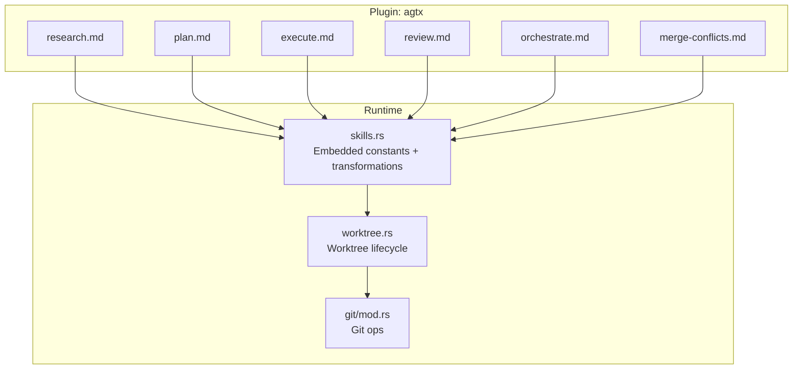
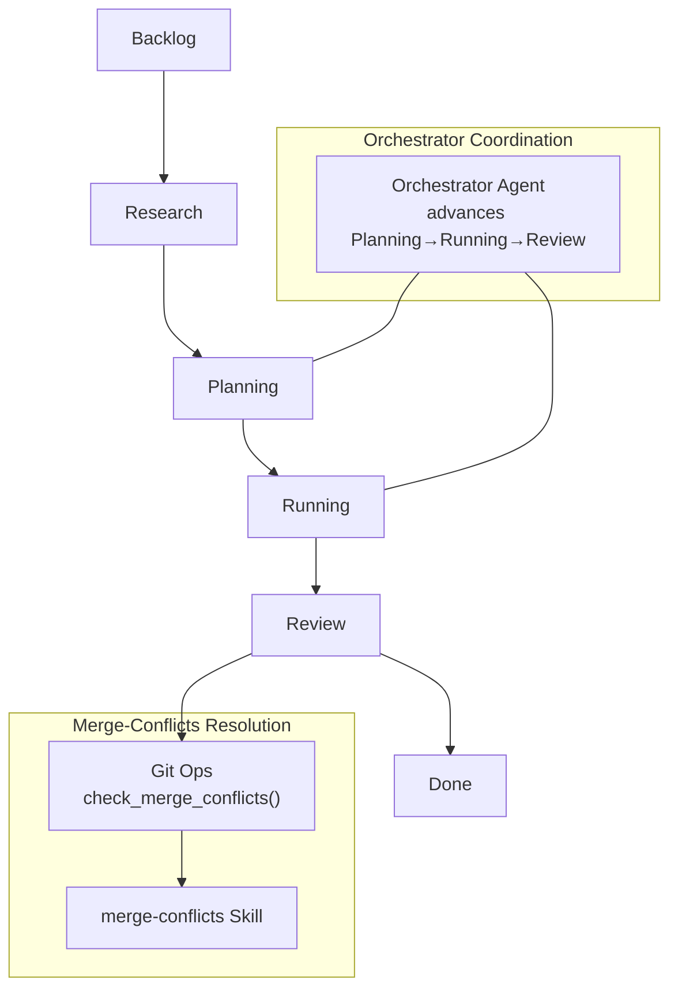
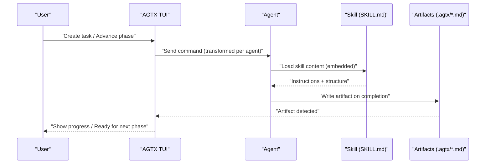
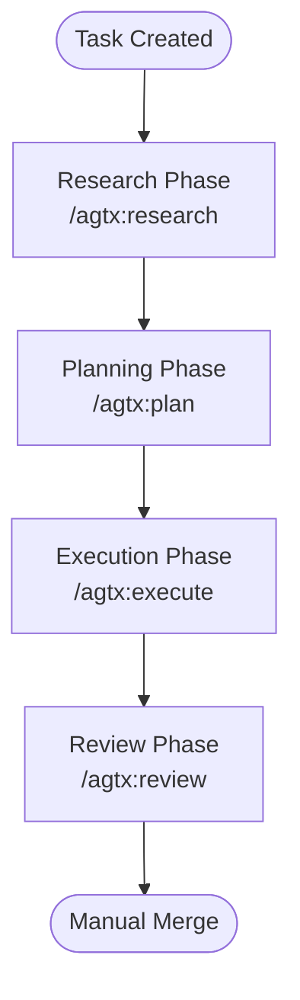
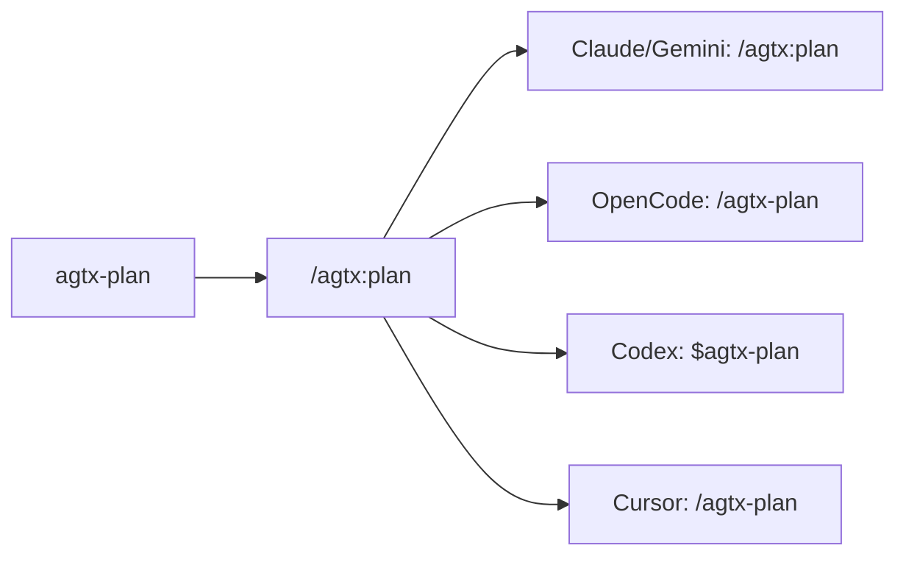
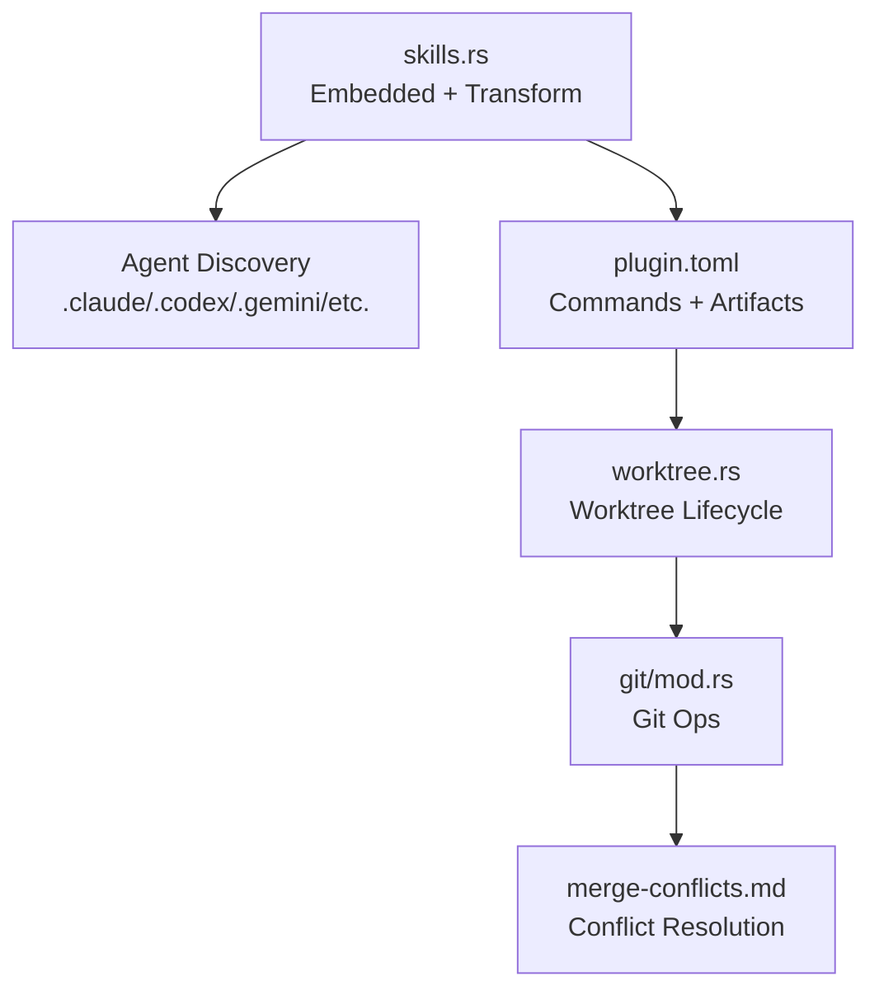

# Built-in Skills

<cite>
**Referenced Files in This Document**
- [research.md](file://plugins/agtx/skills/research.md)
- [plan.md](file://plugins/agtx/skills/plan.md)
- [execute.md](file://plugins/agtx/skills/execute.md)
- [review.md](file://plugins/agtx/skills/review.md)
- [orchestrate.md](file://plugins/agtx/skills/orchestrate.md)
- [merge-conflicts.md](file://plugins/agtx/skills/merge-conflicts.md)
- [skills.rs](file://src/skills.rs)
- [plugin.toml (agtx)](file://plugins/agtx/plugin.toml)
- [plugin.toml (agtx-terse)](file://plugins/agtx-terse/plugin.toml)
- [worktree.rs](file://src/git/worktree.rs)
- [mod.rs (git)](file://src/git/mod.rs)
- [README.md](file://README.md)
</cite>

## Table of Contents
1. [Introduction](#introduction)
2. [Project Structure](#project-structure)
3. [Core Components](#core-components)
4. [Architecture Overview](#architecture-overview)
5. [Detailed Component Analysis](#detailed-component-analysis)
6. [Dependency Analysis](#dependency-analysis)
7. [Performance Considerations](#performance-considerations)
8. [Troubleshooting Guide](#troubleshooting-guide)
9. [Conclusion](#conclusion)
10. [Appendices](#appendices)

## Introduction
This document explains AGTX’s built-in skills that form the core workflow system. The six skills—research, plan, execute, review, orchestrate, and merge-conflicts—are designed to map to worktree phases and integrate with agent-native invocation formats. Each skill defines a standardized YAML frontmatter and markdown structure, and the system transforms skill names and commands for different agent types. This guide provides practical usage patterns, agent command transformations, and best practices for effective use.

## Project Structure
The built-in skills are defined as SKILL.md files under the agtx plugin. The system embeds these files at compile time and exposes them via a unified interface. Agent-native discovery and command transformation are handled dynamically per agent.

**Diagram sources**
- [research.md:1-45](file://plugins/agtx/skills/research.md#L1-L45)
- [plan.md:1-43](file://plugins/agtx/skills/plan.md#L1-L43)
- [execute.md:1-39](file://plugins/agtx/skills/execute.md#L1-L39)
- [review.md:1-36](file://plugins/agtx/skills/review.md#L1-L36)
- [orchestrate.md:1-200](file://plugins/agtx/skills/orchestrate.md#L1-L200)
- [merge-conflicts.md:1-53](file://plugins/agtx/skills/merge-conflicts.md#L1-L53)
- [skills.rs:1-226](file://src/skills.rs#L1-L226)
- [worktree.rs:1-345](file://src/git/worktree.rs#L1-L345)
- [mod.rs (git):1-142](file://src/git/mod.rs#L1-L142)

**Section sources**
- [skills.rs:1-226](file://src/skills.rs#L1-L226)
- [plugin.toml (agtx):1-16](file://plugins/agtx/plugin.toml#L1-L16)

## Core Components
- Embedded skill content: The runtime loads SKILL.md content from the agtx plugin at compile time and stores them as static strings. These are used to populate agent-native discovery and to enumerate available skills per agent.
- Skill-to-command transformation: The system converts a skill name like “agtx-plan” into a canonical command “/agtx:plan”, then adapts it per agent (e.g., “$agtx-plan” for Codex, “/agtx-plan” for OpenCode).
- Agent-native discovery: Skills are deployed into agent-specific directories (e.g., .claude/commands, .codex/skills) so agents can discover and invoke them natively.
- Artifacts and commands: The plugin configuration maps each phase to a command and an artifact file that signals completion.

**Section sources**
- [skills.rs:1-226](file://src/skills.rs#L1-L226)
- [plugin.toml (agtx):1-16](file://plugins/agtx/plugin.toml#L1-L16)

## Architecture Overview
The AGTX workflow maps to four primary phases: Research, Planning, Running (Execution), and Review. The orchestrator coordinates transitions between Planning and Running. Merge-conflicts resolution is triggered automatically when a Review task becomes idle and merge conflicts are detected.

**Diagram sources**
- [README.md:604-646](file://README.md#L604-L646)
- [mod.rs (git):89-128](file://src/git/mod.rs#L89-L128)
- [merge-conflicts.md:1-53](file://plugins/agtx/skills/merge-conflicts.md#L1-L53)
- [plugin.toml (agtx):11-16](file://plugins/agtx/plugin.toml#L11-L16)

## Detailed Component Analysis

### Research Skill
Purpose
- Explore the codebase to understand a task before planning. Outputs findings to a research artifact file and stops without modifying code.

Inputs
- Task description (inline with the command).
- Optional prior research artifact if the workflow previously executed research.

Outputs
- A research artifact file containing sections such as relevant files, architecture, complexity assessment, and open questions.

Behavior
- Read-only exploration.
- Writes findings to the research artifact file and instructs the agent to stop and await further instructions.

Best practices
- Use when initiating a new task or when the prior research is outdated.
- Keep the research artifact concise but comprehensive for downstream planning.

Agent command mapping
- Canonical: /agtx:research
- Transformed per agent according to the transformation rules.

**Section sources**
- [research.md:1-45](file://plugins/agtx/skills/research.md#L1-L45)
- [plugin.toml (agtx):11-16](file://plugins/agtx/plugin.toml#L11-L16)
- [skills.rs:47-115](file://src/skills.rs#L47-L115)

### Plan Skill
Purpose
- Analyze the codebase and create a detailed implementation plan. Writes the plan to a plan artifact and waits for user approval before implementation begins.

Inputs
- Task description (inline with the command).
- Optional prior research artifact to inform the plan.

Outputs
- A plan artifact file with sections such as analysis, plan, and risks.

Behavior
- After writing the plan artifact, the agent must stop and await explicit instructions to proceed.

Best practices
- Reference prior research to ground assumptions.
- Clearly enumerate risks and dependencies to facilitate approval.

Agent command mapping
- Canonical: /agtx:plan
- Transformed per agent according to the transformation rules.

**Section sources**
- [plan.md:1-43](file://plugins/agtx/skills/plan.md#L1-L43)
- [plugin.toml (agtx):11-16](file://plugins/agtx/plugin.toml#L11-L16)
- [skills.rs:47-115](file://src/skills.rs#L47-L115)

### Execute Skill
Purpose
- Execute an approved implementation plan. Implement changes, run tests, and summarize results in an execution artifact.

Inputs
- Task description (inline with the command).
- Approved plan artifact.

Outputs
- An execution artifact file with sections such as changes and testing.

Behavior
- Implement changes, run relevant tests, and fix issues found during testing.
- After writing the execution artifact, the agent must stop and await further instructions.

Best practices
- Follow the approved plan strictly.
- Include precise evidence of testing and verification.

Agent command mapping
- Canonical: /agtx:execute
- Transformed per agent according to the transformation rules.

**Section sources**
- [execute.md:1-39](file://plugins/agtx/skills/execute.md#L1-L39)
- [plugin.toml (agtx):11-16](file://plugins/agtx/plugin.toml#L11-L16)
- [skills.rs:47-115](file://src/skills.rs#L47-L115)

### Review Skill
Purpose
- Self-review completed work for correctness, edge cases, code quality, test coverage, and security. Writes a review artifact and determines readiness to merge.

Inputs
- Changes from the execution phase (via git diff and local inspection).

Outputs
- A review artifact file with sections such as review findings and status (READY or NEEDS_WORK).

Behavior
- Review changes, check for issues, and fix as needed.
- Determine and communicate readiness to merge.

Best practices
- Use git diff to systematically review changes.
- Document rationale for status decisions.

Agent command mapping
- Canonical: /agtx:review
- Transformed per agent according to the transformation rules.

**Section sources**
- [review.md:1-36](file://plugins/agtx/skills/review.md#L1-L36)
- [plugin.toml (agtx):11-16](file://plugins/agtx/plugin.toml#L11-L16)
- [skills.rs:47-115](file://src/skills.rs#L47-L115)

### Orchestrator Skill
Purpose
- Coordinate the kanban board by advancing tasks through Planning and Running phases, monitoring completions, and handling stuck agents.

Inputs
- Board notifications indicating phase completion.
- MCP tools to list tasks, get task details, move tasks, read pane content, and send messages.

Outputs
- Transitions tasks forward when appropriate and escalates when human intervention is required.

Behavior
- On startup, list tasks and process any in-progress tasks.
- React to phase-completion notifications by checking allowed actions and moving tasks forward.
- Handle stuck tasks by reading pane content, answering prompts, escalating when necessary, and signaling idle.

Rules and decision logic
- Only act on tasks in Planning or Running.
- Respect allowed_actions and do not move tasks beyond Review.
- Use decision rules for confirmations, numbered menus, domain questions, and persistent errors.

Agent command mapping
- The orchestrator is an agent role, not a skill invoked directly. It uses MCP tools and follows the workflow rules.

**Section sources**
- [orchestrate.md:1-200](file://plugins/agtx/skills/orchestrate.md#L1-L200)
- [README.md:604-646](file://README.md#L604-L646)

### Merge-Conflicts Skill
Purpose
- Resolve merge conflicts by merging the default branch into the current feature branch and validating the result.

Inputs
- Current worktree state with conflicts.

Outputs
- A clean working tree and validated changes.

Behavior
- Commit current work, merge default branch, resolve all conflicts, review conflicted files, and run tests.
- Enforces non-destructive practices: merge, not rebase; do not squash or force push.

Agent command mapping
- Canonical: /agtx:merge-conflicts
- Transformed per agent according to the transformation rules.

**Section sources**
- [merge-conflicts.md:1-53](file://plugins/agtx/skills/merge-conflicts.md#L1-L53)
- [mod.rs (git):89-128](file://src/git/mod.rs#L89-L128)
- [README.md:164-164](file://README.md#L164-L164)

## Architecture Overview
The built-in skills integrate with the AGTX workflow and agent ecosystem as follows:

**Diagram sources**
- [skills.rs:1-226](file://src/skills.rs#L1-L226)
- [plugin.toml (agtx):11-16](file://plugins/agtx/plugin.toml#L11-L16)
- [README.md:506-547](file://README.md#L506-L547)

## Detailed Component Analysis

### Skill Content Structure (YAML Frontmatter + Markdown)
- YAML frontmatter: Contains name and description fields.
- Markdown body: Defines the phase context, inputs, instructions, and outputs.
- Standardized sections: Inputs, Instructions, Outputs, and critical stop-and-wait guidance.

Example references
- Research: [research.md:1-45](file://plugins/agtx/skills/research.md#L1-L45)
- Plan: [plan.md:1-43](file://plugins/agtx/skills/plan.md#L1-L43)
- Execute: [execute.md:1-39](file://plugins/agtx/skills/execute.md#L1-L39)
- Review: [review.md:1-36](file://plugins/agtx/skills/review.md#L1-L36)
- Merge-conflicts: [merge-conflicts.md:1-53](file://plugins/agtx/skills/merge-conflicts.md#L1-L53)

**Section sources**
- [research.md:1-45](file://plugins/agtx/skills/research.md#L1-L45)
- [plan.md:1-43](file://plugins/agtx/skills/plan.md#L1-L43)
- [execute.md:1-39](file://plugins/agtx/skills/execute.md#L1-L39)
- [review.md:1-36](file://plugins/agtx/skills/review.md#L1-L36)
- [merge-conflicts.md:1-53](file://plugins/agtx/skills/merge-conflicts.md#L1-L53)

### Worktree Phases and Skill Mapping
- Research → Planning → Running → Review
- The plugin configuration maps each phase to a command and an artifact file.
- The orchestrator advances tasks between Planning and Running; Review is the final managed phase.

**Diagram sources**
- [plugin.toml (agtx):11-16](file://plugins/agtx/plugin.toml#L11-L16)
- [README.md:604-646](file://README.md#L604-L646)

**Section sources**
- [plugin.toml (agtx):1-16](file://plugins/agtx/plugin.toml#L1-L16)
- [README.md:604-646](file://README.md#L604-L646)

### Agent Command Names and Transformations
- Canonical form: /namespace:command
- Transformation rules:
  - Claude/Gemini: unchanged
  - OpenCode: colon → hyphen
  - Codex: slash → dollar + colon → hyphen
  - Cursor: slash kept, colon → hyphen
- Skill name to command: replaces the first hyphen with a colon (e.g., agtx-plan → /agtx:plan).

**Diagram sources**
- [skills.rs:47-115](file://src/skills.rs#L47-L115)

**Section sources**
- [skills.rs:47-115](file://src/skills.rs#L47-L115)
- [README.md:350-368](file://README.md#L350-L368)

### Practical Examples and Agent Interactions
- Research: Agent explores codebase, writes findings to research artifact, then stops.
- Plan: Agent reads prior research (if present), writes plan artifact, then stops and waits for approval.
- Execute: Agent implements changes, runs tests, writes execution artifact, then stops.
- Review: Agent reviews changes, fixes issues, writes review artifact, then stops.
- Orchestrator: Receives notifications, advances tasks, escalates when needed, and signals idle.
- Merge-conflicts: Agent resolves conflicts, validates, and runs tests.

**Section sources**
- [research.md:1-45](file://plugins/agtx/skills/research.md#L1-L45)
- [plan.md:1-43](file://plugins/agtx/skills/plan.md#L1-L43)
- [execute.md:1-39](file://plugins/agtx/skills/execute.md#L1-L39)
- [review.md:1-36](file://plugins/agtx/skills/review.md#L1-L36)
- [orchestrate.md:1-200](file://plugins/agtx/skills/orchestrate.md#L1-L200)
- [merge-conflicts.md:1-53](file://plugins/agtx/skills/merge-conflicts.md#L1-L53)

## Dependency Analysis
The built-in skills depend on:
- Embedded content loading and enumeration.
- Agent-native discovery and command transformation.
- Git operations for conflict detection and merges.
- Worktree lifecycle for task isolation and persistence.

**Diagram sources**
- [skills.rs:1-226](file://src/skills.rs#L1-L226)
- [plugin.toml (agtx):1-16](file://plugins/agtx/plugin.toml#L1-L16)
- [worktree.rs:1-345](file://src/git/worktree.rs#L1-L345)
- [mod.rs (git):1-142](file://src/git/mod.rs#L1-L142)
- [merge-conflicts.md:1-53](file://plugins/agtx/skills/merge-conflicts.md#L1-L53)

**Section sources**
- [skills.rs:1-226](file://src/skills.rs#L1-L226)
- [worktree.rs:1-345](file://src/git/worktree.rs#L1-L345)
- [mod.rs (git):1-142](file://src/git/mod.rs#L1-L142)

## Performance Considerations
- Prefer the terse plugin variant for token efficiency when bandwidth or latency is a concern.
- Keep skill artifacts minimal and focused to reduce parsing and rendering overhead.
- Use the orchestrator to minimize idle time and redundant handoffs.

[No sources needed since this section provides general guidance]

## Troubleshooting Guide
Common issues and resolutions
- Agent stuck on prompts: Use orchestrator escalation or send targeted input via MCP tools.
- Conflicts during Review: Run the merge-conflicts skill to resolve and re-validate.
- Missing artifacts: Ensure the plugin’s artifact paths are correct and the agent writes to the expected locations.

**Section sources**
- [orchestrate.md:91-200](file://plugins/agtx/skills/orchestrate.md#L91-L200)
- [merge-conflicts.md:1-53](file://plugins/agtx/skills/merge-conflicts.md#L1-L53)
- [plugin.toml (agtx):5-16](file://plugins/agtx/plugin.toml#L5-L16)

## Conclusion
AGTX’s built-in skills provide a structured, agent-agnostic workflow spanning research, planning, execution, and review. The system’s transformations and artifact-driven gating ensure consistent behavior across agents and phases. The orchestrator accelerates progress by coordinating transitions and handling edge cases, while the merge-conflicts skill automates conflict resolution to keep tasks merge-ready.

[No sources needed since this section summarizes without analyzing specific files]

## Appendices

### Best Practices
- Use research to gather context before planning.
- Keep plans scoped and risk-aware.
- Execute strictly according to approved plans.
- Perform thorough self-review and address all findings.
- Leverage the orchestrator for continuous progress and escalation.
- Use the merge-conflicts skill promptly upon conflict detection.

[No sources needed since this section provides general guidance]