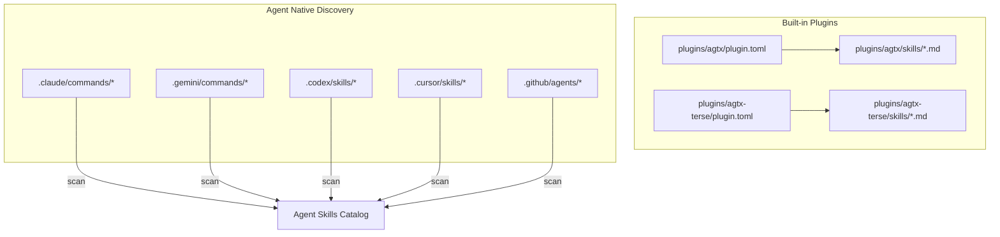
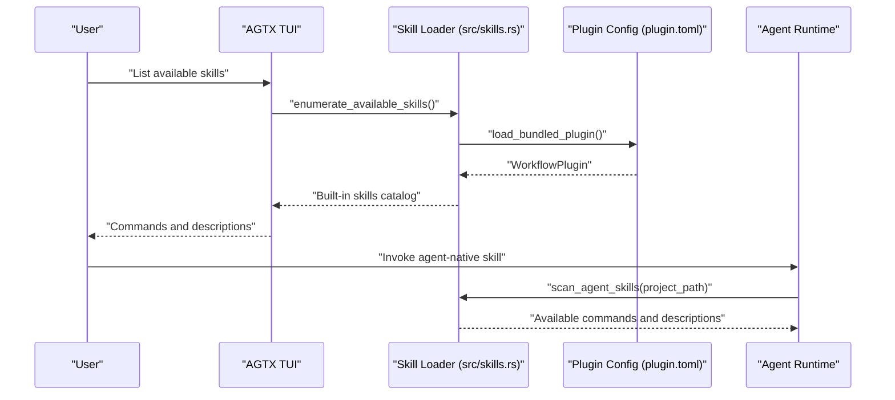
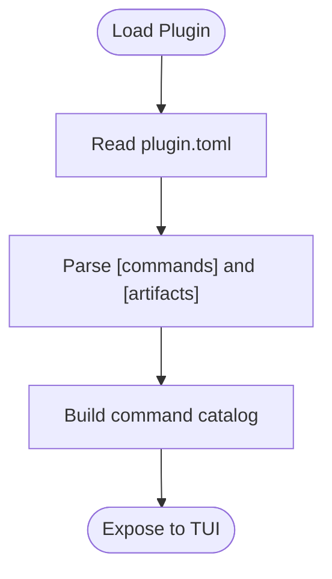
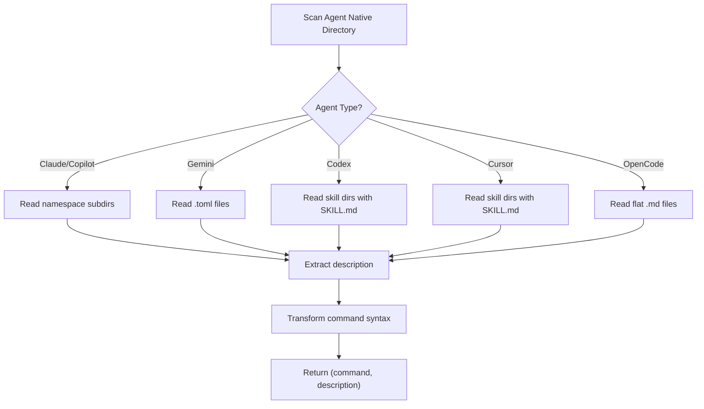
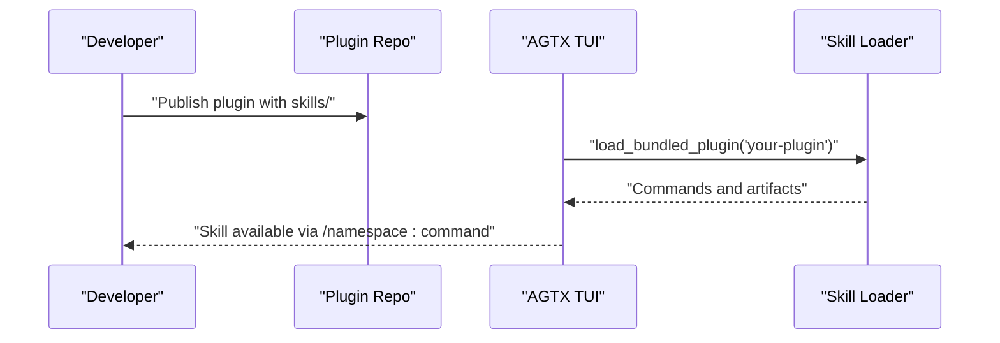
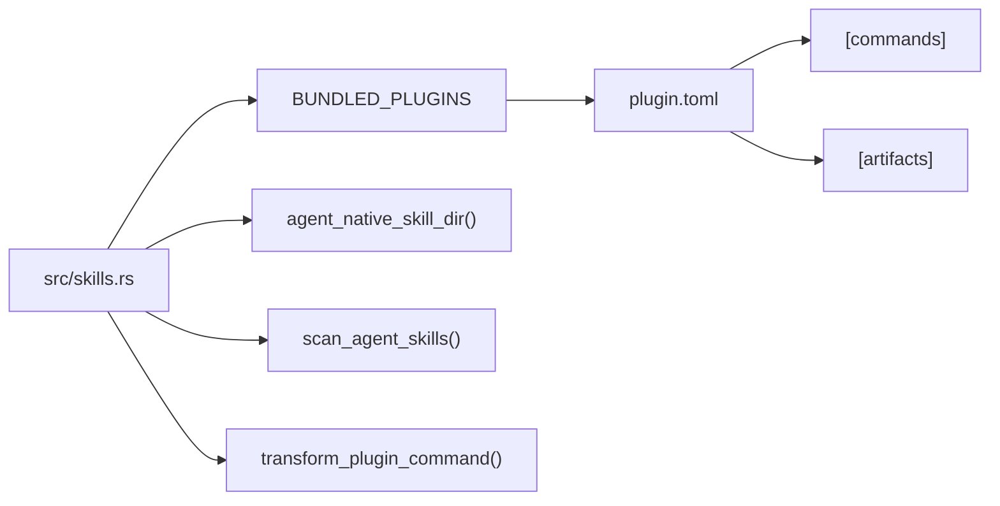

# Custom Skill Development

<cite>
**Referenced Files in This Document**
- [skills/brainstorm/SKILL.md](file://skills/brainstorm/SKILL.md)
- [skills/sweep/SKILL.md](file://skills/sweep/SKILL.md)
- [plugins/agtx-terse/skills/agtx-execute/SKILL.md](file://plugins/agtx-terse/skills/agtx-execute/SKILL.md)
- [plugins/agtx-terse/skills/agtx-plan/SKILL.md](file://plugins/agtx-terse/skills/agtx-plan/SKILL.md)
- [plugins/agtx-terse/skills/agtx-research/SKILL.md](file://plugins/agtx-terse/skills/agtx-research/SKILL.md)
- [plugins/agtx-terse/skills/agtx-review/SKILL.md](file://plugins/agtx-terse/skills/agtx-review/SKILL.md)
- [plugins/agtx/plugin.toml](file://plugins/agtx/plugin.toml)
- [plugins/agtx-terse/plugin.toml](file://plugins/agtx-terse/plugin.toml)
- [plugins/agent-skills/plugin.toml](file://plugins/agent-skills/plugin.toml)
- [src/skills.rs](file://src/skills.rs)
- [plugins/agtx/skills/research.md](file://plugins/agtx/skills/research.md)
- [plugins/agtx/skills/plan.md](file://plugins/agtx/skills/plan.md)
- [plugins/agtx/skills/execute.md](file://plugins/agtx/skills/execute.md)
- [plugins/agtx/skills/review.md](file://plugins/agtx/skills/review.md)
</cite>

## Table of Contents
1. [Introduction](#introduction)
2. [Project Structure](#project-structure)
3. [Core Components](#core-components)
4. [Architecture Overview](#architecture-overview)
5. [Detailed Component Analysis](#detailed-component-analysis)
6. [Dependency Analysis](#dependency-analysis)
7. [Performance Considerations](#performance-considerations)
8. [Troubleshooting Guide](#troubleshooting-guide)
9. [Conclusion](#conclusion)
10. [Appendices](#appendices)

## Introduction
This document explains how to develop custom skills for AGTX, covering both agent-native skills and plugin-integrated skills. It defines the SKILL.md format with YAML frontmatter, outlines the skill content structure in Markdown, and provides step-by-step guidance for creating, organizing, and distributing skills. Practical examples from built-in skills demonstrate effective design patterns, and integration with the plugin system is explained for packaging and distribution.

## Project Structure
AGTX organizes skills in two primary ways:
- Built-in plugin skills: packaged inside plugins such as agtx and agtx-terse, with SKILL.md files under plugins/<plugin>/skills/.
- Agent-native skills: discovered from agent-specific directories in projects, with SKILL.md files organized per agent convention.

Key locations and responsibilities:
- Built-in plugin skills: compiled into the application and exposed via plugin metadata.
- Agent-native skills: scanned at runtime from project-local directories for supported agents.

**Diagram sources**
- [plugins/agtx/plugin.toml:1-16](file://plugins/agtx/plugin.toml#L1-L16)
- [plugins/agtx-terse/plugin.toml:1-16](file://plugins/agtx-terse/plugin.toml#L1-L16)
- [src/skills.rs:31-45](file://src/skills.rs#L31-L45)

**Section sources**
- [src/skills.rs:31-45](file://src/skills.rs#L31-L45)
- [plugins/agtx/plugin.toml:1-16](file://plugins/agtx/plugin.toml#L1-L16)
- [plugins/agtx-terse/plugin.toml:1-16](file://plugins/agtx-terse/plugin.toml#L1-L16)

## Core Components
- SKILL.md format: YAML frontmatter followed by Markdown content. Required frontmatter fields include name and description; optional fields may include flags such as disable-model-invocation.
- Skill content: Markdown with clear headings, roles, instructions, outputs, and constraints tailored for agent consumption.
- Plugin integration: Skills are bundled via plugin.toml and mapped to commands; artifacts define persistent outputs (e.g., .agtx/research.md).
- Agent-native discovery: Skills are discovered from agent-specific directories and converted into invokable commands per agent syntax.

Key responsibilities:
- Frontmatter parsing and extraction for descriptions.
- Command transformation to agent-specific invocation syntax.
- Scanning agent-native directories and enumerating available skills.

**Section sources**
- [skills/brainstorm/SKILL.md:1-51](file://skills/brainstorm/SKILL.md#L1-L51)
- [skills/sweep/SKILL.md:1-153](file://skills/sweep/SKILL.md#L1-L153)
- [plugins/agtx-terse/skills/agtx-execute/SKILL.md:1-44](file://plugins/agtx-terse/skills/agtx-execute/SKILL.md#L1-L44)
- [plugins/agtx-terse/skills/agtx-plan/SKILL.md:1-48](file://plugins/agtx-terse/skills/agtx-plan/SKILL.md#L1-L48)
- [plugins/agtx-terse/skills/agtx-research/SKILL.md:1-50](file://plugins/agtx-terse/skills/agtx-research/SKILL.md#L1-L50)
- [plugins/agtx-terse/skills/agtx-review/SKILL.md:1-41](file://plugins/agtx-terse/skills/agtx-review/SKILL.md#L1-L41)
- [src/skills.rs:117-226](file://src/skills.rs#L117-L226)

## Architecture Overview
The skill system supports two pathways:
- Plugin-integrated skills: loaded from plugin.toml and SKILL.md files, enabling artifact-based workflows.
- Agent-native skills: discovered from project-local agent directories and transformed into invokable commands.

**Diagram sources**
- [src/skills.rs:211-226](file://src/skills.rs#L211-L226)
- [src/skills.rs:259-408](file://src/skills.rs#L259-L408)
- [plugins/agtx/plugin.toml:1-16](file://plugins/agtx/plugin.toml#L1-L16)
- [plugins/agtx-terse/plugin.toml:1-16](file://plugins/agtx-terse/plugin.toml#L1-L16)

## Detailed Component Analysis

### SKILL.md Format and Frontmatter
- YAML frontmatter block delimited by --- ... ---.
- Required fields:
  - name: Unique identifier for the skill; determines command generation and discovery.
  - description: Human-readable summary used in command listings.
- Optional fields:
  - disable-model-invocation: Boolean flag indicating the skill should not trigger model invocations.
- Content: Markdown body describing role, inputs, instructions, outputs, and constraints.

Practical examples:
- Built-in skills demonstrate consistent frontmatter and Markdown structure.
- Terse workflow skills emphasize concise output and artifact-driven phases.

**Section sources**
- [skills/brainstorm/SKILL.md:1-51](file://skills/brainstorm/SKILL.md#L1-L51)
- [skills/sweep/SKILL.md:1-153](file://skills/sweep/SKILL.md#L1-L153)
- [plugins/agtx-terse/skills/agtx-execute/SKILL.md:1-44](file://plugins/agtx-terse/skills/agtx-execute/SKILL.md#L1-L44)
- [plugins/agtx-terse/skills/agtx-plan/SKILL.md:1-48](file://plugins/agtx-terse/skills/agtx-plan/SKILL.md#L1-L48)
- [plugins/agtx-terse/skills/agtx-research/SKILL.md:1-50](file://plugins/agtx-terse/skills/agtx-research/SKILL.md#L1-L50)
- [plugins/agtx-terse/skills/agtx-review/SKILL.md:1-41](file://plugins/agtx-terse/skills/agtx-review/SKILL.md#L1-L41)

### Plugin-Integrated Skills
- Packaging: Each plugin includes a plugin.toml that declares commands and artifacts.
- Commands: Canonical form is /namespace:command; transformed per agent.
- Artifacts: Paths like .agtx/research.md, .agtx/plan.md, .agtx/execute.md, .agtx/review.md define persistent outputs.
- Built-in skills: Embedded at compile time and enumerated for agent invocation.

**Diagram sources**
- [plugins/agtx/plugin.toml:1-16](file://plugins/agtx/plugin.toml#L1-L16)
- [plugins/agtx-terse/plugin.toml:1-16](file://plugins/agtx-terse/plugin.toml#L1-L16)
- [src/skills.rs:211-226](file://src/skills.rs#L211-L226)

**Section sources**
- [plugins/agtx/plugin.toml:1-16](file://plugins/agtx/plugin.toml#L1-L16)
- [plugins/agtx-terse/plugin.toml:1-16](file://plugins/agtx-terse/plugin.toml#L1-L16)
- [src/skills.rs:14-21](file://src/skills.rs#L14-L21)
- [src/skills.rs:211-226](file://src/skills.rs#L211-L226)

### Agent-Native Skills
- Discovery: Scanned from agent-specific directories with per-agent rules:
  - Claude/Copilot: Namespaced directories with .md files.
  - Gemini: Namespaced directories with .toml files.
  - Codex: Skill subdirectories containing SKILL.md.
  - Cursor: Skill subdirectories with SKILL.md.
  - OpenCode: Flat directory with .md files.
- Command transformation: Converts canonical commands (/namespace:name) to agent-specific invocation syntax.

**Diagram sources**
- [src/skills.rs:259-408](file://src/skills.rs#L259-L408)

**Section sources**
- [src/skills.rs:31-45](file://src/skills.rs#L31-L45)
- [src/skills.rs:259-408](file://src/skills.rs#L259-L408)

### Built-in Skills Examples
- Research: Read-only exploration; writes findings to .agtx/research.md.
- Plan: Creates detailed implementation plan; writes to .agtx/plan.md.
- Execute: Implements approved plan; writes summary to .agtx/execute.md.
- Review: Self-review and readiness assessment; writes to .agtx/review.md.
- Sweep: Orchestrates task creation and handoff to the board.
- Brainstorm: Exploratory mode without planning or implementation.

These examples demonstrate consistent structure, clear roles, explicit outputs, and strict boundaries between phases.

**Section sources**
- [plugins/agtx/skills/research.md:1-45](file://plugins/agtx/skills/research.md#L1-L45)
- [plugins/agtx/skills/plan.md:1-43](file://plugins/agtx/skills/plan.md#L1-L43)
- [plugins/agtx/skills/execute.md:1-39](file://plugins/agtx/skills/execute.md#L1-L39)
- [plugins/agtx/skills/review.md:1-36](file://plugins/agtx/skills/review.md#L1-L36)
- [skills/sweep/SKILL.md:1-153](file://skills/sweep/SKILL.md#L1-L153)
- [skills/brainstorm/SKILL.md:1-51](file://skills/brainstorm/SKILL.md#L1-L51)

### Creating New Skills: Step-by-Step

1. Choose the distribution method
   - Plugin-integrated: Place SKILL.md under plugins/<your-plugin>/skills/<skill-name>/SKILL.md.
   - Agent-native: Place SKILL.md under the appropriate agent-native directory in your project.

2. Define the frontmatter
   - name: Unique skill name (e.g., your-skill-name).
   - description: Brief, descriptive summary.
   - Optional flags: disable-model-invocation if the skill should not trigger model invocations.

3. Author the Markdown content
   - Clear headings: Role, Inputs, Instructions, Outputs, Constraints.
   - Explicit outputs: Define where artifacts are written and what sections they contain.
   - Constraints: Enforce boundaries (e.g., “Do not modify code”).

4. File organization and naming
   - Plugin-integrated: skills/<skill-name>/SKILL.md.
   - Agent-native:
     - Claude/Gemini: .claude/commands/agtx/<skill>.md or .gemini/commands/agtx/<skill>.toml.
     - Codex: .codex/skills/<skill>/SKILL.md.
     - Cursor: .cursor/skills/<skill>/SKILL.md.
     - OpenCode: .config/opencode/command/<skill>.md.

5. Integrate with the plugin system (optional)
   - Add a [commands] entry in plugin.toml mapping a command to your skill.
   - Declare artifacts in [artifacts] if your skill writes persistent outputs.

6. Validate and test
   - Verify frontmatter parsing and command generation.
   - Confirm agent-native discovery and command transformation.
   - Test end-to-end invocation and artifact creation.

**Section sources**
- [src/skills.rs:47-81](file://src/skills.rs#L47-L81)
- [src/skills.rs:117-139](file://src/skills.rs#L117-L139)
- [src/skills.rs:259-408](file://src/skills.rs#L259-L408)
- [plugins/agtx/plugin.toml:11-16](file://plugins/agtx/plugin.toml#L11-L16)
- [plugins/agtx-terse/plugin.toml:11-16](file://plugins/agtx-terse/plugin.toml#L11-L16)

### Integrating Custom Skills with Plugins
- Package your skill under plugins/<your-plugin>/skills/<skill-name>/SKILL.md.
- Add a [commands] entry in plugin.toml to expose the skill as a command.
- Optionally declare [artifacts] for persistent outputs.
- Distribute by publishing the plugin or sharing the directory.

**Diagram sources**
- [src/skills.rs:24-29](file://src/skills.rs#L24-L29)
- [src/skills.rs:141-194](file://src/skills.rs#L141-L194)
- [plugins/agtx/plugin.toml:11-16](file://plugins/agtx/plugin.toml#L11-L16)

**Section sources**
- [src/skills.rs:141-194](file://src/skills.rs#L141-L194)
- [plugins/agtx/plugin.toml:1-16](file://plugins/agtx/plugin.toml#L1-L16)

### Validation Techniques and Best Practices
- Frontmatter validation: Ensure name and description are present; verify optional flags.
- Markdown formatting: Use headings, bullet lists, and explicit sections for readability.
- Artifact consistency: Align SKILL.md outputs with declared [artifacts] in plugin.toml.
- Command transformation: Confirm canonical commands convert to agent-specific syntax.
- Discovery verification: Confirm agent-native skills appear in the command list for supported agents.
- Reusability: Keep skills modular, with clear boundaries between phases (research, plan, execute, review).
- Maintainability: Use consistent section headings and output formats across skills.

**Section sources**
- [src/skills.rs:117-139](file://src/skills.rs#L117-L139)
- [src/skills.rs:196-209](file://src/skills.rs#L196-L209)
- [src/skills.rs:211-226](file://src/skills.rs#L211-L226)
- [plugins/agtx/plugin.toml:5-9](file://plugins/agtx/plugin.toml#L5-L9)

## Dependency Analysis
The skill loader coordinates plugin discovery, command enumeration, and agent-native scanning.

**Diagram sources**
- [src/skills.rs:24-29](file://src/skills.rs#L24-L29)
- [src/skills.rs:35-45](file://src/skills.rs#L35-L45)
- [src/skills.rs:259-408](file://src/skills.rs#L259-L408)
- [src/skills.rs:93-115](file://src/skills.rs#L93-L115)
- [plugins/agtx/plugin.toml:1-16](file://plugins/agtx/plugin.toml#L1-L16)

**Section sources**
- [src/skills.rs:24-29](file://src/skills.rs#L24-L29)
- [src/skills.rs:35-45](file://src/skills.rs#L35-L45)
- [src/skills.rs:93-115](file://src/skills.rs#L93-L115)
- [src/skills.rs:259-408](file://src/skills.rs#L259-L408)

## Performance Considerations
- Compile-time embedding: Built-in plugin skills are included at compile time, reducing runtime I/O.
- Minimal scanning: Agent-native discovery reads only necessary directories and parses small frontmatter excerpts.
- Efficient transformations: Command transformations operate on small strings and avoid heavy computation.

[No sources needed since this section provides general guidance]

## Troubleshooting Guide
- Missing description in agent-native skills: The loader falls back to a derived description if frontmatter parsing fails.
- Unsupported agent syntax: Some agents do not support interactive invocation; the loader returns None and falls back to file-path references.
- Incorrect frontmatter: Ensure the YAML block is properly delimited and contains required fields.
- Command mismatch: Verify canonical commands and agent-specific transformations align with plugin.toml and agent expectations.

**Section sources**
- [src/skills.rs:228-257](file://src/skills.rs#L228-L257)
- [src/skills.rs:93-115](file://src/skills.rs#L93-L115)

## Conclusion
By adhering to the SKILL.md format, structuring content for agent consumption, and integrating via plugin.toml or agent-native directories, developers can create reusable and maintainable skills. Built-in examples illustrate effective patterns for research, planning, execution, and review phases, while the loader’s transformations and discovery mechanisms ensure consistent command availability across agents.

[No sources needed since this section summarizes without analyzing specific files]

## Appendices

### Appendix A: SKILL.md Frontmatter Fields
- name: Unique skill identifier.
- description: Human-readable summary.
- disable-model-invocation: Optional boolean flag.

**Section sources**
- [skills/brainstorm/SKILL.md:1-51](file://skills/brainstorm/SKILL.md#L1-L51)
- [skills/sweep/SKILL.md:1-153](file://skills/sweep/SKILL.md#L1-L153)

### Appendix B: Agent-Native Directory Layouts
- Claude/Copilot: .claude/commands/<namespace>/<skill>.md or .github/agents/<namespace>/<skill>.md
- Gemini: .gemini/commands/<namespace>/<skill>.toml
- Codex: .codex/skills/<skill>/SKILL.md
- Cursor: .cursor/skills/<skill>/SKILL.md
- OpenCode: .config/opencode/command/<skill>.md

**Section sources**
- [src/skills.rs:35-45](file://src/skills.rs#L35-L45)
- [src/skills.rs:259-408](file://src/skills.rs#L259-L408)