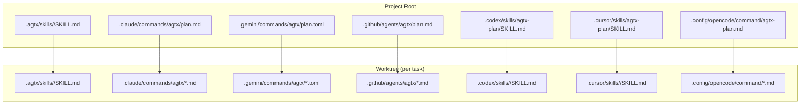
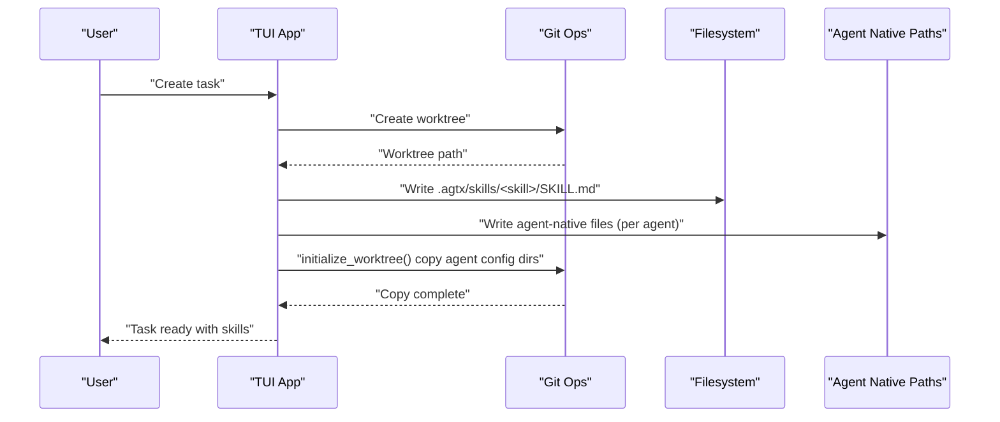
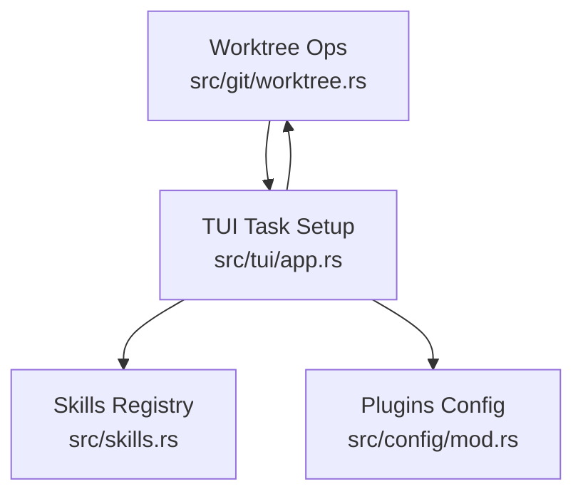

# Skill Deployment and Synchronization

<cite>
**Referenced Files in This Document**
- [src/skills.rs](file://src/skills.rs)
- [src/git/worktree.rs](file://src/git/worktree.rs)
- [src/tui/app.rs](file://src/tui/app.rs)
- [src/config/mod.rs](file://src/config/mod.rs)
- [plugins/agtx/plugin.toml](file://plugins/agtx/plugin.toml)
- [plugins/agent-skills/plugin.toml](file://plugins/agent-skills/plugin.toml)
- [plugins/agtx/skills/research.md](file://plugins/agtx/skills/research.md)
- [plugins/agtx-terse/skills/agtx-plan/SKILL.md](file://plugins/agtx-terse/skills/agtx-plan/SKILL.md)
- [skills/brainstorm/SKILL.md](file://skills/brainstorm/SKILL.md)
- [AGENTS.md](file://AGENTS.md)
</cite>

## Table of Contents
1. [Introduction](#introduction)
2. [Project Structure](#project-structure)
3. [Core Components](#core-components)
4. [Architecture Overview](#architecture-overview)
5. [Detailed Component Analysis](#detailed-component-analysis)
6. [Dependency Analysis](#dependency-analysis)
7. [Performance Considerations](#performance-considerations)
8. [Troubleshooting Guide](#troubleshooting-guide)
9. [Conclusion](#conclusion)

## Introduction
This document explains AGTX’s skill deployment system that automatically installs and synchronizes skills across agent environments. It covers:
- Agent-native skill directory structures for supported agents
- How skills are organized with namespace prefixes
- Filename transformations per agent
- The installation process that deploys compiled-in skills to worktree-specific agent directories during plugin activation
- Examples of directory layouts and synchronization across git worktrees
- Troubleshooting common deployment issues

## Project Structure
At a high level, AGTX organizes skills in two places:
- Canonical worktree skills: .agtx/skills/<skill>/SKILL.md
- Agent-native discovery paths: agent-specific directories under the project root for each agent

During task setup, AGTX writes both forms into each worktree so skills are discoverable by agents and by the TUI.

**Diagram sources**
- [src/tui/app.rs:8864-8955](file://src/tui/app.rs#L8864-L8955)
- [src/git/worktree.rs:86-94](file://src/git/worktree.rs#L86-L94)

**Section sources**
- [src/tui/app.rs:8864-8955](file://src/tui/app.rs#L8864-L8955)
- [src/git/worktree.rs:86-94](file://src/git/worktree.rs#L86-L94)

## Core Components
- Skills registry and transformations: maps internal skill names to agent-native filenames and formats, and enumerates available skills per agent.
- Worktree initialization: copies agent config directories into each worktree, ensuring skills are available wherever agents expect them.
- TUI task setup: writes canonical .agtx/skills and agent-native files for all agents configured across phases.

Key responsibilities:
- Normalize skill names and filenames per agent
- Convert SKILL.md content to agent-native formats (e.g., TOML for Gemini)
- Deploy skills to both canonical and agent-native locations
- Ensure cross-worktree synchronization via directory copying

**Section sources**
- [src/skills.rs:31-115](file://src/skills.rs#L31-L115)
- [src/git/worktree.rs:129-223](file://src/git/worktree.rs#L129-L223)
- [src/tui/app.rs:8864-8955](file://src/tui/app.rs#L8864-L8955)

## Architecture Overview
The skill deployment pipeline runs during task creation and ensures that each worktree contains:
- A canonical .agtx/skills directory with SKILL.md files
- Agent-native directories with properly transformed filenames and formats

**Diagram sources**
- [src/tui/app.rs:7033-7206](file://src/tui/app.rs#L7033-L7206)
- [src/git/worktree.rs:129-223](file://src/git/worktree.rs#L129-L223)

## Detailed Component Analysis

### Agent-Native Skill Directory Structures
AGTX defines agent-native discovery paths and namespaces. The following table summarizes the layout per agent:

- Claude
  - Base: .claude/commands
  - Namespace: agtx
  - Files: .md
  - Example: .claude/commands/agtx/plan.md

- Gemini
  - Base: .gemini/commands
  - Namespace: agtx
  - Files: .toml
  - Example: .gemini/commands/agtx/plan.toml

- Copilot
  - Base: .github/agents
  - Namespace: agtx
  - Files: .md
  - Example: .github/agents/agtx/plan.md

- Codex
  - Base: .codex/skills
  - Namespace: (empty)
  - Files: SKILL.md inside <skill-name> subdirectories
  - Example: .codex/skills/agtx-plan/SKILL.md

- Cursor
  - Base: .cursor/skills
  - Namespace: (empty)
  - Files: SKILL.md inside <skill-name> subdirectories
  - Example: .cursor/skills/agtx-execute/SKILL.md

- OpenCode
  - Base: .config/opencode/command
  - Namespace: (empty)
  - Files: .md (flat directory)
  - Example: .config/opencode/command/agtx-plan.md

Notes:
- Namespaces are applied for agents that support namespaced subdirectories (Claude, Gemini, Copilot).
- Some agents use SKILL.md inside subdirectories (Codex, Cursor), while others use .md or .toml files directly under agent-native roots.

**Section sources**
- [src/skills.rs:35-44](file://src/skills.rs#L35-L44)
- [src/tui/app.rs:8910-8954](file://src/tui/app.rs#L8910-L8954)

### Filename Transformation System
AGTX transforms internal skill directory names to agent-specific filenames:

- Default behavior (Claude/Gemini/Copilot):
  - Strips the "agtx-" prefix and appends .md
  - Example: agtx-plan → plan.md

- Gemini:
  - Strips the "agtx-" prefix and appends .toml
  - Example: agtx-execute → execute.toml

- OpenCode:
  - Keeps the full skill directory name and appends .md
  - Example: agtx-research → agtx-research.md

- Codex/Cursor:
  - Use SKILL.md inside the skill subdirectory; filename transformation is not applied here because the agent expects this structure.

Additionally, AGTX transforms plugin commands to agent-specific invocation syntax when invoking skills interactively.

**Section sources**
- [src/skills.rs:57-115](file://src/skills.rs#L57-L115)

### Skill Installation During Plugin Activation
When a task is created, AGTX performs the following steps:
1. Create the worktree and initialize it by copying agent config directories from the project root into the worktree.
2. Write canonical .agtx/skills/<skill>/SKILL.md files from compiled-in defaults or plugin-provided overrides.
3. Write agent-native files for all agents configured across phases:
   - For Claude/Gemini/Copilot: .md files under namespaced directories
   - For Gemini: .toml files with description and prompt fields
   - For Codex/Cursor: SKILL.md inside <skill-name> subdirectories
   - For OpenCode: flat .md files under .config/opencode/command

These steps ensure skills are synchronized across worktrees and available to agents immediately upon session startup.

**Section sources**
- [src/git/worktree.rs:129-223](file://src/git/worktree.rs#L129-L223)
- [src/tui/app.rs:8864-8955](file://src/tui/app.rs#L8864-L8955)

### Directory Layout Examples
Below are representative directory structures for each agent type inside a worktree:

- Claude
  - .claude/commands/agtx/plan.md
  - .claude/commands/agtx/research.md

- Gemini
  - .gemini/commands/agtx/plan.toml
  - .gemini/commands/agtx/review.toml

- Copilot
  - .github/agents/agtx/execute.md
  - .github/agents/agtx/merge-conflicts.md

- Codex
  - .codex/skills/agtx-execute/SKILL.md
  - .codex/skills/agtx-review/SKILL.md

- Cursor
  - .cursor/skills/agtx-plan/SKILL.md
  - .cursor/skills/agtx-research/SKILL.md

- OpenCode
  - .config/opencode/command/agtx-plan.md
  - .config/opencode/command/agtx-execute.md

These structures are generated during task setup and remain synchronized across worktrees because agent config directories are copied into each worktree.

**Section sources**
- [src/tui/app.rs:8910-8954](file://src/tui/app.rs#L8910-L8954)
- [src/git/worktree.rs:86-94](file://src/git/worktree.rs#L86-L94)

### Synchronization Across Git Worktrees
AGTX ensures skills are synchronized across worktrees by copying agent config directories into each worktree during initialization. This guarantees that:
- Skills deployed to agent-native paths are available in every worktree
- Plugins and artifacts are consistently present across task sessions

The copied directories include agent-specific configuration and commands, ensuring agents can discover skills without manual setup.

**Section sources**
- [src/git/worktree.rs:129-223](file://src/git/worktree.rs#L129-L223)

### Skill Content Processing and Formats
- Frontmatter extraction: AGTX reads YAML frontmatter from SKILL.md to derive descriptions used in agent-native formats (e.g., Gemini TOML).
- Gemini TOML generation: Converts skill content to TOML with description and prompt fields, escaping special characters.
- OpenCode transformation: Applies agent-specific formatting for OpenCode command files.
- Codex/Cursor: Writes SKILL.md directly into skill subdirectories as required by those agents.

**Section sources**
- [src/skills.rs:117-139](file://src/skills.rs#L117-L139)
- [src/tui/app.rs:8923-8951](file://src/tui/app.rs#L8923-L8951)

### Plugin Integration and Compatibility
- Built-in plugins define commands and prompts per phase and may restrict supported agents.
- AGTX loads plugins from project-local or global locations and falls back to bundled plugins when needed.
- During task setup, AGTX writes plugin-provided skills into .agtx/skills and agent-native paths, respecting agent-specific formats.

**Section sources**
- [src/config/mod.rs:410-594](file://src/config/mod.rs#L410-L594)
- [plugins/agtx/plugin.toml:1-16](file://plugins/agtx/plugin.toml#L1-L16)
- [plugins/agent-skills/plugin.toml:1-19](file://plugins/agent-skills/plugin.toml#L1-L19)

## Dependency Analysis
The skill deployment system spans several modules with clear responsibilities:

- TUI depends on Skills for filename transformations and on Worktree for copying agent config directories.
- Worktree depends on the predefined agent config directories to synchronize across worktrees.
- Plugins provide the workflow definition and may influence which skills are written and how they are formatted.

**Diagram sources**
- [src/tui/app.rs:8864-8955](file://src/tui/app.rs#L8864-L8955)
- [src/git/worktree.rs:86-94](file://src/git/worktree.rs#L86-L94)
- [src/skills.rs:31-115](file://src/skills.rs#L31-L115)
- [src/config/mod.rs:410-594](file://src/config/mod.rs#L410-L594)

**Section sources**
- [src/tui/app.rs:8864-8955](file://src/tui/app.rs#L8864-L8955)
- [src/git/worktree.rs:86-94](file://src/git/worktree.rs#L86-L94)
- [src/skills.rs:31-115](file://src/skills.rs#L31-L115)
- [src/config/mod.rs:410-594](file://src/config/mod.rs#L410-L594)

## Performance Considerations
- Skills are written once per worktree creation; subsequent tasks reuse the same agent-native directories.
- Directory copying is bounded by the number of agent config directories and the number of skills; overhead is small compared to agent session startup.
- Using compiled-in defaults avoids repeated disk reads for built-in skills.

## Troubleshooting Guide
Common issues and resolutions:

- Permission problems
  - Symptom: Failures when writing to agent-native directories in worktrees.
  - Resolution: Ensure the user has write permissions to the worktree root and agent directories. Verify that the worktree initialization step completes without permission-related errors.

- Missing directories
  - Symptom: Agent-native directories not present in worktrees.
  - Resolution: Confirm that agent config directories exist in the project root and that worktree initialization copied them. Check the copy step for warnings.

- Agent compatibility conflicts
  - Symptom: Skills not recognized by agents or incorrect filenames/formats.
  - Resolution: Verify the agent name matches one of the supported agents and that the correct filename transformation and format are used for that agent. For example, Gemini requires .toml files, while Codex/Cursor require SKILL.md inside subdirectories.

- Plugin not found or unsupported
  - Symptom: Tasks fail to load a configured plugin or agent compatibility checks fail.
  - Resolution: Confirm the plugin exists locally or globally and that the plugin declares support for the selected agent. If not found, AGTX falls back to bundled plugins.

- Frontmatter parsing issues
  - Symptom: Descriptions missing or malformed in agent-native formats (e.g., Gemini TOML).
  - Resolution: Ensure SKILL.md contains valid YAML frontmatter with a description field. AGTX extracts this to populate agent-native metadata.

**Section sources**
- [src/git/worktree.rs:129-223](file://src/git/worktree.rs#L129-L223)
- [src/tui/app.rs:8820-8862](file://src/tui/app.rs#L8820-L8862)
- [src/skills.rs:196-257](file://src/skills.rs#L196-L257)

## Conclusion
AGTX’s skill deployment system automates the installation and synchronization of skills across agent environments by:
- Normalizing skill names and filenames per agent
- Converting content to agent-native formats
- Writing both canonical and agent-native files during task setup
- Ensuring cross-worktree consistency by copying agent config directories

This approach provides a seamless developer experience where skills are immediately available to agents and the TUI, regardless of which worktree or phase is active.