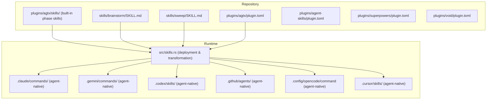
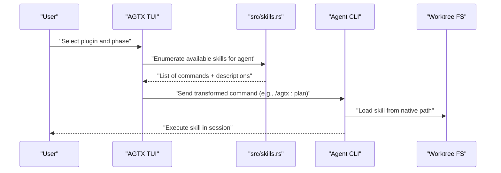
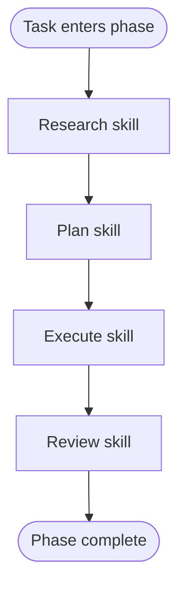
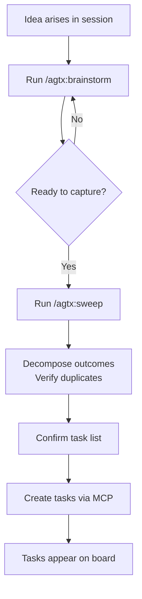
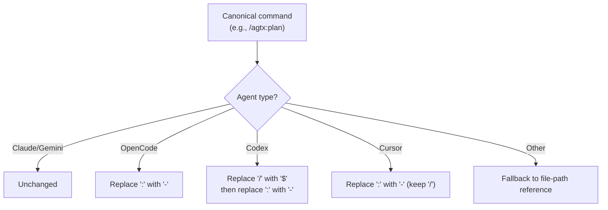
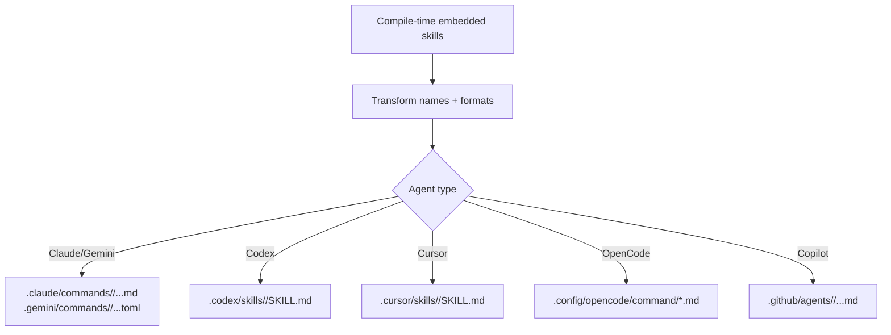
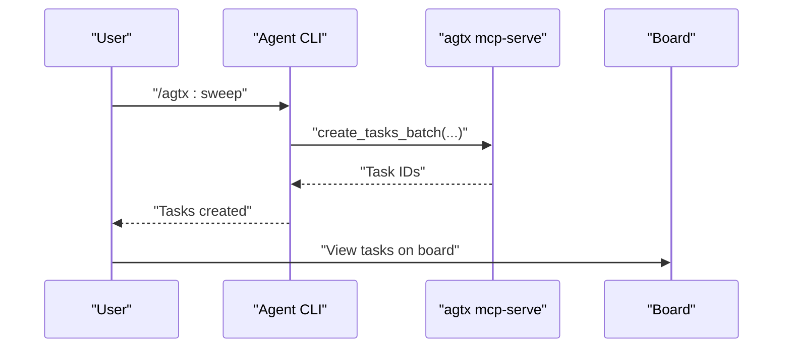
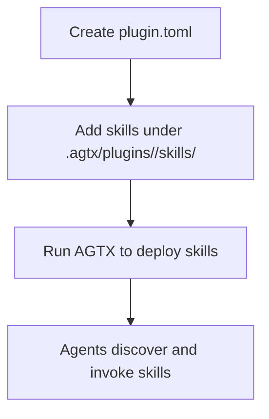
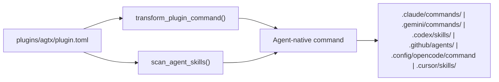

# Skill Management

<cite>
**Referenced Files in This Document**
- [README.md](file://README.md)
- [AGENTS.md](file://AGENTS.md)
- [src/skills.rs](file://src/skills.rs)
- [skills/brainstorm/SKILL.md](file://skills/brainstorm/SKILL.md)
- [skills/sweep/SKILL.md](file://skills/sweep/SKILL.md)
- [plugins/agtx/plugin.toml](file://plugins/agtx/plugin.toml)
- [plugins/agtx-terse/plugin.toml](file://plugins/agtx-terse/plugin.toml)
- [plugins/agent-skills/plugin.toml](file://plugins/agent-skills/plugin.toml)
- [plugins/superpowers/plugin.toml](file://plugins/superpowers/plugin.toml)
- [plugins/void/plugin.toml](file://plugins/void/plugin.toml)
- [plugins/agtx/skills/research.md](file://plugins/agtx/skills/research.md)
- [plugins/agtx/skills/plan.md](file://plugins/agtx/skills/plan.md)
- [plugins/agtx/skills/execute.md](file://plugins/agtx/skills/execute.md)
- [plugins/agtx/skills/review.md](file://plugins/agtx/skills/review.md)
- [src/main.rs](file://src/main.rs)
- [src/lib.rs](file://src/lib.rs)
- [install.sh](file://install.sh)
</cite>

## Table of Contents
1. [Introduction](#introduction)
2. [Project Structure](#project-structure)
3. [Core Components](#core-components)
4. [Architecture Overview](#architecture-overview)
5. [Detailed Component Analysis](#detailed-component-analysis)
6. [Dependency Analysis](#dependency-analysis)
7. [Performance Considerations](#performance-considerations)
8. [Troubleshooting Guide](#troubleshooting-guide)
9. [Conclusion](#conclusion)
10. [Appendices](#appendices)

## Introduction
This document explains AGTX’s skill management system with a focus on agent-specific commands and automated workflows. It clarifies how skills differ from plugins, highlights built-in skills for ideation and task conversion, describes the skill deployment mechanism across agent-specific directories, and provides practical usage examples and development guidance for custom skills.

## Project Structure
Skills in AGTX are organized into two primary categories:
- Built-in skills for the agtx workflow (research, plan, execute, review, orchestrate, merge-conflicts)
- Companion skills for capturing ideas and pushing outcomes to the board (brainstorm, sweep)

Plugins define commands, prompts, and artifacts that orchestrate tasks across phases. The skill deployment subsystem translates canonical plugin commands into agent-native formats and writes skill files into agent-specific directories (per worktree) so agents can discover and invoke them directly.

**Diagram sources**
- [src/skills.rs:31-45](file://src/skills.rs#L31-L45)
- [plugins/agtx/plugin.toml:11-16](file://plugins/agtx/plugin.toml#L11-L16)
- [skills/brainstorm/SKILL.md:1-51](file://skills/brainstorm/SKILL.md#L1-L51)
- [skills/sweep/SKILL.md:1-153](file://skills/sweep/SKILL.md#L1-L153)

**Section sources**
- [README.md:166-260](file://README.md#L166-L260)
- [src/skills.rs:31-45](file://src/skills.rs#L31-L45)

## Core Components
- Built-in phase skills: research, plan, execute, review, orchestrate, merge-conflicts. These are embedded at compile time and exposed via canonical commands (e.g., /agtx:plan).
- Companion skills: brainstorm and sweep. Designed for ad-hoc ideation and quick task capture from any agent session.
- Plugin command definitions: plugin.toml files declare canonical commands and prompts per phase.
- Agent-native skill directories: each agent has a specific discovery path where skills are deployed for interactive invocation.

Key runtime responsibilities:
- Map internal skill names to canonical commands and transform them per agent.
- Deploy skill files into agent-native directories for each worktree.
- Discover agent-native skills from disk for interactive invocation.

**Section sources**
- [src/skills.rs:5-21](file://src/skills.rs#L5-L21)
- [src/skills.rs:211-226](file://src/skills.rs#L211-L226)
- [src/skills.rs:259-408](file://src/skills.rs#L259-L408)
- [plugins/agtx/plugin.toml:11-16](file://plugins/agtx/plugin.toml#L11-L16)

## Architecture Overview
The skill system integrates three layers:
- Plugin layer: defines commands and prompts per phase.
- Deployment layer: transforms canonical commands and deploys skill files into agent-native directories.
- Invocation layer: agents discover and run skills directly from their native paths.

**Diagram sources**
- [src/skills.rs:211-226](file://src/skills.rs#L211-L226)
- [src/skills.rs:31-45](file://src/skills.rs#L31-L45)
- [plugins/agtx/plugin.toml:11-16](file://plugins/agtx/plugin.toml#L11-L16)

## Detailed Component Analysis

### Built-in Phase Skills
The built-in skills encapsulate the agtx workflow phases:
- Research: explore codebase, write findings to an artifact file, no modifications.
- Plan: analyze and create a detailed plan, write to an artifact file, await approval.
- Execute: implement approved changes, write summary to an artifact file.
- Review: self-review for correctness and quality, write review outcome.
- Orchestrate: coordinate tasks and board transitions.
- Merge-conflicts: resolve conflicts automatically when a task becomes idle.

These are embedded at compile time and exposed via canonical commands. They can be overridden by plugin-provided skills with the same names.

**Diagram sources**
- [plugins/agtx/skills/research.md:1-45](file://plugins/agtx/skills/research.md#L1-L45)
- [plugins/agtx/skills/plan.md:1-43](file://plugins/agtx/skills/plan.md#L1-L43)
- [plugins/agtx/skills/execute.md:1-39](file://plugins/agtx/skills/execute.md#L1-L39)
- [plugins/agtx/skills/review.md:1-36](file://plugins/agtx/skills/review.md#L1-L36)

**Section sources**
- [src/skills.rs:5-11](file://src/skills.rs#L5-L11)
- [plugins/agtx/plugin.toml:5-9](file://plugins/agtx/plugin.toml#L5-L9)

### Companion Skills: Brainstorm and Sweep
- Brainstorm: keep the agent in discussion mode, no planning or implementation. Guides the user to run sweep when outcomes are ready.
- Sweep: decomposes conversation outcomes into feature-level tasks, verifies against duplicates, and pushes them to the board via MCP tools.

**Diagram sources**
- [skills/brainstorm/SKILL.md:1-51](file://skills/brainstorm/SKILL.md#L1-L51)
- [skills/sweep/SKILL.md:102-131](file://skills/sweep/SKILL.md#L102-L131)

**Section sources**
- [README.md:166-184](file://README.md#L166-L184)
- [skills/brainstorm/SKILL.md:1-51](file://skills/brainstorm/SKILL.md#L1-L51)
- [skills/sweep/SKILL.md:102-153](file://skills/sweep/SKILL.md#L102-L153)

### Skill Command Transformation
AGTX transforms canonical plugin commands (/namespace:command) into agent-native formats:
- Claude/Gemini: unchanged
- OpenCode: colon → hyphen
- Codex: slash → dollar + colon → hyphen
- Cursor: slash kept, colon → hyphen
- Unsupported agents: fall back to file-path reference

**Diagram sources**
- [src/skills.rs:93-115](file://src/skills.rs#L93-L115)

**Section sources**
- [src/skills.rs:47-55](file://src/skills.rs#L47-L55)
- [src/skills.rs:62-81](file://src/skills.rs#L62-L81)
- [src/skills.rs:93-115](file://src/skills.rs#L93-L115)

### Skill Deployment Across Agents
AGTX determines agent-native directories and writes skill files accordingly:
- Claude/Gemini: .claude/commands/ or .gemini/commands/ with namespaced subdirectories
- Codex: .codex/skills/ with SKILL.md per skill
- Cursor: .cursor/skills/ with SKILL.md per skill
- OpenCode: .config/opencode/command/ flat directory
- Copilot: .github/agents/ with namespaced subdirectories

Deployment also converts skill content to agent-native formats (e.g., Gemini TOML) and strips YAML frontmatter for Markdown-based skills.

**Diagram sources**
- [src/skills.rs:35-44](file://src/skills.rs#L35-L44)
- [src/skills.rs:128-139](file://src/skills.rs#L128-L139)
- [src/skills.rs:259-408](file://src/skills.rs#L259-L408)

**Section sources**
- [src/skills.rs:31-45](file://src/skills.rs#L31-L45)
- [src/skills.rs:117-139](file://src/skills.rs#L117-L139)
- [src/skills.rs:259-408](file://src/skills.rs#L259-L408)

### Practical Examples in Agent Sessions
- Claude Code: install the agtx plugin and register the MCP server; use /agtx:brainstorm and /agtx:sweep.
- Codex: register MCP server; use @agtx:sweep and @agtx:brainstorm.
- Gemini CLI: register MCP server; include @skills/sweep/SKILL.md in your session context.
- Cursor: register MCP server; copy skills/sweep/SKILL.md into ~/.cursor/rules/.
- OpenCode: register MCP server; skills are discovered from .config/opencode/command/.

**Diagram sources**
- [README.md:186-260](file://README.md#L186-L260)
- [skills/sweep/SKILL.md:102-131](file://skills/sweep/SKILL.md#L102-L131)

**Section sources**
- [README.md:186-260](file://README.md#L186-L260)
- [AGENTS.md:44-52](file://AGENTS.md#L44-L52)

### Skill Development for Custom Workflows
To create custom skills integrated with plugins:
- Define a plugin.toml with commands and prompts per phase.
- Place skill files under .agtx/plugins/<your-plugin>/skills/ with names matching agtx-* conventions.
- AGTX will deploy these skills into agent-native directories for each worktree, overriding built-in skills with the same names.
- Use the “Creating a Plugin” reference in the README for full field definitions and examples.

**Diagram sources**
- [README.md:491-504](file://README.md#L491-L504)
- [plugins/agtx/plugin.toml:11-16](file://plugins/agtx/plugin.toml#L11-L16)

**Section sources**
- [README.md:370-504](file://README.md#L370-L504)
- [plugins/agtx/plugin.toml:11-16](file://plugins/agtx/plugin.toml#L11-L16)

## Dependency Analysis
- Plugin command definitions depend on canonical command syntax and agent compatibility.
- Runtime skill deployment depends on agent-native directory mappings and file format conversions.
- Agent invocation depends on skills being present in the agent’s native discovery path.

**Diagram sources**
- [plugins/agtx/plugin.toml:11-16](file://plugins/agtx/plugin.toml#L11-L16)
- [src/skills.rs:93-115](file://src/skills.rs#L93-L115)
- [src/skills.rs:259-408](file://src/skills.rs#L259-L408)

**Section sources**
- [src/skills.rs:31-45](file://src/skills.rs#L31-L45)
- [src/skills.rs:211-226](file://src/skills.rs#L211-L226)

## Performance Considerations
- Compile-time embedding of built-in skills reduces runtime IO overhead.
- Minimal filesystem scanning occurs only when enumerating agent-native skills.
- Command transformation and format conversion are lightweight string operations.

## Troubleshooting Guide
- Skills not appearing in an agent session:
  - Verify MCP server registration and that the project has been opened in AGTX at least once.
  - Confirm the agent’s native discovery path exists and contains the expected skill files.
- Agent-specific invocation syntax errors:
  - Ensure the command matches the agent’s expected format (e.g., OpenCode uses hyphens, Codex uses dollar prefixes).
- Duplicate tasks when sweeping:
  - Use the verification step to check existing tasks before confirming.
- Plugin overrides not taking effect:
  - Ensure plugin-provided skills are placed under .agtx/plugins/<your-plugin>/skills/ with matching names.

**Section sources**
- [README.md:258-260](file://README.md#L258-L260)
- [src/skills.rs:93-115](file://src/skills.rs#L93-L115)
- [skills/sweep/SKILL.md:106-131](file://skills/sweep/SKILL.md#L106-L131)

## Conclusion
AGTX’s skill management system provides a flexible, agent-aware mechanism for composing workflows. Built-in skills streamline the spec-to-ship lifecycle, while companion skills enable rapid ideation and task capture. Plugins define commands and prompts, and AGTX deploys and transforms skills to agent-native formats, ensuring consistent behavior across Claude, Gemini, Codex, Cursor, OpenCode, and Copilot.

## Appendices

### Agent Compatibility Matrix
- Canonical command: /agtx:plan
- Agent-native equivalents:
  - Claude/Gemini: /agtx:plan
  - OpenCode: /agtx-plan
  - Codex: $agtx-plan
  - Cursor: /agtx-plan
  - Copilot: not interactive

**Section sources**
- [README.md:348-368](file://README.md#L348-L368)
- [src/skills.rs:93-115](file://src/skills.rs#L93-L115)

### Installation Prerequisites
Ensure tmux, git, and optional gh are available. The installer script checks for required tools and provides guidance.

**Section sources**
- [install.sh:145-173](file://install.sh#L145-L173)