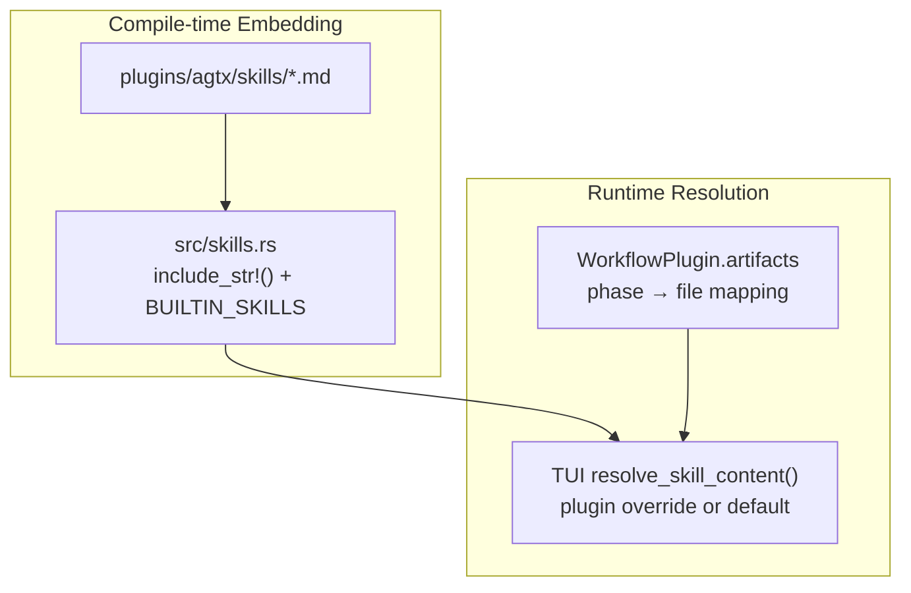
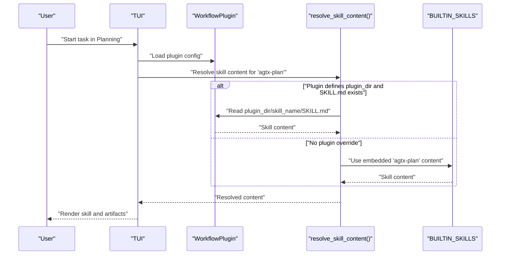
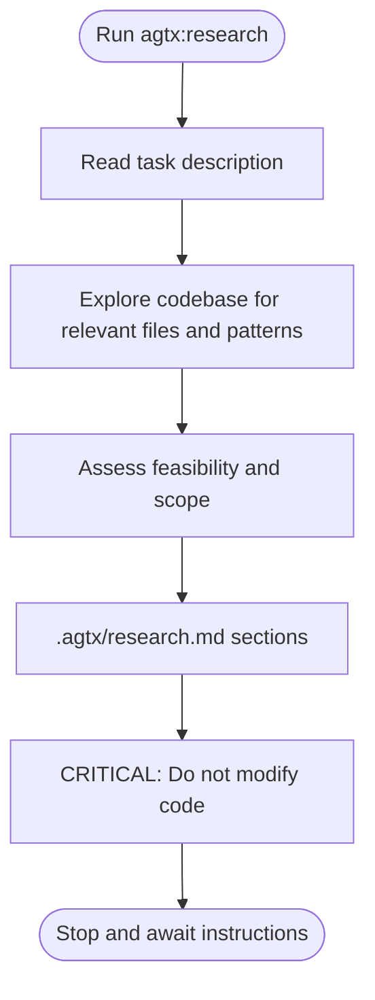
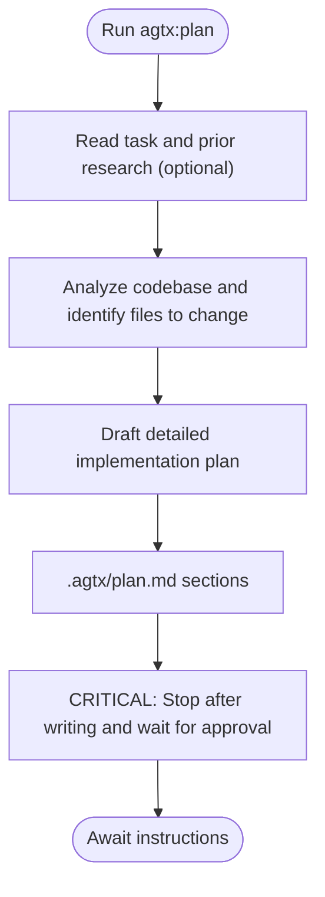
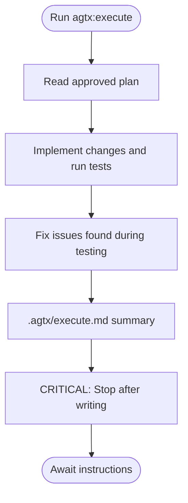
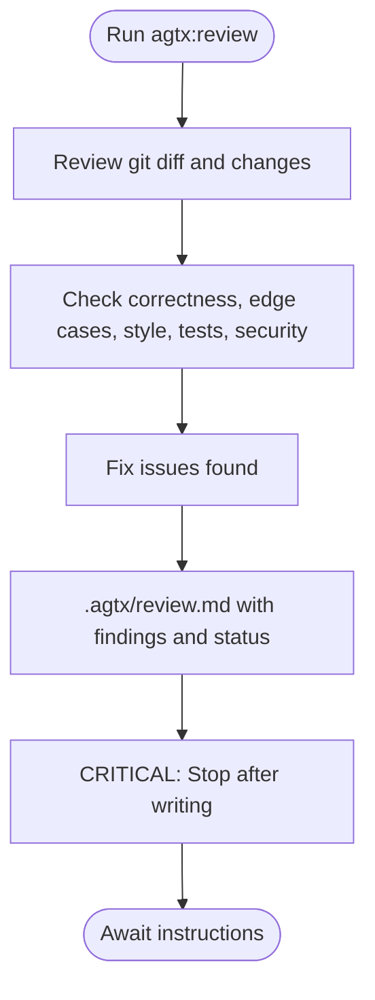
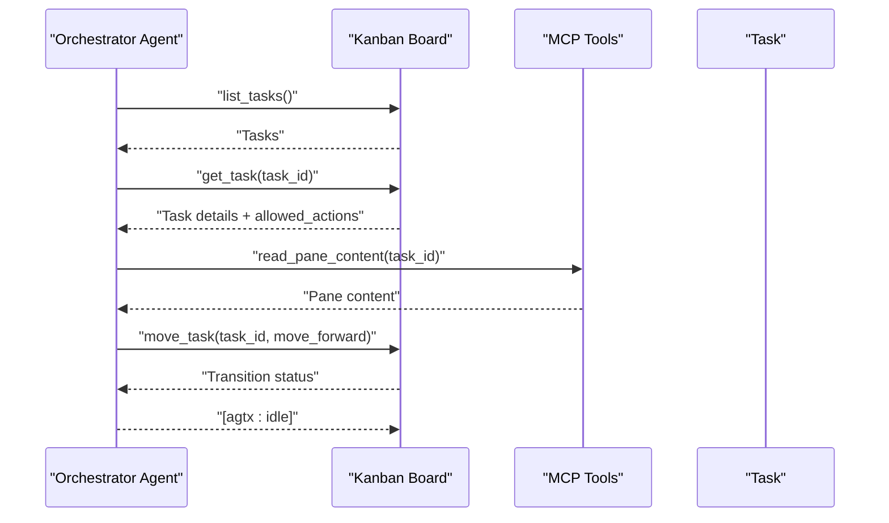
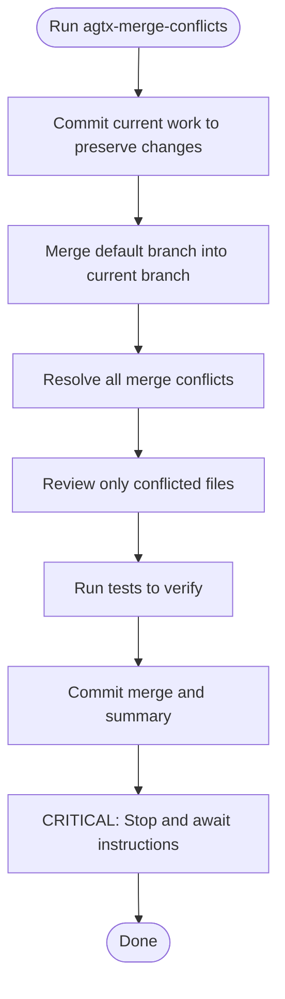
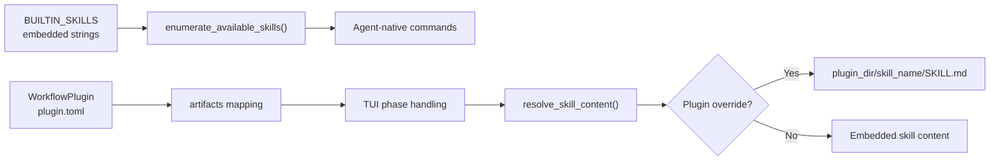

# Built-in Skills

<cite>
**Referenced Files in This Document**
- [src/skills.rs](file://src/skills.rs)
- [plugins/agtx/plugin.toml](file://plugins/agtx/plugin.toml)
- [plugins/agent-skills/plugin.toml](file://plugins/agent-skills/plugin.toml)
- [plugins/agtx/skills/research.md](file://plugins/agtx/skills/research.md)
- [plugins/agtx/skills/plan.md](file://plugins/agtx/skills/plan.md)
- [plugins/agtx/skills/execute.md](file://plugins/agtx/skills/execute.md)
- [plugins/agtx/skills/review.md](file://plugins/agtx/skills/review.md)
- [plugins/agtx/skills/orchestrate.md](file://plugins/agtx/skills/orchestrate.md)
- [plugins/agtx/skills/merge-conflicts.md](file://plugins/agtx/skills/merge-conflicts.md)
- [plugins/agtx-terse/plugin.toml](file://plugins/agtx-terse/plugin.toml)
- [plugins/agtx-terse/skills/agtx-research/SKILL.md](file://plugins/agtx-terse/skills/agtx-research/SKILL.md)
- [plugins/agtx-terse/skills/agtx-plan/SKILL.md](file://plugins/agtx-terse/skills/agtx-plan/SKILL.md)
- [plugins/agtx-terse/skills/agtx-execute/SKILL.md](file://plugins/agtx-terse/skills/agtx-execute/SKILL.md)
- [plugins/agtx-terse/skills/agtx-review/SKILL.md](file://plugins/agtx-terse/skills/agtx-review/SKILL.md)
- [src/tui/app.rs](file://src/tui/app.rs)
- [src/tui/app_tests.rs](file://src/tui/app_tests.rs)
</cite>

## Table of Contents
1. [Introduction](#introduction)
2. [Project Structure](#project-structure)
3. [Core Components](#core-components)
4. [Architecture Overview](#architecture-overview)
5. [Detailed Component Analysis](#detailed-component-analysis)
6. [Dependency Analysis](#dependency-analysis)
7. [Performance Considerations](#performance-considerations)
8. [Troubleshooting Guide](#troubleshooting-guide)
9. [Conclusion](#conclusion)

## Introduction
This document explains the built-in skills system in agtx. It covers the six core skills (Research, Plan, Execute, Review, Orchestrate, Merge Conflicts), the canonical skill naming convention (agtx-skill-name), how skills are embedded at compile-time, and how they integrate with workflow plugins and the TUI. It also provides practical usage scenarios, expected outputs, and guidance for troubleshooting and customization.

## Project Structure
The built-in skills are defined as Markdown files under the agtx plugin directory and embedded at compile-time into the application. The TUI resolves which skill content to use per task, honoring plugin overrides and falling back to built-ins.

**Diagram sources**
- [plugins/agtx/skills/research.md](file://plugins/agtx/skills/research.md)
- [plugins/agtx/skills/plan.md](file://plugins/agtx/skills/plan.md)
- [plugins/agtx/skills/execute.md](file://plugins/agtx/skills/execute.md)
- [plugins/agtx/skills/review.md](file://plugins/agtx/skills/review.md)
- [plugins/agtx/skills/orchestrate.md](file://plugins/agtx/skills/orchestrate.md)
- [plugins/agtx/skills/merge-conflicts.md](file://plugins/agtx/skills/merge-conflicts.md)
- [src/skills.rs](file://src/skills.rs)
- [src/tui/app.rs](file://src/tui/app.rs)

**Section sources**
- [src/skills.rs:1-409](file://src/skills.rs#L1-L409)
- [plugins/agtx/plugin.toml:1-16](file://plugins/agtx/plugin.toml#L1-L16)

## Core Components
- Canonical skill naming: agtx-skill-name (for example, agtx-research, agtx-plan, agtx-execute, agtx-review, agtx-orchestrate, agtx-merge-conflicts).
- Compile-time embedding: Each skill’s Markdown content is embedded via include_str!() and indexed in BUILTIN_SKILLS.
- Command mapping: The first hyphen is replaced with a colon to produce the canonical command form (for example, agtx-plan becomes /agtx:plan).
- Agent-native invocation: The system transforms canonical commands to agent-specific formats (for example, Claude/Gemini keep the colon; OpenCode replaces it; Codex prefixes with $).
- Frontmatter: Each skill file starts with YAML frontmatter containing name and description, followed by a markdown body.

Typical outputs:
- Research writes findings to .agtx/research.md.
- Plan writes a plan to .agtx/plan.md.
- Execute writes a summary to .agtx/execute.md.
- Review writes a review to .agtx/review.md.
- Orchestrate coordinates task transitions and interacts with MCP tools.
- Merge Conflicts resolves merge conflicts and commits the result.

**Section sources**
- [src/skills.rs:1-21](file://src/skills.rs#L1-L21)
- [src/skills.rs:47-55](file://src/skills.rs#L47-L55)
- [src/skills.rs:83-115](file://src/skills.rs#L83-L115)
- [plugins/agtx/plugin.toml:5-16](file://plugins/agtx/plugin.toml#L5-L16)
- [plugins/agtx/skills/research.md:1-45](file://plugins/agtx/skills/research.md#L1-L45)
- [plugins/agtx/skills/plan.md:1-43](file://plugins/agtx/skills/plan.md#L1-L43)
- [plugins/agtx/skills/execute.md:1-39](file://plugins/agtx/skills/execute.md#L1-L39)
- [plugins/agtx/skills/review.md:1-36](file://plugins/agtx/skills/review.md#L1-L36)
- [plugins/agtx/skills/orchestrate.md:1-200](file://plugins/agtx/skills/orchestrate.md#L1-L200)
- [plugins/agtx/skills/merge-conflicts.md:1-53](file://plugins/agtx/skills/merge-conflicts.md#L1-L53)

## Architecture Overview
The built-in skills are part of the agtx workflow plugin. The TUI determines phase readiness, copies artifacts back to the project, and resolves which skill content to use per task. Plugins can override skill content by placing SKILL.md files under the plugin’s skill directory.

**Diagram sources**
- [src/tui/app.rs:9029-9047](file://src/tui/app.rs#L9029-L9047)
- [src/skills.rs:12-21](file://src/skills.rs#L12-L21)
- [plugins/agtx/plugin.toml:1-16](file://plugins/agtx/plugin.toml#L1-L16)

## Detailed Component Analysis

### Research
- Purpose: Explore the codebase to understand a task before planning. It is read-only and must not modify files.
- Inputs: Task description; optional prior research artifact.
- Outputs: .agtx/research.md with sections for relevant files, architecture, complexity, and open questions.
- Typical usage: Start a task by running the research command; write findings; then proceed to planning.

**Diagram sources**
- [plugins/agtx/skills/research.md:1-45](file://plugins/agtx/skills/research.md#L1-L45)

**Section sources**
- [plugins/agtx/skills/research.md:1-45](file://plugins/agtx/skills/research.md#L1-L45)
- [plugins/agtx/plugin.toml:6](file://plugins/agtx/plugin.toml#L6)

### Plan
- Purpose: Analyze the codebase, create a detailed plan, and write it to .agtx/plan.md. Stop after writing and wait for approval.
- Inputs: Task description and optional prior research artifact.
- Outputs: .agtx/plan.md with analysis, plan, and risks.
- Typical usage: After research, run the plan command; review and approve the plan; then proceed to execution.

**Diagram sources**
- [plugins/agtx/skills/plan.md:1-43](file://plugins/agtx/skills/plan.md#L1-L43)

**Section sources**
- [plugins/agtx/skills/plan.md:1-43](file://plugins/agtx/skills/plan.md#L1-L43)
- [plugins/agtx/plugin.toml:7](file://plugins/agtx/plugin.toml#L7)

### Execute
- Purpose: Execute an approved implementation plan. Implement changes, run tests, and write a summary to .agtx/execute.md.
- Inputs: Task description and approved plan (.agtx/plan.md).
- Outputs: .agtx/execute.md with changes and testing results.
- Typical usage: After plan approval, run the execute command; implement changes; write summary; then proceed to review.

**Diagram sources**
- [plugins/agtx/skills/execute.md:1-39](file://plugins/agtx/skills/execute.md#L1-L39)

**Section sources**
- [plugins/agtx/skills/execute.md:1-39](file://plugins/agtx/skills/execute.md#L1-L39)
- [plugins/agtx/plugin.toml:8](file://plugins/agtx/plugin.toml#L8)

### Review
- Purpose: Self-review completed work for correctness, edge cases, code quality, and security. Write review to .agtx/review.md.
- Inputs: Git diff and changes from execution.
- Outputs: .agtx/review.md with review findings and status (READY or NEEDS_WORK).
- Typical usage: After execution, run the review command; fix issues; mark status; then hand off to merging.

**Diagram sources**
- [plugins/agtx/skills/review.md:1-36](file://plugins/agtx/skills/review.md#L1-L36)

**Section sources**
- [plugins/agtx/skills/review.md:1-36](file://plugins/agtx/skills/review.md#L1-L36)
- [plugins/agtx/plugin.toml:9](file://plugins/agtx/plugin.toml#L9)

### Orchestrate
- Purpose: Coordinate the kanban board by advancing tasks through Planning and Running phases, monitoring completions, and coordinating multiple agents.
- Inputs: MCP tools and task notifications.
- Outputs: Task state transitions and escalation decisions.
- Typical usage: Run the orchestrator agent to move tasks forward, handle stuck agents, and escalate domain questions to the user.

**Diagram sources**
- [plugins/agtx/skills/orchestrate.md:1-200](file://plugins/agtx/skills/orchestrate.md#L1-L200)

**Section sources**
- [plugins/agtx/skills/orchestrate.md:1-200](file://plugins/agtx/skills/orchestrate.md#L1-L200)

### Merge Conflicts
- Purpose: Resolve merge conflicts by merging the default branch into the current feature branch and committing the result.
- Inputs: Current worktree state and upstream branch.
- Outputs: Resolved conflicts and a merge commit.
- Typical usage: When a feature branch has conflicts, run the merge-conflicts skill to resolve and commit.

**Diagram sources**
- [plugins/agtx/skills/merge-conflicts.md:1-53](file://plugins/agtx/skills/merge-conflicts.md#L1-L53)

**Section sources**
- [plugins/agtx/skills/merge-conflicts.md:1-53](file://plugins/agtx/skills/merge-conflicts.md#L1-L53)

## Dependency Analysis
- Compile-time embedding: src/skills.rs embeds six SKILL.md files and exposes BUILTIN_SKILLS for enumeration and agent-native discovery.
- Runtime resolution: The TUI’s resolve_skill_content() checks for plugin overrides first; otherwise uses embedded defaults.
- Workflow plugin mapping: plugins/agtx/plugin.toml maps commands to canonical forms and artifacts to file paths for each phase.
- Phase variants: The TUI determines phase variants based on prior-phase artifacts (for example, planning_with_research).

**Diagram sources**
- [src/skills.rs:12-21](file://src/skills.rs#L12-L21)
- [src/skills.rs:211-226](file://src/skills.rs#L211-L226)
- [plugins/agtx/plugin.toml:1-16](file://plugins/agtx/plugin.toml#L1-L16)
- [src/tui/app.rs:9029-9047](file://src/tui/app.rs#L9029-L9047)

**Section sources**
- [src/skills.rs:12-226](file://src/skills.rs#L12-L226)
- [plugins/agtx/plugin.toml:1-16](file://plugins/agtx/plugin.toml#L1-L16)
- [src/tui/app.rs:9029-9047](file://src/tui/app.rs#L9029-L9047)
- [src/tui/app.rs:8311-8350](file://src/tui/app.rs#L8311-L8350)

## Performance Considerations
- Compile-time embedding avoids runtime IO for built-in skills, reducing startup overhead and ensuring deterministic behavior.
- Agent-native discovery scans filesystem only for agent-specific skills, not for built-ins.
- Using terse variants (agtx-terse) reduces token usage while maintaining the same workflow phases.

[No sources needed since this section provides general guidance]

## Troubleshooting Guide
Common issues and resolutions:
- Skill not found or not loading:
  - Verify the skill name follows the canonical convention (agtx-skill-name).
  - Confirm the skill exists in BUILTIN_SKILLS or under the plugin’s skill directory.
  - Check that plugin overrides are valid TOML and that SKILL.md exists at plugin_dir/skill_name/SKILL.md.
- Incorrect command invocation:
  - Use the canonical command format (/namespace:name) or let the system transform it for your agent.
  - For agent-specific formats, ensure the agent name is supported by transform_plugin_command().
- Phase readiness errors:
  - The TUI may block transitions if required prior-phase artifacts are missing. Ensure previous phase artifacts exist (for example, .agtx/research.md for planning).
- Artifact not appearing:
  - Confirm the plugin’s artifacts mapping matches the expected file paths and that copy-back is configured for the phase.

**Section sources**
- [src/skills.rs:211-226](file://src/skills.rs#L211-L226)
- [src/skills.rs:83-115](file://src/skills.rs#L83-L115)
- [plugins/agtx/plugin.toml:5-16](file://plugins/agtx/plugin.toml#L5-L16)
- [src/tui/app.rs:9029-9047](file://src/tui/app.rs#L9029-L9047)
- [src/tui/app.rs:8311-8350](file://src/tui/app.rs#L8311-L8350)

## Conclusion
The built-in skills system in agtx provides a standardized, embeddable workflow across six phases: Research, Plan, Execute, Review, Orchestrate, and Merge Conflicts. Skills follow the Agent Skills spec with YAML frontmatter and markdown bodies, are embedded at compile-time, and can be overridden by workflow plugins. The TUI integrates these skills with phase-aware artifact management and agent-specific command transformations, enabling predictable, extensible development workflows.