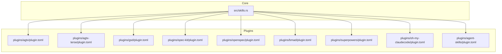
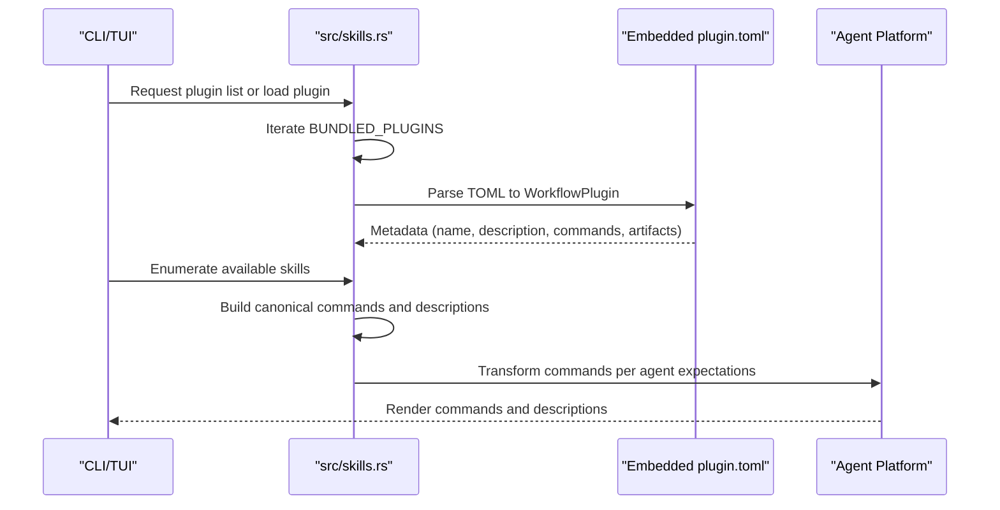
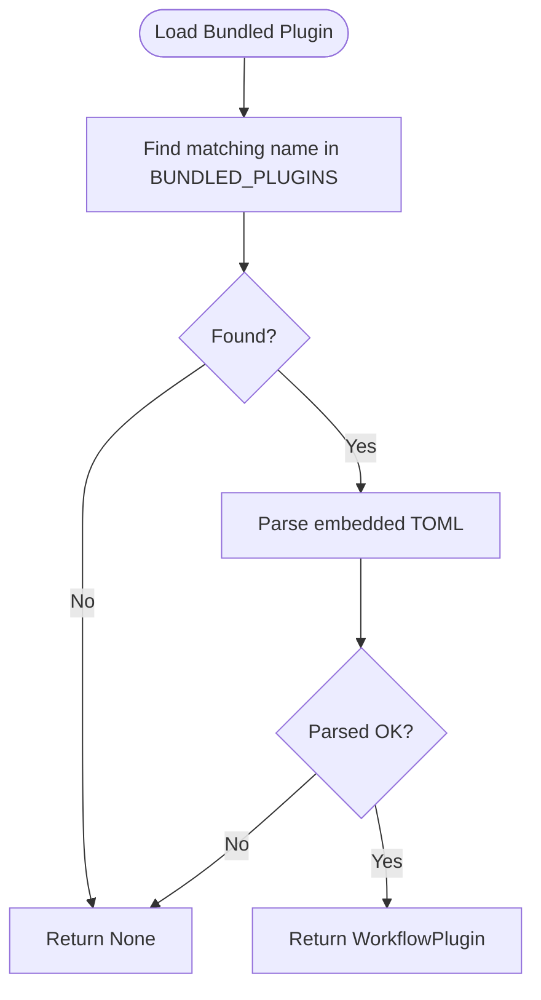
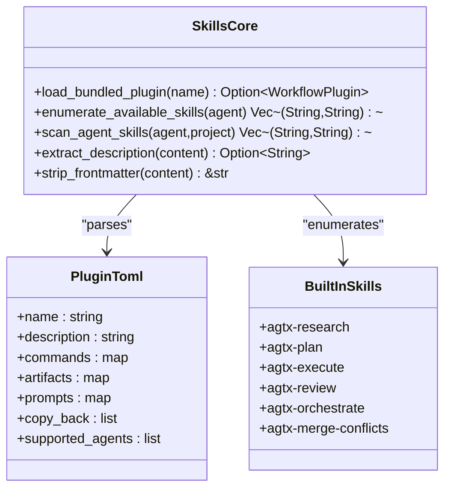
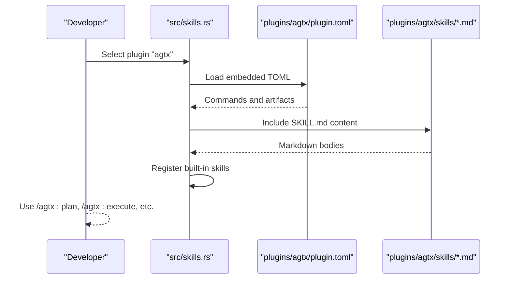
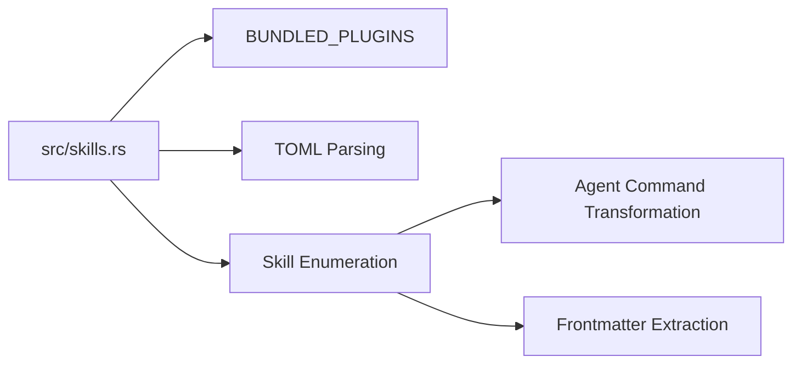

# Plugin-Based Skills

<cite>
**Referenced Files in This Document**
- [src/skills.rs](file://src/skills.rs)
- [plugins/agtx/plugin.toml](file://plugins/agtx/plugin.toml)
- [plugins/agtx-terse/plugin.toml](file://plugins/agtx-terse/plugin.toml)
- [plugins/gsd/plugin.toml](file://plugins/gsd/plugin.toml)
- [plugins/spec-kit/plugin.toml](file://plugins/spec-kit/plugin.toml)
- [plugins/openspec/plugin.toml](file://plugins/openspec/plugin.toml)
- [plugins/bmad/plugin.toml](file://plugins/bmad/plugin.toml)
- [plugins/superpowers/plugin.toml](file://plugins/superpowers/plugin.toml)
- [plugins/oh-my-claudecode/plugin.toml](file://plugins/oh-my-claudecode/plugin.toml)
- [plugins/agent-skills/plugin.toml](file://plugins/agent-skills/plugin.toml)
- [plugins/agtx/skills/research.md](file://plugins/agtx/skills/research.md)
- [plugins/agtx/skills/plan.md](file://plugins/agtx/skills/plan.md)
- [plugins/agtx/skills/execute.md](file://plugins/agtx/skills/execute.md)
- [plugins/agtx/skills/review.md](file://plugins/agtx/skills/review.md)
</cite>

## Table of Contents
1. [Introduction](#introduction)
2. [Project Structure](#project-structure)
3. [Core Components](#core-components)
4. [Architecture Overview](#architecture-overview)
5. [Detailed Component Analysis](#detailed-component-analysis)
6. [Dependency Analysis](#dependency-analysis)
7. [Performance Considerations](#performance-considerations)
8. [Troubleshooting Guide](#troubleshooting-guide)
9. [Conclusion](#conclusion)
10. [Appendices](#appendices)

## Introduction
This document explains the plugin-based skill system that powers workflow plugins in the project. It covers how bundled plugins are embedded at compile time, how plugin metadata and TOML configurations are loaded, and how plugins define custom skills that integrate with the core skills system. It also describes the relationship between plugins and workflow methodologies, showcasing how different plugins provide specialized skill sets for varied development approaches. Guidance is included for plugin development, customization, and troubleshooting.

## Project Structure
The plugin system centers around:
- A core module that embeds plugin configurations and exposes helpers for loading and enumerating skills.
- A set of bundled plugins under plugins/, each with a plugin.toml and optional skills/ or SKILL.md assets.
- Built-in skills that ship with the core for the agtx workflow.

**Diagram sources**
- [src/skills.rs](file://src/skills.rs)
- [plugins/agtx/plugin.toml](file://plugins/agtx/plugin.toml)
- [plugins/agtx-terse/plugin.toml](file://plugins/agtx-terse/plugin.toml)
- [plugins/gsd/plugin.toml](file://plugins/gsd/plugin.toml)
- [plugins/spec-kit/plugin.toml](file://plugins/spec-kit/plugin.toml)
- [plugins/openspec/plugin.toml](file://plugins/openspec/plugin.toml)
- [plugins/bmad/plugin.toml](file://plugins/bmad/plugin.toml)
- [plugins/superpowers/plugin.toml](file://plugins/superpowers/plugin.toml)
- [plugins/oh-my-claudecode/plugin.toml](file://plugins/oh-my-claudecode/plugin.toml)
- [plugins/agent-skills/plugin.toml](file://plugins/agent-skills/plugin.toml)

**Section sources**
- [src/skills.rs](file://src/skills.rs)

## Core Components
- Embedded plugin registry: The core module defines a compile-time embedded array of bundled plugins, each containing a name, description, and embedded plugin.toml content. This enables installation and enumeration without external files.
- Plugin loader: A function parses the embedded TOML into a WorkflowPlugin-compatible structure for runtime use.
- Built-in skills: The core includes default skills for the agtx workflow, embedded at compile time and registered with the system.
- Agent-native skill discovery: Helpers convert canonical skill names to agent-specific invocation formats and enumerate agent-native skills from disk when present.

Key responsibilities:
- Provide a unified interface to load and use bundled plugins.
- Expose built-in skills and agent-native skills for selection and invocation.
- Normalize plugin commands across agents and handle frontmatter extraction for descriptions.

**Section sources**
- [src/skills.rs](file://src/skills.rs)

## Architecture Overview
The plugin system architecture integrates three layers:
- Plugin metadata layer: Compile-time embedded TOML configurations describe plugin identity, supported agents, artifact paths, commands, prompts, and copy-back behavior.
- Skills integration layer: Plugins either supply SKILL.md content directly or rely on built-in skills. The core aggregates these into a unified skill catalog.
- Invocation layer: Canonical commands are transformed per agent to match each platform’s expected syntax.

**Diagram sources**
- [src/skills.rs](file://src/skills.rs)
- [plugins/agtx/plugin.toml](file://plugins/agtx/plugin.toml)
- [plugins/gsd/plugin.toml](file://plugins/gsd/plugin.toml)
- [plugins/spec-kit/plugin.toml](file://plugins/spec-kit/plugin.toml)
- [plugins/openspec/plugin.toml](file://plugins/openspec/plugin.toml)
- [plugins/bmad/plugin.toml](file://plugins/bmad/plugin.toml)
- [plugins/superpowers/plugin.toml](file://plugins/superpowers/plugin.toml)
- [plugins/oh-my-claudecode/plugin.toml](file://plugins/oh-my-claudecode/plugin.toml)
- [plugins/agent-skills/plugin.toml](file://plugins/agent-skills/plugin.toml)

## Detailed Component Analysis

### Plugin Loading Mechanism
- Compile-time embedding: The core module embeds each plugin’s plugin.toml content as a static string, enabling zero-dependency installation and enumeration.
- Registry: A constant array stores (name, description, embedded TOML) tuples for all bundled plugins.
- Loader: A dedicated function finds a plugin by name and deserializes its embedded TOML into a runtime structure suitable for the rest of the system.

**Diagram sources**
- [src/skills.rs](file://src/skills.rs)

**Section sources**
- [src/skills.rs](file://src/skills.rs)

### Plugin Structure and Metadata
Each plugin is defined by a plugin.toml that includes:
- Identity: name and description.
- Lifecycle: commands for each phase (research, planning, running, review).
- Artifacts: file patterns indicating phase completion.
- Optional: initialization scripts, supported agents, copy-back behavior, and prompt triggers.

Examples:
- agtx and agtx-terse: Define commands for research, planning, running, and review and reuse core artifacts under .agtx/.
- gsd: Adds a pre-research phase and uses a structured directory layout with glob patterns for artifacts.
- spec-kit: Copies a directory tree and defines commands for specification and planning.
- openspec: Defines proposal and apply phases with copy-back behavior.
- bmad: Uses an init script and structured directories for planning and implementation artifacts.
- superpowers: Provides prompts tailored to its workflow and copies back generated plans.
- oh-my-claudecode: Multi-agent orchestration with specialized commands and deep integration via .omc artifacts.
- agent-skills: Commands for spec, plan, build, and review with agent-aware initialization.

**Section sources**
- [plugins/agtx/plugin.toml](file://plugins/agtx/plugin.toml)
- [plugins/agtx-terse/plugin.toml](file://plugins/agtx-terse/plugin.toml)
- [plugins/gsd/plugin.toml](file://plugins/gsd/plugin.toml)
- [plugins/spec-kit/plugin.toml](file://plugins/spec-kit/plugin.toml)
- [plugins/openspec/plugin.toml](file://plugins/openspec/plugin.toml)
- [plugins/bmad/plugin.toml](file://plugins/bmad/plugin.toml)
- [plugins/superpowers/plugin.toml](file://plugins/superpowers/plugin.toml)
- [plugins/oh-my-claudecode/plugin.toml](file://plugins/oh-my-claudecode/plugin.toml)
- [plugins/agent-skills/plugin.toml](file://plugins/agent-skills/plugin.toml)

### Skills Integration and Built-ins
- Built-in skills: The core includes default SKILL.md content for agtx phases, embedded at compile time and registered as built-in skills.
- Skill discovery: The system enumerates built-in skills and agent-native skills, converting canonical names to agent-specific invocations.
- Frontmatter extraction: Descriptions are extracted from SKILL.md YAML frontmatter when available; otherwise, fallback names are derived from directory names.

**Diagram sources**
- [src/skills.rs](file://src/skills.rs)

**Section sources**
- [src/skills.rs](file://src/skills.rs)

### How Plugins Define Custom Skills
- agtx plugin: Supplies SKILL.md files for research, plan, execute, and review under plugins/agtx/skills/. These are embedded at compile time and exposed as built-in skills.
- agtx-terse plugin: Mirrors the agtx workflow with a focus on token efficiency; skills are similarly embedded.
- Other plugins: While not supplying SKILL.md content directly, they integrate by defining commands and prompts in plugin.toml and optionally copying artifacts or directories to guide the workflow.

**Diagram sources**
- [src/skills.rs](file://src/skills.rs)
- [plugins/agtx/plugin.toml](file://plugins/agtx/plugin.toml)
- [plugins/agtx/skills/research.md](file://plugins/agtx/skills/research.md)
- [plugins/agtx/skills/plan.md](file://plugins/agtx/skills/plan.md)
- [plugins/agtx/skills/execute.md](file://plugins/agtx/skills/execute.md)
- [plugins/agtx/skills/review.md](file://plugins/agtx/skills/review.md)

**Section sources**
- [src/skills.rs](file://src/skills.rs)
- [plugins/agtx/plugin.toml](file://plugins/agtx/plugin.toml)
- [plugins/agtx/skills/research.md](file://plugins/agtx/skills/research.md)
- [plugins/agtx/skills/plan.md](file://plugins/agtx/skills/plan.md)
- [plugins/agtx/skills/execute.md](file://plugins/agtx/skills/execute.md)
- [plugins/agtx/skills/review.md](file://plugins/agtx/skills/review.md)

### Relationship Between Plugins and Workflow Methodologies
- agtx/agtx-terse: Linear spec-to-ship workflow with research, planning, execution, and review phases.
- gsd: Structured, cyclic methodology with pre-research and phase-specific artifacts.
- spec-kit: Specification-first approach with commands for specifying, planning, implementing, and analyzing.
- openspec: Lightweight proposal-driven workflow with change proposals and application steps.
- bmad: Agile methodology with PRD creation, story development, and code review.
- superpowers: Brainstorming, plan generation, TDD, and subagent-driven development.
- oh-my-claudecode: Multi-agent orchestration with deep interviewing, iterative planning, and autopilot execution.
- agent-skills: Full lifecycle skills mapped to spec, plan, build, and review.

These plugins demonstrate how different methodologies map to distinct command sets, artifact expectations, and prompt strategies while sharing a common integration model.

**Section sources**
- [plugins/agtx/plugin.toml](file://plugins/agtx/plugin.toml)
- [plugins/agtx-terse/plugin.toml](file://plugins/agtx-terse/plugin.toml)
- [plugins/gsd/plugin.toml](file://plugins/gsd/plugin.toml)
- [plugins/spec-kit/plugin.toml](file://plugins/spec-kit/plugin.toml)
- [plugins/openspec/plugin.toml](file://plugins/openspec/plugin.toml)
- [plugins/bmad/plugin.toml](file://plugins/bmad/plugin.toml)
- [plugins/superpowers/plugin.toml](file://plugins/superpowers/plugin.toml)
- [plugins/oh-my-claudecode/plugin.toml](file://plugins/oh-my-claudecode/plugin.toml)
- [plugins/agent-skills/plugin.toml](file://plugins/agent-skills/plugin.toml)

### Examples of Plugin Configuration and Skill Definitions
- agtx plugin: Defines commands for research, planning, running, and review and points to core artifact locations.
- agtx-terse plugin: Mirrors agtx with similar commands and artifact paths.
- gsd plugin: Adds a pre-research phase, uses glob patterns for artifacts, and includes prompt triggers.
- spec-kit plugin: Copies a directory tree and defines commands for specification and planning.
- openspec plugin: Defines proposal and apply commands with copy-back behavior.
- bmad plugin: Uses an init script and structured directories for planning and implementation artifacts.
- superpowers plugin: Provides prompts tailored to its workflow and copies back generated plans.
- oh-my-claudecode plugin: Multi-agent orchestration with specialized commands and deep integration via .omc artifacts.
- agent-skills plugin: Commands for spec, plan, build, and review with agent-aware initialization.

**Section sources**
- [plugins/agtx/plugin.toml](file://plugins/agtx/plugin.toml)
- [plugins/agtx-terse/plugin.toml](file://plugins/agtx-terse/plugin.toml)
- [plugins/gsd/plugin.toml](file://plugins/gsd/plugin.toml)
- [plugins/spec-kit/plugin.toml](file://plugins/spec-kit/plugin.toml)
- [plugins/openspec/plugin.toml](file://plugins/openspec/plugin.toml)
- [plugins/bmad/plugin.toml](file://plugins/bmad/plugin.toml)
- [plugins/superpowers/plugin.toml](file://plugins/superpowers/plugin.toml)
- [plugins/oh-my-claudecode/plugin.toml](file://plugins/oh-my-claudecode/plugin.toml)
- [plugins/agent-skills/plugin.toml](file://plugins/agent-skills/plugin.toml)

## Dependency Analysis
The core module orchestrates plugin loading and skill enumeration:
- Dependencies: The loader depends on the embedded BUNDLED_PLUGINS array and TOML parsing.
- Coupling: Plugin metadata is decoupled from skill content; skills can be either built-in or agent-native.
- Cohesion: Skill discovery and command transformation are cohesive within the core module.

**Diagram sources**
- [src/skills.rs](file://src/skills.rs)

**Section sources**
- [src/skills.rs](file://src/skills.rs)

## Performance Considerations
- Compile-time embedding eliminates runtime file I/O for plugin metadata and built-in skills, reducing startup overhead.
- Command transformation and frontmatter parsing are lightweight and performed on demand.
- For large projects, scanning agent-native skills is bounded by filesystem traversal and is only used when agent-native skills are present.

## Troubleshooting Guide
Common issues and resolutions:
- Plugin not found: Ensure the plugin name matches an entry in the embedded registry. Verify the plugin name casing and spelling.
- TOML parse errors: Validate plugin.toml syntax and required keys. Confirm that arrays and maps are properly formatted.
- Missing agent-native skills: Confirm the agent’s native directory exists and contains the expected files (.md or .toml). Check agent support lists if applicable.
- Incorrect command invocation: Use the canonical command format and rely on the core’s transformation to agent-specific syntax. For unsupported agents, expect fallback behavior.
- Frontmatter issues: Ensure SKILL.md contains a valid YAML frontmatter block with description and name fields for accurate descriptions.

**Section sources**
- [src/skills.rs](file://src/skills.rs)

## Conclusion
The plugin-based skill system provides a flexible, extensible foundation for integrating diverse workflow methodologies. By embedding plugin configurations and skills at compile time, the system ensures fast startup and reliable operation without external dependencies. Plugins define commands, artifacts, and prompts that align with specific development approaches, while the core module unifies discovery, transformation, and invocation across agents.

## Appendices

### Appendix A: Built-in Skills Catalog
- agtx-research: Read-only exploration and findings capture.
- agtx-plan: Detailed implementation plan creation.
- agtx-execute: Approved plan execution and summary capture.
- agtx-review: Self-review and readiness assessment.

**Section sources**
- [src/skills.rs](file://src/skills.rs)
- [plugins/agtx/skills/research.md](file://plugins/agtx/skills/research.md)
- [plugins/agtx/skills/plan.md](file://plugins/agtx/skills/plan.md)
- [plugins/agtx/skills/execute.md](file://plugins/agtx/skills/execute.md)
- [plugins/agtx/skills/review.md](file://plugins/agtx/skills/review.md)