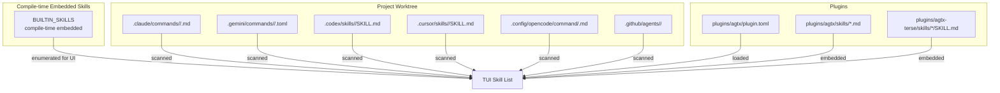
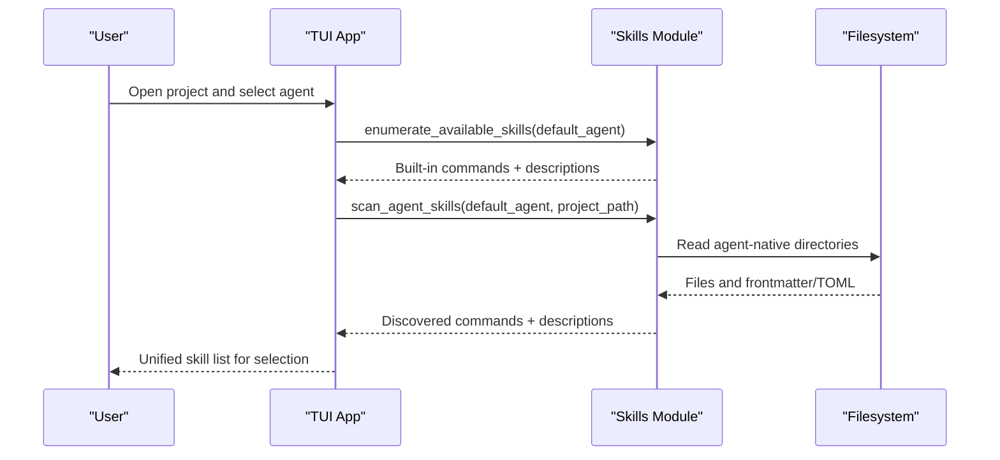
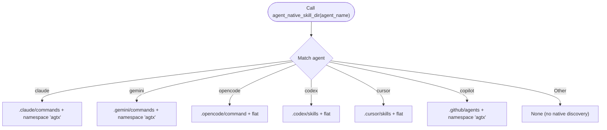
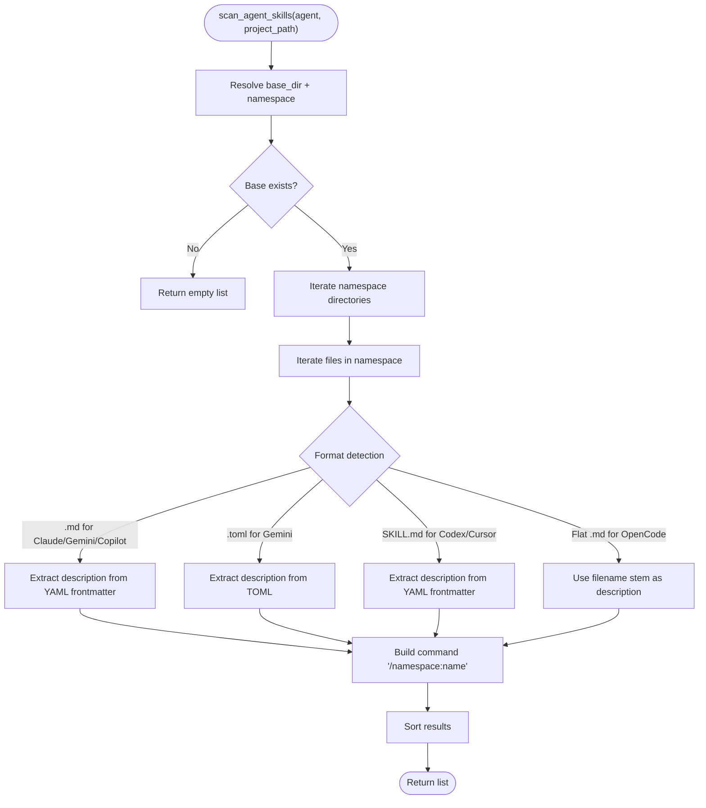
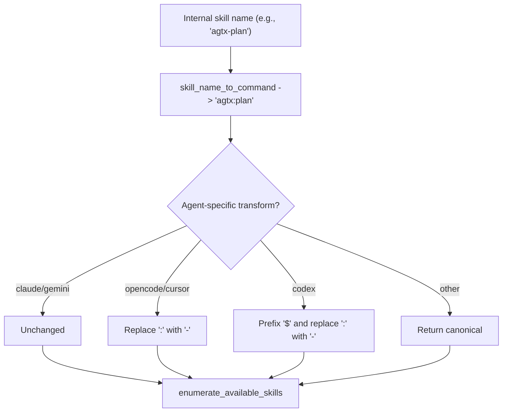
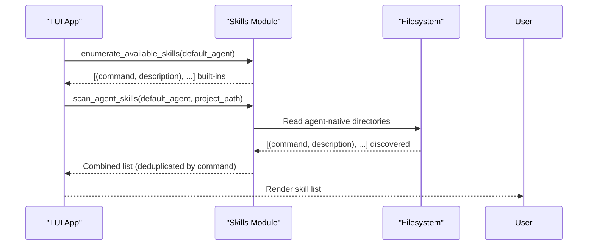
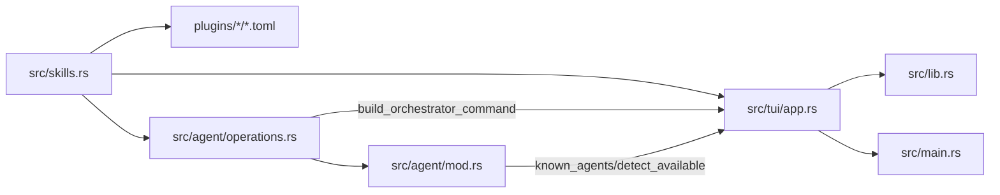

# Skill Deployment and Discovery

<cite>
**Referenced Files in This Document**
- [src/skills.rs](file://src/skills.rs)
- [src/tui/app.rs](file://src/tui/app.rs)
- [src/agent/mod.rs](file://src/agent/mod.rs)
- [src/agent/operations.rs](file://src/agent/operations.rs)
- [src/lib.rs](file://src/lib.rs)
- [src/main.rs](file://src/main.rs)
- [plugins/agtx/plugin.toml](file://plugins/agtx/plugin.toml)
- [plugins/agtx/skills/plan.md](file://plugins/agtx/skills/plan.md)
- [plugins/agtx-terse/skills/agtx-plan/SKILL.md](file://plugins/agtx-terse/skills/agtx-plan/SKILL.md)
- [skills/brainstorm/SKILL.md](file://skills/brainstorm/SKILL.md)
- [.claude/commands/add-plugin.md](file://.claude/commands/add-plugin.md)
- [.codex/hooks.json](file://.codex/hooks.json)
- [.github/workflows/ci.yml](file://.github/workflows/ci.yml)
- [.github/workflows/release.yml](file://.github/workflows/release.yml)
</cite>

## Table of Contents
1. [Introduction](#introduction)
2. [Project Structure](#project-structure)
3. [Core Components](#core-components)
4. [Architecture Overview](#architecture-overview)
5. [Detailed Component Analysis](#detailed-component-analysis)
6. [Dependency Analysis](#dependency-analysis)
7. [Performance Considerations](#performance-considerations)
8. [Troubleshooting Guide](#troubleshooting-guide)
9. [Conclusion](#conclusion)
10. [Appendices](#appendices)

## Introduction
This document explains how skills are deployed and discovered across AI agents and worktrees in the project. It focuses on:
- The agent_native_skill_dir function that defines agent-specific skill directory structures and namespaces
- The skill deployment process that copies skills to agent-specific discovery paths in each worktree
- The skill scanning mechanism that enumerates available skills from agent-native directories
- The skill enumeration process that generates agent-compatible command lists for UI display
- Practical examples, directory structure requirements, and troubleshooting guidance
- The relationship between skill deployment and agent registration

## Project Structure
The repository organizes skills and agent integrations across:
- Built-in skills embedded at compile time
- Project-local agent-native skill directories
- Plugin TOML files that define commands and artifacts
- Example skill files with YAML frontmatter

**Diagram sources**
- [src/skills.rs:14-21](file://src/skills.rs#L14-L21)
- [src/skills.rs:31-45](file://src/skills.rs#L31-L45)
- [src/skills.rs:259-408](file://src/skills.rs#L259-L408)
- [plugins/agtx/plugin.toml:11-16](file://plugins/agtx/plugin.toml#L11-L16)

**Section sources**
- [src/skills.rs:14-21](file://src/skills.rs#L14-L21)
- [src/skills.rs:31-45](file://src/skills.rs#L31-L45)
- [src/skills.rs:259-408](file://src/skills.rs#L259-L408)
- [plugins/agtx/plugin.toml:11-16](file://plugins/agtx/plugin.toml#L11-L16)

## Core Components
- Agent-native skill directory mapping: agent_native_skill_dir defines base directories and namespace subdirectories per agent.
- Skill scanning: scan_agent_skills enumerates skills from agent-native directories, detecting file formats and extracting descriptions from frontmatter or TOML.
- Command transformation: transform_plugin_command adapts canonical commands to agent-specific invocation syntax.
- UI integration: The TUI merges embedded and scanned skills into a single list for display and selection.

**Section sources**
- [src/skills.rs:31-45](file://src/skills.rs#L31-L45)
- [src/skills.rs:259-408](file://src/skills.rs#L259-L408)
- [src/skills.rs:83-115](file://src/skills.rs#L83-L115)
- [src/tui/app.rs:4365-4391](file://src/tui/app.rs#L4365-L4391)

## Architecture Overview
The skill system integrates three sources:
- Compile-time embedded skills (built-in)
- Project-local agent-native directories
- Plugin-provided commands and artifacts

**Diagram sources**
- [src/tui/app.rs:4365-4391](file://src/tui/app.rs#L4365-L4391)
- [src/skills.rs:211-226](file://src/skills.rs#L211-L226)
- [src/skills.rs:259-408](file://src/skills.rs#L259-L408)

## Detailed Component Analysis

### Agent-Native Skill Directory Mapping
The agent_native_skill_dir function returns the base directory and namespace for each agent’s native discovery path. This enables consistent deployment and scanning across agents.

**Diagram sources**
- [src/skills.rs:35-44](file://src/skills.rs#L35-L44)

**Section sources**
- [src/skills.rs:35-44](file://src/skills.rs#L35-L44)

### Skill Scanning Mechanism
The scan_agent_skills function enumerates skills from agent-native directories, handling different file formats and namespaces.

**Diagram sources**
- [src/skills.rs:259-408](file://src/skills.rs#L259-L408)

**Section sources**
- [src/skills.rs:259-408](file://src/skills.rs#L259-L408)

### Command Transformation and Enumeration
- skill_name_to_command converts internal skill names to canonical commands by replacing the first hyphen with a colon.
- transform_plugin_command adapts canonical commands to agent-specific syntax (e.g., colon-to-hyphen for OpenCode/Cursor, slash-to-dollar for Codex).
- enumerate_available_skills builds agent-compatible command lists from embedded skills.

**Diagram sources**
- [src/skills.rs:49-55](file://src/skills.rs#L49-L55)
- [src/skills.rs:93-115](file://src/skills.rs#L93-L115)
- [src/skills.rs:213-226](file://src/skills.rs#L213-L226)

**Section sources**
- [src/skills.rs:49-55](file://src/skills.rs#L49-L55)
- [src/skills.rs:93-115](file://src/skills.rs#L93-L115)
- [src/skills.rs:213-226](file://src/skills.rs#L213-L226)

### UI Integration and Skill Enumeration
The TUI merges:
- Built-in skills (always available)
- Project-local agent-native skills (filesystem-scanned)

**Diagram sources**
- [src/tui/app.rs:4365-4391](file://src/tui/app.rs#L4365-L4391)
- [src/skills.rs:211-226](file://src/skills.rs#L211-L226)
- [src/skills.rs:259-408](file://src/skills.rs#L259-L408)

**Section sources**
- [src/tui/app.rs:4365-4391](file://src/tui/app.rs#L4365-L4391)
- [src/skills.rs:211-226](file://src/skills.rs#L211-L226)
- [src/skills.rs:259-408](file://src/skills.rs#L259-L408)

### Practical Examples and Directory Structure Requirements
- Claude/Gemini: Place skills under .claude/commands/<namespace>/<skill>.md or .toml. Namespace is derived from the directory name; filenames become command names.
- Codex/Cursor: Place skills under .codex/skills/<skill>/SKILL.md or .cursor/skills/<skill>/SKILL.md. Commands are prefixed with $ for Codex and / for Cursor.
- OpenCode: Place skills under .config/opencode/command/<skill>.md. Commands are /<skill>.
- Copilot: Place skills under .github/agents/<namespace>/<skill>. Commands follow the agent-native format.

Example file locations:
- [plugins/agtx/skills/plan.md](file://plugins/agtx/skills/plan.md)
- [plugins/agtx-terse/skills/agtx-plan/SKILL.md](file://plugins/agtx-terse/skills/agtx-plan/SKILL.md)
- [skills/brainstorm/SKILL.md](file://skills/brainstorm/SKILL.md)
- [.claude/commands/add-plugin.md](file://.claude/commands/add-plugin.md)
- [.codex/hooks.json](file://.codex/hooks.json)

**Section sources**
- [src/skills.rs:259-408](file://src/skills.rs#L259-L408)
- [plugins/agtx/skills/plan.md:1-43](file://plugins/agtx/skills/plan.md#L1-L43)
- [plugins/agtx-terse/skills/agtx-plan/SKILL.md:1-48](file://plugins/agtx-terse/skills/agtx-plan/SKILL.md#L1-L48)
- [skills/brainstorm/SKILL.md:1-51](file://skills/brainstorm/SKILL.md#L1-L51)
- [.claude/commands/add-plugin.md](file://.claude/commands/add-plugin.md)
- [.codex/hooks.json](file://.codex/hooks.json)

## Dependency Analysis
The skill system interacts with agents and the TUI as follows:

**Diagram sources**
- [src/skills.rs:1-409](file://src/skills.rs#L1-L409)
- [src/tui/app.rs:4365-4391](file://src/tui/app.rs#L4365-L4391)
- [src/agent/operations.rs:110-163](file://src/agent/operations.rs#L110-L163)
- [src/agent/mod.rs:80-130](file://src/agent/mod.rs#L80-L130)
- [src/lib.rs:1-24](file://src/lib.rs#L1-L24)
- [src/main.rs:1-228](file://src/main.rs#L1-L228)

**Section sources**
- [src/skills.rs:1-409](file://src/skills.rs#L1-L409)
- [src/tui/app.rs:4365-4391](file://src/tui/app.rs#L4365-L4391)
- [src/agent/operations.rs:110-163](file://src/agent/operations.rs#L110-L163)
- [src/agent/mod.rs:80-130](file://src/agent/mod.rs#L80-L130)
- [src/lib.rs:1-24](file://src/lib.rs#L1-L24)
- [src/main.rs:1-228](file://src/main.rs#L1-L228)

## Performance Considerations
- Filesystem scanning is linear in the number of files under agent-native directories. Keep agent-native directories sparse and organized by namespace to minimize IO.
- Frontmatter parsing reads a small fixed-size buffer; ensure SKILL.md and TOML files are reasonably sized to avoid unnecessary overhead.
- Deduplication by command ensures the UI list remains concise when merging embedded and discovered skills.

## Troubleshooting Guide
Common issues and resolutions:
- Skills not appearing in the UI
  - Verify agent-native directory structure and file extensions (.md for Claude/Gemini/Copilot, .toml for Gemini, SKILL.md for Codex/Cursor, .md for OpenCode).
  - Confirm YAML frontmatter includes a description field for Markdown files.
  - Ensure the project path passed to scan_agent_skills is correct and readable.
- Incorrect command syntax
  - Confirm transform_plugin_command is applied for the selected agent; OpenCode/Cursor require colon-to-hyphen conversion, Codex requires slash-to-dollar conversion.
- Agent registration and orchestration
  - For agents that support orchestrator mode (e.g., Claude MCP), ensure the orchestrator command is built correctly and that stale registrations are removed before adding new ones.
- Plugin compatibility
  - When loading plugins, verify that the plugin supports the selected agent; otherwise, it will be ignored during task initialization.

**Section sources**
- [src/skills.rs:259-408](file://src/skills.rs#L259-L408)
- [src/skills.rs:93-115](file://src/skills.rs#L93-L115)
- [src/agent/operations.rs:92-107](file://src/agent/operations.rs#L92-L107)
- [src/tui/app.rs:8949-8968](file://src/tui/app.rs#L8949-L8968)

## Conclusion
The skill deployment and discovery system provides a unified, agent-aware mechanism for surfacing skills in the UI. By adhering to agent-native directory conventions and ensuring proper frontmatter/TOML formatting, teams can maintain consistent skill availability across worktrees and agents. The integration with plugins and agent registration further extends the system’s flexibility for diverse workflows.

## Appendices

### Appendix A: Agent-Specific Base Directory Mappings
- Claude: .claude/commands with namespace subdirectories
- Gemini: .gemini/commands with namespace subdirectories (.toml files)
- Codex: .codex/skills with skill subdirectories (SKILL.md)
- Cursor: .cursor/skills with skill subdirectories (SKILL.md)
- OpenCode: .config/opencode/command with flat .md files
- Copilot: .github/agents with namespace subdirectories

**Section sources**
- [src/skills.rs:35-44](file://src/skills.rs#L35-L44)

### Appendix B: Example Plugin Commands and Artifacts
- Plugin commands are defined in plugin.toml and mapped to agent-native invocation formats via transform_plugin_command.
- Artifacts (e.g., research, planning, running, review) are referenced by path for each plugin.

**Section sources**
- [plugins/agtx/plugin.toml:11-16](file://plugins/agtx/plugin.toml#L11-L16)
- [plugins/agtx/plugin.toml:5-9](file://plugins/agtx/plugin.toml#L5-L9)