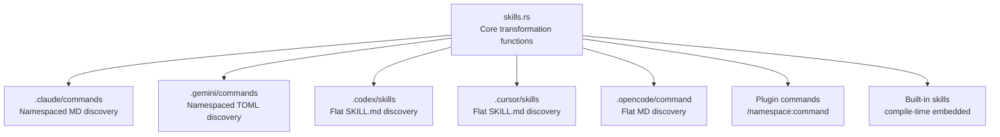
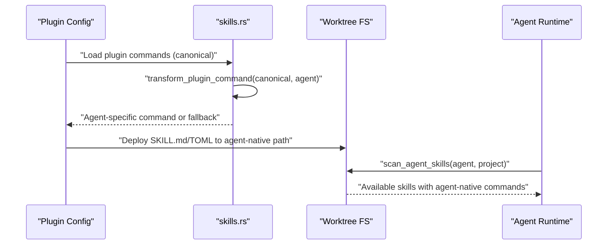
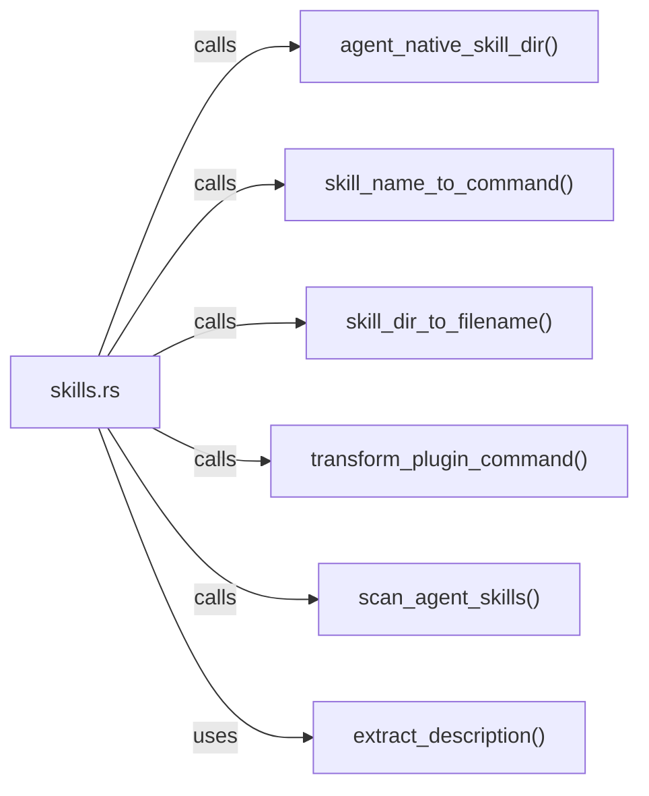

# Skill Transformation System

<cite>
**Referenced Files in This Document**
- [skills.rs](file://src/skills.rs)
- [CLAUDE.md](file://CLAUDE.md)
- [AGENTS.md](file://AGENTS.md)
- [plugin.toml](file://plugins/agtx/plugin.toml)
- [plugin.toml](file://plugins/agent-skills/plugin.toml)
- [SKILL.md](file://skills/sweep/SKILL.md)
- [SKILL.md](file://skills/brainstorm/SKILL.md)
</cite>

## Table of Contents
1. [Introduction](#introduction)
2. [Project Structure](#project-structure)
3. [Core Components](#core-components)
4. [Architecture Overview](#architecture-overview)
5. [Detailed Component Analysis](#detailed-component-analysis)
6. [Dependency Analysis](#dependency-analysis)
7. [Performance Considerations](#performance-considerations)
8. [Troubleshooting Guide](#troubleshooting-guide)
9. [Conclusion](#conclusion)

## Introduction
This document explains the skill transformation system that enables cross-agent compatibility in the project. It covers the canonical skill naming format, agent-specific transformation rules, directory naming conventions, and filename mapping logic. It also documents the functions that convert internal skill names to command format and generate agent-specific filenames, along with practical transformation scenarios, edge cases, fallback mechanisms, and troubleshooting guidance.

## Project Structure
The skill transformation system centers around a small set of functions in the skills module and a few documentation references that define agent-native discovery paths and command formats. The key areas are:
- Canonical skill naming and transformation functions
- Agent-native skill directory mappings
- Filename mapping per agent
- Plugin command transformation for agent invocation
- Native skill discovery for each agent

**Diagram sources**
- [skills.rs](file://src/skills.rs)
- [CLAUDE.md](file://CLAUDE.md)

**Section sources**
- [skills.rs](file://src/skills.rs)
- [CLAUDE.md](file://CLAUDE.md)

## Core Components
This section documents the core transformation functions and their roles in enabling cross-agent compatibility.

- Canonical naming and conversion
  - skill_name_to_command: Converts internal skill directory names (e.g., agtx-plan) into canonical command format (/agtx:plan).
  - skill_dir_to_filename: Maps internal skill directory names to agent-native filenames based on agent type.

- Agent-native discovery and mapping
  - agent_native_skill_dir: Returns the base directory and namespace subdirectory for each agent’s native skill discovery path.
  - scan_agent_skills: Scans agent-native directories and enumerates available skills with agent-native command formats and descriptions.

- Plugin command transformation
  - transform_plugin_command: Transforms canonical plugin commands (/namespace:command) into agent-specific invocation syntax.

- Built-in skills enumeration
  - enumerate_available_skills: Produces a list of built-in skills with agent-native commands and descriptions, falling back to canonical when transformation is unsupported.

**Section sources**
- [skills.rs](file://src/skills.rs)

## Architecture Overview
The transformation system operates in two complementary flows:
- Deployment flow: Internal skill directory names are mapped to agent-native filesystem layouts and filenames.
- Invocation flow: Plugin commands are translated from canonical format to agent-specific invocation syntax.

**Diagram sources**
- [skills.rs](file://src/skills.rs)
- [CLAUDE.md](file://CLAUDE.md)

## Detailed Component Analysis

### Canonical Naming and Transformation Functions
- skill_name_to_command
  - Purpose: Convert internal skill directory names to canonical command format.
  - Behavior: Replaces the first hyphen with a colon. If no hyphen exists, returns the original string.
  - Complexity: O(n) where n is the length of the input string.
  - Edge cases: Empty string, no hyphen, single character segments.

- skill_dir_to_filename
  - Purpose: Map internal skill directory names to agent-native filenames.
  - Behavior:
    - Gemini: Produces .toml files from directory names.
    - OpenCode: Produces flat .md files with the full directory name.
    - Others: Produces .md files with the directory name (prefix stripping handled).
  - Complexity: O(n) for string operations.

- transform_plugin_command
  - Purpose: Translate canonical plugin commands (/namespace:command) into agent-specific invocation syntax.
  - Rules:
    - Claude/Gemini: Unchanged.
    - OpenCode: Colon → hyphen.
    - Codex: Slash → dollar, then colon → hyphen.
    - Cursor: Colon → hyphen (slash retained).
    - Unsupported agents: Returns None (fallback to file-path reference).
  - Complexity: O(n) for string replacements.

- enumerate_available_skills
  - Purpose: Enumerate built-in skills with agent-native commands and descriptions.
  - Behavior: Uses skill_name_to_command to derive canonical command, then applies transform_plugin_command. Falls back to canonical if transformation is unsupported. Extracts descriptions from frontmatter or derives from the skill name.
  - Complexity: O(k) per skill k, plus overhead for frontmatter extraction.

- scan_agent_skills
  - Purpose: Discover agent-native skills from filesystem and return agent-native commands with descriptions.
  - Behavior:
    - Claude/Copilot: Namespaced subdirectories with .md files.
    - Gemini: Namespaced subdirectories with .toml files.
    - Codex/Cursor: Flat subdirectories with SKILL.md.
    - OpenCode: Flat directory with .md files.
  - Complexity: O(d) per discovered directory d, plus I/O overhead.

**Section sources**
- [skills.rs](file://src/skills.rs)

### Agent-Specific Transformation Rules
- Claude/Gemini
  - Discovery: Namespaced subdirectories under agent-native base.
  - Invocation: Canonical format unchanged.
  - Filenames: .md for Claude, .toml for Gemini.

- OpenCode
  - Discovery: Flat directory under .opencode/command.
  - Invocation: Colon → hyphen in canonical command.
  - Filenames: .md with full directory name.

- Codex
  - Discovery: Flat subdirectories under .codex/skills with SKILL.md.
  - Invocation: Slash → dollar, then colon → hyphen.
  - Filenames: SKILL.md per skill directory.

- Cursor
  - Discovery: Flat subdirectories under .cursor/skills with SKILL.md.
  - Invocation: Colon → hyphen (slash retained).
  - Filenames: SKILL.md per skill directory.

- Copilot
  - Discovery: Namespaced subdirectories under .github/agents.
  - Invocation: No interactive skill invocation (prompt-only).

- Unsupported agents
  - Behavior: transform_plugin_command returns None, causing fallback to file-path reference.

**Section sources**
- [skills.rs](file://src/skills.rs)
- [CLAUDE.md](file://CLAUDE.md)

### Skill Directory Naming Conventions and Filename Mapping
- Internal naming
  - Built-in skills use directory names like agtx-plan, agtx-research, etc.
  - Frontmatter in SKILL.md contains a name field (e.g., agtx-plan) used for canonical conversion.

- Agent-native layout
  - Claude/Gemini: Base directory with namespace subdirectory; filenames derived from directory names.
  - Codex/Cursor: Base directory with skill subdirectories containing SKILL.md.
  - OpenCode: Base directory with flat .md files named after the directory.

- Filename mapping logic
  - skill_dir_to_filename selects the appropriate extension and naming scheme per agent.
  - For Gemini, produces .toml; for others, produces .md; for OpenCode, preserves the full directory name.

**Section sources**
- [skills.rs](file://src/skills.rs)
- [CLAUDE.md](file://CLAUDE.md)

### Practical Examples of Transformation Scenarios
- Scenario 1: Built-in skill deployment
  - Internal directory: agtx-plan
  - Canonical command: /agtx:plan
  - Agent-specific filenames:
    - Claude/Gemini: plan.md or plan.toml under .claude/commands/agtx or .gemini/commands/agtx
    - Codex/Cursor: agtx-plan/SKILL.md under .codex/skills or .cursor/skills
    - OpenCode: agtx-plan.md under .opencode/command

- Scenario 2: Plugin command invocation
  - Canonical: /gsd:plan-phase 1
  - Agent-specific:
    - Claude/Gemini: /gsd:plan-phase 1
    - OpenCode: /gsd-plan-phase 1
    - Codex: $gsd-plan-phase 1
    - Cursor: /gsd-plan-phase 1

- Scenario 3: Discovery and enumeration
  - Built-in skills enumeration uses skill_name_to_command to derive canonical commands, then transform_plugin_command to produce agent-native commands. Descriptions are extracted from frontmatter or derived from the skill name.

**Section sources**
- [skills.rs](file://src/skills.rs)
- [plugin.toml](file://plugins/agtx/plugin.toml)
- [plugin.toml](file://plugins/agent-skills/plugin.toml)
- [SKILL.md](file://skills/sweep/SKILL.md)
- [SKILL.md](file://skills/brainstorm/SKILL.md)

### Edge Cases and Fallback Mechanisms
- Missing frontmatter
  - Description extraction falls back to deriving a description from the skill name.
- Unknown agent
  - transform_plugin_command returns None, causing fallback to the canonical command for invocation.
- Non-existent native directories
  - scan_agent_skills gracefully returns an empty list when agent-native directories are not found.
- Flat vs. namespaced layouts
  - Different agents use different filesystem layouts; the system adapts discovery logic accordingly.

**Section sources**
- [skills.rs](file://src/skills.rs)

### Relationship Between Transformation System and Agent-Native Skill Discovery
- Transformation system enables:
  - Consistent internal naming and deployment across agents.
  - Agent-specific invocation syntax for interactive commands.
  - Seamless discovery of skills from agent-native filesystem layouts.
- Agent-native discovery complements transformation by:
  - Providing a way to enumerate skills already present on disk in agent-specific formats.
  - Returning agent-native commands and descriptions for UI and invocation.

**Section sources**
- [skills.rs](file://src/skills.rs)
- [CLAUDE.md](file://CLAUDE.md)

## Dependency Analysis
The transformation system is primarily implemented in a single module with clear boundaries and minimal coupling. It depends on:
- Standard library string manipulation and filesystem APIs.
- Optional frontmatter extraction for descriptions.
- Agent-native directory mappings and discovery logic.

**Diagram sources**
- [skills.rs](file://src/skills.rs)

**Section sources**
- [skills.rs](file://src/skills.rs)

## Performance Considerations
- String operations
  - skill_name_to_command and transform_plugin_command operate in linear time relative to input length.
- Filesystem scanning
  - scan_agent_skills iterates over directories and files; performance scales with the number of discovered skills.
- Frontmatter parsing
  - extract_description performs a small fixed-size read and simple parsing; overhead is minimal.
- Built-in skills enumeration
  - Uses compile-time embedded content, avoiding runtime filesystem access.

[No sources needed since this section provides general guidance]

## Troubleshooting Guide
Common issues and resolutions:
- Agent-specific command not recognized
  - Verify transform_plugin_command supports the agent. If None, the system falls back to the canonical command or file-path reference.
- Skills not appearing in agent-native discovery
  - Confirm the agent-native directory exists and follows the expected layout (.claude/commands, .gemini/commands, .codex/skills, .cursor/skills, .opencode/command).
  - Ensure filenames match expectations (e.g., .md for Claude/Gemini/Cursor/OpenCode, .toml for Gemini).
- Incorrect descriptions in UI
  - Ensure SKILL.md contains proper YAML frontmatter with a description field.
- Copilot interactive invocation not available
  - Copilot has no interactive skill invocation; use prompt-only workflows.

**Section sources**
- [skills.rs](file://src/skills.rs)
- [CLAUDE.md](file://CLAUDE.md)

## Conclusion
The skill transformation system provides a robust, extensible mechanism for maintaining canonical skill naming while adapting to agent-specific discovery and invocation requirements. By centralizing transformation logic in a small set of functions, the system ensures consistent behavior across agents, clear fallbacks for unsupported agents, and straightforward maintenance as new agents are integrated.