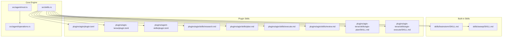
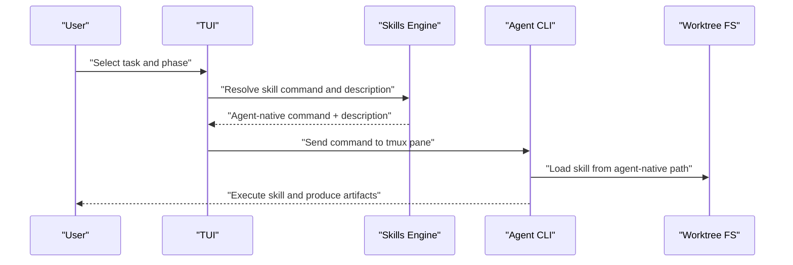
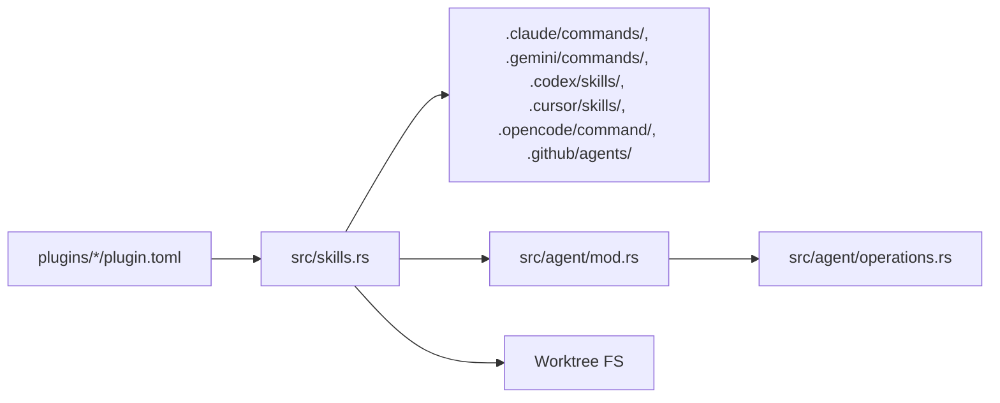

# Skills System

<cite>
**Referenced Files in This Document**
- [skills.rs](file://src/skills.rs)
- [mod.rs](file://src/agent/mod.rs)
- [operations.rs](file://src/agent/operations.rs)
- [SKILL.md (brainstorm)](file://skills/brainstorm/SKILL.md)
- [SKILL.md (sweep)](file://skills/sweep/SKILL.md)
- [plugin.toml (agtx)](file://plugins/agtx/plugin.toml)
- [plugin.toml (agtx-terse)](file://plugins/agtx-terse/plugin.toml)
- [plugin.toml (agent-skills)](file://plugins/agent-skills/plugin.toml)
- [research.md](file://plugins/agtx/skills/research.md)
- [plan.md](file://plugins/agtx/skills/plan.md)
- [execute.md](file://plugins/agtx/skills/execute.md)
- [review.md](file://plugins/agtx/skills/review.md)
- [SKILL.md (agtx-terse plan)](file://plugins/agtx-terse/skills/agtx-plan/SKILL.md)
- [SKILL.md (agtx-terse execute)](file://plugins/agtx-terse/skills/agtx-execute/SKILL.md)
- [CLAUDE.md](file://CLAUDE.md)
- [AGENTS.md](file://AGENTS.md)
</cite>

## Table of Contents
1. [Introduction](#introduction)
2. [Project Structure](#project-structure)
3. [Core Components](#core-components)
4. [Architecture Overview](#architecture-overview)
5. [Detailed Component Analysis](#detailed-component-analysis)
6. [Dependency Analysis](#dependency-analysis)
7. [Performance Considerations](#performance-considerations)
8. [Troubleshooting Guide](#troubleshooting-guide)
9. [Conclusion](#conclusion)
10. [Appendices](#appendices)

## Introduction
This document explains the skills system for agent-specific skill deployment and transformation in the agtx ecosystem. It covers:
- Built-in skills for idea exploration and task creation from conversations
- Canonical-to-agent-specific skill transformation across AI coding platforms
- The plugin-based skill definition system for workflow plugins
- The skill deployment process that copies skills to agent-specific discovery paths in each worktree
- Compatibility matrices and practical usage examples
- Troubleshooting and best practices for developing custom skills

## Project Structure
The skills system spans several directories and modules:
- Built-in skills for brainstorming and sweeping are defined alongside the core skills engine
- Plugin-based skills live under plugins/<workflow>/skills/<phase>/SKILL.md
- The skills engine resides in src/skills.rs and integrates with agent and TUI modules
- Agent-specific discovery paths and command transformations are defined in the skills engine and documented in CLAUDE.md

**Diagram sources**
- [skills.rs:1-409](file://src/skills.rs#L1-L409)
- [mod.rs:1-171](file://src/agent/mod.rs#L1-L171)
- [operations.rs:1-163](file://src/agent/operations.rs#L1-L163)
- [SKILL.md (brainstorm):1-51](file://skills/brainstorm/SKILL.md#L1-L51)
- [SKILL.md (sweep):1-153](file://skills/sweep/SKILL.md#L1-L153)
- [plugin.toml (agtx):1-16](file://plugins/agtx/plugin.toml#L1-L16)
- [plugin.toml (agtx-terse):1-16](file://plugins/agtx-terse/plugin.toml#L1-L16)
- [plugin.toml (agent-skills):1-19](file://plugins/agent-skills/plugin.toml#L1-L19)
- [research.md:1-45](file://plugins/agtx/skills/research.md#L1-L45)
- [plan.md:1-43](file://plugins/agtx/skills/plan.md#L1-L43)
- [execute.md:1-39](file://plugins/agtx/skills/execute.md#L1-L39)
- [review.md:1-36](file://plugins/agtx/skills/review.md#L1-L36)
- [SKILL.md (agtx-terse plan):1-48](file://plugins/agtx-terse/skills/agtx-plan/SKILL.md#L1-L48)
- [SKILL.md (agtx-terse execute):1-44](file://plugins/agtx-terse/skills/agtx-execute/SKILL.md#L1-L44)

**Section sources**
- [CLAUDE.md: Skills and Deployment Paths:131-147](file://CLAUDE.md#L131-L147)
- [CLAUDE.md: Plugin Workflow:111-127](file://CLAUDE.md#L111-L127)

## Core Components
- Built-in skills: brainstorm and sweep are provided as standalone skill definitions for free-form exploration and conversation-to-board conversion respectively.
- Plugin skills: the agtx workflow defines four-phase skills (research, plan, execute, review) plus orchestrate and merge-conflicts, deployable via plugin configurations.
- Skills engine: responsible for transforming canonical skill names to agent-native commands, converting formats (e.g., Gemini TOML), enumerating available skills, scanning agent-native directories, and preparing skills for worktree deployment.

Key responsibilities:
- Canonical-to-agent transformation for command invocation syntax
- Frontmatter extraction and description inference
- Agent-native skill directory mapping and filename normalization
- Scanning agent-native discovery paths for interactive skills
- Converting markdown bodies to Gemini TOML format

**Section sources**
- [skills.rs: Built-in and plugin skill constants:5-21](file://src/skills.rs#L5-L21)
- [skills.rs: Enumeration and scanning:211-408](file://src/skills.rs#L211-L408)
- [skills.rs: Transformation helpers:47-115](file://src/skills.rs#L47-L115)
- [SKILL.md (brainstorm): Definition:1-51](file://skills/brainstorm/SKILL.md#L1-L51)
- [SKILL.md (sweep): Definition:1-153](file://skills/sweep/SKILL.md#L1-L153)
- [research.md:1-45](file://plugins/agtx/skills/research.md#L1-L45)
- [plan.md:1-43](file://plugins/agtx/skills/plan.md#L1-L43)
- [execute.md:1-39](file://plugins/agtx/skills/execute.md#L1-L39)
- [review.md:1-36](file://plugins/agtx/skills/review.md#L1-L36)

## Architecture Overview
The skills system follows a canonical-first design:
- Canonical commands are defined once in plugin TOML files (e.g., /agtx:plan)
- The skills engine transforms these commands to agent-native syntax (e.g., /agtx-plan for OpenCode/Cursor, $agtx-plan for Codex)
- Skills are deployed to agent-native discovery paths during worktree setup
- Agents discover skills either from compiled-in defaults or from the worktree’s agent-native directories

**Diagram sources**
- [skills.rs: Enumeration and scanning:211-408](file://src/skills.rs#L211-L408)
- [CLAUDE.md: Agent Integration:362-367](file://CLAUDE.md#L362-L367)

## Detailed Component Analysis

### Built-in Skills: Brainstorm and Sweep
- Brainstorm skill: designed for idea exploration without planning or implementation. It sets a flag to disable model invocation and provides guiding principles for facilitating exploratory discussions.
- Sweep skill: orchestrates turning conversation outcomes into agtx tasks. It documents the task lifecycle, decomposition strategy, MCP tools, and the end-to-board workflow.

Command formats and use cases:
- Brainstorm: intended to be invoked as a skill to keep the session exploratory; it suggests using sweep when ready to push outcomes to the board.
- Sweep: used to convert actionable items from a conversation into tasks on the board via MCP tools.

Practical examples:
- Use brainstorm to clarify requirements and surface edge cases before planning.
- Use sweep to batch-create tasks after refining the scope and dependencies.

**Section sources**
- [SKILL.md (brainstorm): Description and rules:1-51](file://skills/brainstorm/SKILL.md#L1-L51)
- [SKILL.md (sweep): Lifecycle, decomposition, MCP tools, and sweep flow:1-153](file://skills/sweep/SKILL.md#L1-L153)

### Plugin-Based Skill Definition System
- Plugin skills are defined under plugins/<workflow>/skills/<phase>/SKILL.md with YAML frontmatter specifying name and description.
- The agtx plugin defines commands for research, plan, execute, and review phases, along with artifact paths.
- The agtx-terse plugin mirrors the same phases with terser directives.
- The agent-skills plugin maps canonical commands to its own namespace and prompts.

Compatibility and deployment:
- Plugin skill files are auto-deployed to agent-native paths during worktree setup.
- Artifact files signal phase completion and gate transitions.

**Section sources**
- [plugin.toml (agtx): Commands and artifacts:1-16](file://plugins/agtx/plugin.toml#L1-L16)
- [plugin.toml (agtx-terse): Commands and artifacts:1-16](file://plugins/agtx-terse/plugin.toml#L1-L16)
- [plugin.toml (agent-skills): Commands and prompts:1-19](file://plugins/agent-skills/plugin.toml#L1-L19)
- [research.md:1-45](file://plugins/agtx/skills/research.md#L1-L45)
- [plan.md:1-43](file://plugins/agtx/skills/plan.md#L1-L43)
- [execute.md:1-39](file://plugins/agtx/skills/execute.md#L1-L39)
- [review.md:1-36](file://plugins/agtx/skills/review.md#L1-L36)
- [SKILL.md (agtx-terse plan):1-48](file://plugins/agtx-terse/skills/agtx-plan/SKILL.md#L1-L48)
- [SKILL.md (agtx-terse execute):1-44](file://plugins/agtx-terse/skills/agtx-execute/SKILL.md#L1-L44)

### Skill Transformation System
The skills engine transforms canonical commands to agent-native invocation syntax and normalizes filenames for agent-native discovery.

Key transformations:
- Canonical command: /namespace:command
- Claude/Gemini: unchanged
- OpenCode/Cursor: colon → hyphen
- Codex: slash → dollar + colon → hyphen
- Copilot: no interactive skill invocation (prompt-only)

Filename normalization:
- Gemini: converts SKILL.md to .toml with description and prompt fields
- Others: normalize skill directory names to agent-native filenames

Scanning agent-native skills:
- The engine scans agent-native directories and extracts descriptions from frontmatter or file names.

**Section sources**
- [skills.rs: Command transformation:93-115](file://src/skills.rs#L93-L115)
- [skills.rs: Filename normalization:62-81](file://src/skills.rs#L62-L81)
- [skills.rs: Frontmatter stripping and TOML conversion:118-139](file://src/skills.rs#L118-L139)
- [skills.rs: Scanning agent-native skills:259-408](file://src/skills.rs#L259-L408)

### Skill Deployment to Agent-Native Paths
During worktree setup, skills are deployed to agent-native discovery paths:
- Claude: .claude/commands/agtx/<skill>.md
- Gemini: .gemini/commands/agtx/<skill>.toml (converted)
- Codex: .codex/skills/agtx-<skill>/SKILL.md
- Cursor: .cursor/skills/agtx-<skill>/SKILL.md
- OpenCode: .opencode/command/agtx-<skill>.md
- Copilot: .github/agents/agtx/<skill>.md

The canonical copy is always at .agtx/skills/<skill>/SKILL.md. The skills engine enumerates built-in skills and converts them to agent-native formats before deployment.

**Section sources**
- [CLAUDE.md: Deployment paths:131-141](file://CLAUDE.md#L131-L141)
- [skills.rs: Native skill directory mapping:35-45](file://src/skills.rs#L35-L45)
- [skills.rs: Enumeration of available skills:211-226](file://src/skills.rs#L211-L226)

### Agent Integration and Invocation
Agents are integrated via a registry and operations abstraction. The skills engine resolves commands per agent and builds interactive/resume commands for each agent type.

Supported agents and invocation:
- Known agents include Claude, Codex, Copilot, Gemini, OpenCode, and Cursor.
- Interactive and resume commands vary per agent.

**Section sources**
- [mod.rs: Agent definitions and commands:10-122](file://src/agent/mod.rs#L10-L122)
- [operations.rs: AgentOperations and command building:16-108](file://src/agent/operations.rs#L16-L108)

## Dependency Analysis
The skills system depends on:
- Plugin configurations for canonical commands and artifacts
- Agent definitions for command building and availability
- Filesystem discovery for agent-native skills

**Diagram sources**
- [plugin.toml (agtx):1-16](file://plugins/agtx/plugin.toml#L1-L16)
- [plugin.toml (agtx-terse):1-16](file://plugins/agtx-terse/plugin.toml#L1-L16)
- [plugin.toml (agent-skills):1-19](file://plugins/agent-skills/plugin.toml#L1-L19)
- [skills.rs:35-45](file://src/skills.rs#L35-L45)
- [mod.rs:10-122](file://src/agent/mod.rs#L10-L122)
- [operations.rs:16-108](file://src/agent/operations.rs#L16-L108)

**Section sources**
- [skills.rs: Enumeration and scanning:211-408](file://src/skills.rs#L211-L408)
- [mod.rs: Known agents:80-122](file://src/agent/mod.rs#L80-L122)

## Performance Considerations
- Compile-time embedding of plugin and built-in skill content reduces runtime IO overhead.
- Scanning agent-native directories is performed on demand and sorted for deterministic ordering.
- Frontmatter parsing is bounded by small header sizes and short descriptions.

[No sources needed since this section provides general guidance]

## Troubleshooting Guide
Common issues and resolutions:
- Skill not found by agent:
  - Verify agent-native discovery path exists and contains the expected files (e.g., .claude/commands/agtx/plan.md for Claude).
  - Confirm the skill filename matches the agent’s expected convention (e.g., plan.toml for Gemini, plan.md for others).
- Incorrect command syntax:
  - Ensure the canonical command is transformed to agent-native syntax (e.g., /agtx-plan for OpenCode/Cursor, $agtx-plan for Codex).
- Missing descriptions:
  - Ensure SKILL.md includes YAML frontmatter with a description field or rely on the file stem for fallback.
- Gemini TOML conversion:
  - Confirm the prompt body is properly escaped and the TOML includes both description and prompt fields.

Operational tips:
- Use the enumeration APIs to list available skills per agent and verify discovered commands.
- Validate MCP connectivity when using sweep to ensure board tool access.

**Section sources**
- [skills.rs: Scanning and description extraction:259-408](file://src/skills.rs#L259-L408)
- [skills.rs: Frontmatter extraction and TOML conversion:196-257](file://src/skills.rs#L196-L257)
- [CLAUDE.md: MCP and sweep verification:132-153](file://CLAUDE.md#L132-L153)

## Conclusion
The agtx skills system provides a robust, canonical-first approach to deploying and invoking skills across multiple AI coding platforms. Built-in skills like brainstorm and sweep complement plugin-defined phase skills, with a flexible transformation and deployment pipeline ensuring consistent behavior across agents. Following the compatibility guidelines and best practices outlined here will help you integrate custom skills smoothly into the ecosystem.

[No sources needed since this section summarizes without analyzing specific files]

## Appendices

### Compatibility Matrix: Skills and Agents
- Built-in skills:
  - Brainstorm: supported on Claude, Gemini, Codex, Cursor, OpenCode, Copilot (interactive invocation varies)
  - Sweep: supported via MCP; interactive invocation via sweep skill
- Plugin skills (agtx):
  - Research, Plan, Execute, Review, Orchestrate, Merge-conflicts: supported on Claude, Gemini, Codex, Cursor, OpenCode, Copilot
- Plugin skills (agtx-terse):
  - Same phases as agtx with terse directives
- Plugin skills (agent-skills):
  - Research, Planning, Running, Review mapped to /spec, /plan, /build, /review

Notes:
- Copilot does not support interactive skill invocation; prompts are handled via MCP or direct messaging.
- Agent-native discovery paths differ by platform; ensure correct filenames and formats.

**Section sources**
- [CLAUDE.md: Agent Integration:362-367](file://CLAUDE.md#L362-L367)
- [CLAUDE.md: Supported Agents:434-442](file://CLAUDE.md#L434-L442)
- [plugin.toml (agtx): Commands:11-15](file://plugins/agtx/plugin.toml#L11-L15)
- [plugin.toml (agtx-terse): Commands:11-15](file://plugins/agtx-terse/plugin.toml#L11-L15)
- [plugin.toml (agent-skills): Commands:8-18](file://plugins/agent-skills/plugin.toml#L8-L18)

### Practical Examples
- Idea exploration:
  - Use the brainstorm skill to refine requirements and surface trade-offs before planning.
- Task creation from conversation:
  - Use the sweep skill to propose tasks, confirm with the user, and create them via MCP tools.
- Phase-based development:
  - Use agtx plugin skills to guide research, plan, execute, and review phases with artifact-driven gating.

**Section sources**
- [SKILL.md (brainstorm): Guidance:1-51](file://skills/brainstorm/SKILL.md#L1-L51)
- [SKILL.md (sweep): Proposal and confirmation flow:102-131](file://skills/sweep/SKILL.md#L102-L131)
- [research.md:1-45](file://plugins/agtx/skills/research.md#L1-L45)
- [plan.md:1-43](file://plugins/agtx/skills/plan.md#L1-L43)
- [execute.md:1-39](file://plugins/agtx/skills/execute.md#L1-L39)
- [review.md:1-36](file://plugins/agtx/skills/review.md#L1-L36)

### Best Practices for Custom Skills
- Use YAML frontmatter with name and description for discoverability and consistent descriptions.
- Keep skill content concise and focused on a single phase or capability.
- Follow agent-native filename conventions and TOML conversion rules for Gemini.
- Leverage artifact files to signal phase completion and gate transitions.
- Test skills across target agents using the enumeration and scanning capabilities.

**Section sources**
- [CLAUDE.md: Adding custom skills to plugins:429-433](file://CLAUDE.md#L429-L433)
- [skills.rs: Frontmatter extraction and TOML conversion:118-139](file://src/skills.rs#L118-L139)
- [skills.rs: Scanning agent-native skills:259-408](file://src/skills.rs#L259-L408)