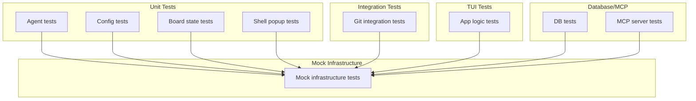
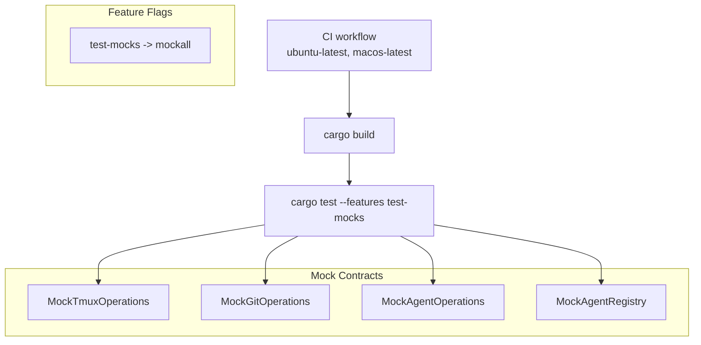
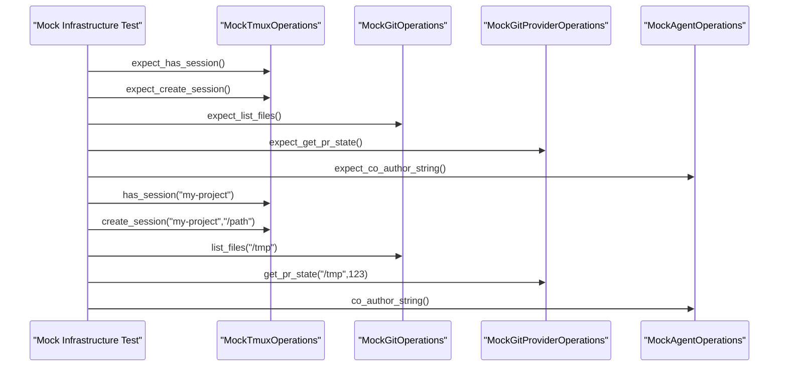
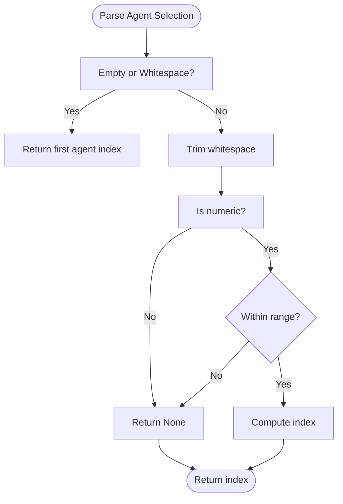
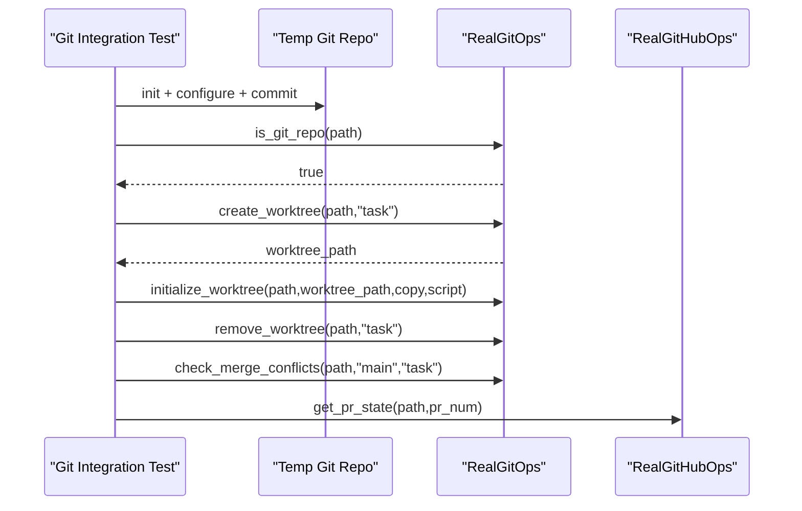
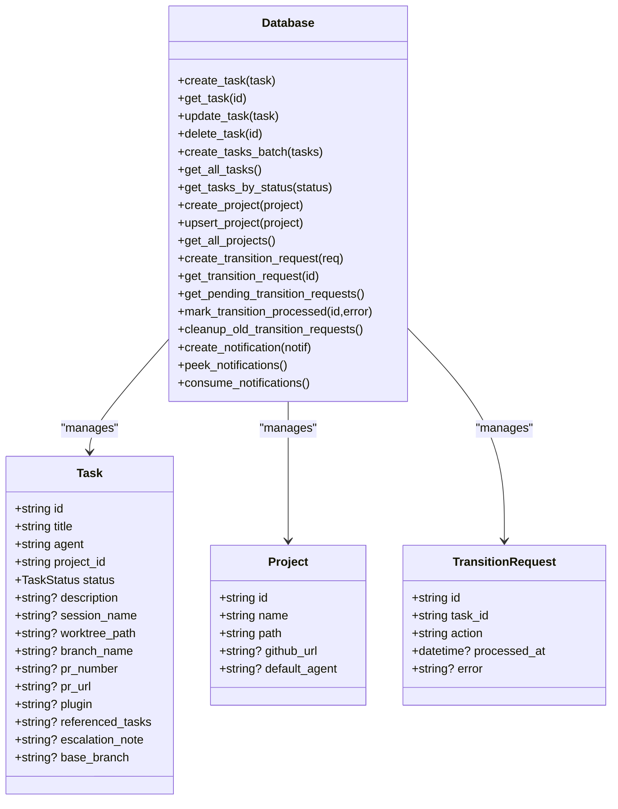
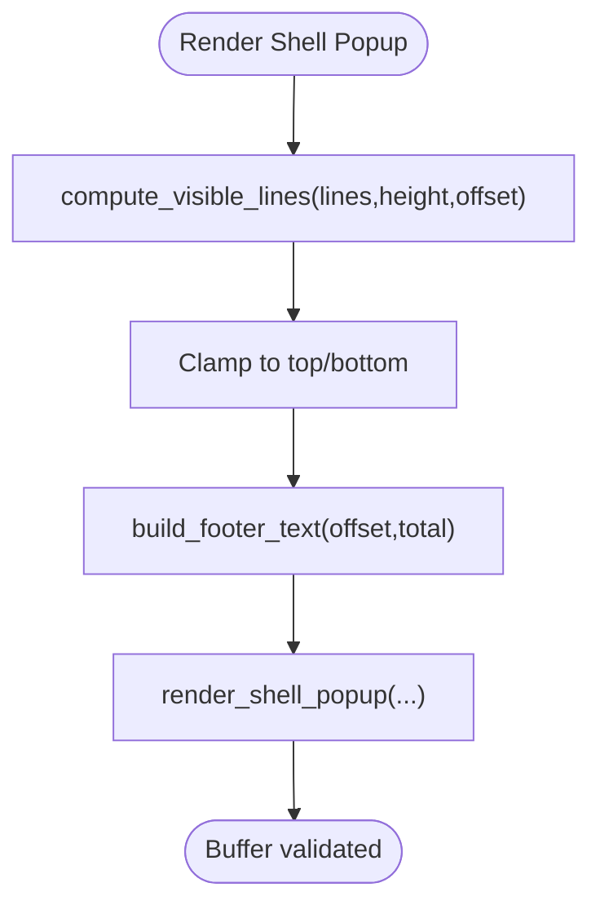
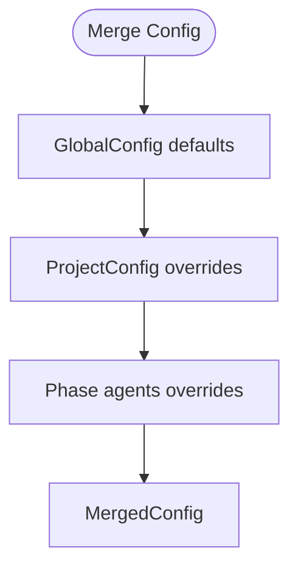
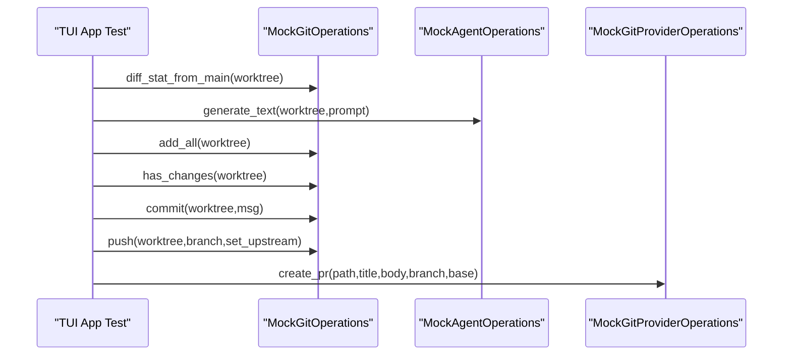
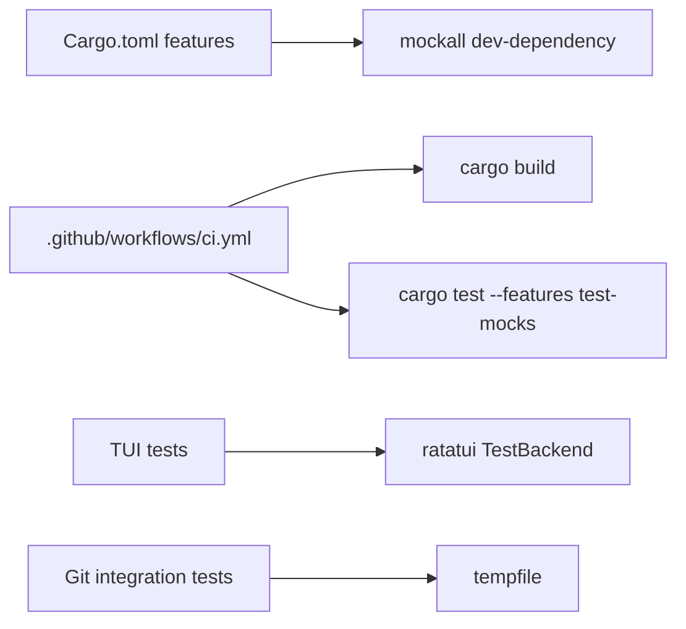

# Testing and Quality Assurance

<cite>
**Referenced Files in This Document**
- [Cargo.toml](file://Cargo.toml)
- [.github/workflows/ci.yml](file://.github/workflows/ci.yml)
- [CONTRIBUTING.md](file://CONTRIBUTING.md)
- [tests/mock_infrastructure_tests.rs](file://tests/mock_infrastructure_tests.rs)
- [tests/agent_tests.rs](file://tests/agent_tests.rs)
- [tests/git_tests.rs](file://tests/git_tests.rs)
- [tests/db_tests.rs](file://tests/db_tests.rs)
- [tests/mcp_tests.rs](file://tests/mcp_tests.rs)
- [tests/board_tests.rs](file://tests/board_tests.rs)
- [tests/shell_popup_tests.rs](file://tests/shell_popup_tests.rs)
- [tests/config_tests.rs](file://tests/config_tests.rs)
- [src/tui/app_tests.rs](file://src/tui/app_tests.rs)
- [src/mcp/server.rs](file://src/mcp/server.rs)
</cite>

## Table of Contents
1. [Introduction](#introduction)
2. [Project Structure](#project-structure)
3. [Core Components](#core-components)
4. [Architecture Overview](#architecture-overview)
5. [Detailed Component Analysis](#detailed-component-analysis)
6. [Dependency Analysis](#dependency-analysis)
7. [Performance Considerations](#performance-considerations)
8. [Troubleshooting Guide](#troubleshooting-guide)
9. [Conclusion](#conclusion)
10. [Appendices](#appendices)

## Introduction
This document describes the testing and quality assurance strategy for agtx. It explains how the test suite is organized across unit, integration, and mock-based infrastructure tests, and details the approach for validating critical components such as agent operations, TUI interactions, Git integration, database operations, and MCP server functionality. It also documents the mock infrastructure used to isolate external dependencies, outlines coverage strategies, and provides guidance for contributors on writing effective tests, running the complete test suite, debugging failures, continuous integration practices, and performance/regression testing.

## Project Structure
The repository organizes tests by domain and capability:
- Unit tests for pure functions and models
- Integration tests that require external tools (Git)
- Mock-based infrastructure tests that validate mock contracts and shared patterns
- TUI-specific tests for rendering and user interaction logic
- MCP server tests for orchestrator capabilities

**Diagram sources**
- [tests/agent_tests.rs:1-221](file://tests/agent_tests.rs#L1-L221)
- [tests/config_tests.rs:1-397](file://tests/config_tests.rs#L1-L397)
- [tests/board_tests.rs:1-226](file://tests/board_tests.rs#L1-L226)
- [tests/shell_popup_tests.rs:1-500](file://tests/shell_popup_tests.rs#L1-L500)
- [tests/git_tests.rs:1-570](file://tests/git_tests.rs#L1-L570)
- [tests/mock_infrastructure_tests.rs:1-220](file://tests/mock_infrastructure_tests.rs#L1-L220)
- [src/tui/app_tests.rs:1-800](file://src/tui/app_tests.rs#L1-L800)
- [tests/db_tests.rs:1-476](file://tests/db_tests.rs#L1-L476)
- [tests/mcp_tests.rs:1-472](file://tests/mcp_tests.rs#L1-L472)

**Section sources**
- [Cargo.toml:39-42](file://Cargo.toml#L39-L42)
- [CONTRIBUTING.md:94-104](file://CONTRIBUTING.md#L94-L104)

## Core Components
- Mock infrastructure: Provides mock traits and registries for tmux, Git, and agent operations. Tests validate expectations, Arc-wrapping, and registry behavior.
- Agent operations: Tests cover agent selection parsing, command building, and agent-specific transforms for different AI coding platforms.
- Git integration: Tests validate worktree path computation, repository detection, branch detection, worktree creation/removal, initialization, conflict detection, and merge conflict checks.
- Database and MCP: Tests cover task and project models, status transitions, notifications, dependency satisfaction, transition request claims, batch task creation, and MCP server parameter types.
- TUI interactions: Tests cover board state navigation, shell popup rendering and scrolling, footer text generation, and fuzzy file search scoring.
- Configuration: Tests cover theme parsing, defaults, merging global and project configs, first-run actions, and agent-for-phase resolution.

**Section sources**
- [tests/mock_infrastructure_tests.rs:1-220](file://tests/mock_infrastructure_tests.rs#L1-L220)
- [tests/agent_tests.rs:1-221](file://tests/agent_tests.rs#L1-L221)
- [tests/git_tests.rs:1-570](file://tests/git_tests.rs#L1-L570)
- [tests/db_tests.rs:1-476](file://tests/db_tests.rs#L1-L476)
- [tests/mcp_tests.rs:1-472](file://tests/mcp_tests.rs#L1-L472)
- [tests/board_tests.rs:1-226](file://tests/board_tests.rs#L1-L226)
- [tests/shell_popup_tests.rs:1-500](file://tests/shell_popup_tests.rs#L1-L500)
- [tests/config_tests.rs:1-397](file://tests/config_tests.rs#L1-L397)

## Architecture Overview
The testing architecture relies on:
- Feature flags to enable mock-based tests
- Mockall-generated mocks for external dependencies
- Pure function tests for deterministic logic
- Integration tests that spawn real Git commands
- TUI tests using a test backend for rendering validation

**Diagram sources**
- [.github/workflows/ci.yml:1-54](file://.github/workflows/ci.yml#L1-L54)
- [Cargo.toml:39-42](file://Cargo.toml#L39-L42)
- [tests/mock_infrastructure_tests.rs:1-220](file://tests/mock_infrastructure_tests.rs#L1-L220)

**Section sources**
- [.github/workflows/ci.yml:1-54](file://.github/workflows/ci.yml#L1-L54)
- [Cargo.toml:39-42](file://Cargo.toml#L39-L42)

## Detailed Component Analysis

### Mock Infrastructure Testing
Purpose:
- Validate that mock traits can be created, configured, and invoked
- Ensure Arc-wrapping works for thread-safe sharing
- Verify agent registry behavior returns consistent agents

Key validations:
- Basic mock creation and method expectations
- Git operations expectations for PR workflow
- Tmux session management expectations
- Agent operations expectations for text generation and co-author strings
- Agent registry returns the same agent for any name lookup

**Diagram sources**
- [tests/mock_infrastructure_tests.rs:21-63](file://tests/mock_infrastructure_tests.rs#L21-L63)
- [tests/mock_infrastructure_tests.rs:96-146](file://tests/mock_infrastructure_tests.rs#L96-L146)
- [tests/mock_infrastructure_tests.rs:148-175](file://tests/mock_infrastructure_tests.rs#L148-L175)
- [tests/mock_infrastructure_tests.rs:195-219](file://tests/mock_infrastructure_tests.rs#L195-L219)

**Section sources**
- [tests/mock_infrastructure_tests.rs:1-220](file://tests/mock_infrastructure_tests.rs#L1-L220)

### Agent Operations Testing
Purpose:
- Validate agent selection parsing and normalization
- Validate agent command construction per platform
- Validate agent-specific transforms for plugin commands

Key validations:
- Selection parsing for whitespace, out-of-range, and invalid inputs
- Known agents presence and attributes
- Interactive and resume command construction
- Platform-specific command transforms (e.g., Cursor, Codex, Copilot)

**Diagram sources**
- [tests/agent_tests.rs:4-43](file://tests/agent_tests.rs#L4-L43)

**Section sources**
- [tests/agent_tests.rs:1-221](file://tests/agent_tests.rs#L1-L221)

### Git Integration Testing
Purpose:
- Validate worktree path computation and existence checks
- Validate repository detection, branch detection, and worktree lifecycle
- Validate worktree initialization with copy and script execution
- Validate merge conflict detection and main branch detection

Key validations:
- Worktree path composition with default and custom directories
- Worktree creation idempotency and removal
- Initialization with copy files, init scripts, nested paths, and error handling
- Merge conflict detection with and without conflicts
- Main branch detection across repositories with different default branches

**Diagram sources**
- [tests/git_tests.rs:108-154](file://tests/git_tests.rs#L108-L154)
- [tests/git_tests.rs:318-415](file://tests/git_tests.rs#L318-L415)
- [tests/git_tests.rs:472-554](file://tests/git_tests.rs#L472-L554)

**Section sources**
- [tests/git_tests.rs:1-570](file://tests/git_tests.rs#L1-L570)

### Database and MCP Testing
Purpose:
- Validate task and project models, status transitions, and dependency satisfaction
- Validate transition request claims, cleanup, and concurrency safety
- Validate MCP server parameter types and CRUD operations

Key validations:
- Task status enumeration and round-trip conversion
- Task session name generation and uniqueness
- Project creation and updates
- Notification creation, peeking, and consumption
- Transition request creation, claiming, and cleanup
- Batch task creation with dependency wiring and rollback on failure
- MCP parameter types for list/create/get/move/check/conflicts/read/send

**Diagram sources**
- [tests/db_tests.rs:4-476](file://tests/db_tests.rs#L4-L476)
- [tests/mcp_tests.rs:3-200](file://tests/mcp_tests.rs#L3-L200)

**Section sources**
- [tests/db_tests.rs:1-476](file://tests/db_tests.rs#L1-L476)
- [tests/mcp_tests.rs:1-472](file://tests/mcp_tests.rs#L1-L472)
- [src/mcp/server.rs:16-200](file://src/mcp/server.rs#L16-L200)

### TUI Interaction Testing
Purpose:
- Validate board state navigation and selection
- Validate shell popup rendering, scrolling, and footer text
- Validate fuzzy file search scoring and limits

Key validations:
- Board movement left/right/up/down with clamping
- Shell popup scroll offsets and visibility calculations
- Footer text generation for different positions
- Fuzzy scoring for file matching and empty patterns

**Diagram sources**
- [tests/shell_popup_tests.rs:88-184](file://tests/shell_popup_tests.rs#L88-L184)
- [tests/shell_popup_tests.rs:186-293](file://tests/shell_popup_tests.rs#L186-L293)

**Section sources**
- [tests/board_tests.rs:1-226](file://tests/board_tests.rs#L1-L226)
- [tests/shell_popup_tests.rs:1-500](file://tests/shell_popup_tests.rs#L1-L500)

### Configuration Testing
Purpose:
- Validate theme color parsing and defaults
- Validate global and project configuration merging
- Validate first-run action determination
- Validate agent-for-phase resolution with precedence

Key validations:
- Hex color parsing with and without hash
- Default configurations for global, worktree, and project
- Merging precedence: project overrides global, explicit phase overrides default
- First-run action logic across config existence, migration, and DB presence

**Diagram sources**
- [tests/config_tests.rs:86-156](file://tests/config_tests.rs#L86-L156)
- [tests/config_tests.rs:209-296](file://tests/config_tests.rs#L209-L296)

**Section sources**
- [tests/config_tests.rs:1-397](file://tests/config_tests.rs#L1-L397)

### TUI App Logic Testing (Integration with Mocks)
Purpose:
- Validate end-to-end TUI workflows using mocks for tmux, Git, and agent operations
- Validate PR description generation, PR creation, pushing changes, and fuzzy file search

Key validations:
- PR description generation combining diff stats and agent text
- PR creation workflow with commit, push, and provider PR creation
- Push changes to existing PR with co-author handling
- Fuzzy file search with pattern matching and result limits

**Diagram sources**
- [src/tui/app_tests.rs:12-132](file://src/tui/app_tests.rs#L12-L132)
- [src/tui/app_tests.rs:187-282](file://src/tui/app_tests.rs#L187-L282)
- [src/tui/app_tests.rs:398-530](file://src/tui/app_tests.rs#L398-L530)
- [src/tui/app_tests.rs:535-630](file://src/tui/app_tests.rs#L535-L630)

**Section sources**
- [src/tui/app_tests.rs:1-800](file://src/tui/app_tests.rs#L1-L800)

## Dependency Analysis
Testing dependencies and relationships:
- Feature flag test-mocks enables mockall for generating mocks
- CI workflow builds and runs tests on Ubuntu and macOS
- TUI tests depend on ratatui test backend for rendering validation
- Integration tests rely on temporary directories and real Git commands

**Diagram sources**
- [Cargo.toml:39-50](file://Cargo.toml#L39-L50)
- [.github/workflows/ci.yml:1-54](file://.github/workflows/ci.yml#L1-L54)
- [tests/shell_popup_tests.rs:1-8](file://tests/shell_popup_tests.rs#L1-L8)

**Section sources**
- [Cargo.toml:39-50](file://Cargo.toml#L39-L50)
- [.github/workflows/ci.yml:1-54](file://.github/workflows/ci.yml#L1-L54)

## Performance Considerations
- Prefer unit and mock-based tests for fast feedback loops
- Use integration tests sparingly and cache temporary directories when possible
- Avoid heavy concurrency in unit tests; reserve concurrent tests for database and MCP scenarios
- Keep TUI rendering tests minimal and deterministic

## Troubleshooting Guide
Common issues and resolutions:
- Mock expectations failing: verify argument predicates and call counts; ensure expectations are set before invoking the SUT
- Integration tests failing due to missing Git: ensure Git is installed and available in PATH
- TUI rendering tests failing: confirm terminal dimensions and backend compatibility
- Database concurrency failures: ensure transaction boundaries and proper claim semantics are respected
- CI flakiness: verify OS-specific differences (e.g., default branch naming) and adjust tests accordingly

**Section sources**
- [tests/git_tests.rs:171-270](file://tests/git_tests.rs#L171-L270)
- [tests/db_tests.rs:380-422](file://tests/db_tests.rs#L380-L422)
- [.github/workflows/ci.yml:1-54](file://.github/workflows/ci.yml#L1-L54)

## Conclusion
The agtx test suite employs a layered strategy: pure function tests for deterministic logic, mock-based infrastructure tests for external dependencies, integration tests for Git, and TUI tests for rendering and interaction. Continuous integration ensures cross-platform coverage, while feature flags enable comprehensive mocking. Contributors should write targeted unit tests, leverage mocks for external integrations, and add integration tests where necessary to maintain reliability across operating systems and AI coding platforms.

## Appendices

### Running the Test Suite
- Run all tests with mocks enabled: cargo test --features test-mocks
- Run a specific test: cargo test --features test-mocks test_name

**Section sources**
- [CONTRIBUTING.md:94-104](file://CONTRIBUTING.md#L94-L104)

### Continuous Integration Practices
- CI jobs run on ubuntu-latest and macos-latest
- Rust toolchain and components are installed
- Build and test steps are executed with the test-mocks feature

**Section sources**
- [.github/workflows/ci.yml:1-54](file://.github/workflows/ci.yml#L1-L54)

### Quality Gates and Coverage Strategies
- Feature flag test-mocks enables comprehensive mocking for isolation
- Pure function tests cover logic without external dependencies
- Integration tests validate Git workflows end-to-end
- Mock infrastructure tests validate contracts and Arc-wrapping
- TUI tests validate rendering and interaction using a test backend
- Database and MCP tests validate concurrency and correctness of state transitions

**Section sources**
- [Cargo.toml:39-42](file://Cargo.toml#L39-L42)
- [tests/mock_infrastructure_tests.rs:1-220](file://tests/mock_infrastructure_tests.rs#L1-L220)
- [tests/shell_popup_tests.rs:1-500](file://tests/shell_popup_tests.rs#L1-L500)
- [tests/db_tests.rs:1-476](file://tests/db_tests.rs#L1-L476)
- [tests/mcp_tests.rs:1-472](file://tests/mcp_tests.rs#L1-L472)