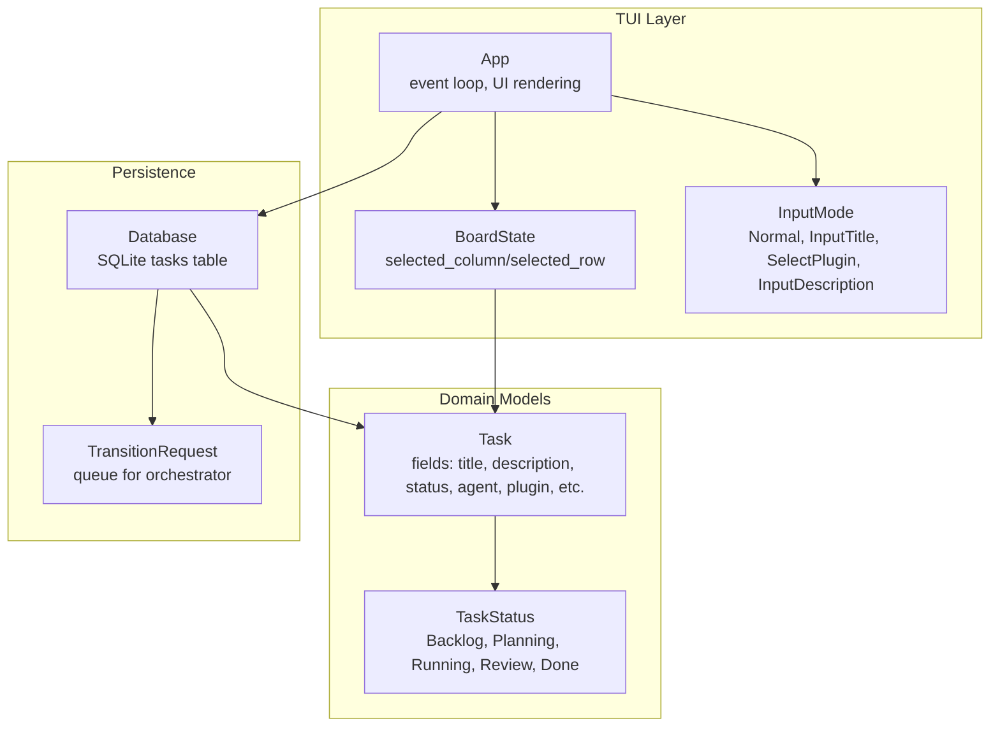
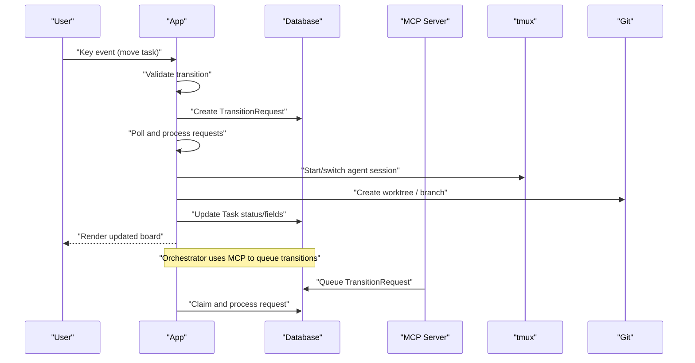
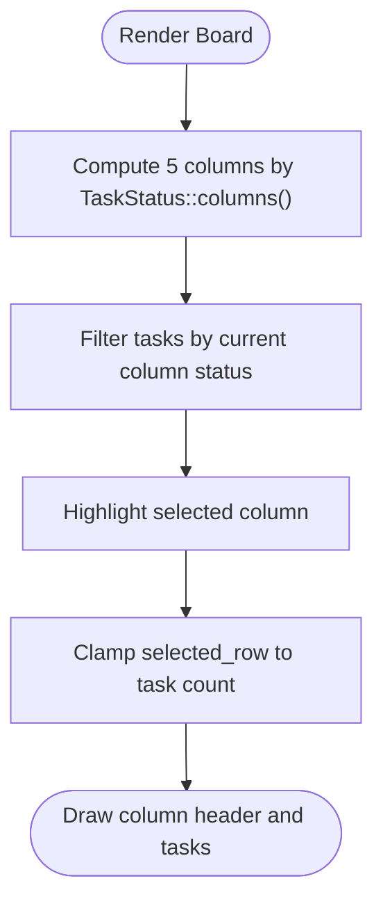
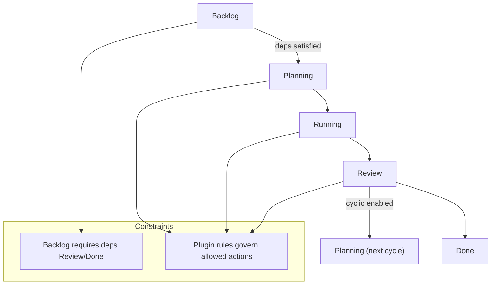
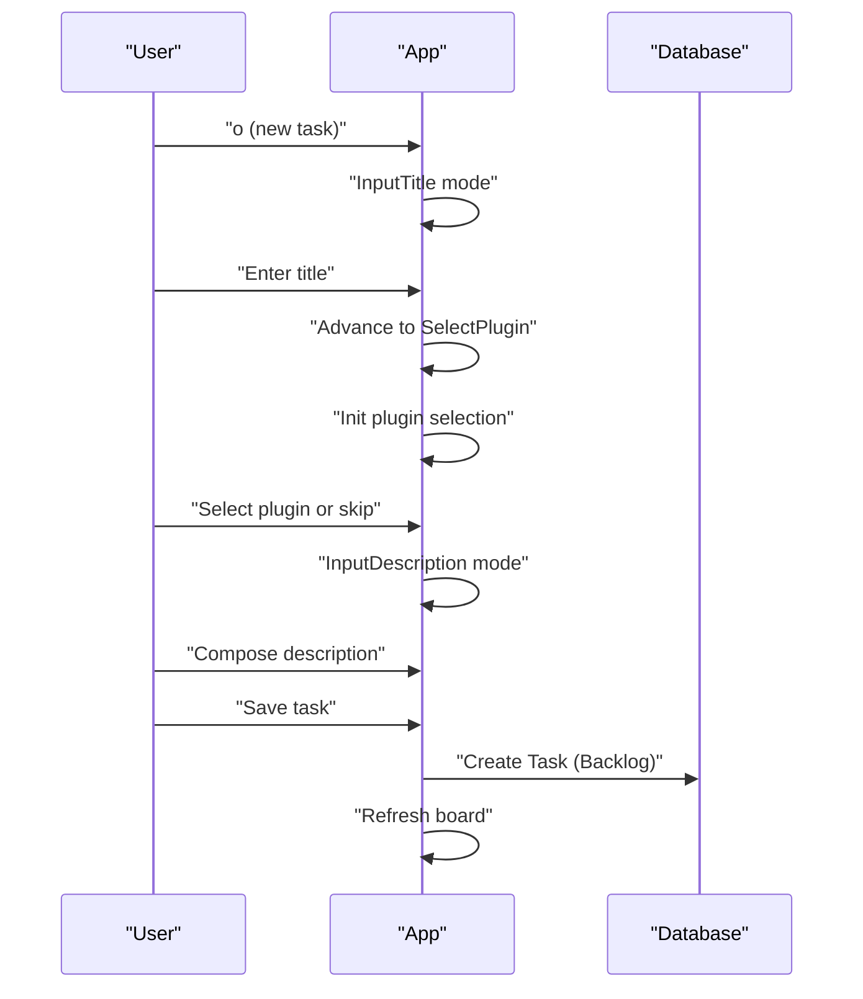
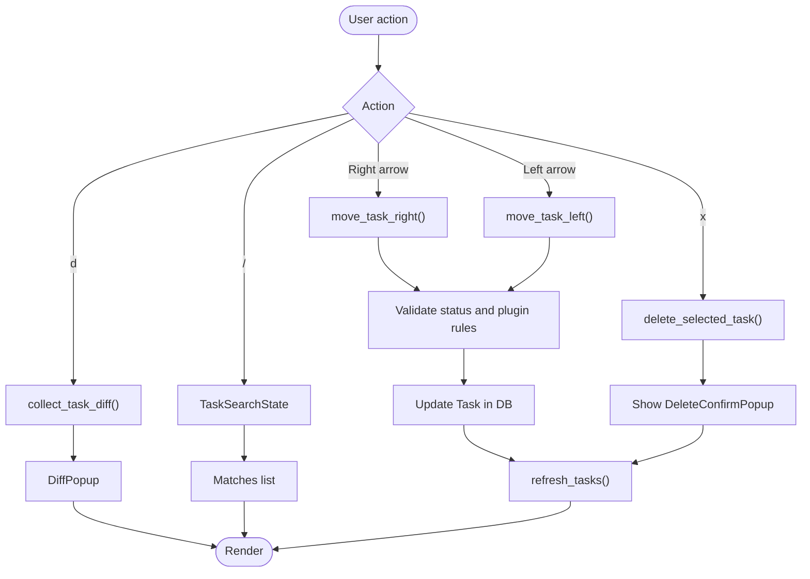
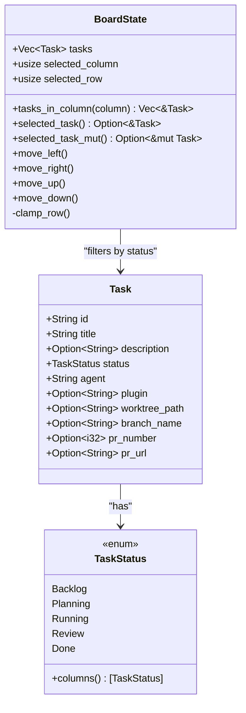
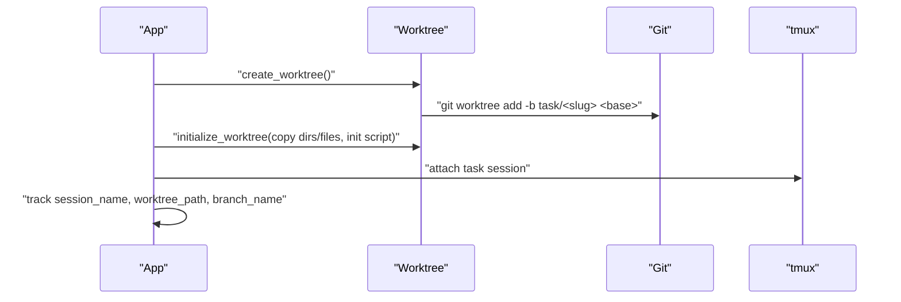
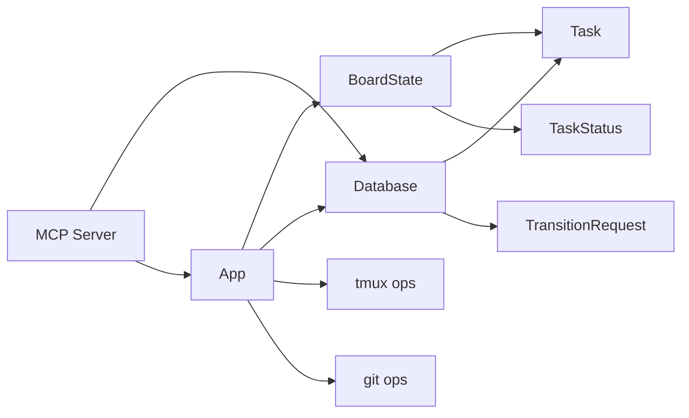

# Kanban Board Operations

<cite>
**Referenced Files in This Document**
- [README.md](file://README.md)
- [board.rs](file://src/tui/board.rs)
- [app.rs](file://src/tui/app.rs)
- [input.rs](file://src/tui/input.rs)
- [models.rs](file://src/db/models.rs)
- [schema.rs](file://src/db/schema.rs)
- [worktree.rs](file://src/git/worktree.rs)
- [server.rs](file://src/mcp/server.rs)
- [board_tests.rs](file://tests/board_tests.rs)
</cite>

## Table of Contents
1. [Introduction](#introduction)
2. [Project Structure](#project-structure)
3. [Core Components](#core-components)
4. [Architecture Overview](#architecture-overview)
5. [Detailed Component Analysis](#detailed-component-analysis)
6. [Dependency Analysis](#dependency-analysis)
7. [Performance Considerations](#performance-considerations)
8. [Troubleshooting Guide](#troubleshooting-guide)
9. [Conclusion](#conclusion)

## Introduction
This document explains the AGTX kanban board system and its five-phase workflow for task management. It covers the board layout, task lifecycle, creation wizard, movement between phases, deletion, viewing diffs, searching tasks, visual indicators, and board state management. Practical workflows demonstrate creating tasks, moving them through phases, handling merge conflicts, and coordinating multiple agents.

## Project Structure
The kanban board is implemented in the TUI (Text User Interface) layer with state and persistence in the database. The board columns represent phases: Backlog, Planning, Running, Review, and Done. Tasks are stored in SQLite and managed through a schema with transition requests for orchestrator-driven automation.

**Diagram sources**
- [board.rs:4-99](file://src/tui/board.rs#L4-L99)
- [app.rs:448-560](file://src/tui/app.rs#L448-L560)
- [input.rs:2-19](file://src/tui/input.rs#L2-L19)
- [models.rs:6-56](file://src/db/models.rs#L6-L56)
- [schema.rs:97-180](file://src/db/schema.rs#L97-L180)

**Section sources**
- [README.md:506-547](file://README.md#L506-L547)
- [board.rs:4-99](file://src/tui/board.rs#L4-L99)
- [models.rs:6-56](file://src/db/models.rs#L6-L56)
- [schema.rs:97-180](file://src/db/schema.rs#L97-L180)

## Core Components
- BoardState: Tracks tasks and selection within columns. Provides filtering by column and selection navigation.
- TaskStatus: Enumerates the five phases and defines column ordering.
- Task: Represents a board task with metadata including agent, plugin, worktree/session info, PR fields, and dependencies.
- Database: Manages tasks, transition requests, and project metadata with migrations and indexing.
- App: Central TUI controller handling input, rendering, transitions, and integrations (tmux, git, agents).

Key behaviors:
- Board columns are ordered as Backlog → Planning → Running → Review → Done.
- Selection moves across columns and rows with clamping to valid indices.
- Task creation uses a wizard with title, plugin selection, and description.
- Movement between phases is constrained by status and plugin rules; Backlog requires dependency satisfaction.

**Section sources**
- [board.rs:11-92](file://src/tui/board.rs#L11-L92)
- [models.rs:6-56](file://src/db/models.rs#L6-L56)
- [models.rs:59-133](file://src/db/models.rs#L59-L133)
- [schema.rs:212-351](file://src/db/schema.rs#L212-L351)
- [app.rs:448-560](file://src/tui/app.rs#L448-L560)

## Architecture Overview
The board integrates UI, state, persistence, and external systems (tmux, git, agents). The orchestrator uses MCP to enqueue transitions that the TUI processes and executes with side effects (worktree setup, agent switching, skill deployment).

**Diagram sources**
- [app.rs:4517-4563](file://src/tui/app.rs#L4517-L4563)
- [schema.rs:480-543](file://src/db/schema.rs#L480-L543)
- [server.rs:679-708](file://src/mcp/server.rs#L679-L708)

## Detailed Component Analysis

### Board Layout and Columns
- Columns correspond to TaskStatus values in order: Backlog, Planning, Running, Review, Done.
- The UI renders equal-width columns and highlights the selected column.
- Selection is tracked by selected_column and selected_row, with clamping to column bounds and task counts.

**Diagram sources**
- [board.rs:20-91](file://src/tui/board.rs#L20-L91)
- [app.rs:1311-1343](file://src/tui/app.rs#L1311-L1343)

**Section sources**
- [board.rs:20-91](file://src/tui/board.rs#L20-L91)
- [app.rs:1311-1343](file://src/tui/app.rs#L1311-L1343)
- [board_tests.rs:30-54](file://tests/board_tests.rs#L30-L54)

### Task Lifecycle and Phase Transitions
- Five-phase workflow: Backlog → Planning → Running → Review → Done.
- Transitions are validated by status and plugin rules. Backlog requires dependencies to be in Review/Done.
- Special handling for Review → Planning (cyclic) and Review → Running (resume).

**Diagram sources**
- [app.rs:4528-4542](file://src/tui/app.rs#L4528-L4542)
- [app.rs:4567-4581](file://src/tui/app.rs#L4567-L4581)
- [server.rs:687-698](file://src/mcp/server.rs#L687-L698)

**Section sources**
- [app.rs:4517-4563](file://src/tui/app.rs#L4517-L4563)
- [app.rs:4567-4581](file://src/tui/app.rs#L4567-L4581)
- [server.rs:679-708](file://src/mcp/server.rs#L679-L708)

### Task Creation Wizard
The wizard guides users through three steps:
1. InputTitle: Enter a concise task title.
2. SelectPlugin: Choose a workflow plugin (skipped if only one option).
3. InputDescription: Write a detailed prompt with optional references to files, skills, and tasks.

**Diagram sources**
- [app.rs:4424-4437](file://src/tui/app.rs#L4424-L4437)
- [app.rs:4289-4326](file://src/tui/app.rs#L4289-L4326)
- [input.rs:2-19](file://src/tui/input.rs#L2-L19)

**Section sources**
- [app.rs:4424-4437](file://src/tui/app.rs#L4424-L4437)
- [app.rs:4289-4326](file://src/tui/app.rs#L4289-L4326)
- [input.rs:2-19](file://src/tui/input.rs#L2-L19)

### Task Manipulation Operations
- Move right: Advance task to next phase if allowed.
- Move left: Step back in phases (e.g., Review → Running).
- Delete task: Confirmation popup then removal from database.
- View diff: Collect staged/unstaged/untracked changes from worktree.
- Search tasks: Popup with fuzzy matching across tasks.

**Diagram sources**
- [app.rs:4494-4518](file://src/tui/app.rs#L4494-L4518)
- [app.rs:4439-4448](file://src/tui/app.rs#L4439-L4448)
- [app.rs:4482-4492](file://src/tui/app.rs#L4482-L4492)
- [app.rs:654-660](file://src/tui/app.rs#L654-L660)

**Section sources**
- [app.rs:4494-4518](file://src/tui/app.rs#L4494-L4518)
- [app.rs:4439-4448](file://src/tui/app.rs#L4439-L4448)
- [app.rs:4482-4492](file://src/tui/app.rs#L4482-L4492)
- [app.rs:654-660](file://src/tui/app.rs#L654-L660)

### Visual Indicators
- Column headers highlight the selected column.
- Task rows reflect status and agent assignment.
- Merge conflict detection shows a warning and triggers the merge-conflicts skill when Review becomes idle.
- Escalation notes indicate tasks requiring user attention.

**Section sources**
- [app.rs:1330-1343](file://src/tui/app.rs#L1330-L1343)
- [app.rs:6521-6542](file://src/tui/app.rs#L6521-L6542)

### Board State Management and Filtering
- BoardState maintains a vector of tasks and selection indices.
- tasks_in_column filters tasks by current column’s status.
- selected_task and selected_task_mut provide immutable and mutable access to the current selection.
- Navigation clamps row index to the current column’s task count.

**Diagram sources**
- [board.rs:5-92](file://src/tui/board.rs#L5-L92)
- [models.rs:6-56](file://src/db/models.rs#L6-L56)
- [models.rs:59-133](file://src/db/models.rs#L59-L133)

**Section sources**
- [board.rs:11-92](file://src/tui/board.rs#L11-L92)
- [board_tests.rs:12-172](file://tests/board_tests.rs#L12-L172)

### Worktree and Agent Integration
- Worktrees are created per task from a base branch, with optional customizations.
- Each task can have a tmux session and associated worktree/branch metadata.
- Agents are switched per phase and skills are deployed according to plugin configuration.

**Diagram sources**
- [worktree.rs:8-65](file://src/git/worktree.rs#L8-L65)
- [worktree.rs:129-223](file://src/git/worktree.rs#L129-L223)

**Section sources**
- [worktree.rs:8-65](file://src/git/worktree.rs#L8-L65)
- [worktree.rs:129-223](file://src/git/worktree.rs#L129-L223)

### Practical Workflows

#### Create a New Task
- Press o to start the wizard.
- Enter a concise title.
- Optionally select a plugin; otherwise proceed to description.
- Compose a detailed description with optional references.
- Save creates the task in Backlog.

**Section sources**
- [app.rs:4424-4437](file://src/tui/app.rs#L4424-L4437)
- [app.rs:4289-4326](file://src/tui/app.rs#L4289-L4326)

#### Move a Task Through Phases
- Select the task in the desired column.
- Press m to move right (advance) or r to move left (reverse).
- For cyclic plugins, p moves Review back to Planning.
- The TUI validates dependencies and plugin rules before updating the database.

**Section sources**
- [app.rs:4494-4518](file://src/tui/app.rs#L4494-L4518)
- [app.rs:4528-4542](file://src/tui/app.rs#L4528-L4542)

#### Handle Merge Conflicts
- When a task enters Review and becomes idle, the system checks for conflicts with the main branch.
- If conflicts are detected, the merge-conflicts skill is dispatched to the agent, which resolves and re-commits.

**Section sources**
- [app.rs:6521-6542](file://src/tui/app.rs#L6521-L6542)
- [server.rs:757-827](file://src/mcp/server.rs#L757-L827)

#### Coordinate Multiple Agents
- Different agents can be configured per phase (e.g., research → planning → running → review).
- Each task runs in its own tmux window with persistent context across phases.
- The orchestrator agent can advance tasks automatically and escalate when needed.

**Section sources**
- [README.md:308-327](file://README.md#L308-L327)
- [README.md:604-646](file://README.md#L604-L646)

## Dependency Analysis
- BoardState depends on TaskStatus for column ordering and Task for filtering.
- App depends on BoardState for selection, Database for persistence, and external systems for tmux/git/agents.
- Database encapsulates schema, migrations, and transition request queue.
- MCP server exposes tools for listing projects/tasks, moving tasks, checking conflicts, and managing notifications.

**Diagram sources**
- [board.rs:1-99](file://src/tui/board.rs#L1-L99)
- [models.rs:59-133](file://src/db/models.rs#L59-L133)
- [schema.rs:97-180](file://src/db/schema.rs#L97-L180)
- [server.rs:278-331](file://src/mcp/server.rs#L278-L331)

**Section sources**
- [board.rs:1-99](file://src/tui/board.rs#L1-L99)
- [models.rs:59-133](file://src/db/models.rs#L59-L133)
- [schema.rs:97-180](file://src/db/schema.rs#L97-L180)
- [server.rs:278-331](file://src/mcp/server.rs#L278-L331)

## Performance Considerations
- Indexing on tasks(status) and tasks(project_id) supports efficient filtering and lookup.
- Batch operations (e.g., create_tasks_batch) reduce transaction overhead.
- Background threads handle worktree setup and cleanup to keep the UI responsive.
- Idle detection and conflict checks are throttled to avoid excessive polling.

## Troubleshooting Guide
- Dependencies not satisfied: Cannot move Backlog tasks until referenced tasks are in Review/Done.
- Phase incomplete: Moving a task when a phase is incomplete shows a confirmation popup; use skip_move_confirm to bypass after acknowledging.
- Merge conflicts: Resolve conflicts via the merge-conflicts skill when Review becomes idle.
- Delete confirmation: Use the delete confirmation popup to prevent accidental removal.
- Task search: Use the task search popup to locate tasks quickly.

**Section sources**
- [app.rs:4517-4520](file://src/tui/app.rs#L4517-L4520)
- [app.rs:4567-4581](file://src/tui/app.rs#L4567-L4581)
- [app.rs:4958-4970](file://src/tui/app.rs#L4958-L4970)
- [app.rs:4439-4448](file://src/tui/app.rs#L4439-L4448)
- [app.rs:654-660](file://src/tui/app.rs#L654-L660)

## Conclusion
The AGTX kanban board provides a structured, multi-agent workflow spanning five phases. Its TUI offers intuitive navigation, a guided creation wizard, robust state management, and seamless integration with tmux, git, and agents. The orchestrator augments human triage with automated advancement and conflict resolution, while MCP enables external tools to coordinate tasks safely through a queue of transition requests.