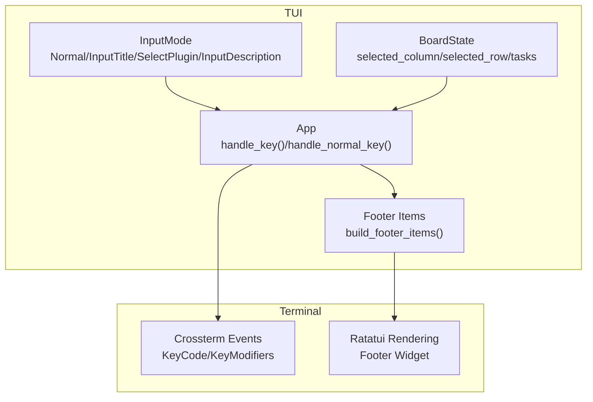
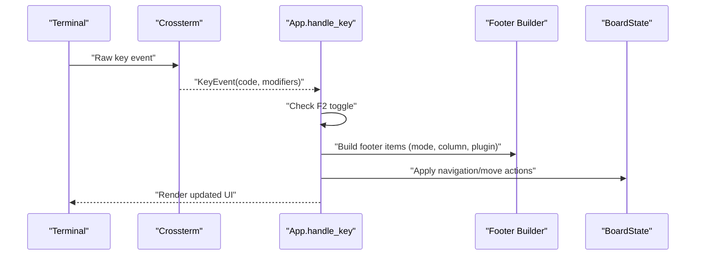
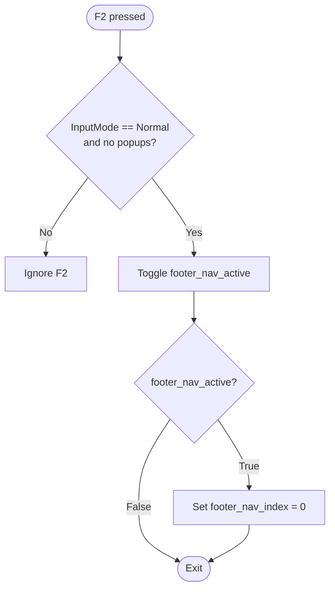
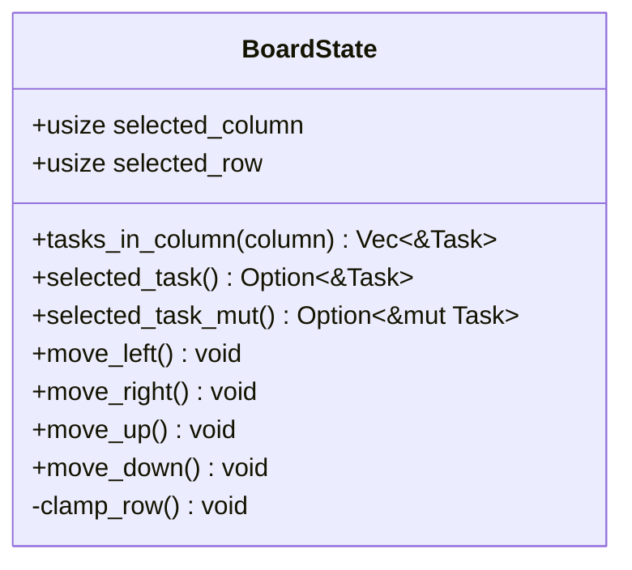
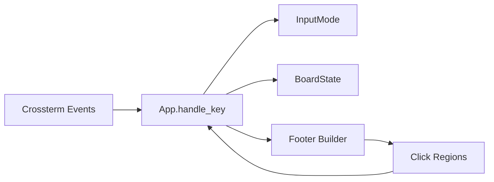

# Keyboard Navigation and Shortcuts

<cite>
**Referenced Files in This Document**
- [README.md](file://README.md)
- [src/tui/input.rs](file://src/tui/input.rs)
- [src/tui/app.rs](file://src/tui/app.rs)
- [src/tui/board.rs](file://src/tui/board.rs)
- [src/main.rs](file://src/main.rs)
</cite>

## Table of Contents
1. [Introduction](#introduction)
2. [Project Structure](#project-structure)
3. [Core Components](#core-components)
4. [Architecture Overview](#architecture-overview)
5. [Detailed Component Analysis](#detailed-component-analysis)
6. [Dependency Analysis](#dependency-analysis)
7. [Performance Considerations](#performance-considerations)
8. [Troubleshooting Guide](#troubleshooting-guide)
9. [Conclusion](#conclusion)

## Introduction
This document provides comprehensive keyboard navigation and shortcut documentation for agtx's terminal-based interaction model. It covers column movement, task navigation, action keys, the dual-input system (vim-style h/j/k/l and arrow keys), the footer navigation system (F2 and mouse), special key combinations (Ctrl+f for fullscreen attachment), Tab cycling, context-sensitive shortcuts by column position, and troubleshooting guidance for keyboard mapping and terminal compatibility issues.

## Project Structure
The keyboard navigation system spans several modules:
- TUI input modes define the interaction contexts (normal, input, plugin selection, description input)
- Board state tracks selection across columns and rows
- App handles key dispatch, footer construction, and special key combinations
- Main module demonstrates top-level key handling for initial selection

**Diagram sources**
- [src/tui/input.rs:1-19](file://src/tui/input.rs#L1-L19)
- [src/tui/board.rs:1-99](file://src/tui/board.rs#L1-L99)
- [src/tui/app.rs:42-294](file://src/tui/app.rs#L42-L294)

**Section sources**
- [src/tui/input.rs:1-19](file://src/tui/input.rs#L1-L19)
- [src/tui/board.rs:1-99](file://src/tui/board.rs#L1-L99)
- [src/tui/app.rs:42-294](file://src/tui/app.rs#L42-L294)

## Core Components
- InputMode: Defines the current interaction mode (Normal, InputTitle, SelectPlugin, InputDescription)
- BoardState: Tracks selected column and row, enabling column/row navigation
- App.handle_key: Central dispatcher for keyboard input, including F2 footer navigation and special key combinations
- Footer construction: Dynamically builds footer items based on input mode, sidebar focus, selected column, plugin configuration, and fullscreen-on-enter behavior

Key behaviors:
- Dual-input system supports both vim-style keys (h/j/k/l) and arrow keys for accessibility
- Footer navigation toggled by F2, allowing keyboard-only navigation of footer actions
- Mouse click support integrates with footer regions for activation
- Special combinations include Ctrl+f for fullscreen attachment and Tab for cycling options

**Section sources**
- [src/tui/input.rs:1-19](file://src/tui/input.rs#L1-L19)
- [src/tui/board.rs:1-99](file://src/tui/board.rs#L1-L99)
- [src/tui/app.rs:2728-3500](file://src/tui/app.rs#L2728-L3500)

## Architecture Overview
The keyboard handling pipeline routes terminal events through the TUI to the application logic, which interprets actions based on input mode and board state.

**Diagram sources**
- [src/tui/app.rs:2728-2861](file://src/tui/app.rs#L2728-L2861)
- [src/tui/app.rs:59-199](file://src/tui/app.rs#L59-L199)
- [src/tui/board.rs:52-91](file://src/tui/board.rs#L52-L91)

## Detailed Component Analysis

### Keyboard Navigation Keys
Primary navigation keys:
- Column movement: h/l or arrow keys
- Task navigation: j/k or arrow keys
- Action keys: o (create), m (move), r (resume), x (delete)

Dual-input system:
- Vim-style keys: h/left, j/down, k/up, l/right
- Arrow keys: ←, →, ↑, ↓
- Both are supported for accessibility and ergonomic preferences

Context-sensitive shortcuts by column position:
- Backlog (column 0): o (new), / (search), Enter (open), x (del), d (diff), R (research), m (plan), M (run), e (sidebar), q (quit)
- Planning (column 1): o (new), / (search), Enter (open), x (del), d (diff), [C-f] fullscreen or m (run), e (sidebar), q (quit)
- Running (column 2): o (new), / (search), Enter (open), x (del), d (diff), [C-f] fullscreen or m (move), r (move left), e (sidebar), q (quit)
- Review/Done (column 3): o (new), / (search), Enter (open), x (del), d (diff), [C-f] fullscreen or m (done), r (resume), p (next phase if cyclic), e (sidebar), q (quit)

Notes:
- [C-f] fullscreen appears when fullscreen_on_enter is disabled; otherwise, the default behavior applies
- p (next phase) is available only when the plugin is cyclic

**Section sources**
- [src/tui/app.rs:66-199](file://src/tui/app.rs#L66-L199)
- [src/tui/app.rs:3607-3770](file://src/tui/app.rs#L3607-L3770)
- [README.md:107-129](file://README.md#L107-L129)

### Footer Navigation System (F2 and Mouse)
Footer navigation:
- F2 toggles footer keyboard navigation mode when in Normal mode with no popups
- While active, Left/Right arrows move between footer items; Enter activates the selected item; Esc cancels
- Mouse clicks on footer items dispatch the associated KeyEvent through the same handler path

Footer item construction:
- Builds interactive footer items dynamically based on input mode, sidebar focus, selected column, plugin configuration, and fullscreen behavior
- Each item maps a display label to a KeyEvent for both keyboard and mouse activation

**Diagram sources**
- [src/tui/app.rs:2730-2748](file://src/tui/app.rs#L2730-L2748)

**Section sources**
- [src/tui/app.rs:2728-2777](file://src/tui/app.rs#L2728-L2777)
- [src/tui/app.rs:59-199](file://src/tui/app.rs#L59-L199)
- [src/tui/app.rs:3477-3494](file://src/tui/app.rs#L3477-L3494)

### Special Key Combinations
- Ctrl+f: Fullscreen attach to the selected task's tmux session (both in normal mode and shell popup)
- Tab: Cycle through options in plugin selection and other modal contexts
- Enter: Activate selected footer item when footer navigation is active

Additional combinations:
- Ctrl+q: Close shell popup
- Ctrl+j/Ctrl+n/Ctrl+Down: Scroll down in shell popup
- Ctrl+k/Ctrl+p/Ctrl+Up: Scroll up in shell popup
- Ctrl+u/PageUp: Page up in shell popup
- Ctrl+d/PageDown: Page down in shell popup
- Ctrl+g: Go to bottom in shell popup

**Section sources**
- [src/tui/app.rs:2842-2853](file://src/tui/app.rs#L2842-L2853)
- [src/tui/app.rs:3455-3461](file://src/tui/app.rs#L3455-L3461)
- [src/tui/app.rs:3429-3450](file://src/tui/app.rs#L3429-L3450)

### Context-Sensitive Shortcuts by Column Position
Behavior varies by selected column:
- Backlog (column 0): Research initiation (R), task creation (o), search (/), open (Enter), delete (x), diff (d), plan (m), run (M), sidebar toggle (e), quit (q)
- Planning (column 1): Run task (m) when fullscreen_on_enter is disabled; otherwise, fullscreen shortcut appears as [C-f] fullscreen
- Running (column 2): Move task forward (m) or move left (r) when fullscreen_on_enter is disabled; otherwise, fullscreen shortcut appears as [C-f] fullscreen
- Review/Done (column 3): Move to done (m) when fullscreen_on_enter is disabled; otherwise, fullscreen shortcut appears as [C-f] fullscreen; resume (r) and next phase (p) when cyclic plugin is enabled

**Section sources**
- [src/tui/app.rs:78-168](file://src/tui/app.rs#L78-L168)
- [src/tui/app.rs:3607-3770](file://src/tui/app.rs#L3607-L3770)

### Mouse Interaction Support
Mouse support complements keyboard navigation:
- Footer items are clickable; click regions are computed during rendering
- Clicking a footer item dispatches the associated KeyEvent through the same handler path
- This ensures consistent behavior between keyboard and mouse interactions

**Section sources**
- [src/tui/app.rs:203-244](file://src/tui/app.rs#L203-L244)
- [src/tui/app.rs:3477-3494](file://src/tui/app.rs#L3477-L3494)

### Board Navigation Logic
BoardState provides movement primitives:
- move_left/move_right: Navigate columns with boundary clamping
- move_up/move_down: Navigate tasks within the current column with boundary clamping
- selected_task/selected_task_mut: Access the currently selected task for operations

**Diagram sources**
- [src/tui/board.rs:11-92](file://src/tui/board.rs#L11-L92)

**Section sources**
- [src/tui/board.rs:11-92](file://src/tui/board.rs#L11-L92)

### Input Modes and Their Footers
InputMode determines footer content and behavior:
- Normal: Column-specific actions plus sidebar and quit
- InputTitle: Title input with Esc/Enter navigation
- SelectPlugin: Plugin selection with j/k navigation and Tab cycling
- InputDescription: Description input with Esc/Enter and inline reference features

**Section sources**
- [src/tui/input.rs:1-19](file://src/tui/input.rs#L1-L19)
- [src/tui/app.rs:180-198](file://src/tui/app.rs#L180-L198)

## Dependency Analysis
The keyboard navigation system relies on coordinated behavior across modules:
- Crossterm provides raw key events
- App.handle_key interprets events based on input mode and board state
- Footer builder constructs contextual footer items
- BoardState manages selection boundaries
- Mouse click regions integrate with footer items for click-based activation

**Diagram sources**
- [src/tui/app.rs:2728-3500](file://src/tui/app.rs#L2728-L3500)
- [src/tui/input.rs:1-19](file://src/tui/input.rs#L1-L19)
- [src/tui/board.rs:1-99](file://src/tui/board.rs#L1-L99)

**Section sources**
- [src/tui/app.rs:2728-3500](file://src/tui/app.rs#L2728-L3500)
- [src/tui/input.rs:1-19](file://src/tui/input.rs#L1-L19)
- [src/tui/board.rs:1-99](file://src/tui/board.rs#L1-L99)

## Performance Considerations
- Footer rebuilds occur every frame; keep footer item construction efficient
- Mouse hit-testing is O(n) over registered regions; minimize the number of footer items when possible
- Keyboard navigation is immediate; avoid heavy operations in key handlers
- Consider caching frequently accessed configuration values (e.g., fullscreen_on_enter) to reduce repeated lookups

## Troubleshooting Guide
Common keyboard mapping and terminal compatibility issues:

- F2 footer navigation not activating
  - Ensure you are in Normal mode with no popups open
  - Verify that footer_nav_active is toggled correctly

- Arrow keys not moving selection
  - Confirm that the terminal supports raw mode and that arrow keys are being captured as expected
  - Check that the input mode is Normal and the sidebar is not focused

- Ctrl+f not attaching fullscreen
  - Ensure a task is selected and has an active session name
  - Verify that fullscreen_on_enter is disabled to display [C-f] fullscreen in the footer

- Mouse clicks not triggering actions
  - Confirm that click regions are registered during the last draw frame
  - Ensure the click coordinates fall within the registered areas

- Vim-style keys (h/j/k/l) not working
  - Verify that the terminal is in raw mode
  - Confirm that the input mode is Normal and the sidebar is not focused

- Tab cycling not functioning
  - Ensure the current input mode supports Tab cycling (e.g., SelectPlugin)
  - Check that no modal popups are interfering

**Section sources**
- [src/tui/app.rs:2730-2748](file://src/tui/app.rs#L2730-L2748)
- [src/tui/app.rs:3477-3494](file://src/tui/app.rs#L3477-L3494)
- [src/tui/app.rs:2842-2853](file://src/tui/app.rs#L2842-L2853)

## Conclusion
Agtx provides a robust, context-aware keyboard navigation system designed for efficient terminal-based task management. The dual-input approach accommodates both vim-style and arrow-key preferences, while the footer navigation system (F2 and mouse) offers flexible access to actions. Context-sensitive shortcuts adapt to each column's workflow stage, and special key combinations streamline advanced operations like fullscreen attachment and scrolling. Proper understanding of input modes, board state, and footer construction enables effective troubleshooting and customization of the interaction model.