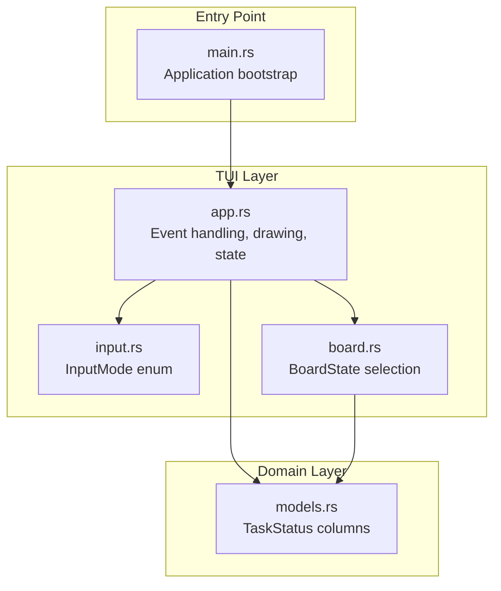
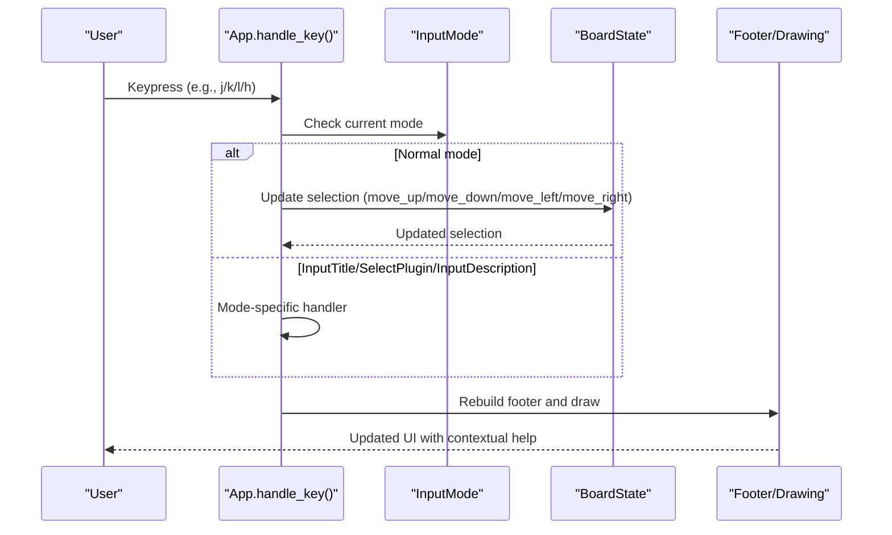
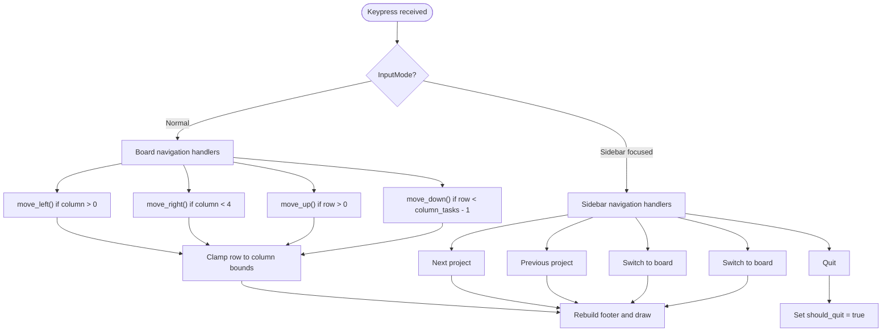
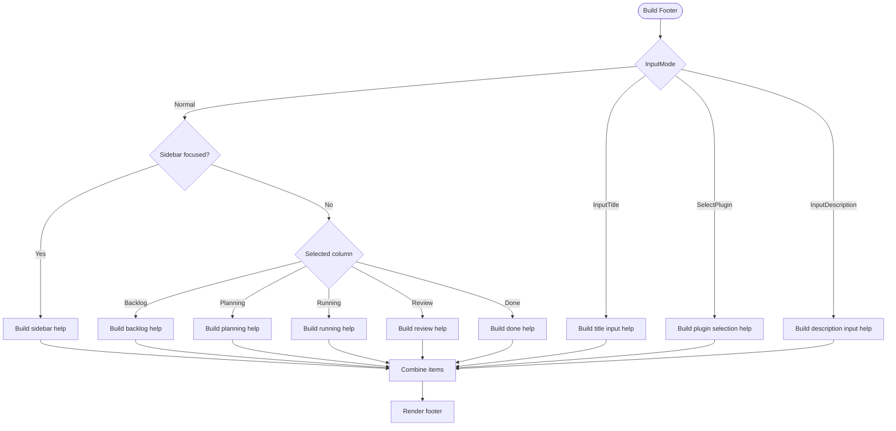
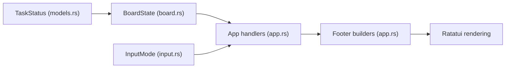

# Navigation and Controls

<cite>
**Referenced Files in This Document**
- [app.rs](file://src/tui/app.rs)
- [input.rs](file://src/tui/input.rs)
- [board.rs](file://src/tui/board.rs)
- [models.rs](file://src/db/models.rs)
- [main.rs](file://src/main.rs)
</cite>

## Table of Contents
1. [Introduction](#introduction)
2. [Project Structure](#project-structure)
3. [Core Components](#core-components)
4. [Architecture Overview](#architecture-overview)
5. [Detailed Component Analysis](#detailed-component-analysis)
6. [Dependency Analysis](#dependency-analysis)
7. [Performance Considerations](#performance-considerations)
8. [Troubleshooting Guide](#troubleshooting-guide)
9. [Conclusion](#conclusion)

## Introduction
This document explains the AGTX terminal interface navigation and keyboard controls. It covers arrow key navigation between tasks and columns, sidebar navigation, column-specific actions, advanced controls, and the dynamic help system. The guide is designed for both new and experienced users to master efficient terminal-based task management.

## Project Structure
AGTX implements a terminal user interface built with Ratatui and Crossterm. The navigation system centers around:
- Input modes controlling available actions
- Board state managing task selection across columns
- Dynamic footer help reflecting current context
- Column-aware keyboard shortcuts

**Diagram sources**
- [app.rs:1-120](file://src/tui/app.rs#L1-L120)
- [input.rs:1-19](file://src/tui/input.rs#L1-L19)
- [board.rs:1-99](file://src/tui/board.rs#L1-L99)
- [models.rs:1-60](file://src/db/models.rs#L1-L60)
- [main.rs:16-96](file://src/main.rs#L16-L96)

**Section sources**
- [app.rs:1189-1201](file://src/tui/app.rs#L1189-L1201)
- [input.rs:1-19](file://src/tui/input.rs#L1-L19)
- [board.rs:1-99](file://src/tui/board.rs#L1-L99)
- [models.rs:1-60](file://src/db/models.rs#L1-L60)
- [main.rs:16-96](file://src/main.rs#L16-L96)

## Core Components
- InputMode: Governs available controls (Normal, InputTitle, SelectPlugin, InputDescription)
- BoardState: Tracks selected column and row for task navigation
- TaskStatus: Defines the five-column Kanban structure (Backlog, Planning, Running, Review, Done)
- Dynamic Footer: Builds contextual help and clickable footer items

Key responsibilities:
- InputMode determines which handler processes keystrokes
- BoardState updates selection and clamps invalid indices
- TaskStatus defines column ordering and phase transitions
- Footer system adapts to input mode, sidebar focus, and column position

**Section sources**
- [input.rs:1-19](file://src/tui/input.rs#L1-L19)
- [board.rs:1-99](file://src/tui/board.rs#L1-L99)
- [models.rs:1-60](file://src/db/models.rs#L1-L60)
- [app.rs:56-199](file://src/tui/app.rs#L56-L199)

## Architecture Overview
The navigation pipeline routes keyboard events through a mode-aware dispatcher, updates state, and redraws the UI with contextual help.

**Diagram sources**
- [app.rs:2698-2781](file://src/tui/app.rs#L2698-L2781)
- [board.rs:52-91](file://src/tui/board.rs#L52-L91)
- [app.rs:56-199](file://src/tui/app.rs#L56-L199)

## Detailed Component Analysis

### Arrow Key Navigation (h/j/k/l) and Focus Areas
- Board navigation: h/left moves left (including to sidebar when in first column), l/right moves right, j/down moves down, k/up moves up
- Sidebar navigation: j/k moves items, Enter switches to board, l switches to board, Esc exits sidebar, q quits
- Cursor movement respects column boundaries and clamps row indices

**Diagram sources**
- [app.rs:3506-3669](file://src/tui/app.rs#L3506-L3669)
- [board.rs:52-91](file://src/tui/board.rs#L52-L91)
- [app.rs:3506-3555](file://src/tui/app.rs#L3506-L3555)

**Section sources**
- [app.rs:3506-3669](file://src/tui/app.rs#L3506-L3669)
- [board.rs:52-91](file://src/tui/board.rs#L52-L91)
- [app.rs:3506-3555](file://src/tui/app.rs#L3506-L3555)

### Column-Specific Shortcuts
- Backlog column (Research): R starts research; Enter opens research session; o creates task; x deletes; d shows diff; m plans; M runs; e toggles sidebar; q quits
- Planning column: o creates task; x deletes; d shows diff; m moves to Running; e toggles sidebar; q quits
- Running column: o creates task; x deletes; d shows diff; m moves to Review; r moves back to Planning; e toggles sidebar; q quits
- Review column: o creates task; x deletes; d shows diff; m moves to Done; r moves back to Running; p advances to Planning (cyclic plugin only); e toggles sidebar; q quits
- Done column: o creates task; x deletes; d shows diff; e toggles sidebar; q quits
- Search: / opens task search popup

Notes:
- Fullscreen behavior: When configured, Enter attaches to tmux fullscreen; otherwise opens task details
- Cyclic plugin: Enables Review→Planning transition via p

**Section sources**
- [app.rs:3579-3657](file://src/tui/app.rs#L3579-L3657)
- [app.rs:3616-3649](file://src/tui/app.rs#L3616-L3649)
- [models.rs:47-56](file://src/db/models.rs#L47-L56)

### Sidebar Navigation Controls
- j/k: Navigate projects
- Enter: Switch to selected project and focus board
- l: Switch to board
- q: Quit

Behavior:
- Sidebar visibility toggles with e in normal mode
- Project switching occurs immediately on cursor movement

**Section sources**
- [app.rs:3508-3555](file://src/tui/app.rs#L3508-L3555)

### Advanced Controls
- Ctrl+f: Attach to tmux fullscreen for the selected task (when available)
- P: Open plugin selection popup
- O: Toggle orchestrator agent (experimental flag required)
- Q: Quit application

Implementation highlights:
- Ctrl+f handled specially in normal mode to bypass standard navigation
- Plugin selection popup allows choosing workflow plugins
- Orchestrator toggle gated by experimental feature flag

**Section sources**
- [app.rs:2762-2773](file://src/tui/app.rs#L2762-L2773)
- [app.rs:3658-3665](file://src/tui/app.rs#L3658-L3665)
- [app.rs:3662-3665](file://src/tui/app.rs#L3662-L3665)

### Dynamic Help Text System
The footer displays context-sensitive commands:
- Normal mode: Shows commands based on focus (sidebar vs board) and selected column
- InputTitle/SelectPlugin/InputDescription: Mode-specific overlays and help
- Footer items are clickable and support F2 navigation

Help construction logic:
- build_footer_text: Generates static help string based on mode, focus, column, plugin capabilities, and fullscreen setting
- build_footer_items: Creates clickable footer items with trigger KeyEvents for mouse/F2 navigation

**Diagram sources**
- [app.rs:244-292](file://src/tui/app.rs#L244-L292)
- [app.rs:59-199](file://src/tui/app.rs#L59-L199)

**Section sources**
- [app.rs:244-292](file://src/tui/app.rs#L244-L292)
- [app.rs:59-199](file://src/tui/app.rs#L59-L199)

### Input Modes and Available Controls
- Normal: Full navigation and column actions
- InputTitle: Title entry with ESC/Enter navigation
- SelectPlugin: Plugin selection with j/k, Tab, Enter, ESC
- InputDescription: Prompt entry with ESC/Enter navigation and search features

Mode transitions:
- Normal → InputTitle on o
- InputTitle → SelectPlugin on Enter (after title)
- SelectPlugin → InputDescription on Enter
- InputDescription → Normal on Save/Cancel

**Section sources**
- [input.rs:1-19](file://src/tui/input.rs#L1-L19)
- [app.rs:3579-3669](file://src/tui/app.rs#L3579-L3669)
- [app.rs:3671-3748](file://src/tui/app.rs#L3671-L3748)
- [app.rs:3750-3779](file://src/tui/app.rs#L3750-L3779)
- [app.rs:4246-4299](file://src/tui/app.rs#L4246-L4299)

### Practical Navigation Workflows

#### Create a new task
1. Navigate to Backlog column
2. Press o to enter title input
3. Type title and press Enter
4. Choose plugin (SelectPlugin mode) or accept default
5. Enter description (InputDescription mode) or leave blank
6. Save to create task in Backlog

#### Start research and move to planning
1. Select a Backlog task
2. Press R to start research (opens tmux session)
3. Press Enter to attach to fullscreen session
4. When ready, press M to move to Running
5. Press m to move to Planning

#### Move a task through phases
1. Select task in Running
2. Press m to move to Review
3. In Review, press m to move to Done
4. Optional: If cyclic plugin enabled, press p to move Review to Planning

#### Use search and references
1. Press / to open task search
2. Type query and select task
3. In description input, press ! to reference tasks
4. Press # or @ to insert file paths

#### Toggle sidebar and focus
1. Press e to toggle sidebar visibility
2. In sidebar, use j/k to navigate projects
3. Press Enter to switch to selected project and focus board
4. Press l to switch to board from sidebar

**Section sources**
- [app.rs:3579-3669](file://src/tui/app.rs#L3579-L3669)
- [app.rs:3616-3649](file://src/tui/app.rs#L3616-L3649)
- [app.rs:3658-3665](file://src/tui/app.rs#L3658-L3665)
- [app.rs:4120-4199](file://src/tui/app.rs#L4120-L4199)

## Dependency Analysis
The navigation system depends on:
- TaskStatus for column ordering and phase transitions
- BoardState for selection management
- InputMode for control gating
- Footer builders for contextual help

**Diagram sources**
- [models.rs:47-56](file://src/db/models.rs#L47-L56)
- [board.rs:1-99](file://src/tui/board.rs#L1-L99)
- [input.rs:1-19](file://src/tui/input.rs#L1-L19)
- [app.rs:56-199](file://src/tui/app.rs#L56-L199)

**Section sources**
- [models.rs:47-56](file://src/db/models.rs#L47-L56)
- [board.rs:1-99](file://src/tui/board.rs#L1-L99)
- [input.rs:1-19](file://src/tui/input.rs#L1-L19)
- [app.rs:56-199](file://src/tui/app.rs#L56-L199)

## Performance Considerations
- Footer rebuilds occur every frame; keep help text concise
- Selection clamping prevents expensive lookups by validating indices before queries
- Fullscreen attachment bypasses normal navigation to reduce overhead

## Troubleshooting Guide
Common issues and resolutions:
- Keys not responding: Ensure you are in Normal mode; input modes override navigation
- Sidebar not focusing: Press l from Backlog column or Enter in sidebar to focus board
- Fullscreen not working: Verify task has a session name; Ctrl+f only works when a tmux session exists
- Plugin selection not appearing: Confirm workflow plugin configuration and experimental flag
- Help text incorrect: Check column position and plugin capabilities; footer adapts dynamically

**Section sources**
- [app.rs:2698-2781](file://src/tui/app.rs#L2698-L2781)
- [app.rs:3567-3576](file://src/tui/app.rs#L3567-L3576)
- [app.rs:3658-3665](file://src/tui/app.rs#L3658-L3665)

## Conclusion
AGTX provides a comprehensive keyboard-driven navigation system optimized for terminal productivity. By understanding input modes, column-specific actions, and the dynamic help system, users can efficiently manage tasks across phases while leveraging advanced controls like fullscreen sessions, plugin selection, and orchestrator toggles.