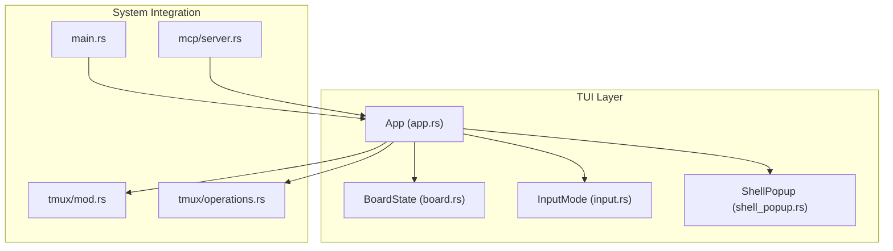
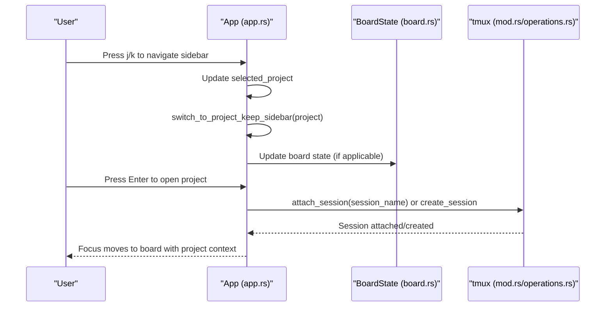
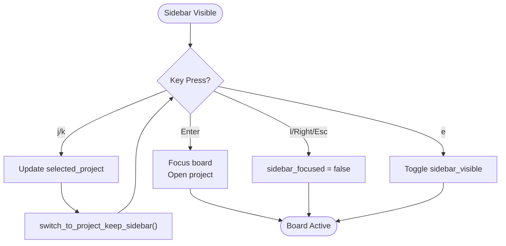
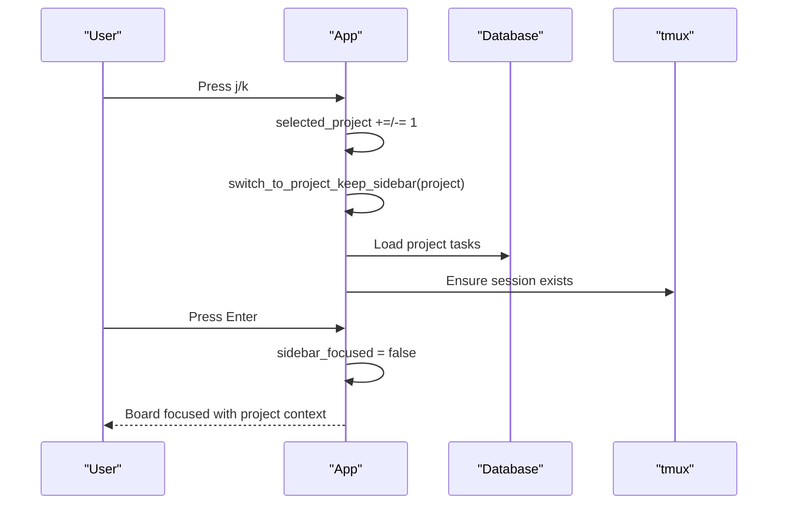
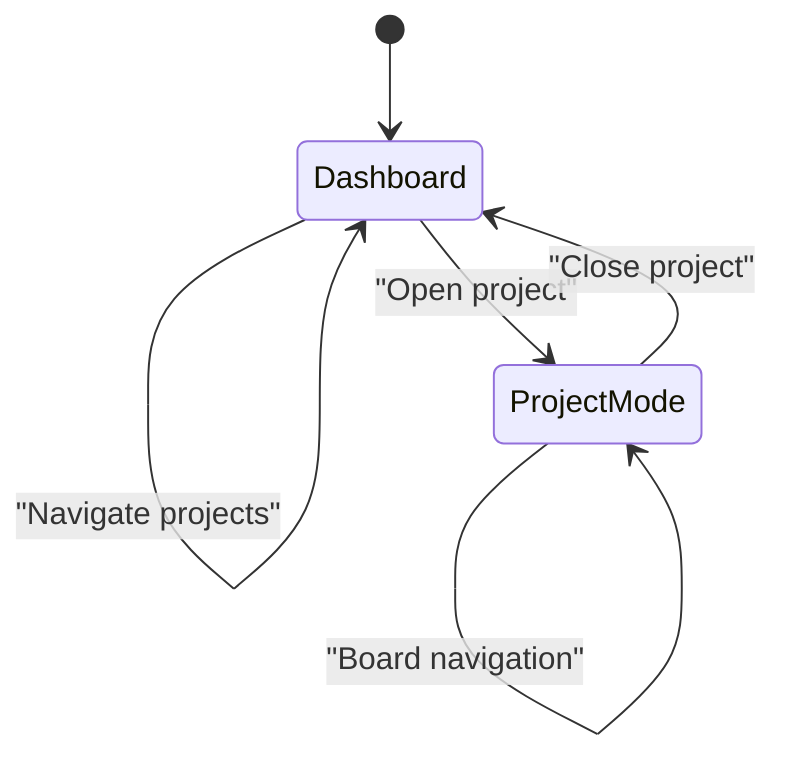
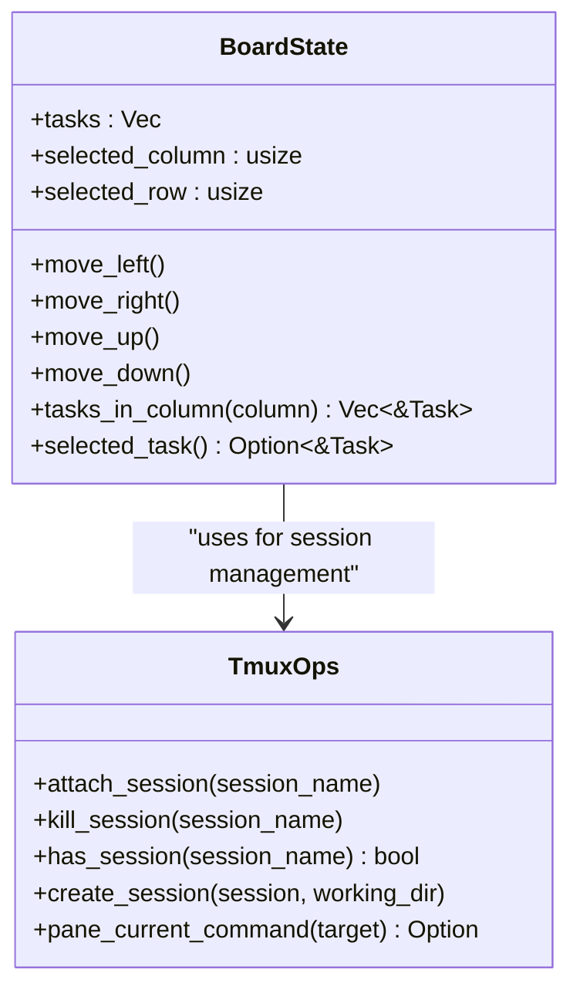
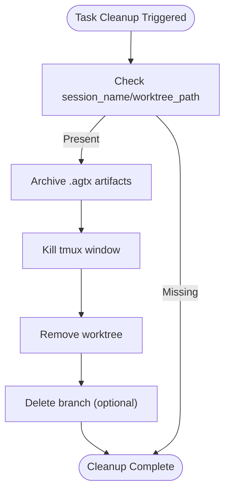
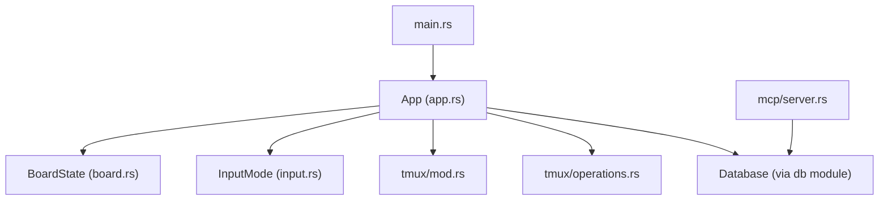

# Project Sidebar and Navigation

<cite>
**Referenced Files in This Document**
- [app.rs](file://src/tui/app.rs)
- [board.rs](file://src/tui/board.rs)
- [input.rs](file://src/tui/input.rs)
- [shell_popup.rs](file://src/tui/shell_popup.rs)
- [mod.rs](file://src/tmux/mod.rs)
- [operations.rs](file://src/tmux/operations.rs)
- [main.rs](file://src/main.rs)
- [server.rs](file://src/mcp/server.rs)
</cite>

## Table of Contents
1. [Introduction](#introduction)
2. [Project Structure](#project-structure)
3. [Core Components](#core-components)
4. [Architecture Overview](#architecture-overview)
5. [Detailed Component Analysis](#detailed-component-analysis)
6. [Dependency Analysis](#dependency-analysis)
7. [Performance Considerations](#performance-considerations)
8. [Troubleshooting Guide](#troubleshooting-guide)
9. [Conclusion](#conclusion)

## Introduction
This document explains the AGTX project sidebar and navigation system with a focus on multi-project management and workspace switching. It covers the sidebar layout, project selection mechanisms, keyboard navigation (j/k), project activation (Enter), sidebar visibility controls (e), and the dashboard versus project-specific modes. It also documents the relationship between projects and tmux sessions, project recovery for lost sessions, and cleanup procedures.

## Project Structure
The sidebar and navigation functionality is implemented in the TUI module, with tight integration to tmux session management and database-backed project/task state.

**Diagram sources**
- [app.rs](file://src/tui/app.rs)
- [board.rs](file://src/tui/board.rs)
- [input.rs](file://src/tui/input.rs)
- [shell_popup.rs](file://src/tui/shell_popup.rs)
- [mod.rs](file://src/tmux/mod.rs)
- [operations.rs](file://src/tmux/operations.rs)
- [main.rs](file://src/main.rs)
- [server.rs](file://src/mcp/server.rs)

**Section sources**
- [app.rs](file://src/tui/app.rs)
- [board.rs](file://src/tui/board.rs)
- [input.rs](file://src/tui/input.rs)
- [shell_popup.rs](file://src/tui/shell_popup.rs)
- [mod.rs](file://src/tmux/mod.rs)
- [operations.rs](file://src/tmux/operations.rs)
- [main.rs](file://src/main.rs)
- [server.rs](file://src/mcp/server.rs)

## Core Components
- Sidebar and project list: renders a list of tracked projects, supports keyboard navigation (j/k), Enter to open, and e to hide/show.
- Board navigation: Kanban board with column/row selection and keyboard controls (h/j/k/l).
- tmux integration: attaching to sessions, creating sessions, checking session existence, and killing sessions.
- Dashboard mode: lists projects and allows quick project opening.
- Project-specific mode: focused board view with project context.
- Project recovery and cleanup: background cleanup of resources, archival of artifacts, and resource removal.

**Section sources**
- [app.rs](file://src/tui/app.rs)
- [board.rs](file://src/tui/board.rs)
- [mod.rs](file://src/tmux/mod.rs)
- [operations.rs](file://src/tmux/operations.rs)

## Architecture Overview
The sidebar and navigation system centers on the App state machine, which manages:
- Sidebar visibility and focus
- Project list population and selection
- Board state and navigation
- tmux session lifecycle
- Keyboard and mouse interactions

**Diagram sources**
- [app.rs](file://src/tui/app.rs)
- [board.rs](file://src/tui/board.rs)
- [mod.rs](file://src/tmux/mod.rs)
- [operations.rs](file://src/tmux/operations.rs)

## Detailed Component Analysis

### Sidebar Layout and Project List
- The sidebar displays a list of tracked projects with names and selection markers.
- Keyboard navigation:
  - j/k: move selection up/down
  - Enter: open selected project (focus moves to board)
  - l or Right or Esc: move focus back to board
  - e: toggle sidebar visibility
- The sidebar is drawn conditionally based on visibility and focus state.

**Diagram sources**
- [app.rs](file://src/tui/app.rs)

**Section sources**
- [app.rs](file://src/tui/app.rs)

### Project Selection and Activation
- Project selection updates the selected_project index and immediately switches to the project while keeping the sidebar visible.
- Activation (Enter) focuses the board and opens the project context.

**Diagram sources**
- [app.rs](file://src/tui/app.rs)

**Section sources**
- [app.rs](file://src/tui/app.rs)

### Dashboard Mode vs Project-Specific Mode
- Dashboard mode shows a project list with navigation and options to open or create projects.
- Project-specific mode shows the Kanban board with project context and tmux session integration.

**Diagram sources**
- [app.rs](file://src/tui/app.rs)

**Section sources**
- [app.rs](file://src/tui/app.rs)

### Board Navigation and tmux Integration
- Board navigation uses h/j/k/l for column/row movement.
- Enter on a task opens either a fullscreen tmux session or a shell popup depending on configuration.
- tmux integration includes attaching, creating, checking existence, and killing sessions.

**Diagram sources**
- [board.rs](file://src/tui/board.rs)
- [operations.rs](file://src/tmux/operations.rs)

**Section sources**
- [board.rs](file://src/tui/board.rs)
- [operations.rs](file://src/tmux/operations.rs)

### Project Information Display
- The sidebar shows project names and selection markers.
- The dashboard shows project names with navigation hints.
- Project information includes repository names and paths stored in the global database.

**Section sources**
- [app.rs](file://src/tui/app.rs)
- [server.rs](file://src/mcp/server.rs)

### Project Recovery and Cleanup Procedures
- Cleanup resources: archives artifacts, kills tmux windows, removes worktrees, and deletes branches when tasks are deleted or moved to Done.
- Recovery: ensures sessions exist before opening tasks; creates sessions if missing; sanitizes project names for tmux session names.

**Diagram sources**
- [app.rs](file://src/tui/app.rs)
- [operations.rs](file://src/tmux/operations.rs)

**Section sources**
- [app.rs](file://src/tui/app.rs)
- [operations.rs](file://src/tmux/operations.rs)

## Dependency Analysis
The sidebar and navigation system depends on:
- TUI rendering and state management (App, BoardState, InputMode)
- tmux operations for session lifecycle
- Database for project and task persistence
- MCP server for project listing in external contexts

**Diagram sources**
- [app.rs](file://src/tui/app.rs)
- [board.rs](file://src/tui/board.rs)
- [input.rs](file://src/tui/input.rs)
- [mod.rs](file://src/tmux/mod.rs)
- [operations.rs](file://src/tmux/operations.rs)
- [server.rs](file://src/mcp/server.rs)
- [main.rs](file://src/main.rs)

**Section sources**
- [app.rs](file://src/tui/app.rs)
- [board.rs](file://src/tui/board.rs)
- [input.rs](file://src/tui/input.rs)
- [mod.rs](file://src/tmux/mod.rs)
- [operations.rs](file://src/tmux/operations.rs)
- [server.rs](file://src/mcp/server.rs)
- [main.rs](file://src/main.rs)

## Performance Considerations
- Sidebar updates and project switching are immediate to maintain responsive navigation.
- tmux operations are invoked only when needed (attach/create/check/kill).
- Background cleanup threads prevent blocking the UI.

## Troubleshooting Guide
Common issues and resolutions:
- Sidebar does not appear: Press e to toggle sidebar visibility; ensure the sidebar is visible before attempting navigation.
- Cannot switch projects: Verify j/k navigation is active; ensure the sidebar is focused.
- Lost tmux session: Use cleanup procedures to remove stale resources; recreate sessions as needed.
- Project not listed: Confirm the project is tracked in the global database; use the MCP server to list projects if integrating externally.

**Section sources**
- [app.rs](file://src/tui/app.rs)
- [operations.rs](file://src/tmux/operations.rs)
- [server.rs](file://src/mcp/server.rs)

## Conclusion
The AGTX sidebar and navigation system provides efficient multi-project management with keyboard-driven workflows, tmux session integration, and robust project recovery and cleanup procedures. Users can quickly switch between projects, focus on specific boards, and manage resources with confidence.