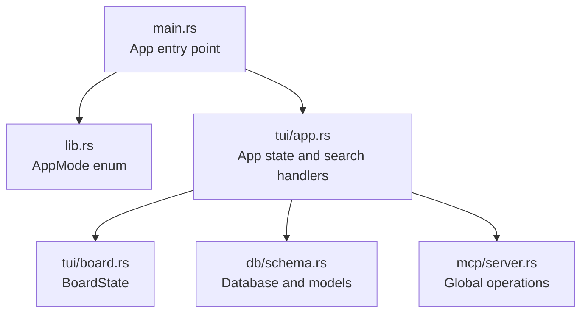
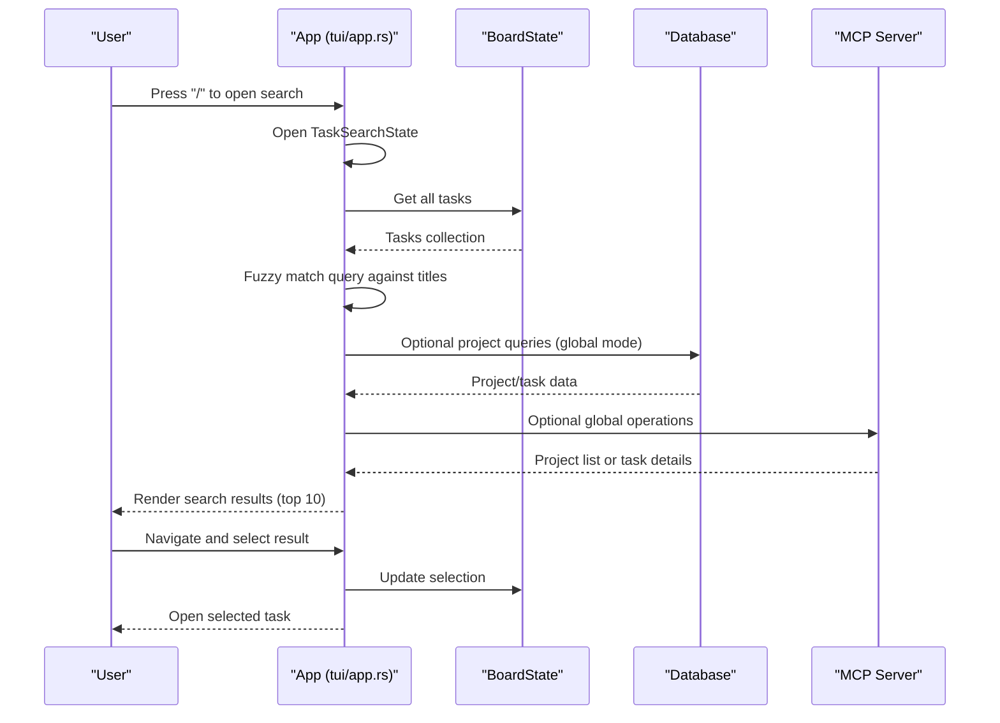
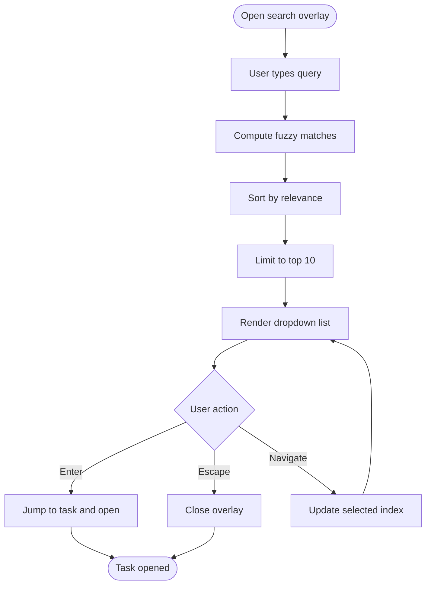
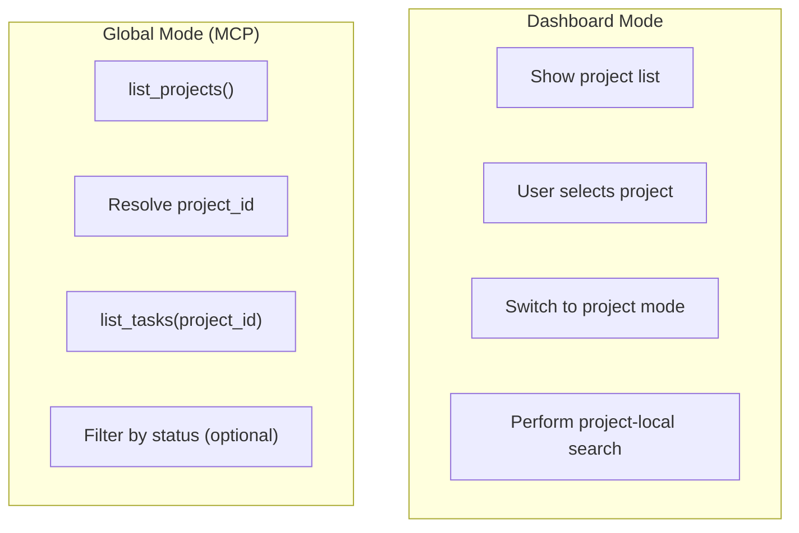
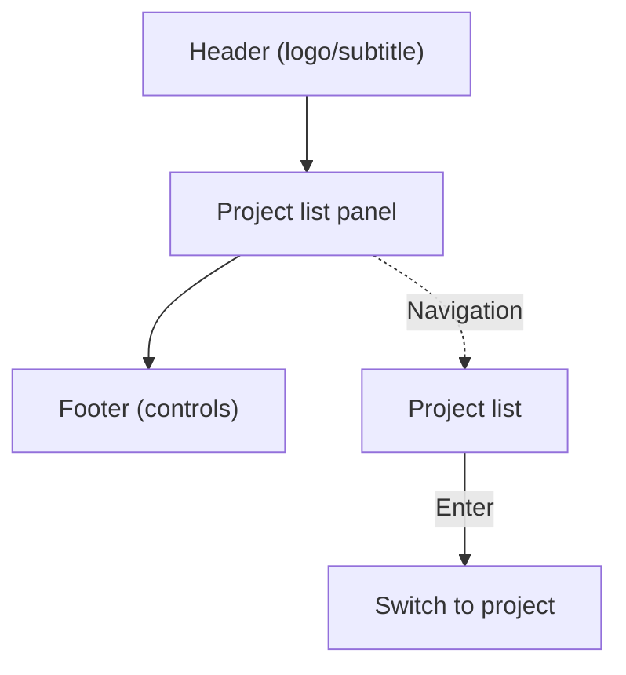
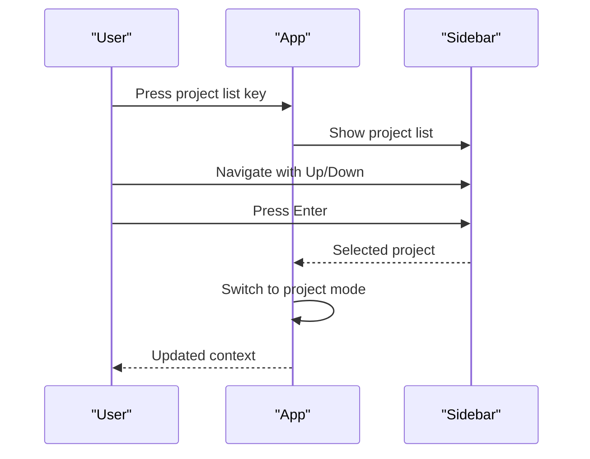
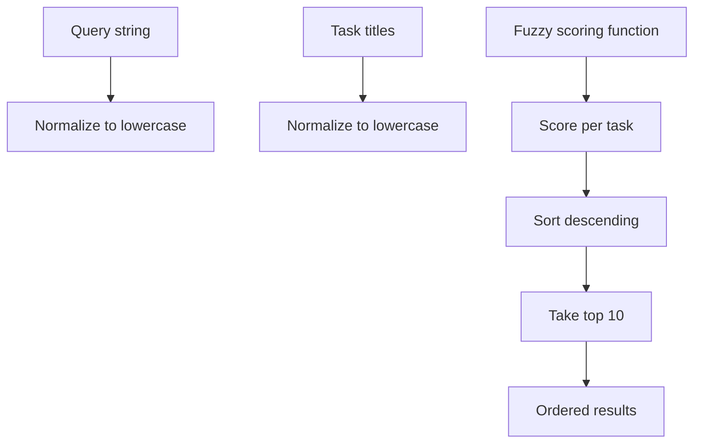
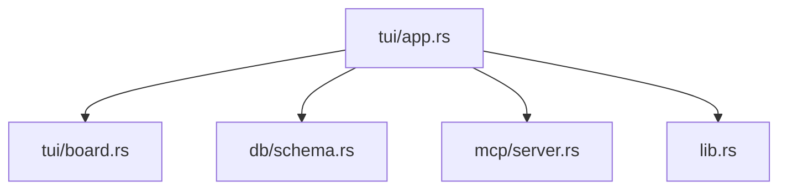

# Project Dashboard Search

<cite>
**Referenced Files in This Document**
- [main.rs](file://src/main.rs)
- [lib.rs](file://src/lib.rs)
- [app.rs](file://src/tui/app.rs)
- [board.rs](file://src/tui/board.rs)
- [schema.rs](file://src/db/schema.rs)
- [server.rs](file://src/mcp/server.rs)
</cite>

## Table of Contents
1. [Introduction](#introduction)
2. [Project Structure](#project-structure)
3. [Core Components](#core-components)
4. [Architecture Overview](#architecture-overview)
5. [Detailed Component Analysis](#detailed-component-analysis)
6. [Dependency Analysis](#dependency-analysis)
7. [Performance Considerations](#performance-considerations)
8. [Troubleshooting Guide](#troubleshooting-guide)
9. [Conclusion](#conclusion)

## Introduction
This document explains the project dashboard search system used for multi-project management in the application. It covers how search operates across multiple projects simultaneously, the search scope options available, the dashboard layout, how search results are organized by project, project filtering options, and the project selection workflow. It also details how search results are prioritized when multiple projects match the query and provides examples of cross-project search scenarios.

## Project Structure
The search system spans several modules:
- Application entry and mode selection
- TUI application state and rendering
- Kanban board state management
- Database schema for tasks and projects
- MCP server for global operations

**Diagram sources**
- [main.rs:16-59](file://src/main.rs#L16-L59)
- [lib.rs:12-16](file://src/lib.rs#L12-L16)
- [app.rs:793-800](file://src/tui/app.rs#L793-L800)
- [board.rs:4-99](file://src/tui/board.rs#L4-L99)
- [schema.rs:1-115](file://src/db/schema.rs#L1-L115)
- [server.rs:409-436](file://src/mcp/server.rs#L409-L436)

**Section sources**
- [main.rs:16-59](file://src/main.rs#L16-L59)
- [lib.rs:12-16](file://src/lib.rs#L12-L16)
- [app.rs:793-800](file://src/tui/app.rs#L793-L800)

## Core Components
- AppMode determines whether the application runs in Dashboard or Project mode.
- AppState holds the global database, project list, and search state.
- BoardState manages the kanban board tasks and selection.
- Database provides access to tasks and projects.
- MCP server supports global operations including project discovery.

Key responsibilities:
- Dashboard mode enables cross-project search and project selection.
- Project mode focuses on a single project's tasks.
- Search uses fuzzy matching and prioritizes results by relevance.

**Section sources**
- [lib.rs:12-16](file://src/lib.rs#L12-L16)
- [app.rs:497-610](file://src/tui/app.rs#L497-L610)
- [board.rs:4-99](file://src/tui/board.rs#L4-L99)
- [schema.rs:451-455](file://src/db/schema.rs#L451-L455)
- [server.rs:409-436](file://src/mcp/server.rs#L409-L436)

## Architecture Overview
The dashboard search system integrates UI state, fuzzy search logic, and database access to provide cross-project search capabilities.

**Diagram sources**
- [app.rs:2904-2907](file://src/tui/app.rs#L2904-L2907)
- [app.rs:3321-3437](file://src/tui/app.rs#L3321-L3437)
- [app.rs:3439-3471](file://src/tui/app.rs#L3439-L3471)
- [board.rs:4-99](file://src/tui/board.rs#L4-L99)
- [schema.rs:451-455](file://src/db/schema.rs#L451-L455)
- [server.rs:409-436](file://src/mcp/server.rs#L409-L436)

## Detailed Component Analysis

### Dashboard Search Implementation
The search is implemented as a modal overlay that appears when the user presses the search key. It maintains a TaskSearchState with query, matches, and selected index. The fuzzy matching function computes relevance scores and sorts results.

Key behaviors:
- Modal overlay with input field and dropdown list
- Live filtering as the user types
- Navigation with arrow keys, Tab/Shift+Tab, and Ctrl+j/k
- Selection opens the chosen task in the board

**Diagram sources**
- [app.rs:3321-3437](file://src/tui/app.rs#L3321-L3437)
- [app.rs:3439-3471](file://src/tui/app.rs#L3439-L3471)

**Section sources**
- [app.rs:2904-2907](file://src/tui/app.rs#L2904-L2907)
- [app.rs:3321-3437](file://src/tui/app.rs#L3321-L3437)
- [app.rs:3439-3471](file://src/tui/app.rs#L3439-L3471)

### Cross-Project Search Scope
Cross-project search is supported in Dashboard mode. The system retrieves tasks from the current project context and applies fuzzy matching locally. In global mode (via MCP), project-specific operations require a project_id.

Scope options:
- Dashboard mode: Search within current project context
- Global mode: Requires project_id for operations; project selection precedes search

**Diagram sources**
- [app.rs:3675-3705](file://src/tui/app.rs#L3675-L3705)
- [server.rs:525](file://src/mcp/server.rs#L525)
- [server.rs:545-558](file://src/mcp/server.rs#L545-L558)

**Section sources**
- [app.rs:3675-3705](file://src/tui/app.rs#L3675-L3705)
- [server.rs:525](file://src/mcp/server.rs#L525)
- [server.rs:545-558](file://src/mcp/server.rs#L545-L558)

### Dashboard Layout and Project Organization
The dashboard layout consists of:
- Header area for branding
- Project list area for quick navigation
- Footer area for controls

Project filtering:
- Users can browse projects and switch to a specific project
- Project selection updates the current context for subsequent operations

**Diagram sources**
- [app.rs:2709-2720](file://src/tui/app.rs#L2709-L2720)
- [app.rs:2663-2707](file://src/tui/app.rs#L2663-L2707)
- [app.rs:3675-3705](file://src/tui/app.rs#L3675-L3705)

**Section sources**
- [app.rs:2709-2720](file://src/tui/app.rs#L2709-L2720)
- [app.rs:2663-2707](file://src/tui/app.rs#L2663-L2707)
- [app.rs:3675-3705](file://src/tui/app.rs#L3675-L3705)

### Project Filtering and Selection Workflow
Project filtering allows narrowing results to a specific project:
- Press the project list key to reveal the project list
- Navigate with Up/Down or j/k
- Press Enter to switch to the selected project
- Esc closes the project list without switching

**Diagram sources**
- [app.rs:3675-3705](file://src/tui/app.rs#L3675-L3705)

**Section sources**
- [app.rs:3675-3705](file://src/tui/app.rs#L3675-L3705)

### Search Result Prioritization
Search results are prioritized by a fuzzy matching algorithm that computes a relevance score for each task title. Matches are sorted by score (highest first) and limited to the top 10 results.

**Diagram sources**
- [app.rs:3439-3471](file://src/tui/app.rs#L3439-L3471)

**Section sources**
- [app.rs:3439-3471](file://src/tui/app.rs#L3439-L3471)

### Examples of Cross-Project Search Scenarios
- Searching for tasks across all projects: In Dashboard mode, the system searches within the current project context. To search across multiple projects, users can switch projects individually or use global operations that require project_id resolution.
- Filtering by project name: Users can filter the project list by typing part of the project name; the list narrows to matching entries.
- Prioritization across projects: When switching projects, the fuzzy search prioritizes results within the current project context. There is no cross-project ranking across different databases in the current implementation.

**Section sources**
- [app.rs:3675-3705](file://src/tui/app.rs#L3675-L3705)
- [server.rs:409-436](file://src/mcp/server.rs#L409-L436)

## Dependency Analysis
The search system depends on:
- App state for UI and search state
- Board state for task data
- Database for task retrieval
- MCP server for global operations

**Diagram sources**
- [app.rs:793-800](file://src/tui/app.rs#L793-L800)
- [board.rs:4-99](file://src/tui/board.rs#L4-L99)
- [schema.rs:1-115](file://src/db/schema.rs#L1-L115)
- [server.rs:409-436](file://src/mcp/server.rs#L409-L436)
- [lib.rs:12-16](file://src/lib.rs#L12-L16)

**Section sources**
- [app.rs:793-800](file://src/tui/app.rs#L793-L800)
- [board.rs:4-99](file://src/tui/board.rs#L4-L99)
- [schema.rs:1-115](file://src/db/schema.rs#L1-L115)
- [server.rs:409-436](file://src/mcp/server.rs#L409-L436)
- [lib.rs:12-16](file://src/lib.rs#L12-L16)

## Performance Considerations
- Fuzzy matching is computed on the client side against the current project's tasks. For large datasets, consider indexing or caching strategies.
- Limiting results to the top 10 reduces rendering overhead.
- In global mode, project resolution adds a database lookup step; batching operations where possible can improve responsiveness.

## Troubleshooting Guide
Common issues and resolutions:
- Search not returning results: Ensure the query is not empty and that tasks exist in the current project context.
- Project switching does nothing: Verify the project list is visible and a project is selected before attempting to switch.
- Global operations failing: Confirm project_id is provided when required by MCP endpoints.

**Section sources**
- [app.rs:3395-3410](file://src/tui/app.rs#L3395-L3410)
- [app.rs:3675-3705](file://src/tui/app.rs#L3675-L3705)
- [server.rs:417-427](file://src/mcp/server.rs#L417-L427)

## Conclusion
The dashboard search system provides efficient cross-project navigation and task discovery through a modal search interface, fuzzy matching, and project selection workflows. While search is primarily scoped to the current project context, the dashboard layout and project list enable quick switching between projects. For global operations requiring project_id, the MCP server facilitates project-aware task queries.