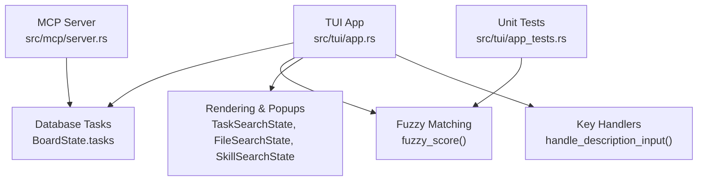
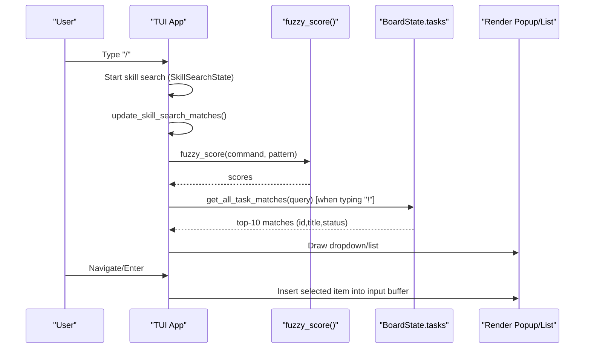
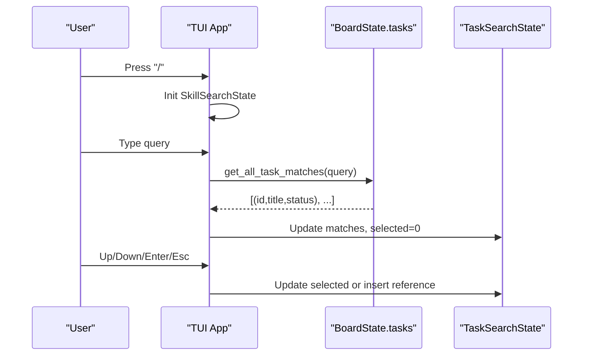
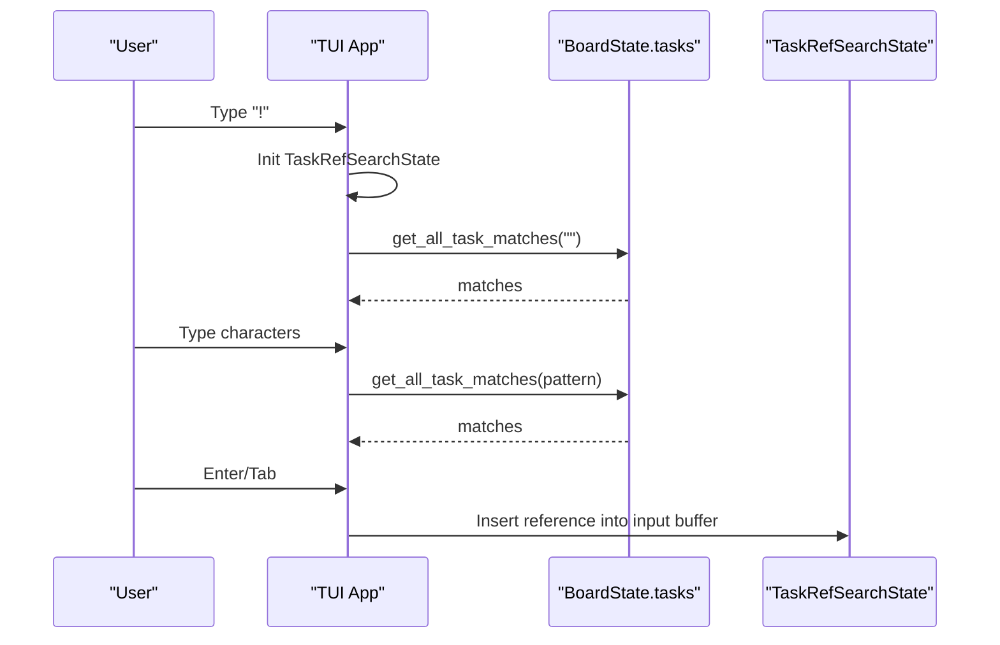
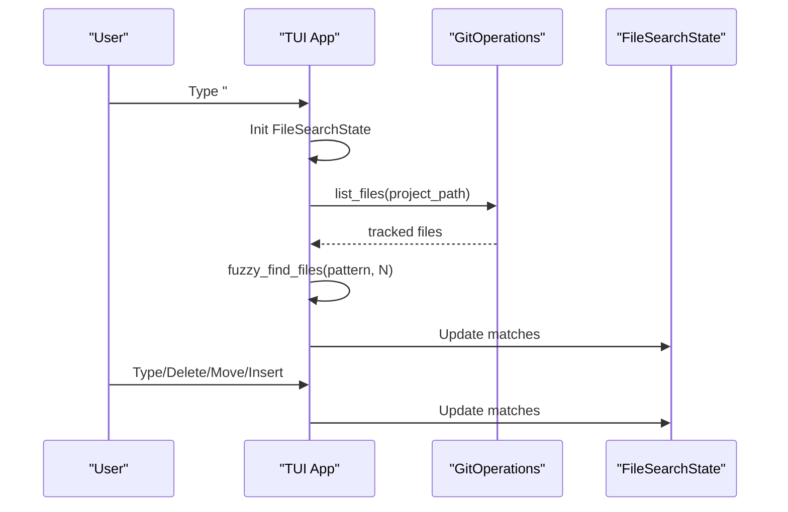
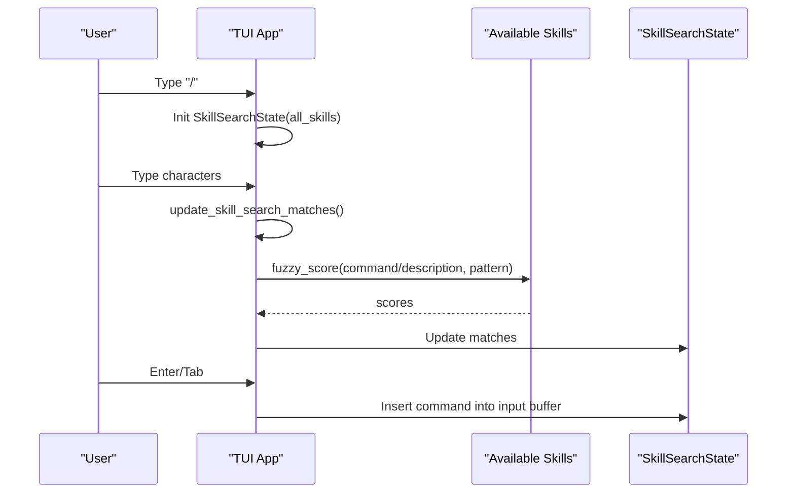
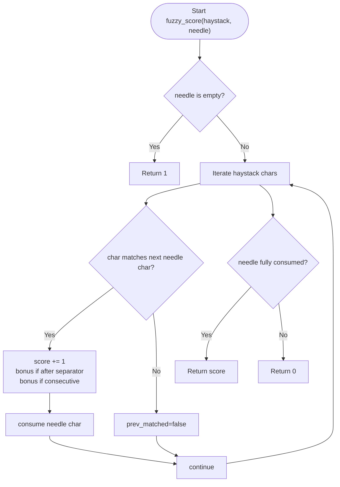
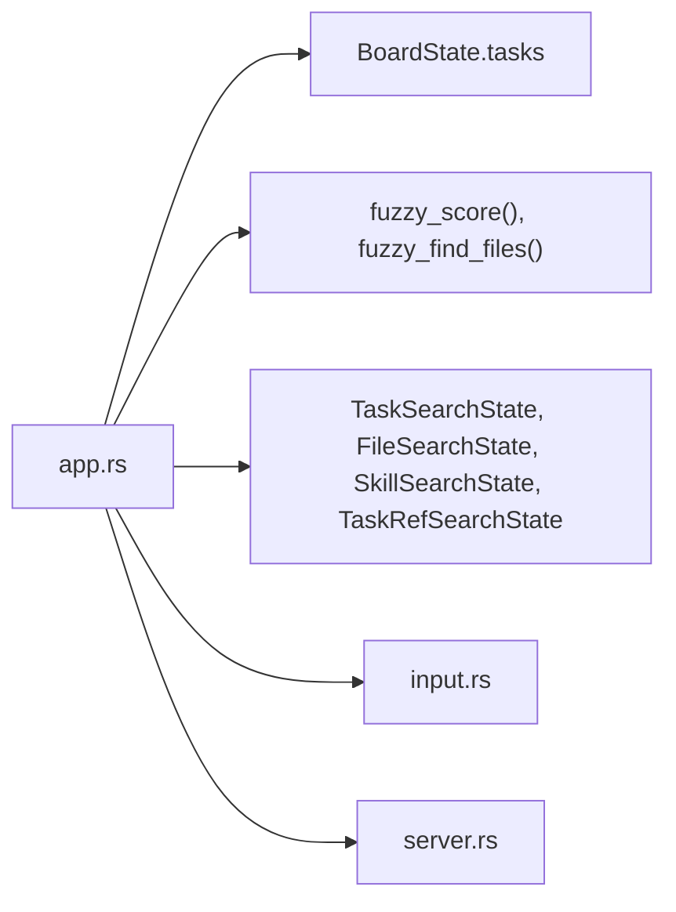

# Search and Filtering Capabilities

<cite>
**Referenced Files in This Document**
- [app.rs](file://src/tui/app.rs)
- [input.rs](file://src/tui/input.rs)
- [server.rs](file://src/mcp/server.rs)
- [app_tests.rs](file://src/tui/app_tests.rs)
</cite>

## Table of Contents
1. [Introduction](#introduction)
2. [Project Structure](#project-structure)
3. [Core Components](#core-components)
4. [Architecture Overview](#architecture-overview)
5. [Detailed Component Analysis](#detailed-component-analysis)
6. [Dependency Analysis](#dependency-analysis)
7. [Performance Considerations](#performance-considerations)
8. [Troubleshooting Guide](#troubleshooting-guide)
9. [Conclusion](#conclusion)

## Introduction
This document explains the search and filtering capabilities in agtx, focusing on:
- Task search accessible via the "/" key with incremental filtering by task title
- Multi-project dashboard search and sidebar filtering
- File search, skill search, and task reference search within task descriptions
- Search syntax, pattern matching algorithms, and result ranking
- Examples of complex search queries and navigation
- Performance considerations and optimization tips for large task sets

## Project Structure
The search and filtering features are implemented primarily in the TUI application module, with supporting logic for fuzzy matching and database-backed task retrieval. The MCP server provides task listing APIs used by the UI.

**Diagram sources**
- [app.rs:3438-3637](file://src/tui/app.rs#L3438-L3637)
- [app.rs:7896-8095](file://src/tui/app.rs#L7896-L8095)
- [server.rs:545-569](file://src/mcp/server.rs#L545-L569)
- [app_tests.rs:631-676](file://src/tui/app_tests.rs#L631-L676)

**Section sources**
- [app.rs:1-200](file://src/tui/app.rs#L1-L200)
- [input.rs:1-19](file://src/tui/input.rs#L1-L19)
- [server.rs:545-569](file://src/mcp/server.rs#L545-L569)

## Core Components
- Task search popup: Incremental search by task title with fuzzy scoring and top-10 results
- File search dropdown: Fuzzy file discovery respecting .gitignore
- Skill search dropdown: Fuzzy matching of skill commands and descriptions
- Task reference search: Insert task references into descriptions with fuzzy filtering
- Dashboard and sidebar: Project-level search and filtering driven by the board’s task list

Key structures:
- TaskSearchState: query, matches, selected
- FileSearchState: pattern, matches, selected, start_pos, trigger_char
- SkillSearchState: pattern, matches, all_skills, selected, start_pos
- TaskRefSearchState: pattern, matches, selected, start_pos

**Section sources**
- [app.rs:703-762](file://src/tui/app.rs#L703-L762)
- [app.rs:1912-1972](file://src/tui/app.rs#L1912-L1972)
- [app.rs:1736-1896](file://src/tui/app.rs#L1736-L1896)

## Architecture Overview
The search pipeline integrates UI input, fuzzy matching, and rendering:

**Diagram sources**
- [app.rs:4350-4428](file://src/tui/app.rs#L4350-L4428)
- [app.rs:4449-4474](file://src/tui/app.rs#L4449-L4474)
- [app.rs:3438-3471](file://src/tui/app.rs#L3438-L3471)
- [app.rs:7941-7983](file://src/tui/app.rs#L7941-L7983)

## Detailed Component Analysis

### Task Search Popup (/ key)
- Trigger: "/" at start-of-line or after whitespace in description input
- Behavior: Opens a centered popup with an incremental search field and a ranked list of tasks by title
- Ranking: Fuzzy score of lowercase title vs. lowercase query; ties sorted by task relevance
- Navigation: Up/Down arrows or Ctrl+j/k to move; Enter to jump to task; Esc to cancel
- Selection inserts a reference into the input buffer

**Diagram sources**
- [app.rs:4350-4428](file://src/tui/app.rs#L4350-L4428)
- [app.rs:3438-3471](file://src/tui/app.rs#L3438-L3471)
- [app.rs:1912-1972](file://src/tui/app.rs#L1912-L1972)

**Section sources**
- [app.rs:4350-4428](file://src/tui/app.rs#L4350-L4428)
- [app.rs:3438-3471](file://src/tui/app.rs#L3438-L3471)
- [app.rs:1912-1972](file://src/tui/app.rs#L1912-L1972)

### Task Reference Search (! key)
- Trigger: "!" at start-of-line, after space, or after newline in description input
- Behavior: Lists tasks matching the current query; supports inserting a formatted reference into the description
- Navigation: Up/Down to select; Tab/Enter to insert; Backspace to delete characters and cancel when empty

**Diagram sources**
- [app.rs:4401-4428](file://src/tui/app.rs#L4401-L4428)
- [app.rs:4011-4100](file://src/tui/app.rs#L4011-L4100)
- [app.rs:3438-3471](file://src/tui/app.rs#L3438-L3471)

**Section sources**
- [app.rs:4401-4428](file://src/tui/app.rs#L4401-L4428)
- [app.rs:4011-4100](file://src/tui/app.rs#L4011-L4100)
- [app.rs:3438-3471](file://src/tui/app.rs#L3438-L3471)

### File Search Dropdown (# or @ key)
- Trigger: "#" or "@" at cursor position in description input
- Behavior: Fuzzy-find files under the project path, respecting .gitignore; shows top-N results
- Navigation: Up/Down or Ctrl+j/k to move; Tab/Enter to insert; Esc to cancel

**Diagram sources**
- [app.rs:4329-4349](file://src/tui/app.rs#L4329-L4349)
- [app.rs:4438-4447](file://src/tui/app.rs#L4438-L4447)
- [app.rs:7896-7939](file://src/tui/app.rs#L7896-L7939)

**Section sources**
- [app.rs:4329-4349](file://src/tui/app.rs#L4329-L4349)
- [app.rs:4438-4447](file://src/tui/app.rs#L4438-L4447)
- [app.rs:7896-7939](file://src/tui/app.rs#L7896-L7939)

### Skill Search Dropdown (/ key)
- Trigger: "/" at start-of-line or after whitespace in description input
- Behavior: Builds a list of available skills (bundled + project-specific), fuzzy-ranks by command or description, and allows insertion of the selected command into the input buffer

**Diagram sources**
- [app.rs:4350-4428](file://src/tui/app.rs#L4350-L4428)
- [app.rs:4449-4474](file://src/tui/app.rs#L4449-L4474)

**Section sources**
- [app.rs:4350-4428](file://src/tui/app.rs#L4350-L4428)
- [app.rs:4449-4474](file://src/tui/app.rs#L4449-L4474)

### Pattern Matching Algorithms and Ranking
- Fuzzy scoring:
  - Case-insensitive comparison
  - Word boundary bonus for matches after separators
  - Consecutive match bonus
  - Score is zero if not all characters of the pattern are matched in order
- Ranking:
  - Tasks: sort by fuzzy score descending; cap at 10
  - Files: sort by fuzzy score descending; cap at N
  - Skills: filter by max of fuzzy(command) and fuzzy(description); sort by score descending; cap at 10

**Diagram sources**
- [app.rs:7941-7983](file://src/tui/app.rs#L7941-L7983)

**Section sources**
- [app.rs:7941-7983](file://src/tui/app.rs#L7941-L7983)
- [app_tests.rs:631-676](file://src/tui/app_tests.rs#L631-L676)

### Search Syntax and Examples
- Task search: Type "/" to open; type characters to filter by task title; Enter to insert a reference when using "!" or jump to task in the popup
- File search: Type "#" or "@" to open; type characters to fuzzy-match file paths; Enter/Tab to insert
- Skill search: Type "/" at start-of-line or after whitespace; type characters to fuzzy-match skill command or description; Enter/Tab to insert
- Task reference insertion: When using "!", the system replaces the trigger and pattern with a formatted reference (e.g., title) and records it for highlighting

Examples:
- Filter tasks by partial title: type "feat" to see tasks whose titles contain "feat" in order
- Insert a file reference: type "#path" to insert a file path into the description
- Insert a skill command: type "/plan" to insert the plan skill command
- Insert a task reference: type "!task" to insert a reference to a matching task

**Section sources**
- [app.rs:4350-4428](file://src/tui/app.rs#L4350-L4428)
- [app.rs:4401-4428](file://src/tui/app.rs#L4401-L4428)
- [app.rs:4329-4349](file://src/tui/app.rs#L4329-L4349)

### Result Display and Navigation
- Task search popup: Shows status icons and titles; selected item highlighted; Enter to jump; Esc to cancel
- File and skill dropdowns: Show lists with selection highlighting; Up/Down or Ctrl+j/k to navigate; Tab/Enter to insert; Esc to cancel
- Task reference dropdown: Shows title and status badge; Enter/Tab to insert reference

**Section sources**
- [app.rs:1912-1972](file://src/tui/app.rs#L1912-L1972)
- [app.rs:1736-1896](file://src/tui/app.rs#L1736-L1896)

## Dependency Analysis
- UI depends on:
  - BoardState.tasks for task data
  - GitOperations for file discovery
  - fuzzy_score and fuzzy_find_files for ranking and filtering
- Rendering components depend on state structs (TaskSearchState, FileSearchState, SkillSearchState, TaskRefSearchState)
- MCP server provides task listing APIs used by higher-level orchestration; TUI constructs its own in-memory task lists for search

**Diagram sources**
- [app.rs:3438-3637](file://src/tui/app.rs#L3438-L3637)
- [app.rs:7896-8095](file://src/tui/app.rs#L7896-L8095)
- [input.rs:1-19](file://src/tui/input.rs#L1-L19)
- [server.rs:545-569](file://src/mcp/server.rs#L545-L569)

**Section sources**
- [app.rs:3438-3637](file://src/tui/app.rs#L3438-L3637)
- [app.rs:7896-8095](file://src/tui/app.rs#L7896-L8095)
- [input.rs:1-19](file://src/tui/input.rs#L1-L19)
- [server.rs:545-569](file://src/mcp/server.rs#L545-L569)

## Performance Considerations
- Complexity:
  - Task search: O(T) fuzzy scoring plus O(K log K) sorting for top-K results
  - File search: O(F) fuzzy scoring plus O(K log K) sorting for top-K results
  - Skill search: O(S) fuzzy scoring plus O(K log K) sorting for top-K results
- Practical limits:
  - Top-10 cutoff for tasks and skills
  - Top-N cutoff for files (configurable in fuzzy_find_files)
  - Case-insensitive preprocessing reduces overhead
- Recommendations:
  - Keep queries short to reduce candidate sets
  - Use word boundaries in queries to leverage bonus scoring
  - Prefer exact prefixes for large task sets to minimize scanning
  - Cache frequent queries if needed (not implemented)
  - Avoid long file paths in queries to limit character-by-character matching cost

[No sources needed since this section provides general guidance]

## Troubleshooting Guide
- No results in task search:
  - Ensure the task list is populated (open a project)
  - Try shorter or simpler queries
  - Confirm case-insensitive matching expectations
- Skill search shows no results:
  - Verify skills are available (bundled and project-specific)
  - Check that the pattern matches either command or description
- File search returns empty:
  - Confirm project path exists and files are tracked
  - Check .gitignore exclusions
- Reference insertion does not occur:
  - Ensure "!" is at a valid trigger position (start-of-line, after space, or newline)
  - Press Enter or Tab to confirm selection

**Section sources**
- [app.rs:4350-4428](file://src/tui/app.rs#L4350-L4428)
- [app.rs:4401-4428](file://src/tui/app.rs#L4401-L4428)
- [app.rs:4329-4349](file://src/tui/app.rs#L4329-L4349)
- [app.rs:4449-4474](file://src/tui/app.rs#L4449-L4474)

## Conclusion
Agtx provides a responsive, incremental search experience across tasks, files, and skills. Fuzzy matching with word-boundary and consecutive character bonuses yields intuitive rankings, while capped results ensure performance remains strong even with large datasets. Use the "/" and "!" triggers for task-centric workflows, "#" and "@" for file references, and refine queries for optimal results.