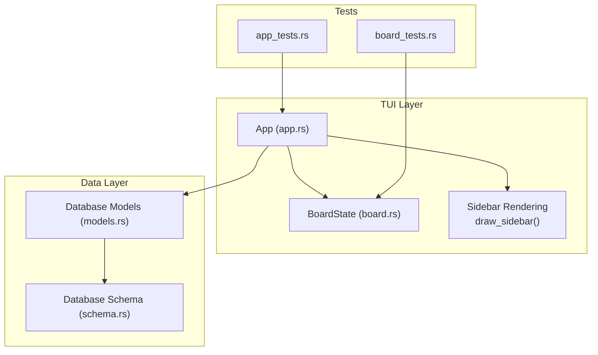
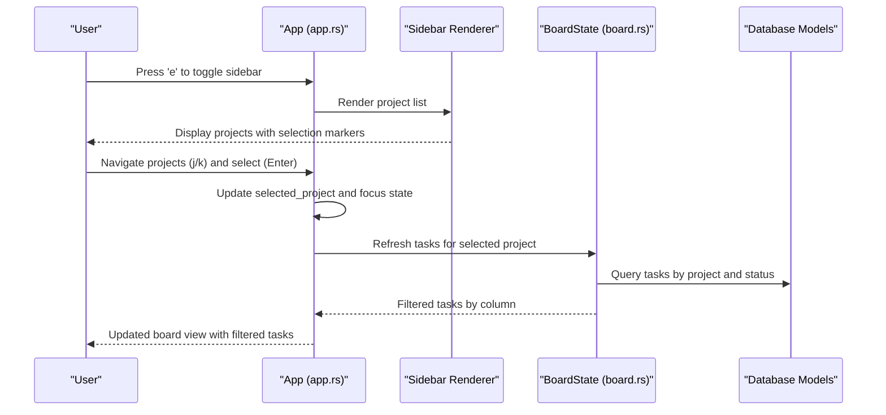
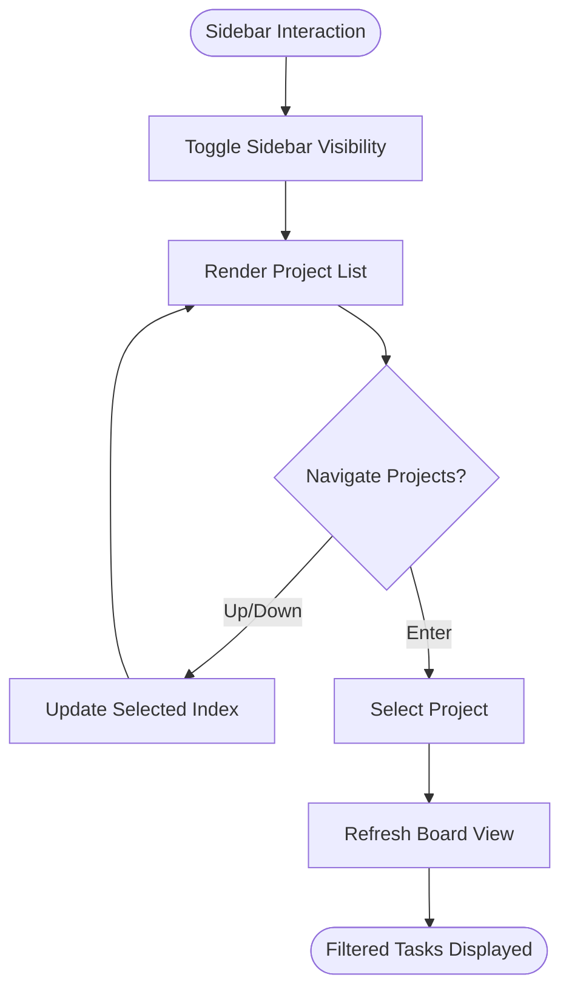
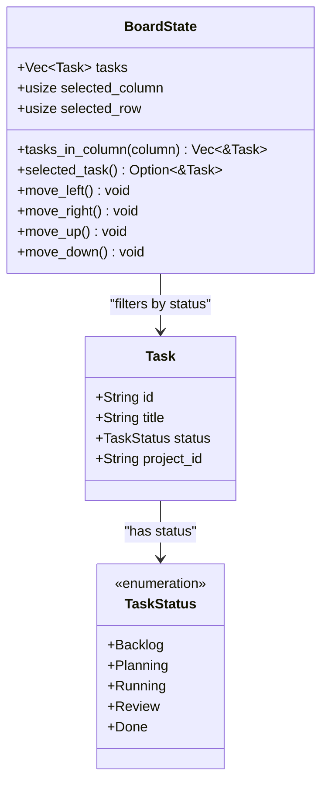
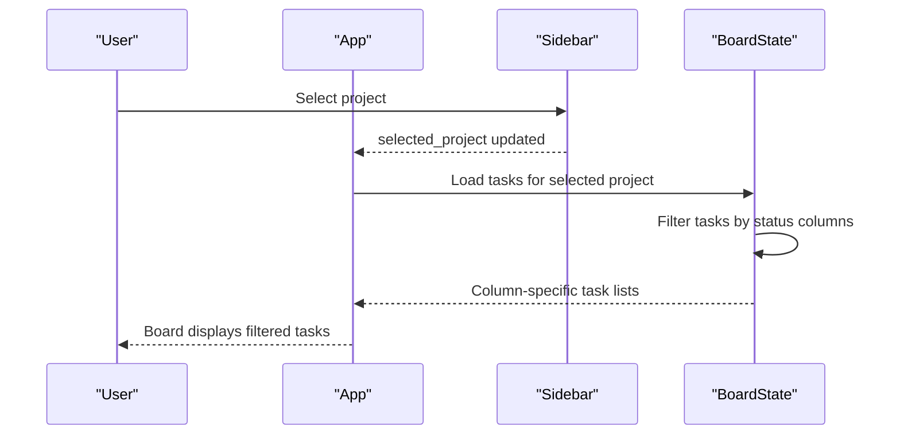
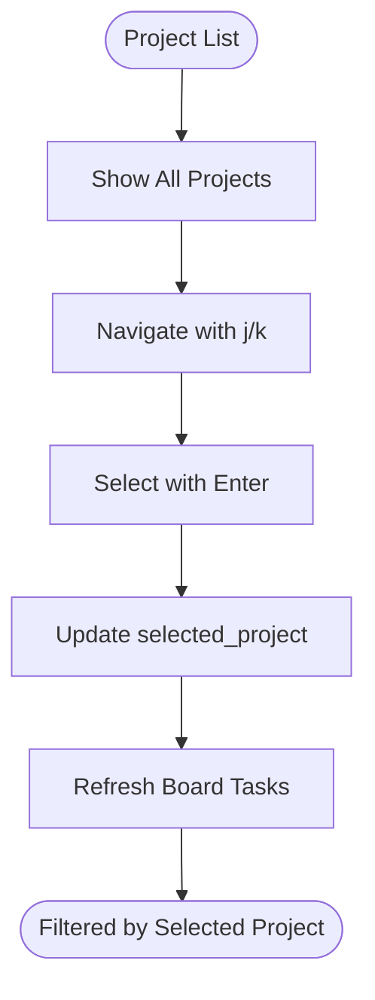
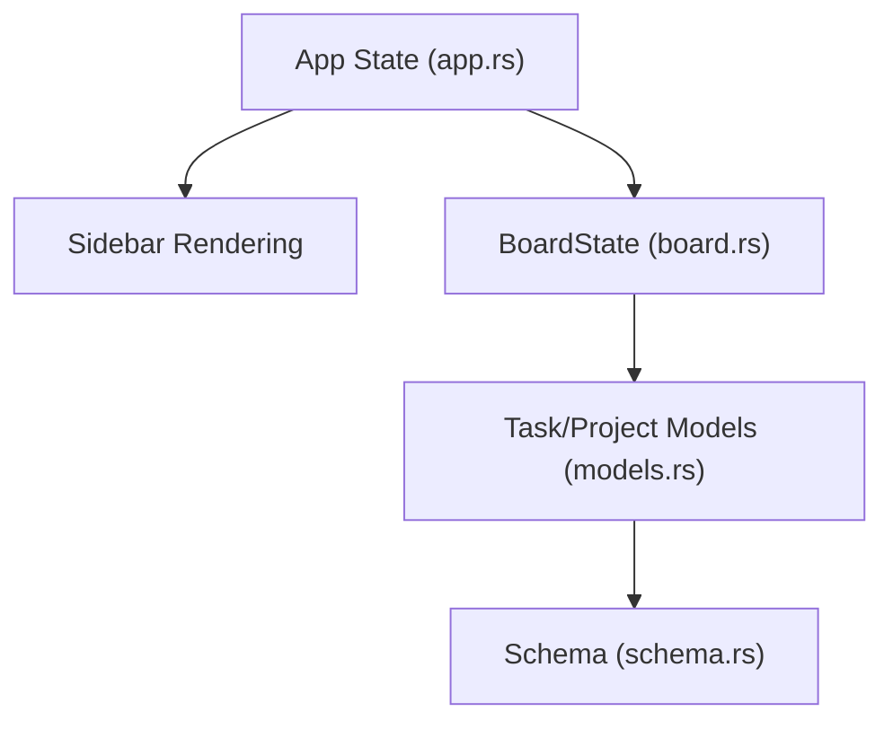

# Sidebar Filtering Options

<cite>
**Referenced Files in This Document**
- [app.rs](file://src/tui/app.rs)
- [board.rs](file://src/tui/board.rs)
- [models.rs](file://src/db/models.rs)
- [schema.rs](file://src/db/schema.rs)
- [app_tests.rs](file://tests/app_tests.rs)
- [board_tests.rs](file://tests/board_tests.rs)
</cite>

## Table of Contents
1. [Introduction](#introduction)
2. [Project Structure](#project-structure)
3. [Core Components](#core-components)
4. [Architecture Overview](#architecture-overview)
5. [Detailed Component Analysis](#detailed-component-analysis)
6. [Dependency Analysis](#dependency-analysis)
7. [Performance Considerations](#performance-considerations)
8. [Troubleshooting Guide](#troubleshooting-guide)
9. [Conclusion](#conclusion)

## Introduction
This document explains the sidebar filtering capabilities that enable users to filter projects and tasks by various criteria. It details the sidebar state management, how filtering affects the project list display, and the relationship between sidebar filtering and the main task board display. It also covers filtering options for projects (status-based filtering and project name filtering), demonstrates effective filtering combinations, and explains how filtered views impact task creation and management workflows.

## Project Structure
The filtering functionality is implemented within the TUI (Text User Interface) subsystem, primarily in the application state and rendering logic. The key components involved are:
- Application state management for sidebar visibility, focus, and project selection
- Project list rendering in the sidebar
- Board state for task display and column-based filtering
- Database models and schema for task and project data

**Diagram sources**
- [app.rs](file://src/tui/app.rs)
- [board.rs](file://src/tui/board.rs)
- [models.rs](file://src/db/models.rs)
- [schema.rs](file://src/db/schema.rs)
- [app_tests.rs](file://tests/app_tests.rs)
- [board_tests.rs](file://tests/board_tests.rs)

**Section sources**
- [app.rs](file://src/tui/app.rs)
- [board.rs](file://src/tui/board.rs)
- [models.rs](file://src/db/models.rs)
- [schema.rs](file://src/db/schema.rs)

## Core Components
This section outlines the core components that implement sidebar filtering and project/task display.

- Sidebar state and rendering:
  - The sidebar maintains visibility, focus, and selected project index.
  - The sidebar renders a list of projects with selection indicators and current project markers.
  - Navigation keys (j/k) and Enter selection are supported for project lists.

- Board state and task filtering:
  - The board state holds tasks and supports column-based filtering by task status.
  - Selection within columns is managed with row/column navigation.

- Database integration:
  - Tasks and projects are represented by database models and schema definitions.
  - Status enums define the task lifecycle stages used for filtering.

Key implementation references:
- Sidebar rendering and selection: [draw_sidebar()](file://src/tui/app.rs)
- Board state and column filtering: [BoardState](file://src/tui/board.rs)
- Task status definitions: [TaskStatus](file://src/db/models.rs)
- Task model: [Task](file://src/db/models.rs)
- Database schema: [schema.rs](file://src/db/schema.rs)

**Section sources**
- [app.rs](file://src/tui/app.rs)
- [board.rs](file://src/tui/board.rs)
- [models.rs](file://src/db/models.rs)
- [schema.rs](file://src/db/schema.rs)

## Architecture Overview
The filtering architecture connects user interactions in the sidebar and board to the underlying data model and rendering pipeline. Filtering occurs at two levels:
- Project-level filtering in the sidebar (by project name and selection)
- Task-level filtering in the board (by status columns)

**Diagram sources**
- [app.rs](file://src/tui/app.rs)
- [board.rs](file://src/tui/board.rs)
- [models.rs](file://src/db/models.rs)

## Detailed Component Analysis

### Sidebar Filtering and State Management
The sidebar provides project-level filtering and selection:
- Visibility and focus:
  - The sidebar can be toggled via a key binding and tracked in state.
  - Focus determines visual highlighting and keyboard navigation behavior.
- Project list rendering:
  - Projects are rendered as a list with selection indicators and a current project marker.
  - The list updates dynamically based on the current project path and selection index.
- Navigation and selection:
  - Users can navigate projects with j/k and select with Enter.
  - Selection updates the selected_project index and may trigger a refresh of the board view.

**Diagram sources**
- [app.rs](file://src/tui/app.rs)

**Section sources**
- [app.rs](file://src/tui/app.rs)

### Board State and Task Filtering
The board filters tasks by status columns:
- Column-based filtering:
  - Tasks are grouped by status according to the status enumeration.
  - The board exposes methods to retrieve tasks in a specific column and to select the currently focused task.
- Selection management:
  - Row and column indices track the currently selected task within the filtered view.
  - Movement functions constrain selection to the current column's task count.

**Diagram sources**
- [board.rs](file://src/tui/board.rs)
- [models.rs](file://src/db/models.rs)

**Section sources**
- [board.rs](file://src/tui/board.rs)
- [models.rs](file://src/db/models.rs)

### Relationship Between Sidebar Filtering and Board Display
Filtering in the sidebar and board is coordinated through the application state:
- Project selection:
  - Selecting a project in the sidebar updates the current project context.
  - The board refreshes to display tasks belonging to the selected project.
- Status-based filtering:
  - The board filters tasks by status columns, independent of sidebar project selection.
  - Combined filtering allows narrowing by both project and status.

**Diagram sources**
- [app.rs](file://src/tui/app.rs)
- [board.rs](file://src/tui/board.rs)

**Section sources**
- [app.rs](file://src/tui/app.rs)
- [board.rs](file://src/tui/board.rs)

### Filtering Options Available for Projects
Project filtering in the sidebar focuses on:
- Project name filtering:
  - The project list is presented as a navigable list; while explicit substring filtering is not implemented in the sidebar rendering, users can navigate quickly to a project using j/k and Enter selection.
- Project selection:
  - The current project is visually marked, and the selected project index drives downstream filtering in the board.

**Diagram sources**
- [app.rs](file://src/tui/app.rs)

**Section sources**
- [app.rs](file://src/tui/app.rs)

### Effective Filtering Combinations
Combining sidebar and board filtering yields powerful workflows:
- Narrow by project, then by status:
  - Select a project in the sidebar, then move across status columns in the board to focus on specific phases.
- Combine with search:
  - Use the task search popup to further refine tasks within a filtered view.
- Fullscreen and navigation:
  - Toggle fullscreen to maximize the board view for detailed task management within a filtered context.

These combinations streamline task creation and management by reducing cognitive load and minimizing navigation overhead.

**Section sources**
- [app.rs](file://src/tui/app.rs)
- [board.rs](file://src/tui/board.rs)

## Dependency Analysis
The filtering system depends on the following relationships:
- App state manages sidebar visibility, focus, and selected project.
- Board state depends on TaskStatus enumeration to filter tasks by column.
- Database models and schema provide the underlying data for tasks and projects.

**Diagram sources**
- [app.rs](file://src/tui/app.rs)
- [board.rs](file://src/tui/board.rs)
- [models.rs](file://src/db/models.rs)
- [schema.rs](file://src/db/schema.rs)

**Section sources**
- [app.rs](file://src/tui/app.rs)
- [board.rs](file://src/tui/board.rs)
- [models.rs](file://src/db/models.rs)
- [schema.rs](file://src/db/schema.rs)

## Performance Considerations
- Efficient rendering:
  - The sidebar and board update only when state changes occur, minimizing redraw overhead.
- Column-based filtering:
  - Filtering by status columns is O(n) per column and benefits from in-memory task caching.
- Database queries:
  - Task retrieval should be scoped to the selected project to avoid unnecessary data transfer.

## Troubleshooting Guide
Common issues and resolutions:
- Sidebar not responding to navigation:
  - Ensure the sidebar is focused and visible; navigation keys apply only when the sidebar is focused.
- Board shows empty columns:
  - Verify that tasks exist for the selected project and that the project selection is correct.
- Task search does not reflect filters:
  - Search operates independently; apply project selection first, then search within the filtered board view.

**Section sources**
- [app.rs](file://src/tui/app.rs)
- [board.rs](file://src/tui/board.rs)

## Conclusion
The sidebar filtering system provides efficient project and task management by combining project selection with status-based board filtering. Effective combinations of project selection and column navigation streamline workflows, while search and fullscreen modes enhance productivity. The modular architecture ensures maintainability and extensibility for future filtering enhancements.